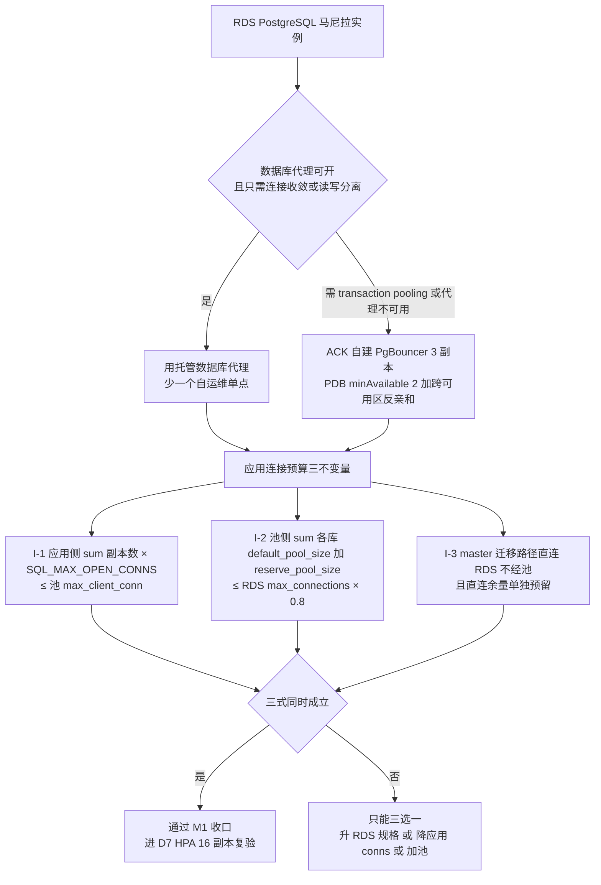
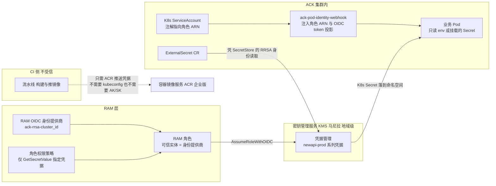

## 5. 阶段 C：D2 落地（出口、集群底座、连接池）

### 5.1 任务 6｜马尼拉 NAT 网关 + 上游出口 EIP 池（人员A，2 人时，S3）
**操作步骤**

1. **专有网络管理控制台 → NAT 网关 → 创建 NAT 网关**：地域 菲律宾（马尼拉），类型 **公网 NAT 网关**（国际站现行名；"Enhanced NAT Gateway"/「增强型 NAT 网关」是旧称，**不要照抄"增强型"**），网络类型 = **公网**，VPC `vpc-newapi-mnl-prod`，可用区 6a，关联 `vsw-mnl-pub-a`。
2. **弹性公网 IP → 申请弹性公网 IP** ×4：`eip-mnl-upstream-01..04`。计费方式 **按使用流量计费**（AI 网关流量波动大）；如需可预测成本再评估 **共享带宽包（Internet Shared Bandwidth）**。⚠ 国际站**没有国内站的"共享流量包 DTP"**，等价物是 **CDT（云数据传输 Cloud Data Transfer）**，先查其地域支持再承诺抵扣。
3. **弹性公网 IP 列表 → 绑定资源 → 资源类型 = NAT 网关 → nat-mnl-prod**，逐个绑 4 个。
4. **NAT 网关 → SNAT 管理 → 创建 SNAT 条目**：粒度选 **交换机（vSwitch）**（覆盖 app 段与 pub 段）；条目内**可勾多个 EIP 形成池**。若页面只允许单 EIP/条 → **建 4 条条目各绑 1 个 EIP**。

**验证方法**

```bash
# 在集群节点 / 私有子网 ECS 上多次执行，期望只出现 4 个已登记 EIP
for i in $(seq 1 12); do curl -s -m5 https://ifconfig.me; echo; done | sort | uniq -c
# 期望：计数只落在 4 个已知 IP 上
```
+ 控制台：NAT 网关状态 `Available`；SNAT 条目覆盖 app/pub 段；绑定 EIP 数 = 4。

**验证不通过的修复**

| 症状 | 原因 / 修复 |
| --- | --- |
| 出口出现**非池内 IP** | 有旧的单 EIP 条目，或**节点被分配了公网 IP**（Terway 下会绕过 NAT）→ 删多余条目；节点池**不勾选"分配公网 IPv4 地址"** |
| `curl` 超时 `000` | 私有交换机**没有 SNAT 条目覆盖**（按交换机建时漏了 app 段）→ 补条目 |
| EIP 绑不上 | 达到单个 NAT 网关的 EIP 上限（文档口径 10–20，4 个远小于下限）或 EIP 已被别的资源占用 |

**坑与注意事项**

- **坑 1（全案对外依赖最重）｜上游白名单建立在"出口 IP 固定且完整"之上**。新增/替换任一 EIP 而**未同步给供应商**，表现是**偶发 403 / connection reset，失败率 ≈ 1/N（4 个 EIP 就是 25%）**。
  **后果**：极难复现的"部分模型偶尔失败"，排查数天，且客户看到的是随机错误。
  **改进**：① EIP 清单做成**版本控制的台账**（§6.5）；② 上线前 **8 个 EIP 全部提交并取得供应商书面生效确认**；③ 监控按 **出口源 IP 维度**打标签统计 4xx，一眼看出是不是某个 EIP 被拒。
- **坑 2｜欠费导致 EIP 被回收后重新分配给别人**。**后果**：白名单里出现"别人的 IP"，你的新 IP 未加白 → 上游全拒。**改进**：EIP 走**包年包月**，或余额/到期双告警（§3.2）。
- **坑 3｜NAT 吞吐与 EIP 峰值带宽没显式设值**。AI 网关是**大下行**（1000 并发 ≈ 40 Mbps，方案 R39），叠加非流式大响应更高。**后果**：流式回答卡顿、超时雪崩。**改进**：NAT ≥200Mbps、EIP ≥100Mbps 并留 3× 余量；**压测必须用真实响应体大小**，不要只打小 mock（否则容量结论全废，任务 33 白做）。
- **坑 4｜用 DNAT 把节点暴露公网做调试**。**后果**：绕过 NAT 收敛面，节点直接可被扫。**改进**：**禁止 DNAT**，运维访问走 §8.5。

### 5.2 任务 12｜新加坡 VPC + 交换机 + NAT 网关 + EIP（人员A，2 人时，S4）
同 §5.1，差异：地域 `ap-southeast-1`、VPC `10.1.0.0/16`、4 个 EIP `eip-sg-upstream-01..04`、交换机见 §2.2。
**⚠ 这 4 个 EIP 有双重身份**：① 上游白名单；② **必须是马尼拉 RDS 公网白名单里唯一的来源**（§6.1）。

**验证方法**

```bash
for i in $(seq 1 8); do curl -s -m5 https://ifconfig.me; echo; done | sort | uniq -c    # 在 SG 节点上
```
**坑｜忘了这层双重身份**。**后果**：RDS 白名单只加了马尼拉 EIP → 备地域 Pod **连不上主库**，M4 直接挂。**改进**：**8 个 EIP 列在同一张台账**，标注「已进 RDS 白名单？」「已交供应商？」「生效确认时间」。

### 5.3 任务 10｜ACK Pro 集群（人员A，2 人时，S4）
**操作步骤**

1. **容器服务管理控制台 → 左侧菜单「集群」→「创建集群」** → **ACK 托管版 Pro（专业版）**（专有版 Dedicated 已停售）→ 地域 菲律宾（马尼拉）。
2. **Kubernetes 版本：1.35**（**不要填 1.31，已 EOL**，§1.1#2）；勾选 **自动升级（Auto Upgrades）**（patch 通道），升级窗口设业务低峰。
3. **网络配置**：VPC `vpc-newapi-mnl-prod`；**节点交换机**选 `vsw-mnl-pub-a/b`；**Pod 交换机**选 `vsw-mnl-app-a/b`；**网络插件 = Terway**（**建簇后不可更换**）。
   - 模式：**共享 ENI（terway-eniip）** 高密度；需要 **Pod 级独立安全组/固定 IP** 则用 **`PodNetworking` CRD**（Trunk ENI 在 1.31+ 默认开启）。
   - Service CIDR 例 `172.21.0.0/20`，**不得与 VPC / 未来 CEN / 办公网重叠（建簇后不可改）**。
4. **高级选项**：
   - **RRSA OIDC → 开启**（§5.7）
   - **API Server 连接：先保留临时公网端点便于建跳板，§8.5 完成后立即关闭**
   - **Ingress：ALB Ingress → 新建**（会自动建 AlbConfig；也可选「不创建」手写，见 §6.3）
   - **审计：开启集群 API Server 审计**（投递日志服务 SLS）
   - **监控：ack-arms-prometheus**
   - 标签按 §2.3
5. 创建 5–15 分钟。

**验证方法**

```bash
aliyun cs DescribeClusterDetail --ClusterId $ID_MNL | jq '{state,current_version,cluster_spec,profile}'
# 期望 state=running，current_version 以 1.35 开头，cluster_spec=ack.pro.*
aliyun cs DescribeClusterNodePools --ClusterId $ID_MNL | jq '.nodepools|length'
kubectl get ns; kubectl api-versions | grep network.alibabacloud.com   # Terway CRD 存在
```

**坑与注意事项**

- **坑 1｜CNI 选错不可回退**。选 Flannel 就永远没有 Pod 级安全组 → 方案的安全组设计（`sg-mnl-app` 只允许 ALB 访问 3000）**落不了地**，只能退化成 NetworkPolicy。**改进**：创建页截图存档 + 评审签字。
- **坑 2｜Service CIDR 与对端重叠**。**后果**：接 CEN/VPN 时对端路由进不来或回程丢包，且**不可修改 → 只能重建集群**。**改进**：现在就确认办公网 / 未来 CEN 不占用 `172.21.0.0/20`。
- **坑 3｜Pod 交换机地址容量**（§2.2 坑 2）。**改进**：建簇前把 free IP 记入基线。
- **坑 4｜"控制面 SLA 99.95%" 的前提**：Pro **地域级（regional）**集群 99.95%，**可用区级（zonal）**只有 99.50%。**后果**：选了跨区形态不对，SLA 推导链（方案 8.2）从根上就错。**改进**：确认选的是**多可用区（regional）**控制面。

### 5.4 任务 11/24（机型验证前置）｜ECS 节点池（人员A，4 人时；建池在 D4）
> 方案把节点池排在 D4，但**机型可用性验证必须在 D2 完成**，否则 D4 现场换机型 → 容量与压测基线全部作废。

**先验证（D2 强制动作）**

```bash
aliyun ecs DescribeAvailableResource --RegionId ap-southeast-6 --DestinationResource InstanceType \
  --InstanceChargeType PostPaid --IoOptimized optimized --NetworkCategory vpc \
  --endpoint ecs.ap-southeast-6.aliyuncs.com \
 | jq -r '.AvailableZones.AvailableZone[]|.AvailableResources.AvailableResource[]|.SupportedResources.SupportedResource[]|select(.Status=="Available")|.Value' \
 | sort -u > /tmp/mnl_types.txt

for t in ecs.g8i.2xlarge ecs.g8a.2xlarge ecs.g7.2xlarge ecs.g6.2xlarge ecs.g8y.2xlarge ecs.c8i.2xlarge; do
  grep -q "$t" /tmp/mnl_types.txt && echo "OK   $t" || echo "MISS $t"; done
# 对新加坡同样跑一遍（目录通常更大，但 96 vCPU 配额是另一码事，见 §3.4）
```
也可在 **容器服务管理控制台 → 创建节点池 → 实例规格** 直接看过滤后的可购列表（该列还显示 **「Terway 兼容性（支持 Pod 数）」**，顺手记下每机型 Pod 容量）。

**建节点池**（**容器服务管理控制台 → 节点管理 → 节点池 → 创建节点池**）

| 项 | 值 |
| --- | --- |
| 名称 | `np-mnl-app` |
| 实例规格 | **多机型**：`g8i.2xlarge` 可用则首位，否则 `g7.2xlarge` / `g8a.2xlarge` / `g6.2xlarge`（**至少 2–3 个**） |
| 系统盘 | ESSD **PL1** 100 GiB |
| 数据盘 | ESSD 300 GiB（**挂给容器运行时**，见坑 3） |
| 镜像 | **Alibaba Cloud Linux 3 容器优化版（container-optimized）**（或 ContainerOS） |
| 数量 | min 4 / max 8（§8.4 开自动伸缩） |
| 交换机 | pub-a + pub-b（**两可用区必选**） |
| 登录凭证 | **密钥对（Key Pair）**，**不分配公网 IP** |
| 节点标签 | `track=stable` `site=ph` |
| **实例自定义数据（Instance User Data）** | 见下 nofile 脚本 |

**nofile=200000（光改 limits.conf 不够）**

```bash
#!/bin/bash
set -e
cat >/etc/security/limits.d/90-newapi.conf <<'L'
* soft nofile 200000
* hard nofile 200000
root soft nofile 200000
root hard nofile 200000
L
mkdir -p /etc/systemd/system/containerd.service.d /etc/systemd/system/kubelet.service.d
printf '[Service]\nLimitNOFILE=200000\n' >/etc/systemd/system/containerd.service.d/limits.conf
printf '[Service]\nLimitNOFILE=200000\n' >/etc/systemd/system/kubelet.service.d/limits.conf
systemctl daemon-reload
systemctl restart containerd || true
```
（把上述内容填入节点池「实例自定义数据」。ACK 的 user data 在节点初始化脚本**之后**执行，故能覆盖。）

**验证方法**

```bash
kubectl get nodes -o custom-columns=NAME:.metadata.name,ZONE:.metadata.labels.'topology\.kubernetes\.io/zone',TYPE:.metadata.labels.'node\.kubernetes\.io/instance-type',STATUS:.status.conditions[-1].type
# 期望：≥4 节点 Ready，且 ZONE 同时出现 ap-southeast-6a 与 6b
# 节点内 ulimit 核对（privileged debug pod）
kubectl run chk --privileged --rm -it --image=busybox --restart=Never -- sh -c 'ulimit -n'
# 期望 200000；再看 containerd 进程：cat /proc/$(pgrep -o containerd)/limits | grep "open files"
```

**验证不通过的修复**

| 症状 | 修复 |
| --- | --- |
| 节点池卡 `Scaling`，报 `InvalidInstanceType.ValueUnauthorized` / 无库存 | 机型不在该可用区可售 → 补机型、确认双可用区覆盖；仍不行提工单查库存 |
| 节点 `NotReady` | ① Pod 交换机 IP 耗尽；② 工作节点 RAM 角色权限不足；③ 安全组挡 10250。按 `kubectl describe node` + Terway 日志定位 |
| `ulimit -n` 是 1024/65535 | 实例自定义数据未执行（填错字段/缺 `#!/bin/bash`）；**`limits.conf` 不影响已运行的 containerd，必须 `systemctl restart`** |
| 数据盘没挂上 | 节点池"数据盘"只创建不自动挂载 → 实例自定义数据里格式化并挂到 `/var/lib/containerd` |

**坑与注意事项**

- **坑 1｜把 `g8i.2xlarge` 当既定事实**（方案 R28/R15 全表都基于它，但马尼拉无公开可用性承诺）。**后果**：D4 现场改机型 → **单实例容量基线（任务 43）与压测结论（任务 33/44）全部作废要重跑**。**改进**：机型验证是 **D2 强制动作**，结果回填方案；所有文档用 `${ECS_INSTANCE_TYPE}` 变量。
- **坑 2｜ESSD 性能级别与容量耦合**：PL1 ≥20 GiB、**PL2 ≥461 GiB**、PL3 ≥1261 GiB。**后果**：300G 盘上 PL2 会被要求提到 461G，成本模型变。**改进**：300G 用 PL1；要 PL2 就重算 §9.6 成本表。
- **坑 3｜数据盘没给 containerd 用**（镜像 + 容器可写层写在 100G 系统盘）。**后果**：拉十几个大镜像 + 日志后**系统盘满 → 节点 `disk-pressure` → Pod 被驱逐 → 雪崩**。AI 网关镜像层大，这是高发事故。**改进**：数据盘格式化后挂 `/var/lib/containerd`（脚本里先 `systemctl stop containerd` 再 `mv`），或使用节点池"数据盘用作容器运行时目录"选项（新版本 ACK 提供）。
- **坑 4｜单可用区建池**。**后果**：可用区故障时副本全灭，方案 R15「单可用区故障仍有 2 副本」不成立。**改进**：池覆盖双可用区 + §7.3 拓扑打散。
- **坑 5｜节点被分配公网 IP**。**后果**：Terway 下 Pod/节点可绕过 NAT 出网 → **§5.1 的 EIP 白名单形同虚设**，上游偶发 403 且查不到原因（真实出口是那些随机 IP）。**改进**：节点池不勾选分配公网 IP；**出口 IP 核验命令每里程碑重跑一次**。
- **坑 6｜`SupportedPods` 上限**。每机型可挂 Pod 数受 `(EniQuantity-1)×EniPrivateIpAddressQuantity` 限制。**后果**：节点显示 Ready 但调度报 `Insufficient cpu` 其实是 `Insufficient attachable network interfaces`/Pod 数超限；HPA 扩到 16 副本 + DaemonSet 时最容易撞。**改进**：记下每机型的「Terway 兼容性（支持 Pod 数）」值，节点池配 ≥2 机型，并预留 DaemonSet 占用的 Pod 额度。

### 5.5 任务 13｜RDS 账号与权限最小化（人员B，1 人时，S3）
**操作步骤**

1. **云数据库 RDS 控制台 → 账号管理 → 创建账号**：
   - `newapi_migrate`（**master 专用**）：普通账号，绑主库 `newapi`，**含 DDL**（`CREATE`/`ALTER`）
   - `newapi`（**stable/canary 应用运行账号**）：普通账号，**只有 DML**（`SELECT/INSERT/UPDATE/DELETE`）
   - `newapi_sg`（备地域运行账号）：同上，**只有 DML**
   - **高权限账号（Privileged Account）** 只留一个给运维/DMS，**绝不写进任何 DSN**
2. **数据库管理 → 创建数据库** `newapi`（字符集 UTF8）；若 §4.5 选 C，另建 `newapi_log`。
3. 权限落地（SQL）：

```sql
REVOKE CREATE ON SCHEMA public FROM PUBLIC;
GRANT CONNECT, CREATE, USAGE ON SCHEMA public TO newapi_migrate;
ALTER DEFAULT PRIVILEGES IN SCHEMA public GRANT SELECT,INSERT,UPDATE,DELETE ON TABLES TO newapi;
ALTER DEFAULT PRIVILEGES IN SCHEMA public GRANT SELECT,INSERT,UPDATE,DELETE ON TABLES TO newapi_sg;
GRANT USAGE ON SCHEMA public TO newapi, newapi_sg;        -- 注意：不给 CREATE
```

**验证方法**

```bash
# 运行账号不能建表（权限边界）—— 方案 AB 列要求
psql "<newapi DSN>" -c "CREATE TABLE _t(x int);"          # 期望: permission denied for schema public
psql "<newapi_migrate DSN>" -c "CREATE TABLE _t(x int); DROP TABLE _t;"   # 期望: 成功
psql "<newapi_sg DSN>" -c "INSERT INTO users(id) VALUES(-1) ON CONFLICT DO NOTHING;"  # 期望: 成功
```

**坑与注意事项**

- **坑 1｜RDS 白名单默认分组是 `127.0.0.1`，含义是"拒绝所有"**，不是"允许本机"。**后果**：实例建好后一切连接超时，容易误判为网络/安全组问题，白查一小时。**改进**：**建实例的同一分钟就把白名单分组配好**（内网用「**添加安全组**」绑 `sg-mnl-app`，比 IP 列表可维护得多）。
- **坑 2｜两个地域共用同一账号**（方案 R18 禁止）。**后果**：凭据泄露面翻倍、无法按地域撤权、轮换没法分批。**改进**：分账号 + KMS 两个独立 Secret，轮换错开。
- **坑 3（本指南的实质加强）｜迁移账号 ≠ 运行账号**。把 DDL 权限只给 master，**备地域误以 master 启动时，数据库会直接拒绝它改 schema**。**后果**：把方案 R19 的红线从"靠约定"升级为"靠强制"——这是防"并发迁移 → 锁表/数据损坏"最有效的一招。
- **坑 4｜PG15+ 的 `public` schema 权限变化**。**后果**：AutoMigrate 报 `permission denied for schema public`，而且**只在部分 RDS 版本/参数下出现**。**改进**：建完账号**立刻跑一次真实 AutoMigrate 冒烟**，不要等到 D4。

### 5.6 任务 41｜PgBouncer / RDS 代理 + 连接数预算（人员B，3 人时，S4）
**图 7｜代理选型判据 + 连接数三不变量预算**



> **最易踩的数字陷阱**：`SQL_MAX_OPEN_CONNS` 的代码默认值是 **1000**（`model/main.go:212`，主库与日志库各设一次），不是方案里估的 300。按 16 副本算 I-1 = **16000 > max_client_conn 4000**。现象很反直觉：**HPA 扩容后反而报 `FATAL: sorry, too many clients already`，扩容变成加重故障的动作**。所以预算表必须**从 ConfigMap 反向生成**，不允许手填。

**自建 PgBouncer 关键配置**

```ini
[databases]
newapi = host=<rds-internal> port=5432 dbname=newapi
[pgbouncer]
pool_mode = session            ; ⚠ 兼容性未验证前先用 session，验证过再考虑 transaction
listen_addr = 0.0.0.0
listen_port = 6432
max_client_conn = 4000
default_pool_size = 40
min_pool_size = 5
reserve_pool_size = 10
reserve_pool_timeout = 3
query_wait_timeout = 120
server_reset_query_always = 0
ignore_startup_parameters = extra_float_digits,options
admin_users = pgb_admin
```
配 **3 副本 Deployment + Service（ClusterIP 5433→6432）+ PDB `minAvailable: 2` + 跨可用区反亲和 + KMS 注入 Secret**；完整清单参考仓库 `impl_deploy.md §7.4.5.3`。

**验证方法（任务 41 验收项）**

```sql
-- PgBouncer admin 库
SHOW POOLS;    -- cl_waiting 长期 0；sv_active < default_pool_size
SHOW STATS;    -- max_wait_us 不持续增长
-- RDS 侧
SHOW max_connections;                                   -- 记录真实上限（不可用户改，§1.2#9）
SELECT count(*) FROM pg_stat_activity;                  -- 必须 ≤ max_connections × 0.8
SELECT state, count(*) FROM pg_stat_activity GROUP BY 1; -- idle 不应大量堆积
```
+ HPA 扩到 16 副本期间重复上面的观测，**PG 连接数不撞上限**。

**验证不通过的修复**

| 症状 | 修复 |
| --- | --- |
| `cl_waiting` 持续 >0 | `default_pool_size` 太小 → 调大；或有**慢查询长期占用服务端连接**（查 `pg_stat_activity` 中 `xact_start` 很老的） |
| `query_wait_timeout` 报错 | 池饱和 → 提 `reserve_pool_size`；**真正的根因常在应用侧 `SQL_MAX_OPEN_CONNS` 太大** |
| DDL/迁移失败或怪异 | 迁移走了池 → 强制 master 直连 |
| `prepared statement already exists` / `SET` 不生效 | **transaction 模式与会话语句冲突** → 改 `pool_mode=session` 或应用侧关 prepared statements |

**坑与注意事项**

- **坑 1（最隐蔽）｜transaction 模式下会话级状态泄漏**：`SET`/`SET LOCAL`、prepared statements、advisory lock、`LISTEN/NOTIFY`、跨语句事务都会出错（方案 §7.4.5.4 称"兼容性红线"）。**后果**：**计费/余额相关的偶发、不可复现的错误**——**比宕机更可怕，因为它悄悄改数据**。**改进**：① 默认 `pool_mode=session`（牺牲收敛保正确）；② 只有跑完**经池的三数据库矩阵 + 余额对账压测**后才允许切 transaction；③ 把这条写进上线检查表（§14）。
- **坑 2｜PgBouncer 是新增全站单点**（方案 R21）。**后果**：池挂 = 所有副本连不上库 = 整站不可用，**故障域从"节点级"放大到"全局"**。**改进**：3 副本 + PDB + 反亲和；应用侧重连 + `RetryTimes`；**预置"回退直连 DSN"应急开关并演练**（§13.4）；PgBouncer 不接公网。
- **坑 3｜`SQL_MAX_OPEN_CONNS` 用了代码默认值**。`model/main.go:212` 默认 **1000**，且主库与日志库**各设一次**。**后果**：预算表按 300 估 → 实际 1000×16 = 16000 → `FATAL: sorry, too many clients already`，全站 5xx + **计费写入失败（资损）**。**改进**：**DSN/env 必须显式给值**；预算表**从 ConfigMap 反向生成**，不手填。
- **坑 4｜RDS `max_connections` 不可用户修改**（方案 R38 说"三者对齐"，实际只能通过**升规格**改变）。**后果**：以为调参数能救，白折腾。**改进**：预算不满足时只有三条路——升 RDS 规格、降应用 conns、加池。把结论写回 G11 文档。
- **坑 5｜池的 TLS 与 `verify-full` 冲突**（§4.2/§6.1）。**改进**：DSN 规范两段式——**应用→池 `verify-ca`/`require`（集群内网）**，**池→RDS `verify-full`（内网 + 绑内网地址证书）**。

### 5.7 任务 17（预置）｜RRSA + KMS + Secret 注入链路（人员B，S4 起）
**图 8｜密钥注入信任边界（谁在什么时刻拿到什么）**



**读图三条边界**

1. **CI 不持有云账号密钥**：流水线只做构建 + 推 ACR；它既不需要 kubeconfig 也不需要长期 AK/SK。这决定了"CI 机器被拿下"不等于"生产被拿下"。
2. **凭证是短时投影**：Pod 通过 webhook 注入的 OIDC token 去 `AssumeRoleWithOIDC`，换到的是临时凭证；KMS Secret 值不落镜像、不落 Git、不落 CR。
3. **KMS 是地域级服务**：马尼拉的凭据新加坡读不到。备地域的 ExternalSecret 必须在**新加坡另建一套凭据并在双写流程里同步**（§9.1），否则接管时直接起不来——这是 M4 演练最常见的失败点。

**操作步骤**

1. 集群已开 RRSA（§5.3）。**容器服务管理控制台 → 集群列表 → 目标集群 → 集群信息 → 安全与审计 → RRSA OIDC**，鼠标悬停「已开启」复制 **OIDC Provider ARN** 与 **Issuer URL**；ACK 自动创建 RAM 身份提供商 `ack-rrsa-<cluster_id>`。
2. 安装组件 **`ack-pod-identity-webhook`**（「组件管理」→「安全」）。
3. 建 RAM 角色（可信实体 = 身份提供商），信任策略：

```json
{ "Version": "1", "Statement": [{
  "Action": "sts:AssumeRole", "Effect": "Allow",
  "Principal": { "Federated": ["<oidc_provider_arn>"] },
  "Condition": { "StringEquals": {
    "oidc:aud": "sts.aliyuncs.com",
    "oidc:iss": "<rrsa_issuer_url>",
    "oidc:sub": "system:serviceaccount:new-api:new-api-app" } }} ] }
```
授权：**KMS 凭据只读**（`AliyunKMSCryptoUserAccess` 或更小的自定义策略）+ 按需 OSS。
4. **密钥管理服务 KMS → 凭据管理 → 创建凭据**：`new-api/prod/sql-dsn`、`sql-dsn-migrate`、`redis-conn-string`、`session-secret`、`pay-channel-keys`、`tls-wildcard`。**RDS 型凭据支持自动轮换（6h–365d）**；**通用（Generic）型不会自动换内容**（需 FC 轮换钩子，或按 90 天人工轮换）。
5. 集群侧注入（二选一）：
   - **A（官方推荐）**：组件 **`ack-secret-manager`**（KMS/OOS → K8s Secret 同步）
   - **B**：CSI **`csi-secrets-store-provider-alibabacloud`** + `SecretProviderClass`（`provider: alibabacloud`，文件挂载）
   - （External Secrets Operator 的 `alibaba` provider 为社区维护，**不作生产默认推荐**）
6. 命名空间与 ServiceAccount：

```bash
kubectl create ns new-api --dry-run=client -o yaml | kubectl apply -f -
kubectl label ns new-api pod-identity.alibabacloud.com/injection=on
kubectl create sa new-api-app -n new-api
kubectl annotate sa new-api-app pod-identity.alibabacloud.com/role-name=<kms_role> -n new-api
```

**验证方法**

```bash
kubectl run rrsa-test --rm -it --image=busybox --restart=Never -n new-api \
  --overrides='{"spec":{"serviceAccountName":"new-api-app"}}' \
  -- sh -c 'env | grep ALIBABA_CLOUD_ ; ls -l $ALIBABA_CLOUD_OIDC_TOKEN_FILE'
# 期望出现 ALIBABA_CLOUD_ROLE_ARN / OIDC_PROVIDER_ARN / OIDC_TOKEN_FILE
kubectl -n new-api exec deploy/new-api-stable -- sh -c 'test -n "$SESSION_SECRET" && echo secret-injected'
git log -p --all | grep -icE "SESSION_SECRET=|SQL_DSN=postgres://"      # 期望 0
```

**验证不通过的修复**

| 症状 | 修复 |
| --- | --- |
| Pod 内无 `ALIBABA_CLOUD_*` | 命名空间缺标签 / ServiceAccount 缺 `role-name` 注解 / webhook 组件未装或未 Ready |
| `AssumeRoleWithOIDC ... not authorized` | `oidc:sub` 与实际 `system:serviceaccount:<ns>:<sa>` **不完全一致（逐字符，含大小写）** |
| 挂载的 Secret 文件为空 | `SecretProviderClass` 的 `objectName` 拼错，或角色缺 `kms:GetSecretValue` 权限 |

**坑与注意事项**

- **坑 1｜ServiceAccount Token 上限 12 小时**（开 RRSA 后）。**后果**：进程**缓存了临时凭据** → 每 12 小时集中失效，出现"每隔半天随机 401"。**改进**：**永不缓存 token 文件内容**，用官方 SDK 凭据链（Go SDK 自动读这三个 env 并刷新）。
- **坑 2｜`SESSION_SECRET` 多集群不一致**。`common/init.go:50-55`：值为默认 `random_string` 时**直接 `log.Fatal` 起不来**（好事）；但**两地值不同**时，GTM 一切到新加坡 → **所有在线会话立刻失效、用户全部被踢出登录**（方案 R40 红线）。**改进**：两集群注入**同一个 KMS Secret 名**；轮换走 §9.5 双密钥过渡。
- **坑 3｜把 KMS 凭据导出成 ConfigMap 图省事**。**后果**：ConfigMap 不是 Secret 对象，RBAC/审计弱一档，极易被 `kubectl get cm -o yaml` 粘进工单。**改进**：只允许 `Secret` + 外部注入；开启 ACK **Secret 落盘加密（KMS 信封加密）**。
- **坑 4｜备集群没重复做 RRSA/ACR/VPC 关联**（每个集群是独立个体）。**后果**：接管时 Pod `ImagePullBackOff` 或拿不到 Secret → **接管失败，M4 不过**。**改进**：所有集群侧配置**用同一套 IaC/Helm values 按地域渲染**，禁止手工点两遍。

### 5.8 任务 14｜RDS 备份策略（PITR 7 天 + WAL）（人员B，1 人时，S3）
**操作步骤**：**云数据库 RDS 控制台 → 实例 → 备份恢复 → 备份策略 / 变更设置**：
- 数据备份保留：**7 天**（方案 R17 口径；范围 7–730，**建议 30 天**更稳）
- 备份时间窗口：UTC+8 **18:00–19:00**（马尼拉低峰，按实际调）
- **日志备份（WAL）：必须开启** → PITR 的前提
- 跨地域备份：`【控制台核实】` 马尼拉是否支持备份到新加坡；不支持则用 **DBS（数据库备份）** 或逻辑备份到 OSS + CRR

> **⚠ 现实约束**：**ESSD 云盘实例的备份文件不能直接下载**（只有老的本地 SSD 支持）。方案 R17 写的"每日全量 + WAL 归档 OSS"——**RDS 自动备份并不落在你自己的 OSS 里**。三选一写进方案：
> 1. 接受备份在 RDS 托管侧，用 **恢复到新实例（Restore to new instance）** 做演练（够用、最省）；
> 2. **DBS（数据库备份）** 做物理/逻辑备份到 `oss-newapi-mnl` + CRR 到新加坡 → 满足"OSS 归档"的字面要求；
> 3. 每周 `pg_dump` 到 OSS（DMS 定时任务），仅作**离线合规副本**。

**验证方法**

```bash
aliyun rds DescribeBackupPolicy --DBInstanceId <id> | jq '{BackupRetentionPeriod,EnableBackupLog,LogBackupRetentionPeriod,PreferredBackupTime}'
# 期望 EnableBackupLog=1 且 BackupRetentionPeriod>=7
aliyun rds DescribeBackups --DBInstanceId <id> | jq '.Items.Backup[]|{BackupId,BackupStartTime,BackupMethod,BackupStatus}' | head
```
+ 控制台「备份恢复 → 恢复」页面**能看到可选的时间点** = 方案 AB 列的"有可恢复时间点"。

**验证不通过的修复**：无备份记录 → 窗口未到，手动**创建备份**验一次；`EnableBackupLog=0` → 日志备份被关（**PITR 不可用，RPO 立刻从分钟级掉到 24h 级**）→ 重开并等一个 WAL 周期再验。

**坑与注意事项**

- **坑 1｜从没做过恢复演练**。备份 ≠ 可恢复。**后果**：真出事才发现恢复要 4 小时 / 恢复出的实例连不上 / 数据不一致。**改进**：**任务 50（§6.6）做 PITR 恢复演练并回填实测 RPO/RTO**，这是 M5 的硬证据。
- **坑 2｜演练选"覆盖原实例"**。**后果**：演练变事故。**改进**：一律**恢复到新实例**，验完删除；写进 Runbook 红字（§13.3）。
- **坑 3｜恢复耗时没有 SLA 承诺**。64GB 级 PITR 需按 **1.5–4 小时**预算（快照 + WAL 回放）。**后果**：SLA 承诺的"RTO ≤5min"在**地域级故障**下**根本不成立**（方案 R26 自己承认，属排除项②）。**改进**：演练实测值写进 M5；客户不接受 → 唯一解是第三地域主库（超出本次范围，需重新立项）。

### 5.9 D2 出口检查（M1 收口）
```
☐ 马尼拉/新加坡 NAT + 8 EIP 出口 IP 核验通过（只出现池内 IP）
☐ 机型可用性验证完成，${ECS_INSTANCE_TYPE} 候选表已回填
☐ ACK Pro 马尼拉 running + RRSA Enabled + CNI=Terway（截图存档）
☐ RDS 白名单绑定 sg-mnl-app（不是 127.0.0.1 空组）
☐ RDS 三账号权限边界验证通过（migrate / app / sg 各一条命令）
☐ PgBouncer/DB Proxy 就绪，SHOW POOLS 的 cl_waiting=0
☐ 备份策略 EnableBackupLog=1，可恢复时间点可见
☐ SESSION_SECRET 在两集群的注入源为同一 KMS Secret
```
