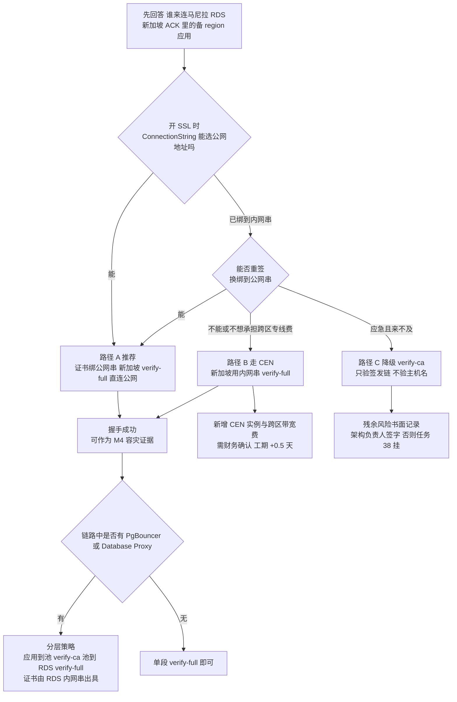

## 6. 阶段 D：D3 落地（任务 15、17、19、24、50、56）

> D3 的六件事互相独立度很高：**人员B** 走数据线（#15 → #17 → #50），**人员A** 走接入与备地域线（#19 → #24 → #56）。全部落在 S5–S6 两个时段（各 4 人时上限）。

### 6.1 任务 15｜开启 RDS 公网地址并把白名单收死（数据线的门槛）

这一步是整个方案里**最容易做成"看似安全、实则裸奔"**的一步：公网地址一开，默认白名单组若是 `default` 且被人填成 `127.0.0.1`，等于"任何人都连不上"；若填成 `0.0.0.0/0`，等于"任何人都能连"。两种都是错的，且都不会有任何告警。

#### 操作步骤

**Step 1 — 申请公网地址**

RDS 控制台 → 左侧菜单「实例列表」→（rds-mnl-newapi）→「数据库连接」，点 **申请外网地址**。 CLI 等价：

```bash
aliyun rds AllocateInstancePublicConnection \
  --RegionId ap-southeast-6 \
  --DBInstanceId ${RDS_MNL_ID} \
  --ConnectionStringPrefix ${RDS_MNL_ID}pub \
  --Port 5432
```

国际站公网地址后缀通常是 `.pg.rds.aliyuncs.com`（PG 高可用版），记下**完整地址**：

```bash
aliyun rds DescribeDBInstanceNetInfo --DBInstanceId ${RDS_MNL_ID} \
  | jq -r '.DBInstanceNetInfos.DBInstanceNetInfo[] | [.IPType,.ConnectionString,.Port] | @tsv'
# 期望两行：Inner / Public
```

**Step 2 — 先做 TLS 证书的地址绑定决策（P0-4，务必在开 SSL 之前定）**

RDS 的服务器证书 **CN/SAN 只绑定"开启 SSL 时所选的那个连接地址"**。所以顺序必须是：*先决定新加坡用哪个地址连，再开 SSL*。

```bash
aliyun rds DescribeDBInstanceSSL --DBInstanceId ${RDS_MNL_ID} | jq '{ssl_enabled:.SSLEnabled,conn_str:.ConnectionString,ca:.CAType}'
```

**图 9｜跨区 TLS 路径决策（P0-4，决定 M4 能否过）**



> **失败长这样**：`server certificate for "pgm-xxx.pg.rds.aliyuncs.com" does not match host name "pgm-xxxo..."`。根因永远是同一句话——**证书 CN/SAN 绑的是"开 SSL 那一刻选的那个连接地址"**。所以顺序不能反：先定地址，再开 SSL。一旦绑错，只能关 SSL 重开或走路径 B/C。

三条可选路径（按推荐度）：

| 路径 | 做法 | 适用 | 代价 |
| --- | --- | --- | --- |
| **A（推荐）** | 开 SSL 时 `ConnectionString` 选**公网地址**；新加坡侧 `sslmode=verify-full` 直连公网 | 只有新加坡一个备 region | 内网地址走同一条连接串的应用需要额外配一份证书；证书与地址绑定后**换地址必须重签** |
| B | 走 **CEN（云企业网）** 打通马尼拉 VPC ↔ 新加坡 VPC，新加坡用**内网地址** + verify-full | 网络团队接受跨区专线成本 | 引入 CEN 实例+跨区带宽费（impl_deploy.md 7.10 未计入），需财务确认；工期 +0.5 天 |
| C | 新加坡侧 `sslmode=verify-ca`（只验签发链、不验主机名） | 应急 | **必须书面记录残余风险并让架构负责人签字**，否则安全核查（任务 38）会挂 |

开 SSL（以路径 A 为例，务必选公网串）：

```bash
aliyun rds ModifyDBInstanceSSL --DBInstanceId ${RDS_MNL_ID} \
  --ConnectionString ${RDS_MNL_PUB} --Port 5432 --SSLEnabled 1 --CaEnabled 0
# 换证书/换地址用同一命令重复调用（CARequired 参数在部分版本为必填，报参数错就补 --CaEnabled 0 --RequireUpdate yes）
aliyun rds DescribeDBInstanceSSL --DBInstanceId ${RDS_MNL_ID} | jq '.SSLEnabled'   # 期望 1
```

**Step 3 — 白名单：只放新加坡 4 个 NAT EIP**

```bash
# 3.1 建独立白名单组，名字与用途绑定，禁止复用 default
aliyun rds ModifySecurityIps --DBInstanceId ${RDS_MNL_ID} \
  --DBInstanceIPArrayName sg_standby_eip \
  --SecurityIps "${SG_EIP_01}/32,${SG_EIP_02}/32,${SG_EIP_03}/32,${SG_EIP_04}/32" \
  --WhitelistNetworkType MIX

# 3.2 把 default 组显式设为不可命中（不是 127.0.0.1 那种"看起来安全"）
aliyun rds ModifySecurityIps --DBInstanceId ${RDS_MNL_ID} \
  --DBInstanceIPArrayName default --SecurityIps "127.0.0.1"

# 3.3 主站内网侧使用 SG 绑定的白名单组（ACK Pod 用 vSwitch app 网段）
aliyun rds ModifySecurityIps --DBInstanceId ${RDS_MNL_ID} \
  --DBInstanceIPArrayName mnl_vpc --SecurityIps "10.0.32.0/20,10.0.48.0/20,10.0.64.0/20,10.0.80.0/20"
```

**Step 4 — 强制 TLS 只允许（PG 侧参数）**

RDS PG 可通过参数 `rds_force_transitions_readonly`（无关）；这里要的是 **`log_connections` + 拒绝明文**。国际站 RDS PG 可控参数里勾选：

```bash
aliyun rds DescribeParameters --DBInstanceId ${RDS_MNL_ID} \
  | grep -Ei "ssl|force" 
# 若存在 requires_ssl / rds_enable_ssl 类可改参数，设为 1；不可改则记录为"仅靠客户端 sslmode + 白名单"两层控制
```

#### 验证方法

```bash
# V1 公网 TLS 握手（在 NEW加坡任一集群节点或同 region ECS 上执行）
openssl s_client -connect ${RDS_MNL_PUB}:5432 -starttls postgres -servername ${RDS_MNL_PUB} 2>/dev/null \
  | openssl x509 -noout -subject -ext subjectAltName
# 期望：CN 或 SAN 中【包含】${RDS_MNL_PUB}

# V2 白名单正例：新加坡 NAT 出口能连
psql "host=${RDS_MNL_PUB} port=5432 dbname=postgres user=newapi_sg sslmode=verify-full sslrootcert=./apsaradb-ca.pem" \
  -c "select current_setting('server_version'), inet_server_addr(), now();"

# V3 白名单反例：非白名单 IP 必须被丢
timeout 8 psql "host=${RDS_MNL_PUB} port=5432 dbname=postgres user=newapi_sg sslmode=disable" -c "select 1"
# 期望：timeout / connection refused，绝不能返回 1 行结果

# V4 明文必须被拒（若第 4 步生效）
psql "host=${RDS_MNL_PUB} port=5432 dbname=postgres user=newapi_sg sslmode=disable" -c "select 1"
# 期望：FATAL: no pg_hba.conf entry for host ... no SSL
```

#### 验证不通过的修复

| 症状 | 根因 | 修复 |
| --- | --- | --- |
| `server certificate for "pgm-xxx.pg.rds.aliyuncs.com" does not match host name "pgm-xxxpub..."` | SSL 开在内网串上（P0-4 命中） | 用 Step 2 路径 A：`ModifyDBInstanceSSL --ConnectionString <公网串>` 重签，再 `DescribeDBInstanceSSL` 复核；无法改则临时 `verify-ca` 并走 C 的签字流程 |
| `timeout` 且 `nc -vz` 也不通 | NAT SNAT 条目未覆盖新 Pod 网段，或 EIP 不是登记的那 4 个 | 在**新加坡节点上**跑 `for i in 1 2 3 4 5; do curl -s https://ifconfig.me; echo; done`，把真实出口 IP 补进白名单组 |
| 连上但 `inet_server_addr()` 返回的内网地址 | 你连的其实是 VPC 内另一条链路 | 说明走的是 CEN/对等，属好事；但要在验收记录里写清"实际路径"，否则 M4 证据链口径不一致 |
| 白名单改了 10 分钟仍不生效 | 控制台改的是**只读实例**的白名单 | 主实例 `DescribeDBInstances` 里核对 `DBInstanceId`，只读实例白名单不继承 |

#### 坑与注意事项

- **坑 1｜"127.0.0.1 = 禁止一切"是错觉。** 现象：安全组/白名单填 `127.0.0.1` 后主站应用连不上。后果：D3–D4 排障方向全错，误以为 RDS 故障。改进：白名单必须**按用途分命名组**（`mnl_vpc` / `sg_standby_eip`），每组都有明确 owner；在 §12 验收里要求"贴白名单组截图，而不是贴 default 组"。
- **坑 2｜NAT EIP 会被换。** 现象：某天开始新加坡突然连不上主库。后果：备 region 静默失去接管能力，直到真正切换时才发现（RTO 直接爆）。改进：§11.3 的**备 region → 马尼拉 RDS TCP 拨测**必须绑定"连接失败率"告警；EIP 解绑/重绑列入变更审批（§8.5 运维访问面）。
- **坑 3｜`AllocateInstancePublicConnection` 的地址串一旦释放不能再拿回。** 后果：应用配置、RDS 证书、上游白名单全要重配。改进：**永不释放公网串**；不需要外网访问时把白名单清空即可，而不是释放地址。
- **坑 4｜把公网串写进 Git 的 ConfigMap 明文。** 后果：Git 历史不可撤销，安全核查（任务 38）直接判不合格。改进：DSN 只进 **KMS 凭据管家**，见 §6.2。
- **坑 5｜白名单加了但没加 `/32`。** 后果：填 `47.x.x.x` 被规范成 `47.x.x.0/24`，意外放行整段。改进：一律显式 `/32`，并用 `DescribeDBInstanceIPArrayList` 复核 CIDR 掩码。

### 6.2 任务 17｜Namespace / ConfigMap / Secret（KMS + RRSA + ExternalSecret）

这是"密钥不落 Git"这条红线真正落地的地方，也是后面所有 Deployment 的公共前提。

#### 操作步骤

**Step 1 — Namespace 与资源配额**

```yaml
# k8s/base/namespace.yaml
apiVersion: v1
kind: Namespace
metadata:
  name: new-api
  labels: {project: new-api, site: ph-mnl, env: prod}
---
apiVersion: v1
kind: ResourceQuota
metadata: {name: new-api-quota, namespace: new-api}
spec:
  hard: {requests.cpu: "48", requests.memory: 96Gi, limits.cpu: "64", limits.memory: 128Gi}
```

配额数字来自 §2.1 基线（4 副本 × request 2C/4G，留 4 倍 HPA 余量）。**注意 ResourceQuota 超了不会报错给 Deployment，只会让 Pod 卡在 `Forbidden: exceeded quota`**，所以先设后部署。

**Step 2 — ConfigMap（非敏感运行参数）**

```yaml
# k8s/base/configmap.yaml
apiVersion: v1
kind: ConfigMap
metadata: {name: new-api-config, namespace: new-api}
data:
  TZ: "Asia/Manila"
  NODE_TYPE: "slave"            # ⚠ 见坑 1，绝不能留空（master Deployment 单独覆盖）
  MEMORY_CACHE_ENABLED: "false" # prod 硬约束：多副本本地缓存会导致额度/配置不一致
  SYNC_FREQUENCY: "30"          # 方案要求 30；代码默认 60（common/init.go:110）必须显式覆盖
  SQL_MAX_OPEN_CONNS: "150"     # 与 §5.6 连接数预算一致；代码默认 1000（model/main.go:212）
  LOG_SQL_MAX_OPEN_CONNS: "50"
  GLOBAL_API_RATE_LIMIT: "360"  # 与代码默认一致，显式写出避免误解
  GLOBAL_API_RATE_LIMIT_DURATION: "180"
  SESSION_MAX_AGE: "2592000"
  ERROR_LOG_LEVEL: "warn"
  LOG_DIR: "/app/logs"
```

**Step 3 — ExternalSecret（KMS 凭据管家 → Secret）**

前置：§5.7 已建 RRSA 角色 + ACK 装了 `ack-secret-manager` / CSI Secrets Store Provider。

```yaml
apiVersion: alibabacloud.com/v1alpha1
kind: ExternalSecret
metadata: {name: new-api-secret, namespace: new-api}
spec:
  refreshInterval: 1h
  smSecret:
    name: new-api-secret          # 生成的 K8s Secret 名
    des:
      nameTemplate: "new-api-secret"
    fetch:
    - key: aone/newapi/prod/SQL_DSN
    - key: aone/newapi/prod/LOG_SQL_DSN
    - key: aone/newapi/prod/REDIS_CONN_STRING
    - key: aone/newapi/prod/SESSION_SECRET
    - key: aone/newapi/prod/SESSION_SECRET_OLD   # 双密钥轮换用，见 §9.9
    - key: aone/newapi/prod/PAYMENT_PRIVATE_KEY
---
apiVersion: secretsstore.csi.alibabacloud.com/v1alpha1
kind: SecretProviderClass    # 仅当走 CSI 直挂模式时使用；与 ExternalSecret 二选一
```

**Step 4 — Pod 侧引用**

```yaml
envFrom:
- configMapRef: {name: new-api-config}
env:
- name: SQL_DSN
  valueFrom: {secretKeyRef: {name: new-api-secret, key: SQL_DSN}}
serviceAccountName: new-api-app     # 与 RRSA 角色绑定的 SA
```

**Step 5 — 应用（新加坡集群同构，仅 `site`/`NODE_TYPE`/DSN 不同）**

```bash
kubectl apply -f k8s/base/namespace.yaml -f k8s/base/configmap.yaml -f k8s/base/externalsecret.yaml
kubectl -n new-api get externalsecret new-api-secret \
  -o jsonpath='{.status.conditions[*].type}{"\n"}'   # 期望 True / Ready
```

#### 验证方法

```bash
# V1 Secret 已生成且键齐全
kubectl -n new-api get secret new-api-secret \
  -o jsonpath='{.data}' | jq 'keys'
# 期望：SQL_DSN / LOG_SQL_DSN / REDIS_CONN_STRING / SESSION_SECRET / SESSION_SECRET_OLD / PAYMENT_PRIVATE_KEY

# V2 密钥确实来自 KMS（改 KMS 值 → 1 个 refresh 周期内 K8s 侧跟随）
#   控制台改 aone/newapi/prod/SESSION_SECRET 末尾加 "-t"，等 60s：
kubectl -n new-api get secret new-api-secret -o jsonpath='{.data.SESSION_SECRET}' | base64 -d
# 期望：以 -t 结尾（验完改回）

# V3 Pod 内环境变量正确且无明文外泄
kubectl -n new-api exec deploy/new-api-stable -- env | grep -Ei "NODE_TYPE|MEMORY_CACHE|SYNC_FREQ|SQL_MAX" | sort
# 期望与 ConfigMap 完全一致

# V4 RRSA 生效（Pod 内能拿到 STS）
kubectl -n new-api exec deploy/new-api-stable -- sh -c \
  'ls -l "$ALIBABA_CLOUD_OIDC_TOKEN_FILE" && env | grep ALIBABA_CLOUD_ROLE'
# 期望：token 文件存在、role arn 非空

# V5 Git 无密钥扫描（任务 38 的前置）
git log -p --all | grep -Eci "LTAI[0-9A-Za-z]{16}|-----BEGIN (RSA|EC) PRIVATE KEY-----"
# 期望 0
```

#### 验证不通过的修复

| 症状 | 根因 | 修复 |
| --- | --- | --- |
| ExternalSecret 一直 `Ready=False`，事件里 `Forbidden` | RRSA 角色缺 `kms:GetSecretValue`，或 Resource 未包含该 Secret 名 | 补策略到具体 Secret ARN（不要给 `*`）；确认 SA annotation `pod-identity.alibabacloud.com/role-name` |
| Secret 生成了但 Pod 里读到旧值 | Pod 不感知 Secret 轮转（env 引用只在启动时注入） | 加 `checksum/config` annotation 触发滚动，或 `kubectl -n new-api rollout restart deploy/new-api-stable` |
| `exceeded quota` 卡 Pending | ResourceQuota 与 request/limit 口径不一致 | 按 §2.1 重算；limit 也要计入 quota，不要只算 request |
| V2 不跟随 | `refreshInterval` 太长或 KMS 凭据被托管到其他实例 | 调成 5m 验证；确认 `SecretsManager` 实例与集群同 region |

#### 坑与注意事项

- **坑 1｜`NODE_TYPE` 留空 = 全集群变成 master（重大隐患）。** 代码事实：`common/init.go:89` 是 `IsMasterNode = os.Getenv("NODE_TYPE") != "slave"` —— **字符串不等判断**，空值、`Slave`、`SLAVE`、带空格全部被判定为 master。后果：stable 副本会并发改表结构 + 并跑 master-only 定时任务，出现重复扣费/重复对账/迁移死锁，属**资金级事故**。改进：① ConfigMap 里**显式写死** `NODE_TYPE: "slave"`；② 加 OPA/Kyverno 或 `kubectl --dry-run` CI 规则：`env.NODE_TYPE` 缺失或 != "slave" 则拒绝合入；③ §11.6 上线检查表逐条打勾。
- **坑 2｜`MEMORY_CACHE_ENABLED=true` 留到多副本环境。** 后果：额度、渠道权重、系统配置在多 Pod 间不一致，用户看到"余额随机跳变"。改进：prod 恒为 `false`（impl_deploy.md 已列），只在单副本 staging 允许 true。
- **坑 3｜`SESSION_SECRET` 两集群不一致。** 后果：GTM 切到新加坡后**全员登录态失效 + 已签发令牌 401**，接管等于雪崩。改进：两集群必须指向**同一 KMS Secret Key**（不是"复制同样的值"），并在 §9.9 演练双密钥轮换。
- **坑 4｜把 ConfigMap 改了以为生效。** 后果：`SYNC_FREQUENCY` 仍是 60，配置跨节点收敛变慢，D7 任务 53 验证不过。改进：**ConfigMap/Secret 任何变更 → `rollout restart`**，写进 Runbook。
- **坑 5｜KMS 凭据版本与 `SESSION_SECRET_OLD` 混用。** 后果：轮换窗口内新旧密钥都失效。改进：轮换时只把"旧值"复制到 `_OLD` 键，新值写主键（见 §9.9）。
- **坑 6｜国际站 KMS 实例是 region 级。** 新加坡 Pod 读马尼拉的 Secret 要走公网/跨区，且要单独授权。改进：两 region 各建 KMS 实例，用**同一份 Secret 内容**双写（或只在新加坡存"备 region 需要的键"），并在 §9.5 带宽成本里计入跨区调用次数。

### 6.3 任务 19｜马尼拉 ALB + AlbConfig + 健康检查

#### 操作步骤

**Step 1 — 装组件**（ACK 控制台 → 组件管理 → **ALB Ingress Controller**，版本随集群；确认已选"复用已有 ALB"还是"新建"）。

**Step 2 — AlbConfig CRD**

```yaml
apiVersion: alibabacloud.com/v1
kind: AlbConfig
metadata: {name: mnl-alb}
spec:
  config:
    name: alb-newapi-mnl
    addressType: Internet
    zoneMappings:
    - vSwitchId: ${VSW_MNL_PUB_A}
    - vSwitchId: ${VSW_MNL_PUB_B}
    accessLogConfig:
      logProject: sls-newapi-mnl
      logStore: alb-access
    tags:
    - {key: project, value: new-api}
    - {key: site, value: ph-mnl}
  listeners:
  - port: 80
    protocol: HTTP
    httpDefaultActions:
    - type: Redirect
      redirectConfig: {host: api.likha.com, https: on, port: "443"}
  - port: 443
    protocol: HTTPS
    securityPolicyId: tls_cipher_policy_1_2_strict_with_1_3
    caEnabled: false
    requestTimeout: 600          # ⚠ 方案写 180；硬上限 600，见 P0-5
    idleTimeout: 60
    certificates:
    - CertIdentifier: ${CERT_ID_ALB}
```

```bash
kubectl apply -f albconfig.yaml
kubectl get albconfig mnl-alb -o jsonpath='{.status.loadBalancer.dnsname}{"\n"}'
```

**Step 3 — IngressClass + Ingress**

```yaml
apiVersion: networking.k8s.io/v1
kind: IngressClass
metadata: {name: alb}
spec: {controller: ingress.k8s.alibabacloud/alb}
```

`stable` Service（NodePort 或 Terway ENI 直连模式，ACK 推荐 **Terway + `serviceType: ClusterIP` + 后端走 Pod ENI**）由 §8.4 部署；此处先建 `new-api-master` 不接流量的 Service。

**Step 4 — 健康检查**

```yaml
metadata:
  annotations:
    alb.ingress.kubernetes.io/healthcheck-enabled: "true"
    alb.ingress.kubernetes.io/healthcheck-path: "/api/status"
    alb.ingress.kubernetes.io/healthcheck-interval-seconds: "6"
    alb.ingress.kubernetes.io/healthcheck-timeout-seconds: "3"
    alb.ingress.kubernetes.io/healthy-threshold-count: "2"
    alb.ingress.kubernetes.io/unhealthy-threshold-count: "3"
    alb.ingress.kubernetes.io/healthcheck-method: "GET"
    alb.ingress.kubernetes.io/healthcheck-httpcode: "http_2xx"
```

> **当前本仓库只有 `GET /api/status` 可用**（`router/api-router.go:26`）。`/healthz`、`/readyz`、`/metrics` **未注册**（P1-20）。G8 未完成前健康检查必须用 `/api/status`；`/readyz` 上线后再切，因为 `/api/status` 不反映 DB 就绪，会把"进程活着但连不上库"的 Pod 判成健康。

#### 验证方法

```bash
# V1 ALB 实例与 AZ 绑定
aliyun alb GetLoadBalancerAttribute --LoadBalancerId ${ALB_MNL_ID} | jq -r '.DNSName, (.ZoneMappings[].ZoneId)'
# 期望：两个 AZ = ap-southeast-6a / 6b

# V2 超时参数真的落到 listener
aliyun alb GetListenerAttribute --ListenerId ${HTTPS_LISTENER_ID} | jq '{IdleTimeout,RequestTimeout}'
# 期望：{"IdleTimeout":60,"RequestTimeout":600}

# V3 TLS 策略
echo | openssl s_client -connect ${ALB_DNS}:443 -servername api.likha.com 2>/dev/null | grep -E "Protocol|Cipher"
# 期望 TLSv1.2/1.3；再用弱版本反例：
echo | openssl s_client -connect ${ALB_DNS}:443 -tls1_1 2>&1 | grep -Ei "alert|error"   # 期望握手失败

# V4 HTTP→HTTPS 跳转
curl -sSI --resolve api.likha.com:80:${ALB_VIP} http://api.likha.com/ | grep -Ei "^HTTP|^location"
# 期望 301 + Location https://api.likha.com/

# V5 健康检查后端全绿
aliyun alb ListServerGroups --ServerGroupNames.1 new-api-stable | jq '.ServerGroups[0].HealthCheck'
aliyun alb GetListenerHealthStatus --ListenerId ${HTTPS_LISTENER_ID} | jq -r '.ListenerHealthStatus[].ServerGroupInfos[].NonnormalServers'  # 期望 []
```

#### 验证不通过的修复

| 症状 | 根因 | 修复 |
| --- | --- | --- |
| AlbConfig 一直 `Progressing`，事件 `InvalidZoneMapping` | 只填了 1 个 vSwitch，或 vSwitch 所在 AZ 不被 ALB 支持 | ALB **强制 ≥2 AZ**；马尼拉只能 6a+6b，确认两个 pub vSwitch 分属两 AZ |
| Pod 全不健康但 `/api/status` 本地 curl 正常 | 健康检查打到 **NodePort 未开放** / Terway 模式下 SG 未放行 ALB → Pod 网段 | Terway：ALB 走 Pod ENI 直连，需要在 `sg-mnl-app` 放行入向 3000 源为 ALB 所在 vSwitch 网段（`10.0.0.0/24,10.0.1.0/24`） |
| `RequestTimeout` 设 1800 报 `InvalidParameter` | 超上限 | 上限就是 **600**；长任务改异步 + 轮询（见坑 3） |
| 502 且 access log 有记录、上游 0 字节 | Pod 被 SSE 长连接占满 worker | 提高 `GIN` 侧并发（Go 无 worker 概念，实际是 FD/内存），确认 §5.4 nofile=200000 生效 |

#### 坑与注意事项

- **坑 1｜`requestTimeout` 600 是天花板，不是配置项。** 后果：模型回答 >10 分钟的请求必被 ALB 切断，用户看到"回答中途断流"。改进：① 15–20s SSE ping 保活（`idle_timeout` 侧）；② 长任务（批量、视频类）走 `task` 异步接口 + 轮询；③ 在产品文案/合同里写明单请求上限（§12 口径）。
- **坑 2｜idleTimeout 与 SSE 的关系搞反。** `idleTimeout` 是**两包之间**的静默间隔。后果：设 60 却每 20s 才 ping 一次是安全的，但如果上游卡住不吐字，60s 就断。改进：网关 ping 间隔设 **15s**（留 4 倍余量），并在 §11.1 压测里用 `并发 SSE 1500 + 上游静默 45s` 场景实测。
- **坑 3｜ALB 的 TLS 证书与 SNI。** 未配 `securityPolicyId` 时默认可协商 TLS1.0（部分老客户端）→ 安全核查判不合格。改进：显式 `tls_cipher_policy_1_2_strict_with_1_3`；D6 任务 40 再复核 SNI 域名校验。
- **坑 4｜复用已有 ALB 时 AlbConfig 会把 listener 覆盖。** 后果：手工在控制台加的转发规则被 GitOps apply 抹掉。改进：**ALB 只能通过 AlbConfig/Ingress 管理**，禁止控制台改；操作审计（ActionTrail）里加"谁改了 ALB"告警（§3.3）。
- **坑 5｜`accessLogConfig` 引用不存在的 SLS Project。** 后果：ALB 创建成功但日志静默丢失，事后无证据。改进：先建 Project/Logstore（§9.2）再配；或先不配、D6 补上并回归 V1 检查。

### 6.4 任务 24｜新加坡 ACK 集群 + 常态 2 节点节点池

#### 操作步骤

**Step 1 — 集群（与马尼拉同构，差异项只有 region 与网段）**

```bash
cat <<'EOF' > create-cluster-sg.json
{"name":"ack-newapi-sg","cluster_spec":"ack.pro.small","region_id":"ap-southeast-1","kubernetes_version":"1.35.0-aliyun.1",
 "vpcid":"${VPC_SG_ID}","vswitch_ids":["${VSW_SG_APP_A}","${VSW_SG_APP_B}"],
 "container_cidr":"10.1.128.0/17","service_cidr":"10.1.0.0/20",
 "ip_stack":"ipv4","network":"terway-eniip","node_cidr_mask":"25",
 "snat_entry":false,"endpoint_public_access":false,"deletion_protection":true,
 "timezone":"Asia/Singapore","proxy_mode":"ipvs",
 "addons":[{"name":"terway-eniip"},{"name":"csi-plugin"},{"name":"csi-provisioner"},
           {"name":"ack-pod-identity-webhook"},{"name":"alb-ingress-controller"},
           {"name":"managed-coredns"},{"name":"arms-prometheus"},{"name":"logtail-ds"}]}
EOF
envsubst < create-cluster-sg.json > create-cluster-sg.rendered.json   # 替换 ${VPC_SG_ID} 等占位
aliyun cs CreateCluster --header "Content-Type=application/json" --body "$(cat create-cluster-sg.rendered.json)"
```

关键差异说明：`snat_entry:false` —— **新加坡出网必须走已登记的 NAT EIP 池**，让 ACK 自动建 NAT 会产生 4 个白名单外的出口 IP（上游与 RDS 全部拒连）。`endpoint_public_access:false` —— API Server 只留内网端点（任务 46 的运维访问面）。

**Step 2 — 节点池（常态 2 / 自动伸缩 2–12）**

```bash
cat <<'EOF' > nodepool-sg.json
{"nodepool_info":{"name":"np-sg-ph-standby"},
 "scaling_group":{"instance_types":["ecs.g8i.2xlarge","ecs.g8a.2xlarge","ecs.g7.2xlarge"],
   "vswitch_ids":["${VSW_SG_APP_A}","${VSW_SG_APP_B}"],"system_disk_category":"cloud_essd","system_disk_size":100,
   "data_disks":[{"category":"cloud_essd","size":300}],"desired_size":2,"min_size":2,"max_size":12,
   "instance_charge_type":"PostPaid","internet_max_bandwidth_out":0,
   "multi_az_policy":"BALANCE",
   "tags":[{"key":"site","value":"sg"},{"key":"env","value":"prod"}]},
 "kubernetes_config":{"runtime":"containerd","cpu_policy":"none"},
 "auto_scaling":{"enable":true,"health_check_type":"NODE","scale_unsupported":false}}
EOF
envsubst < nodepool-sg.json > nodepool-sg.rendered.json
aliyun cs CreateClusterNodePool --ClusterId ${ACK_SG_ID} --body "$(cat nodepool-sg.rendered.json)"
```

**Step 3 — 与马尼拉的一致性检查（最容易漏的一步）**

新加坡集群的 `SESSION_SECRET` 来源、镜像 tag、`NODE_TYPE=slave`、`site=ph` 标签必须与主站一致 —— 备集群不是"另一套系统"，是同一系统的第二份算力。

#### 验证方法

```bash
# V1 集群与节点
kubectl --context sg get nodes -o wide
# 期望 2 节点 Ready，REGION=ap-southeast-1，AZ 分属两区
kubectl --context sg get cm -n kube-system cluster-info -o jsonpath='{.data.kubernetesVersion}'

# V2 出口 IP 仍在登记池内（核心！）
kubectl --context sg run egress-probe --image=curlimages/curl --rm -it --restart=Never -- \
  sh -c 'for i in 1 2 3 4 5 6; do curl -s https://ifconfig.me; echo; done' | sort -u
# 期望：只出现 4 个已提交上游的 SG EIP

# V3 镜像拉取走新加坡 VPC 域名
kubectl --context sg get nodes -o jsonpath='{.items[*].metadata.name}' | tr ' ' '\n' \
  | head -1 | xargs -I{} kubectl --context sg debug node/{} -it --image=busybox -- sh -c \
  'wget -qO- http://registry-vpc.ap-southeast-1.aliyuncs.com/v2/ || echo reachable'

# V4 Terway 未与主站冲突：确认两集群 Service CIDR 不重叠
kubectl --context sg cm -n kube-system get eni-config -o jsonpath='{.data}' | tr ',' '\n' | grep -Ei "cidr|mask"
```

#### 验证不通过的修复

| 症状 | 根因 | 修复 |
| --- | --- | --- |
| V2 出现陌生 IP | ACK 建了第二个 NAT，或 Pod 走 ECI/公网网卡 | 删掉自动建的 NAT 或把 SNAT 条目指向 `nat-sg-prod`；确认集群创建时 `snat_entry=false` |
| 节点池 `desired_size=2` 但只起 1 台 | 96 vCPU 配额未批复 / 单 AZ 无库存 | §3.4 复核配额；机型列表至少 3 个候选；必要时先 `desired_size=1` 保工期，D5 补 |
| `endpoint_public_access` 想改回 true | 已建集群无法直接开公网端点 | 用 **EIP 绑定 API Server SLB**（`ModifyCluster --api_audience`）或走堡垒机；不要为了图快改 SG 放行 0.0.0.0/0 |
| CNI 装错（选了 flannel） | 创建时 body 写 `network:"flannel"` | **不可热切**，只能重建集群。备集群重建成本低（无状态），立刻重建并记入坑库 |

#### 坑与注意事项

- **坑 1｜`snat_entry:true` 的默认值。** 控制台默认勾选"为 VPC 配置 SNAT"。后果：多出一个未登记的出口 EIP，上游 429/拒连、RDS 白名单失配，且**故障时表现为间歇性失败**，极难定位。改进：创建集群用 CLI body 显式 `false`；CI 里加 `aliyun vpc DescribeNatGateways` 断言"每 region 只有 1 个 NAT"。
- **坑 2｜两集群 SA/KMS/RRSA 角色串用。** 后果：新加坡 Pod 用马尼拉的 RRSA 角色拿不到 Secret（信任策略里的 OIDC provider 是 region+cluster 维）。改进：`ack-pod-identity-webhook` 注入的 `OIDC_PROVIDER_ARN` 必须在 Pod env 里核对（§6.2 V4）。
- **坑 3｜常态 2 副本 + 冷备节点池被误当成"热备"。** 后果：接管时要等节点扩容 + Pod 拉起（90–180s），RTO 从秒级掉到分钟级，M4 验收不过。改进：`desired_size=2` 常备运行、`NODE_TYPE=slave` 且**保持连接池 warm**（§10.7 Tair/DB 预热）；GTM 备地址池只在压测通过后加入（任务 36）。
- **坑 4｜节点标签与污点未统一，导致主备反亲和失效。** 改进：两集群统一标签 `site`/`env`/`track`，`topologySpreadConstraints` 用 `labelKeys: [app]` + `whenUnsatisfiable: DoNotSchedule`（软约束会让 4 副本全挤一个 AZ）。

### 6.5 任务 50｜PITR 备份恢复演练（记录真实 RPO/RTO）

方案把它排在 D3 是对的：**必须在工作负载还没复杂时**测出恢复基线。

#### 操作步骤

1. 确认备份链完整：`DescribeBackupPolicy` 的 `EnableBackupLog=1`、`PreferredBackupTime` 落在业务低谷（马尼拉 UTC+8，本地凌晨 2–4 点 = `18:00Z-20:00Z`）。
2. 在主库写入可追踪哨兵：

```sql
CREATE TABLE IF NOT EXISTS ops_drill_marker (id serial primary key, note text, ts timestamptz default now());
INSERT INTO ops_drill_marker(note) VALUES ('pitr-drill-before');
SELECT pg_switch_wal();   -- 强制归档 WAL，缩短可恢复延迟
```

3. **RDS 控制台 → 左侧菜单「备份恢复」→「恢复到新实例」**，时间点选 `now()`；规格选最低配（演练用，**成本按小时计，验完立即释放**）。
4. 记录三个时间点：发起恢复 `T0`、新实例可连 `T1`、哨兵数据齐全 `T2`。**RTO = T1-T0**，**数据损失 = 最后一个已归档 WAL 与故障点之差**（本次演练理论上 0）。
5. 校验：

```sql
-- 新实例
SELECT count(*) FROM users;                       -- 与主库对比
SELECT max(ts) FROM ops_drill_marker;             -- 应等于最后一条写入时间
SELECT pg_is_in_recovery();                       -- 期望 f（新实例可写）
```

6. 释放实例，导出备份任务耗时曲线截图存档。

#### 验证方法 / 修复

| 检查 | 期望 | 不通过时 |
| --- | --- | --- |
| `DescribeBackupTasks` | `Progress=100%`，无 `Failed` | 看 `Engine`/`BackupMethod`；WAL 归档失败先查 OSS 授权（`AliyunRDSBackupDefaultRole`） |
| 可恢复时间点范围 | 覆盖近 7 天 | `EnableBackupLog=0` → 开启后**历史不可回补**，只能重新起算 |
| `ops_drill_marker` 最后一条时间 | = 发起恢复时刻 - ≤ 5min | 差距大 → `pg_switch_wal()` 未执行或归档延迟高；记录真实 RPO 并按 SLA 口径确认是否可接受 |
| 恢复后业务表行数一致 | 一致 | 不一致优先怀疑**恢复了错误的库**（多 DB 实例）|

#### 坑与注意事项

- **坑 1｜把"恢复到新实例"点成"覆盖原实例"。** 后果：**这是本方案里唯一会直接造成生产数据丢失的按钮**。改进：① 演练只在 `【演练窗口 + 双人复核】` 下执行；② Runbook 里把该按钮截图并打红叉（§13.3）；③ 主库开启**删除保护**（`DescribeDBInstanceAttribute.DeletionProtection`）。
- **坑 2｜恢复演练的实例规格照抄主库（16C64G）。** 后果：国际站按小时计费 + 跨 AZ，一次演练几十美元；更糟的是**恢复大实例常排队无库存**，演练超时失败。改进：选最小可用规格，只验数据正确性与耗时，不验性能。
- **坑 3｜WAL 归档到 OSS 但没测"OSS 不可写"分支。** 后果：OSS 权限被改坏后，PITR 静默退化成了只有每日全量 → RPO 从分钟级变 24 小时。改进：§10.8 告警加一条"WAL 归档延迟 > 15min"（RDS 监控指标 `wal_retention/LogSize` 或云监控事件）。
- **坑 4｜恢复耗时未计入 region 级故障场景。** 64GB 级实例 PITR 实测常在 **1.5–4 小时**。后果：SLA 承诺的 RTO 在 region 故障下不成立（属排除项②）。改进：把实测值写进 M5 证据，与客户口径对齐；不接受 → 只有第三 region 主库（超范围，需重新立项）。

### 6.6 任务 56｜上游供应商 IP 白名单提交与生效确认

这一步是**外部依赖**，不做完 D4 之后所有渠道调用都会被上游 403，而应用侧看到的往往只是"随机超时/连接失败"。

#### 操作步骤

1. 汇总 8 个 EIP（马尼拉 4 + 新加坡 4）：

```bash
for r in ap-southeast-6 ap-southeast-1; do
  aliyun vpc DescribeEipAddresses --RegionId "$r" --PageSize 50 \
    | jq -r --arg r "$r" \
      '.EipAddresses.EipAddress[]
       | select(.Name | test("^eip-(mnl|sg)-upstream"))
       | [$r, .IpAddress, .Name, .Status, .Bandwidth] | @tsv'
