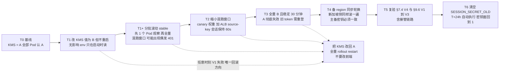

## 9. 阶段 G：D6 落地（任务 25、26、27、38、40、42、48、52、54、55）

> D6 十项任务是"把安全与可观测补齐 + 让备 region 具备被接管形态"。数据线（人员B：#54 → #55 → #48 → #27）与平台线（人员A：#25 → #42 → #26 → #52 → #40 → #38 收尾）并行。

### 9.1 任务 25｜新加坡 ALB + Service/Ingress（PH 备）

配置与马尼拉同构（AlbConfig `alb-newapi-sg`，两 AZ vSwitch，`requestTimeout: 600`），差别只在：**常态不接任何公网 DNS**，只用应用型负载均衡 ALB 的 DNS 名称做内部验收。

```yaml
apiVersion: networking.k8s.io/v1
kind: Ingress
metadata:
  name: new-api-ph-standby
  namespace: new-api
  annotations:
    alb.ingress.kubernetes.io/healthcheck-path: "/api/status"
    alb.ingress.kubernetes.io/listen-ports: '[{"HTTPS":443}]'
spec:
  ingressClassName: alb
  rules:
  - host: sg-standby.internal.likha.com      # 仅用于 SNI 路由与验收，不上公网
    http:
      paths: [{path: /, pathType: Prefix, backend: {service: {name: new-api-ph-standby, port: {number: 80}}}}]
```

**验证**：

```bash
curl -sS --resolve sg-standby.internal.likha.com:443:${SG_ALB_VIP} \
  https://sg-standby.internal.likha.com/api/status | jq -e '.success'
# 主站 token 打备站业务接口（SESSION_SECRET 一致性复验，§7.4 V4）
```

**修复与坑**：
- `IngressClass is invalid` → SG 集群未装 `alb-ingress-controller` 或未建 `IngressClass alb`（与主站各自独立，两集群都要建）。
- **坑｜把备站 Ingress host 写成 `api.likha.com`。** 后果：一旦 GTM 或本地 hosts 指错，公网流量进备站，且证书/SNI 与主站混用。改进：备站 host 一律加 `.internal.` 段，并在 CI 里禁止 `api.likha.com` 出现在 SG 集群 manifest。
- **坑｜新加坡 ALB 未挂 WAF。** 后果：接管后无 L7 防护。改进：D6 同步给 SG ALB 接入 Web 应用防火墙 WAF（云原生模式），规则从主站导出模板保持一致 —— 这也是 §1.1#6 提到"规则差异导致切换后行为不一致"的根治。

### 9.2 任务 26｜日志服务 SLS / ARMS Prometheus / Grafana / 云监控站点监控

#### 操作步骤

1. **日志服务 SLS**：Project（项目）`sls-newapi-mnl` / `sls-newapi-sg`；Logstore（日志库）划分：
 - `app-stdout`（容器标准输出，30 天）
 - `app-file`（`/app/logs/*.log`，`sys` 30 天 / `audit` 180 天，**两个 store 分开**，成本与合规口径不同）
 - `alb-access`、`waf-log`、`rds-audit`、`actiontrail`
 采集用 `logtail-ds` + `AliyunLogConfig` CRD（声明式，别在日志服务控制台手工配，无法回归）。

```yaml
apiVersion: log.alibabacloud.com/v1alpha1
kind: AliyunLogConfig
metadata: {name: new-api-app-file, namespace: kube-system}
spec:
  project: sls-newapi-mnl
  logstore: app-file
  lifeCycle: 30
  logtailConfig:
    inputType: file
    configName: new-api-app-file
    inputDetail:
      logType: json_log
      logPath: /app/logs
      filePattern: "*.log"
      dockerFile: true
      advanced: {tail_existed: true}
```

2. **ARMS Prometheus 监控**：容器服务 Kubernetes 版 ACK 组件 `ack-arms-prometheus`；ServiceMonitor 现在**没有对象可抓**（`/metrics` 未注册，P1-20），先只采容器/cAdvisor 指标；G8 落地后再加：

```yaml
apiVersion: monitoring.coreos.com/v1
kind: ServiceMonitor
metadata: {name: new-api, namespace: new-api}
spec:
  selector: {matchLabels: {app: new-api}}
  endpoints: [{port: http, path: /metrics, interval: 30s}]
```

3. **可观测可视化 Grafana 版**：工作空间**建在新加坡**（P1-11，马尼拉不可用），数据源指向马尼拉 ARMS Prometheus 的**公网/内网可读端点**；SLO 看板在 §10.8 做。
4. **云监控站点监控**：探测点选择可用节点（新加坡/东京/香港），断言 `success:true` + `version` 匹配；**因马尼拉探测点未确认，必须叠加**：容器服务 ACK 集群内 `blackbox-exporter` 多 region 自拨测 + GTM 健康探测（三重兜底，P1-13）。

#### 验证方法

```bash
# V1 日志真的进来了（不要只看 logtail 状态）
aliyun sls GetLogs --ProjectName sls-newapi-mnl --LogStoreName app-file \
  --From $(date -d '5 minutes ago' +%s) --To $(date +%s) --Query "level" --Line 3
# 期望：返回 JSON 行，且 __source__ 是 Pod IP

# V2 关键字段可检索（用于事后定位）
# 日志服务控制台查询分析: request_id: "*" | select count(*)  → 非 0

# V3 Prometheus 有业务无关但必须有的系统指标
kubectl --context mnl -n arms-prom get pods
curl -s "${ARMS_PROM_ENDPOINT}/api/v1/query?query=container_memory_working_set_bytes{namespace=\"new-api\"}" | jq '.data.result|length'   # >0

# V4 三重拨测各自独立产生结果（任一失效不会误判可用）
```

#### 坑与注意事项

- **坑 1｜`logtail-ds` 采集 `/app/logs` 需要 hostPath 或 emptyDir 共享。** new-api 写文件日志到容器内路径；若 `LOG_DIR` 落在容器可写层且未挂卷，**Pod 重启即丢日志**。改进：`LOG_DIR` 挂 `emptyDir` + logtail 走容器 stdout 双路；文件日志仅作补充。
- **坑 2｜日志服务 SLS 成本失控。** 后果：debug 级日志 + 180 天保留 + 全量 ALB access log，月账单可超服务器成本。改进：`ERROR_LOG_LEVEL=warn`；ALB access log 只保留 30 天 + 采样；§9.6 成本表量化。
- **坑 3｜把 Prometheus 当唯一告警源。** 集群自身故障时监控一起瞎。改进：**关键 P1 告警（站点不可用）必须走云监控站点监控/GTM 探测（外部视角）**，与集群内告警双通道。
- **坑 4｜Grafana 建在新加坡，但数据源用了马尼拉内网端点。** 后果：跨区不通、看板空白。改进：用 ARMS Prometheus 的**公网可读端点 + Token 鉴权**，或云企业网 CEN。

### 9.3 任务 27｜canary Deployment + 独立 Service/Ingress（权重 5）

```yaml
apiVersion: apps/v1
kind: Deployment
metadata: {name: new-api-canary, namespace: new-api}
spec:
  replicas: 1
  strategy: {type: RollingUpdate, rollingUpdate: {maxUnavailable: 0, maxSurge: 1}}
  selector: {matchLabels: {app: new-api, track: canary}}
  template:
    metadata: {labels: {app: new-api, project: new-api, site: ph-mnl, track: canary, env: prod}}
    spec:
      affinity:
        podAntiAffinity:
          requiredDuringSchedulingIgnoredDuringExecution:
          - {topologyKey: kubernetes.io/hostname, labelSelector: {matchLabels: {app: new-api, track: canary}}}
      containers:
      - name: new-api
        image: ${ACR_MNL_PREFIX}:<candidate-sha>
        env: [{name: NODE_TYPE, value: "slave"}, {name: CANARY, value: "true"}]
```

灰度实现（ALB Ingress 权重注解，两条 Ingress 指向同 host）：

```yaml
# stable
alb.ingress.kubernetes.io/canary: "false"
# canary
alb.ingress.kubernetes.io/canary: "true"
alb.ingress.kubernetes.io/canary-by-header: "x-canary"
alb.ingress.kubernetes.io/canary-by-header-value: "1"
```

权重推进用 `5 → 20 → 50 → 100`（**方案 J48 负荷公式**已在 v2.1 修正：canary 副本数必须能独立扛住 `权重 × 峰值 QPS`，5% 峰值 ≈ `ceil(0.05 × 峰值 / 单实例容量)`，见 §10.4 单实例容量基线）。

**验证**：

```bash
# V1 头流量强制进 canary
curl -sS -H "x-canary: 1" https://api.likha.com/api/status | jq -r .version
# V2 权重比例统计（1000 次采样，canary 版本占比 ≈5%）
for i in $(seq 1 1000); do curl -s https://api.likha.com/api/status | jq -r .version; done | sort | uniq -c
# V3 canary 异常秒级归零
kubectl -n new-api annotate ingress new-api-canary alb.ingress.kubernetes.io/canary-weight="0" --overwrite
```

**坑**：
- **坑 1｜canary 与 stable 共享同一 ConfigMap 但版本不兼容。** 后果：新代码写了新字段，旧代码读到崩溃（或反之）。改进：**灰度版本必须向后兼容一个发布周期**（expand-contract，§9.5）。
- **坑 2｜canary 只有 1 副本且无 PDB。** 后果：节点维护时灰度样本消失，观测窗口断裂；更糟的是反例："canary 全挂但没人发现，因为流量只有 5%"。改进：canary 加**独立告警**（错误率、P99），阈值按小样本放宽但绝对量兜底（如 5xx>3 就告警）。
- **坑 3｜权重靠注解热改，改完不生效。** 原因：ALB Ingress Controller 需 reconcile；或 YAML 里两条 Ingress 同名 host 冲突。改进：`kubectl get events -n new-api | grep alb`；把权重推进写进 §10.1 演练脚本。

### 9.4 任务 42｜cluster-autoscaler 与两集群节点池自动伸缩

容器服务 Kubernetes 版 ACK 托管版集群用**节点池自动伸缩**（在节点池「伸缩」页签将伸缩模式设为自动伸缩，即 Node Pool Auto Scaling）而非自建 cluster-autoscaler Deployment；确认开关在节点池配置上，且 **`max` 与 ECS 配额一致**（马尼拉 8×8=64 vCPU=配额上限；新加坡 12×8=96 需经配额中心申请批复）。

**验证**：

```bash
# V1 扩容能力：制造 Pending
kubectl -n new-api scale deploy/new-api-stable 12 --dry-run=server -o json | kubectl apply -f -
kubectl get pods -l track=stable -w            # 期望 Pending → 节点数增长 → Running
kubectl get nodes -w                           # 期望 4 → 5 → ... → 8 上限
# V2 缩容不伤人（观察 10 分钟后）
kubectl get nodes -o custom-columns=NAME:.metadata.name,CREATING:.metadata.creationTimestamp
# V3 上限受配额约束（打到 8 台后不再扩，Pod 保持 Pending 且事件里有 ProvisionFailed/QuotaExceeded）
```

**修复**：Pod 一直 Pending 且无扩容 → 检查节点池 `auto_scaling.enable`、`max_size`、伸缩活动日志（弹性伸缩 ESS 控制台 →「伸缩活动」）、`ScaleOutBlocked`（配额或库存）。

**坑与注意事项**
- **坑 1｜HPA max 16 但节点池 max 8 台 ×（8C 可分配约 7C / 2C request ≈ 3 副本）≈ 24 副本容量 —— 看似够，但 limit 4C 时实际只塞得下 1–2 个/节点。** 后果：HPA 扩到 16 却 `Pending`，等于**扩容失败但监控显示"副本数已达标"**。改进：以 **request** 规划节点数并留 30% 余量；把 `Pod Pending 数 > 0 持续 3 分钟` 做成 P1 告警。
- **坑 2｜`PDB minAvailable: 3` 挡住缩容。** 后果：autoscaler 反复尝试驱逐失败（`PodDisruptionBudget` 阻止），伸缩活动报错刷屏。改进：缩容窗口与业务低谷一致；PDB 在低峰期允许 2（用 `minAvailable: 70%` 动态口径）。
- **坑 3｜自动伸缩出的新节点没有 nofile/数据盘调优。** 后果：只有初始 4 台是"对的"，扩容出来的机器 ulimit=1024。改进：调优必须写进**节点池的实例自定义数据（User Data）**（§7.1 Step 3），不在手工脚本里。

### 9.5 任务 54｜迁移版本化（golang-migrate）+ expand-contract 回滚验证

#### 操作步骤

1. 从当前生产 schema 导出基线：

```bash
migrate -path ./migrations -database "$DSN_MIGRATE" version
migrate create -dir ./migrations -format numbering -ext sql -seq add_baseline_marker
```

2. 约定：**所有 DDL 进 `migrations/`，应用侧 AutoMigrate 关闭**（需 G8 提供 `MIGRATE_MODE` 开关）；迁移由 **K8s Job / Argo Hook（PreSync）** 用 `newapi_migrate` 账号执行。
3. expand-contract 三段式：

| 阶段 | 内容 | 兼容性 | 何时做 |
| --- | --- | --- | --- |
| Expand | 加新列/新表（nullable 或有 default），双写 | 新旧代码都能跑 | 发布 N |
| Migrate | 回填历史数据（分批、限速、可中断续跑） | 只影响性能 | 发布 N 后 |
| Contract | 删旧列/旧约束 | 需要**只有新代码**在跑 | 发布 N+1（灰度 100% 且稳定 ≥24h） |

4. 每个 migration 必须写 `.down.sql` 且**在 staging 真跑一次**。

**验证**：

```bash
# V1 版本一致
migrate -database "$DSN_MIGRATE" -path ./migrations version          # 生产与代码库同值
# V2 回滚可用（staging 快照上）
migrate -database "$DSN_PERF" -path ./migrations down 1 && migrate -database "$DSN_PERF" -path ./migrations up
# V3 幂等：重复 up 不报错
migrate -database "$DSN_PERF" -path ./migrations up   # 期望 no change
# V4 长事务锁不阻塞业务（Expand 期间监控 pg_stat_activity wait_event）
```

**坑与注意事项**
- **坑 1｜在 `main` 上加 `NOT NULL`/加索引不带 `CONCURRENTLY`。** 后果：全表锁，`logs` 级表上分钟级不可写 → 直接破 99.95% 预算（21.6 分钟/月）。改进：PG 索引用 `CREATE INDEX CONCURRENTLY`（**不能放在事务里**，golang-migrate 需 `migrate.WithInstance(..., {MigrationsTable:...})` 且 `NoTransaction`）；MySQL 侧用 `ALGORITHM=INPLACE, LOCK=NONE`。
- **坑 2｜GORM AutoMigrate 与版本化迁移并存，互相"抢"schema。** 后果：AutoMigrate 把迁移删掉的列又加回来。改进：**一次性关闭 AutoMigrate**（只保留 master Job），并在 CI 里 grep `AutoMigrate(` 断言关闭态。
- **坑 3｜`.down.sql` 从没跑过。** 后果：真出事时回滚即二次故障。改进：staging 每周自动跑 `up → down → up` 一轮，纳入 §12 证据。
- **坑 4｜Contract 太早。** 改进：Contract PR 标题强制 `[N+1]`，评审门禁检查"当前线上是否已 100% 新代码"。

### 9.6 任务 55｜SESSION_SECRET 双密钥轮换方案与演练

目标：**轮换期间不踢任何人下线，且不出现"两个密钥都不认"的窗口**。

#### 操作步骤

1. 在密钥管理服务 KMS 的凭据管理中建立两个版本位：`SESSION_SECRET`（当前有效）、`SESSION_SECRET_OLD`（轮换窗口内的旧值）。
2. 代码能力要求（G8）：验签时**先试主密钥，失败再试 `_OLD`**；签发只用主密钥。若当前代码不支持（本仓库现在只读单个 `SESSION_SECRET`，`common/init.go:50-55`），则**先用下面的"重叠窗口"运维方案**：

**图 11｜SESSION_SECRET 双密钥轮换时间线（T0–T6）**



> 时间线上只有 **T6 是不可逆点**（清掉 `_OLD` 之后旧 token 无法救回）。T0–T5 全部可回滚，且回滚方向唯一：**改回 KMS + 重启 Pod**。滚动期间出现"偶发 401"是预期现象（Pod 混跑 A/B），不是故障——但必须在变更窗口内并挂公告，否则会被当成登录 Bug 立案。

**文本速查版**

```
T0   SESSION_SECRET  = A                     （全员在用 A）
T1   把 KMS 值改为 B，但先不重启（无影响：env 只在启动读）
T1+  分批滚动 stable：先 1 个 Pod → 观察 → 全量
     ⚠ 滚动期间 A/B Pod 混跑，同一用户可能命中不同 Pod → 出现"偶发 401"
T2   用 canary 权重 + 会话粘滞（ALB source-key 会话保持 60s）缩小混跑窗口
T3   全量 B 且稳定 30 分钟后，A 彻底失效（旧 token 需要重登）
```

3. **强烈建议实现真双密钥**（推荐落地形态，写入 G8 需求）：

```go
secrets := []string{os.Getenv("SESSION_SECRET"), os.Getenv("SESSION_SECRET_OLD")}
// 签发用 secrets[0]；校验按顺序尝试非空项
```

#### 验证方法

```bash
# V1 重叠窗口：旧 token 在滚动后仍可用
curl -sS -H "Authorization: Bearer $OLD_TOKEN" https://api.likha.com/api/user/self | jq -e '.success'   # 期望 true
# V2 新签发 token 立即可用且被两 Pod 都认
# V3 轮转后 KMS 旧版本不可读（防止误恢复）
aliyun kms GetSecretValue --SecretName aone/newapi/prod/SESSION_SECRET --VersionId <old>   # 期望报错或按策略拒绝
# V4 审计：轮换动作在操作审计（ActionTrail）有记录，且变更单号可关联
```

**修复**：V1 失败 → 说明代码不支持双密钥或 Pod 未全部滚动；立即把 KMS 值改回 A 并全量 `rollout restart`（回滚方向唯一，**不要试图改前端**）。

#### 坑与注意事项

- **坑 1｜主备两 region 不同时轮换。** 后果：接管瞬间全员掉线（比 §6.2 坑 3 更隐蔽，因为平时看不出来）。改进：**轮换 SOP = 主站滚完 + 备站滚完 + 复验 §7.4 V4**，三步都在一个变更单里；§11.3 接管演练必须包含"刚轮换完"这一状态。
- **坑 2｜把 `_OLD` 长期留着。** 后果：密钥面翻倍，泄露概率上升。改进：轮换 SOP 里第 4 步"清空 `_OLD`"，T+24h 自动执行。
- **坑 3｜轮换时改成了空值或 `random_string`。** 后果：`log.Fatal` 全站起不来（`common/init.go:50-55`）。改进：向密钥管理服务 KMS 写入前做长度/字符集校验（≥32 随机字节），CI 加 lint。
- **坑 4｜顺带把 `SYNC_FREQUENCY` 一起改。** 后果：一次变更两件事，出问题难归因。改进：**一个变更单只做一件事**。

### 9.7 任务 48｜支付回调源 IP 白名单 + 签名校验验证

1. 取支付渠道官方回调 IP 段（Epay/Stripe/PayPal/支付宝国际…，多数**公布在文档且会变**），落成 ConfigMap + 定时同步任务。
2. WAF 精确路径豁免（§8.3 坑 3）+ 应用侧 IP 白名单 + 签名校验三层。
3. 应用侧白名单配置示例：

```yaml
data:
  NOTIFY_IP_ALLOWLIST: "3.33.3.3/32,52.10.1.0/24"   # 从渠道文档同步，禁止 0.0.0.0/0
```

**验证**：

```bash
# V1 合法源 + 合法签名 → 200 且入账
# V2 合法源 + 错签名 → 4xx 且不入账（查 orders 无新记录）
psql "$DSN_MIGRATE" -c "select id,status from orders where out_trade_no='TEST'"   # 期望 status 未变
# V3 非法源 + 合法签名 → 拒绝（IP 层挡）
# V4 无签名 → 拒绝
# V5 WAF 不拦回调（真实渠道沙箱跑一次全链路）
```

**坑与注意事项**
- **坑 1｜只看 `X-Forwarded-For` 第一跳取客户端 IP。** 后果：攻击者伪造头即可绕过 IP 白名单 → **伪造回调完成支付**，属资金级漏洞。改进：ALB/WAF 场景用**可信跳数**取 IP（`X-Forwarded-For` 从右往左取第 N 个，N=可信代理数）；或在 ALB 层注入 `X-Real-IP`，应用只信它。
- **坑 2｜回调白名单忘了随渠道 IP 变更同步。** 后果：某天开始支付全量失败（表现是"用户说扣款成功但没到账"）。改进：渠道 IP 段做成**定时任务同步 + 变更告警**；并在 §10.8 加"回调 4xx 比例"告警。
- **坑 3｜幂等只做在应用层（内存 map）。** 多副本下不成立。改进：**DB 唯一约束**（`out_trade_no` unique）+ `INSERT ... ON CONFLICT DO NOTHING`，重试安全。
- **坑 4｜回调处理里同步调用上游模型补发额度。** 后果：上游慢 → 渠道超时重投 → 重复入账放大。改进：回调只做"记账 + 入队"，发放异步。

### 9.8 任务 40｜证书正式部署到 ALB / WAF / DCDN + SNI 校验

（对应 v2.1 修正的时序问题：证书必须在 ALB/WAF 创建之后部署，D6 执行。）

```bash
# 从数字证书管理服务（CAS）取证书 ID 并确认覆盖域名
aliyun cas DescribeUserCertificateDetail --CertId ${CERT_ID} | jq -r '.CommonName, .Sans'
# 期望 Sans 含 api.likha.com, ops.likha.com, *.likha.com

# 部署到 ALB 监听（AlbConfig 里声明式管理，见 §6.3；不要在 ALB 控制台手工挂载）
# WAF / DCDN 侧在各自控制台或 OpenAPI 绑定同一 CertId
```

**验证**：

```bash
# V1 SNI 正确（同 IP 多域名场景）
echo | openssl s_client -connect ${ALB_VIP}:443 -servername api.likha.com 2>/dev/null | openssl x509 -noout -dates -subject
echo | openssl s_client -connect ${ALB_VIP}:443 -servername nonexistent.likha.com 2>&1 | grep -Ei "alert|error"
# V2 证书链完整（Android/老客户端友好）
curl -sSIv https://api.likha.com/api/status 2>&1 | grep -E "SSL certificate|issuer"
nmap --script ssl-enum-ciphers -p 443 api.likha.com | tail -20    # 期望 grade A，无 SHA1/弱套件
# V3 到期与自动续期
aliyun cas DescribeUserCertificateList --ShowSize 50 | jq -r '.CertificateList[] | [.Name,.Fingerprint,.AfterDate] | @tsv'
# 期望 AfterDate ≥ 今天 + 25 天；<30 天触发告警（P0-7：最长约 199/200 天）
```

**坑**：
- **坑 1｜只更换数字证书管理服务 CAS 的证书，没同步 AlbConfig。** 后果：ALB 继续用旧证书，到期日全站 HTTPS 报错。改进：**证书部署纳入 GitOps**（CertManager + `cert-manager-alibabacloud-dns01-webhook`，或 ACM/KMS → 外部同步 Job 调 `UpdateListenerAttribute`）；到期告警必须打到 §10.8 值班通道。
- **坑 2｜通配符不覆盖多级。** `*.likha.com` **不覆盖** `a.b.likha.com`。若将来用 `cdn.api.likha.com` 会握手失败。改进：域名规划统一二级。
- **坑 3｜国际站没有免费 DV（P0-7）**，别按国内站经验"等免费证书签发"。改进：付费 DigiCert/GlobalSign 通配符证书 + 托管自动续期，预算入 §9.9。
- **坑 4｜证书私钥落盘在本地。** 改进：私钥只在 CAS/KMS；导出仅限轮换窗口并即时销毁（安全核查 #38 会查）。

### 9.9 任务 52｜带宽与规格量化 + 成本量化表

#### 操作步骤

1. 带宽估算（impl_deploy.md 8.5：流式网关硬瓶颈）。以 1,000 并发 SSE 为口径：

| 项 | 估算式 | 取值 |
| --- | --- | --- |
| 单路下行稳态 | 30 tokens/s × ~4 B/token ≈ 120 B/s + SSE 头开销 ≈ 0.3–0.5 KB/s | 0.5 KB/s |
| 1,000 并发 | 0.5 KB/s × 1000 ≈ 0.5 MB/s ≈ **4 Mbps** | 保守按 **40 Mbps**（含请求上行、图片/base64、突发） |
| NAT 网关 | ≥ 200 Mbps | 需提工单确认默认上限 |
| 单 EIP 峰值 | ≥ 100 Mbps（共享带宽包） | 用 **CDT/共享带宽包** 统一计费 |
| 应用型负载均衡 ALB | LCU 上限按峰值连接数 + 新建连接数 + 处理数据量三取最大 | 1,000 并发 + 峰值 500 CPS ≈ 3–4 LCU，留 10× 余量 |

2. 成本量化表（月度，国际站美元计价，全部**必须**填实际购买页价格）：

| 资源 | 规格 | 数量 | 单价 | 月成本 | 弹性敏感度 |
| --- | --- | --- | --- | --- | --- |
| 云服务器 ECS（马尼拉） | g8i.2xlarge | 4–8 | 【核实】 | | 高（HPA 直接放大） |
| 云服务器 ECS（新加坡） | g8i.2xlarge | 2–12 | | | **极高**（接管时 6×） |
| 云数据库 RDS PostgreSQL 版 | 16C64G 高可用版 | 1 | | | 低 |
| Tair | 4GB 主备 | 2 | | | 低 |
| 云数据库 ClickHouse | 见 §4.5 选定方案 | 1 | | | 中（跨区流量另计） |
| 跨区公网（SG→MNL RDS） | 出方向 GB | 估 | | | **常被忽略**：接管后所有 SQL 走公网 |
| NAT 网关 + 共享带宽包 | 200 Mbps | 2 | | | 高（流式出站） |
| 应用型负载均衡 ALB | LCU | 2 | | | 中 |
| Web 应用防火墙 WAF 企业版 + 请求数 | | 2 | | | 中 |
| DCDN | 流量 GB | | | | 高（前端资源） |
| 日志服务 SLS | 写入 GB + 存储 | | | | **高**（日志级别一改就爆） |
| 对象存储 OSS | 标准+低频+归档+跨区复制 | | | | 低 |
| GTM Ultimate / DNS 付费版 | | 1 | | | 低 |
| 可观测可视化 Grafana 版（新加坡） | | 1 | | | 低 |
| 数字证书管理服务 CAS | 通配符 ×2/年 | | | | 低但必须记 |

3. 成本看板（任务 39 马尼拉清单 #39）：标签 `site/project/env` 全量打标，在「费用与成本控制台」→「预算管理」→「创建告警」设置 80% 预算告警，月度复核。

**验证**：`aliyun bssopenapi QueryBill` 能按标签聚合出上表；压测后 NAT 流量曲线与估算偏差 <50%。

**坑**：
- **坑 1｜低估跨区流量。** 接管后**全部** SQL 走马尼拉 RDS 公网，读写双向 GB 级。改进：压测时实测 `pg_stat_activity` + NAT 出流量，算出接管后的单位时间费用，写进 SLA 成本附注。
- **坑 2｜按量付费 + 无预算告警。** 后果：一次 CC 攻击把 DCDN/WAF 请求数打到天价。改进：「预算管理」设置 80% 预算告警 + WAF 频率控制 + 账单「异常突增」日巡检（移交运维项 §11.6）。

### 9.10 任务 38｜上线前安全核查（OWASP / 白名单 / 密钥 / 审计）

#### 核查清单（每项要留证据，不通过不得进 D8 上线）

| # | 项 | 方法 | 通过标准 |
| --- | --- | --- | --- |
| 1 | 无硬编码密钥 | `git log -p --all \| grep -Eic "LTAI[0-9A-Za-z]{16}\|BEGIN .*PRIVATE KEY"`；`trufflehog/gitleaks` 扫全仓 | 0 命中；历史命中已做**密钥轮换 + BFG 清洗** |
| 2 | 依赖漏洞 | 镜像扫描（容器镜像服务 ACR 企业版）+ `govulncheck ./...` + `npm audit --omit=dev` | Critical=0；High 有豁免单 |
| 3 | Secret 权限边界 | `kubectl auth can-i --as-group newapi-viewer get secrets -n new-api` | 拒绝 |
| 4 | 容器逃逸面 | Pod `runAsNonRoot`、`readOnlyRootFilesystem`、`capabilities.drop:[ALL]`、禁 `privileged` | 全部满足（new-api 需要写 `/app/logs` → 用 emptyDir 挂写路径） |
| 5 | 传输加密 | 全站 HTTPS + HSTS（`max-age=31536000; includeSubDomains`）+ TLS1.2+ | nmap grade A |
| 6 | SQL 注入面 | GORM 参数化；grep `Raw(`/`Exec(` 的拼接 | 无拼接；ClickHouse 查询同样参数化 |
| 7 | 越权 | 水平越权（`/api/user/:id` 类）、垂直越权（普通号访问 admin）用例各 ≥10 条 | 全部 403/404 |
| 8 | 认证与令牌 | 密码 bcrypt/argon2 成本、`access_token` 熵、登录限速、会话固定 | 复核 §6.2 SESSION_SECRET 与登录限流 |
| 9 | 回调伪造 | §9.7 V1–V4 | 4/4 通过 |
| 10 | 审计链路 | 操作审计（ActionTrail）投递至对象存储 OSS / 日志服务 SLS 且 ≥180 天可查（P1-17） | 查得到 90 天前的事件 |
| 11 | 备份加密与访问 | RDS/OSS 服务端加密开启；OSS Bucket 禁止公共读 | `aliyun oss stat oss://bucket \| grep -i "ACL.*private"` |
| 12 | 日志脱敏 | 抽查日志服务 SLS：不得出现完整 token/API Key/密码 | 脱敏规则生效（`redact`） |
| 13 | CORS | `Access-Control-Allow-Origin` 白名单，禁止 `*` + credentials | 实测响应头 |
| 14 | 镜像签名/来源 | ACR 企业版 + 仅允许内网 VPC 域名拉取 + 禁 `latest` | 部署 manifest 全 SHA |
| 15 | 供应链 | CI 依赖锁文件、构建脚本来源固定 | `go.sum`/`bun.lock` 入仓且不跳过校验 |

**验证与修复**：任何一项不通过 → **不签 M3 完成**，按上表"通过标准"回改；豁免必须写明风险接受人 + 到期复审日。

**坑与注意事项**
- **坑 1｜安全核查排在压测之后。** 后果：改配置引发回归，工期塌。改进：D6 做，D7/D8 只复验增量。
- **坑 2｜只看控制台开关，不看实际行为。** 例：声明"禁公共读"但某个对象被单独设为公共读。改进：**逐 Bucket 查看属性 + 抽样对象 HEAD**。
- **坑 3｜`runAsNonRoot` 与 new-api 镜像默认用户冲突。** 后果：Pod 起不来或 `/data` 权限拒绝。改进：Dockerfile 里 `chown` 数据目录 + `USER 10001`；灰度先在一副本验证。
- **坑 4｜密钥扫描只扫 HEAD。** 后果：历史 commit 里的 AK 仍在，被人 clone 就走。改进：扫 `--all`，命中即**轮换 AK**（轮换才是修复，删历史不是）。

### 9.11 D6 出口检查

```
☐ 备站 ALB + WAF + Ingress 就绪，内部域名可验收（未上公网 DNS）
☐ 日志服务/Prometheus/Grafana（新加坡工作空间）+ 三重拨测产出数据
☐ canary 单副本可路由，权重推进与秒级归零实测通过
☐ 节点池自动伸缩：扩容到 8 台上限受配额约束且无 Pending 卡死
☐ 迁移版本化：up/down/up 在 perf 库跑通，AutoMigrate 已声明关闭计划
☐ SESSION_SECRET 双密钥/重叠窗口演练完成，主备同步轮换 SOP 定稿
☐ 支付回调三层校验 V1–V4 全通过
☐ 证书已部署 + SNI 校验 + 链完整 + 到期 ≥25 天 + 自动续期任务在
☐ 成本量化表填完实际单价，预算告警生效
☐ 安全核查 15 项：通过或有签字豁免单
```

