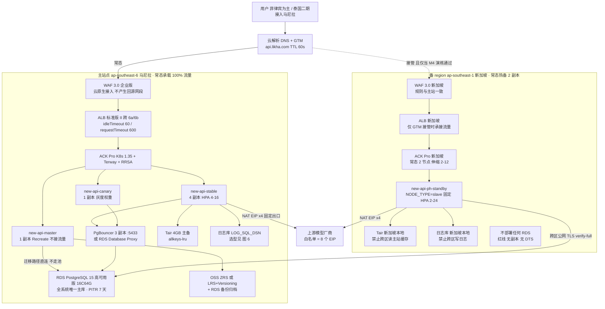
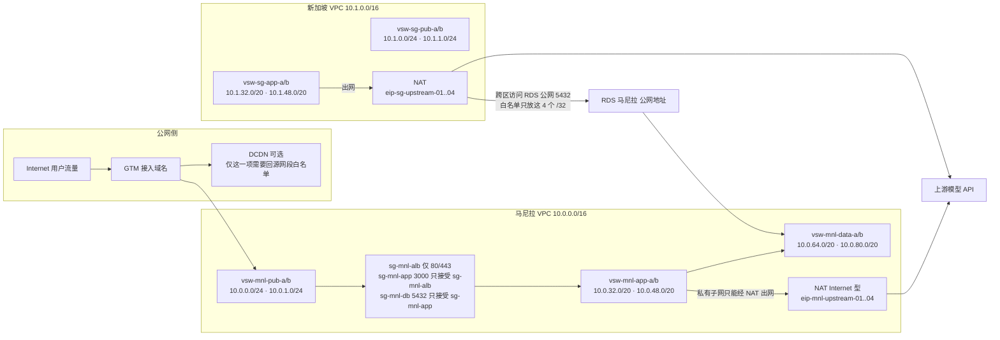
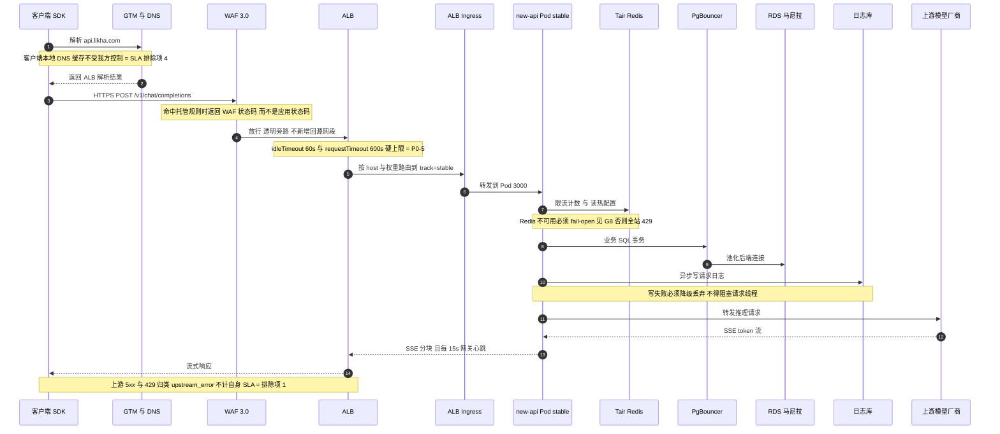

## 2. 全局基线参数与命名规范

### 2.0 架构全景图（先看图再动手）

**图 1 · 双 region 全景架构与接管边界**



> **读图三要点**：① 全系统只有一个数据库（马尼拉），新加坡是**算力副本不是数据副本**；② 虚线那条路径常态**不承载流量**，只有 GTM 接管后才生效，而它的数据库读写仍然回到马尼拉 —— 这就是接管期延迟变高的根因（§10.1）；③ `master` 只有 1 个且不接流量，任何让第二个进程以 master 身份启动的配置都是资金级隐患（§6.2 坑 1）。

**图 2 · 网络与安全域拓扑（网段口径见 §2.2）**



> 图上就能读出的三个约束：**私有子网没有出公网的路由**（只能经 NAT，所以出口 IP 一定收敛到 4 个 EIP）；**新加坡到主库只有"公网 5432 + 4 个 /32 白名单"这一条路**（所以 EIP 被换 = 接管能力静默失效，§6.1 坑 2）；**Pod IP 直接来自 app 网段**（Terway 模式），/20 是为 16+24 副本预留的，不能改小（§2.2 坑）。

---

### 2.1 参数基线（黄色项必须先替换）

| 参数 | 取值 | 备注 |
| --- | --- | --- |
| 业务域名 | `api.likha.com` | 全表统一 |
| 运维域名 | `ops.likha.com` | |
| 通配证书 | `*.likha.com` | |
| 主 region / AZ | `ap-southeast-6` / `ap-southeast-6a`+`6b` | **只有这两个 AZ** |
| 备 region | `ap-southeast-1` | 不部署任何数据库 |
| 马尼拉 VPC | `vpc-newapi-mnl-prod` `10.0.0.0/16` | |
| 新加坡 VPC | `vpc-newapi-sg-prod` `10.1.0.0/16` | 与主站不重叠 |
| K8s 版本 | **1.35**（原方案 1.31 已 EOL） | |
| CNI | **Terway**（不可后期更换） | |
| 镜像前缀 | `<acr-instance>-registry-vpc.ap-southeast-6.aliyuncs.com/newapi/new-api` | EE 实例前缀是实例名，不是固定 `registry-vpc.` |
| 应用命名空间 | `new-api`（备站 `new-api`，staging `new-api-staging`，压测 `new-api-perf`） | |
| 服务端口 | `3000` | new-api 监听端口 |

### 2.2 网段规划（照抄，勿改）

| 站点 | vSwitch | CIDR | AZ | 用途 |
| --- | --- | --- | --- | --- |
| 马尼拉 | `vsw-mnl-pub-a` | `10.0.0.0/24` | 6a | ALB / NAT |
| 马尼拉 | `vsw-mnl-pub-b` | `10.0.1.0/24` | 6b | ALB / NAT |
| 马尼拉 | `vsw-mnl-app-a` | `10.0.16.0/20` | 6a | **Pod（Terway 真实 VPC IP）** |
| 马尼拉 | `vsw-mnl-app-b` | `10.0.32.0/20` | 6b | Pod |
| 马尼拉 | `vsw-mnl-data-a` | `10.0.48.0/20` | 6a | RDS/Tair/日志库 |
| 马尼拉 | `vsw-mnl-data-b` | `10.0.64.0/20` | 6b | RDS 备 |
| 新加坡 | `vsw-sg-pub-a` | `10.1.0.0/24` | 1a | ALB / NAT |
| 新加坡 | `vsw-sg-pub-b` | `10.1.1.0/24` | 1b | ALB |
| 新加坡 | `vsw-sg-app-a` | `10.1.16.0/20` | 1a | Pod |
| 新加坡 | `vsw-sg-app-b` | `10.1.32.0/20` | 1b | Pod |

> **⚠ 关键坑（v2.1 未体现）**：选 Terway 后**每个 Pod IP 都是一个真实 VPC 私有 IP**，直接消耗 vSwitch 可用地址。`/20` = 4096 地址 ≈ 4000+ Pod IP，够 16 副本 × 节点扩展用；但**节点自身的 IP 也从 app vSwitch 出**（shared-ENI 模式）。
> **后果**：vSwitch 地址耗尽时，新 Pod 永久 `ContainerCreating`，报错 `no available ip addresses`，HPA 扩容全线失效——这是最容易在压测当天爆炸的坑。
> **改进措施**：§4.1 建完 vSwitch 立即执行 `aliyun vpc DescribeVSwitchAttributes` 记录 `AvailableIpAddressCount` 基线，并在 §12 每里程碑复核。

### 2.3 命名与标签

所有资源统一打标签（方案 R6/R39 成本看板依赖它）：

```
project=new-api   site=ph-mnl|sg   env=prod|staging|perf   cost-center=<按财务>   managed-by=terraform|console
```

---

## 3. 阶段 A：T-5 / T-3 前置门禁（G1–G13）

> **G0 规则**：G1–G7 + G9 为 **T-5**（等待型），G8 + G10–G13 为 **T-3**（研发/确认型）。任一项未完成 → D1 不得启动。
> D1 = 2026-09-28 ⇒ **T-5 = 2026-09-23（已过）/ T-3 = 2026-09-25**。若你的启动日不同，按此偏移重算；**T-5 项当天必须全部发起**。

### 3.0 一次业务请求的全链路时序（超时归属地图）

**图 3 · 常态主站请求链路 · 每一跳的超时与失败由谁负责**



> 排障先定位"这一跳归谁"：**4xx 来自 WAF 还是应用**（§8.3 验证）、**5xx 来自自身还是上游**（§10.8 口径）、**断流是 60s idle 还是 600s request 上限**（§6.3 坑 1 与坑 2）。

### 3.1 G1 · 国际站账号注册 + 企业实名认证（1–3 工作日，最长外部等待）

**操作步骤**

1. 打开 `https://www.alibabacloud.com/` → **Create Account**。用**企业域名邮箱**注册，选 Country/Region = **Philippines**。
2. **注册时填写的手机号国家码必须与账号国家一致**（+63）。
3. 进入 **Account Center → Identity Verification** → 选 **Enterprise** → 上传主体注册文件：
   - 公司/合伙 → **SEC** 注册证书；个体户 → **DTI** 证书
   - 法人身份证件、注册地址证明
   - 公司名称、注册号、地址须与**后续绑定银行卡的对账单完全一致**
4. 提交后在 **Account Center → Identity Verification** 看状态；国际站人工审核 **约 3 个工作日**（方案写 1–2 天，偏乐观）。

**验证方法**

```bash
aliyun sts GetCallerIdentity          # 已配置 AK 时返回 AccountId
```
+ 控制台 **Account Center → Identity Verification** 显示 `Verified`（Enterprise）。

**验证不通过的修复**

| 症状 | 原因 | 修复 |
| --- | --- | --- |
| 被拒："country mismatch" | 注册国家 ≠ 证件签发国 ≠ 手机号国家码 | 三者必须一致。**账号国家注册后不可更改** → 只能新账号重做 |
| 被拒："name mismatch" | 公司名与银行卡/对账单不一致 | 用银行对账单上的拼写重填，或换卡 |
| 长时间 pending | 人工审核排队 | **提工单（Support Tickets → Create Ticket → 选 Account）**催办，附注册主体名 |

**坑与注意事项**

- **坑 1｜未实名的阻塞面比方案写的更大**。官方明确：完成企业实名前**不能申请 Credit Limit（信用额度/后付费）、不能签在线合同、不能加入 ACPN 伙伴计划、不能购买中国内地地域产品**。而"买不了 ECS/RDS"只是表象。**后果**：T-5 才注册、T-3 还在审核 = 整个 9 天计划归零。**改进**：实名与配额工单**同日发起**，实名没下来也先把配额工单提交（可先说明在审）。
- **坑 2｜账号国家不可改**。很多团队先用个人/其他国家邮箱注册试水。**后果**：改不了只能重开账号，已签的证书/域名白做。**改进**：注册前用 §3.1 第 1–3 步做一次 checklist 确认。
- **坑 3｜用主账号做日常运维**。方案 R4 已禁止，但国际站默认给你的是主账号。**改进**：立刻做 §3.3，之后所有操作只用 RAM 用户。

### 3.2 G3 · 绑定支付方式 / 后付费 / 预算告警（当日）

**操作步骤**

1. **Expenses and Costs → Billing Account → Payment Method → Add Payment Method**：绑企业 Visa/MasterCard（或 PayPal）。
2. **对公转账（bank transfer）在国际站是人工工单流程**，不是自助按钮——需要就走 Support Ticket。
3. 开启后付费能力：企业实名完成后在 **Expenses and Costs** 申请 **Credit Limit**。
4. 预算：**Expenses and Costs → Budget Management** →（首次需 Activate）→ **Create Budget** → 选 **Cost Budget**，按标签 `project=new-api` 圈定，阈值 80% 告警。

**验证方法**

- Payment Method 列表出现已验证卡（状态 `Active`）。
- `aliyun bssopenapi QueryAvailableBalance`（或控制台 Account Overview）能看到可用额度。
- 新建一个按量付费测试资源（如 1 个 EIP）能成功下单 → **这是唯一可靠的"能下单"证明**。

**验证不通过的修复**：卡被拒 → 换卡或走对公转账工单；下单报 `InvalidAccountStatus.NotEnoughBalance` → Credit Limit 未批，先小额充值（Top-up）走预付费余额。

**坑与注意事项**

- **坑｜欠费停机 = 生产直连不可用**。国际站欠费后有保留期，随后**释放**按量资源（EIP 被回收后 IP 会变！）。**后果**：上游供应商 IP 白名单全部失效，模型调用大面积 4xx/超时。**改进**：余额告警阈值设 ≥3 个月账单；EIP 全部转 **包年包月/保留 IP** 或在方案中固化"IP 变更须重提白名单"的应急 SOP。
- **坑｜"Balance Alerts"菜单名在国际站英文文档中未确认**（在 Account Overview / Message 设置里）。**改进**：以控制台实际页面为准，找不到就 **Message Center → 通知设置** 里勾全部计费类通知，别卡在菜单名上。

### 3.3 G9 · RAM 用户 / 最小权限 / MFA / ActionTrail（当日）

**操作步骤**

1. **RAM Console → Identities → Users → Create User**，建 4 个：`admin`、`ops`、`cicd-push`、`iac-terraform`。
   - 人类用户勾 **Console Password Sign-On**；程序用户勾 **OpenAPI Access Key**，二者不要同开。
2. **RAM → Permissions → Policies → Create Policy**（JSON 编辑器）→ 分别绑定：
   - `ops` → 自定义策略（覆盖 VPC/ECS/ACK/RDS/SLB/WAF/DNS 的 `*:Describe*` + 部署所需写权限）
   - `cicd-push` → **只给 ACR 推送**：`cr:PullRepository`、`cr:PushRepository`、`cr:GetRepository*`，Resource 限定到 `newapi/*` 命名空间
   - `iac-terraform` → Terraform 所需最小集（含 `ram:Get*`，不含 `ram:CreateUser`）
3. 强制 MFA：
   - **RAM → Settings → Security（Global Security）**：开启「要求所有控制台用户绑定 MFA」
   - 每个用户 **Identities → Users → <user> → Authentication → Bind Virtual MFA Device**
4. **补一条策略兜底**（全局开关只覆盖控制台登录，不覆盖 AccessKey 调用）：

```json
{
  "Version": "1",
  "Statement": [{
    "Effect": "Deny",
    "Action": ["*"],
    "Resource": ["*"],
    "Condition": { "Bool": { "acs:RAMMFAPresent": ["false"] } }
  }]
}
```
（对 `cicd-push`、`iac-terraform` 这类纯 API 用户改用「限制来源 IP + 限定 Action 白名单」，不要把它们锁死。）

5. **ActionTrail**：**ActionTrail → Trails → Create Trail → Single-account trail** → 投递到 **OSS Bucket（`oss-newapi-mnl`，路径 `actiontrail/`）** 且/或 **SLS Logstore**，Region 留 All Regions。
6. **资源组**：**Resource Management → Resource Groups** → 建 `rg-ph-mnl`、`rg-sg`；创建资源时统一选组。

**验证方法**

```bash
# 用 ops 用户 AK 验证权限边界（应被拒）
aliyun ram ListUsers --access-key-id <ops_AK> ...     # Expect Forbidden
# MFA 生效：无痕浏览器登录控制台，未绑定 MFA 的账号应被强制跳转到绑定页
```
- ActionTrail 页面 **Trails** 显示状态 `Logging`；在 OSS 里能看到 `actiontrail/<账号ID>/<region>/...` 的 JSON 对象开始增长。
- 审计自检：在控制台改一个资源标签，然后 **ActionTrail → Event Query** 里能查到该事件。

**验证不通过的修复**

| 症状 | 修复 |
| --- | --- |
| RAM 用户登录正常但 CLI 全 Forbidden | 策略里用了控制台专属 Action 前缀 → 用 `aliyun ram GetPolicyVersion` 对照补 `Describe/List` |
| Trail 卡在 `Creating`，OSS 无对象 | 缺 `AliyunServiceRoleForActionTrail` 或目标 Bucket 不在同 region → 补服务关联角色 / 换 Bucket |
| `cicd-push` 推镜像报 `denied by ram` | 缺 `cr:PushRepository` 或 Resource 里的 repo 路径写法与命名空间大小写不符 |

**坑与注意事项**

- **坑｜ActionTrail 控制台只免费保留 90 天事件**。方案要求 180 天。**后果**：合规审计到期无据。**改进**：必须投递 OSS/SLS，并给该前缀配**生命周期：180 天保留 + 禁止删除**（用 Bucket Policy 显式 Deny `oss:DeleteObject` 对该前缀）。
- **坑｜Global Security 的 MFA 开关管不住 AccessKey**。**后果**：AK 泄露即可全云接管——这是国际站最常见的账号被劫持路径。**改进**：AK 全部加 **来源 IP 白名单条件**（`acs:SourceIp`），运维 AK 只允许从堡垒机/VPN 出口 IP 使用；配 §14 的 90 天 AK 轮换。
- **坑｜给 CI 用了 `admin` 或主账号 AK**。**后果**：CI 日志泄露 = 全站沦陷。**改进**：CI 用 `cicd-push`，且优先改用 OIDC/STS 临时凭据。

### 3.4 G2 / G10 · 资源配额申请（2–3 工作日，关键路径）

**操作步骤**

1. 先读实时值（**不要凭印象报数字**）：

```bash
export REGION=ap-southeast-6
aliyun ecs DescribeAccountAttributes --RegionId $REGION
aliyun quotas ListProducts | grep -i -E "ecs|slb|vpc|rds|kvstore"
aliyun quotas ListProductQuotas --ProductCode ecs --RegionId $REGION
```

2. **关键认知修正**：ECS vCPU 配额现在是 **「按实例规格族分组的 vCPU 上限，按 region 计」**，不再是「按具体机型」。所以你要申请的是 **general-purpose 族的 vCPU 配额**。
3. **Quota Center**（`quotas.console.alibabacloud.com`）→ **Product Quotas** → 选产品 → **选地域** → 找到配额行 → **Actions → Request**：
   - 批次 1（`ap-southeast-6`）：ECS vCPU ≥ 64、ALB × 2、EIP ≥ 10、NAT × 1、RDS（PostgreSQL 高可用版 16C64G）、Tair 4GB、OSS × 1、VPC/vSwitch
   - 批次 2（`ap-southeast-1`，即 **G10**）：ECS vCPU ≥ **96**、ALB、EIP ≥ 6、ACK Pro
4. 等价 CLI：

```bash
aliyun quotas CreateQuotaApplication \
  --ProductCode ecs --Version 2014-05-26 \
  --QuotaActionCode <上一步读到的 code> \
  --DesiredValue 96 \
  --Reason "new-api AI gateway prod launch, standby region takeover capacity >= 1.5x peak" \
  --DomainRegions.1.RegionId ap-southeast-1

aliyun quotas ListQuotaApplications            # 轮询审批状态
```

**验证方法**：`ListQuotaApplications` 返回 `Status: Approved`；再跑一次步骤 1 的 `ListProductQuotas`，`TotalAllowedQuota` ≥ 申请值。**把工单号写进 §12 里程碑证据。**

**验证不通过的修复**

- 被驳回（`Declined`）→ 看 `RejectReason`，通常是「未说明业务场景 / 峰值依据不足」。**改进**：申请理由里给出**可核算的容量式**：`主站 4→16 副本 × 8 vCPU = 128，节点池 min4/max8 ⇒ 64 vCPU；备站 2→24 副本 ⇒ 96 vCPU`，比单写"要 96 核"通过率高得多。
- 长时间 `Approving` → **另开 Support Ticket 催办**（配额审批与工单是两套流程，只等一个会漏）。

**坑与注意事项**

- **坑｜默认配额不公开**。英文文档没有给新账号默认 vCPU 数。**后果**：按国内站经验估算 → 创建节点池时报 `QuotaExceeded` 且发生在 D2，返工 2–3 天。**改进**：§3.4 步骤 1 的实时读取是**强制前置动作**，T-5 完成并把数字记进方案表。
- **坑｜新加坡 96 vCPU 未批 → SLA 直接不成立**。备 region 接管上限 = 主站峰值 16 × 1.5 = **24 副本 = 192 vCPU Pod 需求**（按 request 2 vCPU 时是 48 vCPU，按 limit 4 vCPU 时是 96 vCPU）。**后果**：M4 验收项「接管容量 ≥ 峰值 ×1.5」不可能达成。**改进**：未批复时按方案裁剪预案 #5 走，但**必须书面记录 SLA 降级**；同时确认「冷备也不省配额」（方案 R49 已强调）。
- **坑｜配额是按 region 独立的**。马尼拉批了 ≠ 新加坡有。**改进**：两批工单分开提，**先马尼拉后新加坡但同日发起**。

### 3.5 G7 · 逐个开通云产品（当日）

**操作步骤**（国际站**每个产品单独开通**，不是一次性授权）

产品控制台入口逐个进 → 点 **Activate / 立即开通** → 选按量付费：

```
VPC · EIP · NAT Gateway · ALB(Application Load Balancer) · ACK Pro · ACR Enterprise
RDS PostgreSQL · Tair(Redis OSS-Compatible) · ClickHouse(见 §1.1#1) 
Alibaba Cloud DNS · Global Traffic Manager · DCDN/ESA · WAF 3.0 · SSL Certificates(CAS) · KMS
SLS · ARMS(Prometheus Service) · Managed Grafana · CloudMonitor · ActionTrail · OSS
```

WAF 3.0 开通时**必须选 Asset Region = Outside Chinese Mainland**。

**验证方法**：每个产品控制台首页能进且不弹「未开通」引导；`aliyun <product> DescribeRegions` 返回正常。

**坑与注意事项**

- **坑｜WAF 选错站点（Chinese Mainland）**。**后果**：面向马尼拉的接入配置根本选不到 ALB，且触发 ICP 备案要求。**改进**：开通即选 **Outside Chinese Mainland**；开通后改不了，只能退订重开。
- **坑｜WAF 企业版（Enterprise）vs Pro 的差别只在域名数/CC 规则数/Bot 能力**，国际站档位是 **Basic / Pro / Enterprise / Ultimate / Pay-as-you-go**（不是国内站的"企业版"字样，也**没有 Premium**）。**改进**：先按 Pay-as-you-go 起步，规则数超了再升档。
- **坑｜ClickHouse 开通页选不到马尼拉** → 不是 bug，是真不支持，直接跳 §4.5。

### 3.6 G4 · 域名注册 + 实名 + NS 托管（24–48h 生效等待）

**操作步骤**

1. **Domains** 控制台 → 查询/注册 `likha.com`（若已有域名，跳过注册）。开 **自动续费 + 隐私保护**。
2. **域名实名（Real-name Verification）**：Domains → 选中域名 → **Real-name Verification** → 上传与**阿里云账号实名主体一致**的证件。
3. **Alibaba Cloud DNS（Console → Public Zone）→ Add Domain** → 输入 `likha.com` → 系统分配两个 NS（形如 `ns1.alidns.com` / `ns2.alidns.com`，以页面为准）。
4. 回到 **Domains → 域名管理 → DNS修改（DNS Servers）→ 更换为阿里云 DNS 分配的 NS**。
5. **不要在此处加业务解析记录**，等 D1/GTM 阶段统一加（CNAME 给 GTM 的接入域名）。

**验证方法**

```bash
# 权威 NS 是否已切
dig +short NS likha.com                      # 期望：ns1/ns2.alidns.com（或分配值）
# 逐跳确认（在注册商 NS 上查已失效、在阿里云 NS 上查有记录 = 生效）
dig @ns1.alidns.com api.likha.com +short
```

**验证不通过的修复**

| 症状 | 原因 | 修复 |
| --- | --- | --- |
| `dig NS` 仍返回注册商 NS | 全球缓存未过期 | 等 24–48h；期间**不要重试改配置**（会拉长收敛） |
| 加记录时报「域名未实名」 | 步骤 2 未过审 | 催实名；国际站对**部分后缀**要求实名才可解析 |
| 实名被拒 | 域名实名主体 ≠ 阿里云账号主体 | 用同一主体重提 |

**坑与注意事项**

- **坑｜NS 未生效时 D1 接入层什么都验不了**（方案 R18 已标注）。**后果**：D3 的 ALB/WAF/GTM 验证全部空转。**改进**：T-5 立刻做；**未生效期间用 ALB 自动分配的公网 DNS 名（`alb-xxx.ap-southeast-6.alb.aliyuncs.com`）先完成功能验证**，域名只用于最终对外。
- **坑｜把付费 DNS 版本写成"旗舰版"**。国际站英文文档**没有版本对照表**（只有中文文档有），产品页只宣传 "Enterprise Ultimate Edition"。**改进**：版本名以购买页为准；工单里描述需求而不是版本名。
- **坑｜国际站别用 `223.5.5.5` 做权威验证**（那是国内站 Public DNS，缓存策略不同，会给你假阴性）。**改进**：只信 `dig @ns1.alidns.com` 与公共递归 `dig @1.1.1.1`。

### 3.7 G5 · 通配符 SSL 证书（1–24h）

**操作步骤**

1. **Certificate Management Service → SSL Certificate Management → Create Certificate / Purchase**。
2. 国际站**无免费 DV 额度**——买 **Rapid(DV) / DigiCert / GlobalSign / GeoTrust / Alibaba Cloud 自有根**，Domain Type 选 **Wildcard Domain**，填 `*.likha.com`。
3. 生成 CSR：本地 `openssl req -new -newkey rsa:2048 ...`（私钥自己留）或用 CAS 代生成。
4. **域名验证选 DNS 验证**（域名已在阿里云 DNS，可自动添加 TXT）。
5. DV 签发 **1–15 分钟**；OV 需 3–5 工作日 → **本方案用 DV 即可**。
6. **私钥入 KMS**（§4.7），**开启托管服务（hosting）+ 自动续期**，在 **Deployment Management → Cloud Product Deployment** 建部署任务（此时资源还没建，先建任务模板）。
7. 到期告警：**Message Center / 证书到期通知**（邮件；短信需已验证手机号）。

**验证方法**

```bash
openssl x509 -in likha.com.pem -noout -text | grep -A1 "Subject Alternative Name"
# 期望 DNS:*.likha.com
openssl x509 -in likha.com.pem -noout -dates       # 记录 notAfter
```
控制台证书状态 = **Issued**，且已出现在 CAS 证书列表。

**坑与注意事项**

- **坑｜2026-02-25 起单张证书最长有效期降到约 199/200 天**，1 年订单被拆成两张约 6 个月 + 托管续期。**后果**：按"一年一续"运维 → 第 6 个月全站 HTTPS 突然红色告警/握手失败，且续期不是瞬间完成。**改进**：**必须**开启托管 + 自动部署到 ALB/WAF/DCDN；§12 每里程碑人工复核一次 `notAfter`。
- **坑｜通配符不覆盖子主域**：`*.likha.com` 覆盖 `api.likha.com`，**不覆盖** `likha.com`，也不覆盖 `a.b.likha.com`。**后果**：直连裸域 502/证书错误。**改进**：证书加 `likha.com` 多域名（SAN），或裸域做 301 → `api.likha.com`（DCDN/ALB 层）。
- **坑｜中间证书链缺失**。**后果**：ALB 上传报链不完整，或 Android/旧客户端验证失败。**改进**：CAS 下载的 **fullchain PEM** 整包上传，不要手挑首段。
- **坑｜方案 R63 说"要求 TLS 1.2+1.3"** → ALB 侧对应 **TLS security policy** 名称：`tls_cipher_policy_1_2_strict_with_1_3`（§6.3 用这个）。

### 3.8 G6 · 解析/GTM/证书配置模板就绪（当日）

**操作步骤**：把 D3/D5 要用的以下内容**先写成文件评审定稿**，存 Git（不含密钥）：

```
deploy/aliyun/ph/
  dns-records.yaml          # api / ops / 静态子域 的 CNAME 目标（GTM 接入域名）
  gtm-address-pool.md       # 主池=马尼拉 ALB DNS 名, 备池=新加坡 ALB DNS 名, 探测 /api/status 15s
  cert-deployment-task.md   # 部署目标资源清单（占位，D6 回填资源 ID）
  albconfig.yaml.tpl        # 见 §6.3
  security-groups.md        # 见 §8.6 逐条表
```

**验证方法**：这些文件在 D1 前 PR 已合并（不是"排期确认"）。
**坑**：v2.0 的教训——「D1 部署证书但 ALB/WAF 还没建」。**改进**：证书部署动作固定排 **D6**（任务 40），D1 只做"证书就绪 + 模板预置"（任务 3）。

### 3.9 G8 · 代码侧补建（必须**完成并合并**，不是排期确认）

**操作步骤**（本仓库现状已核实）

| 项 | 现状（2026-09-24） | 要做 |
| --- | --- | --- |
| `GET /healthz` | **不存在** | 新增，只做进程存活（不查依赖），返回 200 |
| `GET /readyz` | **不存在** | 新增，检查主库 + Redis（Redis 不可用要按"降级"处理，见 §3.9） |
| `GET /metrics` | **未注册**（仅 `controller/channel_inference.go` 内部把 `/metrics` 当探测路径） | 接 `promhttp` + `prometheus/client_golang`，暴露请求数/延迟直方图/渠道错误/429 数 |
| 限流降级 | 需确认 | **Redis 故障时降级放行，不得 fail-closed 返回 5xx** |
| 探针兜底 | `router/api-router.go:26` 的 `GET /api/status` | G8 未完成前用 `/api/status`（TCP 探测次选） |

**验证方法**

```bash
go build ./... && go test ./router/... ./controller/...
curl -s localhost:3000/healthz -i          # 200
curl -s localhost:3000/readyz  -i          # 依赖正常 200；故意停 Redis → 期望 200(degraded) 而非 503
curl -s localhost:3000/metrics | head      # 有 go_* 与自定义指标
```

**坑与注意事项**

- **坑｜Redis 故障 → `/readyz` 返回 503 → K8s 杀 Pod → 全站雪崩**。**后果**：Tair 一次抖动就演变成整站不可用，SLA 99.95% 直接不成立（方案 R15 的判定就是这一条）。**改进**：`readyz` 对**缓存类依赖只做降级不判死**；把"依赖分级"写进代码注释与测试用例（含 fail 分支）。
- **坑｜没有 `/metrics` 就用 `/api/status` 拨测当 SLA 证据**。**后果**：拨测只能证明"进程在"，证明不了"成功率/延迟 SLO"，错误预算无从计算，M3/M4 验收会被客户质疑。**改进**：如果 G8 确实延后，必须**书面记录指标置信度降级**（方案 R15 的剩余风险口径）。
- **坑｜Go 项目改鉴权/会话相关代码要过 OWASP 门禁**（仓库 `AGENTS.md` 强制）。`/metrics` 端点**必须只在内网暴露**，不能经 ALB 公网可达（用独立 Service 端口或 NetworkPolicy）。**后果**：泄露内部路由/量级信息。**改进**：`/metrics` 单独监听端口（如 9090），**不挂在 3000 上**，只被 ServiceMonitor 抓取。

### 3.10 G11 · 连接数预算与 PgBouncer 方案确认（T-3）

**操作步骤**：产出**一张带真实数字的表**（方案 §7.4.5.1 的三条不变量 I-1/I-2/I-3）：

```
① 主站：SQL_MAX_OPEN_CONNS(实际值) × 主站副本峰值(16)
② 备站：SQL_MAX_OPEN_CONNS × 备站副本峰值(24)
③ GTM 接管瞬间主备可能同时在跑 → 取 ①+② 的最坏上界（或明确"先摘流再扩容"消除并发窗口）
必须满足：最坏上界 ≤ RDS max_connections × 0.8
```

⚠ **必须用代码真实默认值**：`model/main.go:212` 是 `GetEnvOrDefault("SQL_MAX_OPEN_CONNS", 1000)`，主库和日志库**各自**都设 1000。若沿用默认：`1000 × 16 = 16000`，**远超任何 RDS 规格**。

**验证方法**

```sql
SHOW max_connections;                     -- 在 RDS 上读实际值（不可用户改，见 §1.2#9）
SELECT count(*) FROM pg_stat_activity;    -- 现网连接数
```
PgBouncer：`SHOW POOLS;` → `cl_waiting` 长期为 0；`SHOW STATS;` 看 `sv_active`。

**修复**：`cl_waiting` 持续堆积 → 调大 `default_pool_size` 或**降应用侧 `SQL_MAX_OPEN_CONNS`**（显式设成 60–100，不是留着默认 1000）。

**坑与注意事项**

- **坑｜忘设 `SQL_MAX_OPEN_CONNS`**。方案按 300 估算，代码默认 1000。**后果**：一次 HPA 扩容到 16 就打爆 PG（`FATAL: sorry, too many clients already`），全站 5xx + 计费写入失败。**改进**：**DSN/环境变量必须显式给值**，并把「`SQL_MAX_OPEN_CONNS` 已显式设置」列为上线检查表硬项（§14）。
- **坑｜transaction pooling 与本仓库代码不兼容**（方案 §7.4.5.4 的"红线"）。任何用到**会话级状态**的地方会静默出错：`SET`/`SET LOCAL`、**prepared statements**、 advisory lock、`LISTEN/NOTIFY`、`BEGIN; ... ; COMMIT` 跨多条语句。**后果**：GORM 默认可能用 prepared statement；`SET extra_float_digits` 之类的驱动初始化语句在 transaction 模式下会失败或串扰——**表现为偶发的、无法复现的余额计算/迁移错误，比宕机更可怕**。**改进**：
  - 若用 PgBouncer：**优先 `pool_mode=session`**（牺牲部分收敛换正确性），或在应用侧关掉 prepared statements（`extra_float_digits`、`statement_timeout` 等 SET 要验证）；
  - **master 迁移路径必须直连不走池**（方案 §7.4.5 H 列已要求，保留）；
  - 三数据库矩阵（SQLite/MySQL/PG，仓库 AGENTS.md 强制）必须**经过池跑一遍**才算验证。
- **坑｜RDS PG 也有「Database Proxy」**（不是 MySQL 专属）。**改进**：先确认马尼拉该实例页面里 Database Proxy 可开；可开则**优先用托管 Proxy**（少一个自运维单点），要 transaction pooling 再自建 PgBouncer。

### 3.11 G12 · SLA 口径与交付范围书面确认（T-3）

**操作步骤**：把「里程碑与验收」Sheet 的口径落成**一封需要回复"确认"的邮件**：

- 五条口径：服务窗口 / 不可用定义 / 计划内维护 / 部分降级 / 月度预算 **21.6 分钟**
- 四项排除：**上游供应商故障 / 阿里云公告的区域级 IaaS 故障 / 客户侧网络与证书 / 超限 429**
- 边界：**「整站故障 RTO ≤ 5min」= 接入层 + 计算层**，**不含 RDS 所在马尼拉 region 整体失效**
- 范围：**本次仅菲律宾；泰国二期**（曼谷用户接马尼拉 RTT 55–80ms）

**验证方法**：收到客户/PM 的书面"确认"回执，归档进 §12 证据。
**坑**：不确认 → **D9 验收无法判定**（例："马尼拉 region 挂 30 分钟算不算违约"当场吵）。**改进**：把"排除项②"用一句人话写清：**主库只在马尼拉一个 region，区域级故障下靠 PITR 恢复，RPO 目标 ≤5min，这一情形不计入 99.95%**。客户接受不了就得加第三 region 主库（超本次范围）。

### 3.12 G13 · staging / perf 环境方案确认（T-3）

**结论**：staging/perf 放**马尼拉主站 ACK 的独立 namespace**，用主站 RDS 的**逻辑隔离 schema**（不新建实例）→ 不违反"新加坡不部署 RDS"红线。
**坑**：红线原意是**约束 prod 备 region**，评审时被质疑"staging 是不是也用了新加坡的库"。**改进**：在方案 R36/Sheet4 R25 已有澄清句，落到工单/评审纪要里再写一次。
**注意**：`search_path` 与 schema 隔离对 **GORM AutoMigrate 有已知风险**（不同 schema 下 `IF NOT EXISTS` 判定与索引行为不一致）。**验证**：在 staging schema 上跑迁移两次，确认幂等。

### 3.13 G0 门禁判定表（D1 启动前逐条打勾）

| 编号 | 事项 | 证据 | 通过 |
| --- | --- | --- | --- |
| G1 | 企业实名 `Verified` | 截图 | ☐ |
| G2 | 马尼拉配额批复 | 工单号 | ☐ |
| G3 | 可下单（真实建过一个测试 EIP） | 资源 ID | ☐ |
| G4 | `dig NS` 指向阿里云 | 命令输出 | ☐ |
| G5 | 证书 `Issued` + SAN 含 `*.likha.com` | `openssl` 输出 | ☐ |
| G6 | 配置模板 PR 已合并 | PR 链接 | ☐ |
| G7 | 全部产品已开通（含 ClickHouse 替代决策） | 截图 | ☐ |
| G8 | `/healthz` `/readyz` `/metrics` + 限流降级 **已合并** | commit/MR | ☐ |
| G9 | RAM + MFA + ActionTrail 投递 | Trail 状态 | ☐ |
| G10 | 新加坡 ≥96 vCPU | 工单号 | ☐ |
| G11 | 连接数预算表（用真实 env 值） | 文档 | ☐ |
| G12 | SLA 口径书面确认 | 邮件回执 | ☐ |
| G13 | staging/perf 方案 | 文档 | ☐ |

**任一项未通过 → D1 不启动。** 这是硬门禁，不要"先干起来再补"。

---

