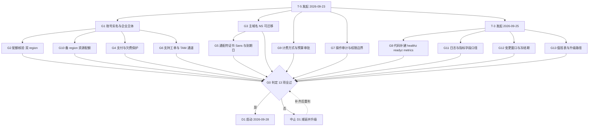
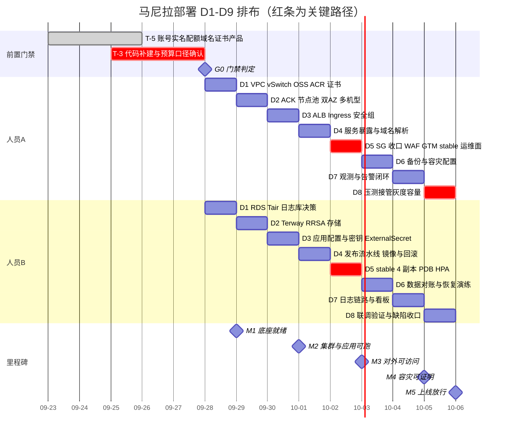
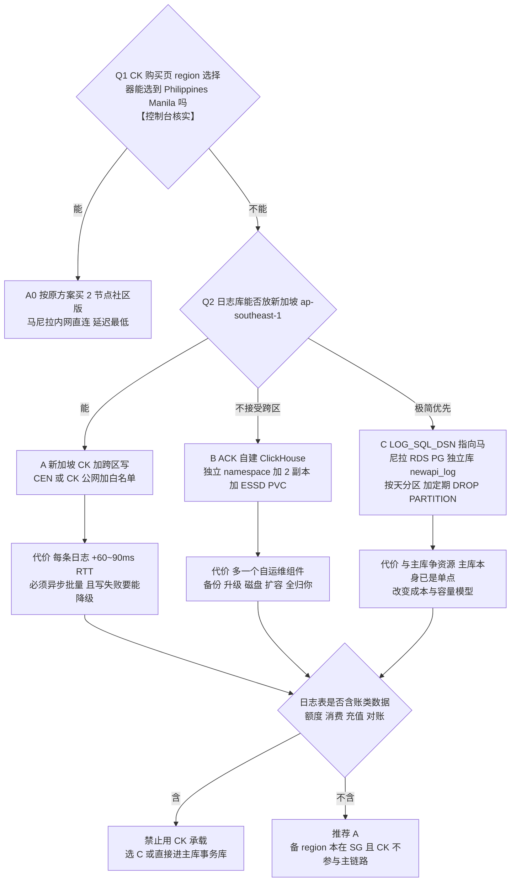
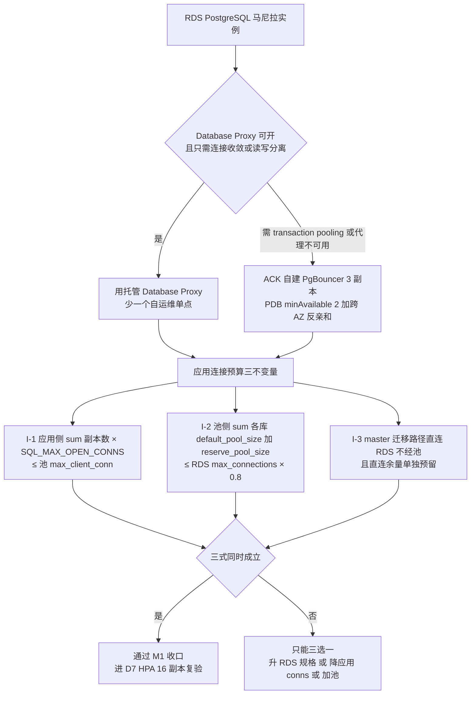
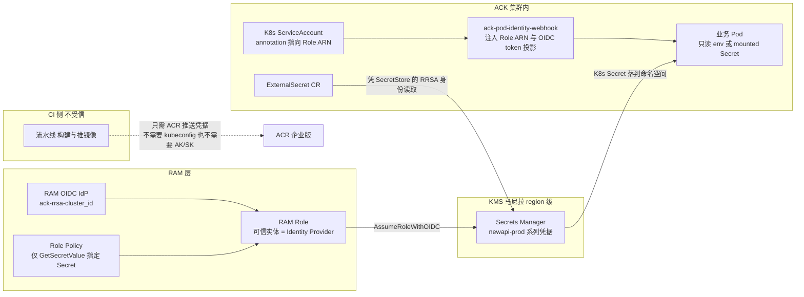

## 4. 阶段 B：D1 落地（网络与数据底座）

> D1 目标：**马尼拉 VPC/vSwitch + RDS + Tair + 日志库 + OSS + ACR + 账号收口 + 域名/证书复核**。
> 分工沿用方案：**人员A** = 基础设施/网络/接入/SRE；**人员B** = 数据/应用/CI-CD/DevOps。

### 4.0 门禁依赖与 D1–D9 排布总览（先看这两张图再排人）

**图 4｜G1–G13 前置门禁依赖流与 G0 判定**



**读图要点**

1. `G8` 是**唯一落在代码侧**的门禁：`/healthz`、`/readyz`、`/metrics` 当前未注册（仓库只有 `router/api-router.go:26` 的 `GET /api/status`）。它不过，M2 的探针与 M3 的 SLA 证据链同时不成立——所以图中它和 G1 一样是"根节点级"依赖，不能拖到 D3。
2. `G5`（证书）挂在 `G3`（域名）下：NS 没迁过来就无法签发/校验通配符证书。国际站无免费 DV 额度 + 2026-02-25 起单证最长约 199 天，这两条决定了 G5 必须包含"托管自动续期已开启"的证据。
3. `STOP -.-> G0` 的回路是**允许的**（补齐后重判），但不允许"带条件通过"：任何一项以"已提工单待回"记录为通过，等于 G0 未过。

**图 5｜D1–D9 排布与关键路径（甘特）**



**读图要点**：三条 `crit` 红条就是真关键路径——`p2`（G8 代码补建，不过则 SLA 无证据）、`a5/b5`（D5 首次对外暴露 + 首个 stable 多副本，是风险峰值日）、`a8`（D8 压测与接管演练，M4 的唯一出口）。任何人日缺口先从这三条上找，不要压 D6/D7 的备份与观测工作——被压掉的备份和观测正是事故时唯一能救你的东西。

### 4.1 任务 5｜马尼拉 VPC + 6 个 vSwitch（人员A，4 人时，S2）

**操作步骤**

1. **VPC Console → VPCs → Create VPC**：Region = **Philippines (Manila)**，Name `vpc-newapi-mnl-prod`，IPv4 CIDR `10.0.0.0/16`。
2. 同页逐 AZ 添加 vSwitch，按 §2.2 建 6 个。
3. 或用 CLI（可复现，推荐）：

```bash
export ALIYUN_PROFILE=ph-prod
VPC_ID=$(aliyun vpc CreateVpc --RegionId ap-southeast-6 --VpcName vpc-newapi-mnl-prod \
  --CidrBlock 10.0.0.0/16 --Description "new-api PH primary" | jq -r .VpcId)
echo "VPC_ID=$VPC_ID"

mk_vsw () { aliyun vpc CreateVSwitch --RegionId ap-southeast-6 --VpcId "$VPC_ID" \
  --ZoneId "$1" --CidrBlock "$2" --VSwitchName "$3" | jq -r .VSwitchId; }
mk_vsw ap-southeast-6a 10.0.0.0/24  vsw-mnl-pub-a
mk_vsw ap-southeast-6b 10.0.1.0/24  vsw-mnl-pub-b
mk_vsw ap-southeast-6a 10.0.16.0/20 vsw-mnl-app-a
mk_vsw ap-southeast-6b 10.0.32.0/20 vsw-mnl-app-b
mk_vsw ap-southeast-6a 10.0.48.0/20 vsw-mnl-data-a
mk_vsw ap-southeast-6b 10.0.64.0/20 vsw-mnl-data-b
```

4. **VPC → Flow Logs → Create Flow Log** → 投递到 SLS Project（`【控制台核实】`马尼拉是否可选；不可选则跳过并在 §12 记为残余风险）。
5. 立即记录每个 vSwitch 的 `AvailableIpAddressCount` 基线（§2.2 的坑）。

**验证方法**

```bash
aliyun vpc DescribeVpcs --RegionId ap-southeast-6 \
  | jq '.Vpcs.Vpc[]|select(.VpcName=="vpc-newapi-mnl-prod")|{VpcId,CidrBlock,Status}'
aliyun vpc DescribeVSwitches --RegionId ap-southeast-6 --VpcId "$VPC_ID" \
  | jq -r '.VSwitches.VSwitch[]|"\(.VSwitchName)\t\(.ZoneId)\t\(.CidrBlock)\tfree=\(.AvailableIpAddressCount)"'
# 期望 6 行，网段与 §2.2 完全一致；free 分别约为 252/252/4092/4092/4092/4092
```
验收标准（方案 AB 列）：**网段与「网络与安全规划」完全一致**。

**验证不通过的修复**

| 症状 | 修复 |
| --- | --- |
| `InvalidCidrBlock.Overlapped` | 与已有 VPC 重叠 → 换 /16 或清理旧 VPC（先确认无资源占用） |
| `ZoneId not available` | 马尼拉只有 6a/6b，AZ ID 写错 → `aliyun ecs DescribeZones --RegionId ap-southeast-6` 核对 |
| free IP 明显少于预期 | 有别的资源占用 → 重算 Pod 容量，不要硬上 |
| 网段填错（/20 写成 /24） | vSwitch CIDR **不可修改** → 无资源时删除重建 |
| 删不掉 vSwitch | 已被 NAT/ACK/RDS 占用 → 按依赖顺序先删资源 |

**坑与注意事项**

- **坑 1｜网段规划错要连带重建整栈**。vSwitch 一旦有资源就删不掉。**后果**：D2 之后发现规划错 = 重建 NAT/ALB/ACK/RDS，返工 1–2 天。**改进**：动手前把 §2.2 表在评审纪要里签认一次。
- **坑 2｜节点与 Pod 共用 vSwitch + Terway**。**后果**：`/20`（约 4000 IP）看着很大，但 8 节点 × 210 Pod 再叠加节点自身 IP 与 Service/预留地址，**耗尽时新 Pod 永久 `ContainerCreating`、报 `no available ip addresses`，HPA/扩容全线失效**——最容易在压测或故障切换当天爆发。**改进**：app 段保持 `/20` 为下限（**不要缩到 /22**）；建完记基线、每里程碑复核 `AvailableIpAddressCount`；告警上把"vSwitch 可用 IP < 200"设为 P2。
- **坑 3｜与新加坡网段重叠**。**后果**：将来接 CEN/VPC 对等时地址冲突，只能重划网段（≈重建集群）。**改进**：10.0.0.0/16 vs 10.1.0.0/16 已错开，**建第二个 VPC 前再核对一次**。
- **坑 4｜"开启 DNS 主机名解析"（方案 R4）** 在国际站英文文档中未见对应开关。**改进**：以控制台 VPC 详情页实际项为准，找不到就跳过，不影响主链路，别为它卡住 D1。

### 4.2 任务 4｜马尼拉 RDS PostgreSQL 高可用版（人员B，2 人时，S2）

**操作步骤**

1. **先验证可买性**（决定后续一切，不要跳）：

```bash
aliyun rds DescribeRegions --RegionId ap-southeast-6 \
  | jq -r '.Regions.RDSRegion[]|.ZoneId' | sort -u
aliyun rds DescribeAvailableClasses --RegionId ap-southeast-6 --ZoneId ap-southeast-6a \
  --Engine PostgreSQL --EngineVersion 15.0 --DBInstanceStorageType cloud_essd \
  --InstanceChargeType Postpaid --Category HighAvailability | jq '.DBInstanceClasses'
# 空结果就依次换：EngineVersion 14.0/15.0/16.0；StorageType cloud_essd/cloud_essd2；Category HighAvailability/Basic
```

2. 买页：**ApsaraDB RDS → Instances → Create Instance** → Region Manila → **Pay-As-You-Go**（稳定后转包年包月）→ **Engine PostgreSQL** → **Edition: High-availability Edition** → **Storage: Premium ESSD/ESSD** → **Deployment: Multi-zone Deployment（Primary 6a / Standby 6b）** → 选 ≈16C/64G 规格（形如 `pg.x4.2xlarge.2c`，以列表为准）→ 网络 `vpc-newapi-mnl-prod` + `vsw-mnl-data-a` → **不勾公网地址**（D3 再开）。
3. 账号/库/权限见 §5.5；SSL 与公网见 §6.1（**证书绑定地址是最重的坑，务必按那里做**）。

**验证方法**

```bash
aliyun rds DescribeDBInstanceAttribute --DBInstanceId <id> \
 | jq '.Items.DBInstanceAttribute[0]|{Engine,EngineVersion,Category,ZoneId,MasterZone,SlaveZone,DBInstanceClass,DBInstanceStorageType,ConnectionMode}'
# 期望 Category=HighAvailability，Master/Slave Zone 为 6a/6b（若支持多可用区）
# 连通性：从同 VPC 跳板机执行（不要从本地直连内网）
psql "host=<内网连接串> port=5432 dbname=postgres user=<acct> sslmode=require" -c "select version();"
```

**验证不通过的修复**

| 症状 | 修复 |
| --- | --- |
| `DescribeAvailableClasses` 返回空 | 换 EngineVersion / StorageType；仍空 = **马尼拉不卖该组合** → 降版本或改地域 |
| 买页无 Multi-zone | 该地域/引擎未开多可用区 → **退化为 Single-zone + 强备份**，并**书面记录 SLA 降级**（RDS 高可用是 99.95% 最低配置之一，方案 R17） |
| 实例 Running 但连不上 | 九成是**白名单默认 `127.0.0.1` 拒绝一切**，见 §5.5 坑 1 |
| `InsufficientResourceCapacity` | 换 AZ / 换同族相邻规格；仍不行提工单查库存 |

**坑与注意事项**

- **坑 1｜PG 版本按购买页为准**。方案写"选 15"，国际站新版本在海外地域滞后于中国站点。**后果**：文档承诺 16、实建 14，后面依赖新特性的 SQL/迁移踩空。**改进**：把 `select version();` 输出**回填方案表**作为交付基线。
- **坑 2｜主备切换会闪断约 30 秒**。**后果**：应用未配重连（连接池 `RetryTimes`、DBus 层重连）时表现为一波集中 5xx。**改进**：D7 任务 37 必做一次**主动 HA Switchover 演练**（`aliyun rds SwitchDBInstanceHA`），验证客户端自动重连与请求成功率曲线。
- **坑 3｜连接串被写死在 CI 变量/Git 里**。**后果**：实例释放重建后连接串变，全站启动失败。**改进**：一律 KMS + 注入（§5.7）。
- **坑 4｜"Running" ≠ "可连"**：创建 1–10 分钟。**改进**：验收以 `psql` 实际连通为准。

### 4.3 任务 8｜OSS Bucket（人员B，1 人时，S1）

**操作步骤**：**OSS → Buckets → Create Bucket**：`oss-newapi-mnl`，Region Manila，Storage Class Standard，**Redundancy：有 ZRS 选 ZRS；只有 LRS 就选 LRS 并立刻配跨区复制到新加坡**（§1.2#14），ACL = **Private**，勾 **Versioning**。
随后：`Lifecycle → Create Rule`（30 天→IA，90 天→Archive，**并加 NoncurrentVersion 30 天过期**）；`Data Security → Referrer → Enable`；`Bucket Policy` 限制非本项目 RAM 主体；建前缀 `rds-backup/`、`actiontrail/`、`app-assets/`。

**验证方法**

```bash
aliyun oss stat oss://oss-newapi-mnl        # 看 redundancy / versioning / ACL=private
# 内网可达（在同 VPC ECS 上）：
curl -sS -o /dev/null -w "%{http_code}\n" https://oss-newapi-mnl.oss-ap-southeast-6-internal.aliyuncs.com/
# 期望 403（能连通、无凭据），而不是 000/超时
```

**验证不通过的修复**：`NoSuchBucket` → 名字全局唯一冲突，换名；`000` → 内网 Endpoint 拼错或 ECS 不在同 region；生命周期不生效 → 前缀规则与对象 tag 不匹配。

**坑与注意事项**

- **坑 1｜用公网 Endpoint**。VPC 内应用走 `oss-ap-southeast-6.aliyuncs.com` → 收公网流量费且更慢。**改进**：内网一律 `-internal`（内网流量免费）。
- **坑 2｜ACL 设 public-read "方便静态资源"**。**后果**：Bucket 内任何文件可被遍历（含误传的备份/日志）——OSS 数据泄露头号原因。**改进**：保持 **Private**；公网静态访问走 **DCDN + 回源** 或**签名 URL**。
- **坑 3｜开了 Versioning 却没配 NoncurrentVersion 生命周期**。**后果**：历史版本无限堆积，存储费翻倍。**改进**：`NoncurrentDays=30` + `ExpireObjectDeleteMarker=true`。
- **坑 4｜备份与数据同 region**。**后果**：region 级故障时"数据和备份一起没"，PITR 承诺落空。**改进**：`rds-backup/` 与 `actiontrail/` 前缀**配跨区复制到新加坡 bucket**。这是让 §6.6 恢复演练真正有价值的前提。

### 4.4 任务 7｜Tair（Redis 兼容）主备 4GB（人员B，1 人时，S3）

**操作步骤**：**Tair / Redis → Create Instance** → Region Manila → **Series: Redis Open-Source 或 Tair** → **Instance Type: Standard (Master-Replica)** → **4GB** → **Multi-zone（6a 主 / 6b 备）** → VPC + `vsw-mnl-data-a` → 版本选页面可用的最高（5.0/6.0/7.0）。
设 **账号密码**（Password Settings）；白名单建组 `mnl_app` 放 Pod/节点所在网段。
参数：`maxmemory-policy` 改 **`allkeys-lru`**；`#no_loose_disabled-commands` 禁 `FLUSHALL,FLUSHDB,KEYS`。

**验证方法**

```bash
redis-cli -h <Connection Information 里复制的地址> -p 6379 -a '<user>:<password>' ping            # PONG
redis-cli ... config get maxmemory-policy                                                        # allkeys-lru
redis-cli ... info clients | head
```
DSN 规范（地址**从页面复制**，不要手拼）：
```
REDIS_CONN_STRING=redis://<user>:<password>@r-xxxx.redis.ap-southeast-6.rds.aliyuncs.com:6379/0
```

**验证不通过的修复**：`NOAUTH` → 自定义账号需 `user:password` 格式；`Could not connect` → 白名单没加**真实来源 IP**（Pod 私网 IP / 节点 IP）；`-READONLY` → 连到了备地址，改主地址。

**坑与注意事项**

- **坑 1｜`maxmemory-policy` 默认 `volatile-lru`，而 new-api 大量 key 无 TTL**。**后果**：内存满后**无法淘汰 → 写入 OOM 报错 → 限流与缓存整体失效**；若 `/readyz` 又把 Redis 当硬依赖，会**触发全站 Pod 重启风暴**（连锁到 §3.9 的坑）。**改进**：显式 `allkeys-lru` + **必须**先完成 G8 的"Redis 故障降级放行"。
- **坑 2｜为了"安全"给 Redis 开公网 + TLS**。**改进**：**只走 VPC 内网 + 白名单**；TLS 的主机名校验坑与 RDS 同源（§6.1），没必要时不要引入。
- **坑 3｜4GB 主备版承载限流 + token 缓存**（方案 R20 自评"建议升级集群版"）。**后果**：热点分片、限流精度下降。**改进**：上线后看 `info stats` 命中率与 `instantaneous_ops_per_sec` 决定升配；**转集群版前**确认业务用到的跨 slot 命令（`MGET`/事务/`SCAN`）在集群模式的限制。
- **提醒**：`GLOBAL_API_RATE_LIMIT` 默认 **360 次 / `GLOBAL_API_RATE_LIMIT_DURATION` 180s**（`common/init.go:124-125`）——WAF 的 CC 阈值要与它**对齐且不更严**，否则用户看到的是 WAF 拦截页而不是网关的 429，客诉归因会跑偏（§8.3）。

### 4.5 任务 9｜日志库（ClickHouse）——**先做替代决策**（人员B，2 人时，S1）

> v2.1 要求"马尼拉 ClickHouse 社区版 24.8，2 节点"。**国际站 ClickHouse 支持地域列表不含马尼拉**（§1.1#1）。

**图 6｜日志库落地决策树**（先做这题，再动手买资源）



**四路对比**

| 方案 | 延迟 | 运维负担 | 跨区流量费 | 一致性风险 | 适用前提 |
| --- | --- | --- | --- | --- | --- |
| A0 马尼拉 CK | 最低 | 中（托管） | 无 | 低 | **购买页能选到马尼拉**（2026-09 核实为否） |
| A 新加坡 CK | +60~90ms/条 | 中（托管） | 有（CEN 或公网） | 低（日志可丢） | 日志异步批量写 + 写失败可降级 |
| B ACK 自建 CK | 低 | **高**（自运维备份/升级/扩容） | 无 | 中（副本少） | 团队有 CK 运维经验 |
| C RDS PG 独立库 | 低 | 低 | 无 | **中高**（与主库争资源） | 日志量可控且不含账类数据 |

> **不要因为方案 v2.1 写了 CK 就直接提工单买 CK**：先在 CK 控制台购买页的 region 选择器做一次 `【控制台核实】` 并截图（截图清单第 14 项）。地域支持列表会变，核实结果决定走 A0 还是 A/B/C。
> **一条硬规则**：日志表里含"账"类数据（额度、消费、充值、对账）→ 一律不能用 CK，只能选 C 或主库；CK 的最终一致与异步写不满足资金对账的可追溯要求。

**各方案要点**

- **A**：CK → Create → Region Singapore → **Community Edition** → **≥2 节点** → VPC `vpc-newapi-sg-prod`；端口 **8123(HTTP)/9000(native)**；白名单加调用方（马尼拉出口 EIP 或 CEN 网段）。
- **B**：`helm install ck <chart>` 到 `new-api-log` namespace，`StorageClass=alicloud-disk-essd`，副本 2，NetworkPolicy 限 app 段访问。
- **C**：RDS 建 `newapi_log` + 独立账号，按天声明式分区 + 定时 `DROP PARTITION`。

**TTL DDL（CK）**

```sql
CREATE TABLE newapi_logs ON CLUSTER ck_clusters (
  ts DateTime64(3), request_id String, path String, status Int32,
  latency_ms Int32, tokens Int64, model LowCardinality(String)
) ENGINE = MergeTree() PARTITION BY toDate(ts) ORDER BY (toDate(ts), path, ts)
TTL toDate(ts) + INTERVAL 90 DAY DELETE;
```

**验证方法**

```bash
curl -sS "http://<ck-host>:8123/?query=SELECT+version()"
clickhouse-client --host <ck> --port 9000 --user <u> --password <p> \
  --query "INSERT INTO newapi_logs VALUES ('2026-09-24 00:00:00.000','t1','/v1/chat',200,120,10,'gpt')"
clickhouse-client ... --query "SELECT create_table_query FROM system.tables WHERE database='newapi_logs'" \
  | grep -o "TTL.*"          # 期望含 TTL toDate(ts) + INTERVAL 90 DAY
clickhouse-client ... --query "SELECT count() FROM newapi_logs"
```
**降级验证（必做）**：故意把 CK 停掉 / DSN 填错 → **new-api 仍能正常返回回答**，只在日志里报错 → 才满足方案 R21「写日志失败必须降级」。

**验证不通过的修复**

| 症状 | 修复 |
| --- | --- |
| `Code: 210 Connection refused` | 白名单未含来源 / 未申请公网地址 |
| `Replicated ... ZooKeeper required` | 社区版只能用**服务自带 ZK**；改用非 Replicated 引擎或用控制台给出的 cluster 名 |
| 写了查不到 | 写的是本地表而非**分布式表**；写 Distributed 或 `SET insert_distributed_sync=1` |
| 高频小批量写入很慢 | `SET async_insert=1, wait_for_async_insert=1` |
| TTL 没删数据 | 合并在后台；用 `OPTIMIZE TABLE ... FINAL` 或 `ALTER TABLE ... MATERIALIZE TTL` 验证 |

**坑与注意事项**

- **坑 1｜照抄"社区版 24.8"**。国际站社区版可购版本可能是 20.8/21.8 等老版本。**改进**：以 `SELECT version()` 为准写 DDL 与依赖特性。
- **坑 2｜CK 在新加坡、应用在马尼拉、同步写日志**。**后果**：每请求 **+60–90ms**，TTFT 明显劣化，压测（任务 33）不可能达标；**CK 抖动会通过日志路径拖垮主链路**（这是"日志把业务打死"的典型模式）。**改进**：日志写入 **异步 + 批量 + 有界队列 + 满了丢弃（而非阻塞）**；给日志写失败单独打点告警。
- **坑 3｜把计费/对账数据放进 CK**。CK 通常**不做备份**，且最终一致性（分布式表异步写）会让"对账"出现缺口。**后果**：**丢钱**，比丢日志严重一个量级。**改进**：先分类"哪些是账、哪些是日志"——**是账的一律留主库并纳入 PITR 范围**。这条是本节真正的红线。

### 4.6 任务 16｜双地域 ACR 企业版 + CI 推镜像（人员B，1 人时，S1）

**操作步骤**

1. **Container Registry → Instances → Create Enterprise Edition**：Region **Manila**（国际站 ACR 支持地域表已列 Manila 支持 EE：Economy/Basic/Advanced）→ 实例名 `acr-newapi-mnl`；同法建 `acr-newapi-sg`（Singapore）。
2. 各实例 → **Access Credential** 设置固定密码（或临时密码）。
3. **Access Control → VPC Access**：分别关联 `vpc-newapi-mnl-prod` / `vpc-newapi-sg-prod`（**不关联则 VPC 域名解析不通**）。
4. **Namespaces → Create Namespace** `newapi`，勾 **Auto-create Repository**。
5. 镜像同步：**Replication → Create Rule**。⚠ **规则要求源实例为 Advanced/Premium 规格** → 实操建议 **以新加坡（Advanced）为源、马尼拉（Basic）为目标**；规则**只同步新推送**，历史镜像需 `CreateRepoSyncTask` 或 OSS 拷贝补齐。
6. CI：
```bash
IMG=<inst>-registry.ap-southeast-1.aliyuncs.com/newapi/new-api:${GIT_SHA}
docker build -t "$IMG" . && docker login --username=<acr_user> --password=<acr_pass> <inst>-registry.ap-southeast-1.aliyuncs.com && docker push "$IMG"
```
7. 集群免密拉取：装 **`aliyun-acr-credential-helper`**（Add-ons），配置目标 namespace 列表。

**验证方法**

```bash
# 两地域各自用 VPC 域名拉一次（验收 AB 列要求）
kubectl run pulltest-mnl --rm -it --restart=Never \
  --image=<mnl-inst>-registry-vpc.ap-southeast-6.aliyuncs.com/newapi/new-api:<sha> -- sh -c 'echo ok'
kubectl --context sg run pulltest-sg --rm -it --restart=Never \
  --image=<sg-inst>-registry-vpc.ap-southeast-1.aliyuncs.com/newapi/new-api:<sha> -- sh -c 'echo ok'
# 期望均输出 ok，不出现 ImagePullBackOff
```
+ 在新加坡推一个新 tag，1–3 分钟后在马尼拉实例 Repositories 能看到同 tag（复制规则生效）。

**验证不通过的修复**

| 症状 | 修复 |
| --- | --- |
| `no such host` | 步骤 3 未关联 VPC |
| `401 Unauthorized` | 未装 credential-helper，或 helper 的 namespace 列表漏了 `new-api` |
| `manifest unknown` | 镜像只在另一地域，复制规则未生效 / **是规则创建前推的历史镜像**（规则只同步新推送） |
| `x509: certificate signed by unknown authority` | 端点用了 IP 或 http；EE 的 VPC 域名证书合法，别绕 |

**坑与注意事项**

- **坑 1｜镜像前缀照抄方案的 `registry-vpc.ap-southeast-6.aliyuncs.com/newapi/new-api`**。**后果**：那是**个人版**公共域名；**企业版是 `<实例名>-registry[-vpc].<region>.aliyuncs.com`** → 拉取失败，D2 就卡住。**改进**：所有清单里镜像前缀**做成变量**，从 ACR 实例页复制实际域名。
- **坑 2｜跨区拉镜像**（新加坡节点用马尼拉域名）。**后果**：走公网产生流量费 + 首次拉取分钟级，**HPA 扩容时 Pod 起不来**。**改进**：每地域用自己的 VPC 域名 + 复制规则保证同镜像。
- **坑 3｜用 `latest` tag**。**后果**：回滚无法定位版本，方案 R31「秒级归零/回滚」变成空话。**改进**：**tag = git sha**（方案 R16），CI 拒绝推 latest。
- **坑 4｜指望个人版免密拉取**。credential-helper 面向 EE；个人版仅支持 **2024-09-08 前创建**的实例。**改进**：直接上 EE，别省这笔钱换 D2 阻塞。

### 4.7 任务 3｜证书就绪与部署预置（人员A，1 人时，S1）

见 §3.7（G5 已签发）。D1 只做三件事：① 私钥入 **KMS**（不入 Git/ConfigMap）；② 建好到期告警；③ 备好"部署到 ALB/WAF/DCDN"的任务模板但**不执行**（资源还没建）。
**为什么不能提前部署**：v2.0 的时序错误就是「D1 部署证书，但 ALB/WAF 在 D3/D5 才建」→ 部署任务找不到资源、后续靠手工补，最终 D6 才发现某处还在用自签/旧证书。
**验证方法**：`aliyun kms ListSecrets | jq -r '.SecretList[].Name'` 含 `new-api/prod/tls-wildcard`；CAS 证书状态 `Issued`；`openssl x509 -in cert.pem -noout -enddate` 与页面一致且 notAfter ≥ 今 + 30 天。
**坑**：私钥 `kubectl create secret generic` 后误提交 Git。**后果**：仓库可读即可解密会话/冒充站点。**改进**：只允许 KMS + 注入；CI 加 **gitleaks/密钥扫描门禁**（`skill security-scan-gates`），"密钥不落 Git"列为上线一票否决。

### 4.8 任务 1、2｜G0 收口 + 域名 NS 复核 + 预建解析（S1/S2）

- 任务 1：逐条打勾 §3.13 的 G0 表；**任一未过 → D1 中止**。
- 任务 2：重跑 §3.6 的 `dig`；并在 **Alibaba Cloud DNS → Public Zone** 预建：

| 主机记录 | 类型 | 值 | TTL |
| --- | --- | --- | --- |
| `api` | CNAME | GTM 接入域名（§8.1 产出） | **60** |
| `ops` | CNAME/A | 堡垒机/VPN 入口 | 600 |
| `static` | CNAME | DCDN 加速域名（如启用） | 600 |

**验证**：`dig +short api.likha.com`；改记录后 `dig SOA likha.com` 序列号递增。
**坑｜TTL 太长导致切换演练"通过不了"**：GTM 目标 ≤60s 切换，但 `api` 记录 TTL=600 时**客户端会缓存 10 分钟**。**后果**：演练时你观察到"解析早该切了但用户还在打老地址"，误判为 GTM 故障，浪费半天。**改进**：`api` 记录 **TTL 60**；演练报告里区分「GTM 池切换时间」与「客户端恢复时间」两个指标，**对外承诺用后者**（§8.1）。

### 4.9 D1 出口检查（M1 前半）

```
☐ VPC + 6 vSwitch 网段与 §2.2 一致，free IP 基线已记录
☐ RDS HA 实例 Running，psql 内网连通，版本已回填
☐ OSS private + versioning + lifecycle + 内网 403 验证
☐ Tair PONG + allkeys-lru
☐ 日志库方案 A0/A/B/C 已选定并有决策记录
☐ ACR 双地域 EE + 两地域 VPC 域名拉取成功
☐ 证书 Issued、私钥在 KMS、到期告警已建
☐ G0 表 13 项全部通过
```

---

## 5. 阶段 C：D2 落地（出口、集群底座、连接池）

### 5.1 任务 6｜马尼拉 NAT 网关 + 上游出口 EIP 池（人员A，2 人时，S3）

**操作步骤**

1. **VPC Console → NAT Gateway → Create**：Region Manila，类型 **Internet NAT Gateway**（国际站现行名；"Enhanced NAT Gateway" 是旧称，**不要照抄"增强型"**），Network type = **Public**，VPC `vpc-newapi-mnl-prod`，AZ 6a，关联 `vsw-mnl-pub-a`。
2. **Elastic IP Address → Create EIP** ×4：`eip-mnl-upstream-01..04`。计费 **Pay-By-Traffic**（AI 网关流量波动大）；如需可预测成本再评估 **Internet Shared Bandwidth** 共享带宽包。⚠ 国际站**没有国内站的"共享流量包 DTP"**，等价物是 **CDT（Cloud Data Transfer）**，先查其地域支持再承诺抵扣。
3. **EIP 列表 → Associate Resource → Type=NAT Gateway → nat-mnl-prod**，逐个绑 4 个。
4. **NAT → SNAT Management → Create SNAT Entry**：粒度选 **vSwitch**（覆盖 app 段与 pub 段）；条目内**可勾多 EIP 形成池**。若页面只允许单 EIP/条 → **建 4 条条目各绑 1 个 EIP**。

**验证方法**

```bash
# 在集群节点 / 私有子网 ECS 上多次执行，期望只出现 4 个已登记 EIP
for i in $(seq 1 12); do curl -s -m5 https://ifconfig.me; echo; done | sort | uniq -c
# 期望：计数只落在 4 个已知 IP 上
```
+ 控制台：NAT 状态 `Available`；SNAT 条目覆盖 app/pub 段；绑定 EIP 数 = 4。

**验证不通过的修复**

| 症状 | 原因 / 修复 |
| --- | --- |
| 出口出现**非池内 IP** | 有旧的单 EIP 条目，或**节点被分配了公网 IP**（Terway 下会绕过 NAT）→ 删多余条目；节点池**不勾分配公网 IP** |
| `curl` 超时 `000` | 私有 vSwitch **没有 SNAT 条目覆盖**（按 vSwitch 建时漏了 app 段）→ 补条目 |
| EIP 绑不上 | 达到单 NAT 的 EIP 上限（文档口径 10–20，4 个远小于下限）或 EIP 已被别的资源占用 |

**坑与注意事项**

- **坑 1（全案对外依赖最重）｜上游白名单建立在"出口 IP 固定且完整"之上**。新增/替换任一 EIP 而**未同步给供应商**，表现是**偶发 403 / connection reset，失败率 ≈ 1/N（4 个 EIP 就是 25%）**。
  **后果**：极难复现的"部分模型偶尔失败"，排查数天，且客户看到的是随机错误。
  **改进**：① EIP 清单做成**版本控制的台账**（§6.5）；② 上线前 **8 个 EIP 全部提交并取得供应商书面生效确认**；③ 监控按 **出口源 IP 维度**打标签统计 4xx，一眼看出是不是某个 EIP 被拒。
- **坑 2｜欠费导致 EIP 被回收后重新分配给别人**。**后果**：白名单里出现"别人的 IP"，你的新 IP 未加白 → 上游全拒。**改进**：EIP 走**包年包月**，或余额/到期双告警（§3.2）。
- **坑 3｜NAT 吞吐与 EIP 峰值带宽没显式设值**。AI 网关是**大下行**（1000 并发 ≈ 40 Mbps，方案 R39），叠加非流式大响应更高。**后果**：流式回答卡顿、超时雪崩。**改进**：NAT ≥200Mbps、EIP ≥100Mbps 并留 3× 余量；**压测必须用真实响应体大小**，不要只打小 mock（否则容量结论全废，任务 33 白做）。
- **坑 4｜用 DNAT 把节点暴露公网做调试**。**后果**：绕过 NAT 收敛面，节点直接可被扫。**改进**：**禁止 DNAT**，运维访问走 §8.5。

### 5.2 任务 12｜新加坡 VPC + vSwitch + NAT + EIP（人员A，2 人时，S4）

同 §5.1，差异：Region `ap-southeast-1`、VPC `10.1.0.0/16`、4 个 EIP `eip-sg-upstream-01..04`、vSwitch 见 §2.2。
**⚠ 这 4 个 EIP 有双重身份**：① 上游白名单；② **必须是马尼拉 RDS 公网白名单里唯一的来源**（§6.1）。

**验证方法**

```bash
for i in $(seq 1 8); do curl -s -m5 https://ifconfig.me; echo; done | sort | uniq -c    # 在 SG 节点上
```
**坑｜忘了这层双重身份**。**后果**：RDS 白名单只加了马尼拉 EIP → 备 region Pod **连不上主库**，M4 直接挂。**改进**：**8 个 EIP 列在同一张台账**，标注「已进 RDS 白名单？」「已交供应商？」「生效确认时间」。

### 5.3 任务 10｜ACK Pro 集群（人员A，2 人时，S4）

**操作步骤**

1. **Container Service → Clusters → Create Cluster** → **ACK Managed Pro Edition**（Dedicated 已停售）→ Region Manila。
2. **Kubernetes Version: 1.35**（**不要填 1.31，已 EOL**，§1.1#2）；勾 **Auto Upgrades**（patch 通道），升级窗口设业务低峰。
3. **Network**：VPC `vpc-newapi-mnl-prod`；**节点 vSwitch** 选 `vsw-mnl-pub-a/b`；**Pod vSwitch** 选 `vsw-mnl-app-a/b`；**Network Plugin = Terway**（**建簇后不可更换**）。
   - 模式：**Shared ENI (terway-eniip)** 高密度；需要 **Pod 级独立安全组/固定 IP** 则用 **`PodNetworking` CRD**（Trunk ENI 在 1.31+ 默认开启）。
   - Service CIDR 例 `172.21.0.0/20`，**不得与 VPC / 未来 CEN / 办公网重叠（建簇后不可改）**。
4. **Advanced Options**：
   - **RRSA OIDC → Enable**（§5.7）
   - **API Server Access：先保留临时公网端点便于建跳板，§8.5 完成后立即关闭**
   - **Ingress：ALB Ingress → New**（会自动建 AlbConfig；也可选 None 手写，见 §6.3）
   - **Audit：Enable Cluster API Server Audit**（投递 SLS）
   - **Monitoring：ack-arms-prometheus**
   - Tags 按 §2.3
5. 创建 5–15 分钟。

**验证方法**

```bash
aliyun cs DescribeClusterDetail --ClusterId $ID_MNL | jq '{state,current_version,cluster_spec,profile}'
# 期望 state=running，current_version 以 1.35 开头，cluster_spec=ack.pro.*
aliyun cs DescribeClusterNodePools --ClusterId $ID_MNL | jq '.nodepools|length'
kubectl get ns; kubectl api-versions | grep network.alibabacloud.com   # Terway CRD 存在
```

**坑与注意事项**

- **坑 1｜CNI 选错不可回退**。选 Flannel 就永远没有 Pod 级安全组 → 方案的安全组设计（`sg-mnl-app` 只允许 ALB 访问 3000）**落不了地**，只能退化成 NetworkPolicy。**改进**：创建页截图存档 + 评审签字。
- **坑 2｜Service CIDR 与对端重叠**。**后果**：接 CEN/VPN 时对端路由进不来或回程丢包，且**不可修改 → 只能重建集群**。**改进**：现在就确认办公网 / 未来 CEN 不占用 `172.21.0.0/20`。
- **坑 3｜Pod vSwitch 地址容量**（§2.2 坑 2）。**改进**：建簇前把 free IP 记入基线。
- **坑 4｜"控制面 SLA 99.95%" 的前提**：Pro **regional** 集群 99.95%，**zonal** 只有 99.50%。**后果**：选了跨区形态不对，SLA 推导链（方案 8.2）从根上就错。**改进**：确认选的是**多可用区（regional）**控制面。

### 5.4 任务 11/24（机型验证前置）｜ECS 节点池（人员A，4 人时；建池在 D4）

> 方案把节点池排在 D4，但**机型可用性验证必须在 D2 完成**，否则 D4 现场换机型 → 容量与压测基线全部作废。

**先验证（D2 强制动作）**

```bash
aliyun ecs DescribeAvailableResource --RegionId ap-southeast-6 --DestinationResource InstanceType \
  --InstanceChargeType PostPaid --IoOptimized optimized --NetworkCategory vpc \
  --endpoint ecs.ap-southeast-6.aliyuncs.com \
 | jq -r '.AvailableZones.AvailableZone[]|.AvailableResources.AvailableResource[]|.SupportedResources.SupportedResource[]|select(.Status=="Available")|.Value' \
 | sort -u > /tmp/mnl_types.txt

for t in ecs.g8i.2xlarge ecs.g8a.2xlarge ecs.g7.2xlarge ecs.g6.2xlarge ecs.g8y.2xlarge ecs.c8i.2xlarge; do
  grep -q "$t" /tmp/mnl_types.txt && echo "OK   $t" || echo "MISS $t"; done
# 对新加坡同样跑一遍（目录通常更大，但 96 vCPU 配额是另一码事，见 §3.4）
```
也可在 **ACK 节点池创建页 → Instances** 直接看过滤后的可购列表（该列还显示 **"Terway Compatibility (Supported Pods)"**，顺手记下每机型 Pod 容量）。

**建节点池**（**ACK → Node Management → Node Pools → Create Node Pool**）

| 项 | 值 |
| --- | --- |
| 名称 | `np-mnl-app` |
| 实例规格 | **多机型**：`g8i.2xlarge` 可用则首位，否则 `g7.2xlarge` / `g8a.2xlarge` / `g6.2xlarge`（**至少 2–3 个**） |
| 系统盘 | ESSD **PL1** 100 GiB |
| 数据盘 | ESSD 300 GiB（**挂给容器运行时**，见坑 3） |
| 镜像 | **Alibaba Cloud Linux 3 container-optimized**（或 ContainerOS） |
| 数量 | min 4 / max 8（§8.4 开自动伸缩） |
| vSwitch | pub-a + pub-b（**两 AZ 必选**） |
| 登录 | **Key Pair**，**不分配公网 IP** |
| 节点标签 | `track=stable` `site=ph` |
| **Instance User Data** | 见下 nofile 脚本 |

**nofile=200000（光改 limits.conf 不够）**

```bash
#!/bin/bash
set -e
cat >/etc/security/limits.d/90-newapi.conf <<'L'
* soft nofile 200000
* hard nofile 200000
root soft nofile 200000
root hard nofile 200000
L
mkdir -p /etc/systemd/system/containerd.service.d /etc/systemd/system/kubelet.service.d
printf '[Service]\nLimitNOFILE=200000\n' >/etc/systemd/system/containerd.service.d/limits.conf
printf '[Service]\nLimitNOFILE=200000\n' >/etc/systemd/system/kubelet.service.d/limits.conf
systemctl daemon-reload
systemctl restart containerd || true
```
（把上述内容填入节点池「Instance User Data」。ACK 的 user data 在节点初始化脚本**之后**执行，故能覆盖。）

**验证方法**

```bash
kubectl get nodes -o custom-columns=NAME:.metadata.name,ZONE:.metadata.labels.'topology\.kubernetes\.io/zone',TYPE:.metadata.labels.'node\.kubernetes\.io/instance-type',STATUS:.status.conditions[-1].type
# 期望：≥4 节点 Ready，且 ZONE 同时出现 ap-southeast-6a 与 6b
# 节点内 ulimit 核对（privileged debug pod）
kubectl run chk --privileged --rm -it --image=busybox --restart=Never -- sh -c 'ulimit -n'
# 期望 200000；再看 containerd 进程：cat /proc/$(pgrep -o containerd)/limits | grep "open files"
```

**验证不通过的修复**

| 症状 | 修复 |
| --- | --- |
| 节点池卡 `Scaling`，报 `InvalidInstanceType.ValueUnauthorized` / 无库存 | 机型不在该 AZ 可售 → 补机型、确认双 AZ 覆盖；仍不行提工单查库存 |
| 节点 `NotReady` | ① Pod vSwitch IP 耗尽；② Worker RAM 角色权限不足；③ 安全组挡 10250。按 `kubectl describe node` + Terway 日志定位 |
| `ulimit -n` 是 1024/65535 | User Data 未执行（填错字段/缺 `#!/bin/bash`）；**`limits.conf` 不影响已运行的 containerd，必须 `systemctl restart`** |
| 数据盘没挂上 | 节点池"数据盘"只创建不自动挂载 → User Data 里格式化并挂到 `/var/lib/containerd` |

**坑与注意事项**

- **坑 1｜把 `g8i.2xlarge` 当既定事实**（方案 R28/R15 全表都基于它，但马尼拉无公开可用性承诺）。**后果**：D4 现场改机型 → **单实例容量基线（任务 43）与压测结论（任务 33/44）全部作废要重跑**。**改进**：机型验证是 **D2 强制动作**，结果回填方案；所有文档用 `${ECS_INSTANCE_TYPE}` 变量。
- **坑 2｜ESSD PL 与容量耦合**：PL1 ≥20 GiB、**PL2 ≥461 GiB**、PL3 ≥1261 GiB。**后果**：300G 盘上 PL2 会被要求提到 461G，成本模型变。**改进**：300G 用 PL1；要 PL2 就重算 §9.6 成本表。
- **坑 3｜数据盘没给 containerd 用**（镜像 + 容器可写层写在 100G 系统盘）。**后果**：拉十几个大镜像 + 日志后**系统盘满 → 节点 `disk-pressure` → Pod 被驱逐 → 雪崩**。AI 网关镜像层大，这是高发事故。**改进**：数据盘格式化后挂 `/var/lib/containerd`（脚本里先 `systemctl stop containerd` 再 `mv`），或使用节点池"数据盘用作容器运行时目录"选项（新版本 ACK 提供）。
- **坑 4｜单 AZ 建池**。**后果**：AZ 故障时副本全灭，方案 R15「单 AZ 故障仍有 2 副本」不成立。**改进**：池覆盖双 AZ + §7.3 拓扑打散。
- **坑 5｜节点被分配公网 IP**。**后果**：Terway 下 Pod/节点可绕过 NAT 出网 → **§5.1 的 EIP 白名单形同虚设**，上游偶发 403 且查不到原因（真实出口是那些随机 IP）。**改进**：节点池不勾公网 IP；**出口 IP 核验命令每里程碑重跑一次**。
- **坑 6｜`SupportedPods` 上限**。每机型可挂 Pod 数受 `(EniQuantity-1)×EniPrivateIpAddressQuantity` 限制。**后果**：节点显示 Ready 但调度报 `Insufficient cpu` 其实是 `Insufficient attachable network interfaces`/Pod 数超限；HPA 扩到 16 副本 + DaemonSet 时最容易撞。**改进**：记下每机型的 Terway 兼容 Pod 数，节点池配 ≥2 机型，并预留 DaemonSet 占用的 Pod 额度。

### 5.5 任务 13｜RDS 账号与权限最小化（人员B，1 人时，S3）

**操作步骤**

1. **RDS → Account Management → Create Account**：
   - `newapi_migrate`（**master 专用**）：Normal Account，绑主库 `newapi`，**含 DDL**（`CREATE`/`ALTER`）
   - `newapi`（**stable/canary 应用运行账号**）：Normal Account，**只有 DML**（`SELECT/INSERT/UPDATE/DELETE`）
   - `newapi_sg`（备 region 运行账号）：同上，**只有 DML**
   - **Privileged Account** 只留一个给运维/DMS，**绝不写进任何 DSN**
2. **Databases → Create Database** `newapi`（Charset UTF8）；若 §4.5 选 C，另建 `newapi_log`。
3. 权限落地（SQL）：

```sql
REVOKE CREATE ON SCHEMA public FROM PUBLIC;
GRANT CONNECT, CREATE, USAGE ON SCHEMA public TO newapi_migrate;
ALTER DEFAULT PRIVILEGES IN SCHEMA public GRANT SELECT,INSERT,UPDATE,DELETE ON TABLES TO newapi;
ALTER DEFAULT PRIVILEGES IN SCHEMA public GRANT SELECT,INSERT,UPDATE,DELETE ON TABLES TO newapi_sg;
GRANT USAGE ON SCHEMA public TO newapi, newapi_sg;        -- 注意：不给 CREATE
```

**验证方法**

```bash
# 运行账号不能建表（权限边界）—— 方案 AB 列要求
psql "<newapi DSN>" -c "CREATE TABLE _t(x int);"          # 期望: permission denied for schema public
psql "<newapi_migrate DSN>" -c "CREATE TABLE _t(x int); DROP TABLE _t;"   # 期望: 成功
psql "<newapi_sg DSN>" -c "INSERT INTO users(id) VALUES(-1) ON CONFLICT DO NOTHING;"  # 期望: 成功
```

**坑与注意事项**

- **坑 1｜RDS 白名单默认分组是 `127.0.0.1`，含义是"拒绝所有"**，不是"允许本机"。**后果**：实例建好后一切连接超时，容易误判为网络/安全组问题，白查一小时。**改进**：**建实例的同一分钟就把白名单分组配好**（内网用「**Add Security Group**」绑 `sg-mnl-app`，比 IP 列表可维护得多）。
- **坑 2｜两 region 共用同一账号**（方案 R18 禁止）。**后果**：凭据泄露面翻倍、无法按 region 撤权、轮换没法分批。**改进**：分账号 + KMS 两个独立 Secret，轮换错开。
- **坑 3（本指南的实质加强）｜迁移账号 ≠ 运行账号**。把 DDL 权限只给 master，**备 region 误以 master 启动时，数据库会直接拒绝它改 schema**。**后果**：把方案 R19 的红线从"靠约定"升级为"靠强制"——这是防"并发迁移 → 锁表/数据损坏"最有效的一招。
- **坑 4｜PG15+ 的 `public` schema 权限变化**。**后果**：AutoMigrate 报 `permission denied for schema public`，而且**只在部分 RDS 版本/参数下出现**。**改进**：建完账号**立刻跑一次真实 AutoMigrate 冒烟**，不要等到 D4。

### 5.6 任务 41｜PgBouncer / RDS 代理 + 连接数预算（人员B，3 人时，S4）

**图 7｜代理选型判据 + 连接数三不变量预算**



> **最易踩的数字陷阱**：`SQL_MAX_OPEN_CONNS` 的代码默认值是 **1000**（`model/main.go:212`，主库与日志库各设一次），不是方案里估的 300。按 16 副本算 I-1 = **16000 > max_client_conn 4000**。现象很反直觉：**HPA 扩容后反而报 `FATAL: sorry, too many clients already`，扩容变成加重故障的动作**。所以预算表必须**从 ConfigMap 反向生成**，不允许手填。

**自建 PgBouncer 关键配置**

```ini
[databases]
newapi = host=<rds-internal> port=5432 dbname=newapi
[pgbouncer]
pool_mode = session            ; ⚠ 兼容性未验证前先用 session，验证过再考虑 transaction
listen_addr = 0.0.0.0
listen_port = 6432
max_client_conn = 4000
default_pool_size = 40
min_pool_size = 5
reserve_pool_size = 10
reserve_pool_timeout = 3
query_wait_timeout = 120
server_reset_query_always = 0
ignore_startup_parameters = extra_float_digits,options
admin_users = pgb_admin
```
配 **3 副本 Deployment + Service（ClusterIP 5433→6432）+ PDB `minAvailable: 2` + 跨 AZ 反亲和 + KMS 注入 Secret**；完整清单参考仓库 `impl_deploy.md §7.4.5.3`。

**验证方法（任务 41 验收项）**

```sql
-- PgBouncer admin 库
SHOW POOLS;    -- cl_waiting 长期 0；sv_active < default_pool_size
SHOW STATS;    -- max_wait_us 不持续增长
-- RDS 侧
SHOW max_connections;                                   -- 记录真实上限（不可用户改，§1.2#9）
SELECT count(*) FROM pg_stat_activity;                  -- 必须 ≤ max_connections × 0.8
SELECT state, count(*) FROM pg_stat_activity GROUP BY 1; -- idle 不应大量堆积
```
+ HPA 扩到 16 副本期间重复上面的观测，**PG 连接数不撞上限**。

**验证不通过的修复**

| 症状 | 修复 |
| --- | --- |
| `cl_waiting` 持续 >0 | `default_pool_size` 太小 → 调大；或有**慢查询长期占用服务端连接**（查 `pg_stat_activity` 中 `xact_start` 很老的） |
| `query_wait_timeout` 报错 | 池饱和 → 提 `reserve_pool_size`；**真正的根因常在应用侧 `SQL_MAX_OPEN_CONNS` 太大** |
| DDL/迁移失败或怪异 | 迁移走了池 → 强制 master 直连 |
| `prepared statement already exists` / `SET` 不生效 | **transaction 模式与会话语句冲突** → 改 `pool_mode=session` 或应用侧关 prepared statements |

**坑与注意事项**

- **坑 1（最隐蔽）｜transaction 模式下会话级状态泄漏**：`SET`/`SET LOCAL`、prepared statements、advisory lock、`LISTEN/NOTIFY`、跨语句事务都会出错（方案 §7.4.5.4 称"兼容性红线"）。**后果**：**计费/余额相关的偶发、不可复现的错误**——**比宕机更可怕，因为它悄悄改数据**。**改进**：① 默认 `pool_mode=session`（牺牲收敛保正确）；② 只有跑完**经池的三数据库矩阵 + 余额对账压测**后才允许切 transaction；③ 把这条写进上线检查表（§14）。
- **坑 2｜PgBouncer 是新增全站单点**（方案 R21）。**后果**：池挂 = 所有副本连不上库 = 整站不可用，**故障域从"节点级"放大到"全局"**。**改进**：3 副本 + PDB + 反亲和；应用侧重连 + `RetryTimes`；**预置"回退直连 DSN"应急开关并演练**（§13.4）；PgBouncer 不接公网。
- **坑 3｜`SQL_MAX_OPEN_CONNS` 用了代码默认值**。`model/main.go:212` 默认 **1000**，且主库与日志库**各设一次**。**后果**：预算表按 300 估 → 实际 1000×16 = 16000 → `FATAL: sorry, too many clients already`，全站 5xx + **计费写入失败（资损）**。**改进**：**DSN/env 必须显式给值**；预算表**从 ConfigMap 反向生成**，不手填。
- **坑 4｜RDS `max_connections` 不可用户修改**（方案 R38 说"三者对齐"，实际只能通过**升规格**改变）。**后果**：以为调参数能救，白折腾。**改进**：预算不满足时只有三条路——升 RDS 规格、降应用 conns、加池。把结论写回 G11 文档。
- **坑 5｜池的 TLS 与 `verify-full` 冲突**（§4.2/§6.1）。**改进**：DSN 规范两段式——**应用→池 `verify-ca`/`require`（集群内网）**，**池→RDS `verify-full`（内网 + 绑内网地址证书）**。

### 5.7 任务 17（预置）｜RRSA + KMS + Secret 注入链路（人员B，S4 起）

**图 8｜密钥注入信任边界（谁在什么时刻拿到什么）**



**读图三条边界**

1. **CI 不持有云账号密钥**：流水线只做构建 + 推 ACR；它既不需要 kubeconfig 也不需要长期 AK/SK。这决定了"CI 机器被拿下"不等于"生产被拿下"。
2. **凭证是短时投影**：Pod 通过 webhook 注入的 OIDC token 去 `AssumeRoleWithOIDC`，换到的是临时凭证；KMS Secret 值不落镜像、不落 Git、不落 CR。
3. **KMS 是 region 级服务**：马尼拉的 Secret 新加坡读不到。备 region 的 ExternalSecret 必须在**新加坡另建一套 Secret 并在双写流程里同步**（§9.1），否则接管时直接起不来——这是 M4 演练最常见的失败点。

**操作步骤**

1. 集群已开 RRSA（§5.3）。**Cluster Information → Security and Auditing → RRSA OIDC**，hover `Enabled` 复制 **OIDC Provider ARN** 与 **Issuer URL**；ACK 自动创建 RAM IdP `ack-rrsa-<cluster_id>`。
2. 装 Add-on **`ack-pod-identity-webhook`**（Add-ons → Security）。
3. 建 RAM Role（可信实体 = Identity Provider），信任策略：

```json
{ "Version": "1", "Statement": [{
  "Action": "sts:AssumeRole", "Effect": "Allow",
  "Principal": { "Federated": ["<oidc_provider_arn>"] },
  "Condition": { "StringEquals": {
    "oidc:aud": "sts.aliyuncs.com",
    "oidc:iss": "<rrsa_issuer_url>",
    "oidc:sub": "system:serviceaccount:new-api:new-api-app" } }} ] }
```
授权：**KMS Secrets 只读**（`AliyunKMSCryptoUserAccess` 或更小的自定义策略）+ 按需 OSS。
4. **KMS → Secrets Manager → Create Secret**：`new-api/prod/sql-dsn`、`sql-dsn-migrate`、`redis-conn-string`、`session-secret`、`pay-channel-keys`、`tls-wildcard`。**RDS 型 Secret 支持自动轮换（6h–365d）**；**Generic 型不会自动换内容**（需 FC 轮换钩子，或按 90 天人工轮换）。
5. 集群侧注入（二选一）：
   - **A（官方推荐）**：Add-on **`ack-secret-manager`**（KMS/OOS → K8s Secret 同步）
   - **B**：CSI **`csi-secrets-store-provider-alibabacloud`** + `SecretProviderClass`（`provider: alibabacloud`，文件挂载）
   - （External Secrets Operator 的 `alibaba` provider 为社区维护，**不作生产默认推荐**）
6. namespace 与 SA：

```bash
kubectl create ns new-api --dry-run=client -o yaml | kubectl apply -f -
kubectl label ns new-api pod-identity.alibabacloud.com/injection=on
kubectl create sa new-api-app -n new-api
kubectl annotate sa new-api-app pod-identity.alibabacloud.com/role-name=<kms_role> -n new-api
```

**验证方法**

```bash
kubectl run rrsa-test --rm -it --image=busybox --restart=Never -n new-api \
  --overrides='{"spec":{"serviceAccountName":"new-api-app"}}' \
  -- sh -c 'env | grep ALIBABA_CLOUD_ ; ls -l $ALIBABA_CLOUD_OIDC_TOKEN_FILE'
# 期望出现 ALIBABA_CLOUD_ROLE_ARN / OIDC_PROVIDER_ARN / OIDC_TOKEN_FILE
kubectl -n new-api exec deploy/new-api-stable -- sh -c 'test -n "$SESSION_SECRET" && echo secret-injected'
git log -p --all | grep -icE "SESSION_SECRET=|SQL_DSN=postgres://"      # 期望 0
```

**验证不通过的修复**

| 症状 | 修复 |
| --- | --- |
| Pod 内无 `ALIBABA_CLOUD_*` | namespace 缺 label / SA 缺 `role-name` 注解 / webhook 未装或未 Ready |
| `AssumeRoleWithOIDC ... not authorized` | `oidc:sub` 与实际 `system:serviceaccount:<ns>:<sa>` **不完全一致（逐字符，含大小写）** |
| 挂载的 Secret 文件为空 | `SecretProviderClass` 的 `objectName` 拼错，或 Role 缺 `kms:GetSecretValue` |

**坑与注意事项**

- **坑 1｜SA Token 上限 12 小时**（开 RRSA 后）。**后果**：进程**缓存了临时凭据** → 每 12 小时集中失效，出现"每隔半天随机 401"。**改进**：**永不缓存 token 文件内容**，用官方 SDK 凭据链（Go SDK 自动读这三个 env 并刷新）。
- **坑 2｜`SESSION_SECRET` 多集群不一致**。`common/init.go:50-55`：值为默认 `random_string` 时**直接 `log.Fatal` 起不来**（好事）；但**两地值不同**时，GTM 一切到新加坡 → **所有在线会话立刻失效、用户全部被踢出登录**（方案 R40 红线）。**改进**：两集群注入**同一个 KMS Secret 名**；轮换走 §9.5 双密钥过渡。
- **坑 3｜把 KMS Secret 导出成 ConfigMap 图省事**。**后果**：ConfigMap 不是 Secret 对象，RBAC/审计弱一档，极易被 `kubectl get cm -o yaml` 粘进工单。**改进**：只允许 `Secret` + 外部注入；开启 ACK **Secret 落盘加密（KMS envelope）**。
- **坑 4｜备集群没重复做 RRSA/ACR/VPC 关联**（每个集群是独立个体）。**后果**：接管时 Pod `ImagePullBackOff` 或拿不到 Secret → **接管失败，M4 不过**。**改进**：所有集群侧配置**用同一套 IaC/Helm values 按 region 渲染**，禁止手工点两遍。

### 5.8 任务 14｜RDS 备份策略（PITR 7 天 + WAL）（人员B，1 人时，S3）

**操作步骤**：**RDS → Backup and Restore → Backup Policy / Change Settings**：
- Data Backup Retention：**7 天**（方案 R17 口径；范围 7–730，**建议 30 天**更稳）
- Backup Window：UTC+8 **18:00–19:00**（马尼拉低峰，按实际调）
- **Log Backup（WAL）：必须开启** → PITR 的前提
- 跨地域备份：`【控制台核实】` 马尼拉是否支持备份到 SG；不支持则用 **DBS** 或逻辑备份到 OSS + CRR

> **⚠ 现实约束**：**ESSD 云盘实例的备份文件不能直接下载**（只有老的本地 SSD 支持）。方案 R17 写的"每日全量 + WAL 归档 OSS"——**RDS 自动备份并不落在你自己的 OSS 里**。三选一写进方案：
> 1. 接受备份在 RDS 托管侧，用 **Restore to new instance** 做演练（够用、最省）；
> 2. **DBS（Database Backup）** 做物理/逻辑备份到 `oss-newapi-mnl` + CRR 到 SG → 满足"OSS 归档"的字面要求；
> 3. 每周 `pg_dump` 到 OSS（DMS 定时任务），仅作**离线合规副本**。

**验证方法**

```bash
aliyun rds DescribeBackupPolicy --DBInstanceId <id> | jq '{BackupRetentionPeriod,EnableBackupLog,LogBackupRetentionPeriod,PreferredBackupTime}'
# 期望 EnableBackupLog=1 且 BackupRetentionPeriod>=7
aliyun rds DescribeBackups --DBInstanceId <id> | jq '.Items.Backup[]|{BackupId,BackupStartTime,BackupMethod,BackupStatus}' | head
```
+ 控制台 **Backup and Restore → Restore** 页面**能看到可选的时间点** = 方案 AB 列的"有可恢复时间点"。

**验证不通过的修复**：无备份记录 → 窗口未到，手动 **Create Backup** 验一次；`EnableBackupLog=0` → 日志备份被关（**PITR 不可用，RPO 立刻从分钟级掉到 24h 级**）→ 重开并等一个 WAL 周期再验。

**坑与注意事项**

- **坑 1｜从没做过恢复演练**。备份 ≠ 可恢复。**后果**：真出事才发现恢复要 4 小时 / 恢复出的实例连不上 / 数据不一致。**改进**：**任务 50（§6.6）做 PITR 恢复演练并回填实测 RPO/RTO**，这是 M5 的硬证据。
- **坑 2｜演练选"覆盖原实例"**。**后果**：演练变事故。**改进**：一律 **Restore to a new instance**，验完删除；写进 Runbook 红字（§13.3）。
- **坑 3｜恢复耗时没有 SLA 承诺**。64GB 级 PITR 需按 **1.5–4 小时**预算（快照 + WAL 回放）。**后果**：SLA 承诺的"RTO ≤5min"在 **region 级故障**下**根本不成立**（方案 R26 自己承认，属排除项②）。**改进**：演练实测值写进 M5；客户不接受 → 唯一解是第三 region 主库（超出本次范围，需重新立项）。

### 5.9 D2 出口检查（M1 收口）

```
☐ 马尼拉/新加坡 NAT + 8 EIP 出口 IP 核验通过（只出现池内 IP）
☐ 机型可用性验证完成，${ECS_INSTANCE_TYPE} 候选表已回填
☐ ACK Pro 马尼拉 running + RRSA Enabled + CNI=Terway（截图存档）
☐ RDS 白名单绑定 sg-mnl-app（不是 127.0.0.1 空组）
☐ RDS 三账号权限边界验证通过（migrate / app / sg 各一条命令）
☐ PgBouncer/DB Proxy 就绪，SHOW POOLS 的 cl_waiting=0
☐ 备份策略 EnableBackupLog=1，可恢复时间点可见
☐ SESSION_SECRET 在两集群的注入源为同一 KMS Secret
```

