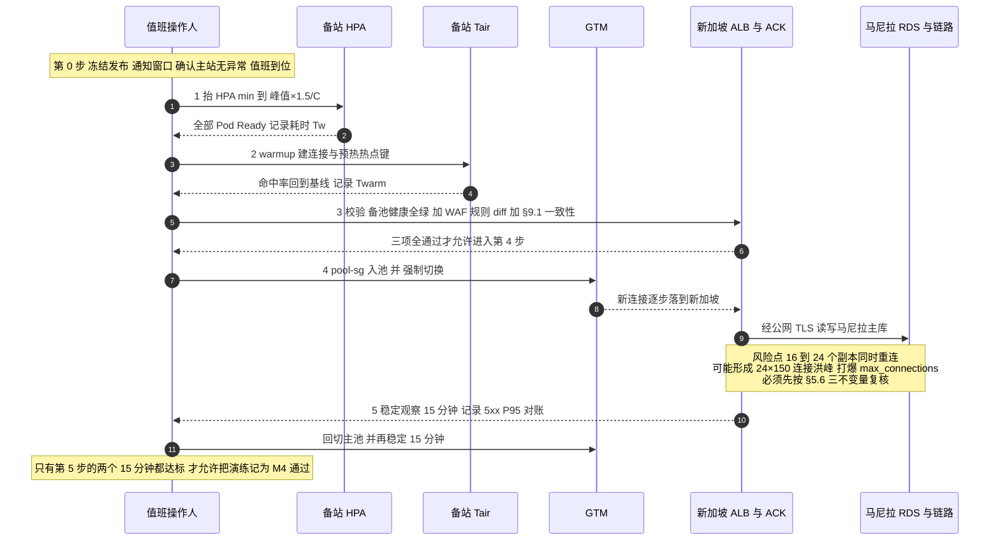
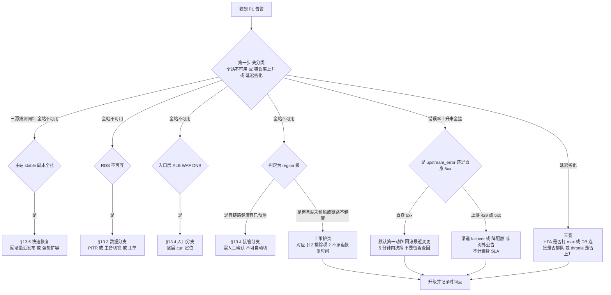
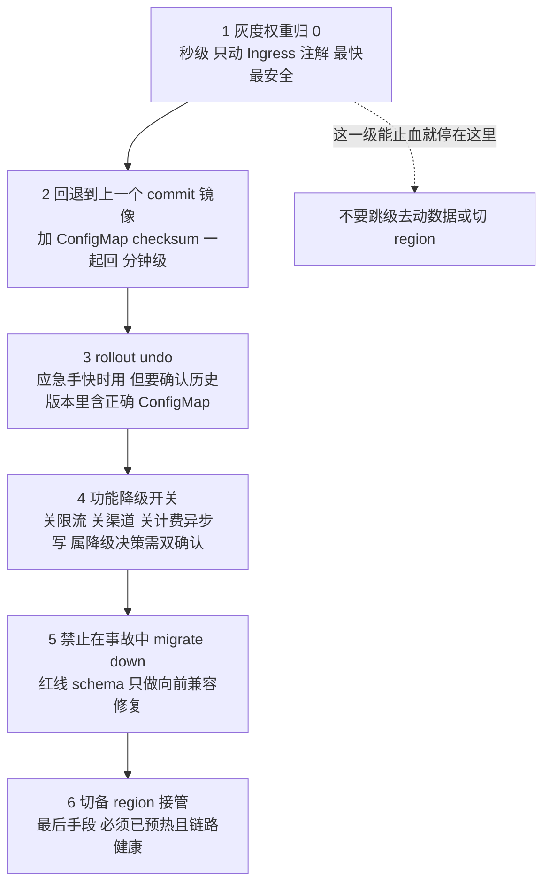

## 11. 阶段 I：D8–D9 落地（任务 33、36、39、49、51、34、35）

### 11.1 任务 33｜容量与压测验收（并发 SSE 1500 / 管理面 800 QPS）

#### 操作步骤

1. **环境**：perf 命名空间（同规格、同节点池参数、独立 DB `newapi_perf`）。生产压测**禁止**（会污染额度与上游配额）。
2. 上游用 **mock 上游**（可控延迟、可控 token 速率、可注入 429/5xx）。真实上游压测会把厂商打死并触发风控。

```yaml
# 简易 mock：Nginx/Go 实现 SSE，延迟可配
apiVersion: apps/v1
kind: Deployment
metadata: {name: mock-upstream, namespace: new-api-perf}
spec: {replicas: 6, template: {spec: {containers: [{name: mock, image: ${MOCK_IMAGE},
  env: [{name: FIRST_TOKEN_DELAY_MS, value: "300"}, {name: TOKEN_INTERVAL_MS, value: "30"},
        {name: ERROR_RATE, value: "0.001"}, {name: SSE, value: "true"}]}]}}}
```

3. 场景矩阵（每个场景 ≥10 分钟稳态 + 3 分钟突发）：

| 场景 | 内容 | 关键断言 |
| --- | --- | --- |
| S1 常态 | 500 并发 SSE，30% 命中缓存 | P95 首字 ≤ 800ms；5xx ≤0.05% |
| S2 峰值 | **1500 并发 SSE** | HPA 扩到位，无 Pending；FD/内存不触顶 |
| S3 突发 | 0 → 1500 并发 30 秒内 | 冷启动窗口错误率 ≤1%，30s 内回稳 |
| S4 管理面 | 800 QPS 登录/列渠道/看板 | 无 DB 慢查询堆积；登录限流不误伤 |
| S5 上游劣化 | 上游 50% 请求 5xx / 延迟 5s | 自身不被拖死；错误归类为 `upstream_error`；熔断生效 |
| S6 Redis 故障 | kill Tair 连接 | **降级放行而非 fail-closed**（G8）；额度不出错 |
| S7 日志库故障 | 断开 `LOG_SQL_DSN` | 业务不阻塞；降级计数上升 |
| S8 DB 主备切换 | 切换中打流 | 5xx 窗口 ≤60s 且自愈（§10.7） |
| S9 长流 | 单请求 12 分钟 | **确认 ALB 600s 上限行为**（P0-5），产品侧要有明确文案 |
| S10 发布并发 | 压测中滚动发布 | 5xx = 0（§8.2 V2） |

4. 观测采集：`hey`/`vegeta`/`k6` 任选，但要同时抓 `container_cpu_cfs_throttled_periods_total`、`process_open_fds`、`pg_stat_activity`、NAT 出流量、WAF 拦截数。

**验证（通过标准）**：以 **S2 通过 + S3 收敛 + S5/S6/S7 不致命** 为硬门槛；任何一项不过 → 触发 §12 裁剪预案讨论（延后上线 or 降 SLA 承诺），不允许"带病上线"。

**修复路径速查**

| 现象 | 定位 | 处置 |
| --- | --- | --- |
| 1500 并发时 FD 打满 | `process_open_fds` 逼近 limit | nofile（§7.1）+ 提升副本（分母）|
| CPU throttle 严重但 CPU 不高 | CFS quota 太紧 | request=limit 或去掉 limit.cpu；GOMAXPROCS |
| P95 随并发线性恶化 | DB 连接排队 | PgBouncer `default_pool_size`/连接预算（§5.6）|
| 内存持续涨不回落 | SSE 未释放/缓冲无上限 | 检查流关闭与 `bufio` 大小；限每请求缓冲 |
| 扩容后错误率反升 | 冷连接池 + 冷缓存 | 预热（§11.4）|

**坑**：
- **坑 1｜压测客户端自己成了瓶颈。** 后果：测出"没问题"。改进：客户端与被测同 region（新加坡/马尼拉），并监控客户端 CPU/端口耗尽。
- **坑 2｜用真实 API Key 压 mock 之外的真实渠道。** 后果：产生真实费用 + 触发厂商封禁。改进：压测渠道全部 `status=disabled` 的真实渠道 + mock。
- **坑 3｜压测数据留在生产库。** 改进：perf 独立库；压测前 `select count(*) from logs` 断言不是生产库。

### 11.2 任务 36｜备 region 接管演练（GTM 强制切换）

这是 M4 的**唯一硬证据**，必须在 D8 窗口内完整跑一遍，且**由 §10.3 的三步顺序驱动**。

**图 15｜接管强制顺序（顺序错了就不是演练，是制造事故）**



> **两条不可交换的顺序约束**：① **先抬 HPA、再切流量**——反过来做等于让 2 副本冷集群瞬间接全站流量，冷启动加 JIT 加连接建立会把 P95 拉到分钟级，然后被 GTM 判不健康又切回去，形成抖动；② **先 warmup、再入池**——Tair 未预热时命中率接近 0，所有请求穿透到马尼拉主库，跨区 RTT 会把连接占用时间放大 5~10 倍，最容易在这里触发 `too many clients`。

#### 操作步骤

```
0) 冻结发布，通知窗口，确认主站无异常，值班到位
1) 备站预热：HPA min 抬到目标副本（按峰值×1.5/C 计算）→ 等全 Ready → 记录耗时 Tw
2) Tair / DB 连接池 warmup（§11.4）→ 记录耗时 Twarm
3) 备池健康检查全绿 + WAF 规则一致性 diff（§9.1）
4) GTM：将 pool-sg 加入备池 → 强制切换（GTM 控制台 "Switch" 或调权重/摘主池）
5) 观察：dig 生效时间、备站 QPS 上升曲线、错误率、P95、DB 连接数
6) 稳定 15 分钟 → 回切主站 → 再稳定 10 分钟
7) 出报告：切换耗时、影响面、回切耗时、发现的问题与整改项
```

**验证判据**

| 指标 | 通过标准 |
| --- | --- |
| 授权切换 → 备池加入 → GTM 解析到 SG ALB 完成 | ≤ 90 秒（其中含 DNS TTL 60s 理论值） |
| 预热耗时 Tw + Twarm | 若走"自动感知故障"路径则全部计入 RTO；M4 口径要写清 |
| 切换期间用户侧错误率 | 由 §12 排除项口径决定；目标 ≤0.5% 且无 5xx 尖刺持续 >60s |
| 会话保持 | 主站签发的 token 在备站直接可用（无 401 潮） |
| 额度一致性 | 切换前后 `sum(quota)` 对账差异 = 0 |
| 回切 | 同样 ≤90 秒，且主站无需重启即承接 |

**坑与注意事项**
- **坑 1｜为了"演练顺利"提前把备池加入生产 GTM。** 后果：真实故障时无法解释"为什么没切"或"为什么乱切"。改进：加入备池本身就是**变更**，需审批；演练报告里明确"备池常态是否常驻"的最终决策（推荐：**常驻但权重 0**，切换由自动化 + 人工双确认）。
- **坑 2｜接管后发现新加坡的渠道配置/费率与主站不同。** 后果：计费错误（资金事故）。改进：配置以**同一 DB** 为唯一事实源（本方案正是如此），但要确认 `MEMORY_CACHE_ENABLED=false` 且备站已完成一轮 `SYNC_FREQUENCY` 收敛（§10.5）。
- **坑 3｜接管后限流失效。** §7.5 坑 1：两侧 Redis 计数独立 → 接管瞬间用户可短时超量。改进：明确"接管后限流重新计数"是可接受行为并写进口径；对高价值用户可加 DB 侧兜底额度检查。
- **坑 4｜回切时机太早。** 备站刚 warm 就切回，等于把 warm 的算力丢掉，且真实故障时同样会反复抖动。改进：演练里包含"**主站恢复后等待 ≥15 分钟再回切**"的规则并写入 §13.4。
- **坑 5｜只验 GTM，没验"客户端真的换过去了"。** 部分 SDK 长连接/DNS 缓存不重解析。改进：验证里包含"新连接建立到 SG ALB access log 的来源占比"。

### 11.3 任务 39｜备 region 链路拨测与告警（不健康时阻止接管）

接管的前提是"链路健康"。这条链路（SG→MNL RDS 公网）本身就是**接管期的唯一生死线**。

```yaml
# blackbox-exporter 探测 TCP 5432 + PG 握手
modules:
  tcp_pg:
    prober: tcp
    timeout: 5s
  pg_auth:
    prober: http
    # 用 sidecar 跑 psql -c 'select 1' 并暴露 /healthz 由 G8 提供
```

告警规则：

| 条件 | 级别 | 动作 |
| --- | --- | --- |
| SG→MNL RDS TCP 探测失败率 >10%（1min） | **P1** | 电话 + **自动禁止 GTM 切到备池**（把备池权重置 0） |
| RTT p95 > 150ms 持续 5min | P2 | 通知，接管前需人工确认 |
| `newapi_sg` 连接数 > 预算 80% | P2 | 阻止继续扩容备站副本 |
| TLS 握手失败（证书到期/地址漂移） | **P1** | 立即，接管能力视为失效 |

**验证**：临时把 SG 一个 EIP 从白名单摘掉 → 期望 3 分钟内 P1 触达 + 备池被自动置 0；恢复后自动回正。

**坑**：
- **坑 1｜"链路不健康就阻止接管"在真故障时可能是致命逻辑。** 后果：主站挂了 + 链路恰好也不稳 → 系统**拒绝接管** → 全站不可用（本想保数据一致，结果放弃了唯一可用性）。改进：这是**产品决策**，必须与 §12 G12 SLA 口径一起签字确认。建议折中：链路"完全不通"→ 阻止并电话；链路"劣化（RTT 高）"→ **仍然接管**（劣化可用 > 完全不可用）。
- **坑 2｜拨测探测本身消耗 RDS 连接。** 改进：探测复用连接或用独立低权限账号 + 频率 ≤10s。

### 11.4 任务 49｜备 region Tair 预热与接管前 warmup

接管瞬间的三件冷启动：**DB 连接池、Redis 缓存（渠道/用户/配置）、JIT/连接握手**。

```bash
# warmup Job（切流前跑，也可作为接管自动化的一步）
kubectl --context sg -n new-api create job warmup --image=${ACR_SG_PREFIX}:${SHA} -- sh -c '
  i=0
  while [ $i -lt 30 ]; do
    wget -qO- "http://127.0.0.1:3000/api/status" >/dev/null
    i=$((i+1)); sleep 1
  done'
# 真实预热要对热点键：按 top-N 活跃用户/渠道各拉一次轻量读接口
```

预热清单：

| 对象 | 做法 | 验收 |
| --- | --- | --- |
| DB 连接池 | `initContainer` / warmup 请求打并发读 | `pg_stat_activity` 里 `newapi_sg` 达到 `min_pool` 且无 handshake 失败 |
| Tair | 预载渠道配置、模型列表、费率（`redis-cli --pipe` 或后台导出） | 接管后前 60s 的 **DB QPS 不出现尖刺**（关键指标） |
| HTTP 上游连接 | 预建 TLS 会话（打一次 `/v1/models` 类轻接口） | 首批请求 P99 不劣于稳态 1.5× |
| Pod 磁盘/页缓存 | 日志目录预创建 | 无首写延迟 |

**验证**：接管演练（§11.2）报告里必须有一张"**接管后 0–120s 的 DB QPS / P99 曲线**"。有 warmup 与无 warmup 各跑一次对比（在 perf 环境）。

**坑**：
- **坑 1｜预热键与生产 TTL 不一致，接管后立刻过期。** 改进：预热带原 TTL 或从主站 Redis `DUMP/RESTORE` 迁移（跨区需走安全通道，不要 `KEYS *` 扫全库）。
- **坑 2｜warmup 脚本打的是写接口。** 后果：制造垃圾数据/额度。改进：**只打幂等读接口**。

### 11.5 任务 51｜上游渠道 RPM/TPM 配额盘点与限流参数校准

| 步骤 | 内容 |
| --- | --- |
| 1 | 逐渠道登记：RPM、TPM、并发上限、突发桶、超额行为（429 硬拒 / 排队 / 降级） |
| 2 | 按 **8 个 EIP 合计** 与厂商确认白名单+配额是否按 IP 维度计 |
| 3 | 把业务峰值 QPS（§10.2 的 C × 副本）折算成 RPM，与配额比对，得出**真实系统上限** |
| 4 | 校准 `GLOBAL_API_RATE_LIMIT`：应用侧限流应**严于**上游配额（宁可自己 429，也不要被上游封） |
| 5 | 设计超额降级：渠道 failover 顺序、超时与重试预算（避免重试放大） |

**验证**：`curl` 打满应用限流阈值 → 期望应用侧 429，且上游侧观测不到超额 RPM（厂商控制台确认）；渠道 failover 在注入 5xx 后 ≤10s 生效。

**坑**
- **坑 1｜把限流值设成"厂商给的配额"。** 后果：所有租户共享配额，一个突发用户吃光全站 → 全员 429。改进：**全局配额 + 单用户配额**双层；单用户默认值保守（360/180s 已是代码默认）。
- **坑 2｜上游配额是"按 key"而接管后新加坡用同一 key。** 后果：主备共享配额，接管后并发翻倍直接撞墙。改进：主备分 key 或与厂商确认；在 §12 风险表记为 R-上游配额。
- **坑 3｜重试无预算。** 后果：一次上游抖动引发重试风暴把配额瞬间打光（retry storm）。改进：指数退避 + 重试预算 ≤10% + 熔断。

### 11.6 任务 34｜上线检查表、发布窗口冻结与正式上线

#### 上线检查表（全部为"是"才允许切 DNS 到生产入口）

```
【门禁】
☐ G0 13 项全过（§3.13 打勾表已归档）
☐ M1–M4 证据齐（§12），无未闭环 P0/P1 缺陷
【容量与韧性】
☐ S2(1500 并发)/S3(突发)/S5/S6/S7 场景通过
☐ 单实例容量 C 实测；16 副本能扛 1.5× 峰值
☐ 备站 24 副本可达 + warmup 时长实测
☐ RDS 主备切换演练通过；PITR 演练通过（RPO/RTO 实测）
☐ 备 region 接管与回切演练通过，额度对账 0 差异
【安全】
☐ 安全核查 15 项通过或已签字豁免（§9.10）
☐ 白名单：RDS 三组 / 8 EIP 上游 / 支付回调三层 全通过
☐ 证书：SNI 校验、链完整、到期 ≥25 天、自动续期任务在
☐ 无 0.0.0.0/0 入向非 80/443；伪造 Host 反例返回非 200
【可观测】
☐ SLO 看板数字与原始查询一致；P1 电话实测触达
☐ 三重拨测（GTM/站点监控/blackbox）独立产出
☐ 日志脱敏抽查通过；audit 180 天投递可查
【运维】
☐ 运维访问面：私网端点、最小 RBAC、60min kubeconfig、变更审批
☐ Runbook 与应急预案评审通过（§13），值班表生效
☐ 成本看板与预算告警（80%）生效
【商务/口径】
☐ G12 SLA 五条口径 + 4 排除项书面签字
☐ 泰国用户接入马尼拉（RTT 55–80ms）偏差已书面说明
☐ 发布窗口冻结期已通知（建议上线后 72h）
```

#### 正式上线步骤

```bash
# 1) DNS 正式切到 GTM（若之前直连 ALB 做验收）
dig +short api.likha.com @8.8.8.8
# 2) 小流量观察（若有灰度开关/白名单用户优先放行）
# 3) 30/60/120 分钟三次快照：错误率、P95、DB 连接、上游 429、账单速率
# 4) 宣布上线完成，进入 72h 冻结窗口（只允许回滚，不允许功能变更）
```

**坑**
- **坑 1｜上线即改配置。** 后果：出问题无法归因（是新版本还是新配置？）。改进：冻结窗口内**只回滚不前进**。
- **坑 2｜回滚方案未演练。** 后果：真要回时才发现 DB 已 Contract。改进：§11.7 明确"发布后 24h 内回滚必须可用"，且 expand-contract 保证 24h 内不 Contract。
- **坑 3｜把"部署成功"当"服务健康"。** 改进：上线判定依据是 **SLO 面板 + 拨测**，不是 `rollout status`。

### 11.7 任务 35｜移交运维（D9）

移交物（每项都要有可执行路径，不接受"口述"）：

| 交付 | 内容 | 验收方式 |
| --- | --- | --- |
| Runbook | P1 场景 × 处置：站点不可用 / DB 不可写 / Redis 挂 / 上游全挂 / 证书到期 / 备站接管 / 回切 / 密钥轮换 | **新人照做能恢复一次**（在 perf 抽考） |
| 应急预案 | §13 全部条目 + 决策树 + 联系人升级路径 | 桌面推演一次 |
| 值班表 | 2 人轮换 + 项目负责人升级；P1 电话可达 | 实拨一次 |
| 拓扑与访问路径图 | VPC/SG/NAT/ALB/WAF/GTM/ACK/RDS 全链路 + 运维入口 | 评审签字 |
| 权限矩阵 | RAM ↔ RBAC ↔ 白名单 ↔ 密钥归属 | 抽查 3 个身份 |
| 成本看板 | 上季度实际 + 弹性敏感度 + 超预算处置阈值 | 能按 tag 出账 |
| 已知限制清单 | 21 项差异中的残余项（如 APM 未确认、马尼拉 2AZ、600s 上限、DTS 决策理由、接管后限流重计数） | **接手方确认知悉** |
| 巡检节奏 | 日：错误预算/账单突增/回调 4xx；周：migrate up-down-up、备份恢复抽样、证书剩余天数；月：白名单漂移、EIP 一致性 | 日历/工单已建 |
| 变更 SOP | 灰度权重推进、SESSION_SECRET 轮换、节点池扩缩、DNS/GTM 变更 | 每 SOP 有一次演练记录 |

**坑**
- **坑 1｜移交 = 丢文档。** 后果：D10 起所有问题回来找原执行人，等于没移交。改进：安排 **2 周影子值班**（运维主导、原执行人旁观），并在验收单上双方签字。
- **坑 2｜已知限制没写下来。** 后果：接手方把架构决策当 bug 反复排查（典型："为什么不建新加坡库""为什么 ALB 入向是全开"）。改进：`impl_deploy.md` 与本指南 §1 差异表一起归档，并在每个"看起来像漏洞"的配置旁写一句 reason（**注释即文档**）。
- **坑 3｜密钥归属不清。** 后果：轮换无人执行、到期才发现。改进：每个 KMS Secret 有 owner + 轮换周期字段（§2 网络与安全规划表已列，交接时复述）。

### 11.8 D8–D9 出口（M5）

```
☐ S1–S10 全场景压测报告（含曲线截图）
☐ 备 region 接管/回切完整演练报告（0–120s DB QPS 与 P99 曲线）
☐ 上线检查表 100% 勾选并归档
☐ 正式发布完成，72h 冻结窗无 P1/P2
☐ 移交包九件套齐全 + 新人抽考通过 + 2 周影子值班计划落地
```

---

## 12. 里程碑验收清单与证据

### 12.1 门禁与里程碑

| 阶段 | 判定 | 出口证据（必须可点开看） |
| --- | --- | --- |
| **G0** | T-5/T-3 十三项前置全部完成（§3.13 打勾表） | 实名批复截图、配额工单批复号、`dig` NS 生效输出、证书签发详情（含 Sans/到期）、11 类产品开通列表、**G8 合并 commit + CI 绿**、连接数预算表、SLA 口径签字页、staging 方案确认 |
| **M1**（D1–D2） | 网络 + 数据底座就绪 | VPC/10 vSwitch 网段截图；RDS HA 状态（两 AZ）；Tair `allkeys-lru`；CK 决策落地；8 EIP 登记；SG 绑定 `sg-mnl-app`（非 127.0.0.1） |
| **M2**（D3–D4） | 集群 + 应用底座就绪 | 两集群 `kubectl get nodes` 跨 AZ；`ulimit -n`=200000；master 二次启动 DDL=0；stable/备站跑通；主站 token 在备站可用（§7.4 V4） |
| **M3**（D5–D6） | 对外可服务 + 安全可观测收口 | ALB/WAF/GTM 生效；SG 反例自查输出为空；三重拨测产出；canary 权重实测；安全核查 15 项（含豁免单） |
| **M4**（D7–D8） | 容量与接管能力达标 | 单实例容量 C 表；HPA 4–16 与 2–24 实测；备站 24 副本 warm 耗时；**接管/回切演练报告**；RDS 主备切换 5xx ≤60s |
| **M5**（D8–D9） | 正式上线 + 移交 | 压测 S1–S10 报告；上线检查表；移交九件套 + 抽考记录 + 影子值班计划 |

### 12.2 SLA 99.95% 判定口径（与 G12 一致，必须书面签字）

- **测量源**：三重拨测（GTM 健康探测 ∪ CMS 站点监控 ∪ 集群外 blackbox），任一源判定"不可用"即计入；窗口 = 自然月。
- **不可用定义**：`GET /api/status` 在 3 个连续探测周期（45s）内失败 **或** 业务写接口 5xx 率 >5% 持续 ≥60s。
- **月度预算**：21.6 分钟；按 5min 粒度做燃烧率告警（§10.8）。
- **排除项（四条，逐条要客户确认）**：
 ① 上游模型厂商自身故障/限流（按 `upstream_error` 指标区分，非自身 5xx）；
 ② **region 级整体故障**（马尼拉 AZ/region 全挂）—— 因本次交付不含第三 region 主库，此类场景 RTO 由 RDS 恢复时间决定（实测 1.5–4h），**不构成违约**；
 ③ 计划内维护窗口（提前 48h 通知、月累计 ≤30 分钟、且落在业务低谷）；
 ④ 客户端 DNS 缓存导致的切换滞后（GTM TTL 60s 之后的部分）。
- **延迟口径**：主站常态 P95 首字 ≤800ms；**接管期**（流量在备 region）放宽至 ≤1500ms（跨区 SQL RTT 所致，§10.1 实测支撑）。
- **单请求上限**：ALB 600s 硬上限（P0-5），超 600s 的长任务须走异步 —— **产品文档与合同须一致说明**。
- **交付范围偏差声明**：泰国用户接入马尼拉（RTT 55–80ms），与 `impl_deploy.md` 1.2"主站点不能只放一个区域"的结论存在偏差；泰国为二期。

### 12.3 关键风险与残余（上线时仍存在的）

| 风险 | 现状 | 残余处置 |
| --- | --- | --- |
| 上游配额与白名单依赖外部审批 | 8 EIP 已确认，配额按 key 共享 | 主备分 key 谈判；应用侧限流严于配额 |
| ClickHouse 马尼拉不可用（P0-1） | 按 §4.5 选定方案落地 | 若选跨区方案：接管期日志延迟，日志不作为 SLA 证据源 |
| `/healthz`/`/readyz`/`/metrics` 未注册 | 探针降级用 `/api/status` | **G8 未完成则 SLA 承诺应下调**（DB 故障时无法自动摘流/扩容滞后） |
| ARMS APM 马尼拉未确认（P1-12） | 不纳入证据链 | 上线后提工单确认，再启用链路追踪 |
| 马尼拉仅 2 AZ（P1-8） | 3AZ 方案不可行 | 接受；region 级故障走排除项② |
| Managed Grafana 不在马尼拉（P1-11） | 建在新加坡 | 跨区看板读取延迟，非生产链路依赖 |
| 会话在接管后依赖两侧同 SESSION_SECRET | 已统一 KMS 源 | 轮换 SOP 强制双 region 同步；§11.2 覆盖 |
| Redis 独立导致接管后限流重计数 | 已知行为 | 写进口径；高价值用户 DB 侧兜底 |

---

## 13. 回滚与应急预案

> 原则：**每一条预案都必须是被演练过的**（§11.7 要求新人照做一次）。未演练的预案视同不存在。

### 13.1 决策树（P1 入口）

**图 16｜P1 接到告警后的分流决策（先分类，再动手）**



> **为什么"先分类"比"先动手"重要**：region 级判定如果自动触发接管，会在**备站没预热**的情况下把全站流量灌进 2 个冷副本——这是唯一一种会把"局部故障"放大成"全站不可用且无法回退"的错误动作。所以接管分支必须**人工确认 + 链路健康 + 已完成 warmup** 三条件同时成立；三条件缺一，正确动作是上维护页（它是**诚实的降级**，属于 §12 排除项 2 的范畴，好过让用户在超时里反复重试）。

### 13.2 应用与发布回滚

**图 17｜回滚动作优先级（从上到下，越上越快越可逆）**



| 级别 | 生效时间 | 可逆性 | 前置条件 | 误用后果 |
| --- | --- | --- | --- | --- |
| 1 权重归零 | 秒 | 完全可逆 | canary 存在 | 无（首选） |
| 2 回退 commit | 1–5 分钟 | 可逆 | GitOps 镜像与配置同批 | 只回镜像不回配置 → 新代码配旧配置 |
| 3 rollout undo | 1–5 分钟 | 可逆 | 上一 ReplicaSet 未被清理 | 回到了一个"从来没跑过"的版本 |
| 4 降级开关 | 秒–分钟 | 可逆（必须补回） | 值班 + 项目负责人双确认 | 全局限流裸奔 → 被打爆 |
| 5 migrate down | — | **不可逆** | **事故中一律禁止** | 数据丢失 |
| 6 切备 region | 5–30 分钟 | 可回切 | 预热完成 + 链路健康 | 冷集群接全站流量 |

> **让 1–4 级始终可用的唯一条件**：发布后 **24 小时内不做 Contract**（§9.5 坑 4）。一旦提前删了旧列，回退镜像也没用——代码读不到列，第 1~4 级全部失效，只剩第 6 级和"等数据恢复"。这是把"发布纪律"和"应急预案"绑在一起的唯一起点。

```bash
# 首选：GitOps 回退一个 commit（镜像 + ConfigMap checksum 一起回）
kubectl -n new-api rollout undo deploy/new-api-stable
kubectl -n new-api rollout status deploy/new-api-stable --timeout=10m
# 精确回退到指定 SHA
kubectl -n new-api set image deploy/new-api-stable new-api=${ACR_MNL_PREFIX}:${GOOD_SHA}
# 灰度问题：权重归零（最快，秒级）
kubectl -n new-api annotate ingress new-api-canary alb.ingress.kubernetes.io/canary-weight="0" --overwrite
```

- **DB 回滚红线**：发布后 **24h 内禁止 Contract**；若必须回滚代码，schema 只能"向前兼容修复"（加列/加表），**严禁**在事故中执行 `migrate down`（数据不可逆）。
- **Redis 不可用（fail-open 未落地时）**：临时 `kubectl set env deploy/new-api-stable GLOBAL_API_RATE_LIMIT_ENABLE=false`（会全局限流失效，属**降级决策**，需值班 + 项目负责人双确认，事后必须补回）。

### 13.3 RDS / 数据分支

| 场景 | 处置 | 时限 |
| --- | --- | --- |
| 主库不可写（HA 已自动切换） | 确认应用重连（§10.7）；对账额度 | 5min 决策 |
| 数据误删/误更新 | **PITR 恢复到新实例** → 反向导出差异 → 补写回主库（**禁止覆盖原实例**，§6.5 坑 1） | 1.5–4h |
| 慢查询打爆连接 | 前置 PgBouncer 降 `default_pool_size`；kill 长查询 `select pg_terminate_backend(pid)` | 分钟级 |
| 主库整体不可恢复 | 备 region **有 schema 但无独立数据**（红线）→ 只能等 RDS 恢复；这就是 §12 排除项② 的代价 | — |

### 13.4 入口与接管

```bash
# GTM 手动切到备池（先做 §11.2 的 1)2)3) 预热三步）
# 回切：主站 healthy 后等待 ≥15 分钟（§11.2 坑 4）再切
# 紧急止血（无法接管时）：把 GTM 主池指向"维护页"静态源（OSS+CDN 兜底页）
```

- 维护页必须在**上线前就已部署好**并能一键切换（否则故障时来不及做）。
- DNS 直连兜底：`api.likha.com` 的**低 TTL A 记录**（预置为 ALB IP）作为 GTM 失效逃生通道，并在 Runbook 里标注"这会绕过 GTM，只用于极端场景"。

### 13.5 运维通道失效

| 场景 | 处置 |
| --- | --- |
| 堡垒机不可用 | 审批制临时开 API Server 公网端点 + IP 白名单，用完立即关（§8.5 坑 4） |
| kubeconfig 过期且无法续签 | 用 RAM admin 身份在控制台重签发（仅 2 人持有，写在信封里） |
| SLS/Grafana 不可读 | 降级 `kubectl logs --since=10m` + `psql` 直查 `pg_stat_activity`；关键动作前必须先"取得可观测" |

### 13.6 快速扩容（HPA 失灵时）

```bash
kubectl -n new-api patch hpa hpa-new-api-stable --type=merge -p '{"spec":{"minReplicas":12}}'
# 或临时绕 HPA（记录并 30 分钟内恢复）
kubectl -n new-api scale deploy/new-api-stable 12
# 节点不够 → 抬节点池期望值
aliyun cs ModifyClusterNodePool --ClusterId ${ACK_MNL_ID} --NodepoolId ${NP_MNL} --body '{"scaling_group":{"desired_size":8}}'
```

**坑**：手工 `scale` 与 HPA/GitOps 三方打架（GitOps 会把它 sync 回去）。改进：预案里**一律用 HPA `minReplicas`**，不改 Deployment。

### 13.7 密钥/凭据泄露应急

1. 立即在 RAM 禁用相关 AK；上游渠道 key 在厂商侧吊销并轮换。
2. `SESSION_SECRET` 轮换（§9.6）——注意这会**强制全员重登**，属预期代价。
3. 从 KMS 拉取受影响 Secret 的访问记录 + ActionTrail 时间线，出事件报告。
4. **Git 历史里的密钥不算已清除**：轮换是唯一有效修复。

### 13.8 裁剪预案（工期告急时，按顺序砍）

| 优先砍 | 理由 | 代价 |
| --- | --- | --- |
| RDS 只读实例（马尼拉 #16） | 报表分流可后补 | 导出类查询打主库 |
| DCDN（#10） | 静态资源可先用 OSS 直读 | 首屏延迟 + 出站流量成本 |
| 新加坡 ClickHouse（SG #12） | 暂用主站日志库 | 接管期日志跨区写延迟 |
| 成本看板（#39） | 事后补 | 短期账单不可归因 |
| **不可砍**：PgBouncer/连接预算、cluster-autoscaler、备站 HPA 与 1.5× 容量、G8 代码补项、SESSION_SECRET 一致性、WAF/证书 | 砍了 99.95% 就不成立（`impl_deploy.md` 8.2） | — |

---

## 14. 附录

### 14.1 命令速查

```bash
# ---- 身份与配额 ----
aliyun sts GetCallerIdentity
aliyun ecs DescribeAccountAttributes --RegionId ap-southeast-6 --AttributeName.1 maxInstances
aliyun quotas ListProductQuotas --ProductCode ecs --RegionId ap-southeast-1

# ---- 资源存在性总览（每 region 一条）----
for r in ap-southeast-6 ap-southeast-1; do
  echo "=== $r VPC / vSwitch ==="
  aliyun vpc DescribeVpcs --RegionId "$r" \
    | jq -r '.Vpcs.Vpc[] | [.VpcId, .CidrBlock, .VpcName] | @tsv'
  aliyun vpc DescribeVSwitches --RegionId "$r" --PageSize 50 \
    | jq -r '.VSwitches.VSwitch[] | [.VSwitchId, .ZoneId, .CidrBlock, .AvailableIpAddressCount] | @tsv'
done
# 期望：马尼拉 6 个 vSwitch（2 pub + 2 app + 2 data）/ 新加坡 4 个（2 pub + 2 app），
#       网段与 §2.2 完全一致，且 AvailableIpAddressCount 未被 Pod 打满

# ---- 出口 IP 一致性（核心巡检）----
aliyun vpc DescribeSnatTableEntries --RegionId ap-southeast-6 --NatGatewayId ${NAT_MNL} \
  | jq -r '.SnatTableEntries.SnatEntry[]|[.SourceVSwitchId,.SnatIp]|@tsv'

# ---- RDS ----
aliyun rds DescribeDBInstanceAttribute --DBInstanceId ${RDS_MNL_ID} \
  | jq -r '.Items.DBInstanceAttribute[0]|{Engine,EngineVersion,Category,MasterZone,SlaveZone,DeletionProtection}'
aliyun rds DescribeDBInstanceIPArrayList --DBInstanceId ${RDS_MNL_ID} \
  | jq -r '.Items.DBInstanceIPArray[]|[.DBInstanceIPArrayName,.SecurityIPList]|@tsv'
aliyun rds DescribeDBInstanceSSL --DBInstanceId ${RDS_MNL_ID} | jq '{SSLEnabled,ConnectionString}'

# ---- ACK / 节点池 ----
aliyun cs DescribeClusterDetail --ClusterId ${ACK_MNL_ID} \
  | jq '{state,current_version,cluster_spec,profile,parameters:(.parameters|map(select(.key|test("RRSA|EndpointPublicAccess|SnatEntry"))))}'
aliyun cs ListClusterNodePools --ClusterId ${ACK_MNL_ID} \
  | jq -r '.nodepools[]|[.nodepool_info.nodepool_id,.auto_scaling.enable,.scaling_group.min_instances,.scaling_group.max_instances]|@tsv'

# ---- ALB / 证书 / WAF ----
aliyun alb GetListenerAttribute --ListenerId ${LID} | jq '{IdleTimeout,RequestTimeout,SecurityPolicyId}'
aliyun cas DescribeUserCertificateList --ShowSize 50 | jq -r '.CertificateList[]|[.Name,.AfterDate]|@tsv'
aliyun dcdn DescribeDcdnL2Ips | jq -r '.[]'      # 仅启用 DCDN 时需要

# ---- 连接数与数据库健康 ----
psql "$DSN_MIGRATE" -c "select datname,count(*) from pg_stat_activity group by 1"
psql "$DSN_MIGRATE" -c "select state,count(*) from pg_stat_activity group by 1 order by 2 desc"
SHOW POOLS   # pgbouncer admin

# ---- K8s 日常 ----
kubectl -n new-api get deploy,hpa,pdb,ingress -o wide
kubectl -n new-api top pods
kubectl -n new-api get events --sort-by=.lastTimestamp | tail -20
```

### 14.2 上线前 60 分钟检查（当天照做）

```
☐ 三重拨测全绿且无抖动（过去 24h）
☐ 错误预算本月剩余 > 15 分钟
☐ RDS: CPU<60%、连接数<70% 预算、无 >1s 慢查询堆积、复制/备份无失败
☐ PgBouncer: cl_waiting=0、sv_active 稳定
☐ ACK: 节点全 Ready、无 Pending、可分配内存 > 30%
☐ stable 副本数 = min 且 PDB ALLOWED DISRUPTIONS ≥1
☐ GTM: 主池健康、TTL 60、备池按最终决策（常驻 0 权重 / 不加入）
☐ 证书剩余 > 25 天
☐ 上游 8 EIP 生效确认无回退
☐ 维护页可一键切换（实测过一次）
☐ 回滚命令已在剪贴板（rollout undo / 权重归零 / GTM 回切）
☐ 值班 2 人在岗 + 电话可达实测 + 升级路径明确
```

### 14.3 本指南的引用与事实来源

| 类别 | 来源 | 说明 |
| --- | --- | --- |
| 部署清单与计划 | `菲律宾部署方案-v2.1-修订版.xlsx`（7 Sheet 全量解析） | 任务编号、日期、人员、门禁、里程碑、风险、裁剪预案均以该文件为准 |
| 架构依据 | `impl_deploy.md` 7.1/7.1.1/7.2/7.4.1–7.4.5/7.8/7.9/7.10、8.1–8.6 | 章节号在正文中直接引用 |
| 评审依据 | `部署方案评审-2026-09-23.md`（v2.1 修订来源） | 21 项差异与其修订要点对应 |
| 代码事实（本仓库实测） | `common/init.go:50-55`（SESSION_SECRET 默认值 Fatal）、`common/init.go:88-89`（`NODE_TYPE != "slave"` 判 master）、`common/init.go:110`（SYNC_FREQUENCY 默认 60）、`common/init.go:123-125`（限流默认 360/180s）、`model/main.go:145`（主库不支持 CK）、`model/main.go:212/259`（`SQL_MAX_OPEN_CONNS` 默认 **1000**）、`router/api-router.go:26`（唯一 `GET /api/status`） | 全仓 grep 确认 `/healthz`、`/readyz`、`/metrics` **未注册** |
| 云产品能力 | 阿里云国际站帮助中心（`alibabacloud.com/help/en`），核对时间 **2026-09-24** | 21 项差异（§1）；产品可用性列表会变，动手前一律 `【控制台核实】` |

### 14.4 术语与缩写

| 术语 | 含义 |
| --- | --- |
| G0 / G1–G13 | 上线前置门禁（Gate）；G0 = 全部前置通过，D1 才允许启动 |
| M1–M5 | 里程碑（§12.1） |
| 三不变量 I-1/I-2/I-3 | 连接数预算：应用侧总量、PgBouncer 池、RDS `max_connections` 三者关系（`impl_deploy.md` 7.4.5.1） |
| expand-contract | 迁移三段式：加→回填→删（§9.5） |
| 双密钥轮换 | `SESSION_SECRET` + `SESSION_SECRET_OLD` 过渡（§9.6） |
| 1.5× 接管容量 | 单站点全量接管能力 ≥ 被接管站点峰值 × 1.5（`impl_deploy.md` 8.5） |
| warmup / 预热 | 切流前把连接池、缓存、上游 TLS 会话打到稳态（§11.4） |
| fail-open / fail-closed | 限流依赖故障时放行 / 拒绝（G8 要求 fail-open） |
| 错误预算燃烧率 | 单位时间消耗预算的速度，用于提前告警（§10.8） |
| SRE 排除项①–④ | SLA 不计入的场景（§12.2），必须商务签字 |

### 14.5 交付前自检（对本文档自身）

```
☐ §1 的 21 项差异在正文对应章节都有"做法"，不只是列问题
☐ 每个任务都有 操作步骤 / 验证方法 / 不通过时的修复 / 坑（现象→后果→改进）四段
☐ 所有密钥/凭据均走 KMS + RRSA/ExternalSecret，正文无一处真实密钥值
☐ 所有破坏性操作（PITR 覆盖、migrate down、白名单摘除、drain、scale 0）都标注了窗口与双人复核
☐ 所有"可能已变化"的云产品事实都要求了 【控制台核实】
☐ §12 里程碑证据与 §11 演练一一对应，无"只写了要求没写怎么验"的项
```

---

**文档结束。** 本指南与 `菲律宾部署方案-v2.1-修订版.xlsx` 配套使用：xlsx 管"做什么、谁做、何时做"，本指南管"怎么做、怎么验、错了怎么修、坑在哪"。任何一处在国际站控制台发现与本文不一致，以**控制台 + 工单答复为准**，并把差异回填到 §1 差异清单。

