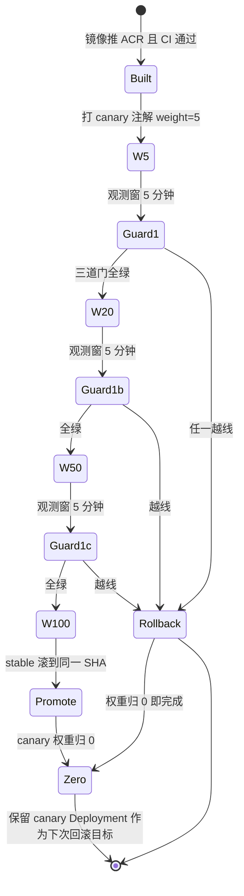
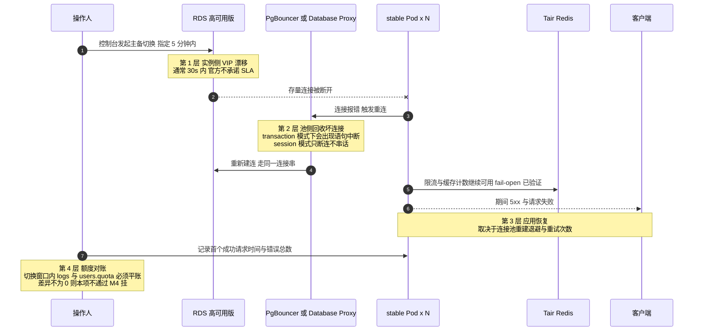
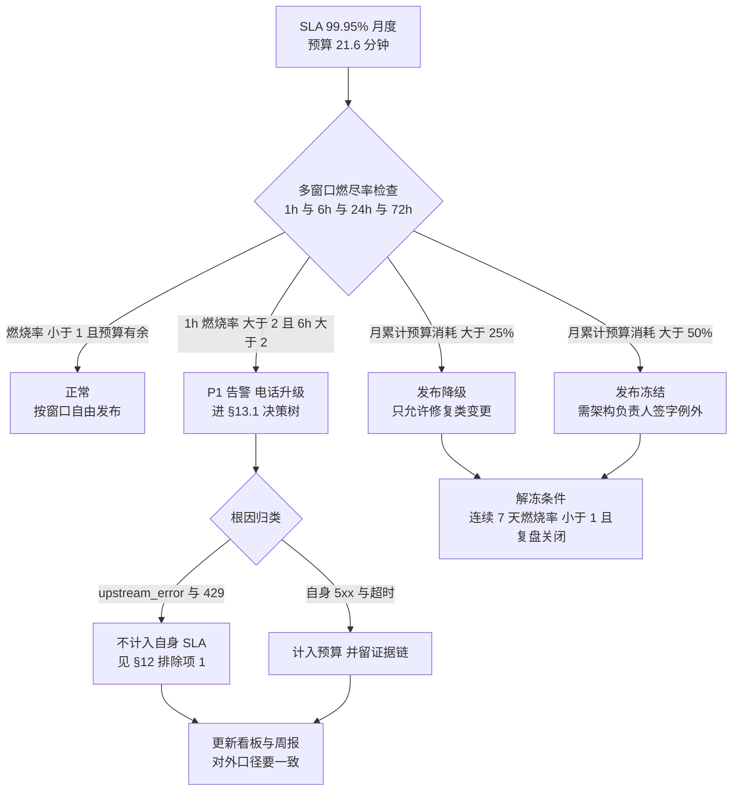

**文本速查版**

```
T0   SESSION_SECRET  = A                     （全员在用 A）
T1   把 KMS 值改为 B，但先不重启（无影响：env 只在启动读）
T1+  分批滚动 stable：先 1 个 Pod → 观察 → 全量
     ⚠ 滚动期间 A/B Pod 混跑，同一用户可能命中不同 Pod → 出现"偶发 401"
T2   用 canary 权重 + 会话粘滞（ALB source-key 会话保持 60s）缩小混跑窗口
T3   全量 B 且稳定 30 分钟后，A 彻底失效（旧 token 需要重登）
```

3. **强烈建议实现真双密钥**（推荐落地形态，写入 G8 需求）：

```go
secrets := []string{os.Getenv("SESSION_SECRET"), os.Getenv("SESSION_SECRET_OLD")}
// 签发用 secrets[0]；校验按顺序尝试非空项
```

#### 验证方法

```bash
# V1 重叠窗口：旧 token 在滚动后仍可用
curl -sS -H "Authorization: Bearer $OLD_TOKEN" https://api.likha.com/api/user/self | jq -e '.success'   # 期望 true
# V2 新签发 token 立即可用且被两 Pod 都认
# V3 轮转后 KMS 旧版本不可读（防止误恢复）
aliyun kms GetSecretValue --SecretName aone/newapi/prod/SESSION_SECRET --VersionId <old>   # 期望报错或按策略拒绝
# V4 审计：轮换动作在 ActionTrail 有记录，且变更单号可关联
```

**修复**：V1 失败 → 说明代码不支持双密钥或 Pod 未全部滚动；立即把 KMS 值改回 A 并全量 `rollout restart`（回滚方向唯一，**不要试图改前端**）。

#### 坑与注意事项

- **坑 1｜主备两 region 不同时轮换。** 后果：接管瞬间全员掉线（比 §6.2 坑 3 更隐蔽，因为平时看不出来）。改进：**轮换 SOP = 主站滚完 + 备站滚完 + 复验 §7.4 V4**，三步都在一个变更单里；§11.3 接管演练必须包含"刚轮换完"这一状态。
- **坑 2｜把 `_OLD` 长期留着。** 后果：密钥面翻倍，泄露概率上升。改进：轮换 SOP 里第 4 步"清空 `_OLD`"，T+24h 自动执行。
- **坑 3｜轮换时改成了空值或 `random_string`。** 后果：`log.Fatal` 全站起不来（`common/init.go:50-55`）。改进：KMS 写入前做长度/字符集校验（≥32 随机字节），CI 加 lint。
- **坑 4｜顺带把 `SYNC_FREQUENCY` 一起改。** 后果：一次变更两件事，出问题难归因。改进：**一个变更单只做一件事**。

### 9.7 任务 48｜支付回调源 IP 白名单 + 签名校验验证

1. 取支付渠道官方回调 IP 段（Epay/Stripe/PayPal/支付宝国际…，多数**公布在文档且会变**），落成 ConfigMap + 定时同步任务。
2. WAF 精确路径豁免（§8.3 坑 3）+ 应用侧 IP 白名单 + 签名校验三层。
3. 应用侧白名单配置示例：

```yaml
data:
  NOTIFY_IP_ALLOWLIST: "3.33.3.3/32,52.10.1.0/24"   # 从渠道文档同步，禁止 0.0.0.0/0
```

**验证**：

```bash
# V1 合法源 + 合法签名 → 200 且入账
# V2 合法源 + 错签名 → 4xx 且不入账（查 orders 无新记录）
psql "$DSN_MIGRATE" -c "select id,status from orders where out_trade_no='TEST'"   # 期望 status 未变
# V3 非法源 + 合法签名 → 拒绝（IP 层挡）
# V4 无签名 → 拒绝
# V5 WAF 不拦回调（真实渠道沙箱跑一次全链路）
```

**坑与注意事项**
- **坑 1｜只看 `X-Forwarded-For` 第一跳取客户端 IP。** 后果：攻击者伪造头即可绕过 IP 白名单 → **伪造回调完成支付**，属资金级漏洞。改进：ALB/WAF 场景用**可信跳数**取 IP（`X-Forwarded-For` 从右往左取第 N 个，N=可信代理数）；或在 ALB 层注入 `X-Real-IP`，应用只信它。
- **坑 2｜回调白名单忘了随渠道 IP 变更同步。** 后果：某天开始支付全量失败（表现是"用户说扣款成功但没到账"）。改进：渠道 IP 段做成**定时任务同步 + 变更告警**；并在 §10.8 加"回调 4xx 比例"告警。
- **坑 3｜幂等只做在应用层（内存 map）。** 多副本下不成立。改进：**DB 唯一约束**（`out_trade_no` unique）+ `INSERT ... ON CONFLICT DO NOTHING`，重试安全。
- **坑 4｜回调处理里同步调用上游模型补发额度。** 后果：上游慢 → 渠道超时重投 → 重复入账放大。改进：回调只做"记账 + 入队"，发放异步。

### 9.8 任务 40｜证书正式部署到 ALB / WAF / DCDN + SNI 校验

（对应 v2.1 修正的时序问题：证书必须在 ALB/WAF 创建之后部署，D6 执行。）

```bash
# 从 CAS 取证书 ID 并确认覆盖域名
aliyun cas DescribeUserCertificateDetail --CertId ${CERT_ID} | jq -r '.CommonName, .Sans'
# 期望 Sans 含 api.likha.com, ops.likha.com, *.likha.com

# 部署到 ALB listener（AlbConfig 里声明式管理，见 §6.3；不要控制台手工挂）
# WAF / DCDN 侧在各自控制台或 OpenAPI 绑定同一 CertId
```

**验证**：

```bash
# V1 SNI 正确（同 IP 多域名场景）
echo | openssl s_client -connect ${ALB_VIP}:443 -servername api.likha.com 2>/dev/null | openssl x509 -noout -dates -subject
echo | openssl s_client -connect ${ALB_VIP}:443 -servername nonexistent.likha.com 2>&1 | grep -Ei "alert|error"
# V2 证书链完整（Android/老客户端友好）
curl -sSIv https://api.likha.com/api/status 2>&1 | grep -E "SSL certificate|issuer"
nmap --script ssl-enum-ciphers -p 443 api.likha.com | tail -20    # 期望 grade A，无 SHA1/弱套件
# V3 到期与自动续期
aliyun cas DescribeUserCertificateList --ShowSize 50 | jq -r '.CertificateList[] | [.Name,.Fingerprint,.AfterDate] | @tsv'
# 期望 AfterDate ≥ 今天 + 25 天；<30 天触发告警（P0-7：最长约 199/200 天）
```

**坑**：
- **坑 1｜只换 CAS 证书，没同步 AlbConfig。** 后果：ALB 继续用旧证书，到期日全站 HTTPS 报错。改进：**证书部署纳入 GitOps**（CertManager + `cert-manager-alibabacloud-dns01-webhook`，或 ACM/KMS → 外部同步 Job 调 `UpdateListenerAttribute`）；到期告警必须打到 §10.8 值班通道。
- **坑 2｜通配符不覆盖多级。** `*.likha.com` **不覆盖** `a.b.likha.com`。若将来用 `cdn.api.likha.com` 会握手失败。改进：域名规划统一二级。
- **坑 3｜国际站没有免费 DV（P0-7）**，别按国内站经验"等免费证书签发"。改进：付费 DigiCert/GlobalSign 通配符 + 托管自动续期，预算入 §9.9。
- **坑 4｜证书私钥落盘在本地。** 改进：私钥只在 CAS/KMS；导出仅限轮换窗口并即时销毁（安全核查 #38 会查）。

### 9.9 任务 52｜带宽与规格量化 + 成本量化表

#### 操作步骤

1. 带宽估算（impl_deploy.md 8.5：流式网关硬瓶颈）。以 1,000 并发 SSE 为口径：

| 项 | 估算式 | 取值 |
| --- | --- | --- |
| 单路下行稳态 | 30 tokens/s × ~4 B/token ≈ 120 B/s + SSE 头开销 ≈ 0.3–0.5 KB/s | 0.5 KB/s |
| 1,000 并发 | 0.5 KB/s × 1000 ≈ 0.5 MB/s ≈ **4 Mbps** | 保守按 **40 Mbps**（含请求上行、图片/base64、突发） |
| NAT 网关 | ≥ 200 Mbps | 需提工单确认默认上限 |
| 单 EIP 峰值 | ≥ 100 Mbps（共享带宽包） | 用 **CDT/共享带宽包** 统一计费 |
| ALB | LCU 上限按峰值连接数 + 新建连接数 + 处理数据量三取最大 | 1,000 并发 + 峰值 500 CPS ≈ 3–4 LCU，留 10× 余量 |

2. 成本量化表（月度，国际站美元计价，全部**必须**填实际购买页价格）：

| 资源 | 规格 | 数量 | 单价 | 月成本 | 弹性敏感度 |
| --- | --- | --- | --- | --- | --- |
| ECS 马尼拉 | g8i.2xlarge | 4–8 | 【核实】 | | 高（HPA 直接放大） |
| ECS 新加坡 | g8i.2xlarge | 2–12 | | | **极高**（接管时 6×） |
| RDS PG | 16C64G HA | 1 | | | 低 |
| Tair | 4GB 主备 | 2 | | | 低 |
| ClickHouse | 见 §4.5 选定方案 | 1 | | | 中（跨区流量另计） |
| 跨区公网（SG→MNL RDS） | 出方向 GB | 估 | | | **常被忽略**：接管后所有 SQL 走公网 |
| NAT + 共享带宽 | 200 Mbps | 2 | | | 高（流式出站） |
| ALB | LCU | 2 | | | 中 |
| WAF 企业版 + 请求数 | | 2 | | | 中 |
| DCDN | 流量 GB | | | | 高（前端资源） |
| SLS | 写入 GB + 存储 | | | | **高**（日志级别一改就爆） |
| OSS | 标准+低频+归档+跨区复制 | | | | 低 |
| GTM Ultimate / DNS 付费版 | | 1 | | | 低 |
| Managed Grafana（新加坡） | | 1 | | | 低 |
| 证书 | 通配符 ×2/年 | | | | 低但必须记 |

3. 成本看板（任务 39 马尼拉清单 #39）：标签 `site/project/env` 全量打，预算告警 80%，月度 review。

**验证**：`aliyun bssopenapi QueryBill` 能按 tag 聚合出上表；压测后 NAT 流量曲线与估算偏差 <50%。

**坑**：
- **坑 1｜低估跨区流量。** 接管后**全部** SQL 走马尼拉 RDS 公网，读写双向 GB 级。改进：压测时实测 `pg_stat_activity` + NAT 出流量，算出接管后的单位时间费用，写进 SLA 成本附注。
- **坑 2｜按量 + 无预算告警。** 后果：一次 CC 攻击把 DCDN/WAF 请求数打到天价。改进：预算 80% 告警 + WAF 频控 + 账单"异常突增"日巡检（移交运维项 §11.6）。

### 9.10 任务 38｜上线前安全核查（OWASP / 白名单 / 密钥 / 审计）

#### 核查清单（每项要留证据，不通过不得进 D8 上线）

| # | 项 | 方法 | 通过标准 |
| --- | --- | --- | --- |
| 1 | 无硬编码密钥 | `git log -p --all \| grep -Eic "LTAI[0-9A-Za-z]{16}\|BEGIN .*PRIVATE KEY"`；`trufflehog/gitleaks` 扫全仓 | 0 命中；历史命中已做**密钥轮换 + BFG 清洗** |
| 2 | 依赖漏洞 | 镜像扫描（ACR 企业版）+ `govulncheck ./...` + `npm audit --omit=dev` | Critical=0；High 有豁免单 |
| 3 | Secret 权限边界 | `kubectl auth can-i --as-group newapi-viewer get secrets -n new-api` | 拒绝 |
| 4 | 容器逃逸面 | Pod `runAsNonRoot`、`readOnlyRootFilesystem`、`capabilities.drop:[ALL]`、禁 `privileged` | 全部满足（new-api 需要写 `/app/logs` → 用 emptyDir 挂写路径） |
| 5 | 传输加密 | 全站 HTTPS + HSTS（`max-age=31536000; includeSubDomains`）+ TLS1.2+ | nmap grade A |
| 6 | SQL 注入面 | GORM 参数化；grep `Raw(`/`Exec(` 的拼接 | 无拼接；ClickHouse 查询同样参数化 |
| 7 | 越权 | 水平越权（`/api/user/:id` 类）、垂直越权（普通号访问 admin）用例各 ≥10 条 | 全部 403/404 |
| 8 | 认证与令牌 | 密码 bcrypt/argon2 成本、`access_token` 熵、登录限速、会话固定 | 复核 §6.2 SESSION_SECRET 与登录限流 |
| 9 | 回调伪造 | §9.7 V1–V4 | 4/4 通过 |
| 10 | 审计链路 | ActionTrail 投递 OSS/SLS 且 ≥180 天可查（P1-17） | 查得到 90 天前的事件 |
| 11 | 备份加密与访问 | RDS/OSS 服务端加密开启；OSS bucket 禁公共读 | `aliyun oss stat oss://bucket \| grep -i "ACL.*private"` |
| 12 | 日志脱敏 | 抽查 SLS：不得出现完整 token/API Key/密码 | 脱敏规则生效（`redact`） |
| 13 | CORS | `Access-Control-Allow-Origin` 白名单，禁止 `*` + credentials | 实测响应头 |
| 14 | 镜像签名/来源 | ACR 企业版 + 仅允许内网 VPC 域名拉取 + 禁 `latest` | 部署 manifest 全 SHA |
| 15 | 供应链 | CI 依赖锁文件、构建脚本来源固定 | `go.sum`/`bun.lock` 入仓且不跳过校验 |

**验证与修复**：任何一项不通过 → **不签 M3 完成**，按上表"通过标准"回改；豁免必须写明风险接受人 + 到期复审日。

**坑与注意事项**
- **坑 1｜安全核查排在压测之后。** 后果：改配置引发回归，工期塌。改进：D6 做，D7/D8 只复验增量。
- **坑 2｜只看控制台开关，不看实际行为。** 例：声明"禁公共读"但某个对象被单独设为公共读。改进：**逐 bucket `stat` + 抽样对象 HEAD**。
- **坑 3｜`runAsNonRoot` 与 new-api 镜像默认用户冲突。** 后果：Pod 起不来或 `/data` 权限拒绝。改进：Dockerfile 里 `chown` 数据目录 + `USER 10001`；灰度先在一副本验证。
- **坑 4｜密钥扫描只扫 HEAD。** 后果：历史 commit 里的 AK 仍在，被人 clone 就走。改进：扫 `--all`，命中即**轮换 AK**（轮换才是修复，删历史不是）。

### 9.11 D6 出口检查

```
☐ 备站 ALB + WAF + Ingress 就绪，内部域名可验收（未上公网 DNS）
☐ SLS/Prometheus/Grafana（新加坡工作区）+ 三重拨测产出数据
☐ canary 单副本可路由，权重推进与秒级归零实测通过
☐ 节点池自动伸缩：扩容到 8 台上限受配额约束且无 Pending 卡死
☐ 迁移版本化：up/down/up 在 perf 库跑通，AutoMigrate 已声明关闭计划
☐ SESSION_SECRET 双密钥/重叠窗口演练完成，主备同步轮换 SOP 定稿
☐ 支付回调三层校验 V1–V4 全通过
☐ 证书已部署 + SNI 校验 + 链完整 + 到期 ≥25 天 + 自动续期任务在
☐ 成本量化表填完实际单价，预算告警生效
☐ 安全核查 15 项：通过或有签字豁免单
```

---

## 10. 阶段 H：D7 落地（任务 30、31、32、37、43、44、47、53）

> D7 = **演练日**。八件事里六件是"把故障造出来再恢复"，必须在维护窗口 + 双人复核下做。顺序：#30（链路）→ #43/#44（容量）→ #53（一致性）→ #31（灰度）→ #37（DB 故障）→ #32（看板告警收口）。

### 10.1 任务 30｜备 region → 马尼拉 RDS 公网读写打通与 RTT 实测

#### 操作步骤与测量

```bash
# 从新加坡 Pod 内测「建连 + 一次查询」总耗时（各 50 次，含 TLS 握手）
kubectl --context sg exec deploy/new-api-ph-standby -- sh -c '
i=0
while [ $i -lt 50 ]; do
  t0=$(date +%s%N)
  psql "$SQL_DSN" -Atc "select 1" >/dev/null 2>&1
  t1=$(date +%s%N)
  echo $(( (t1 - t0) / 1000000 ))
  i=$((i+1))
done' | sort -n | awk '{a[NR]=$1} END{print "min="a[1]" p50="a[int(NR*0.5)]" p95="a[int(NR*0.95)]" max="a[NR]" (ms)"}'
# 更贴近真实：pgbench 单连接与 16 连接各跑 30s
kubectl --context sg exec deploy/new-api-ph-standby -- sh -c 'pgbench -n -N -c 1  -T 30 "$SQL_DSN"'
kubectl --context sg exec deploy/new-api-ph-standby -- sh -c 'pgbench -n -N -c 16 -T 30 "$SQL_DSN"'
```

同时测网络层 RTT：

```bash
kubectl --context sg run rtt --image=nicolaka/netshoot --rm -it --restart=Never -- \
  ping -c 20 ${RDS_MNL_PUB}         # ICMP 可能被过滤，通不通都要记录
traceroute ${RDS_MNL_PUB}
```

**判据（本指南给的口径，方案未量化）**：

| 指标 | 期望 | 不达标影响 |
| --- | --- | --- |
| TCP RTT（SG→MNL RDS） | ≤ 45 ms | 每个 SQL 往返一次，直接叠加到 P99 |
| `pgbench` 单连接 TPS | ≥ 20 | 低于此说明链路或 SSL 握手开销异常 |
| TLS 握手成功率 | 100% | 有失败即白名单/证书问题 |
| 建连平均耗时（含 TLS） | ≤ 200 ms | 决定连接池 `default_pool_size` 是否够 |

#### 验证方法

```bash
# V1 读写真的落在马尼拉主库（而不是本地某库）
kubectl --context sg exec deploy/new-api-ph-standby -- sh -c \
  'psql "$SQL_DSN" -Atc "select inet_server_addr(), current_database(), version()"'
# 与主站内网查询结果比对：同 address（或同一实例）、同 db

# V2 数据一致性：主站写一条标记，备站立即读到（无复制延迟）
psql "$DSN_MIGRATE" -c "insert into ops_drill_marker(note) values ('from-mnl')"
kubectl --context sg exec deploy/new-api-ph-standby -- sh -c \
  "psql \"\$SQL_DSN\" -Atc \"select note,ts from ops_drill_marker order by id desc limit 1\""   # 期望 from-mnl

# V3 连接数在预算内
psql "$DSN_MIGRATE" -c "select usename,state,count(*) from pg_stat_activity group by 1,2 order by 3 desc"
# newapi_sg 总数 ≤ 150 × 备站实际副本数，且 ≤ 预算 I-2

# V4 链路抖动时的应用行为（拔线测试）
# 临时把白名单里一个 EIP 移除 → 观察是否有请求超时/5xx 上升，恢复后是否自愈
```

#### 坑与注意事项

- **坑 1｜把"延迟可接受"当成"SLA 成立"。** 常态不走备站所以没问题，但**接管后 100% 请求跨区**，P99 会从 ~200ms 变成 ~400ms+，且每条 SQL 一次 RTT 往返 → 一次业务请求 3–5 条 SQL 就是 150–250ms 纯网络。改进：① §12 SLA 口径**书面区分**"主站延迟"与"接管后延迟"；② 应用侧减少同步 SQL 次数（G8：热配置走 Redis、额度写回批量化）；③ 接管前 `pgbench` 复测并留证据。
- **坑 2｜RTT 测了但没测"TLS + 连接建立"总成本。** 后果：接管瞬间连接池冷启动，前 30 秒全部超时。改进：预热（§11.4）+ `default_pool_size` 调大 + 池预热脚本随 Deployment `initContainer` 跑。
- **坑 3｜白名单只有 4 个 EIP 但 SNAT 表项按 vSwitch 粒度。** 后果：新加坡扩容出新 vSwitch/新节点时用未登记 IP 出口 → 偶发连不上。改进：白名单按 **NAT 网关 SNAT 条目**核对（`DescribeSnatTableEntries`），并保证所有节点在登记 vSwitch 内。
- **坑 4｜DNS 解析出的 RDS 公网 IP 变更，但应用侧连接池长期不重建。** 后果：主备切换/实例迁移后仍连旧 IP，`Connection refused` 且不自愈。改进：GORM `ConnMaxLifetime` 设 ≤ 5min（**必查**：若代码未设，作为 G8 需求）；PgBouncer `server_lifetime` 同理。

### 10.2 任务 43｜主站 HPA 4–16 落地 + 探针与单实例容量基线

#### 操作步骤

1. 单实例容量基线（这是所有容量推导的地基，**必须在 D7 实测而不是估算**）：

```bash
# 逐步加压找拐点：并发 SSE 数 vs 错误率/延迟/资源
hey -z 120s -q <rate> -c <conc> -m POST -H "Content-Type: application/json" \
  -D /tmp/req.json https://api.likha.com/v1/chat/completions
```

记录拐点表（**用 perf 环境，同规格 2C4G request / 4C8G limit**）：

| 并发 SSE | 单副本 CPU p50 | 内存 | FD | p95 首字延迟 | 5xx | 判定 |
| --- | --- | --- | --- | --- | --- | --- |
| 100 | | | | | | |
| 250 | | | | | | |
| 500 | | | | | | |
| 800 | | | | | | 先出现 throttle |
| 1200 | | | | | | 拐点候选 |

→ 取"p95 仍满足 SLO 且 5xx<0.1%"的最大并发 = **单实例容量 C**。峰值 1,500 并发 ⇒ 需要 `ceil(1500 / C)` 副本，必须 ≤ HPA max 16；否则要么提升单实例规格/优化，要么申请把 max 提到 24（配额联动 §3.4）。

2. HPA 除 CPU 外加自定义指标（并发 SSE 连接数 / 队列深度），需 G8 的 `/metrics`；未落地前**只靠 CPU 会明显滞后**（SSE 是 IO 密集，CPU 很低但连接已满）→ 这是坑 1。

**验证**：

```bash
kubectl -n new-api describe hpa hpa-new-api-stable          # 无 FailedGetResourceMetric
# 压测驱动扩容并观察端到端
watch -n2 'kubectl -n new-api get hpa,pods -l track=stable --no-headers | head'
# 期望：CPU 过 65% → 4→6→9→13→16 阶梯，无 Pending；压测 5xx 不升高
# 缩容：撤压后 5 分钟稳定窗内回落，且不低于 min 4
kubectl -n new-api get pdb -o wide                          # 缩容期间 ALLOWED DISRUPTIONS ≥1
```

**修复**：扩到 16 但 Pod Pending → §9.4 坑 1（节点池 max 8 不够）；HPA 不动 → metrics-server 缺失 / `scaleTargetRef` 名错 / 被 `kubectl scale` 手工设过 replicas 后短期锁住（看 `behavior` 事件）。

**坑与注意事项**
- **坑 1｜SSE 场景 CPU 是坏指标。** 后果：连接打满、内存/FD 上升而 CPU 30%，HPA 完全不扩 → 用户超时。**这是本方案容量层最大的风险。** 改进：① G8 暴露 `new_api_active_sse_connections`；② 过渡期用 **内存利用率 HPA**（60–70% of request）或外部指标适配器；③ 保底：把 `maxReplicas` 与节点池容量匹配并做**手动扩容 Runbook**（§13.6）。
- **坑 2｜`/api/status` 作 liveness 在 DB 故障时误杀 Pod。** 改进：§7.4 坑 3 + G8 `/healthz`；预案 §13.2。
- **坑 3｜request≠limit 且内存超卖。** 后果：节点 OOMKill 随机挑 Pod，出现"偶发重启"谜案。改进：内存 request=limit（Guaranteed），CPU 可 burstable。

### 10.3 任务 44｜备 region HPA 2–24 + 1.5× 接管容量验证

HPA（`min:2, max:24`）+ 节点池 `min:2, max:12`（12×8C ⇒ 96 vCPU；按 request 2C/副本理论 12×3=36 副本 ≥ 24，但**要扣系统预留与 PDB 窗口**，实测口径见坑 1）。

接管前必须按 **扩容 → Ready → 再切流** 顺序，绝不能"先切流再等扩容"。

```bash
# 验证扩容上限（演练窗口，在切流之前）
kubectl --context sg -n new-api patch hpa hpa-new-api-ph-standby --type=merge \
  -p '{"spec":{"minReplicas":24}}'
kubectl --context sg -n new-api wait --for=condition=available deploy/new-api-ph-standby --timeout=15m
kubectl --context sg get nodes
# 记录：从 min=2 抬到 24 的总耗时 = 接管前的 warmup 时长（这是 RTO 的关键组成）
kubectl --context sg -n new-api patch hpa hpa-new-api-ph-standby --type=merge -p '{"spec":{"minReplicas":2}}'
```

**验证判据**：

| 检查 | 通过标准 |
| --- | --- |
| 副本可达 24 | 全部 Running & Ready |
| 抬升到全 Ready 耗时 | ≤ 6 分钟（>10 分钟则 RTO 承诺需重谈） |
| 备站 24 副本 × 实测单实例容量 C | ≥ **1.5 × 主站峰值并发** |
| 抬升期间主站无影响 | 主站无 5xx 上升 |

**坑与注意事项**
- **坑 1｜按 vCPU 算容量，忽略内存与 FD。** 24 副本 × 4Gi limit = 96Gi；12 节点 × 32Gi = 384Gi（够），但马尼拉/新加坡节点池 `max 12` 若机型内存不同就不足。改进：以**实测 C** 与**四项资源维度（cpu/mem/fd/上游配额）取最紧**做判据。
- **坑 2｜新加坡 96 vCPU 配额没批复就演练。** 后果：打到一半 `QuotaExceeded`，伸缩活动失败，M4 判不过，还留下一堆半起节点。改进：§3.4 出口硬门禁；演练前跑 `DescribeAccountAttributes` 复核。
- **坑 3｜扩容完成但连接池/缓存是冷的。** 24 副本一起向跨区主库发起 300 连接 → 打爆（§10.1）。改进：**先扩容量、再做 §11.4 Tair/DB warmup、最后切流**三步顺序写死进 Runbook。
- **坑 4｜`cluster-autoscaler` 与 HPA 同时存在但 `scale-down` 打架。** 改进：节点池缩容冷却 ≥ 10min；接管演练期间临时关闭缩容（`kubectl annotate` 节点池/设置 `--scale-down-enabled`）。

### 10.4 任务 47｜ALB 安全组源收敛 + SNI 域名校验（复验 §8.1 结论）

- 若走 **WAF 云原生接入（推荐）**：ALB 入向**保持** `0.0.0.0/0:443`，把结论**书面记录**（为什么没按方案原文收敛），并补三条缓解：WAF 策略 + CC 阈值 + `alb-access` SLS 审计。
- 若走 **DCDN 回源**：用 `aliyun dcdn DescribeDcdnL2Ips` 取回源段并同步进 SG；**每日定时任务比对差异并告警**（网段会变）。
- SNI/域名校验：ALB 层确认未匹配 host 的请求返回 404/421 而不是命中默认后端（否则任何打 ALB IP 的 Host 头都能进业务 —— 跨租户串数据风险）。

```bash
# 反例验证：伪造 Host 不应命中 stable
curl -sSk -o /dev/null -w "%{http_code}\n" --resolve evil.com:443:${ALB_VIP} https://evil.com/api/status
# 期望 404/421，绝不能 200
```

### 10.5 任务 53｜配置热更新跨节点收敛验证（`SYNC_FREQUENCY=30`）

new-api 通过 DB + Redis/定时同步在多副本间收敛配置（渠道、模型、费率）。代码默认 `SYNC_FREQUENCY=60`（`common/init.go:110`），方案要求 30。

```bash
# 操作：在 admin 后台改一个可观测配置（如某渠道名称/权重/倍率）
# 断言：所有副本（含 canary、含新加坡备站）在 ≤ SYNC_FREQUENCY 内读到新值
for p in $(kubectl -n new-api get pods -l app=new-api -o name); do
  echo -n "$p : "; kubectl -n new-api exec ${p#pod/} -- sh -c \
    'wget -qO- "http://localhost:3000/api/status" | head -c 200' ; echo
done
```

更硬的验证：改**渠道状态**（禁用某渠道）后，连续打该渠道 100 次，统计仍被路由到的比例随时间下降曲线。

**验收**：30s 后各副本一致；60s 后新加坡备站一致。

**坑**：
- **坑 1｜`MEMORY_CACHE_ENABLED=true` 时收敛不依赖 Redis，Pod 各自为政。** 改进：prod 恒 false（§6.2 坑 2）；这条要在 §12 里作为**架构证据**。
- **坑 2｜Redis 里存的配置版本号与实际内容不一致（写成功、缓存未失效）。** 后果：部分副本永远读到旧渠道配置，"改价不生效"这类投诉。改进：验证里必须包含"改价 → 计费结果变化"的端到端断言，而不只是看 `/api/status`。
- **坑 3｜把 SYNC_FREQUENCY 改成 5s 想"更快收敛"。** 后果：每副本每 5s 全量拉配置，DB QPS ×副本数放大，HPA 扩容后打爆 DB。改进：不要低于 15s；扩容后重测 DB QPS。

### 10.6 任务 31｜灰度发布演练（5→20→50→100 与回滚）

**图 12｜灰度状态机与两道守护闸**



**GUARD1（每档都要过，任一失败立即 Rollback）**

| 门 | 指标 | 阈值 | 数据来源 |
| --- | --- | --- | --- |
| G1-a | canary 5xx 率 | 不高于 stable 的 1.2 倍且绝对值 < 0.5% | ALB access log + Prometheus |
| G1-b | P95 首字延迟 | 不高于 stable P95 + 15% | 网关指标（需 G8 的 `/metrics`） |
| G1-c | 额度扣减对账差异 | **必须为 0** | 主库 `logs` 与 `users.quota` 对账 SQL |

**GUARD2（只作用于 Promote，不作用于 W5/W20/W50）**

| 门 | 条件 |
| --- | --- |
| G2-a | 本次变更含 DB 迁移时，必须处于 **Expand 阶段**（Contract 一律禁止与灰度同批） |
| G2-b | `.down.sql` 在 staging 已跑通 `up → down → up` |
| G2-c | `SESSION_SECRET` 与镜像 SHA 无冲突（不同时改） |

> **为什么"权重归 0"就是回滚**：canary 与 stable 是两个 Deployment，回滚只动 Ingress 注解，秒级生效、无需重新调度 Pod。所以**永远不要为了回滚去删 canary Deployment**——删了下次就没有"始终有回滚目标"这条不变量了。

#### 演练脚本（必须双人，一人操作一人核对指标）

```bash
REL=${GIT_SHA_CANDIDATE}
for W in 5 20 50 100; do
  kubectl -n new-api annotate ingress new-api-canary \
    alb.ingress.kubernetes.io/canary-weight="${W}" --overwrite
  sleep 300                                   # 每档观测窗 5 分钟
  echo "== weight ${W}% =="
  kubectl -n new-api get pods -l track=canary
  # 人工核对看板：canary 5xx 率、P95 首字延迟、额度扣减对账差异、DB 慢查询
  # 任一越线 → 立刻回滚：权重 0
done
# 100% 后把 stable 滚到新 SHA（先 stable，再删 canary），保持"始终有回滚目标"
kubectl -n new-api set image deploy/new-api-stable new-api=${ACR_MNL_PREFIX}:${REL}
kubectl -n new-api rollout status deploy/new-api-stable --timeout=15m
kubectl -n new-api annotate ingress new-api-canary alb.ingress.kubernetes.io/canary-weight="0" --overwrite
```

**通过标准**：

| 档 | 观测 | 通过线 |
| --- | --- | --- |
| 5% | canary 5xx 率 | ≤ 主站基线 + 0.05pp |
| 20% | P95 首字延迟 | ≤ SLO（如 800ms） |
| 50% | DB 连接数、CPU throttle | 无异常阶跃 |
| 100% | 额度/计费对账 | 与稳定版差异 0 |
| 回滚 | 权重归 0 生效时间 | ≤ 30s，且无残余错误 |

**坑与注意事项**
- **坑 1｜100% 时 stable 还停留在旧版（canary 长期当主跑）。** 后果：容量按 1 副本扛全量，下次故障无从回滚。改进：SOP 强制"100% → 滚 stable → 归零 canary"三连，缺一步视为发布未完成。
- **坑 2｜回滚只回镜像不回配置。** 后果：ConfigMap 里新参数被旧代码读到（或反之）。改进：**版本 = 镜像 SHA + ConfigMap checksum**，回滚一起回；GitOps 回退一个 commit。
- **坑 3｜灰度期间发生 AutoMigrate。** 如果候选版本带 schema 变更且 master 提前迁了，stable（旧码）可能不认新列。改进：严格 expand-contract（§9.5），**灰度阶段的迁移只能是 Expand**。
- **坑 4｜观测窗没有基线对比。** 后果：看不出变差。改进：每档记录同长度基线（前一天同时段）数字，写进 §12 证据。

### 10.7 任务 37｜主库故障切换演练（RDS HA + 应用重连 + 额度对账）

**图 13｜主备切换期间各层的时间点期望**



| 层次 | 记录什么 | 期望值（演练前据实测回填） |
| --- | --- | --- |
| 实例漂移 | 切换发起 → 新主可写 | ≤ 30s |
| 连接恢复 | 首个错误 → 首个成功查询 | ≤ 15s（退避上限决定） |
| 用户可见 | 5xx 持续时间与占比 | 持续 ≤ 45s，占比 < 0.1% |
| 数据正确 | 窗口内额度对账差异 | **必须 = 0** |

> 三条铁律：① **连接池必须开重连**，`RetryTimes` 与非零退避都要显式配，否则 Pod 会一直持有死连接直到被重启；② **PgBouncer 的 `query_wait_timeout=120` 要大于漂移时间**，否则切换期间堆积的等待会一次性超时打爆应用；③ **Redis 侧不能 fail-close**——主库切换不是限流挂掉的借口，若因 Redis 判定失败返回全站 429，会把一次 30 秒的数据库演练放大成整站不可用（见 G8 / §7.4 的 fail-open 要求）。

#### 操作步骤

1. 通知窗口，冻结发布（§11.2）。
2. 控制台 **RDS → 实例 → 服务可用性 → 主备切换**（指定 5 分钟内），同时开始打流量：

```bash
hey -z 900s -c 100 -m GET https://api.likha.com/api/status &
```

3. 观察并记录：
 - 切换起止时间（RDS 事件）、DNS/CNAME 是否变（高可用版地址不变，仅 VIP 漂移）
 - 应用侧错误窗口（`server closed the connection unexpectedly` / `FATAL: terminating connection`）
 - 自动重连耗时（GORM + `database/sql` 会重建连接，但**已有事务失败**）
 - 额度/日志是否出现重复扣费或漏扣

#### 验证判据

| 指标 | 通过标准 |
| --- | --- |
| 主备切换总耗时 | ≤ 30s（官方口径通常 <30s，实测为准） |
| 应用 5xx 窗口 | ≤ 60s；且**全部自愈**，无人工介入 |
| 切换后数据一致 | `select max(id)`、余额对账无差异 |
| 无脑裂双写 | 新主库 `pg_is_in_recovery()=f`，旧主变备 |
| 连接池恢复 | `pg_stat_activity` 数回到基线 |

#### 坑与注意事项

- **坑 1｜应用"看起来恢复了"但某些连接仍在旧主。** 后果：偶发只读失败/写失败。改进：切换后主动 `rollout restart` 不是必须，但**必须验证** `select pg_is_in_recovery()` 在应用侧看到 false。
- **坑 2｜长事务/长连接跨切换。** 后果：SSE 会话全断。改进：SSE 客户端要有重连语义；文档写明"主库切换影响进行中的流式请求"（§12 SLA 排除项候选，需客户确认）。
- **坑 3｜额度扣减依赖"读后写"而非原子操作。** 后果：切换重试导致重复扣费。改进：所有额度变更走 `UPDATE ... SET quota = quota - $x WHERE quota >= $x`（原子 + 条件），并加对账 Job（master-only）。演练必须跑一次对账。
- **坑 4｜切换演练把 GTM 判成不健康并切到新加坡。** 后果：跨区延迟突增 + 双活假象。改进：演练前**临时降低 GTM 敏感度或摘掉备池**（备池本就不该在 D7 前加入），并说明这属"人为制造的窗口"。
- **坑 5｜没测"RDS 完全不可用"分支（AZ 整体故障需人工提工单）。** 改进：在 perf 环境用 `iptables` 模拟 DB 黑洞，验证应用是否 fail-fast 返回 503 而不是请求堆积打爆 FD —— 这条直接决定 §13 预案可行性。

### 10.8 任务 32｜SLO / 错误预算看板 + 告警与值班（P1 走电话）

**图 14｜错误预算燃尽与发布冻结决策**



**燃尽示意（ASCII，便于放进周报纯文本栏）**

```
预算 100% ┤■■■■■■■■■■■■■■■■■■■■■■  月初起点 21.6 分钟
          │
  75%  ───┤  正常发布区
          │        ▓▓ 第 9 天一次 12 分钟故障 → 一次吃掉 55%
  50% ════╪════════ 冻结线：过线只允许签字例外
          │            ▒▒ 第 17 天 SSE 超时连锁
  25% ────┤───────── 降级线：只允许修复类变更
          │                 ░░ 第 24 天 池饱和
   0%     └────────────────────── 月末：预算基本耗尽
             1   9        17     30
```

> **口径提醒**：`upstream_error`（上游模型供应商 5xx / 429）**不计入自身 SLA**（§12 排除项 1），但必须**单独一条曲线**看。否则会出现"预算没烧完、却因为上游集体挂掉而整站不可用"的荒谬结论——对客沟通与内部复盘都要能把这两类分开。

#### 操作步骤

1. SLO 定义（与 §12 口径一致）：

| SLO | 指标 | 目标 | 窗口 |
| --- | --- | --- | --- |
| 可用性 | 外部拨测成功率（GTM + 站点监控 + blackbox 三源） | 99.95% | 月 |
| 请求成功率 | 5xx 比例（排除 4xx 与限流 429） | ≥ 99.9% | 5min 滑窗 |
| 延迟 | 首字延迟 P95 | ≤ 800 ms | 5min |
| 网关链路 | 上游 5xx 比例（区分自身/上游） | 单独看板，**不计入自身 SLO** | 月 |
| DB | 慢查询 >1s 数 | 阈值告警 | 5min |

2. 错误预算：月度 21.6 分钟；按 5 分钟粒度做"预算燃烧率"告警（燃烧率 >2x → P2，>10x → P1 电话）。
3. 告警分级与路由：

| 级 | 例 | 通道 | 响应 |
| --- | --- | --- | --- |
| P1 | 站点不可用、备站不可接管、DB 不可写、密钥泄露 | **电话** + 群 + 短信 | 5 分钟内响应 |
| P2 | 错误预算快速燃烧、P95 超标 10 分钟、HPA 打满 max、节点池扩容失败 | 群 + 短信 | 30 分钟 |
| P3 | 单副本重启、慢查询、证书 30 天到期、日志降级计数上升 | 群 | 下个工作日 |

4. 值班表（2 人轮换 + 项目负责人升级路径）；`ops.likha.com` 只对内网/堡垒开放。

**验证**

```bash
# V1 告警通路自证：制造一次可控 P1
kubectl -n new-api scale deploy/new-api-stable 0
# 期望：≤ 3 分钟内 P1 电话 + 群消息触达 2 名执行人 + 项目负责人（截图 + 通话记录留证）
kubectl -n new-api scale deploy/new-api-stable 4
# V2 静默与收敛：一次故障只产生 1 条 P1 + 关联告警折叠（不刷屏）
# V3 看板数字与 SLS/Prometheus 原始查询一致（抽查 3 个面板）
```

**坑**
- **坑 1｜告警用邮箱。** 后果：夜里没人看。改进：P1 必须电话（云监控电话需余额/国际站可用性**先实测**；不可用则用 ARMS/第三方 ONCALL 服务，并在 §12 记录实际通道）。
- **坑 2｜告警阈值按"日常流量"设，接管后立刻失真。** 改进：阈值用**比率/燃烧率**而非绝对量。
- **坑 3｜"上游 429/5xx" 算进自身可用性。** 后果：SLA 判定被上游绑架。改进：`router` 层区分自身错误与上游错误（自身 5xx vs `upstream_error` 指标），§12 排除项③。
- **坑 4｜看板做完没人复核口径。** 改进：任务 34 上线检查表里加"SLA 口径三方（开发/运维/商务）签字"。

### 10.9 D7 出口检查

```
☐ SG→MNL RDS RTT/TPS/建连实测值记录，且写进接管口径
☐ 单实例容量基线 C 实测；1500 并发 ÷ C ≤ 16（或已提 max 并配配额）
☐ 备站 24 副本可达 + warmup 时长实测（M4 硬指标）
☐ ALB 伪造 Host 反例返回非 200；SG 收敛结论书面化
☐ 配置 30s 跨副本收敛 + 跨 region 60s 收敛通过
☐ 灰度 5/20/50/100 全档通过 + 权重归零 ≤30s
☐ RDS 主备切换：5xx 窗口 ≤60s 且自愈，额度对账 0 差异
☐ SLO 看板 + P1 电话实测触达；错误预算燃烧率告警生效
```

---
