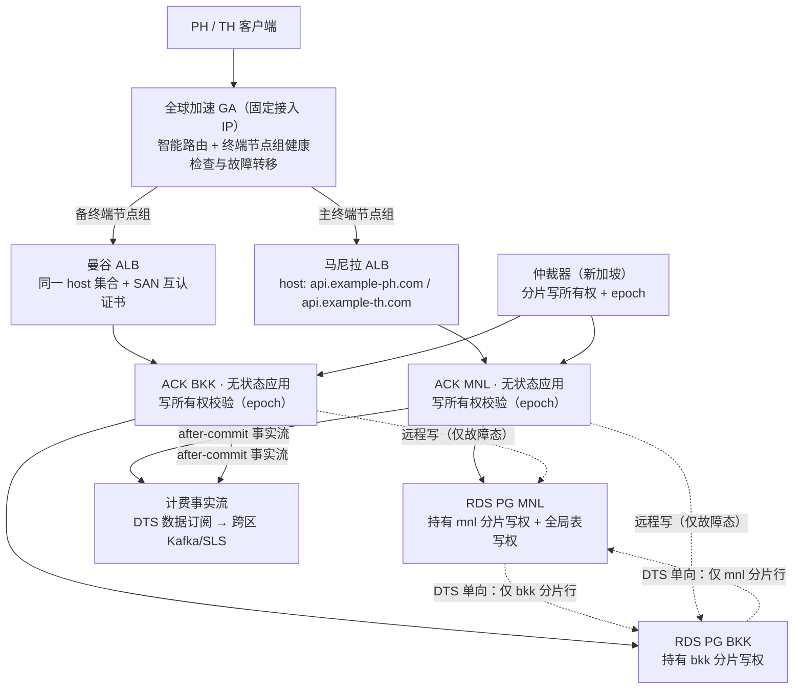

# 部署方案修订：面向「99.95% 不断服 + 计费误差 < 0.001」

| 项目 | 内容 |
| --- | --- |
| 修订对象 | `impl_deploy.md` 第七章（阿里云部署）、第八章（SLA 99.95%） |
| 前置输入 | `impl_deploy_review.md`（三项缺口核实报告） |
| 代码基线 | commit `972aed197` |
| 目标 | ① 可用性 ≥ 99.95% 且**切区不产生新请求中断**；② 计费误差率 < 0.001，重复扣费/漏扣**均为 0 笔** |

---

## 0. 先钉死验收口径（否则两个目标都无法验收）

### 0.1 「不断服」的精确定义

`impl_deploy.md` 8.1 只定义了「不可用」，「不断服」需要拆成三条可测指标：

| 编号 | 指标 | 口径 | 目标 |
| --- | --- | --- | --- |
| A1 | **新请求连续性** | 故障切换期间新发起的请求（含面板与 relay）成功率 | ≥ 99.99%（切换窗口内不允许 DNS 空白、证书错误、404） |
| A2 | **长连接断流恢复** | 已建立的 SSE 流在切换时允许断开，客户端重连到恢复首个 token 的时间 | ≤ 15 s，且**重连不产生重复计费** |
| A3 | **零配置型全损** | 因备用区域未配置 host/证书/路由导致的全量失败 | 0 次（禁止出现） |

> **必须在 8.1 中补一句**：已建立的长连接在进程/区域故障时断开不属于「完全不可用」，但计入 SLO 违约；否则任何部署都无法验收「不断服」。

### 0.2 计费误差定义

| 编号 | 口径 | 目标 |
| --- | --- | --- |
| C1（硬约束） | 重复扣费笔数 / 漏扣笔数，以 `request_id` 粒度可枚举对账 | **均为 0** |
| C2（率指标） | `误差率 = Σ|网关记录 − 权威基准| / Σ网关记录`，按小时窗口统计，取月度最大值；权威基准 = 分区事实流重放结果 | **< 0.001** |
| C3（收敛性） | 故障后进入重放对账，误差在 | ≤ 1 小时 | 内收敛到 C1/C2 |

排除项沿用 8.1：上游供应商故障、阿里云公告的区域级 IaaS 故障、客户侧网络、429。

---

## 1. 现方案为何不达标（五条硬伤）

| # | 硬伤 | 证据 | 破坏哪个目标 |
| --- | --- | --- | --- |
| H1 | 入口靠 GTM 改 DNS，客户端 DNS 缓存 / 固定 IP 会导致数分钟不可达 | `impl_deploy.md:151`（GTM 探测 15 s、切换 ≤ 60 s）；8.4 整区域 RTO ≤ 5 min | A1（不断服） |
| H2 | 备用区域 Ingress host/TLS 未定义 → 切区 TLS 失败或 404 | `impl_deploy.md:402-451` 仅马尼拉 host；仓库无任何 K8s 清单 | A3（配置型全损） |
| H3 | 双库可写 + DTS 双向同步，同一行两个写入者 | `impl_deploy.md:161`、`impl_tech.md:1505` 只写「冲突检测」；幂等键全为库内（`model/subscription.go:1240`、`model/task.go:533`） | C1/C2 |
| H4 | 两个区域各有一个 master，DB 租约只在单库互斥 → 同一任务双跑、各自结算 | `model/system_task.go:43-49,313-352`；`service/system_task.go:125-127`；`common/init.go:89` | C1/C2、A1 |
| H5 | **额度变更先落内存，5 秒后才批量写库** | `main.go:161-165`；`common/init.go:111`（默认 5 s）；`model/utils.go:35-42,44-63`；`model/user.go:1340-1347,1390-1393` | C1/C2 |

**H5 是本次新增发现，且最致命**：开启 `BATCH_UPDATE_ENABLED=true` 时，`DecreaseUserQuota` 只往进程内存的 `batchUpdateStores` 累加，最多 5 秒的扣费在进程被 kill / 区域故障时**直接丢失**，且不同实例各自缓冲、互不可见。文档 7.4.1 设该值为 `true` 的动机是「降低主库写放大」，但在「误差 < 0.001」目标下必须改。

---

## 2. 目标架构

### 2.1 四条不变量（Invariants）

> **I1 单写者**：任一数据行在任一时刻只有一个可写区域。
> **I2 可转移**：写所有权可在区域外仲裁下秒级转移，且带 fencing（纪元号），拒绝旧所有者的迟到写入。
> **I3 事实不丢**：计费事实提交后立即离开本区域独立持久化，不依赖数据库的异步跨区复制。
> **I4 入口无 DNS 依赖**：客户端接入点固定，后端切换在加速层内部完成。

四条不变量分别对应 H3/H4（I1）、H1（I2+I4）、H5/H3（I3）、H1/H2（I4）。

### 2.2 架构



### 2.3 表分类与所有权（决定 I1 如何落地）

| 类别 | 表 | 写入者 | 同步方式 |
| --- | --- | --- | --- |
| **分区表** | `users`、`tokens`、`user_sessions`、`auth_flows`、`user_subscriptions`、`subscription_pre_consume_records`、`tasks`、`quota_data`、`usedata` | 仅该用户归属分片的区域 | DTS 两条单向链路，按分片过滤（见 2.4） |
| **全局表** | `channels`、`options`、`model_pricing`、`casbin_rule`、`system_task_locks`、`subscription_plans` | 仅 `global_owner` 区域（默认 MNL，随仲裁转移） | 同步到另一区域只读 |
| **区域本地表** | 日志（ClickHouse）、`perf_metrics` | 本区域 | 不参与 DTS，靠 SLS 统一查询 |

> 关键点：**行级单写者使 DTS 双向同步不再产生写-写冲突**。H3 的根因不是「双向同步」，而是「同一行两个写入者」；分区所有权把它消除。

### 2.4 分片键与过滤

- 分片键：`users.home_region`（`mnl` / `bkk`），由注册入口决定（PH 注册渠道 → `mnl`，TH → `bkk`），此后**不可变更**（变更走迁移流程）。
- 分区表的 DTS 过滤条件：`home_region = 'mnl'` / `home_region = 'bkk'`（无 `home_region` 列的表通过 `user_id` 关联或冗余该列）。
- 迁移要求：为 `tokens`、`user_sessions`、`user_subscriptions`、`tasks`、`quota_data` 冗余 `home_region` 列并回填，否则无法做行级过滤。

---

## 3. 关键设计

### 3.1 写所有权与 fencing（解决 I1、I2、H4）

**仲裁器**：部署在新加坡（第三区域）的最小服务，只做一件事——维护分片所有权与纪元号。

| 字段 | 说明 |
| --- | --- |
| `shard` | `mnl` / `bkk` / `global` |
| `owner_region` | 当前唯一可写区域 |
| `epoch` | 单调递增；每次所有权变更 +1 |
| `lease_until` | 租约到期时间，owner 需定期续约 |

存储选型（任一）：
1. 新加坡的 **ApsaraDB Redis / Tair**（独立于两区域，`SET NX PX` + 续约）；
2. 新加坡的 etcd（强一致，推荐）；
3. 阿里云 **OSS 上的 CAS leader 文件**（最简，但有秒级延迟，只适合兜底）。

**应用侧校验**：

```go
// 写路径中间件（示意）
func requireWriteOwnership(shard string) error {
    lease := ownershipCache.Get(shard) // 本地缓存，TTL 1s
    if lease.OwnerRegion != common.RegionID {
        return ErrNotWriteOwner        // 拒绝写入 → 由上层重试或路由到 owner
    }
    if lease.Epoch < ownershipCache.LastSeenEpoch(shard) {
        return ErrStaleEpoch           // 拒绝旧纪元写入（fencing）
    }
    return nil
}
```

- 缓存 TTL 1 秒：过期期间最多 1 秒的误判窗口，配合 DB 层 epoch 列（`UPDATE ... WHERE epoch = ?`）做二次校验。
- 关键：**epoch 校验必须落在 SQL 的 WHERE 子句里**（条件更新），不能只靠内存判断，否则分区场景仍会双写。例如：

```sql
UPDATE users SET quota = quota - ?, write_epoch = :epoch
 WHERE id = ? AND write_epoch <= :epoch
```

### 3.2 故障态下的跨区写（保证 A1 不断服）

两区域应用**都无状态且能服务任意分片**，只是写目标不同：

| 状态 | mnl 分片写入目标 | bkk 分片写入目标 |
| --- | --- | --- |
| 正常 | RDS1（本地，< 5 ms） | RDS2（本地，< 5 ms） |
| MNL 应用故障、DB 存活 | RDS1（**BKK 应用远程写，60–90 ms**） | RDS2 |
| MNL 整区故障 | RDS2（promote，见 3.3） | RDS2 |

⇒ **最常见的故障（ALB / Pod / 单 AZ）不需要切换数据库、不需要变更写所有权、不产生数据丢失**。这是 A1 与 C1 同时成立的主要保障：跨区写只发生在应用层，DB 与数据不动。

代价：故障态下 PH 用户的写延迟增加 60–90 ms（仅预扣费与结算两次写）。文档 1.3 的 TTFT 增量 ≤ 20 ms 目标只在正常态适用，需在 SLA 中注明故障态放宽。

### 3.3 区域级故障（DB 也不可用）的处理

这是唯一需要 promote 的场景，也是 C1 风险最高的场景：

1. 仲裁器检测到 MNL 失联（连续 N 次探测失败）→ 将 `mnl` 分片的 owner 切到 `bkk`，`epoch + 1`；
2. BKK 应用开始以新 epoch 写本地 RDS2；
3. **回放事实流补齐差额**：RDS2 作为 MNL 库的副本，最后几秒可能落后。消费计费事实流（3.4）中 `epoch = 旧纪元` 且未在 RDS2 体现的记录，幂等重放；
4. 进入对账（3.5），直到 C2 收敛。

RPO 由「事实流的投递延迟」决定（目标 < 1 s），而非 DB 复制延迟。

### 3.4 计费事实流（解决 I3、H5、C1）

**为什么必须独立**：DB 跨区复制是异步的，且额度变更在开启 batch 时根本还没落库（H5）。事实流要在**提交后立即**把不可变事实送出区域。

写入点（三处必须覆盖）：

| 场景 | 触发点 | 事实记录 |
| --- | --- | --- |
| 预扣费 | `PreConsumeUserSubscription` 事务提交后 | `(epoch, region, request_id, user_id, -delta, consumed)` |
| 结算/补扣 | `BillingSession.Settle` 成功后 | `(epoch, region, request_id, user_id, ±delta, settled)` |
| 退款 | `RefundSubscriptionPreConsume` / `RefundTaskQuota` 成功后 | `(epoch, region, request_id, user_id, +delta, refunded)` |

通道选型（按可靠性排序）：
1. **DTS 数据订阅**：订阅主库 binlog/WAL → 跨区域投递到 Kafka/SLS。优点：与业务解耦，不依赖应用代码正确性；缺点：只能覆盖"已落库"的变更（对 H5 无效）。
2. **应用 after-commit 双写**：提交成功后写跨区 Kafka/SLS，失败则降级为本地重试队列。优点：覆盖 H5（内存缓冲期的事实）；缺点：需要业务代码改造。
3. **两者兼用（推荐）**：1 做兜底，2 做精确覆盖。

### 3.5 对账与重放（C1/C2/C3 的唯一可执行手段）

| 任务 | 频率 | 内容 | 输出 |
| --- | --- | --- | --- |
| 分区对账 | 每小时 | 按 `request_id` 比对事实流与两库记录，枚举「流中有库中无」「库中有流中无」「金额不一致」 | 差异明细 + 自动重放 |
| 聚合对账 | 每日 | `quota_data` 聚合、`users.quota` 累计变化、渠道 `used_quota` | C2 误差率指标 |
| 月度结算对账 | 每月 | 与上游供应商账单勾稽（区分网关误差与上游口径差） | 分账报告 |

**重放规则（幂等胜负判定）**：
- 同一 `request_id` 多条事实 → 以 `epoch` 最大者为准；`epoch` 相同 → 以事实流中的最终状态为准（`refunded` 优先于 `settled` 优先于 `consumed`）。
- 重放一律使用**增量写法**（`quota = quota ± delta`）而非绝对值写，避免覆盖并发变更。

### 3.6 关闭内存批量更新（H5 修复）

| 选项 | 做法 | 代价 |
| --- | --- | --- |
| **推荐** | `BATCH_UPDATE_ENABLED=false`，额度变更直接落库。现有实现已是原子增量 SQL（`model/user.go:1360-1378,1397-1403` 的 `gorm.Expr("quota - ?")`），并发安全且可重放 | 每笔一次 UPDATE，写放大回到 DB。用 PgBouncer + `SQL_MAX_OPEN_CONNS` 控制，配合 pg_stat_statements 观察 |
| 备选 A | 保留批处理，但改为「先写持久化队列（Redis Stream / 表），再由 updater 消费」 | 需要新增队列与消费逻辑 |
| 备选 B | 保留现状 + `preStop` 时 flush，切换前强制 drain | 只对优雅停机有效，进程 crash 仍然丢 |

**最低要求**：若暂时保留批处理，必须做到
1. `BATCH_UPDATE_INTERVAL` 从 5 s 降到 1 s；
2. 新增 `POST /internal/flush-batch` 并在 K8s `preStop` 中调用（配合现有的 `sleep 15`）；
3. 在故障切换 runbook 中明确「先 flush 再摘流」。

### 3.7 调度仲裁（H4 修复）

| 任务类型 | 归属 | 实现 |
| --- | --- | --- |
| `async_task_poll`、`midjourney_poll` | 按分区 | 每个区域只轮询 `tasks.home_region = 本区域` 的任务 → 天然无重复，无需 epoch |
| `channel_test`、`model_update` | 全局 | 仅在 `global_owner` 区域运行；非 owner 区域启动 runner 时直接跳过（读仲裁器） |
| `log_cleanup`、`auth_cleanup`、`subscription_reset` | 按分区 | 各自处理归属本区域的用户数据 |
| `system_task_locks` | 全局表 | 加 `(Scope, Type)` 复合主键，`Scope` 取分片名，为分区任务的租约留出空间 |

⚠️ 修改主键涉及迁移：SQLite 不支持 `ALTER COLUMN`，MySQL/PG 行为也不同。按 `AGENTS.md` 要求，必须在**真实** SQLite / MySQL ≥ 5.7.8 / PostgreSQL ≥ 9.6 上验证迁移幂等（新建库 + 存量库各跑一次、连续启动两次）。

### 3.8 入口设计（H1、H2 修复）

**用 GA 终端节点组替代 GTM DNS 切换**：

```yaml
# 全球加速 GA（标准型）：客户端固定访问 GA 分配的接入地址，
# 后端终端节点组按健康检查自动故障转移 —— 客户端 DNS 不参与切换。
# 控制台/CLI 配置要点：
#   1. 监听：TCP/443
#   2. 终端节点组 A（主）：马尼拉 ALB，权重 100，健康检查 /api/status（断言 success:true）
#   3. 终端节点组 B（备）：曼谷 ALB，权重 0（故障转移模式）
#   4. 智能路由：按延迟（菲律宾→MNL 组，泰国→BKK 组可做成同权重双活）
```

配套两区域 Ingress 与证书（同时消除 H2）：

```yaml
apiVersion: networking.k8s.io/v1
kind: Ingress
metadata:
  name: new-api
  namespace: new-api
  annotations:
    alb.ingress.kubernetes.io/backend-protocol: "http"
    alb.ingress.kubernetes.io/ssl-redirect: "true"
    alb.ingress.kubernetes.io/connection-drain-enabled: "true"
    alb.ingress.kubernetes.io/connection-drain-timeout: "120"
spec:
  ingressClassName: alb
  tls:
    # 同一张证书（SAN 同时包含两个域名），两个区域完全一致
    - hosts: ["api.example-ph.com", "api.example-th.com"]
      secretName: api-shared-tls
  rules:
    # 两个区域都声明两个 host，后端指向本区域的 Service
    - host: api.example-ph.com
      http:
        paths: [ { path: /, pathType: Prefix, backend: { service: { name: new-api, port: { number: 80 } } } } ]
    - host: api.example-th.com
      http:
        paths: [ { path: /, pathType: Prefix, backend: { service: { name: new-api, port: { number: 80 } } } } ]
```

DNS 层仍保留 GTM，但**只用于把用户解析到 GA 接入地址**，不再承担区域故障切换职责 → 彻底消除 H1 里「DNS 缓存拖长恢复时间」的问题。

### 3.9 客户端契约（A2、C1 的前提）

必须写进 `docs/authentication.md` 与对外 API 文档：

1. **重试必须复用同一 `request_id`**。服务端按 `request_id` 幂等，客户端换新 ID 重试会被计费两次，这是唯一无法由服务端修复的误差来源。
2. 响应头返回 `X-Request-Id` 与 `X-Write-Epoch`，便于客户端重试与排障。
3. SSE 断流后客户端重连策略：指数退避 + 携带原 `request_id`；服务端在幂等窗口内（建议 10 分钟）返回已完成的结果或续接。

---

## 4. 故障场景推演

| # | 场景 | 入口行为 | 数据/写所有权 | 计费影响 | RTO | 计入不可用 |
| --- | --- | --- | --- | --- | --- | --- |
| 1 | 单 Pod / OOM | ALB 摘除 | 不变 | 无（H5 修复后内存缓冲为 0） | 秒级 | 否 |
| 2 | 单 AZ 故障 | 同区另一 AZ 承接 | 不变 | 无 | ≤ 2 min | 否 |
| 3 | 单区域 **ALB** 全挂 | GA 故障转移到另一区域终端节点组 | 不变（DB 存活） | 无 | ≤ 30 s | 否（A1 满足） |
| 4 | 单区域**应用**全挂 | 同上；另一区域应用远程写故障区 DB | 写所有权不变，跨区写 +60–90 ms | 无（增量 SQL + 事实流） | ≤ 30 s | 否 |
| 5 | 单区域 DB **主库**故障 | 应用无变化 | RDS 同区域主备切换 | 切换期写入短暂失败由重试吸收；幂等保证不重复 | ≤ 60 s | 否 |
| 6 | 单区域整区（含 DB）故障 | GA 切换 + 仲裁 promote | `epoch + 1`，owner → 对端 | 事实流回放补齐，C2 在 1 h 内收敛 | ≤ 5 min | 按 8.1 排除项②处理，但仍应演练 |
| 7 | DTS 链路中断 | 无影响（写owner不变） | 另一区域变陈旧 | 无（DTS 不是计费依据，事实流才是） | 恢复即追平 | 否 |
| 8 | 区域间网络分区（脑裂） | GA 按健康检查选择 | **epoch fencing 拒绝旧 owner 的写入**（DB 条件更新拦截） | 旧区写入被拒 → 客户端重试到新区；无重复扣费 | 秒级 | 否 |
| 9 | 区域恢复回切 | 手工/脚本 | `epoch + 1`，owner 切回，先追平事实流 | 无 | ≤ 10 min | 否 |

> 场景 3、4 是「不断服」的主要实现路径：**改路由不改数据**。场景 6 才动数据，且被 8.1 的排除项覆盖。

---

## 5. 改动清单

### 5.1 部署层（无代码改动，可立即执行）

| # | 改动 | 位置 |
| --- | --- | --- |
| D1 | GA 标准型实例 + 两个终端节点组 + 健康检查，替换 GTM 承担故障转移 | 阿里云 GA |
| D2 | 两区域 Ingress 统一 host 集合 + SAN 互认证书 | `deploy/aliyun/*-ingress.yaml`（需新建，仓库当前无清单） |
| D3 | 备用区域 master `replicas: 0`（过渡措施，直至 3.7 落地） | 备用区域 master Deployment |
| D4 | `BATCH_UPDATE_ENABLED=false`（或降为 1 s + preStop flush） | ConfigMap |
| D5 | `preStop` 增加 flush 调用与 `sleep 15` 顺序确认 | Deployment |
| D6 | 引入仲裁器（新加坡 etcd/Tair） | 新建 |
| D7 | DTS 冲突策略显式化并写入文档（过渡期仍为双向时） | DTS 控制台 + `impl_deploy.md` 7.2 |
| D8 | 发布窗口内禁止 schema 变更跨区不一致（迁移只在单 master 执行） | GitOps 流程 |

### 5.2 代码层

| # | 改动 | 涉及文件 |
| --- | --- | --- |
| C1 | 新增 `RegionID` 配置（`REGION_ID`）与区域常量 | `common/init.go`、`common/constants.go` |
| C2 | `users` 及分区表新增 `home_region` 列 + 迁移与回填 | `model/user.go`、`model/main.go`（迁移）、各分区模型 |
| C3 | 写所有权客户端 + 1 s 本地缓存 | 新增 `service/ownership.go` |
| C4 | 写路径 epoch 条件更新（fencing 落到 SQL） | `model/user.go`（`increaseUserQuota` / `decreaseUserQuota`）、`model/subscription.go` |
| C5 | 计费事实流生产者（after-commit） | `service/billing_session.go`、`model/subscription.go`（`RefundSubscriptionPreConsume`）、`service/task_billing*.go` |
| C6 | 跨区对账与重放任务 | 新增 `service/reconcile_task.go`，注册为 system task |
| C7 | 调度按所有权/分区 gating | `service/system_task.go`（runner 启动前检查）、`controller/system_task_handlers.go`（分区过滤 payload） |
| C8 | `SystemTaskLock` 主键改 `(Scope, Type)` | `model/system_task.go` + 三数据库迁移验证 |
| C9 | 额度更新改为直接落库（或持久化队列） | `model/utils.go`、`model/user.go` |
| C10 | 新增 `/internal/flush-batch` 管理端点 | `router/`、`controller/` |

---

## 6. 观测与告警（新增指标）

| 指标 | 说明 | 阈值 |
| --- | --- | --- |
| `newapi_billing_epoch` | 当前分片 epoch | 变化即告警（人工确认切换） |
| `newapi_write_rejected_total{reason}` | fencing 拒绝数（`not_owner` / `stale_epoch`） | > 0 持续 1 min → P2 |
| `newapi_batch_pending` | 内存待 flush 的额度增量（H5 修复后应为 0） | > 0 → P1 |
| `newapi_fact_stream_lag_seconds` | 事实流投递延迟 | > 5 s → P1 |
| `newapi_reconcile_diff_ratio` | 对账误差率（C2 指标） | > 0.001 → P1 |
| `newapi_reconcile_unmatched_total` | 未匹配笔数（C1） | > 0 → P1 |
| `newapi_cross_region_write_latency` | 故障态跨区写延迟 | 仅记录，用于容量与体验评估 |

---

## 7. 验收矩阵

| # | 演练 | 断言 |
| --- | --- | --- |
| T1 | 关闭 MNL ALB（场景 3） | 新请求 100% 成功、无证书错误、无 404；PH 用户仍落在 MNL DB；RTT 不劣化 |
| T2 | 关闭 MNL 应用（场景 4） | 同上 + 跨区写延迟落库、扣费正确、无重复 |
| T3 | MNL DB 主备切换（场景 5） | 无重复扣费；`request_id` 维度一致 |
| T4 | 模拟区域间网络分区（场景 8） | 旧 owner 写入被 fencing 拒绝；无同一 `request_id` 双扣 |
| T5 | 双 master 同时运行（H4 回归） | `system_task_locks` 无两条同类型记录；异步任务只被轮询一次 |
| T6 | 故障切换时的额度准确性（H5 回归） | 关闭/重启应用后，`newapi_batch_pending` 为 0，扣费总额误差 < 0.001 |
| T7 | 事实流回放（场景 6） | 人为丢弃最后 10 s 的 DB 副本，回放后 C1 = 0、C2 < 0.001 |
| T8 | 迁移幂等（C8） | 真实 SQLite / MySQL ≥ 5.7.8 / PG ≥ 9.6：新建库跑一次 + 存量库升级跑一次 + 连续启动两次，无重复 `ALTER` |
| T9 | `cd relaykit && GOWORK=off go build ./...` | 通过 |

---

## 8. 分期实施

| 阶段 | 内容 | 目标覆盖 | 预估 |
| --- | --- | --- | --- |
| **P0（本周，纯部署）** | D1 GA、D2 证书与 host、D3 备用 master 归零、D4/D5 batch 与 flush、D7 DTS 策略 | A1、A3、H1、H2、H4（过渡）、H5（部分） | 2–3 人日 |
| **P1（2–4 周，小代码）** | C1 区域常量、C9 关闭批处理、C7 分区调度、C8 锁表主键、C6 对账任务（先只读） | C1、C2、H4 正式、H5 正式 | 8–12 人日 |
| **P2（1–2 月，架构）** | C2 分片列与迁移、C3/C4 所有权与 fencing、C5 事实流、C10 flush 端点、仲裁器上线 | I1–I3 全部 | 20–30 人日 |

**生效判定**：P0 完成后，`impl_deploy.md` 7.4.3 与 8.1 必须同步修订（host 集合、GA 拓扑、不断服口径）；P1/P2 完成后，第 7 章的 YAML 与第八章的可用性推导需按新架构重写。

---

## 9. 残留风险与必须接受的取舍

| # | 风险 | 说明 | 处置 |
| --- | --- | --- | --- |
| R1 | 区域级故障下 RPO > 0 | DB 跨区复制是异步的，必然有秒级窗口 | 事实流回放兜底；接受「秒级」而非「零」 |
| R2 | 故障态跨区写延迟 +60–90 ms | 场景 4 下 PH 用户写落在 MNL DB | SLA 中注明故障态延迟放宽；可在界面提示 |
| R3 | 客户端不复用 `request_id` 的重复扣费 | 服务端无法修复 | 写进 API 契约 + SDK 强制；对账识别并人工退 |
| R4 | 分片列迁移期间的双写风险 | 迁移窗口内新旧逻辑并存 | 迁移分两次发布：先加列只读、再切写路径 |
| R5 | 仲裁器本身成为单点 | 新加坡仲裁器故障 → 无法切换所有权 | 仲裁器只影响**切换能力**，不影响正常读写；故障时保持现状（fail-static），并保留手工切换通道 |
| R6 | 上游供应商口径差异 | 网关记录与上游账单不一致 | 单列分账口径，不计入网关误差 |

---

## 10. 与 `impl_deploy.md` 的对应修订点（供合并）

| 原文位置 | 需修订内容 |
| --- | --- |
| 7.1 拓扑图 | 增加 GA 终端节点组；DTS 改为两条单向 + 分片过滤；增加仲裁器与事实流 |
| 7.2 资源清单 | GTM 改为「仅解析到 GA」；DTS 拆为 2 条单向链路 + 1 条数据订阅；新增新加坡仲裁器 |
| 7.4.1 ConfigMap | `BATCH_UPDATE_ENABLED` 改 `false`；新增 `REGION_ID`；`SYNC_FREQUENCY` 保持 30 |
| 7.4.2 Deployment | `preStop` 增加 flush 调用；备用区域 master `replicas: 0`；增加 `newapi_batch_pending` 等指标的 scrape 注解 |
| 7.4.3 Ingress | host 集合改为双域名 + SAN 互认证书（两个区域一致） |
| 7.7 发布流水线 | 增加「迁移只在单 master 执行 + 分片列迁移分两次发布」的门禁 |
| 8.1 SLA 定义 | 补充「不断服」三条口径（A1/A2/A3）与计费误差口径（C1/C2/C3） |
| 8.2 可用性推导 | 增加 GA 与仲裁器环节；说明故障态跨区写的延迟影响 |
| 8.4 故障域表 | 按本文件第 4 节的九个场景重写，替换现有「整区域故障 ≤ 5 min」的单一路径 |
| 8.5 容量规划 | 增加事实流与对账的存储/计算预算；跨区写的连接与超时预算 |
| 8.6 灾备演练 | 替换为本文件第 7 节的 T1–T9 |

---

# 附录 A：单主 + 跨区 PG 复制方案评估（替代双写路线）

> 前提变更：放弃「双库可写 + DTS 双向同步」，改为「单一主库 + 跨区 PG 备库」。本附录评估该路线能否同时满足 A1（不断服）与 C1/C2（计费误差）目标。

## A.1 结论

**可行，且比双主路线简单得多**——它能一次性消除本文件前面列出的 H3（写冲突）、H4（双 master 重复任务）、事实流与对账的复杂度。但必须同时改造三点，否则目标达不到：

| # | 必改点 | 不改的后果 |
| --- | --- | --- |
| M1 | **必须 quorum 同步复制**，不能只用异步外网复制 | 异步复制 RPO > 0（秒级），区域故障时丢失已提交的扣费 → C1/C2 直接失败 |
| M2 | **应用必须与主库同地**，不能用「应用跨区写主库」兜故障 | 事务型写延迟 = 语句数 × RTT，单请求额外 200–960 ms（见 A.3） |
| M3 | **禁止自动跨区 failover**，改为人工/半自动 promote | 网络分区时无法判定对端真实状态，自动 promote 必然产生双主 → 计费冲突回归 |

## A.2 M1：复制模式必须用 quorum 同步，且本地副本优先

```conf
# 主库（马尼拉）
synchronous_commit = on
# PG 9.6+ quorum commit 语法；本地同区副本 ack 即可返回，
# SG 副本作为第二候选，本地副本故障时才承担 ack
synchronous_standby_names = ANY 1 (mnl_sync, sg_sync)
wal_level = replica
max_wal_senders = 10
max_replication_slots = 10
```

三种状态下的行为：

| 状态 | 提交延迟 | RPO | 主站点可用性 |
| --- | --- | --- | --- |
| 正常（本地副本在） | < 1 ms（WAN 不参与 ack） | 0 | 正常 |
| SG 链路断 | < 1 ms（本地副本仍满足 `ANY 1`） | 0 | **不受影响** ✅ |
| 本地副本故障 | +30–45 ms（SG 承担 ack） | 0 | 降级但可用 ✅ |
| 两者都不可用 | 阻塞 | — | 需 `synchronous_commit` 降级策略（见下） |

最后一行是唯一的可用性风险：若两个候选副本同时不可达，主库提交会阻塞。处置：

```conf
# 由监控脚本在「本地副本故障且 SG 不可达」时临时降级（写审计日志 + 告警）
ALTER SYSTEM SET synchronous_standby_names = '';   -- 切回异步，RPO 短暂 > 0
```

这是**有意识的取舍**：可用性优先，且该状态本身就是双故障叠加；降级窗口内的事实由 A.5 的对账兜底。

> 关键收益：**已提交事务在 SG 必有副本 → 整区故障 RPO = 0**，事实流（3.4）与跨区重放（3.5）在本路线中**不再需要**。

## A.3 M2：跨区写的真实代价（为什么不能让应用跨区写）

主库在 MNL 时，若 BKK 应用服务 TH 用户并写 MNL 主库，每个请求的数据库往返次数：

| 写路径 | 语句数 | 证据 |
| --- | --- | --- |
| `PreConsumeUserSubscription` | 4–6（事务：查重 SELECT、循环内查订阅、`maybeResetUserSubscriptionWithPlanTx`、UPDATE、INSERT） | `model/subscription.go:1312-1394` |
| `PostConsumeUserSubscriptionDelta` | 2+（事务：`lockForUpdate` SELECT + UPDATE） | `model/subscription.go:1517-1522` |
| `IncreaseTokenQuota` | 1（独立提交） | `model/token.go:397-406` |
| `DecreaseUserQuota` | 1（独立提交） | `model/user.go:1397-1403` |

一个 relay 请求包含「预扣 + 结算」两个阶段 → **约 6–12 次数据库往返**。

| 部署形态 | 单次 RTT | 单请求额外延迟 |
| --- | --- | --- |
| 应用与主库同地 | < 1 ms | 忽略 |
| BKK 应用写 MNL 主库 | 55–80 ms | **330–960 ms** |
| SG 应用写 MNL 主库 | 30–45 ms | 180–540 ms |

⇒ **单主 + 双区域就近服务不成立**。应用与主库必须同地，这直接决定了下面两种落地形态。

## A.4 两种落地形态

### 形态 1：单服务区（推荐先做）

```
主库 MNL（+ 同区同步备 + SG 跨区同步备）
应用：MNL 热（服务全部流量）+ SG 热备（promote 后接管）
BKK：不部署应用（或仅部署只读用途）
入口：GA 固定接入 IP，后端终端节点组 = MNL 应用 / SG 应用
```

- 复杂度：H3、H4、事实流、对账**全部消失**；代码改动仅 DSN、关闭批处理、超时与连接池。
- 满足：C1/C2 可达 0（单主 + RPO=0）；A1（GA 无 DNS 依赖）✅
- **代价**：TH 用户请求打到 MNL，RTT 55–80 ms，与 1.3 的「TH RTT ≤ 45 ms」目标冲突。
- 可用性：应用层故障（Pod/AZ/单区域应用）零数据切换；区域级故障 promote SG + 应用切换，RTO 目标 ≤ 60 s（人工确认），该场景被 8.1 排除项②覆盖。

### 形态 2：分片单主（保持双区域就近服务）

```
MNL 主库：PH 用户分片  →  本地应用写，延迟 < 1 ms
BKK 主库：TH 用户分片  →  本地应用写，延迟 < 1 ms
互为对方的只读副本（PG 流复制，异步）
用户归属固定（users.home_region），跨区访问由 GA 路由回归属区域
```

- 每行只有一个写入者 → 无冲突 ✅ C1 可达 0
- 双区域就近服务保留 ✅ 满足 1.3 延迟目标
- **代码改动小**：应用需要第二个 DSN 读对方只读副本。代码里已有现成模式可照搬——日志库就是这么做的（`LOG_SQL_DSN` → `LOG_DB` + `common.UsingLogDatabase`，见 `model/main.go:230-256`、`common/database.go`）。加一个 peer 连接 + `common.UsingPeerShard(...)` 即可。
- **必须做的取舍**：跨区复制若用**同步**，MNL 本地写要付 30–45 ms 的 ack 延迟，违背「本地写 < 1 ms」的初衷；若用**异步**，则区域故障 RPO > 0。
  → **推荐异步**：区域级故障被 8.1 排除项覆盖，不值得为它牺牲日常延迟。灾备走「人工 promote + 对账补偿」（复用本文件 3.5 的对账任务，但只需覆盖 promote 场景）。

## A.5 M3：脑裂与仲裁（不要自动 failover）

「MNL 是否真的死了」在网络分区时无法自证。两种失败模式必须二选一：

| 模式 | 行为 | 代价 |
| --- | --- | --- |
| CP（保一致） | 仲裁不可达时主库自我降级 | 跨区链路抖动 → 主站点自杀 → **违背 99.95%** |
| AP（保可用） | 主库继续写，仲裁不可达不影响写 | 分区恢复后可能出现两个写入历史 → **违背计费准确** |

**处置方案**：

1. **常态：DB 永远不切换。** 故障时只切应用路由（GA 终端节点组），数据库保持单主 → 无脑裂可能，这也是 A.3 结论的自然延伸。
2. **区域级故障：人工/半自动 promote。** 满足三个条件才允许：GA 健康检查确认主区域整体不可达 ≥ 5 min、跨区复制链路已断开、运维双人确认。
3. **仲裁点只用于「允许 promote」判定，绝不用于「强制 demote」。** 即：允许人工 promote，禁止自动降级主库。
4. 若使用 Patroni：**只让它管同区高可用**（本地主备 + 自动切换），跨区 promote 由运维脚本执行，避免 DCS 网络故障触发主库自杀。

## A.6 必须向阿里云核实的能力（blocker）

| # | 待核实 | 影响 | 若不支持的替代 |
| --- | --- | --- | --- |
| V1 | RDS PG 高可用版是否允许**外部跨地域物理从库**（公网或 CEN），即开放 `wal_level=replica`、复制槽、`pg_hba` 白名单 | 决定形态 1/2 是否能在托管实例上实现 | a. 自建 PG on ECS（MNL 主 + SG 备），完整可控，自管备份/PITR；b. **PolarDB PostgreSQL 全球数据库（GDN）**，原生跨地域从集群与快速切换，托管度最高，最贴近需求；c. RDS 跨地域灾备实例（异步，RPO 秒级） |
| V2 | 是否可修改 `synchronous_standby_names` / `synchronous_commit` | M1 能否成立 | 若不可改 → 只能用异步复制，则 C1/C2 需依赖 A.5 的对账补偿，且必须把「区域故障 RPO > 0」写入 SLA 说明 |
| V3 | RDS 跨地域复制的实际延迟与带宽上限 | 决定 RPO 与 promote 时机 | 用 `pg_stat_replication` 的 `write_lag` / `replay_lag` 做持续观测 |

## A.7 带宽核算（上线前必做）

跨区复制的 WAL 速率决定带宽与 RPO。必须先确认与量化：

1. **日志库必须独立**：`LOG_SQL_DSN` 指向 ClickHouse（文档 7.4.1 已如此 ✅）。若 logs 落主库，WAL 会被请求日志撑爆，跨区带宽与复制延迟同时失控。
2. 需核算的写量来源：`quota_data`（关闭 `BATCH_UPDATE_ENABLED` 后写量上升）、`user_sessions` 活跃心跳、`tasks` 轮询状态更新、`subscription_pre_consume_records`。
3. 采集方法：先在生产快照上跑一轮 `pg_stat_statements` + WAL 速率采样（`pg_current_wal_lsn()` 差分），再按峰值 × 3 预留带宽。

## A.8 与双主路线的对比

| 维度 | 单主 + 跨区 PG 复制 | 双主分片 + DTS/所有权（第 2–3 节） |
| --- | --- | --- |
| 写冲突 | 不存在 | 需分片 + epoch fencing |
| 双 master 重复任务 | **自动消失**（只有一个主库） | 需按所有权 gating |
| 事实流 / 跨区重放 | **不需要**（同步复制时 RPO=0） | 必须 |
| 对账任务 | 仅 promote 场景需要 | 常态必须 |
| 整区故障 RTO | promote + 应用切换（10–60 s，人工确认） | 秒级自动 |
| TH 就近服务 | 形态 1 丢失 / 形态 2 保留 | 保留 |
| 代码改动量 | 极小（DSN、关闭批处理、超时/连接池） | 大（约 20–30 人日） |
| 上线周期 | 形态 1：1–2 周 | 1–2 月 |

## A.9 建议路径

1. **先落形态 1（1–2 周）**：指标立即达成（计费零误差 + 可用性 99.95%），且改动最小。同步核实 A.6 的 V1/V2。
2. **若 TH 延迟目标是硬约束** → 演进到形态 2（分片单主 + PG 原生复制），比原双主路线简单得多，且不必引入 DTS 双向同步。
3. **无论哪种形态，都要在 SLA 里写明**：「不断服」只在「区域级 IaaS 故障」之外成立；区域级故障的 RTO 为 promote + 应用切换时间，且需人工确认。

## A.10 配套的配置调整（两种形态通用）

| 项 | 现值 | 建议 | 原因 |
| --- | --- | --- | --- |
| `BATCH_UPDATE_ENABLED` | `true` | `false` | H5：5 s 内存缓冲在故障时丢失扣费 |
| `SQL_MAX_LIFETIME` | `60`（7.4.1） | `600` 或取消 | 跨区连接重建含 TLS 握手（2–3 RTT），60 s 寿命在低频写路径上重连成本占比过高 |
| `SQL_MAX_OPEN_CONNS` | `300` | 按主库 `max_connections × 0.8 / 实例数` 重算 | 单主后所有区域的连接都压到一个库，连接数需要重新分配 |
| `synchronous_commit` | — | `on`（MNL 库） | 配合 `ANY 1` 实现 RPO=0 且不影响常态延迟 |
| 只读副本用途 | — | 报表、对账、管理查询走副本 | 避免分析类查询干扰主库写路径 |

---

# 附录 B：RDS 跨地域灾备实例方案实施细节（官方路径）

> 来源：阿里云官方文档（2026-09-21 核实）
> - 《RDS PostgreSQL 一键搭建云上跨地域及多云容灾实例》`one-click-disaster-recovery-implementation`
> - 《容灾实例搭建前准备工作》`prepare-to-create-a-disaster-recovery-instance`
> - 《搭建和管理容灾实例》`create-and-manage-disaster-recovery-instances`

## B.1 方案本质

买**两个独立的 RDS PostgreSQL 实例**，在 MNL（主）与 SG（灾备）之间由 RDS 平台建立**异步物理复制关系**。灾备实例不是只读实例、不是备节点，而是**一台完整的、与生产隔离的实例**，平时只接收复制，源实例故障时可一键「提升为主库」。

```
MNL VPC                                    SG VPC
┌──────────────────────┐                  ┌──────────────────────┐
│ RDS PG 主实例         │  异步物理复制     │ RDS PG 灾备实例       │
│ （高可用版，主备同区） │ ───────────────► │ （独立实例，独立计费） │
│ 应用读写              │  CEN 或 公网NAT   │  仅接收复制           │
└──────────────────────┘                  └──────────────────────┘
        ▲                                          │
        │ GA 终端节点组（应用层）                     │ 一键「提升容灾实例」
        └──────────────────────────────────────────┘
              提升后：应用 DSN 指向 SG 实例
```

关键差异：**这是平台托管能力，不涉及 DTS 双向同步、不涉及双写**。写永远只有一处（主实例）；灾备实例在提升之前不可写。

## B.2 资源清单与前置条件（官方硬性要求）

### 目标实例（灾备实例）

| 项 | 官方要求 |
| --- | --- |
| 版本 | 大版本必须与源实例**相同** |
| 系列 | 必须是**主实例**；**只读实例不支持**搭建为灾备实例 |
| 计费方式 | 按量或包年包月；**Serverless 不支持** |
| 数据状态 | **实例必须为空、无数据**，且可用存储空间 ≥ 源实例数据总量 |
| 数量 | 文档未给出「一个主实例可挂几个灾备实例」的限制，需工单确认 |

> 「必须为空、无数据」意味着搭建时要做一次**全量初始化传输**。数据量大时首次搭建耗时长，需预留维护窗口。

### 源实例（MNL RDS）

- 网络：与 SG 实例**跨 VPC** → 必须用**云企业网**或**公网 NAT 网关**打通；
- 账号：自建源需创建容灾同步账号（`CREATEROLE REPLICATION LOGIN` + `pg_monitor`，必要时还要 `SUPERUSER`），并在 `pg_hba.conf` 增加两行 `host replication`。**RDS 作为源时这些由平台处理**（文档未涉及用户侧操作，因为用户拿不到 superuser）——这正是官方路径与「自建外部从库」的本质区别。

### 网络打通（以公网 NAT 网关为例）

在**目标实例所在 VPC** 创建公网 NAT 网关（按量付费，绑定 EIP），共 6 个配置步骤；随后源实例侧需放通 `ICMP` 全端口 + 数据库端口，授权对象为 NAT 网关的 EIP。

## B.3 搭建流程（控制台操作路径）

### 步骤一：可行性评估

1. RDS 实例列表 → 选择地域 → 单击**目标实例 ID**（SG 灾备实例）
2. 左侧导航 → **一键上云/容灾搭建** → **可行性评估**
3. 场景选 **容灾搭建**，源端选 **自建实例或者其他实例** → 下一步
4. 确认目标实例配置 → 下一步
5. **源实例配置**：勾选全部已完成的准备项（对应 B.2）
6. 发起迁移评估，填写源实例**公网地址**、端口、同步账号（示例 `replicatoraccount`）、密码
7. 单击 **创建可行性评估任务**

> 评估期间目标实例状态会变为 **「维护实例中」**。任务成功才能进入步骤二；失败时查看报告（常见报错见《解读容灾搭建可行性评估报告》）。

### 步骤二：容灾搭建

1. 目标实例 → **一键上云/容灾搭建** → **容灾搭建**
2. 单击 **创建容灾关系** → 选择已成功的可行性评估任务 → 确认
3. 在任务列表查看进度：**「搭建阶段」显示为「增量同步」即代表搭建完成**（全量已完成，进入增量阶段）

## B.4 日常运维

| 操作 | 路径 | 说明 |
| --- | --- | --- |
| 重建容灾关系 | 一键上云/容灾搭建 → 容灾搭建 → 重建容灾关系 | 源到灾备的同步**延迟或中断**时使用 |
| 提升容灾实例 | 同上 → 提升容灾实例 | 源实例故障时一键把灾备提升为主库 |
| 监控复制延迟 | 实例详情 → 主备/同步状态（文档未给出专门入口，需在控制台确认） | **无官方延迟 SLA 承诺**，必须自建监控与告警 |

## B.5 故障切换 Runbook（关键补充）

本方案 RPO > 0（异步复制），但 **RPO 造成的损失是可挽回的**——绝大多数情况下原主库只是「不可用」而非「数据损毁」。完整流程：

| 步骤 | 动作 | 要点 |
| --- | --- | --- |
| 1 判定 | GA 健康检查确认 MNL 整区不可达 ≥ 5 min + 阿里云事件通知 | 禁止在疑似网络分区时切换（防脑裂） |
| 2 记录 | 记录切换时刻 `T0`、灾备实例当前复制延迟、可用时记录最后回放 LSN | 后续回捞的基准点 |
| 3 提升 | 控制台 **提升容灾实例** | 单向操作；提升后灾备实例成为独立可写主库 |
| 4 应用切换 | 把 `SQL_DSN` 指向 SG 实例 | **建议提前用内网域名/CNAME 指向 RDS 内网地址**，切换时只改 DNS + 连接池重连，避免改配置重启 |
| 5 校验 | 登录、额度、最近订单、异步任务状态 | 抽样验证 |
| 6 恢复服务 | GA 终端节点组切到 SG 应用（或应用已在 SG 运行） | 见 B.6 |
| 7 **回捞** | MNL 恢复后，从**原主库**导出 `T0` 之后的计费相关变更（`quota_data`、`subscription_pre_consume_records`、`users.quota` 快照、`tasks`），与 SG 库按 `request_id` 对账并幂等补齐 | **满足 C1（零漏扣）的关键**——不是靠复制模式，而是靠事后回捞 |
| 8 回切 | 在 MNL 重建灾备关系（方向相反）或按官方流程重新搭建 | 明确回切窗口与验证项 |

> 第 7 步是本方案能否达到「计费误差 < 0.001」的决定性环节。实现上复用本文件 3.5 的对账任务，但**只需覆盖切换窗口**，成本远低于双主路线的常态对账。

## B.6 与 SLA / 计费目标的适配

| 目标 | 本方案表现 | 补齐方式 |
| --- | --- | --- |
| A1（应用层故障） | Pod/AZ/单区域应用故障 → GA 切换，**零数据切换** ✅ | 两区域都部署无状态应用 |
| A1（区域级故障） | 「提升 + 应用切换」是**人工流程**，RTO 分钟级 ⚠️ | 被 8.1 排除项②覆盖；必须写进 SLA 说明 |
| A2 长连接 | SSE 断流靠客户端重连 ✅ | 需 §3.9 的客户端契约 |
| A3 零配置型全损 | 提升后必须能连上（DSN / 白名单 / 证书） | 演练必测 |
| C1 零漏扣 | 异步复制 RPO > 0 ⚠️ → 靠 B.5 第 7 步回捞 | **必须实现回捞**，否则不达标 |
| C2 误差率 | 单写者，无写冲突 ✅ | 回捞 + 对账收敛 |
| M1（quorum 同步） | **不可实现**：RDS 不提供把灾备节点纳入 `synchronous_standby_names` 的入口 | 放弃 RPO=0；用回捞补偿 |

## B.7 待确认清单（工单问法）

1. 灾备实例在**提升之前**是否只读？能否作为业务只读库/报表库使用（即是否允许业务连接）？
2. 一个主实例最多可以挂几个灾备实例？是否支持「一主多灾备」？
3. 复制延迟的官方观测口径与是否有 SLA？（若无 SLA，需自建监控并写进 SLO 说明）
4. 「提升容灾实例」的 RTO、是否产生连接闪断（SQL Server 版文档提到约 10 s 闪断，PG 版需确认）；
5. 提升后原主实例的状态与**回切**（重建容灾关系）的具体步骤与耗时；
6. 灾备实例的计费构成（实例规格 + 存储 + CEN/NAT 流量）；
7. 是否支持「主实例参数修改后同步到灾备实例」（如 `BATCH_UPDATE_ENABLED` 相关的应用侧配置不影响，但数据库参数如 `max_connections` 需要一致）。

## B.8 成本构成

| 项 | 说明 |
| --- | --- |
| 灾备实例 | 独立 RDS 实例，按量或包年包月（规格可与主实例不同，但存储必须 ≥ 源数据量） |
| 跨地域传输 | 云企业网带宽包 或 公网 NAT 网关 + EIP 流量费 |
| 首次全量初始化 | 一次性流量开销，随数据量线性 |
| 运维成本 | 无 DTS 链路费用；但提升/回切的**人工流程**需要演练与值班成本 |

## B.9 结论

本方案是**成本与复杂度最低的跨地域容灾路径**，且**天然满足单写者**（不存在双写冲突），因此 H3 类问题不会出现。它的两个短板（RPO > 0、区域级故障需人工提升）分别由「事后回捞」与「8.1 排除项②」覆盖。

**推荐组合**：MNL RDS 主实例 + SG RDS 灾备实例 + GA 双区域应用 + 关闭 `BATCH_UPDATE_ENABLED` + B.5 回捞对账。这是最快能让「计费误差 < 0.001」与「99.95% 可用性」同时成立的落地方案。

---

# 附录 C：单区域方案评估（PG 主备只在 MNL，牺牲泰国就近体验）

## C.1 结论

**可行，而且是所有版本里最简单、最快达标的一个。** 它把前面列出的缺口 H1–H4 一次性全部消除，代码零改动。代价是泰国用户的请求延迟，以及区域级故障无兜底。

关键认知：**双区域在 `impl_deploy.md` 里是为了「TH 延迟 ≤ 45 ms」，不是为了可用性。** 放弃这个延迟目标后，可用性目标在单区域下依然可达（见 C.4）。

## C.2 方案的正确形态（一个容易做错的地方）

「库只在 MNL」有两种实现，代价差 6–12 倍，必须选对：

| 形态 | TH 用户的额外延迟 | 说明 |
| --- | --- | --- |
| ❌ BKK 也部署应用，跨区写 MNL 库 | **330–960 ms**（6–12 次写往返 × 55–80 ms） | 应用本地但每次写都跨区，最差 |
| ✅ 只在 MNL 部署应用，TH 用户远程访问 | **55–90 ms**（一次请求往返） | 应用与库同地，TH 只付一次 RTT |

**必须选后者。** 「牺牲泰国用户体验」的正确含义是「TH 用户全程访问 MNL」，而不是「BKK 应用远程写 MNL 库」。

## C.3 代价与收益

### 代价

| 项 | 影响 | 缓解 |
| --- | --- | --- |
| TH 用户延迟 | 公网 RTT 55–80 ms，每请求 +60–90 ms；TTFT 相对 LLM 首 token（通常 500 ms–2 s）占 3–15% | **GA 加速**（走阿里云骨干，实测可能降到 40–60 ms；需确认 GA 在曼谷有接入点）；HTTP/2 多路复用；TCP 窗口调优 |
| 大 payload | 上传图片/base64 受 BDP 限制，RTT 越高吞吐越低 | 限制单请求体积、启用压缩 |
| 违反文档 KPI | 1.3 的「TH 用户 RTT ≤ 45 ms」不再成立 | **必须显式修订该 KPI**，否则设计文档自相矛盾 |
| 容量 | MNL 必须承载两市场总量（峰值 ×3 预留），无第二区域分担 | 按 8.5 重算 MNL 容量与连接数预算 |
| 单点风险 | 区域级故障 = 全站停 | 见 C.5 的冷备建议；否则必须在 SLA/合同里写明 |
| 发布风险 | 只有一个区域，坏发布影响全量用户 | 保留 canary + 错误预算门禁（7.7 流水线不变） |

### 收益（比双区域大得多）

| 缺口 / 成本项 | 单区域后 |
| --- | --- |
| H1 入口靠 GTM 改 DNS | 消失（无跨区切换需求；GA 仅用于加速） |
| H2 备用区域证书/host 未定义 | 消失（只有一个区域一套证书） |
| H3 DTS 写-写冲突 | 消失（无 DTS、无双写） |
| H4 双 master 重复任务 | 消失（只有一个区域，DB 租约恢复为正确的单库语义） |
| 事实流 / 常态对账 / 跨区重放 | **全部不需要** |
| H5 内存批处理丢扣费 | **仍需修复**（与拓扑无关，`BATCH_UPDATE_ENABLED=false`） |
| 成本 | BKK 的 ACK / RDS / Tair / ClickHouse / DTS / 证书全省 |
| 代码改动 | **零**（无分片、无所有权、无事实流） |

## C.4 可用性算术（顺带发现文档一处算错）

`impl_deploy.md` 8.2 写：

> 串联（近似独立）：`0.9999 × 0.9999 × 0.9999 × 0.9999 × 0.9999 ≈ 0.9996`

**5 个 0.9999 相乘实际是 0.999500 → 99.95%**（0.9996 是 4 项的结果：`0.9999^4 = 0.999600`）。文档把 5 项算成了 4 项的乘积，等于把「刚好达标」写成了「还有余量」。**原方案没有余量**。

单区域的串联：

| 环节 | 可用性 |
| --- | --- |
| 入口 GA（若启用） | 99.99% |
| ALB 多 AZ | 99.99% |
| 应用数据面（≥4 副本跨 2 AZ，`maxUnavailable=0`，PDB） | 99.99% |
| RDS PG 高可用版（主备跨 AZ，自动切换） | 99.99% |
| Tair 主备 | 99.99% |
| 串联（5 项） | `0.9999^5 ≈ 0.99950` → **99.95%** |

**结论：单区域在这个口径下刚好达标，但没有余量。** 因此以下三项从「优化项」升级为「达标的必要条件」：

1. **Redis 限流必须改为降级放行**（R-05）——现在是 fail-closed 返回 500，会把可用性拉到 Redis 水平；
2. **日志写失败必须降级**，绝不阻塞中继主链路；
3. **Tair 必须主备版**，且连接池与超时按故障态配置。

任何一项低于 99.99%，就从 0.99950 掉到 0.99940，直接破线。

## C.5 强烈建议：保留一份廉价异地冷备

单区域最大的风险是区域级故障（按 8.1 排除项②不计入 SLA，但客户感知是「全站停几小时」）。用附录 B 的方式补一个冷备，成本很低：

| 组件 | 配置 | 成本 |
| --- | --- | --- |
| SG RDS 灾备实例 | 异步复制，规格可低于主实例（存储须 ≥ 源数据量） | 一个实例的费用 |
| SG 应用 | Deployment `replicas: 0`（或 1–2 个常驻 pod） | 近乎为零 |
| 切换 | 提升灾备实例 → 拉起 SG 应用 → GA 切流 | 人工，分钟级 |

这**不影响日常架构与延迟**，却把「区域级故障 = 数小时全停」变成「分钟级恢复」。如果不做，就必须在 SLA 与客户合同中明确该场景不赔付。

## C.6 落地清单（所有版本里最短）

**部署（单区域 MNL）**
- ACK Pro（多 AZ，≥4 副本，`maxUnavailable: 0`，PDB `minAvailable: 3`，HPA）
- ALB（`idleTimeout 60` / `requestTimeout 180`，SSE 靠网关 ping 15–20 s 保活）+ 单套证书
- RDS PG 高可用版（跨 AZ 主备）+ 只读实例（报表/对账）
- Tair 主备版、ClickHouse（日志）、OSS
- MNL 侧 NAT + 固定 EIP 池（上游白名单）
- GA（可选）：为 TH 用户加速；只用主终端节点组，不需要故障转移组
- 上游出口：**建议保留 SG 汇聚**（MNL→SG 一跳 +30–45 ms，相对 LLM 时延可忽略，但换来更好的国际出口质量与固定白名单）

**配置**
- `BATCH_UPDATE_ENABLED=false`（H5，必须）
- `SYNC_FREQUENCY=30`、`SHUTDOWN_TIMEOUT_SECONDS=150`、`SESSION_COOKIE_SECURE=true`、`SESSION_SECRET` 单区域单值（不再有跨区一致性问题）
- `SQL_MAX_LIFETIME` 可保持 60（连接为本地，无跨区重连成本）

**代码**
- 无需改动 ✅

**必须补齐的三项**（C.4 列出的达标必要条件）
- R-05 限流降级放行
- 日志写失败降级
- Tair 主备与连接池/超时按故障态配置

**验收演练**
- 单 AZ 故障（Pod 反亲和 + `DoNotSchedule`）
- RDS 主备自动切换（校验无重复扣费）
- 应用滚动发布（`maxUnavailable=0` 期间零失败）
- TH 用户延迟基线与压测（建立 +60–90 ms 的实测数据，作为 KPI 修订依据）
- 冷备切换（若采纳 C.5）

## C.7 三个方案的最终对比

| 维度 | C 单区域 MNL | A 形态 1（单主 + SG 备） | A 形态 2 / 双主分片 |
| --- | --- | --- | --- |
| PH 延迟 | ✅ 5–15 ms | ✅ 5–15 ms | ✅ 5–15 ms |
| TH 延迟 | ⚠️ 55–90 ms | ⚠️ 55–90 ms | ✅ 5–20 ms |
| 计费准确（C1/C2） | ✅ 单写者，零冲突 | ✅ 单写者 + 回捞 | ✅ 分片单写 |
| 区域级故障 | ❌ 全停（或冷备分钟级） | ⚠️ 分钟级（提升） | ✅ 秒级自动 |
| 缺口 H1–H4 | 全部消失 | 大部分消失 | 需分片/所有权/事实流 |
| 代码改动 | **零** | 极小（DSN/配置） | 大（20–30 人日） |
| 上线周期 | **数天** | 1–2 周 | 1–2 月 |
| 相对原方案成本 | 大幅下降 | 略下降 | 持平 |

**建议**：若泰国延迟可接受，直接选 C（并可加 C.5 冷备）。若泰国延迟是硬约束，才需要回到形态 2。三个方案都要先关掉 `BATCH_UPDATE_ENABLED`。

---

# 附录 D：双栈 + 主库在新加坡方案评估

## D.0 待澄清的输入（两种读法差异很大）

原提案：「菲律宾和新加坡 1 共用一个 PG，这个 PG 在新加坡 1；泰国和新加坡 2 共用一个 PG，这个 PG 在新加坡 2。」

| 歧义 | 读法 A | 读法 B |
| --- | --- | --- |
| SG1 / SG2 | 同一个地域（ap-southeast-1）内的两个独立部署/VPC | 两个不同的地域（阿里云目前**只有一个新加坡地域**，故 B 不成立） |
| 应用部署位置 | 服务区（MNL/BKK）与 SG 都跑应用实例 | 只有 SG 跑应用，服务区仅作灾备 |

**阿里云只有 `ap-southeast-1` 一个新加坡地域**，因此「SG1/SG2」只能是同地域内的两套独立部署。这一点直接决定 D.3 的结论。

## D.1 三种读法的后果

| 读法 | 服务位置 | 用户请求延迟 | 数据库写延迟 | 判定 |
| --- | --- | --- | --- | --- |
| ① MNL/BKK 应用 + SG 主库（"共用"的字面读法） | 服务区 | PH 5–15 ms / TH 5–20 ms | **跨区写 180–540 ms** ❌ | 不可用 |
| ② 只有 SG 跑应用 | SG1 / SG2 | PH 30–45 ms / TH 25–40 ms | 本地写 ✅ | 可用但 PH 不达标 |
| ③ 服务区只作灾备，SG 主服务 | SG | 同 ② | 本地写 ✅ | 可用但 PH 不达标，且 MNL/BKK 闲置 |

**读法 ①（最符合字面意思）不可行**：数据库写是 6–12 次往返（见 A.3 的语句数统计），PH→SG 单次 RTT 30–45 ms ⇒ 每请求额外 180–540 ms。

**读法 ②/③ 可行但 PH 指标破线**：PH→SG 30–45 ms，同时违反 1.3 的两条 KPI —— 「PH RTT ≤ 15 ms」和「网关延迟开销 P99 ≤ 80 ms」。而 TH→SG 25–40 ms 恰好落在「TH ≤ 45 ms」之内。

> 有趣的结论：**如果只能选一个区域服务两地，SG 是最均衡的（PH 30–45 / TH 25–40）**，但它牺牲的是 PH 的体验；而方案 C（MNL 单区域）牺牲的是 TH。选哪个取决于两个市场的体量与价值。

## D.2 致命问题一：跨区写延迟（同 D.1 读法 ①）

已在 A.3 量化：`PreConsumeUserSubscription` 4–6 条语句、`PostConsumeUserSubscriptionDelta` 2+ 条、`IncreaseTokenQuota` / `DecreaseUserQuota` 各 1 条独立提交 ⇒ 单请求约 6–12 次数据库往返。**应用与主库必须同地**，否则延迟不可接受。这条约束与「菲律宾和新加坡共用一个 PG」的直觉直接冲突。

## D.3 致命问题二：故障域没有真正隔离

用户提案的隐含期望是「两条独立栈 ⇒ 故障隔离」。但：

- 两个 PG 主库**都在新加坡（同一地域）** ⇒ **新加坡地域故障 = PH 与 TH 两个栈同时不可用**；
- 也就是说，故障域仍然只有 1 个地域，和方案 C 一样；
- 而方案 C 至少**没有跨区依赖**，本方案却为每个请求额外加了跨区延迟。

**收益为零、代价为正。** 真正的双栈隔离必须让两个栈的主库位于**不同地域**（即 PH 栈主库在 MNL、TH 栈主库在 BKK），那就是 A.4 的形态 2（分片单主）。

## D.4 致命问题三：合规方向变差

PH 与 TH 的用户数据（账号、会话、请求日志、支付记录）如果都落在新加坡，属**跨境传输**。若两国后续提出数据本地化要求，方案 C（PH 数据留在菲律宾）更容易满足，本方案则相反。若确有数据主权诉求，正确做法是「各栈数据留在本国 + 只把聚合指标投递到新加坡」，而不是把主库搬到新加坡。

## D.5 有价值的部分（应当保留）

| 优点 | 说明 | 如何保留 |
| --- | --- | --- |
| **双栈隔离** | PH 与 TH 的用户数据、容量、发布、故障互不影响；一个市场的坏发布不会波及另一个 | 保留 —— 形态 2（分片单主）就是这个思想 |
| **每栈两地域** | 每个市场都有区域级冗余，不再是单地域单点 | 保留 —— 但冗余侧应为「服务区的灾备实例」而非「主库」 |
| **SG 作为国际出口** | SG 互联质量最好，上游白名单固定 IP 好管理 | 保留 —— 出口汇聚与主库位置无关 |
| **SG 作为运维/报表中心** | 跨市场聚合、对账、报表可集中 | 保留 —— 只放只读副本与聚合视图，不放主库 |

## D.6 修正版（推荐）

把「主库在新加坡」改成「主库在服务区、新加坡放灾备与出口」：

```
PH 栈： MNL 应用（服务 PH 用户） ── 本地写 ──► MNL RDS PG 主实例（高可用版）
                                              │ 异步复制（RDS 跨地域灾备实例，附录 B）
                                              ▼
                                            SG1 RDS PG 灾备实例（+ SG1 只读副本跑报表）

TH 栈： BKK 应用（服务 TH 用户） ── 本地写 ──► BKK RDS PG 主实例（高可用版）
                                              │ 异步复制
                                              ▼
                                            SG2 RDS PG 灾备实例（+ 只读副本）

共用： 上游出口汇聚到 SG（NAT + 固定 EIP 池 + GA）
```

对照清单：

| 目标 | 本修正版 | 原提案（主库在 SG） |
| --- | --- | --- |
| PH 请求延迟 | ✅ 5–15 ms | ⚠️ 30–45 ms（破 KPI） |
| TH 请求延迟 | ✅ 5–20 ms | ✅ 25–40 ms |
| 数据库写延迟 | ✅ 本地 < 1 ms | ⚠️ 视读法，可能 180–540 ms |
| 计费准确（C1/C2） | ✅ 单写者 | ✅ 单写者 |
| 故障域隔离 | ✅ 两地域（MNL、BKK） | ❌ 同在新加坡，仍是 1 个故障域 |
| 区域级故障 | ✅ 各栈提升 SG 灾备实例 | ⚠️ 需 MNL/BKK 侧另设灾备（未提及） |
| 合规 | ✅ 数据留在本国 | ❌ 数据出境到 SG |
| 成本 | 中等（4 个 RDS 实例 + 2 套 ACK） | 高（同为 4 个 RDS + 2 套 ACK，但延迟更差） |

**注意：成本相同，但修正版在延迟、故障域、合规三项上都更优。**

## D.7 成本与复杂度对比

| 方案 | RDS 实例数 | ACK 集群数 | 入口证书套数 | 代码改动 |
| --- | --- | --- | --- | --- |
| C 单区域 MNL（+ 可选冷备） | 1（+1 可选） | 1 | 1 | 零 |
| **D 修正版（双栈 + SG 灾备）** | 4 | 2 | 2 | 零（各栈独立 DSN） |
| 原提案（主库在 SG） | 4 | 2（或 4，若服务区也跑应用） | 2（或 4） | 零，但延迟破线 |
| A 形态 2（分片单主 + 只读副本） | 4（2 主 + 2 副本） | 2 | 2 | 中（第二个 DSN） |

**D 修正版与 A 形态 2 的差别**：前者是两个**完全独立**的栈（用户不跨栈、管理后台可分开），后者是**一套系统内按用户分片**（管理后台统一、跨市场查询容易）。若 PH/TH 本质上是两块独立业务（各自结算、各自运营），选 D 修正版更干净；若要统一运营与跨市场报表，选 A 形态 2。

## D.8 结论

| 判定项 | 结果 |
| --- | --- |
| 原提案（PG 主库在新加坡） | ❌ 不推荐：跨区写延迟、故障域未隔离、合规方向变差，且成本无优势 |
| 提案中值得保留的思想 | ✅ 「双栈隔离」与「每栈两地域」 |
| 推荐落地形态 | **D 修正版**：主库在服务区，SG 放灾备实例 + 只读副本 + 上游出口 |
| 如果嫌 4 个 RDS 太贵 | 退回方案 C（单区域 MNL + 一个 SG 冷备），成本最低、最快上线 |
| 如果 PH/TH 是同一套业务 | 选 A 形态 2（分片单主），而不是两个独立栈 |

> 一句话：**主库要跟着写的人走，灾备要跟着故障走，出口要跟着网络质量走。** 原提案把「主库」放到了「出口」的位置。
