# 阿里云国际站菲律宾部署 · 详细操作指南 v2.0（4 天压缩日历 · CLI-first 版）

> **文档定位**：本指南是《阿里云国际站菲律宾部署_详细操作指南-ch.md》（v2.1 方案配套，D1–D9 口径）的 **v2.0 重写版**，两处根本变化：
> 1. **排期口径**：按用户决定压缩为 **4 个高强度日历日（Day 1–Day 4）× 每日 2 条泳道并行**，全部 56 项任务重新挂泳道；
> 2. **操作口径**：每步以 `aliyun` CLI / `kubectl` / `psql` 真实命令为主路径（AI agent 可直接执行），控制台独有操作标 **【控制台】** 并配截图占位；关键命令一律附「期望输出」文本作为即贴即证。
>
> **配套文件**：`.deploy/菲律宾部署方案-v2.1-修订版.xlsx`（任务/人时/验收标准唯一权威源）、`impl_deploy.md`（架构依据）、`.deploy/` 各落地执行报告（已落地事实源）。
> **任何一处与国际站控制台不一致，以控制台 + 工单答复为准。**

---

## 0.1 如何使用本指南

- **任务卡四段式**：每张卡固定「前置/状态 → 操作步骤（CLI-first）→ 验证方法 → 不通过时修复 → 坑」，按序照做即可；出错时只看对应段，不必通读。
- **证据三级约定**（替代 v1.0 的截图密集风格，红线不变：**禁止 AI 伪造截图**）：
  1. 命令「期望输出」代码块 —— 主证据，跑一条贴一条；
  2. `[图 D?-?-N｜拍摄对象：…；打码：…]` 占位 —— 仅【控制台】操作使用，上线前由人补拍真实截图并打码 AK/客户信息；
  3. `user-guide-images/*.svg` —— 仓库内已归档的 **真实控制台配图**（RAM/配额十张），直接内联引用。
- **密钥纪律**：全文不出现任何真实密钥/密码/DSN 口令，一律 `${PLACEHOLDER}`，实际值只进 KMS 凭据管家，经 RRSA + ExternalSecret 注入容器。
- **破坏性操作**（PITR 恢复、migrate、白名单摘除、drain、scale 0）均标注窗口与双人复核，无复核不动手。

## 0.2 4 天口径的人力前提（必读，这是本排期成立的条件）

v2.1 甘特按 **2 人 × 9 天** 排了 113 人时（产能 144、缓冲 31）。压缩到 4 天后：

| 口径 | 数值 |
| --- | --- |
| 总投入（xlsx 权威） | **113 人时** |
| 3 人 × 4 天 × 10h | 120 人时 —— **仅 7 人时缓冲，几乎零冗余** |
| 4 人 × 4 天 × 8–10h | 128–160 人时 —— 推荐配置 |
| 2 人 × 4 天 | 64–80 人时 —— **数学上不可行，勿以此排人** |

- **最低 3 人，推荐 4 人**：人员A（基础设施/网络/入口）、人员B（数据/DB/密钥）、人员C（观测/演练/安全，Day 2 起加入）、人员D（可选，压测与文档证据归档）。
- 每日按 **10–12 小时窗口** 运转（含晚间出口检查）；泳道出口检查不通过 → 次日启动顺延，**不带病进入下一天**。
- 压缩引入的三条硬约束（详见 Day 4「4 天压缩的已知取舍」）：
  1. **外部等待项必须全部在 Day 0 前闭环**：企业实名（1–3 工作日）、域名 NS 生效（24–48h）、通配符证书签发（1–24h）、上游白名单提交（生效可能 1–3 工作日）、staging 审批；
  2. 演练类任务（PITR/接管/灰度/轮换）无重排缓冲，**不可砍**；
  3. 裁剪只允许按「裁剪三原则」执行（见附录章）。

## 0.3 4 天 × 泳道甘特总览

```mermaid
gantt
  title v2.0 4 天压缩日历（Day0 = 全部 G0 门禁与外部等待项闭环日）
  dateFormat X
  section Day1 泳道A 网络出口
  任务5 VPC复核(已完成) :done, d1a1, 0, 1
  任务12 SG网络+任务6 NAT_EIP :crit, d1a2, 0, 2
  任务3 证书+任务16 ACR+任务1_2 G0收口解析 :d1a3, 1, 3
  section Day1 泳道B 数据底座
  任务4_13_14 RDS+账号+备份 :crit, d1b1, 0, 3
  任务7 Tair+任务8_9 复核+任务15 公网白名单 :d1b2, 2, 3
  任务41 PgBouncer+任务29_30 跨区链路 :crit, d1b3, 4, 3
  section Day2 泳道A 集群密钥
  任务10_11_24_42 ACK+节点池g9i+autoscaler :crit, d2a1, 7, 4
  任务17 RRSA_KMS+任务46 运维面+任务18 master迁移+任务54 :d2a2, 10, 4
  section Day2 泳道B 应用入口
  任务19_23_25 ALB+stable+SG_ALB :crit, d2b1, 9, 4
  任务28_21_53_45 备Deployment+GTM+收敛验证+staging :d2b2, 12, 4
  section Day3 泳道A 安全合规
  任务22_47_20_40 SG白名单+WAF+证书部署 :d3a1, 16, 4
  任务48_55_56_52_38 回调+轮换+配额+成本+安全核查 :d3a2, 19, 4
  section Day3 泳道B 观测演练
  任务26_32 SLO看板告警 :d3b1, 16, 3
  任务43_44_27_31 HPA容量+canary灰度演练 :crit, d3b2, 18, 4
  任务50_37 PITR+主库切换演练 :d3b3, 21, 3
  section Day4 验收上线
  任务33 压测S1-S10 :crit, d41, 24, 3
  任务36_49_39 接管演练+预热+拨测 :crit, d42, 26, 3
  任务51 限流校准 :d43, 28, 1
  任务34 上线检查+正式发布 :milestone, d44, 29, 1
  任务35 移交运维 :d45, 30, 2
```



| 日历日 | 泳道 A | 泳道 B | 当日里程碑 |
| --- | --- | --- | --- |
| **Day 0（前置）** | G1–G13 门禁全闭环（实名/域名/证书/配额/RAM/代码补项 G8 合并） | 同左，逐条打勾 | **G0 通过，否则 Day 1 不启动** |
| **Day 1** | 网络、出口、证书、ACR、域名解析（任务 5/12/6/3/16/1/2） | 数据库、缓存、OSS、日志库、PgBouncer、跨区数据链路（任务 4/13/14/7/8/9/15/41/29/30） | **M1**：网络+数据底座就绪 |
| **Day 2** | ACK、节点池(g9i)、RRSA/KMS、master 迁移、autoscaler、migrate 版本化、运维访问面（任务 10/11/24/42/17/46/18/54） | ALB、stable、备 Deployment、SG ALB、GTM、SYNC_FREQUENCY 收敛、staging（任务 19/23/28/25/21/53/45） | **M2**：集群+应用底座就绪，主站 token 备站可用 |
| **Day 3** | 安全组/白名单逐条核对、WAF、证书部署、回调白名单、双密钥轮换、上游配额、成本量化、安全核查 15 项（任务 22/47/20/40/48/55/56/52/38） | SLS/Prometheus/Grafana、SLO 看板与值班、HPA 容量基线、canary 灰度演练、PITR、主库切换演练（任务 26/32/43/44/27/31/50/37） | **M3**：安全可观测收口 + 四项演练通过 |
| **Day 4** | 压测 S1–S10、限流参数校准、上线检查表、正式发布 | 备区接管演练（预热+切换+回切）、备区拨测、移交运维九件套 | **M4 + M5**：容量达标、上线、进入 72h 冻结窗 |

## 0.4 56 项任务 → 4 天映射总表（对照 v2.1 原排期）

| 任务# | 标题（简） | v2.1 原日 | **v2.0 位置** | 角色 | 人时 |
| --- | --- | --- | --- | --- | --- |
| 1 | G0 收口 | D1 | Day1·A | A | 1 |
| 2 | 域名 NS 复核+预建解析 | D1 | Day1·A | A | 1 |
| 3 | 证书就绪与预置 | D1 | Day1·A | A | 1 |
| 4 | RDS PG 高可用版 | D1 | Day1·B | B | 2 |
| 5 | 马尼拉 VPC+6 vSwitch | D1 | Day1·A ✅已完成 | A | 4→复核 0.5 |
| 6 | 马尼拉 NAT+EIP 池 | D2 | Day1·A | A | 2 |
| 7 | Tair 主备 4GB | D1 | Day1·B | B | 1 |
| 8 | OSS Bucket | D1 | Day1·B ✅已完成 | B | 1→复核 0.5 |
| 9 | 日志库 CK 替代决策 | D1 | Day1·B ✅决策已定 | B | 2→复核 0.5 |
| 10 | ACK Pro 马尼拉 | D2 | Day2·A | A | 2 |
| 11 | 马尼拉节点池 4×g9i.2xlarge | D2/D4 | Day2·A | A | 4 |
| 12 | 新加坡 VPC/NAT/EIP | D2 | Day1·A（VPC ✅已建） | A | 2 |
| 13 | RDS 账号最小化 | D2 | Day1·B | B | 1 |
| 14 | RDS 备份 PITR+WAL | D2 | Day1·B | B | 1 |
| 15 | RDS 公网+白名单收死 | D3 | Day1·B | B | 2 |
| 16 | 双地域 ACR+CI 推镜像 | D1 | Day1·A | B | 1 |
| 17 | RRSA+KMS+ExternalSecret+ConfigMap/Secret | D2/D3 | Day2·A | B | 3 |
| 18 | master AutoMigrate 幂等 | D4 | Day2·A | B | 3 |
| 19 | 马尼拉 ALB+AlbConfig | D3 | Day2·B | A | 3 |
| 20 | WAF 3.0+CC+回调源 IP | D5 | Day3·A | A | 2 |
| 21 | GTM 先只挂马尼拉 | D5 | Day2·B | A | 2 |
| 22 | 安全组白名单逐条核对 | D5 | Day3·A | A | 2 |
| 23 | stable 4 副本+PDB+HPA+反亲和 | D5 | Day2·B | B | 3 |
| 24 | 新加坡 ACK+2 节点池 | D3 | Day2·A | A | 2 |
| 25 | 新加坡 ALB+Service/Ingress | D6 | Day2·B | A | 2 |
| 26 | SLS/Prometheus/Grafana/站点监控 | D6 | Day3·B | B | 3 |
| 27 | canary+独立 Service/Ingress | D6 | Day3·B | B | 2 |
| 28 | 新加坡 PH 备 Deployment | D4 | Day2·B | B | 2 |
| 29 | 新加坡本地 Tair/日志库 | D4 | Day1·B | B | 1 |
| 30 | 备区→马尼拉 RDS 公网读写+RTT 实测 | D7 | Day1·B | B | 2 |
| 31 | 灰度 5→20→50→100 与回滚演练 | D7 | Day3·B | B | 3 |
| 32 | SLO/错误预算看板+告警+值班 | D7 | Day3·B | B | 2 |
| 33 | 压测验收（SSE 1500/管理面 800QPS） | D8–D9 | Day4·A | A+B | 4 |
| 34 | 上线检查表+冻结+正式发布 | D8–D9 | Day4·A | A+B | 2 |
| 35 | 移交运维 | D9 | Day4·B | A+B | 3 |
| 36 | 备区接管演练（GTM 强切） | D8–D9 | Day4·B | A+B | 4 |
| 37 | 主库故障切换演练 | D7 | Day3·B | A | 2 |
| 38 | 上线前安全核查 15 项 | D6 | Day3·A | A+B | 3 |
| 39 | 备区链路拨测与告警 | D8–D9 | Day4·B | B | 2 |
| 40 | 证书部署 ALB/WAF/DCDN+SNI | D6 | Day3·A | A | 1 |
| 41 | PgBouncer+连接数预算 I-1/I-2/I-3 | D2 | Day1·B | B | 3 |
| 42 | cluster-autoscaler 双集群 | D6 | Day2·A | A | 2 |
| 43 | 主站 HPA 4–16+容量基线 C | D7 | Day3·B | A | 3 |
| 44 | 备区 HPA 2–24+1.5× 接管 | D7 | Day3·B | A | 2 |
| 45 | staging/perf+三数据库矩阵 | D4 | Day2·B | B | 3 |
| 46 | 运维访问面 kubeconfig+RBAC+堡垒机 | D5 | Day2·A | A | 2 |
| 47 | ALB 安全组源收敛+SNI 复验 | D7 | Day3·A | A | 1 |
| 48 | 支付回调白名单+签名校验 | D6 | Day3·A | B | 2 |
| 49 | 备区 Tair 预热+warmup | D8–D9 | Day4·B | B | 2 |
| 50 | PITR 恢复演练（记录 RPO/RTO） | D3 | Day3·B | B | 2 |
| 51 | 上游 RPM/TPM 盘点+限流校准 | D8–D9 | Day4·A | B | 2 |
| 52 | 带宽与成本量化表 | D6 | Day3·A | B | 2 |
| 53 | SYNC_FREQUENCY=30 收敛验证 | D7 | Day2·B | B | 1 |
| 54 | golang-migrate+expand-contract | D6 | Day2·A | B | 2 |
| 55 | SESSION_SECRET 双密钥轮换演练 | D6 | Day3·A | B | 2 |
| 56 | 上游 IP 白名单提交与生效确认 | D3 | Day1 提交/Day3 确认 | A | 1 |

人时合计（复核降级后）≈ **107**，对 3 人×4 天×10h=120 留 13 人时缓冲；任何一天泳道检查不过即侵蚀缓冲，**当晚必须裁剪或加人，不许顺延到次日泳道**。

## 0.5 最新事实修订（相对 v2.1 与 -ch.md 的增量，全指南已按此改写）

| # | 事实 | 状态 | 对指南的影响 |
| --- | --- | --- | --- |
| F1 | **节点池机型 = ecs.g9i.2xlarge（8C32G）**：g8i 全系未在马尼拉上架（2026-09-25 API 实测，`控制台核实四问_结论.md` §3），备选 g8ine.2xlarge | 已修订入任务 11/24 | Day 2 开工第一动作 = `aliyun ecs DescribeAvailableResource` 复验库存 |
| F2 | **ECS vCPU 配额已批**：马尼拉 50→64、新加坡 50→96（工单 `b140e263-…` / `e117bf2b-…`，状态 `Agree`，分钟级生效） | G2/G10 部分闭环 | 任务 11 节点上限 8、任务 24 上限 12 与配额对齐 |
| F3 | **配额 API 口径**：必须带 `--Dimensions.1.Key regionId --Dimensions.1.Value <regionId>`（否则返回 cn-hangzhou）；申请参数拼写 `--DesireValue`；状态值 `Agree` | 已修订入 §3.4 口径与附录速查 | 所有配额命令按此改写 |
| F4 | **真实 VPC 已建**：`vpc-newapi-mnl-prod`=`vpc-5tst1tgeessxn1azwasg2`（10.0.0.0/16，6 vSwitch 按 §2.2 网段落地）；`vpc-newapi-sg-prod`=`vpc-t4nimmwvruexbnene0a3r`（10.1.0.0/16） | 任务 5 ✅、12 部分 | 对应卡降级为复核 |
| F5 | **OSS 已建**：生命周期 30d→IA/90d→Archive **被双可用区 ZRS 产品限制否决**，实际落地 `backup-data-tiering` / `backup-audit-tiering` / `backup-cleanup`；CRR→`oss-newapi-backup-sgp` 实测成功 | 任务 8 ✅ | 所有引用旧分层规则的核查项改按新规则 |
| F6 | **RAM 已落地**：admin/ops（MFA、无 AK）、cicd-push/iac-terraform（程序 AK）、dev-zhangzijun/dev-xiangdong（程序 AK 无控制台）、ops-prod_group 用户组已建；yanxuewei 遗留 AK 待降权 | G9 大部闭环 | 任务 46 直接引用真实用户/组 + 归档 SVG 配图 |
| F7 | Tair / RDS 配额需在**产品开通后复查**（配额中心按产品分组，未开通时查不到） | 未闭环 | Day 1 泳道 B 首步执行 |
| F8 | 账号 ID `5108890064395960`；域名 `api.likha.com` / `ops.likha.com`；镜像前缀 `registry-vpc.ap-southeast-6.aliyuncs.com/newapi/new-api` | 基线参数 | §2 参数表按真值更新 |

## 0.6 进展快照（截至 2026-09-27，开工前必读，防止重做）

**已完成、只做复核**：任务 5（VPC/vSwitch）、任务 8（OSS 桶与规则）、任务 9（日志库四路决策已定：马尼拉无 CK → 见任务 9 卡内结论）、任务 12 之 VPC、任务 16（ACR 已建，CI 推送待复验）、G2/G10（ECS 配额 Agree）、G9（RAM/MFA/ActionTrail 投递）、G3（可下单已验证）。

**统一复核命令（跑完贴输出即销账）**：

```bash
aliyun sts GetCallerIdentity          # 期望 AccountId=5108890064395960
aliyun vpc DescribeVpcs --RegionId ap-southeast-6 | jq -r '.Vpcs.Vpc[]|[.VpcId,.CidrBlock,.VpcName]|@tsv'
aliyun vpc DescribeVSwitches --RegionId ap-southeast-6 --PageSize 50 | jq -r '.VSwitches.VSwitch[]|[.VSwitchId,.ZoneId,.CidrBlock]|@tsv'
aliyun oss ls | grep newapi           # 期望 prod-backup-mnl / audit 桶 + sg CRR 目标桶
aliyun quotas ListProductQuotas --ProductCode ecs --RegionId ap-southeast-6 \
  --Dimensions.1.Key regionId --Dimensions.1.Value ap-southeast-6 | jq '.Quotas[]|select(.Status=="Agree")'
aliyun ram ListUsers | jq -r '.Users.User[]|.UserName'   # 期望 admin/ops/cicd-push/iac-terraform/dev-*
```

**仍未闭环、Day 0 前必须完成**：G1 实名 `Verified`、G4 NS 指向阿里云、G5 证书 `Issued`（含 SAN `*.likha.com`）、G6 配置模板 PR、G7 产品开通（含 Tair/CK 决策落地）、**G8 代码补项（/healthz、/readyz、/metrics + 限流降级放行）合并**、G11 连接数预算表、G12 SLA 口径签字、G13 staging 方案、上游 8 EIP 白名单提交。

## 0.7 G0 门禁判定表（Day 1 启动前逐条打勾，任一未过不启动）

| 编号 | 事项 | 证据 | 当前状态 | 通过 |
| --- | --- | --- | --- | --- |
| G1 | 企业实名 `Verified` | 截图 | 待闭环 | ☐ |
| G2 | 马尼拉配额批复 | 工单号 b140e263-…（ECS 已 Agree） | ECS 部分闭环，Tair/RDS 待 F7 复查 | ☐ |
| G3 | 可下单（测试 EIP） | 资源 ID | 已验证 | ☐ |
| G4 | `dig NS` 指向阿里云 | 命令输出 | 待闭环 | ☐ |
| G5 | 证书 `Issued` + SAN `*.likha.com` | openssl 输出 | 待闭环 | ☐ |
| G6 | 配置模板 PR 已合并 | PR 链接 | 待闭环 | ☐ |
| G7 | 全部产品开通（含 CK 替代决策） | 控制台列表 | 待闭环 | ☐ |
| G8 | `/healthz` `/readyz` `/metrics` + 限流降级 **已合并** | commit/MR | **待闭环——未完成则 SLA 承诺下调** | ☐ |
| G9 | RAM + MFA + 操作审计投递 | 跟踪状态 | 已落地（F6），补 yanxuewei 降权 | ☐ |
| G10 | 新加坡 ≥96 vCPU | 工单号 e117bf2b-…（Agree） | 已闭环 | ☐ |
| G11 | 连接数预算表（真实 env 值，默认 1000 陷阱） | 文档 | 待闭环 | ☐ |
| G12 | SLA 口径五条 + 4 排除项书面确认 | 邮件回执 | 待闭环 | ☐ |
| G13 | staging/perf 方案 | 文档 | 待闭环 | ☐ |

## 0.8 目录

- 第 1 章 【必读】v2.1 与国际站现实差异清单（P0×7 / P1×14，含 v2.0 已修订状态）
- 第 2 章 全局基线参数与命名规范（真实 ID 版）
- Day 1 · 泳道 A：网络、出口、证书与镜像底座（part1b）
- Day 1 · 泳道 B：数据库、缓存、对象存储与跨区数据链路（part1a）
- Day 2 · 泳道 A：ACK 集群、节点池、密钥链路与迁移版本化（part2a）
- Day 2 · 泳道 B：Deployment、ALB、GTM 与异地备集群（part2b）
- Day 3 · 泳道 A：安全组、WAF、证书、密钥轮换与安全核查（part3a）
- Day 3 · 泳道 B：可观测、HPA 容量与灰度/故障演练（part3b）
- Day 4：验收、压测、接管演练、正式上线与移交 + 里程碑/SLA（part4）
- 回滚与应急预案 + 附录（part5）

---

## 1. 【必读】方案 v2.1 与国际站现实的差异清单（v2.0 状态版）

> 核对时间 2026-09-24/25/26 多轮实测。**「不可用」= 官方支持地域列表未含 `ap-southeast-6`**；列表会变，动手前一律 `【控制台核实】`。「v2.0 状态」列记录本轮压缩排期时的最新结论。

### 1.1 会直接阻塞工期的差异（P0）

| # | 方案 v2.1 原写法 | 国际站现实 | 后果 | 本指南做法 | v2.0 状态 |
| --- | --- | --- | --- | --- | --- |
| 1 | 马尼拉 RDS ClickHouse 社区版承载 `LOG_SQL_DSN` | 云数据库 ClickHouse 支持地域**不含马尼拉** | 日志链路悬空，M1 不过 | 四路决策树（A 新加坡 CK+云企业网 / B ACK 自建 / C 降级 PG 独立库分区表） | ✅ 决策已定（任务 9 卡内记录），Day1·B 复核 |
| 2 | ACK 1.31+ | 仅可建 **1.34/1.35/1.36**，1.31/1.33 已 EOL | 选不到/EOL 裸奔 | 统一 1.35，一次只升一个次版本 | 任务 10/24 已按 1.35 写 |
| 3 | 节点规格 g8i.2xlarge | **g8i 全系未在马尼拉上架**（2026-09-25 实测） | 节点池选不到机型，Day2 卡死 | 先 `DescribeAvailableResource` 再定机型；多机型+双 AZ | ✅ 已改 **g9i.2xlarge**，备选 g8ine.2xlarge（F1） |
| 4 | 备区经 RDS 公网 `verify-full` 读主库 | SSL 证书 CN/SAN 绑定开 SSL 时所选连接地址；经 PgBouncer 由代理出具 | 握手失败，备区连不上主库 | 证书地址**选公网**；走 PgBouncer 降 `verify-ca`+代理侧证书，三条路径 | 任务 15/30/41 卡保留全部分支 |
| 5 | ALB `requestTimeout=180s` | ALB 超时范围 [1,600]s，默认 60 | >600s 请求无解；60s 掐长回答 | 显式 600s + 网关 15–20s SSE ping；600s 硬上限写进合同 | 任务 19/25 卡保留 |
| 6 | SG 仅放行 WAF/DCDN 回源段 | WAF 3.0 对 ALB 支持**云原生接入（透明集成）**且支持马尼拉，不产生回源网段 | 按 CNAME 配白名单=白做，漏一条大面积 5xx | 优先 WAF 云原生接入；仅 DCDN 才 `DescribeDcdnL2Ips` | 任务 20/22/47 卡已按此写 |
| 7 | 申请免费通配符证书 | 国际站**无免费 DV 额度**；2026-02-25 起单证最长约 199/200 天，1 年拆两张 | 半年后全站 HTTPS 报错 | 购 DigiCert/GlobalSign/Rapid 通配符 + 托管自动续期与部署 | 任务 3/40 卡保留 |

### 1.2 需要改口径的差异（P1）

| # | 方案原写法 | 现实 | 调整 | v2.0 状态 |
| --- | --- | --- | --- | --- |
| 8 | 隐含多可用区 | 马尼拉仅 **6a/6b 两个 AZ** | 3AZ 一律不可行，ALB/RDS 锁死双 AZ | 全指南按双 AZ |
| 9 | RDS `max_connections` 可调 | 由规格决定，**用户不可改** | 预算只能走：升规格 / PgBouncer / 降 `SQL_MAX_OPEN_CONNS` | 任务 41 卡保留 |
| 10 | RDS 代理疑似 MySQL 专属 | PG 高可用系列支持**数据库代理** | 两路可用，代理省事但功能面窄 | 任务 41 选型判据保留 |
| 11 | Grafana 建马尼拉 | Grafana 版不含马尼拉 | 工作区建 `ap-southeast-1`，数据源指马尼拉 Prometheus | 任务 26 卡保留 |
| 12 | Prometheus+APM 马尼拉 | Prometheus ✅ 可用；ARMS **APM 未确认** | APM 未确认前不入 SLA 证据链 | 任务 26/32 卡保留 |
| 13 | 云监控站点监控当证据 | 海外探测点少，马尼拉未确认 | 三重兜底：GTM 探测 + 多地 ECS 自建 + blackbox | 任务 26/39 卡保留 |
| 14 | OSS ZRS | 马尼拉是否可选需购买页确认 | 无 ZRS 则 LRS+版本控制+CRR 新加坡 | ✅ 实际按新规则落地（F5） |
| 15 | “增强型 NAT 网关” | 官方现称 公网 NAT / VPC NAT；绑 EIP 上限口径 10–20 | 4 EIP 安全，但勿照抄“增强型” | 任务 6/12 卡已改口径 |
| 16 | 配额 ≥64/≥96 vCPU | 已改按规格族 vCPU 配额、按地域计，默认不公开 | `DescribeAccountAttributes`/配额中心实时读再申差额 | ✅ ECS 已批 Agree（F2/F3） |
| 17 | ActionTrail 留 180 天 | 控制台免费只查 90 天 | 180 天必须投递 OSS/SLS | ✅ 投递已落地（F6） |
| 18 | “禁止 DTS”当产品限制 | DTS 马尼拉**可用** | 改述为**架构红线（决策）** | 全指南已改口径 |
| 19 | 云解析旗舰版/GTM 旗舰版 | GTM 分标准/旗舰；DNS 付费对照仅中文 | 规格名以国际站购买页为准 | 任务 21 卡保留 |
| 20 | 代码有 /healthz 等 | **仓库未注册**（仅 `router/api-router.go:26` `GET /api/status`） | G8 未合并前探针=`/api/status`+TCP | ⚠️ G8 仍待合并，全指南挂账 |
| 21 | `SQL_MAX_OPEN_CONNS=300` 推算 | 代码默认 **1000**（`model/main.go:212`） | 预算表必须用实际 env 值，主备两侧都算 | 任务 41/G11 保留 |

---

## 2. 全局基线参数与命名规范（真实 ID 版）

### 2.1 参数基线（黄色项已替换为真实值）

| 参数 | 值 | 备注 |
| --- | --- | --- |
| 账号 ID | `5108890064395960` | 国际站 |
| 主 region | `ap-southeast-6`（马尼拉，2 AZ：6a/6b） | 全部用户主流量 |
| 备 region | `ap-southeast-1`（新加坡） | PH 备站点，**无独立数据库** |
| api.likha.com | 生产 API 域名 | GTM 调度 |
| ops.likha.com | 管理面板域名 | WAF + IP 白名单 |
| VPC（马尼拉） | `vpc-5tst1tgeessxn1azwasg2` 10.0.0.0/16 | ✅ 已建 |
| VPC（新加坡） | `vpc-t4nimmwvruexbnene0a3r` 10.1.0.0/16 | ✅ 已建 |
| 镜像前缀 | `registry-vpc.ap-southeast-6.aliyuncs.com/newapi/new-api` | ACR 企业版 |
| ACK 版本 | 1.35 | 勿用 EOL 版本 |
| 节点机型 | `ecs.g9i.2xlarge` 8C32G | g8i 未上架，备选 g8ine.2xlarge |
| 节点池 | 马尼拉 4×（上限 8，配额 64 vCPU）/ 新加坡 2×（上限 12，配额 96 vCPU） | 配额工单 Agree |
| SESSION_SECRET | KMS 凭据 `newapi/prod/session-secret`，**双区域同源一致** | 轮换见任务 55 |
| SYNC_FREQUENCY | 生产 30（代码默认 60） | 任务 53 验证收敛 |
| BATCH_UPDATE_ENABLED | **false**（红线） | 见任务 41/37 额度对账 |
| SQL_MAX_OPEN_CONNS | 按预算表实际 env 值（勿按代码默认 1000 推算） | G11 |

### 2.2 网段规划（已按此落地，照抄勿改）

| vSwitch | 可用区 | 网段 | 用途 |
| --- | --- | --- | --- |
| mnl-pub-a / mnl-pub-b | 6a / 6b | 10.0.0.0/24 / 10.0.1.0/24 | NAT、ALB、堡垒 |
| mnl-app-a / mnl-app-b | 6a / 6b | 10.0.16.0/20 / 10.0.32.0/20 | ACK 节点池 |
| mnl-data-a / mnl-data-b | 6a / 6b | 10.0.48.0/20 / 10.0.64.0/20 | RDS、Tair |

### 2.3 命名与标签

资源命名 `newapi-<env>-<模块>[-<region 缩写>]`；统一标签 `Project=new-api`、`Env=prod`、`Owner=backend`、`ManagedBy=iac|manual`（xlsx 资源清单为准绳）。

---
