# 阿里云国际站 · 菲律宾（马尼拉）部署 详细操作指南

> 对应方案文档：`菲律宾部署方案-v2.1-修订版.xlsx`（v2.1，编制日期 2026-09-23）
> 适用系统：**阿里云国际站 alibabacloud.com**（不是国内站 aliyun.com）
> 目标地域：主站 **Philippines (Manila) `ap-southeast-6`**，备 region **Singapore `ap-southeast-1`**
> 适用负载：**new-api** AI 网关（Go + React 单体二进制，QuantumNous/new-api）
> 本指南版本：v1.0（2026-09-24），已按国际站公开文档逐项核对，差异见 **第 1 章**

---

## 0. 如何使用本指南

本指南严格按方案的时间轴组织：**T-5 前置 → T-3 前置 → D1…D9**。

每个操作事项统一四段结构：

| 段落 | 含义 |
| --- | --- |
| **操作步骤** | 可直接照做的控制台点击路径 + 等价 CLI/SQL 命令。控制台英文标签按国际站实际拼写给出 |
| **验证方法** | 做完后跑什么命令、看什么页面、期望看到什么输出（期望值明确写出） |
| **验证不通过的修复** | 定位顺序 + 具体修复动作 |
| **坑与注意事项** | 每条都写「现象 → 后果 → 改进措施」三段，不写空话 |

**三条硬性纪律**

1. **不要跳过第 1 章**。v2.1 方案里有 21 处与 2026 年国际站现实不符，直接照抄会卡在 D2/D3。
2. **门禁 G0 未全部通过，D1 不得启动**。判断标准见 §3.13。
3. 国际站很多能力**文档不写、只有购买页说了算**。凡是本指南标注 `【控制台核实】` 的项，必须自己在控制台地域选择器/购买页确认后再继续，不要相信任何二手教程。

**约定**

- 所有命令在 **Git Bash / zsh** 下执行；`aliyun` CLI 需 ≥ 3.0.x。
- `<...>` 是占位符，必须替换。文中统一使用方案口径的业务域名 **`api.likha.com`** / 运维域名 **`ops.likha.com`** / 通配证书 **`*.likha.com`**。
- 文中 `ID_MNL` / `ID_SG` 分别指马尼拉、新加坡集群 ID。
- 判断标准见 §3.13（G0 门禁判定表）。

### 0.4 图示约定（本文档的"图片"由什么构成）

本文档内嵌 **17 张 Mermaid 图**（拓扑、时序、决策树、状态机、甘特），全部是**可编辑文本图源**，不是截图位图。选择理由与用法：

| 事项 | 说明 |
| --- | --- |
| 渲染方式 | GitHub / GitLab / VS Code（装 *Markdown Preview Mermaid Support*）/ Typora / Obsidian 直接渲染 |
| 无法渲染时 | 把 ```` ```mermaid ```` 代码块内容粘到 <https://mermaid.live> → 导出 PNG/SVG；或让文档维护者批量导出后替换成 `` |
| 为什么不用位图 | 位图不可评审、不可 diff、云控制台 UI 半年一改版就会过期；文本图源能跟着架构决策一起改 |
| 图的编号 | 图 1 – 图 17，正文中以 `（图 N）` 引用；目录见 §0.4.1 |

#### 0.4.1 图索引

| 编号 | 标题 | 位置 | 用途 |
| --- | --- | --- | --- |
| 图 1 | 双 region 全景架构 | §2.0 | 一眼看清哪些资源在哪个 region、哪条链路是接管期才生效 |
| 图 2 | 网络与安全域拓扑 | §2.0 | vSwitch 网段、SG 边界、NAT/EIP 出口关系 |
| 图 3 | 一次业务请求全链路时序 | §3.0 | 从用户点击到上游模型返回，标出每一跳的超时归属 |
| 图 4 | G0 门禁依赖流 | §4.0 | 13 项前置与 D1 启动的阻塞关系 |
| 图 5 | D1–D9 任务甘特与关键路径 | §4.0 | 56 项任务按时段的排布与依赖 |
| 图 6 | ClickHouse 不可用决策树 | §4.5 | P0-1 的 A0/A/B/C 四路选择 |
| 图 7 | 代理选型判据与连接数三不变量 | §5.6 | 应用 → PgBouncer → RDS 的漏斗关系 |
| 图 8 | 密钥注入链路（KMS→RRSA→ExternalSecret→Pod） | §5.7 | 密钥不落 Git 的实现路径与信任边界 |
| 图 9 | RDS 公网 TLS 三条路径 | §6.1 | verify-full 证书地址绑定的三种解法 |
| 图 10 | GTM 主备切换时序 | §8.4 | DNS 层与客户端层的切换延迟差异 |
| 图 11 | SESSION_SECRET 双密钥轮换时间线 | §9.6 | 重叠窗口与两 region 同步点、唯一回滚方向 |
| 图 12 | 灰度权重推进状态机 | §10.6 | 5→20→50→100 与归零回滚、GUARD1/GUARD2 两道门 |
| 图 13 | RDS 主备切换期间的应用行为 | §10.7 | 错误窗口、重连、额度对账四层时间点 |
| 图 14 | 错误预算燃尽与发布冻结决策 | §10.8 | 21.6 分钟/月怎么被烧掉、过线后谁能发布 |
| 图 15 | 备 region 接管演练时序 | §11.2 | 扩容 → warmup → 校验 → 切流 → 回切的强制顺序 |
| 图 16 | P1 故障决策树 | §13.1 | 值班第一分钟该走哪条分支 |
| 图 17 | 回滚路径优先级 | §13.2 | 权重归零 / 回退 commit / 镜像回退 / 切 region 的层级 |

### 0.5 真实控制台截图怎么补（采集规范）

我**没有阿里云国际站控制台访问权限**，因此无法产出真实截图；而用 AI 生成"看起来像控制台"的图会直接误导操作（按钮位置、字段名、地域列表都可能是错的），比没有图更危险。所以本文档采取**图文分工**：结构与时序由 Mermaid 图承载，界面证据由执行人按下列规范采集。

**采集要求**

1. 目录：与本 md 同级建 `images/`，文件名 `图N-<阶段>-<对象>-<动作>.png`，例如 `图5-D2-rds-whitelist-sg-eip.png`。
2. 插入位置：每张截图紧跟在对应 **验证方法** 段之后，用 ``，并把控制台可见的关键区域**红框标注**（只截图不标注等于没截图）。
3. 脱敏（强制）：截图前必须遮蔽 —— 账号 UID、AccessKey ID、RAM 用户登录名、DSN 主机名后半段、证书序列号、订单金额明细。**只允许遮蔽，不允许打码后再上传原图**。
4. 采集时机：M1–M5 出口检查（各章末 `出口检查` 清单）时一次性补齐，不要边做边截（会打断操作节奏）。

**必采截图清单（29 张，与验收证据一一对应）**

| # | 阶段 | 页面路径 | 采集内容 | 对应验收 |
| --- | --- | --- | --- | --- |
| 1 | T-5 | Account Center → Real-name Registration | 企业认证通过状态 + 主体名 | G1 |
| 2 | T-5 | Billing → Payment Method | 已绑卡 + 后付费开启 | G3 |
| 3 | T-5 | Quota Center → ECS 配额 | `ap-southeast-6` / `ap-southeast-1` 两页，含批复值 | G2/G10 |
| 4 | T-5 | DNS → Domains → 域名详情 | NS 已指向阿里云 + 实名状态 | G4 |
| 5 | T-5 | Certificate Management → Certificates | 通配符证书 + **Sans 字段** + 到期日 | G5 / P0-7 |
| 6 | T-5 | RAM → Users + MFA | 4 个角色用户 + MFA 绑定列 | G9 |
| 7 | D1 | VPC Console → VPC/vSwitch 列表 | 6 个 vSwitch 的 AZ + 网段 + 可用 IP 数 | M1 |
| 8 | D1 | RDS → Instance Detail | 高可用版 + 主/备 AZ 标注 | M1 |
| 9 | D1 | RDS → Accounts | `newapi_migrate` / `newapi` / `newapi_sg` 三行权限列 | M1（§5.5） |
| 10 | D1 | RDS → Data Security → Whitelist | **三个命名组**逐组展开（非 default） | M1 |
| 11 | D1 | RDS → Data Security → SSL | ConnectionString 与证书 CN 一致 | M1（P0-4） |
| 12 | D1 | OSS → Bucket → Overview | Redundancy 类型 + Versioning + ACL=private | M1 |
| 13 | D1 | VPC → NAT Gateway → SNAT Table | SNAT 条目与 4 个 EIP 的映射 | M1 |
| 14 | D1 | ClickHouse → 创建实例向导的 **Region 下拉** | 马尼拉是否可选（决定走 A0 还是 A/B/C，图 6） | M1 / P0-1 |
| 15 | D2 | ACK → Cluster → Overview | K8s 版本 + `ack.pro` + RRSA 状态 | M2 |
| 16 | D2 | ACK → Node Pools | min/max 与机型列表 | M2 |
| 17 | D2 | ACK → Components | Terway / alb-ingress / arms-prometheus / logtail 版本 | M2 |
| 18 | D3 | ALB → Listener → 详情 | IdleTimeout / RequestTimeout / SecurityPolicy | M2 |
| 19 | D3 | ALB → Server Group → Health Check | 后端全绿 + 检查路径 | M2 |
| 20 | D3 | KMS → Secrets Manager | Secret 列表 + 轮换周期列 | M2 |
| 21 | D5 | WAF 3.0 → Protected Objects | 云原生接入 ALB 的绑定关系 | M3 |
| 22 | D5 | GTM → 地址池 + 访问策略 | 主池健康状态 + TTL | M3 |
| 23 | D5 | Security Groups → Rules | 入向规则逐条 + 描述列 | M3 |
| 24 | D6 | ACK → RBAC Authorization | RAM↔K8s Group 映射表 | M3 |
| 25 | D8 | RDS → Backup/Restore → Restore Time Range | 可恢复点覆盖 7 天 | M4（§6.5） |
| 26 | D8 | 压测报告面板 | S2/S3 场景的 P95/错误率曲线 | M4 |
| 27 | D8 | Grafana SLO 面板 | 可用性 + 错误预算燃尽（图 14） | M4 |
| 28 | D8 | 接管演练中 SG ALB access log | 来源占比切换曲线 | M4（图 15） |
| 29 | D9 | Billing → Cost Analysis by Tag | `site/env` 维度分摊 | M5 |

> 需要我代跑截图的前提是：你提供可用的控制台访问方式（例如已登录的浏览器会话或只读 RAM 账号）。届时我可以按上表逐页采集并回填 `images/`；**在没有访问方式时，任何人给你的"阿里云控制台截图"都应视为不可信素材**。

---

## 目录

- 0. 如何使用本指南（**§0.4 图示约定与 17 张图索引 / §0.5 真实截图采集规范与 29 张必采清单**）
- 1. 【必读】方案 v2.1 与国际站现实的差异清单（21 项修正）
- 2. 全局基线参数与命名规范
- 3. 阶段 A：T-5 / T-3 前置门禁（G1–G13）
- 4. 阶段 B：D1 落地（任务 1–9、16）
- 5. 阶段 C：D2 落地（任务 6、7、10、12、13、14、41）
- 6. 阶段 D：D3 落地（任务 15、17、19、24、50、56）
- 7. 阶段 E：D4 落地（任务 11、18、28、29、45）
- 8. 阶段 F：D5 落地（任务 20、21、22、23、46）
- 9. 阶段 G：D6 落地（任务 25、26、27、38、40、42、48、52、54、55）
- 10. 阶段 H：D7 落地（任务 30、31、32、37、43、44、47、53）
- 11. 阶段 I：D8–D9 落地（任务 33、34、35、36、39、49、51）
- 12. 里程碑验收清单与证据
- 13. 回滚与应急预案
- 14. 附录：命令速查 / 上线检查表 / 参考资料

---

## 1. 【必读】方案 v2.1 与国际站现实的差异清单

> 核对时间 2026-09-24，来源为 alibabacloud.com/help/en 国际站英文文档。**标注「不可用」= 官方支持地域列表未包含 `ap-southeast-6`**，这类列表会变动，动手前务必用 `【控制台核实】` 复核一次。

### 1.1 会直接阻塞工期的差异（P0）

| # | 方案 v2.1 原写法 | 国际站现实（2026-09） | 后果 | 本指南采用的做法 |
| --- | --- | --- | --- | --- |
| 1 | 马尼拉「云数据库 ClickHouse 社区版 24.8，2 节点」承载 `LOG_SQL_DSN` | ClickHouse 国际站支持地域列表**不含马尼拉**（有 Singapore/Tokyo/KL/Jakarta/Frankfurt/London/US + 中国地域） | D1 任务 9 直接做不出来，日志库整条链路悬空，连带 M1 里程碑不过 | 见 §4.5 **四路决策树（图 6）**（A: 新加坡 CK + CEN；B: ACK 自建 CK；C: 降级用 PG 独立库/分区表） |
| 2 | ACK「Kubernetes 1.31+」 | ACK 当前仅可创建 **1.34 / 1.35 / 1.36**；**1.31 已于 2025-09-30 EOL、1.33 已于 2026-05-31 EOL** | 按 1.31 写 YAML/Operator 版本会选不到；用 EOL 版本上线，安全补丁停发 | 统一 **1.35**（保守）或 1.36；一次只升一个 minor |
| 3 | 节点规格 `g8i.2xlarge（8C32G）` | **g8i 在马尼拉无公开可用性承诺**，马尼拉机型目录明显小于新加坡 | 节点池创建时选不到机型 / 单 AZ 无库存 → D2 卡住 | §5.4 先跑 `DescribeAvailableResource` 再定机型；节点池**配多机型 + 双 AZ** |
| 4 | 「备 region 经 RDS 公网地址 + **TLS(verify-full)** + IP 白名单读写马尼拉主库」 | RDS SSL 证书 **CN/SAN 绑定的是开启 SSL 时所选的那个连接地址**（通常是内网地址）；且经 PgBouncer 时证书由代理出具 | `verify-full` 握手失败：`server certificate for "pgm-xxx.pg.rds.aliyuncs.com" does not match host name "pgm-xxxo..."` → 备 region 完全连不上主库，M4 不过 | §4.2 / §6.1（**图 9**）**证书地址必须选公网地址**；走 PgBouncer 时降级 `verify-ca` + 代理侧独立证书；给出三条可选路径 |
| 5 | 「ALB `requestTimeout=180s`」+ SSE 长流式 | ALB listener `idleTimeout`/`requestTimeout` 取值范围 **[1,600] 秒**，默认 60 | 超过 600 秒的单请求 **ALB 无法承载**，无解；默认 60s 会切断长回答 | §6.3 显式设 `requestTimeout: 600` + 网关 15–20s SSE ping 保活；明确写清 600s 硬上限 |
| 6 | 「安全组入向禁止 0.0.0.0/0，仅放行 **WAF/DCDN 回源段**」 | 国际站 WAF 3.0 对 **ALB 支持「云原生接入（透明集成）」且支持马尼拉**，此模式下**不产生新回源网段** | 按 CNAME 思路去配回源网段白名单 = 白做，且网段会变，漏一条就大面积 5xx | §8.3 优先 **WAF 云原生接入 ALB**；仅 DCDN 才需要 `DescribeDcdnL2Ips` 白名单 |
| 7 | 「申请 SSL/TLS 通配符证书」 | 国际站**没有免费 DV 证书额度**（那是国内站活动）；且 **2026-02-25 起单张证书最长有效期降到约 199/200 天**，1 年订单被拆成两张约 6 个月 | 按「一年一续」规划 → 半年后突然全站 HTTPS 报错 | §3.7 购买 DigiCert/GlobalSign/Rapid 通配符 + **开启托管自动续期 + 自动部署任务** |

### 1.2 需要改口径的差异（P1）

| # | 方案原写法 | 现实 | 调整 |
| --- | --- | --- | --- |
| 8 | 「跨 2 个可用区」多处隐含可扩展到多 AZ | 马尼拉**只有 2 个 AZ：`ap-southeast-6a` / `6b`** | 3AZ 方案一律不可行；ALB/RDS 主备就锁死这两 AZ |
| 9 | 「RDS 参数组：`max_connections` 对齐」 | RDS `max_connections` **不是用户可改参数**，由实例规格决定 | 连接数预算只能：升规格 / 前置 PgBouncer / 降应用 `SQL_MAX_OPEN_CONNS`。见 §5.6 |
| 10 | 「RDS 数据库代理（或自建 PgBouncer）」疑似 MySQL 专属 | RDS **PostgreSQL 高可用版支持「Database Proxy」** | 两条路都可用，Proxy 更省事但功能面窄；§5.6 给了选型判据 |
| 11 | 「Grafana 服务 / 工作区（马尼拉）」 | Managed Grafana 国际站支持地域**不含马尼拉**（就近新加坡） | 工作区建在 `ap-southeast-1`，数据源指向马尼拉 Prometheus 实例 |
| 12 | 「ARMS Prometheus + 应用监控（马尼拉）」 | **Prometheus 服务确认支持马尼拉**；ARMS **APM（应用监控）在马尼拉未确认** | Prometheus 走马尼拉集群内 `ack-arms-prometheus`；APM 未确认前不要把它写进 SLA 证据链 |
| 13 | 「云监控站点监控（拨测）马尼拉+新加坡+东京+香港」 | 国际站 CMS Site Monitor 海外探测点集合很小，**马尼拉探测点未确认** | 不能把它当唯一可用性证据。§9.2 用「GTM 健康探测 + 多 region ECS 自建拨测 + blackbox-exporter」三重兜底 |
| 14 | 「OSS 同城冗余 ZRS」 | ZRS 按地域开放，**马尼拉是否可选需购买页确认** | 若无 ZRS：LRS + Versioning + **跨区复制到新加坡** 等效兜底 |
| 15 | 「NAT 网关 多可用区」 | 国际站现类型为 **Internet NAT Gateway / VPC NAT Gateway**（"Enhanced NAT Gateway" 说法已从英文文档消失）；单个 NAT 可绑的 EIP 数量各页口径不一（10–20） | 4 个 EIP 远小于下限，安全。但**不要照抄"增强型"字样**去买 |
| 16 | 「配额：ECS vCPU ≥64 / ≥96」 | ECS 配额已改为**按实例规格族分组的 vCPU 配额、按 region 计**，默认值不公开 | 必须用 `DescribeAccountAttributes` / Quota Center 实时读，再按差额申请 |
| 17 | 「ActionTrail 保留 180 天」 | ActionTrail 本身免费，控制台**只免费可查最近 90 天** | 180 天必须**投递 OSS/SLS** 才算达成 |
| 18 | 「禁止 DTS 链路」是产品限制？ | **DTS 在马尼拉是可用地域** | 这是**架构红线（决策）**，不是产品不可用。文档表述要改，否则评审被质疑 |
| 19 | 「云解析 DNS 旗舰版」「GTM 旗舰版」 | 国际站 GTM 有 **Standard / Ultimate** 两档；DNS 付费版本对照表**只有中文文档**，英文站购买页为准 | 规格名以控制台购买页为准，不要在国际站工单里写"旗舰版" |
| 20 | 代码侧补建：`/healthz`、`/readyz`、`/metrics` | **已核实本仓库当前未注册这三个路由**（只有 `router/api-router.go:26` 的 `GET /api/status`） | G8 未完成前，探针只能用 `/api/status` + TCP；见 §3.9 |
| 21 | 「SQL_MAX_OPEN_CONNS 300」推算 300×16=4800 | 代码默认值是 **1000**（`model/main.go:212`），主备两侧都要算 | 连接数预算表**必须用实际 env 值**，见 §5.6 |

> 其余项（人时/工期/裁剪预案）属于项目治理，本指南不改。

---

## 2. 全局基线参数与命名规范

### 2.0 架构全景图（先看图再动手）

**图 1 · 双 region 全景架构与接管边界**

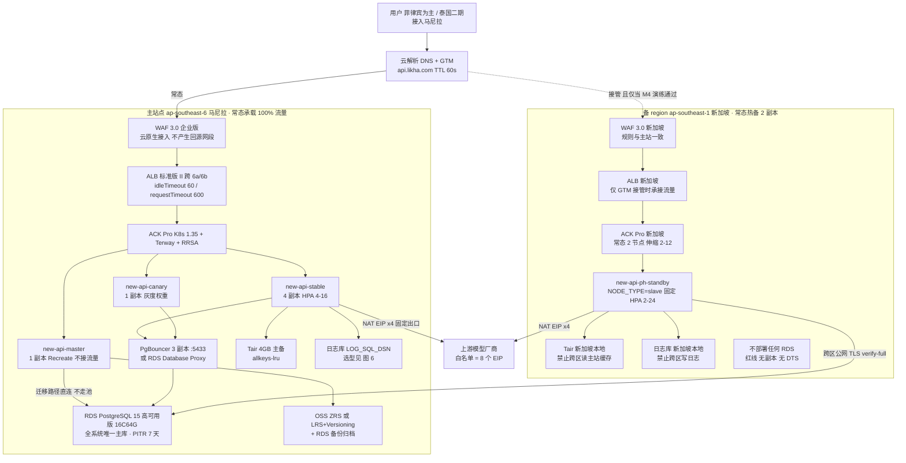

> **读图三要点**：① 全系统只有一个数据库（马尼拉），新加坡是**算力副本不是数据副本**；② 虚线那条路径常态**不承载流量**，只有 GTM 接管后才生效，而它的数据库读写仍然回到马尼拉 —— 这就是接管期延迟变高的根因（§10.1）；③ `master` 只有 1 个且不接流量，任何让第二个进程以 master 身份启动的配置都是资金级隐患（§6.2 坑 1）。

**图 2 · 网络与安全域拓扑（网段口径见 §2.2）**

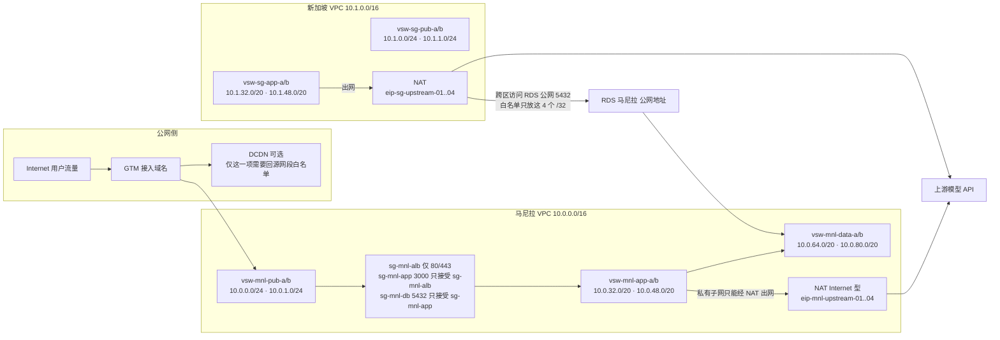

> 图上就能读出的三个约束：**私有子网没有出公网的路由**（只能经 NAT，所以出口 IP 一定收敛到 4 个 EIP）；**新加坡到主库只有"公网 5432 + 4 个 /32 白名单"这一条路**（所以 EIP 被换 = 接管能力静默失效，§6.1 坑 2）；**Pod IP 直接来自 app 网段**（Terway 模式），/20 是为 16+24 副本预留的，不能改小（§2.2 坑）。

---

### 2.1 参数基线（黄色项必须先替换）

| 参数 | 取值 | 备注 |
| --- | --- | --- |
| 业务域名 | `api.likha.com` | 全表统一 |
| 运维域名 | `ops.likha.com` | |
| 通配证书 | `*.likha.com` | |
| 主 region / AZ | `ap-southeast-6` / `ap-southeast-6a`+`6b` | **只有这两个 AZ** |
| 备 region | `ap-southeast-1` | 不部署任何数据库 |
| 马尼拉 VPC | `vpc-newapi-mnl-prod` `10.0.0.0/16` | |
| 新加坡 VPC | `vpc-newapi-sg-prod` `10.1.0.0/16` | 与主站不重叠 |
| K8s 版本 | **1.35**（原方案 1.31 已 EOL） | |
| CNI | **Terway**（不可后期更换） | |
| 镜像前缀 | `<acr-instance>-registry-vpc.ap-southeast-6.aliyuncs.com/newapi/new-api` | EE 实例前缀是实例名，不是固定 `registry-vpc.` |
| 应用命名空间 | `new-api`（备站 `new-api`，staging `new-api-staging`，压测 `new-api-perf`） | |
| 服务端口 | `3000` | new-api 监听端口 |

### 2.2 网段规划（照抄，勿改）

| 站点 | vSwitch | CIDR | AZ | 用途 |
| --- | --- | --- | --- | --- |
| 马尼拉 | `vsw-mnl-pub-a` | `10.0.0.0/24` | 6a | ALB / NAT |
| 马尼拉 | `vsw-mnl-pub-b` | `10.0.1.0/24` | 6b | ALB / NAT |
| 马尼拉 | `vsw-mnl-app-a` | `10.0.16.0/20` | 6a | **Pod（Terway 真实 VPC IP）** |
| 马尼拉 | `vsw-mnl-app-b` | `10.0.32.0/20` | 6b | Pod |
| 马尼拉 | `vsw-mnl-data-a` | `10.0.48.0/20` | 6a | RDS/Tair/日志库 |
| 马尼拉 | `vsw-mnl-data-b` | `10.0.64.0/20` | 6b | RDS 备 |
| 新加坡 | `vsw-sg-pub-a` | `10.1.0.0/24` | 1a | ALB / NAT |
| 新加坡 | `vsw-sg-pub-b` | `10.1.1.0/24` | 1b | ALB |
| 新加坡 | `vsw-sg-app-a` | `10.1.16.0/20` | 1a | Pod |
| 新加坡 | `vsw-sg-app-b` | `10.1.32.0/20` | 1b | Pod |

> **⚠ 关键坑（v2.1 未体现）**：选 Terway 后**每个 Pod IP 都是一个真实 VPC 私有 IP**，直接消耗 vSwitch 可用地址。`/20` = 4096 地址 ≈ 4000+ Pod IP，够 16 副本 × 节点扩展用；但**节点自身的 IP 也从 app vSwitch 出**（shared-ENI 模式）。
> **后果**：vSwitch 地址耗尽时，新 Pod 永久 `ContainerCreating`，报错 `no available ip addresses`，HPA 扩容全线失效——这是最容易在压测当天爆炸的坑。
> **改进措施**：§4.1 建完 vSwitch 立即执行 `aliyun vpc DescribeVSwitchAttributes` 记录 `AvailableIpAddressCount` 基线，并在 §12 每里程碑复核。

### 2.3 命名与标签

所有资源统一打标签（方案 R6/R39 成本看板依赖它）：

```
project=new-api   site=ph-mnl|sg   env=prod|staging|perf   cost-center=<按财务>   managed-by=terraform|console
```

---

## 3. 阶段 A：T-5 / T-3 前置门禁（G1–G13）

> **G0 规则**：G1–G7 + G9 为 **T-5**（等待型），G8 + G10–G13 为 **T-3**（研发/确认型）。任一项未完成 → D1 不得启动。
> D1 = 2026-09-28 ⇒ **T-5 = 2026-09-23（已过）/ T-3 = 2026-09-25**。若你的启动日不同，按此偏移重算；**T-5 项当天必须全部发起**。

### 3.0 一次业务请求的全链路时序（超时归属地图）

**图 3 · 常态主站请求链路 · 每一跳的超时与失败由谁负责**

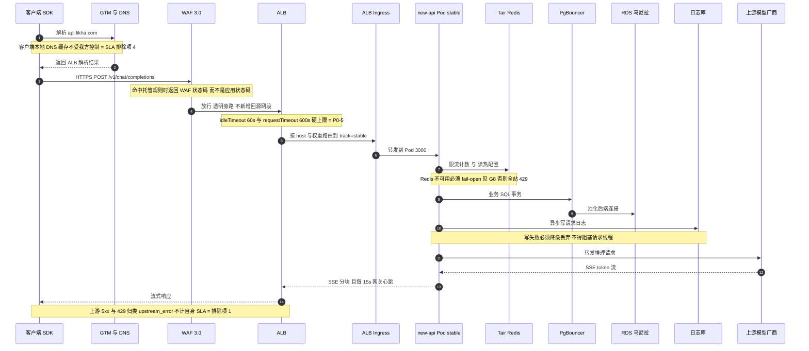

> 排障先定位"这一跳归谁"：**4xx 来自 WAF 还是应用**（§8.3 验证）、**5xx 来自自身还是上游**（§10.8 口径）、**断流是 60s idle 还是 600s request 上限**（§6.3 坑 1 与坑 2）。

### 3.1 G1 · 国际站账号注册 + 企业实名认证（1–3 工作日，最长外部等待）

**操作步骤**

1. 打开 `https://www.alibabacloud.com/` → **Create Account**。用**企业域名邮箱**注册，选 Country/Region = **Philippines**。
2. **注册时填写的手机号国家码必须与账号国家一致**（+63）。
3. 进入 **Account Center → Identity Verification** → 选 **Enterprise** → 上传主体注册文件：
   - 公司/合伙 → **SEC** 注册证书；个体户 → **DTI** 证书
   - 法人身份证件、注册地址证明
   - 公司名称、注册号、地址须与**后续绑定银行卡的对账单完全一致**
4. 提交后在 **Account Center → Identity Verification** 看状态；国际站人工审核 **约 3 个工作日**（方案写 1–2 天，偏乐观）。

**验证方法**

```bash
aliyun sts GetCallerIdentity          # 已配置 AK 时返回 AccountId
```
+ 控制台 **Account Center → Identity Verification** 显示 `Verified`（Enterprise）。

**验证不通过的修复**

| 症状 | 原因 | 修复 |
| --- | --- | --- |
| 被拒："country mismatch" | 注册国家 ≠ 证件签发国 ≠ 手机号国家码 | 三者必须一致。**账号国家注册后不可更改** → 只能新账号重做 |
| 被拒："name mismatch" | 公司名与银行卡/对账单不一致 | 用银行对账单上的拼写重填，或换卡 |
| 长时间 pending | 人工审核排队 | **提工单（Support Tickets → Create Ticket → 选 Account）**催办，附注册主体名 |

**坑与注意事项**

- **坑 1｜未实名的阻塞面比方案写的更大**。官方明确：完成企业实名前**不能申请 Credit Limit（信用额度/后付费）、不能签在线合同、不能加入 ACPN 伙伴计划、不能购买中国内地地域产品**。而"买不了 ECS/RDS"只是表象。**后果**：T-5 才注册、T-3 还在审核 = 整个 9 天计划归零。**改进**：实名与配额工单**同日发起**，实名没下来也先把配额工单提交（可先说明在审）。
- **坑 2｜账号国家不可改**。很多团队先用个人/其他国家邮箱注册试水。**后果**：改不了只能重开账号，已签的证书/域名白做。**改进**：注册前用 §3.1 第 1–3 步做一次 checklist 确认。
- **坑 3｜用主账号做日常运维**。方案 R4 已禁止，但国际站默认给你的是主账号。**改进**：立刻做 §3.3，之后所有操作只用 RAM 用户。

### 3.2 G3 · 绑定支付方式 / 后付费 / 预算告警（当日）

**操作步骤**

1. **Expenses and Costs → Billing Account → Payment Method → Add Payment Method**：绑企业 Visa/MasterCard（或 PayPal）。
2. **对公转账（bank transfer）在国际站是人工工单流程**，不是自助按钮——需要就走 Support Ticket。
3. 开启后付费能力：企业实名完成后在 **Expenses and Costs** 申请 **Credit Limit**。
4. 预算：**Expenses and Costs → Budget Management** →（首次需 Activate）→ **Create Budget** → 选 **Cost Budget**，按标签 `project=new-api` 圈定，阈值 80% 告警。

**验证方法**

- Payment Method 列表出现已验证卡（状态 `Active`）。
- `aliyun bssopenapi QueryAvailableBalance`（或控制台 Account Overview）能看到可用额度。
- 新建一个按量付费测试资源（如 1 个 EIP）能成功下单 → **这是唯一可靠的"能下单"证明**。

**验证不通过的修复**：卡被拒 → 换卡或走对公转账工单；下单报 `InvalidAccountStatus.NotEnoughBalance` → Credit Limit 未批，先小额充值（Top-up）走预付费余额。

**坑与注意事项**

- **坑｜欠费停机 = 生产直连不可用**。国际站欠费后有保留期，随后**释放**按量资源（EIP 被回收后 IP 会变！）。**后果**：上游供应商 IP 白名单全部失效，模型调用大面积 4xx/超时。**改进**：余额告警阈值设 ≥3 个月账单；EIP 全部转 **包年包月/保留 IP** 或在方案中固化"IP 变更须重提白名单"的应急 SOP。
- **坑｜"Balance Alerts"菜单名在国际站英文文档中未确认**（在 Account Overview / Message 设置里）。**改进**：以控制台实际页面为准，找不到就 **Message Center → 通知设置** 里勾全部计费类通知，别卡在菜单名上。

### 3.3 G9 · RAM 用户 / 最小权限 / MFA / ActionTrail（当日）

**操作步骤**

1. **RAM Console → Identities → Users → Create User**，建 4 个：`admin`、`ops`、`cicd-push`、`iac-terraform`。
   - 人类用户勾 **Console Password Sign-On**；程序用户勾 **OpenAPI Access Key**，二者不要同开。
2. **RAM → Permissions → Policies → Create Policy**（JSON 编辑器）→ 分别绑定：
   - `ops` → 自定义策略（覆盖 VPC/ECS/ACK/RDS/SLB/WAF/DNS 的 `*:Describe*` + 部署所需写权限）
   - `cicd-push` → **只给 ACR 推送**：`cr:PullRepository`、`cr:PushRepository`、`cr:GetRepository*`，Resource 限定到 `newapi/*` 命名空间
   - `iac-terraform` → Terraform 所需最小集（含 `ram:Get*`，不含 `ram:CreateUser`）
3. 强制 MFA：
   - **RAM → Settings → Security（Global Security）**：开启「要求所有控制台用户绑定 MFA」
   - 每个用户 **Identities → Users → <user> → Authentication → Bind Virtual MFA Device**
4. **补一条策略兜底**（全局开关只覆盖控制台登录，不覆盖 AccessKey 调用）：

```json
{
  "Version": "1",
  "Statement": [{
    "Effect": "Deny",
    "Action": ["*"],
    "Resource": ["*"],
    "Condition": { "Bool": { "acs:RAMMFAPresent": ["false"] } }
  }]
}
```
（对 `cicd-push`、`iac-terraform` 这类纯 API 用户改用「限制来源 IP + 限定 Action 白名单」，不要把它们锁死。）

5. **ActionTrail**：**ActionTrail → Trails → Create Trail → Single-account trail** → 投递到 **OSS Bucket（`oss-newapi-mnl`，路径 `actiontrail/`）** 且/或 **SLS Logstore**，Region 留 All Regions。
6. **资源组**：**Resource Management → Resource Groups** → 建 `rg-ph-mnl`、`rg-sg`；创建资源时统一选组。

**验证方法**

```bash
# 用 ops 用户 AK 验证权限边界（应被拒）
aliyun ram ListUsers --access-key-id <ops_AK> ...     # Expect Forbidden
# MFA 生效：无痕浏览器登录控制台，未绑定 MFA 的账号应被强制跳转到绑定页
```
- ActionTrail 页面 **Trails** 显示状态 `Logging`；在 OSS 里能看到 `actiontrail/<账号ID>/<region>/...` 的 JSON 对象开始增长。
- 审计自检：在控制台改一个资源标签，然后 **ActionTrail → Event Query** 里能查到该事件。

**验证不通过的修复**

| 症状 | 修复 |
| --- | --- |
| RAM 用户登录正常但 CLI 全 Forbidden | 策略里用了控制台专属 Action 前缀 → 用 `aliyun ram GetPolicyVersion` 对照补 `Describe/List` |
| Trail 卡在 `Creating`，OSS 无对象 | 缺 `AliyunServiceRoleForActionTrail` 或目标 Bucket 不在同 region → 补服务关联角色 / 换 Bucket |
| `cicd-push` 推镜像报 `denied by ram` | 缺 `cr:PushRepository` 或 Resource 里的 repo 路径写法与命名空间大小写不符 |

**坑与注意事项**

- **坑｜ActionTrail 控制台只免费保留 90 天事件**。方案要求 180 天。**后果**：合规审计到期无据。**改进**：必须投递 OSS/SLS，并给该前缀配**生命周期：180 天保留 + 禁止删除**（用 Bucket Policy 显式 Deny `oss:DeleteObject` 对该前缀）。
- **坑｜Global Security 的 MFA 开关管不住 AccessKey**。**后果**：AK 泄露即可全云接管——这是国际站最常见的账号被劫持路径。**改进**：AK 全部加 **来源 IP 白名单条件**（`acs:SourceIp`），运维 AK 只允许从堡垒机/VPN 出口 IP 使用；配 §14 的 90 天 AK 轮换。
- **坑｜给 CI 用了 `admin` 或主账号 AK**。**后果**：CI 日志泄露 = 全站沦陷。**改进**：CI 用 `cicd-push`，且优先改用 OIDC/STS 临时凭据。

### 3.4 G2 / G10 · 资源配额申请（2–3 工作日，关键路径）

**操作步骤**

1. 先读实时值（**不要凭印象报数字**）：

```bash
export REGION=ap-southeast-6
aliyun ecs DescribeAccountAttributes --RegionId $REGION
aliyun quotas ListProducts | grep -i -E "ecs|slb|vpc|rds|kvstore"
aliyun quotas ListProductQuotas --ProductCode ecs --RegionId $REGION
```

2. **关键认知修正**：ECS vCPU 配额现在是 **「按实例规格族分组的 vCPU 上限，按 region 计」**，不再是「按具体机型」。所以你要申请的是 **general-purpose 族的 vCPU 配额**。
3. **Quota Center**（`quotas.console.alibabacloud.com`）→ **Product Quotas** → 选产品 → **选地域** → 找到配额行 → **Actions → Request**：
   - 批次 1（`ap-southeast-6`）：ECS vCPU ≥ 64、ALB × 2、EIP ≥ 10、NAT × 1、RDS（PostgreSQL 高可用版 16C64G）、Tair 4GB、OSS × 1、VPC/vSwitch
   - 批次 2（`ap-southeast-1`，即 **G10**）：ECS vCPU ≥ **96**、ALB、EIP ≥ 6、ACK Pro
4. 等价 CLI：

```bash
aliyun quotas CreateQuotaApplication \
  --ProductCode ecs --Version 2014-05-26 \
  --QuotaActionCode <上一步读到的 code> \
  --DesiredValue 96 \
  --Reason "new-api AI gateway prod launch, standby region takeover capacity >= 1.5x peak" \
  --DomainRegions.1.RegionId ap-southeast-1

aliyun quotas ListQuotaApplications            # 轮询审批状态
```

**验证方法**：`ListQuotaApplications` 返回 `Status: Approved`；再跑一次步骤 1 的 `ListProductQuotas`，`TotalAllowedQuota` ≥ 申请值。**把工单号写进 §12 里程碑证据。**

**验证不通过的修复**

- 被驳回（`Declined`）→ 看 `RejectReason`，通常是「未说明业务场景 / 峰值依据不足」。**改进**：申请理由里给出**可核算的容量式**：`主站 4→16 副本 × 8 vCPU = 128，节点池 min4/max8 ⇒ 64 vCPU；备站 2→24 副本 ⇒ 96 vCPU`，比单写"要 96 核"通过率高得多。
- 长时间 `Approving` → **另开 Support Ticket 催办**（配额审批与工单是两套流程，只等一个会漏）。

**坑与注意事项**

- **坑｜默认配额不公开**。英文文档没有给新账号默认 vCPU 数。**后果**：按国内站经验估算 → 创建节点池时报 `QuotaExceeded` 且发生在 D2，返工 2–3 天。**改进**：§3.4 步骤 1 的实时读取是**强制前置动作**，T-5 完成并把数字记进方案表。
- **坑｜新加坡 96 vCPU 未批 → SLA 直接不成立**。备 region 接管上限 = 主站峰值 16 × 1.5 = **24 副本 = 192 vCPU Pod 需求**（按 request 2 vCPU 时是 48 vCPU，按 limit 4 vCPU 时是 96 vCPU）。**后果**：M4 验收项「接管容量 ≥ 峰值 ×1.5」不可能达成。**改进**：未批复时按方案裁剪预案 #5 走，但**必须书面记录 SLA 降级**；同时确认「冷备也不省配额」（方案 R49 已强调）。
- **坑｜配额是按 region 独立的**。马尼拉批了 ≠ 新加坡有。**改进**：两批工单分开提，**先马尼拉后新加坡但同日发起**。

### 3.5 G7 · 逐个开通云产品（当日）

**操作步骤**（国际站**每个产品单独开通**，不是一次性授权）

产品控制台入口逐个进 → 点 **Activate / 立即开通** → 选按量付费：

```
VPC · EIP · NAT Gateway · ALB(Application Load Balancer) · ACK Pro · ACR Enterprise
RDS PostgreSQL · Tair(Redis OSS-Compatible) · ClickHouse(见 §1.1#1) 
Alibaba Cloud DNS · Global Traffic Manager · DCDN/ESA · WAF 3.0 · SSL Certificates(CAS) · KMS
SLS · ARMS(Prometheus Service) · Managed Grafana · CloudMonitor · ActionTrail · OSS
```

WAF 3.0 开通时**必须选 Asset Region = Outside Chinese Mainland**。

**验证方法**：每个产品控制台首页能进且不弹「未开通」引导；`aliyun <product> DescribeRegions` 返回正常。

**坑与注意事项**

- **坑｜WAF 选错站点（Chinese Mainland）**。**后果**：面向马尼拉的接入配置根本选不到 ALB，且触发 ICP 备案要求。**改进**：开通即选 **Outside Chinese Mainland**；开通后改不了，只能退订重开。
- **坑｜WAF 企业版（Enterprise）vs Pro 的差别只在域名数/CC 规则数/Bot 能力**，国际站档位是 **Basic / Pro / Enterprise / Ultimate / Pay-as-you-go**（不是国内站的"企业版"字样，也**没有 Premium**）。**改进**：先按 Pay-as-you-go 起步，规则数超了再升档。
- **坑｜ClickHouse 开通页选不到马尼拉** → 不是 bug，是真不支持，直接跳 §4.5。

### 3.6 G4 · 域名注册 + 实名 + NS 托管（24–48h 生效等待）

**操作步骤**

1. **Domains** 控制台 → 查询/注册 `likha.com`（若已有域名，跳过注册）。开 **自动续费 + 隐私保护**。
2. **域名实名（Real-name Verification）**：Domains → 选中域名 → **Real-name Verification** → 上传与**阿里云账号实名主体一致**的证件。
3. **Alibaba Cloud DNS（Console → Public Zone）→ Add Domain** → 输入 `likha.com` → 系统分配两个 NS（形如 `ns1.alidns.com` / `ns2.alidns.com`，以页面为准）。
4. 回到 **Domains → 域名管理 → DNS修改（DNS Servers）→ 更换为阿里云 DNS 分配的 NS**。
5. **不要在此处加业务解析记录**，等 D1/GTM 阶段统一加（CNAME 给 GTM 的接入域名）。

**验证方法**

```bash
# 权威 NS 是否已切
dig +short NS likha.com                      # 期望：ns1/ns2.alidns.com（或分配值）
# 逐跳确认（在注册商 NS 上查已失效、在阿里云 NS 上查有记录 = 生效）
dig @ns1.alidns.com api.likha.com +short
```

**验证不通过的修复**

| 症状 | 原因 | 修复 |
| --- | --- | --- |
| `dig NS` 仍返回注册商 NS | 全球缓存未过期 | 等 24–48h；期间**不要重试改配置**（会拉长收敛） |
| 加记录时报「域名未实名」 | 步骤 2 未过审 | 催实名；国际站对**部分后缀**要求实名才可解析 |
| 实名被拒 | 域名实名主体 ≠ 阿里云账号主体 | 用同一主体重提 |

**坑与注意事项**

- **坑｜NS 未生效时 D1 接入层什么都验不了**（方案 R18 已标注）。**后果**：D3 的 ALB/WAF/GTM 验证全部空转。**改进**：T-5 立刻做；**未生效期间用 ALB 自动分配的公网 DNS 名（`alb-xxx.ap-southeast-6.alb.aliyuncs.com`）先完成功能验证**，域名只用于最终对外。
- **坑｜把付费 DNS 版本写成"旗舰版"**。国际站英文文档**没有版本对照表**（只有中文文档有），产品页只宣传 "Enterprise Ultimate Edition"。**改进**：版本名以购买页为准；工单里描述需求而不是版本名。
- **坑｜国际站别用 `223.5.5.5` 做权威验证**（那是国内站 Public DNS，缓存策略不同，会给你假阴性）。**改进**：只信 `dig @ns1.alidns.com` 与公共递归 `dig @1.1.1.1`。

### 3.7 G5 · 通配符 SSL 证书（1–24h）

**操作步骤**

1. **Certificate Management Service → SSL Certificate Management → Create Certificate / Purchase**。
2. 国际站**无免费 DV 额度**——买 **Rapid(DV) / DigiCert / GlobalSign / GeoTrust / Alibaba Cloud 自有根**，Domain Type 选 **Wildcard Domain**，填 `*.likha.com`。
3. 生成 CSR：本地 `openssl req -new -newkey rsa:2048 ...`（私钥自己留）或用 CAS 代生成。
4. **域名验证选 DNS 验证**（域名已在阿里云 DNS，可自动添加 TXT）。
5. DV 签发 **1–15 分钟**；OV 需 3–5 工作日 → **本方案用 DV 即可**。
6. **私钥入 KMS**（§4.7），**开启托管服务（hosting）+ 自动续期**，在 **Deployment Management → Cloud Product Deployment** 建部署任务（此时资源还没建，先建任务模板）。
7. 到期告警：**Message Center / 证书到期通知**（邮件；短信需已验证手机号）。

**验证方法**

```bash
openssl x509 -in likha.com.pem -noout -text | grep -A1 "Subject Alternative Name"
# 期望 DNS:*.likha.com
openssl x509 -in likha.com.pem -noout -dates       # 记录 notAfter
```
控制台证书状态 = **Issued**，且已出现在 CAS 证书列表。

**坑与注意事项**

- **坑｜2026-02-25 起单张证书最长有效期降到约 199/200 天**，1 年订单被拆成两张约 6 个月 + 托管续期。**后果**：按"一年一续"运维 → 第 6 个月全站 HTTPS 突然红色告警/握手失败，且续期不是瞬间完成。**改进**：**必须**开启托管 + 自动部署到 ALB/WAF/DCDN；§12 每里程碑人工复核一次 `notAfter`。
- **坑｜通配符不覆盖子主域**：`*.likha.com` 覆盖 `api.likha.com`，**不覆盖** `likha.com`，也不覆盖 `a.b.likha.com`。**后果**：直连裸域 502/证书错误。**改进**：证书加 `likha.com` 多域名（SAN），或裸域做 301 → `api.likha.com`（DCDN/ALB 层）。
- **坑｜中间证书链缺失**。**后果**：ALB 上传报链不完整，或 Android/旧客户端验证失败。**改进**：CAS 下载的 **fullchain PEM** 整包上传，不要手挑首段。
- **坑｜方案 R63 说"要求 TLS 1.2+1.3"** → ALB 侧对应 **TLS security policy** 名称：`tls_cipher_policy_1_2_strict_with_1_3`（§6.3 用这个）。

### 3.8 G6 · 解析/GTM/证书配置模板就绪（当日）

**操作步骤**：把 D3/D5 要用的以下内容**先写成文件评审定稿**，存 Git（不含密钥）：

```
deploy/aliyun/ph/
  dns-records.yaml          # api / ops / 静态子域 的 CNAME 目标（GTM 接入域名）
  gtm-address-pool.md       # 主池=马尼拉 ALB DNS 名, 备池=新加坡 ALB DNS 名, 探测 /api/status 15s
  cert-deployment-task.md   # 部署目标资源清单（占位，D6 回填资源 ID）
  albconfig.yaml.tpl        # 见 §6.3
  security-groups.md        # 见 §8.6 逐条表
```

**验证方法**：这些文件在 D1 前 PR 已合并（不是"排期确认"）。
**坑**：v2.0 的教训——「D1 部署证书但 ALB/WAF 还没建」。**改进**：证书部署动作固定排 **D6**（任务 40），D1 只做"证书就绪 + 模板预置"（任务 3）。

### 3.9 G8 · 代码侧补建（必须**完成并合并**，不是排期确认）

**操作步骤**（本仓库现状已核实）

| 项 | 现状（2026-09-24） | 要做 |
| --- | --- | --- |
| `GET /healthz` | **不存在** | 新增，只做进程存活（不查依赖），返回 200 |
| `GET /readyz` | **不存在** | 新增，检查主库 + Redis（Redis 不可用要按"降级"处理，见 §3.9） |
| `GET /metrics` | **未注册**（仅 `controller/channel_inference.go` 内部把 `/metrics` 当探测路径） | 接 `promhttp` + `prometheus/client_golang`，暴露请求数/延迟直方图/渠道错误/429 数 |
| 限流降级 | 需确认 | **Redis 故障时降级放行，不得 fail-closed 返回 5xx** |
| 探针兜底 | `router/api-router.go:26` 的 `GET /api/status` | G8 未完成前用 `/api/status`（TCP 探测次选） |

**验证方法**

```bash
go build ./... && go test ./router/... ./controller/...
curl -s localhost:3000/healthz -i          # 200
curl -s localhost:3000/readyz  -i          # 依赖正常 200；故意停 Redis → 期望 200(degraded) 而非 503
curl -s localhost:3000/metrics | head      # 有 go_* 与自定义指标
```

**坑与注意事项**

- **坑｜Redis 故障 → `/readyz` 返回 503 → K8s 杀 Pod → 全站雪崩**。**后果**：Tair 一次抖动就演变成整站不可用，SLA 99.95% 直接不成立（方案 R15 的判定就是这一条）。**改进**：`readyz` 对**缓存类依赖只做降级不判死**；把"依赖分级"写进代码注释与测试用例（含 fail 分支）。
- **坑｜没有 `/metrics` 就用 `/api/status` 拨测当 SLA 证据**。**后果**：拨测只能证明"进程在"，证明不了"成功率/延迟 SLO"，错误预算无从计算，M3/M4 验收会被客户质疑。**改进**：如果 G8 确实延后，必须**书面记录指标置信度降级**（方案 R15 的剩余风险口径）。
- **坑｜Go 项目改鉴权/会话相关代码要过 OWASP 门禁**（仓库 `AGENTS.md` 强制）。`/metrics` 端点**必须只在内网暴露**，不能经 ALB 公网可达（用独立 Service 端口或 NetworkPolicy）。**后果**：泄露内部路由/量级信息。**改进**：`/metrics` 单独监听端口（如 9090），**不挂在 3000 上**，只被 ServiceMonitor 抓取。

### 3.10 G11 · 连接数预算与 PgBouncer 方案确认（T-3）

**操作步骤**：产出**一张带真实数字的表**（方案 §7.4.5.1 的三条不变量 I-1/I-2/I-3）：

```
① 主站：SQL_MAX_OPEN_CONNS(实际值) × 主站副本峰值(16)
② 备站：SQL_MAX_OPEN_CONNS × 备站副本峰值(24)
③ GTM 接管瞬间主备可能同时在跑 → 取 ①+② 的最坏上界（或明确"先摘流再扩容"消除并发窗口）
必须满足：最坏上界 ≤ RDS max_connections × 0.8
```

⚠ **必须用代码真实默认值**：`model/main.go:212` 是 `GetEnvOrDefault("SQL_MAX_OPEN_CONNS", 1000)`，主库和日志库**各自**都设 1000。若沿用默认：`1000 × 16 = 16000`，**远超任何 RDS 规格**。

**验证方法**

```sql
SHOW max_connections;                     -- 在 RDS 上读实际值（不可用户改，见 §1.2#9）
SELECT count(*) FROM pg_stat_activity;    -- 现网连接数
```
PgBouncer：`SHOW POOLS;` → `cl_waiting` 长期为 0；`SHOW STATS;` 看 `sv_active`。

**修复**：`cl_waiting` 持续堆积 → 调大 `default_pool_size` 或**降应用侧 `SQL_MAX_OPEN_CONNS`**（显式设成 60–100，不是留着默认 1000）。

**坑与注意事项**

- **坑｜忘设 `SQL_MAX_OPEN_CONNS`**。方案按 300 估算，代码默认 1000。**后果**：一次 HPA 扩容到 16 就打爆 PG（`FATAL: sorry, too many clients already`），全站 5xx + 计费写入失败。**改进**：**DSN/环境变量必须显式给值**，并把「`SQL_MAX_OPEN_CONNS` 已显式设置」列为上线检查表硬项（§14）。
- **坑｜transaction pooling 与本仓库代码不兼容**（方案 §7.4.5.4 的"红线"）。任何用到**会话级状态**的地方会静默出错：`SET`/`SET LOCAL`、**prepared statements**、 advisory lock、`LISTEN/NOTIFY`、`BEGIN; ... ; COMMIT` 跨多条语句。**后果**：GORM 默认可能用 prepared statement；`SET extra_float_digits` 之类的驱动初始化语句在 transaction 模式下会失败或串扰——**表现为偶发的、无法复现的余额计算/迁移错误，比宕机更可怕**。**改进**：
  - 若用 PgBouncer：**优先 `pool_mode=session`**（牺牲部分收敛换正确性），或在应用侧关掉 prepared statements（`extra_float_digits`、`statement_timeout` 等 SET 要验证）；
  - **master 迁移路径必须直连不走池**（方案 §7.4.5 H 列已要求，保留）；
  - 三数据库矩阵（SQLite/MySQL/PG，仓库 AGENTS.md 强制）必须**经过池跑一遍**才算验证。
- **坑｜RDS PG 也有「Database Proxy」**（不是 MySQL 专属）。**改进**：先确认马尼拉该实例页面里 Database Proxy 可开；可开则**优先用托管 Proxy**（少一个自运维单点），要 transaction pooling 再自建 PgBouncer。

### 3.11 G12 · SLA 口径与交付范围书面确认（T-3）

**操作步骤**：把「里程碑与验收」Sheet 的口径落成**一封需要回复"确认"的邮件**：

- 五条口径：服务窗口 / 不可用定义 / 计划内维护 / 部分降级 / 月度预算 **21.6 分钟**
- 四项排除：**上游供应商故障 / 阿里云公告的区域级 IaaS 故障 / 客户侧网络与证书 / 超限 429**
- 边界：**「整站故障 RTO ≤ 5min」= 接入层 + 计算层**，**不含 RDS 所在马尼拉 region 整体失效**
- 范围：**本次仅菲律宾；泰国二期**（曼谷用户接马尼拉 RTT 55–80ms）

**验证方法**：收到客户/PM 的书面"确认"回执，归档进 §12 证据。
**坑**：不确认 → **D9 验收无法判定**（例："马尼拉 region 挂 30 分钟算不算违约"当场吵）。**改进**：把"排除项②"用一句人话写清：**主库只在马尼拉一个 region，区域级故障下靠 PITR 恢复，RPO 目标 ≤5min，这一情形不计入 99.95%**。客户接受不了就得加第三 region 主库（超本次范围）。

### 3.12 G13 · staging / perf 环境方案确认（T-3）

**结论**：staging/perf 放**马尼拉主站 ACK 的独立 namespace**，用主站 RDS 的**逻辑隔离 schema**（不新建实例）→ 不违反"新加坡不部署 RDS"红线。
**坑**：红线原意是**约束 prod 备 region**，评审时被质疑"staging 是不是也用了新加坡的库"。**改进**：在方案 R36/Sheet4 R25 已有澄清句，落到工单/评审纪要里再写一次。
**注意**：`search_path` 与 schema 隔离对 **GORM AutoMigrate 有已知风险**（不同 schema 下 `IF NOT EXISTS` 判定与索引行为不一致）。**验证**：在 staging schema 上跑迁移两次，确认幂等。

### 3.13 G0 门禁判定表（D1 启动前逐条打勾）

| 编号 | 事项 | 证据 | 通过 |
| --- | --- | --- | --- |
| G1 | 企业实名 `Verified` | 截图 | ☐ |
| G2 | 马尼拉配额批复 | 工单号 | ☐ |
| G3 | 可下单（真实建过一个测试 EIP） | 资源 ID | ☐ |
| G4 | `dig NS` 指向阿里云 | 命令输出 | ☐ |
| G5 | 证书 `Issued` + SAN 含 `*.likha.com` | `openssl` 输出 | ☐ |
| G6 | 配置模板 PR 已合并 | PR 链接 | ☐ |
| G7 | 全部产品已开通（含 ClickHouse 替代决策） | 截图 | ☐ |
| G8 | `/healthz` `/readyz` `/metrics` + 限流降级 **已合并** | commit/MR | ☐ |
| G9 | RAM + MFA + ActionTrail 投递 | Trail 状态 | ☐ |
| G10 | 新加坡 ≥96 vCPU | 工单号 | ☐ |
| G11 | 连接数预算表（用真实 env 值） | 文档 | ☐ |
| G12 | SLA 口径书面确认 | 邮件回执 | ☐ |
| G13 | staging/perf 方案 | 文档 | ☐ |

**任一项未通过 → D1 不启动。** 这是硬门禁，不要"先干起来再补"。

---

## 4. 阶段 B：D1 落地（网络与数据底座）

> D1 目标：**马尼拉 VPC/vSwitch + RDS + Tair + 日志库 + OSS + ACR + 账号收口 + 域名/证书复核**。
> 分工沿用方案：**人员A** = 基础设施/网络/接入/SRE；**人员B** = 数据/应用/CI-CD/DevOps。

### 4.0 门禁依赖与 D1–D9 排布总览（先看这两张图再排人）

**图 4｜G1–G13 前置门禁依赖流与 G0 判定**

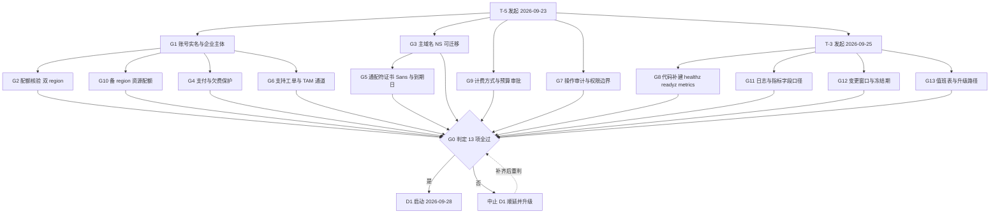

**读图要点**

1. `G8` 是**唯一落在代码侧**的门禁：`/healthz`、`/readyz`、`/metrics` 当前未注册（仓库只有 `router/api-router.go:26` 的 `GET /api/status`）。它不过，M2 的探针与 M3 的 SLA 证据链同时不成立——所以图中它和 G1 一样是"根节点级"依赖，不能拖到 D3。
2. `G5`（证书）挂在 `G3`（域名）下：NS 没迁过来就无法签发/校验通配符证书。国际站无免费 DV 额度 + 2026-02-25 起单证最长约 199 天，这两条决定了 G5 必须包含"托管自动续期已开启"的证据。
3. `STOP -.-> G0` 的回路是**允许的**（补齐后重判），但不允许"带条件通过"：任何一项以"已提工单待回"记录为通过，等于 G0 未过。

**图 5｜D1–D9 排布与关键路径（甘特）**

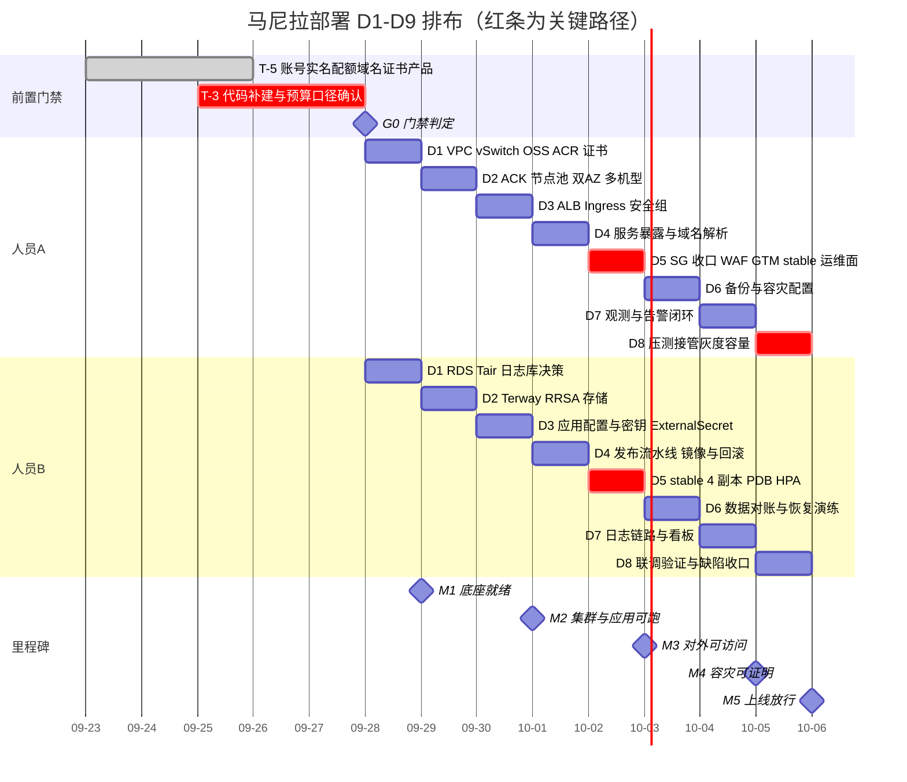

**读图要点**：三条 `crit` 红条就是真关键路径——`p2`（G8 代码补建，不过则 SLA 无证据）、`a5/b5`（D5 首次对外暴露 + 首个 stable 多副本，是风险峰值日）、`a8`（D8 压测与接管演练，M4 的唯一出口）。任何人日缺口先从这三条上找，不要压 D6/D7 的备份与观测工作——被压掉的备份和观测正是事故时唯一能救你的东西。

### 4.1 任务 5｜马尼拉 VPC + 6 个 vSwitch（人员A，4 人时，S2）

**操作步骤**

1. **VPC Console → VPCs → Create VPC**：Region = **Philippines (Manila)**，Name `vpc-newapi-mnl-prod`，IPv4 CIDR `10.0.0.0/16`。
2. 同页逐 AZ 添加 vSwitch，按 §2.2 建 6 个。
3. 或用 CLI（可复现，推荐）：

```bash
export ALIYUN_PROFILE=ph-prod
VPC_ID=$(aliyun vpc CreateVpc --RegionId ap-southeast-6 --VpcName vpc-newapi-mnl-prod \
  --CidrBlock 10.0.0.0/16 --Description "new-api PH primary" | jq -r .VpcId)
echo "VPC_ID=$VPC_ID"

mk_vsw () { aliyun vpc CreateVSwitch --RegionId ap-southeast-6 --VpcId "$VPC_ID" \
  --ZoneId "$1" --CidrBlock "$2" --VSwitchName "$3" | jq -r .VSwitchId; }
mk_vsw ap-southeast-6a 10.0.0.0/24  vsw-mnl-pub-a
mk_vsw ap-southeast-6b 10.0.1.0/24  vsw-mnl-pub-b
mk_vsw ap-southeast-6a 10.0.16.0/20 vsw-mnl-app-a
mk_vsw ap-southeast-6b 10.0.32.0/20 vsw-mnl-app-b
mk_vsw ap-southeast-6a 10.0.48.0/20 vsw-mnl-data-a
mk_vsw ap-southeast-6b 10.0.64.0/20 vsw-mnl-data-b
```

4. **VPC → Flow Logs → Create Flow Log** → 投递到 SLS Project（`【控制台核实】`马尼拉是否可选；不可选则跳过并在 §12 记为残余风险）。
5. 立即记录每个 vSwitch 的 `AvailableIpAddressCount` 基线（§2.2 的坑）。

**验证方法**

```bash
aliyun vpc DescribeVpcs --RegionId ap-southeast-6 \
  | jq '.Vpcs.Vpc[]|select(.VpcName=="vpc-newapi-mnl-prod")|{VpcId,CidrBlock,Status}'
aliyun vpc DescribeVSwitches --RegionId ap-southeast-6 --VpcId "$VPC_ID" \
  | jq -r '.VSwitches.VSwitch[]|"\(.VSwitchName)\t\(.ZoneId)\t\(.CidrBlock)\tfree=\(.AvailableIpAddressCount)"'
# 期望 6 行，网段与 §2.2 完全一致；free 分别约为 252/252/4092/4092/4092/4092
```
验收标准（方案 AB 列）：**网段与「网络与安全规划」完全一致**。

**验证不通过的修复**

| 症状 | 修复 |
| --- | --- |
| `InvalidCidrBlock.Overlapped` | 与已有 VPC 重叠 → 换 /16 或清理旧 VPC（先确认无资源占用） |
| `ZoneId not available` | 马尼拉只有 6a/6b，AZ ID 写错 → `aliyun ecs DescribeZones --RegionId ap-southeast-6` 核对 |
| free IP 明显少于预期 | 有别的资源占用 → 重算 Pod 容量，不要硬上 |
| 网段填错（/20 写成 /24） | vSwitch CIDR **不可修改** → 无资源时删除重建 |
| 删不掉 vSwitch | 已被 NAT/ACK/RDS 占用 → 按依赖顺序先删资源 |

**坑与注意事项**

- **坑 1｜网段规划错要连带重建整栈**。vSwitch 一旦有资源就删不掉。**后果**：D2 之后发现规划错 = 重建 NAT/ALB/ACK/RDS，返工 1–2 天。**改进**：动手前把 §2.2 表在评审纪要里签认一次。
- **坑 2｜节点与 Pod 共用 vSwitch + Terway**。**后果**：`/20`（约 4000 IP）看着很大，但 8 节点 × 210 Pod 再叠加节点自身 IP 与 Service/预留地址，**耗尽时新 Pod 永久 `ContainerCreating`、报 `no available ip addresses`，HPA/扩容全线失效**——最容易在压测或故障切换当天爆发。**改进**：app 段保持 `/20` 为下限（**不要缩到 /22**）；建完记基线、每里程碑复核 `AvailableIpAddressCount`；告警上把"vSwitch 可用 IP < 200"设为 P2。
- **坑 3｜与新加坡网段重叠**。**后果**：将来接 CEN/VPC 对等时地址冲突，只能重划网段（≈重建集群）。**改进**：10.0.0.0/16 vs 10.1.0.0/16 已错开，**建第二个 VPC 前再核对一次**。
- **坑 4｜"开启 DNS 主机名解析"（方案 R4）** 在国际站英文文档中未见对应开关。**改进**：以控制台 VPC 详情页实际项为准，找不到就跳过，不影响主链路，别为它卡住 D1。

### 4.2 任务 4｜马尼拉 RDS PostgreSQL 高可用版（人员B，2 人时，S2）

**操作步骤**

1. **先验证可买性**（决定后续一切，不要跳）：

```bash
aliyun rds DescribeRegions --RegionId ap-southeast-6 \
  | jq -r '.Regions.RDSRegion[]|.ZoneId' | sort -u
aliyun rds DescribeAvailableClasses --RegionId ap-southeast-6 --ZoneId ap-southeast-6a \
  --Engine PostgreSQL --EngineVersion 15.0 --DBInstanceStorageType cloud_essd \
  --InstanceChargeType Postpaid --Category HighAvailability | jq '.DBInstanceClasses'
# 空结果就依次换：EngineVersion 14.0/15.0/16.0；StorageType cloud_essd/cloud_essd2；Category HighAvailability/Basic
```

2. 买页：**ApsaraDB RDS → Instances → Create Instance** → Region Manila → **Pay-As-You-Go**（稳定后转包年包月）→ **Engine PostgreSQL** → **Edition: High-availability Edition** → **Storage: Premium ESSD/ESSD** → **Deployment: Multi-zone Deployment（Primary 6a / Standby 6b）** → 选 ≈16C/64G 规格（形如 `pg.x4.2xlarge.2c`，以列表为准）→ 网络 `vpc-newapi-mnl-prod` + `vsw-mnl-data-a` → **不勾公网地址**（D3 再开）。
3. 账号/库/权限见 §5.5；SSL 与公网见 §6.1（**证书绑定地址是最重的坑，务必按那里做**）。

**验证方法**

```bash
aliyun rds DescribeDBInstanceAttribute --DBInstanceId <id> \
 | jq '.Items.DBInstanceAttribute[0]|{Engine,EngineVersion,Category,ZoneId,MasterZone,SlaveZone,DBInstanceClass,DBInstanceStorageType,ConnectionMode}'
# 期望 Category=HighAvailability，Master/Slave Zone 为 6a/6b（若支持多可用区）
# 连通性：从同 VPC 跳板机执行（不要从本地直连内网）
psql "host=<内网连接串> port=5432 dbname=postgres user=<acct> sslmode=require" -c "select version();"
```

**验证不通过的修复**

| 症状 | 修复 |
| --- | --- |
| `DescribeAvailableClasses` 返回空 | 换 EngineVersion / StorageType；仍空 = **马尼拉不卖该组合** → 降版本或改地域 |
| 买页无 Multi-zone | 该地域/引擎未开多可用区 → **退化为 Single-zone + 强备份**，并**书面记录 SLA 降级**（RDS 高可用是 99.95% 最低配置之一，方案 R17） |
| 实例 Running 但连不上 | 九成是**白名单默认 `127.0.0.1` 拒绝一切**，见 §5.5 坑 1 |
| `InsufficientResourceCapacity` | 换 AZ / 换同族相邻规格；仍不行提工单查库存 |

**坑与注意事项**

- **坑 1｜PG 版本按购买页为准**。方案写"选 15"，国际站新版本在海外地域滞后于中国站点。**后果**：文档承诺 16、实建 14，后面依赖新特性的 SQL/迁移踩空。**改进**：把 `select version();` 输出**回填方案表**作为交付基线。
- **坑 2｜主备切换会闪断约 30 秒**。**后果**：应用未配重连（连接池 `RetryTimes`、DBus 层重连）时表现为一波集中 5xx。**改进**：D7 任务 37 必做一次**主动 HA Switchover 演练**（`aliyun rds SwitchDBInstanceHA`），验证客户端自动重连与请求成功率曲线。
- **坑 3｜连接串被写死在 CI 变量/Git 里**。**后果**：实例释放重建后连接串变，全站启动失败。**改进**：一律 KMS + 注入（§5.7）。
- **坑 4｜"Running" ≠ "可连"**：创建 1–10 分钟。**改进**：验收以 `psql` 实际连通为准。

### 4.3 任务 8｜OSS Bucket（人员B，1 人时，S1）

**操作步骤**：**OSS → Buckets → Create Bucket**：`oss-newapi-mnl`，Region Manila，Storage Class Standard，**Redundancy：有 ZRS 选 ZRS；只有 LRS 就选 LRS 并立刻配跨区复制到新加坡**（§1.2#14），ACL = **Private**，勾 **Versioning**。
随后：`Lifecycle → Create Rule`（30 天→IA，90 天→Archive，**并加 NoncurrentVersion 30 天过期**）；`Data Security → Referrer → Enable`；`Bucket Policy` 限制非本项目 RAM 主体；建前缀 `rds-backup/`、`actiontrail/`、`app-assets/`。

**验证方法**

```bash
aliyun oss stat oss://oss-newapi-mnl        # 看 redundancy / versioning / ACL=private
# 内网可达（在同 VPC ECS 上）：
curl -sS -o /dev/null -w "%{http_code}\n" https://oss-newapi-mnl.oss-ap-southeast-6-internal.aliyuncs.com/
# 期望 403（能连通、无凭据），而不是 000/超时
```

**验证不通过的修复**：`NoSuchBucket` → 名字全局唯一冲突，换名；`000` → 内网 Endpoint 拼错或 ECS 不在同 region；生命周期不生效 → 前缀规则与对象 tag 不匹配。

**坑与注意事项**

- **坑 1｜用公网 Endpoint**。VPC 内应用走 `oss-ap-southeast-6.aliyuncs.com` → 收公网流量费且更慢。**改进**：内网一律 `-internal`（内网流量免费）。
- **坑 2｜ACL 设 public-read "方便静态资源"**。**后果**：Bucket 内任何文件可被遍历（含误传的备份/日志）——OSS 数据泄露头号原因。**改进**：保持 **Private**；公网静态访问走 **DCDN + 回源** 或**签名 URL**。
- **坑 3｜开了 Versioning 却没配 NoncurrentVersion 生命周期**。**后果**：历史版本无限堆积，存储费翻倍。**改进**：`NoncurrentDays=30` + `ExpireObjectDeleteMarker=true`。
- **坑 4｜备份与数据同 region**。**后果**：region 级故障时"数据和备份一起没"，PITR 承诺落空。**改进**：`rds-backup/` 与 `actiontrail/` 前缀**配跨区复制到新加坡 bucket**。这是让 §6.6 恢复演练真正有价值的前提。

### 4.4 任务 7｜Tair（Redis 兼容）主备 4GB（人员B，1 人时，S3）

**操作步骤**：**Tair / Redis → Create Instance** → Region Manila → **Series: Redis Open-Source 或 Tair** → **Instance Type: Standard (Master-Replica)** → **4GB** → **Multi-zone（6a 主 / 6b 备）** → VPC + `vsw-mnl-data-a` → 版本选页面可用的最高（5.0/6.0/7.0）。
设 **账号密码**（Password Settings）；白名单建组 `mnl_app` 放 Pod/节点所在网段。
参数：`maxmemory-policy` 改 **`allkeys-lru`**；`#no_loose_disabled-commands` 禁 `FLUSHALL,FLUSHDB,KEYS`。

**验证方法**

```bash
redis-cli -h <Connection Information 里复制的地址> -p 6379 -a '<user>:<password>' ping            # PONG
redis-cli ... config get maxmemory-policy                                                        # allkeys-lru
redis-cli ... info clients | head
```
DSN 规范（地址**从页面复制**，不要手拼）：
```
REDIS_CONN_STRING=redis://<user>:<password>@r-xxxx.redis.ap-southeast-6.rds.aliyuncs.com:6379/0
```

**验证不通过的修复**：`NOAUTH` → 自定义账号需 `user:password` 格式；`Could not connect` → 白名单没加**真实来源 IP**（Pod 私网 IP / 节点 IP）；`-READONLY` → 连到了备地址，改主地址。

**坑与注意事项**

- **坑 1｜`maxmemory-policy` 默认 `volatile-lru`，而 new-api 大量 key 无 TTL**。**后果**：内存满后**无法淘汰 → 写入 OOM 报错 → 限流与缓存整体失效**；若 `/readyz` 又把 Redis 当硬依赖，会**触发全站 Pod 重启风暴**（连锁到 §3.9 的坑）。**改进**：显式 `allkeys-lru` + **必须**先完成 G8 的"Redis 故障降级放行"。
- **坑 2｜为了"安全"给 Redis 开公网 + TLS**。**改进**：**只走 VPC 内网 + 白名单**；TLS 的主机名校验坑与 RDS 同源（§6.1），没必要时不要引入。
- **坑 3｜4GB 主备版承载限流 + token 缓存**（方案 R20 自评"建议升级集群版"）。**后果**：热点分片、限流精度下降。**改进**：上线后看 `info stats` 命中率与 `instantaneous_ops_per_sec` 决定升配；**转集群版前**确认业务用到的跨 slot 命令（`MGET`/事务/`SCAN`）在集群模式的限制。
- **提醒**：`GLOBAL_API_RATE_LIMIT` 默认 **360 次 / `GLOBAL_API_RATE_LIMIT_DURATION` 180s**（`common/init.go:124-125`）——WAF 的 CC 阈值要与它**对齐且不更严**，否则用户看到的是 WAF 拦截页而不是网关的 429，客诉归因会跑偏（§8.3）。

### 4.5 任务 9｜日志库（ClickHouse）——**先做替代决策**（人员B，2 人时，S1）

> v2.1 要求"马尼拉 ClickHouse 社区版 24.8，2 节点"。**国际站 ClickHouse 支持地域列表不含马尼拉**（§1.1#1）。

**图 6｜日志库落地决策树**（先做这题，再动手买资源）

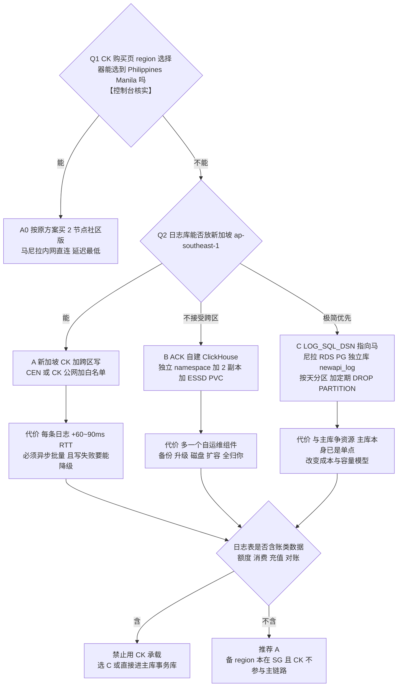

**四路对比**

| 方案 | 延迟 | 运维负担 | 跨区流量费 | 一致性风险 | 适用前提 |
| --- | --- | --- | --- | --- | --- |
| A0 马尼拉 CK | 最低 | 中（托管） | 无 | 低 | **购买页能选到马尼拉**（2026-09 核实为否） |
| A 新加坡 CK | +60~90ms/条 | 中（托管） | 有（CEN 或公网） | 低（日志可丢） | 日志异步批量写 + 写失败可降级 |
| B ACK 自建 CK | 低 | **高**（自运维备份/升级/扩容） | 无 | 中（副本少） | 团队有 CK 运维经验 |
| C RDS PG 独立库 | 低 | 低 | 无 | **中高**（与主库争资源） | 日志量可控且不含账类数据 |

> **不要因为方案 v2.1 写了 CK 就直接提工单买 CK**：先在 CK 控制台购买页的 region 选择器做一次 `【控制台核实】` 并截图（截图清单第 14 项）。地域支持列表会变，核实结果决定走 A0 还是 A/B/C。
> **一条硬规则**：日志表里含"账"类数据（额度、消费、充值、对账）→ 一律不能用 CK，只能选 C 或主库；CK 的最终一致与异步写不满足资金对账的可追溯要求。

**各方案要点**

- **A**：CK → Create → Region Singapore → **Community Edition** → **≥2 节点** → VPC `vpc-newapi-sg-prod`；端口 **8123(HTTP)/9000(native)**；白名单加调用方（马尼拉出口 EIP 或 CEN 网段）。
- **B**：`helm install ck <chart>` 到 `new-api-log` namespace，`StorageClass=alicloud-disk-essd`，副本 2，NetworkPolicy 限 app 段访问。
- **C**：RDS 建 `newapi_log` + 独立账号，按天声明式分区 + 定时 `DROP PARTITION`。

**TTL DDL（CK）**

```sql
CREATE TABLE newapi_logs ON CLUSTER ck_clusters (
  ts DateTime64(3), request_id String, path String, status Int32,
  latency_ms Int32, tokens Int64, model LowCardinality(String)
) ENGINE = MergeTree() PARTITION BY toDate(ts) ORDER BY (toDate(ts), path, ts)
TTL toDate(ts) + INTERVAL 90 DAY DELETE;
```

**验证方法**

```bash
curl -sS "http://<ck-host>:8123/?query=SELECT+version()"
clickhouse-client --host <ck> --port 9000 --user <u> --password <p> \
  --query "INSERT INTO newapi_logs VALUES ('2026-09-24 00:00:00.000','t1','/v1/chat',200,120,10,'gpt')"
clickhouse-client ... --query "SELECT create_table_query FROM system.tables WHERE database='newapi_logs'" \
  | grep -o "TTL.*"          # 期望含 TTL toDate(ts) + INTERVAL 90 DAY
clickhouse-client ... --query "SELECT count() FROM newapi_logs"
```
**降级验证（必做）**：故意把 CK 停掉 / DSN 填错 → **new-api 仍能正常返回回答**，只在日志里报错 → 才满足方案 R21「写日志失败必须降级」。

**验证不通过的修复**

| 症状 | 修复 |
| --- | --- |
| `Code: 210 Connection refused` | 白名单未含来源 / 未申请公网地址 |
| `Replicated ... ZooKeeper required` | 社区版只能用**服务自带 ZK**；改用非 Replicated 引擎或用控制台给出的 cluster 名 |
| 写了查不到 | 写的是本地表而非**分布式表**；写 Distributed 或 `SET insert_distributed_sync=1` |
| 高频小批量写入很慢 | `SET async_insert=1, wait_for_async_insert=1` |
| TTL 没删数据 | 合并在后台；用 `OPTIMIZE TABLE ... FINAL` 或 `ALTER TABLE ... MATERIALIZE TTL` 验证 |

**坑与注意事项**

- **坑 1｜照抄"社区版 24.8"**。国际站社区版可购版本可能是 20.8/21.8 等老版本。**改进**：以 `SELECT version()` 为准写 DDL 与依赖特性。
- **坑 2｜CK 在新加坡、应用在马尼拉、同步写日志**。**后果**：每请求 **+60–90ms**，TTFT 明显劣化，压测（任务 33）不可能达标；**CK 抖动会通过日志路径拖垮主链路**（这是"日志把业务打死"的典型模式）。**改进**：日志写入 **异步 + 批量 + 有界队列 + 满了丢弃（而非阻塞）**；给日志写失败单独打点告警。
- **坑 3｜把计费/对账数据放进 CK**。CK 通常**不做备份**，且最终一致性（分布式表异步写）会让"对账"出现缺口。**后果**：**丢钱**，比丢日志严重一个量级。**改进**：先分类"哪些是账、哪些是日志"——**是账的一律留主库并纳入 PITR 范围**。这条是本节真正的红线。

### 4.6 任务 16｜双地域 ACR 企业版 + CI 推镜像（人员B，1 人时，S1）

**操作步骤**

1. **Container Registry → Instances → Create Enterprise Edition**：Region **Manila**（国际站 ACR 支持地域表已列 Manila 支持 EE：Economy/Basic/Advanced）→ 实例名 `acr-newapi-mnl`；同法建 `acr-newapi-sg`（Singapore）。
2. 各实例 → **Access Credential** 设置固定密码（或临时密码）。
3. **Access Control → VPC Access**：分别关联 `vpc-newapi-mnl-prod` / `vpc-newapi-sg-prod`（**不关联则 VPC 域名解析不通**）。
4. **Namespaces → Create Namespace** `newapi`，勾 **Auto-create Repository**。
5. 镜像同步：**Replication → Create Rule**。⚠ **规则要求源实例为 Advanced/Premium 规格** → 实操建议 **以新加坡（Advanced）为源、马尼拉（Basic）为目标**；规则**只同步新推送**，历史镜像需 `CreateRepoSyncTask` 或 OSS 拷贝补齐。
6. CI：
```bash
IMG=<inst>-registry.ap-southeast-1.aliyuncs.com/newapi/new-api:${GIT_SHA}
docker build -t "$IMG" . && docker login --username=<acr_user> --password=<acr_pass> <inst>-registry.ap-southeast-1.aliyuncs.com && docker push "$IMG"
```
7. 集群免密拉取：装 **`aliyun-acr-credential-helper`**（Add-ons），配置目标 namespace 列表。

**验证方法**

```bash
# 两地域各自用 VPC 域名拉一次（验收 AB 列要求）
kubectl run pulltest-mnl --rm -it --restart=Never \
  --image=<mnl-inst>-registry-vpc.ap-southeast-6.aliyuncs.com/newapi/new-api:<sha> -- sh -c 'echo ok'
kubectl --context sg run pulltest-sg --rm -it --restart=Never \
  --image=<sg-inst>-registry-vpc.ap-southeast-1.aliyuncs.com/newapi/new-api:<sha> -- sh -c 'echo ok'
# 期望均输出 ok，不出现 ImagePullBackOff
```
+ 在新加坡推一个新 tag，1–3 分钟后在马尼拉实例 Repositories 能看到同 tag（复制规则生效）。

**验证不通过的修复**

| 症状 | 修复 |
| --- | --- |
| `no such host` | 步骤 3 未关联 VPC |
| `401 Unauthorized` | 未装 credential-helper，或 helper 的 namespace 列表漏了 `new-api` |
| `manifest unknown` | 镜像只在另一地域，复制规则未生效 / **是规则创建前推的历史镜像**（规则只同步新推送） |
| `x509: certificate signed by unknown authority` | 端点用了 IP 或 http；EE 的 VPC 域名证书合法，别绕 |

**坑与注意事项**

- **坑 1｜镜像前缀照抄方案的 `registry-vpc.ap-southeast-6.aliyuncs.com/newapi/new-api`**。**后果**：那是**个人版**公共域名；**企业版是 `<实例名>-registry[-vpc].<region>.aliyuncs.com`** → 拉取失败，D2 就卡住。**改进**：所有清单里镜像前缀**做成变量**，从 ACR 实例页复制实际域名。
- **坑 2｜跨区拉镜像**（新加坡节点用马尼拉域名）。**后果**：走公网产生流量费 + 首次拉取分钟级，**HPA 扩容时 Pod 起不来**。**改进**：每地域用自己的 VPC 域名 + 复制规则保证同镜像。
- **坑 3｜用 `latest` tag**。**后果**：回滚无法定位版本，方案 R31「秒级归零/回滚」变成空话。**改进**：**tag = git sha**（方案 R16），CI 拒绝推 latest。
- **坑 4｜指望个人版免密拉取**。credential-helper 面向 EE；个人版仅支持 **2024-09-08 前创建**的实例。**改进**：直接上 EE，别省这笔钱换 D2 阻塞。

### 4.7 任务 3｜证书就绪与部署预置（人员A，1 人时，S1）

见 §3.7（G5 已签发）。D1 只做三件事：① 私钥入 **KMS**（不入 Git/ConfigMap）；② 建好到期告警；③ 备好"部署到 ALB/WAF/DCDN"的任务模板但**不执行**（资源还没建）。
**为什么不能提前部署**：v2.0 的时序错误就是「D1 部署证书，但 ALB/WAF 在 D3/D5 才建」→ 部署任务找不到资源、后续靠手工补，最终 D6 才发现某处还在用自签/旧证书。
**验证方法**：`aliyun kms ListSecrets | jq -r '.SecretList[].Name'` 含 `new-api/prod/tls-wildcard`；CAS 证书状态 `Issued`；`openssl x509 -in cert.pem -noout -enddate` 与页面一致且 notAfter ≥ 今 + 30 天。
**坑**：私钥 `kubectl create secret generic` 后误提交 Git。**后果**：仓库可读即可解密会话/冒充站点。**改进**：只允许 KMS + 注入；CI 加 **gitleaks/密钥扫描门禁**（`skill security-scan-gates`），"密钥不落 Git"列为上线一票否决。

### 4.8 任务 1、2｜G0 收口 + 域名 NS 复核 + 预建解析（S1/S2）

- 任务 1：逐条打勾 §3.13 的 G0 表；**任一未过 → D1 中止**。
- 任务 2：重跑 §3.6 的 `dig`；并在 **Alibaba Cloud DNS → Public Zone** 预建：

| 主机记录 | 类型 | 值 | TTL |
| --- | --- | --- | --- |
| `api` | CNAME | GTM 接入域名（§8.1 产出） | **60** |
| `ops` | CNAME/A | 堡垒机/VPN 入口 | 600 |
| `static` | CNAME | DCDN 加速域名（如启用） | 600 |

**验证**：`dig +short api.likha.com`；改记录后 `dig SOA likha.com` 序列号递增。
**坑｜TTL 太长导致切换演练"通过不了"**：GTM 目标 ≤60s 切换，但 `api` 记录 TTL=600 时**客户端会缓存 10 分钟**。**后果**：演练时你观察到"解析早该切了但用户还在打老地址"，误判为 GTM 故障，浪费半天。**改进**：`api` 记录 **TTL 60**；演练报告里区分「GTM 池切换时间」与「客户端恢复时间」两个指标，**对外承诺用后者**（§8.1）。

### 4.9 D1 出口检查（M1 前半）

```
☐ VPC + 6 vSwitch 网段与 §2.2 一致，free IP 基线已记录
☐ RDS HA 实例 Running，psql 内网连通，版本已回填
☐ OSS private + versioning + lifecycle + 内网 403 验证
☐ Tair PONG + allkeys-lru
☐ 日志库方案 A0/A/B/C 已选定并有决策记录
☐ ACR 双地域 EE + 两地域 VPC 域名拉取成功
☐ 证书 Issued、私钥在 KMS、到期告警已建
☐ G0 表 13 项全部通过
```

---

## 5. 阶段 C：D2 落地（出口、集群底座、连接池）

### 5.1 任务 6｜马尼拉 NAT 网关 + 上游出口 EIP 池（人员A，2 人时，S3）

**操作步骤**

1. **VPC Console → NAT Gateway → Create**：Region Manila，类型 **Internet NAT Gateway**（国际站现行名；"Enhanced NAT Gateway" 是旧称，**不要照抄"增强型"**），Network type = **Public**，VPC `vpc-newapi-mnl-prod`，AZ 6a，关联 `vsw-mnl-pub-a`。
2. **Elastic IP Address → Create EIP** ×4：`eip-mnl-upstream-01..04`。计费 **Pay-By-Traffic**（AI 网关流量波动大）；如需可预测成本再评估 **Internet Shared Bandwidth** 共享带宽包。⚠ 国际站**没有国内站的"共享流量包 DTP"**，等价物是 **CDT（Cloud Data Transfer）**，先查其地域支持再承诺抵扣。
3. **EIP 列表 → Associate Resource → Type=NAT Gateway → nat-mnl-prod**，逐个绑 4 个。
4. **NAT → SNAT Management → Create SNAT Entry**：粒度选 **vSwitch**（覆盖 app 段与 pub 段）；条目内**可勾多 EIP 形成池**。若页面只允许单 EIP/条 → **建 4 条条目各绑 1 个 EIP**。

**验证方法**

```bash
# 在集群节点 / 私有子网 ECS 上多次执行，期望只出现 4 个已登记 EIP
for i in $(seq 1 12); do curl -s -m5 https://ifconfig.me; echo; done | sort | uniq -c
# 期望：计数只落在 4 个已知 IP 上
```
+ 控制台：NAT 状态 `Available`；SNAT 条目覆盖 app/pub 段；绑定 EIP 数 = 4。

**验证不通过的修复**

| 症状 | 原因 / 修复 |
| --- | --- |
| 出口出现**非池内 IP** | 有旧的单 EIP 条目，或**节点被分配了公网 IP**（Terway 下会绕过 NAT）→ 删多余条目；节点池**不勾分配公网 IP** |
| `curl` 超时 `000` | 私有 vSwitch **没有 SNAT 条目覆盖**（按 vSwitch 建时漏了 app 段）→ 补条目 |
| EIP 绑不上 | 达到单 NAT 的 EIP 上限（文档口径 10–20，4 个远小于下限）或 EIP 已被别的资源占用 |

**坑与注意事项**

- **坑 1（全案对外依赖最重）｜上游白名单建立在"出口 IP 固定且完整"之上**。新增/替换任一 EIP 而**未同步给供应商**，表现是**偶发 403 / connection reset，失败率 ≈ 1/N（4 个 EIP 就是 25%）**。
  **后果**：极难复现的"部分模型偶尔失败"，排查数天，且客户看到的是随机错误。
  **改进**：① EIP 清单做成**版本控制的台账**（§6.5）；② 上线前 **8 个 EIP 全部提交并取得供应商书面生效确认**；③ 监控按 **出口源 IP 维度**打标签统计 4xx，一眼看出是不是某个 EIP 被拒。
- **坑 2｜欠费导致 EIP 被回收后重新分配给别人**。**后果**：白名单里出现"别人的 IP"，你的新 IP 未加白 → 上游全拒。**改进**：EIP 走**包年包月**，或余额/到期双告警（§3.2）。
- **坑 3｜NAT 吞吐与 EIP 峰值带宽没显式设值**。AI 网关是**大下行**（1000 并发 ≈ 40 Mbps，方案 R39），叠加非流式大响应更高。**后果**：流式回答卡顿、超时雪崩。**改进**：NAT ≥200Mbps、EIP ≥100Mbps 并留 3× 余量；**压测必须用真实响应体大小**，不要只打小 mock（否则容量结论全废，任务 33 白做）。
- **坑 4｜用 DNAT 把节点暴露公网做调试**。**后果**：绕过 NAT 收敛面，节点直接可被扫。**改进**：**禁止 DNAT**，运维访问走 §8.5。

### 5.2 任务 12｜新加坡 VPC + vSwitch + NAT + EIP（人员A，2 人时，S4）

同 §5.1，差异：Region `ap-southeast-1`、VPC `10.1.0.0/16`、4 个 EIP `eip-sg-upstream-01..04`、vSwitch 见 §2.2。
**⚠ 这 4 个 EIP 有双重身份**：① 上游白名单；② **必须是马尼拉 RDS 公网白名单里唯一的来源**（§6.1）。

**验证方法**

```bash
for i in $(seq 1 8); do curl -s -m5 https://ifconfig.me; echo; done | sort | uniq -c    # 在 SG 节点上
```
**坑｜忘了这层双重身份**。**后果**：RDS 白名单只加了马尼拉 EIP → 备 region Pod **连不上主库**，M4 直接挂。**改进**：**8 个 EIP 列在同一张台账**，标注「已进 RDS 白名单？」「已交供应商？」「生效确认时间」。

### 5.3 任务 10｜ACK Pro 集群（人员A，2 人时，S4）

**操作步骤**

1. **Container Service → Clusters → Create Cluster** → **ACK Managed Pro Edition**（Dedicated 已停售）→ Region Manila。
2. **Kubernetes Version: 1.35**（**不要填 1.31，已 EOL**，§1.1#2）；勾 **Auto Upgrades**（patch 通道），升级窗口设业务低峰。
3. **Network**：VPC `vpc-newapi-mnl-prod`；**节点 vSwitch** 选 `vsw-mnl-pub-a/b`；**Pod vSwitch** 选 `vsw-mnl-app-a/b`；**Network Plugin = Terway**（**建簇后不可更换**）。
   - 模式：**Shared ENI (terway-eniip)** 高密度；需要 **Pod 级独立安全组/固定 IP** 则用 **`PodNetworking` CRD**（Trunk ENI 在 1.31+ 默认开启）。
   - Service CIDR 例 `172.21.0.0/20`，**不得与 VPC / 未来 CEN / 办公网重叠（建簇后不可改）**。
4. **Advanced Options**：
   - **RRSA OIDC → Enable**（§5.7）
   - **API Server Access：先保留临时公网端点便于建跳板，§8.5 完成后立即关闭**
   - **Ingress：ALB Ingress → New**（会自动建 AlbConfig；也可选 None 手写，见 §6.3）
   - **Audit：Enable Cluster API Server Audit**（投递 SLS）
   - **Monitoring：ack-arms-prometheus**
   - Tags 按 §2.3
5. 创建 5–15 分钟。

**验证方法**

```bash
aliyun cs DescribeClusterDetail --ClusterId $ID_MNL | jq '{state,current_version,cluster_spec,profile}'
# 期望 state=running，current_version 以 1.35 开头，cluster_spec=ack.pro.*
aliyun cs DescribeClusterNodePools --ClusterId $ID_MNL | jq '.nodepools|length'
kubectl get ns; kubectl api-versions | grep network.alibabacloud.com   # Terway CRD 存在
```

**坑与注意事项**

- **坑 1｜CNI 选错不可回退**。选 Flannel 就永远没有 Pod 级安全组 → 方案的安全组设计（`sg-mnl-app` 只允许 ALB 访问 3000）**落不了地**，只能退化成 NetworkPolicy。**改进**：创建页截图存档 + 评审签字。
- **坑 2｜Service CIDR 与对端重叠**。**后果**：接 CEN/VPN 时对端路由进不来或回程丢包，且**不可修改 → 只能重建集群**。**改进**：现在就确认办公网 / 未来 CEN 不占用 `172.21.0.0/20`。
- **坑 3｜Pod vSwitch 地址容量**（§2.2 坑 2）。**改进**：建簇前把 free IP 记入基线。
- **坑 4｜"控制面 SLA 99.95%" 的前提**：Pro **regional** 集群 99.95%，**zonal** 只有 99.50%。**后果**：选了跨区形态不对，SLA 推导链（方案 8.2）从根上就错。**改进**：确认选的是**多可用区（regional）**控制面。

### 5.4 任务 11/24（机型验证前置）｜ECS 节点池（人员A，4 人时；建池在 D4）

> 方案把节点池排在 D4，但**机型可用性验证必须在 D2 完成**，否则 D4 现场换机型 → 容量与压测基线全部作废。

**先验证（D2 强制动作）**

```bash
aliyun ecs DescribeAvailableResource --RegionId ap-southeast-6 --DestinationResource InstanceType \
  --InstanceChargeType PostPaid --IoOptimized optimized --NetworkCategory vpc \
  --endpoint ecs.ap-southeast-6.aliyuncs.com \
 | jq -r '.AvailableZones.AvailableZone[]|.AvailableResources.AvailableResource[]|.SupportedResources.SupportedResource[]|select(.Status=="Available")|.Value' \
 | sort -u > /tmp/mnl_types.txt

for t in ecs.g8i.2xlarge ecs.g8a.2xlarge ecs.g7.2xlarge ecs.g6.2xlarge ecs.g8y.2xlarge ecs.c8i.2xlarge; do
  grep -q "$t" /tmp/mnl_types.txt && echo "OK   $t" || echo "MISS $t"; done
# 对新加坡同样跑一遍（目录通常更大，但 96 vCPU 配额是另一码事，见 §3.4）
```
也可在 **ACK 节点池创建页 → Instances** 直接看过滤后的可购列表（该列还显示 **"Terway Compatibility (Supported Pods)"**，顺手记下每机型 Pod 容量）。

**建节点池**（**ACK → Node Management → Node Pools → Create Node Pool**）

| 项 | 值 |
| --- | --- |
| 名称 | `np-mnl-app` |
| 实例规格 | **多机型**：`g8i.2xlarge` 可用则首位，否则 `g7.2xlarge` / `g8a.2xlarge` / `g6.2xlarge`（**至少 2–3 个**） |
| 系统盘 | ESSD **PL1** 100 GiB |
| 数据盘 | ESSD 300 GiB（**挂给容器运行时**，见坑 3） |
| 镜像 | **Alibaba Cloud Linux 3 container-optimized**（或 ContainerOS） |
| 数量 | min 4 / max 8（§8.4 开自动伸缩） |
| vSwitch | pub-a + pub-b（**两 AZ 必选**） |
| 登录 | **Key Pair**，**不分配公网 IP** |
| 节点标签 | `track=stable` `site=ph` |
| **Instance User Data** | 见下 nofile 脚本 |

**nofile=200000（光改 limits.conf 不够）**

```bash
#!/bin/bash
set -e
cat >/etc/security/limits.d/90-newapi.conf <<'L'
* soft nofile 200000
* hard nofile 200000
root soft nofile 200000
root hard nofile 200000
L
mkdir -p /etc/systemd/system/containerd.service.d /etc/systemd/system/kubelet.service.d
printf '[Service]\nLimitNOFILE=200000\n' >/etc/systemd/system/containerd.service.d/limits.conf
printf '[Service]\nLimitNOFILE=200000\n' >/etc/systemd/system/kubelet.service.d/limits.conf
systemctl daemon-reload
systemctl restart containerd || true
```
（把上述内容填入节点池「Instance User Data」。ACK 的 user data 在节点初始化脚本**之后**执行，故能覆盖。）

**验证方法**

```bash
kubectl get nodes -o custom-columns=NAME:.metadata.name,ZONE:.metadata.labels.'topology\.kubernetes\.io/zone',TYPE:.metadata.labels.'node\.kubernetes\.io/instance-type',STATUS:.status.conditions[-1].type
# 期望：≥4 节点 Ready，且 ZONE 同时出现 ap-southeast-6a 与 6b
# 节点内 ulimit 核对（privileged debug pod）
kubectl run chk --privileged --rm -it --image=busybox --restart=Never -- sh -c 'ulimit -n'
# 期望 200000；再看 containerd 进程：cat /proc/$(pgrep -o containerd)/limits | grep "open files"
```

**验证不通过的修复**

| 症状 | 修复 |
| --- | --- |
| 节点池卡 `Scaling`，报 `InvalidInstanceType.ValueUnauthorized` / 无库存 | 机型不在该 AZ 可售 → 补机型、确认双 AZ 覆盖；仍不行提工单查库存 |
| 节点 `NotReady` | ① Pod vSwitch IP 耗尽；② Worker RAM 角色权限不足；③ 安全组挡 10250。按 `kubectl describe node` + Terway 日志定位 |
| `ulimit -n` 是 1024/65535 | User Data 未执行（填错字段/缺 `#!/bin/bash`）；**`limits.conf` 不影响已运行的 containerd，必须 `systemctl restart`** |
| 数据盘没挂上 | 节点池"数据盘"只创建不自动挂载 → User Data 里格式化并挂到 `/var/lib/containerd` |

**坑与注意事项**

- **坑 1｜把 `g8i.2xlarge` 当既定事实**（方案 R28/R15 全表都基于它，但马尼拉无公开可用性承诺）。**后果**：D4 现场改机型 → **单实例容量基线（任务 43）与压测结论（任务 33/44）全部作废要重跑**。**改进**：机型验证是 **D2 强制动作**，结果回填方案；所有文档用 `${ECS_INSTANCE_TYPE}` 变量。
- **坑 2｜ESSD PL 与容量耦合**：PL1 ≥20 GiB、**PL2 ≥461 GiB**、PL3 ≥1261 GiB。**后果**：300G 盘上 PL2 会被要求提到 461G，成本模型变。**改进**：300G 用 PL1；要 PL2 就重算 §9.6 成本表。
- **坑 3｜数据盘没给 containerd 用**（镜像 + 容器可写层写在 100G 系统盘）。**后果**：拉十几个大镜像 + 日志后**系统盘满 → 节点 `disk-pressure` → Pod 被驱逐 → 雪崩**。AI 网关镜像层大，这是高发事故。**改进**：数据盘格式化后挂 `/var/lib/containerd`（脚本里先 `systemctl stop containerd` 再 `mv`），或使用节点池"数据盘用作容器运行时目录"选项（新版本 ACK 提供）。
- **坑 4｜单 AZ 建池**。**后果**：AZ 故障时副本全灭，方案 R15「单 AZ 故障仍有 2 副本」不成立。**改进**：池覆盖双 AZ + §7.3 拓扑打散。
- **坑 5｜节点被分配公网 IP**。**后果**：Terway 下 Pod/节点可绕过 NAT 出网 → **§5.1 的 EIP 白名单形同虚设**，上游偶发 403 且查不到原因（真实出口是那些随机 IP）。**改进**：节点池不勾公网 IP；**出口 IP 核验命令每里程碑重跑一次**。
- **坑 6｜`SupportedPods` 上限**。每机型可挂 Pod 数受 `(EniQuantity-1)×EniPrivateIpAddressQuantity` 限制。**后果**：节点显示 Ready 但调度报 `Insufficient cpu` 其实是 `Insufficient attachable network interfaces`/Pod 数超限；HPA 扩到 16 副本 + DaemonSet 时最容易撞。**改进**：记下每机型的 Terway 兼容 Pod 数，节点池配 ≥2 机型，并预留 DaemonSet 占用的 Pod 额度。

### 5.5 任务 13｜RDS 账号与权限最小化（人员B，1 人时，S3）

**操作步骤**

1. **RDS → Account Management → Create Account**：
   - `newapi_migrate`（**master 专用**）：Normal Account，绑主库 `newapi`，**含 DDL**（`CREATE`/`ALTER`）
   - `newapi`（**stable/canary 应用运行账号**）：Normal Account，**只有 DML**（`SELECT/INSERT/UPDATE/DELETE`）
   - `newapi_sg`（备 region 运行账号）：同上，**只有 DML**
   - **Privileged Account** 只留一个给运维/DMS，**绝不写进任何 DSN**
2. **Databases → Create Database** `newapi`（Charset UTF8）；若 §4.5 选 C，另建 `newapi_log`。
3. 权限落地（SQL）：

```sql
REVOKE CREATE ON SCHEMA public FROM PUBLIC;
GRANT CONNECT, CREATE, USAGE ON SCHEMA public TO newapi_migrate;
ALTER DEFAULT PRIVILEGES IN SCHEMA public GRANT SELECT,INSERT,UPDATE,DELETE ON TABLES TO newapi;
ALTER DEFAULT PRIVILEGES IN SCHEMA public GRANT SELECT,INSERT,UPDATE,DELETE ON TABLES TO newapi_sg;
GRANT USAGE ON SCHEMA public TO newapi, newapi_sg;        -- 注意：不给 CREATE
```

**验证方法**

```bash
# 运行账号不能建表（权限边界）—— 方案 AB 列要求
psql "<newapi DSN>" -c "CREATE TABLE _t(x int);"          # 期望: permission denied for schema public
psql "<newapi_migrate DSN>" -c "CREATE TABLE _t(x int); DROP TABLE _t;"   # 期望: 成功
psql "<newapi_sg DSN>" -c "INSERT INTO users(id) VALUES(-1) ON CONFLICT DO NOTHING;"  # 期望: 成功
```

**坑与注意事项**

- **坑 1｜RDS 白名单默认分组是 `127.0.0.1`，含义是"拒绝所有"**，不是"允许本机"。**后果**：实例建好后一切连接超时，容易误判为网络/安全组问题，白查一小时。**改进**：**建实例的同一分钟就把白名单分组配好**（内网用「**Add Security Group**」绑 `sg-mnl-app`，比 IP 列表可维护得多）。
- **坑 2｜两 region 共用同一账号**（方案 R18 禁止）。**后果**：凭据泄露面翻倍、无法按 region 撤权、轮换没法分批。**改进**：分账号 + KMS 两个独立 Secret，轮换错开。
- **坑 3（本指南的实质加强）｜迁移账号 ≠ 运行账号**。把 DDL 权限只给 master，**备 region 误以 master 启动时，数据库会直接拒绝它改 schema**。**后果**：把方案 R19 的红线从"靠约定"升级为"靠强制"——这是防"并发迁移 → 锁表/数据损坏"最有效的一招。
- **坑 4｜PG15+ 的 `public` schema 权限变化**。**后果**：AutoMigrate 报 `permission denied for schema public`，而且**只在部分 RDS 版本/参数下出现**。**改进**：建完账号**立刻跑一次真实 AutoMigrate 冒烟**，不要等到 D4。

### 5.6 任务 41｜PgBouncer / RDS 代理 + 连接数预算（人员B，3 人时，S4）

**图 7｜代理选型判据 + 连接数三不变量预算**

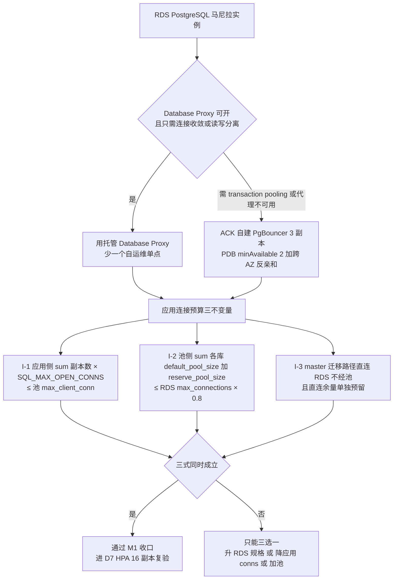

> **最易踩的数字陷阱**：`SQL_MAX_OPEN_CONNS` 的代码默认值是 **1000**（`model/main.go:212`，主库与日志库各设一次），不是方案里估的 300。按 16 副本算 I-1 = **16000 > max_client_conn 4000**。现象很反直觉：**HPA 扩容后反而报 `FATAL: sorry, too many clients already`，扩容变成加重故障的动作**。所以预算表必须**从 ConfigMap 反向生成**，不允许手填。

**自建 PgBouncer 关键配置**

```ini
[databases]
newapi = host=<rds-internal> port=5432 dbname=newapi
[pgbouncer]
pool_mode = session            ; ⚠ 兼容性未验证前先用 session，验证过再考虑 transaction
listen_addr = 0.0.0.0
listen_port = 6432
max_client_conn = 4000
default_pool_size = 40
min_pool_size = 5
reserve_pool_size = 10
reserve_pool_timeout = 3
query_wait_timeout = 120
server_reset_query_always = 0
ignore_startup_parameters = extra_float_digits,options
admin_users = pgb_admin
```
配 **3 副本 Deployment + Service（ClusterIP 5433→6432）+ PDB `minAvailable: 2` + 跨 AZ 反亲和 + KMS 注入 Secret**；完整清单参考仓库 `impl_deploy.md §7.4.5.3`。

**验证方法（任务 41 验收项）**

```sql
-- PgBouncer admin 库
SHOW POOLS;    -- cl_waiting 长期 0；sv_active < default_pool_size
SHOW STATS;    -- max_wait_us 不持续增长
-- RDS 侧
SHOW max_connections;                                   -- 记录真实上限（不可用户改，§1.2#9）
SELECT count(*) FROM pg_stat_activity;                  -- 必须 ≤ max_connections × 0.8
SELECT state, count(*) FROM pg_stat_activity GROUP BY 1; -- idle 不应大量堆积
```
+ HPA 扩到 16 副本期间重复上面的观测，**PG 连接数不撞上限**。

**验证不通过的修复**

| 症状 | 修复 |
| --- | --- |
| `cl_waiting` 持续 >0 | `default_pool_size` 太小 → 调大；或有**慢查询长期占用服务端连接**（查 `pg_stat_activity` 中 `xact_start` 很老的） |
| `query_wait_timeout` 报错 | 池饱和 → 提 `reserve_pool_size`；**真正的根因常在应用侧 `SQL_MAX_OPEN_CONNS` 太大** |
| DDL/迁移失败或怪异 | 迁移走了池 → 强制 master 直连 |
| `prepared statement already exists` / `SET` 不生效 | **transaction 模式与会话语句冲突** → 改 `pool_mode=session` 或应用侧关 prepared statements |

**坑与注意事项**

- **坑 1（最隐蔽）｜transaction 模式下会话级状态泄漏**：`SET`/`SET LOCAL`、prepared statements、advisory lock、`LISTEN/NOTIFY`、跨语句事务都会出错（方案 §7.4.5.4 称"兼容性红线"）。**后果**：**计费/余额相关的偶发、不可复现的错误**——**比宕机更可怕，因为它悄悄改数据**。**改进**：① 默认 `pool_mode=session`（牺牲收敛保正确）；② 只有跑完**经池的三数据库矩阵 + 余额对账压测**后才允许切 transaction；③ 把这条写进上线检查表（§14）。
- **坑 2｜PgBouncer 是新增全站单点**（方案 R21）。**后果**：池挂 = 所有副本连不上库 = 整站不可用，**故障域从"节点级"放大到"全局"**。**改进**：3 副本 + PDB + 反亲和；应用侧重连 + `RetryTimes`；**预置"回退直连 DSN"应急开关并演练**（§13.4）；PgBouncer 不接公网。
- **坑 3｜`SQL_MAX_OPEN_CONNS` 用了代码默认值**。`model/main.go:212` 默认 **1000**，且主库与日志库**各设一次**。**后果**：预算表按 300 估 → 实际 1000×16 = 16000 → `FATAL: sorry, too many clients already`，全站 5xx + **计费写入失败（资损）**。**改进**：**DSN/env 必须显式给值**；预算表**从 ConfigMap 反向生成**，不手填。
- **坑 4｜RDS `max_connections` 不可用户修改**（方案 R38 说"三者对齐"，实际只能通过**升规格**改变）。**后果**：以为调参数能救，白折腾。**改进**：预算不满足时只有三条路——升 RDS 规格、降应用 conns、加池。把结论写回 G11 文档。
- **坑 5｜池的 TLS 与 `verify-full` 冲突**（§4.2/§6.1）。**改进**：DSN 规范两段式——**应用→池 `verify-ca`/`require`（集群内网）**，**池→RDS `verify-full`（内网 + 绑内网地址证书）**。

### 5.7 任务 17（预置）｜RRSA + KMS + Secret 注入链路（人员B，S4 起）

**图 8｜密钥注入信任边界（谁在什么时刻拿到什么）**

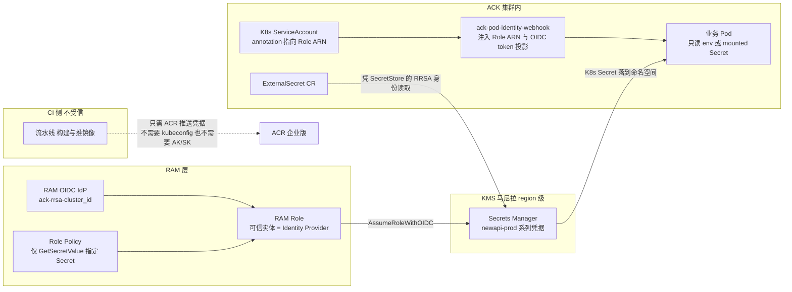

**读图三条边界**

1. **CI 不持有云账号密钥**：流水线只做构建 + 推 ACR；它既不需要 kubeconfig 也不需要长期 AK/SK。这决定了"CI 机器被拿下"不等于"生产被拿下"。
2. **凭证是短时投影**：Pod 通过 webhook 注入的 OIDC token 去 `AssumeRoleWithOIDC`，换到的是临时凭证；KMS Secret 值不落镜像、不落 Git、不落 CR。
3. **KMS 是 region 级服务**：马尼拉的 Secret 新加坡读不到。备 region 的 ExternalSecret 必须在**新加坡另建一套 Secret 并在双写流程里同步**（§9.1），否则接管时直接起不来——这是 M4 演练最常见的失败点。

**操作步骤**

1. 集群已开 RRSA（§5.3）。**Cluster Information → Security and Auditing → RRSA OIDC**，hover `Enabled` 复制 **OIDC Provider ARN** 与 **Issuer URL**；ACK 自动创建 RAM IdP `ack-rrsa-<cluster_id>`。
2. 装 Add-on **`ack-pod-identity-webhook`**（Add-ons → Security）。
3. 建 RAM Role（可信实体 = Identity Provider），信任策略：

```json
{ "Version": "1", "Statement": [{
  "Action": "sts:AssumeRole", "Effect": "Allow",
  "Principal": { "Federated": ["<oidc_provider_arn>"] },
  "Condition": { "StringEquals": {
    "oidc:aud": "sts.aliyuncs.com",
    "oidc:iss": "<rrsa_issuer_url>",
    "oidc:sub": "system:serviceaccount:new-api:new-api-app" } }} ] }
```
授权：**KMS Secrets 只读**（`AliyunKMSCryptoUserAccess` 或更小的自定义策略）+ 按需 OSS。
4. **KMS → Secrets Manager → Create Secret**：`new-api/prod/sql-dsn`、`sql-dsn-migrate`、`redis-conn-string`、`session-secret`、`pay-channel-keys`、`tls-wildcard`。**RDS 型 Secret 支持自动轮换（6h–365d）**；**Generic 型不会自动换内容**（需 FC 轮换钩子，或按 90 天人工轮换）。
5. 集群侧注入（二选一）：
   - **A（官方推荐）**：Add-on **`ack-secret-manager`**（KMS/OOS → K8s Secret 同步）
   - **B**：CSI **`csi-secrets-store-provider-alibabacloud`** + `SecretProviderClass`（`provider: alibabacloud`，文件挂载）
   - （External Secrets Operator 的 `alibaba` provider 为社区维护，**不作生产默认推荐**）
6. namespace 与 SA：

```bash
kubectl create ns new-api --dry-run=client -o yaml | kubectl apply -f -
kubectl label ns new-api pod-identity.alibabacloud.com/injection=on
kubectl create sa new-api-app -n new-api
kubectl annotate sa new-api-app pod-identity.alibabacloud.com/role-name=<kms_role> -n new-api
```

**验证方法**

```bash
kubectl run rrsa-test --rm -it --image=busybox --restart=Never -n new-api \
  --overrides='{"spec":{"serviceAccountName":"new-api-app"}}' \
  -- sh -c 'env | grep ALIBABA_CLOUD_ ; ls -l $ALIBABA_CLOUD_OIDC_TOKEN_FILE'
# 期望出现 ALIBABA_CLOUD_ROLE_ARN / OIDC_PROVIDER_ARN / OIDC_TOKEN_FILE
kubectl -n new-api exec deploy/new-api-stable -- sh -c 'test -n "$SESSION_SECRET" && echo secret-injected'
git log -p --all | grep -icE "SESSION_SECRET=|SQL_DSN=postgres://"      # 期望 0
```

**验证不通过的修复**

| 症状 | 修复 |
| --- | --- |
| Pod 内无 `ALIBABA_CLOUD_*` | namespace 缺 label / SA 缺 `role-name` 注解 / webhook 未装或未 Ready |
| `AssumeRoleWithOIDC ... not authorized` | `oidc:sub` 与实际 `system:serviceaccount:<ns>:<sa>` **不完全一致（逐字符，含大小写）** |
| 挂载的 Secret 文件为空 | `SecretProviderClass` 的 `objectName` 拼错，或 Role 缺 `kms:GetSecretValue` |

**坑与注意事项**

- **坑 1｜SA Token 上限 12 小时**（开 RRSA 后）。**后果**：进程**缓存了临时凭据** → 每 12 小时集中失效，出现"每隔半天随机 401"。**改进**：**永不缓存 token 文件内容**，用官方 SDK 凭据链（Go SDK 自动读这三个 env 并刷新）。
- **坑 2｜`SESSION_SECRET` 多集群不一致**。`common/init.go:50-55`：值为默认 `random_string` 时**直接 `log.Fatal` 起不来**（好事）；但**两地值不同**时，GTM 一切到新加坡 → **所有在线会话立刻失效、用户全部被踢出登录**（方案 R40 红线）。**改进**：两集群注入**同一个 KMS Secret 名**；轮换走 §9.5 双密钥过渡。
- **坑 3｜把 KMS Secret 导出成 ConfigMap 图省事**。**后果**：ConfigMap 不是 Secret 对象，RBAC/审计弱一档，极易被 `kubectl get cm -o yaml` 粘进工单。**改进**：只允许 `Secret` + 外部注入；开启 ACK **Secret 落盘加密（KMS envelope）**。
- **坑 4｜备集群没重复做 RRSA/ACR/VPC 关联**（每个集群是独立个体）。**后果**：接管时 Pod `ImagePullBackOff` 或拿不到 Secret → **接管失败，M4 不过**。**改进**：所有集群侧配置**用同一套 IaC/Helm values 按 region 渲染**，禁止手工点两遍。

### 5.8 任务 14｜RDS 备份策略（PITR 7 天 + WAL）（人员B，1 人时，S3）

**操作步骤**：**RDS → Backup and Restore → Backup Policy / Change Settings**：
- Data Backup Retention：**7 天**（方案 R17 口径；范围 7–730，**建议 30 天**更稳）
- Backup Window：UTC+8 **18:00–19:00**（马尼拉低峰，按实际调）
- **Log Backup（WAL）：必须开启** → PITR 的前提
- 跨地域备份：`【控制台核实】` 马尼拉是否支持备份到 SG；不支持则用 **DBS** 或逻辑备份到 OSS + CRR

> **⚠ 现实约束**：**ESSD 云盘实例的备份文件不能直接下载**（只有老的本地 SSD 支持）。方案 R17 写的"每日全量 + WAL 归档 OSS"——**RDS 自动备份并不落在你自己的 OSS 里**。三选一写进方案：
> 1. 接受备份在 RDS 托管侧，用 **Restore to new instance** 做演练（够用、最省）；
> 2. **DBS（Database Backup）** 做物理/逻辑备份到 `oss-newapi-mnl` + CRR 到 SG → 满足"OSS 归档"的字面要求；
> 3. 每周 `pg_dump` 到 OSS（DMS 定时任务），仅作**离线合规副本**。

**验证方法**

```bash
aliyun rds DescribeBackupPolicy --DBInstanceId <id> | jq '{BackupRetentionPeriod,EnableBackupLog,LogBackupRetentionPeriod,PreferredBackupTime}'
# 期望 EnableBackupLog=1 且 BackupRetentionPeriod>=7
aliyun rds DescribeBackups --DBInstanceId <id> | jq '.Items.Backup[]|{BackupId,BackupStartTime,BackupMethod,BackupStatus}' | head
```
+ 控制台 **Backup and Restore → Restore** 页面**能看到可选的时间点** = 方案 AB 列的"有可恢复时间点"。

**验证不通过的修复**：无备份记录 → 窗口未到，手动 **Create Backup** 验一次；`EnableBackupLog=0` → 日志备份被关（**PITR 不可用，RPO 立刻从分钟级掉到 24h 级**）→ 重开并等一个 WAL 周期再验。

**坑与注意事项**

- **坑 1｜从没做过恢复演练**。备份 ≠ 可恢复。**后果**：真出事才发现恢复要 4 小时 / 恢复出的实例连不上 / 数据不一致。**改进**：**任务 50（§6.6）做 PITR 恢复演练并回填实测 RPO/RTO**，这是 M5 的硬证据。
- **坑 2｜演练选"覆盖原实例"**。**后果**：演练变事故。**改进**：一律 **Restore to a new instance**，验完删除；写进 Runbook 红字（§13.3）。
- **坑 3｜恢复耗时没有 SLA 承诺**。64GB 级 PITR 需按 **1.5–4 小时**预算（快照 + WAL 回放）。**后果**：SLA 承诺的"RTO ≤5min"在 **region 级故障**下**根本不成立**（方案 R26 自己承认，属排除项②）。**改进**：演练实测值写进 M5；客户不接受 → 唯一解是第三 region 主库（超出本次范围，需重新立项）。

### 5.9 D2 出口检查（M1 收口）

```
☐ 马尼拉/新加坡 NAT + 8 EIP 出口 IP 核验通过（只出现池内 IP）
☐ 机型可用性验证完成，${ECS_INSTANCE_TYPE} 候选表已回填
☐ ACK Pro 马尼拉 running + RRSA Enabled + CNI=Terway（截图存档）
☐ RDS 白名单绑定 sg-mnl-app（不是 127.0.0.1 空组）
☐ RDS 三账号权限边界验证通过（migrate / app / sg 各一条命令）
☐ PgBouncer/DB Proxy 就绪，SHOW POOLS 的 cl_waiting=0
☐ 备份策略 EnableBackupLog=1，可恢复时间点可见
☐ SESSION_SECRET 在两集群的注入源为同一 KMS Secret
```

## 6. 阶段 D：D3 落地（任务 15、17、19、24、50、56）

> D3 的六件事互相独立度很高：**人员B** 走数据线（#15 → #17 → #50），**人员A** 走接入与备地域线（#19 → #24 → #56）。全部落在 S5–S6 两个时段（各 4 人时上限）。

### 6.1 任务 15｜开启 RDS 公网地址并把白名单收死（数据线的门槛）

这一步是整个方案里**最容易做成"看似安全、实则裸奔"**的一步：公网地址一开，默认白名单组若是 `default` 且被人填成 `127.0.0.1`，等于"任何人都连不上"；若填成 `0.0.0.0/0`，等于"任何人都能连"。两种都是错的，且都不会有任何告警。

#### 操作步骤

**Step 1 — 申请公网地址**

控制台 `ApsaraDB RDS → Instances → (rds-mnl-newapi) → Database Connection`，点 **Apply for Public Endpoint**。 CLI 等价：

```bash
aliyun rds AllocateInstancePublicConnection \
  --RegionId ap-southeast-6 \
  --DBInstanceId ${RDS_MNL_ID} \
  --ConnectionStringPrefix ${RDS_MNL_ID}pub \
  --Port 5432
```

国际站公网地址后缀通常是 `.pg.rds.aliyuncs.com`（PG 高可用版），记下**完整地址**：

```bash
aliyun rds DescribeDBInstanceNetInfo --DBInstanceId ${RDS_MNL_ID} \
  | jq -r '.DBInstanceNetInfos.DBInstanceNetInfo[] | [.IPType,.ConnectionString,.Port] | @tsv'
# 期望两行：Inner / Public
```

**Step 2 — 先做 TLS 证书的地址绑定决策（P0-4，务必在开 SSL 之前定）**

RDS 的服务器证书 **CN/SAN 只绑定"开启 SSL 时所选的那个连接地址"**。所以顺序必须是：*先决定新加坡用哪个地址连，再开 SSL*。

```bash
aliyun rds DescribeDBInstanceSSL --DBInstanceId ${RDS_MNL_ID} | jq '{ssl_enabled:.SSLEnabled,conn_str:.ConnectionString,ca:.CAType}'
```

**图 9｜跨区 TLS 路径决策（P0-4，决定 M4 能否过）**

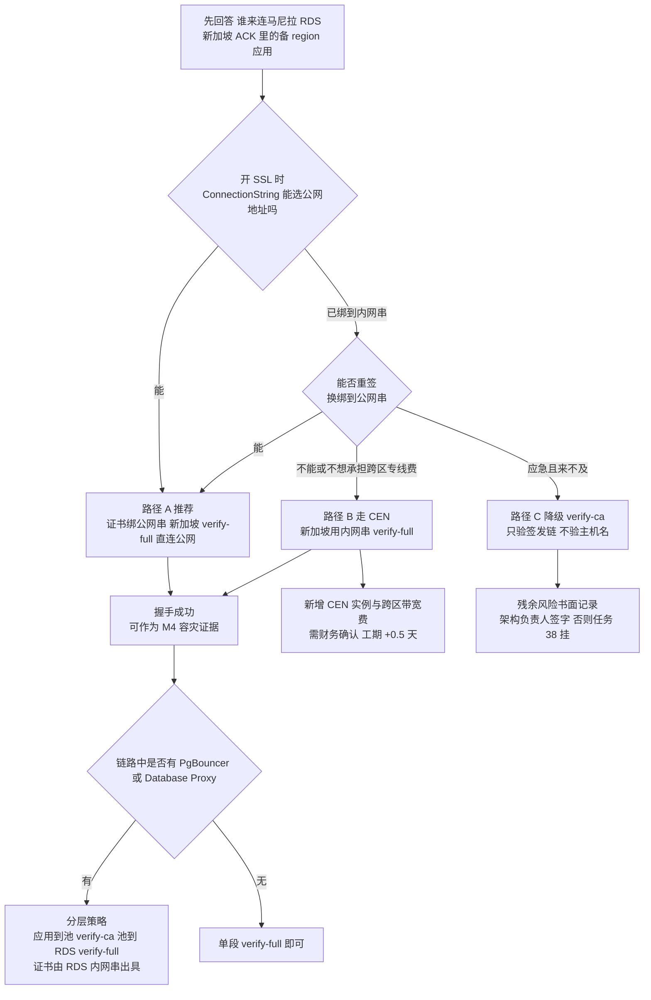

> **失败长这样**：`server certificate for "pgm-xxx.pg.rds.aliyuncs.com" does not match host name "pgm-xxxo..."`。根因永远是同一句话——**证书 CN/SAN 绑的是"开 SSL 那一刻选的那个连接地址"**。所以顺序不能反：先定地址，再开 SSL。一旦绑错，只能关 SSL 重开或走路径 B/C。

三条可选路径（按推荐度）：

| 路径 | 做法 | 适用 | 代价 |
| --- | --- | --- | --- |
| **A（推荐）** | 开 SSL 时 `ConnectionString` 选**公网地址**；新加坡侧 `sslmode=verify-full` 直连公网 | 只有新加坡一个备 region | 内网地址走同一条连接串的应用需要额外配一份证书；证书与地址绑定后**换地址必须重签** |
| B | 走 **CEN（云企业网）** 打通马尼拉 VPC ↔ 新加坡 VPC，新加坡用**内网地址** + verify-full | 网络团队接受跨区专线成本 | 引入 CEN 实例+跨区带宽费（impl_deploy.md 7.10 未计入），需财务确认；工期 +0.5 天 |
| C | 新加坡侧 `sslmode=verify-ca`（只验签发链、不验主机名） | 应急 | **必须书面记录残余风险并让架构负责人签字**，否则安全核查（任务 38）会挂 |

开 SSL（以路径 A 为例，务必选公网串）：

```bash
aliyun rds ModifyDBInstanceSSL --DBInstanceId ${RDS_MNL_ID} \
  --ConnectionString ${RDS_MNL_PUB} --Port 5432 --SSLEnabled 1 --CaEnabled 0
# 换证书/换地址用同一命令重复调用（CARequired 参数在部分版本为必填，报参数错就补 --CaEnabled 0 --RequireUpdate yes）
aliyun rds DescribeDBInstanceSSL --DBInstanceId ${RDS_MNL_ID} | jq '.SSLEnabled'   # 期望 1
```

**Step 3 — 白名单：只放新加坡 4 个 NAT EIP**

```bash
# 3.1 建独立白名单组，名字与用途绑定，禁止复用 default
aliyun rds ModifySecurityIps --DBInstanceId ${RDS_MNL_ID} \
  --DBInstanceIPArrayName sg_standby_eip \
  --SecurityIps "${SG_EIP_01}/32,${SG_EIP_02}/32,${SG_EIP_03}/32,${SG_EIP_04}/32" \
  --WhitelistNetworkType MIX

# 3.2 把 default 组显式设为不可命中（不是 127.0.0.1 那种"看起来安全"）
aliyun rds ModifySecurityIps --DBInstanceId ${RDS_MNL_ID} \
  --DBInstanceIPArrayName default --SecurityIps "127.0.0.1"

# 3.3 主站内网侧使用 SG 绑定的白名单组（ACK Pod 用 vSwitch app 网段）
aliyun rds ModifySecurityIps --DBInstanceId ${RDS_MNL_ID} \
  --DBInstanceIPArrayName mnl_vpc --SecurityIps "10.0.32.0/20,10.0.48.0/20,10.0.64.0/20,10.0.80.0/20"
```

**Step 4 — 强制 TLS 只允许（PG 侧参数）**

RDS PG 可通过参数 `rds_force_transitions_readonly`（无关）；这里要的是 **`log_connections` + 拒绝明文**。国际站 RDS PG 可控参数里勾选：

```bash
aliyun rds DescribeParameters --DBInstanceId ${RDS_MNL_ID} \
  | grep -Ei "ssl|force" 
# 若存在 requires_ssl / rds_enable_ssl 类可改参数，设为 1；不可改则记录为"仅靠客户端 sslmode + 白名单"两层控制
```

#### 验证方法

```bash
# V1 公网 TLS 握手（在 NEW加坡任一集群节点或同 region ECS 上执行）
openssl s_client -connect ${RDS_MNL_PUB}:5432 -starttls postgres -servername ${RDS_MNL_PUB} 2>/dev/null \
  | openssl x509 -noout -subject -ext subjectAltName
# 期望：CN 或 SAN 中【包含】${RDS_MNL_PUB}

# V2 白名单正例：新加坡 NAT 出口能连
psql "host=${RDS_MNL_PUB} port=5432 dbname=postgres user=newapi_sg sslmode=verify-full sslrootcert=./apsaradb-ca.pem" \
  -c "select current_setting('server_version'), inet_server_addr(), now();"

# V3 白名单反例：非白名单 IP 必须被丢
timeout 8 psql "host=${RDS_MNL_PUB} port=5432 dbname=postgres user=newapi_sg sslmode=disable" -c "select 1"
# 期望：timeout / connection refused，绝不能返回 1 行结果

# V4 明文必须被拒（若第 4 步生效）
psql "host=${RDS_MNL_PUB} port=5432 dbname=postgres user=newapi_sg sslmode=disable" -c "select 1"
# 期望：FATAL: no pg_hba.conf entry for host ... no SSL
```

#### 验证不通过的修复

| 症状 | 根因 | 修复 |
| --- | --- | --- |
| `server certificate for "pgm-xxx.pg.rds.aliyuncs.com" does not match host name "pgm-xxxpub..."` | SSL 开在内网串上（P0-4 命中） | 用 Step 2 路径 A：`ModifyDBInstanceSSL --ConnectionString <公网串>` 重签，再 `DescribeDBInstanceSSL` 复核；无法改则临时 `verify-ca` 并走 C 的签字流程 |
| `timeout` 且 `nc -vz` 也不通 | NAT SNAT 条目未覆盖新 Pod 网段，或 EIP 不是登记的那 4 个 | 在**新加坡节点上**跑 `for i in 1 2 3 4 5; do curl -s https://ifconfig.me; echo; done`，把真实出口 IP 补进白名单组 |
| 连上但 `inet_server_addr()` 返回的内网地址 | 你连的其实是 VPC 内另一条链路 | 说明走的是 CEN/对等，属好事；但要在验收记录里写清"实际路径"，否则 M4 证据链口径不一致 |
| 白名单改了 10 分钟仍不生效 | 控制台改的是**只读实例**的白名单 | 主实例 `DescribeDBInstances` 里核对 `DBInstanceId`，只读实例白名单不继承 |

#### 坑与注意事项

- **坑 1｜"127.0.0.1 = 禁止一切"是错觉。** 现象：安全组/白名单填 `127.0.0.1` 后主站应用连不上。后果：D3–D4 排障方向全错，误以为 RDS 故障。改进：白名单必须**按用途分命名组**（`mnl_vpc` / `sg_standby_eip`），每组都有明确 owner；在 §12 验收里要求"贴白名单组截图，而不是贴 default 组"。
- **坑 2｜NAT EIP 会被换。** 现象：某天开始新加坡突然连不上主库。后果：备 region 静默失去接管能力，直到真正切换时才发现（RTO 直接爆）。改进：§11.3 的**备 region → 马尼拉 RDS TCP 拨测**必须绑定"连接失败率"告警；EIP 解绑/重绑列入变更审批（§8.5 运维访问面）。
- **坑 3｜`AllocateInstancePublicConnection` 的地址串一旦释放不能再拿回。** 后果：应用配置、RDS 证书、上游白名单全要重配。改进：**永不释放公网串**；不需要外网访问时把白名单清空即可，而不是释放地址。
- **坑 4｜把公网串写进 Git 的 ConfigMap 明文。** 后果：Git 历史不可撤销，安全核查（任务 38）直接判不合格。改进：DSN 只进 **KMS 凭据管家**，见 §6.2。
- **坑 5｜白名单加了但没加 `/32`。** 后果：填 `47.x.x.x` 被规范成 `47.x.x.0/24`，意外放行整段。改进：一律显式 `/32`，并用 `DescribeDBInstanceIPArrayList` 复核 CIDR 掩码。

### 6.2 任务 17｜Namespace / ConfigMap / Secret（KMS + RRSA + ExternalSecret）

这是"密钥不落 Git"这条红线真正落地的地方，也是后面所有 Deployment 的公共前提。

#### 操作步骤

**Step 1 — Namespace 与资源配额**

```yaml
# k8s/base/namespace.yaml
apiVersion: v1
kind: Namespace
metadata:
  name: new-api
  labels: {project: new-api, site: ph-mnl, env: prod}
---
apiVersion: v1
kind: ResourceQuota
metadata: {name: new-api-quota, namespace: new-api}
spec:
  hard: {requests.cpu: "48", requests.memory: 96Gi, limits.cpu: "64", limits.memory: 128Gi}
```

配额数字来自 §2.1 基线（4 副本 × request 2C/4G，留 4 倍 HPA 余量）。**注意 ResourceQuota 超了不会报错给 Deployment，只会让 Pod 卡在 `Forbidden: exceeded quota`**，所以先设后部署。

**Step 2 — ConfigMap（非敏感运行参数）**

```yaml
# k8s/base/configmap.yaml
apiVersion: v1
kind: ConfigMap
metadata: {name: new-api-config, namespace: new-api}
data:
  TZ: "Asia/Manila"
  NODE_TYPE: "slave"            # ⚠ 见坑 1，绝不能留空（master Deployment 单独覆盖）
  MEMORY_CACHE_ENABLED: "false" # prod 硬约束：多副本本地缓存会导致额度/配置不一致
  SYNC_FREQUENCY: "30"          # 方案要求 30；代码默认 60（common/init.go:110）必须显式覆盖
  SQL_MAX_OPEN_CONNS: "150"     # 与 §5.6 连接数预算一致；代码默认 1000（model/main.go:212）
  LOG_SQL_MAX_OPEN_CONNS: "50"
  GLOBAL_API_RATE_LIMIT: "360"  # 与代码默认一致，显式写出避免误解
  GLOBAL_API_RATE_LIMIT_DURATION: "180"
  SESSION_MAX_AGE: "2592000"
  ERROR_LOG_LEVEL: "warn"
  LOG_DIR: "/app/logs"
```

**Step 3 — ExternalSecret（KMS 凭据管家 → Secret）**

前置：§5.7 已建 RRSA 角色 + ACK 装了 `ack-secret-manager` / CSI Secrets Store Provider。

```yaml
apiVersion: alibabacloud.com/v1alpha1
kind: ExternalSecret
metadata: {name: new-api-secret, namespace: new-api}
spec:
  refreshInterval: 1h
  smSecret:
    name: new-api-secret          # 生成的 K8s Secret 名
    des:
      nameTemplate: "new-api-secret"
    fetch:
    - key: aone/newapi/prod/SQL_DSN
    - key: aone/newapi/prod/LOG_SQL_DSN
    - key: aone/newapi/prod/REDIS_CONN_STRING
    - key: aone/newapi/prod/SESSION_SECRET
    - key: aone/newapi/prod/SESSION_SECRET_OLD   # 双密钥轮换用，见 §9.9
    - key: aone/newapi/prod/PAYMENT_PRIVATE_KEY
---
apiVersion: secretsstore.csi.alibabacloud.com/v1alpha1
kind: SecretProviderClass    # 仅当走 CSI 直挂模式时使用；与 ExternalSecret 二选一
```

**Step 4 — Pod 侧引用**

```yaml
envFrom:
- configMapRef: {name: new-api-config}
env:
- name: SQL_DSN
  valueFrom: {secretKeyRef: {name: new-api-secret, key: SQL_DSN}}
serviceAccountName: new-api-app     # 与 RRSA 角色绑定的 SA
```

**Step 5 — 应用（新加坡集群同构，仅 `site`/`NODE_TYPE`/DSN 不同）**

```bash
kubectl apply -f k8s/base/namespace.yaml -f k8s/base/configmap.yaml -f k8s/base/externalsecret.yaml
kubectl -n new-api get externalsecret new-api-secret \
  -o jsonpath='{.status.conditions[*].type}{"\n"}'   # 期望 True / Ready
```

#### 验证方法

```bash
# V1 Secret 已生成且键齐全
kubectl -n new-api get secret new-api-secret \
  -o jsonpath='{.data}' | jq 'keys'
# 期望：SQL_DSN / LOG_SQL_DSN / REDIS_CONN_STRING / SESSION_SECRET / SESSION_SECRET_OLD / PAYMENT_PRIVATE_KEY

# V2 密钥确实来自 KMS（改 KMS 值 → 1 个 refresh 周期内 K8s 侧跟随）
#   控制台改 aone/newapi/prod/SESSION_SECRET 末尾加 "-t"，等 60s：
kubectl -n new-api get secret new-api-secret -o jsonpath='{.data.SESSION_SECRET}' | base64 -d
# 期望：以 -t 结尾（验完改回）

# V3 Pod 内环境变量正确且无明文外泄
kubectl -n new-api exec deploy/new-api-stable -- env | grep -Ei "NODE_TYPE|MEMORY_CACHE|SYNC_FREQ|SQL_MAX" | sort
# 期望与 ConfigMap 完全一致

# V4 RRSA 生效（Pod 内能拿到 STS）
kubectl -n new-api exec deploy/new-api-stable -- sh -c \
  'ls -l "$ALIBABA_CLOUD_OIDC_TOKEN_FILE" && env | grep ALIBABA_CLOUD_ROLE'
# 期望：token 文件存在、role arn 非空

# V5 Git 无密钥扫描（任务 38 的前置）
git log -p --all | grep -Eci "LTAI[0-9A-Za-z]{16}|-----BEGIN (RSA|EC) PRIVATE KEY-----"
# 期望 0
```

#### 验证不通过的修复

| 症状 | 根因 | 修复 |
| --- | --- | --- |
| ExternalSecret 一直 `Ready=False`，事件里 `Forbidden` | RRSA 角色缺 `kms:GetSecretValue`，或 Resource 未包含该 Secret 名 | 补策略到具体 Secret ARN（不要给 `*`）；确认 SA annotation `pod-identity.alibabacloud.com/role-name` |
| Secret 生成了但 Pod 里读到旧值 | Pod 不感知 Secret 轮转（env 引用只在启动时注入） | 加 `checksum/config` annotation 触发滚动，或 `kubectl -n new-api rollout restart deploy/new-api-stable` |
| `exceeded quota` 卡 Pending | ResourceQuota 与 request/limit 口径不一致 | 按 §2.1 重算；limit 也要计入 quota，不要只算 request |
| V2 不跟随 | `refreshInterval` 太长或 KMS 凭据被托管到其他实例 | 调成 5m 验证；确认 `SecretsManager` 实例与集群同 region |

#### 坑与注意事项

- **坑 1｜`NODE_TYPE` 留空 = 全集群变成 master（重大隐患）。** 代码事实：`common/init.go:89` 是 `IsMasterNode = os.Getenv("NODE_TYPE") != "slave"` —— **字符串不等判断**，空值、`Slave`、`SLAVE`、带空格全部被判定为 master。后果：stable 副本会并发改表结构 + 并跑 master-only 定时任务，出现重复扣费/重复对账/迁移死锁，属**资金级事故**。改进：① ConfigMap 里**显式写死** `NODE_TYPE: "slave"`；② 加 OPA/Kyverno 或 `kubectl --dry-run` CI 规则：`env.NODE_TYPE` 缺失或 != "slave" 则拒绝合入；③ §11.6 上线检查表逐条打勾。
- **坑 2｜`MEMORY_CACHE_ENABLED=true` 留到多副本环境。** 后果：额度、渠道权重、系统配置在多 Pod 间不一致，用户看到"余额随机跳变"。改进：prod 恒为 `false`（impl_deploy.md 已列），只在单副本 staging 允许 true。
- **坑 3｜`SESSION_SECRET` 两集群不一致。** 后果：GTM 切到新加坡后**全员登录态失效 + 已签发令牌 401**，接管等于雪崩。改进：两集群必须指向**同一 KMS Secret Key**（不是"复制同样的值"），并在 §9.9 演练双密钥轮换。
- **坑 4｜把 ConfigMap 改了以为生效。** 后果：`SYNC_FREQUENCY` 仍是 60，配置跨节点收敛变慢，D7 任务 53 验证不过。改进：**ConfigMap/Secret 任何变更 → `rollout restart`**，写进 Runbook。
- **坑 5｜KMS 凭据版本与 `SESSION_SECRET_OLD` 混用。** 后果：轮换窗口内新旧密钥都失效。改进：轮换时只把"旧值"复制到 `_OLD` 键，新值写主键（见 §9.9）。
- **坑 6｜国际站 KMS 实例是 region 级。** 新加坡 Pod 读马尼拉的 Secret 要走公网/跨区，且要单独授权。改进：两 region 各建 KMS 实例，用**同一份 Secret 内容**双写（或只在新加坡存"备 region 需要的键"），并在 §9.5 带宽成本里计入跨区调用次数。

### 6.3 任务 19｜马尼拉 ALB + AlbConfig + 健康检查

#### 操作步骤

**Step 1 — 装组件**（ACK 控制台 → 组件管理 → **ALB Ingress Controller**，版本随集群；确认已选"复用已有 ALB"还是"新建"）。

**Step 2 — AlbConfig CRD**

```yaml
apiVersion: alibabacloud.com/v1
kind: AlbConfig
metadata: {name: mnl-alb}
spec:
  config:
    name: alb-newapi-mnl
    addressType: Internet
    zoneMappings:
    - vSwitchId: ${VSW_MNL_PUB_A}
    - vSwitchId: ${VSW_MNL_PUB_B}
    accessLogConfig:
      logProject: sls-newapi-mnl
      logStore: alb-access
    tags:
    - {key: project, value: new-api}
    - {key: site, value: ph-mnl}
  listeners:
  - port: 80
    protocol: HTTP
    httpDefaultActions:
    - type: Redirect
      redirectConfig: {host: api.likha.com, https: on, port: "443"}
  - port: 443
    protocol: HTTPS
    securityPolicyId: tls_cipher_policy_1_2_strict_with_1_3
    caEnabled: false
    requestTimeout: 600          # ⚠ 方案写 180；硬上限 600，见 P0-5
    idleTimeout: 60
    certificates:
    - CertIdentifier: ${CERT_ID_ALB}
```

```bash
kubectl apply -f albconfig.yaml
kubectl get albconfig mnl-alb -o jsonpath='{.status.loadBalancer.dnsname}{"\n"}'
```

**Step 3 — IngressClass + Ingress**

```yaml
apiVersion: networking.k8s.io/v1
kind: IngressClass
metadata: {name: alb}
spec: {controller: ingress.k8s.alibabacloud/alb}
```

`stable` Service（NodePort 或 Terway ENI 直连模式，ACK 推荐 **Terway + `serviceType: ClusterIP` + 后端走 Pod ENI**）由 §8.4 部署；此处先建 `new-api-master` 不接流量的 Service。

**Step 4 — 健康检查**

```yaml
metadata:
  annotations:
    alb.ingress.kubernetes.io/healthcheck-enabled: "true"
    alb.ingress.kubernetes.io/healthcheck-path: "/api/status"
    alb.ingress.kubernetes.io/healthcheck-interval-seconds: "6"
    alb.ingress.kubernetes.io/healthcheck-timeout-seconds: "3"
    alb.ingress.kubernetes.io/healthy-threshold-count: "2"
    alb.ingress.kubernetes.io/unhealthy-threshold-count: "3"
    alb.ingress.kubernetes.io/healthcheck-method: "GET"
    alb.ingress.kubernetes.io/healthcheck-httpcode: "http_2xx"
```

> **当前本仓库只有 `GET /api/status` 可用**（`router/api-router.go:26`）。`/healthz`、`/readyz`、`/metrics` **未注册**（P1-20）。G8 未完成前健康检查必须用 `/api/status`；`/readyz` 上线后再切，因为 `/api/status` 不反映 DB 就绪，会把"进程活着但连不上库"的 Pod 判成健康。

#### 验证方法

```bash
# V1 ALB 实例与 AZ 绑定
aliyun alb GetLoadBalancerAttribute --LoadBalancerId ${ALB_MNL_ID} | jq -r '.DNSName, (.ZoneMappings[].ZoneId)'
# 期望：两个 AZ = ap-southeast-6a / 6b

# V2 超时参数真的落到 listener
aliyun alb GetListenerAttribute --ListenerId ${HTTPS_LISTENER_ID} | jq '{IdleTimeout,RequestTimeout}'
# 期望：{"IdleTimeout":60,"RequestTimeout":600}

# V3 TLS 策略
echo | openssl s_client -connect ${ALB_DNS}:443 -servername api.likha.com 2>/dev/null | grep -E "Protocol|Cipher"
# 期望 TLSv1.2/1.3；再用弱版本反例：
echo | openssl s_client -connect ${ALB_DNS}:443 -tls1_1 2>&1 | grep -Ei "alert|error"   # 期望握手失败

# V4 HTTP→HTTPS 跳转
curl -sSI --resolve api.likha.com:80:${ALB_VIP} http://api.likha.com/ | grep -Ei "^HTTP|^location"
# 期望 301 + Location https://api.likha.com/

# V5 健康检查后端全绿
aliyun alb ListServerGroups --ServerGroupNames.1 new-api-stable | jq '.ServerGroups[0].HealthCheck'
aliyun alb GetListenerHealthStatus --ListenerId ${HTTPS_LISTENER_ID} | jq -r '.ListenerHealthStatus[].ServerGroupInfos[].NonnormalServers'  # 期望 []
```

#### 验证不通过的修复

| 症状 | 根因 | 修复 |
| --- | --- | --- |
| AlbConfig 一直 `Progressing`，事件 `InvalidZoneMapping` | 只填了 1 个 vSwitch，或 vSwitch 所在 AZ 不被 ALB 支持 | ALB **强制 ≥2 AZ**；马尼拉只能 6a+6b，确认两个 pub vSwitch 分属两 AZ |
| Pod 全不健康但 `/api/status` 本地 curl 正常 | 健康检查打到 **NodePort 未开放** / Terway 模式下 SG 未放行 ALB → Pod 网段 | Terway：ALB 走 Pod ENI 直连，需要在 `sg-mnl-app` 放行入向 3000 源为 ALB 所在 vSwitch 网段（`10.0.0.0/24,10.0.1.0/24`） |
| `RequestTimeout` 设 1800 报 `InvalidParameter` | 超上限 | 上限就是 **600**；长任务改异步 + 轮询（见坑 3） |
| 502 且 access log 有记录、上游 0 字节 | Pod 被 SSE 长连接占满 worker | 提高 `GIN` 侧并发（Go 无 worker 概念，实际是 FD/内存），确认 §5.4 nofile=200000 生效 |

#### 坑与注意事项

- **坑 1｜`requestTimeout` 600 是天花板，不是配置项。** 后果：模型回答 >10 分钟的请求必被 ALB 切断，用户看到"回答中途断流"。改进：① 15–20s SSE ping 保活（`idle_timeout` 侧）；② 长任务（批量、视频类）走 `task` 异步接口 + 轮询；③ 在产品文案/合同里写明单请求上限（§12 口径）。
- **坑 2｜idleTimeout 与 SSE 的关系搞反。** `idleTimeout` 是**两包之间**的静默间隔。后果：设 60 却每 20s 才 ping 一次是安全的，但如果上游卡住不吐字，60s 就断。改进：网关 ping 间隔设 **15s**（留 4 倍余量），并在 §11.1 压测里用 `并发 SSE 1500 + 上游静默 45s` 场景实测。
- **坑 3｜ALB 的 TLS 证书与 SNI。** 未配 `securityPolicyId` 时默认可协商 TLS1.0（部分老客户端）→ 安全核查判不合格。改进：显式 `tls_cipher_policy_1_2_strict_with_1_3`；D6 任务 40 再复核 SNI 域名校验。
- **坑 4｜复用已有 ALB 时 AlbConfig 会把 listener 覆盖。** 后果：手工在控制台加的转发规则被 GitOps apply 抹掉。改进：**ALB 只能通过 AlbConfig/Ingress 管理**，禁止控制台改；ActionTrail 里加"谁改了 ALB"告警（§3.3）。
- **坑 5｜`accessLogConfig` 引用不存在的 SLS Project。** 后果：ALB 创建成功但日志静默丢失，事后无证据。改进：先建 Project/Logstore（§9.2）再配；或先不配、D6 补上并回归 V1 检查。

### 6.4 任务 24｜新加坡 ACK 集群 + 常态 2 节点节点池

#### 操作步骤

**Step 1 — 集群（与马尼拉同构，差异项只有 region 与网段）**

```bash
cat <<'EOF' > create-cluster-sg.json
{"name":"ack-newapi-sg","cluster_spec":"ack.pro.small","region_id":"ap-southeast-1","kubernetes_version":"1.35.0-aliyun.1",
 "vpcid":"${VPC_SG_ID}","vswitch_ids":["${VSW_SG_APP_A}","${VSW_SG_APP_B}"],
 "container_cidr":"10.1.128.0/17","service_cidr":"10.1.0.0/20",
 "ip_stack":"ipv4","network":"terway-eniip","node_cidr_mask":"25",
 "snat_entry":false,"endpoint_public_access":false,"deletion_protection":true,
 "timezone":"Asia/Singapore","proxy_mode":"ipvs",
 "addons":[{"name":"terway-eniip"},{"name":"csi-plugin"},{"name":"csi-provisioner"},
           {"name":"ack-pod-identity-webhook"},{"name":"alb-ingress-controller"},
           {"name":"managed-coredns"},{"name":"arms-prometheus"},{"name":"logtail-ds"}]}
EOF
envsubst < create-cluster-sg.json > create-cluster-sg.rendered.json   # 替换 ${VPC_SG_ID} 等占位
aliyun cs CreateCluster --header "Content-Type=application/json" --body "$(cat create-cluster-sg.rendered.json)"
```

关键差异说明：`snat_entry:false` —— **新加坡出网必须走已登记的 NAT EIP 池**，让 ACK 自动建 NAT 会产生 4 个白名单外的出口 IP（上游与 RDS 全部拒连）。`endpoint_public_access:false` —— API Server 只留内网端点（任务 46 的运维访问面）。

**Step 2 — 节点池（常态 2 / 自动伸缩 2–12）**

```bash
cat <<'EOF' > nodepool-sg.json
{"nodepool_info":{"name":"np-sg-ph-standby"},
 "scaling_group":{"instance_types":["ecs.g8i.2xlarge","ecs.g8a.2xlarge","ecs.g7.2xlarge"],
   "vswitch_ids":["${VSW_SG_APP_A}","${VSW_SG_APP_B}"],"system_disk_category":"cloud_essd","system_disk_size":100,
   "data_disks":[{"category":"cloud_essd","size":300}],"desired_size":2,"min_size":2,"max_size":12,
   "instance_charge_type":"PostPaid","internet_max_bandwidth_out":0,
   "multi_az_policy":"BALANCE",
   "tags":[{"key":"site","value":"sg"},{"key":"env","value":"prod"}]},
 "kubernetes_config":{"runtime":"containerd","cpu_policy":"none"},
 "auto_scaling":{"enable":true,"health_check_type":"NODE","scale_unsupported":false}}
EOF
envsubst < nodepool-sg.json > nodepool-sg.rendered.json
aliyun cs CreateClusterNodePool --ClusterId ${ACK_SG_ID} --body "$(cat nodepool-sg.rendered.json)"
```

**Step 3 — 与马尼拉的一致性检查（最容易漏的一步）**

新加坡集群的 `SESSION_SECRET` 来源、镜像 tag、`NODE_TYPE=slave`、`site=ph` 标签必须与主站一致 —— 备集群不是"另一套系统"，是同一系统的第二份算力。

#### 验证方法

```bash
# V1 集群与节点
kubectl --context sg get nodes -o wide
# 期望 2 节点 Ready，REGION=ap-southeast-1，AZ 分属两区
kubectl --context sg get cm -n kube-system cluster-info -o jsonpath='{.data.kubernetesVersion}'

# V2 出口 IP 仍在登记池内（核心！）
kubectl --context sg run egress-probe --image=curlimages/curl --rm -it --restart=Never -- \
  sh -c 'for i in 1 2 3 4 5 6; do curl -s https://ifconfig.me; echo; done' | sort -u
# 期望：只出现 4 个已提交上游的 SG EIP

# V3 镜像拉取走新加坡 VPC 域名
kubectl --context sg get nodes -o jsonpath='{.items[*].metadata.name}' | tr ' ' '\n' \
  | head -1 | xargs -I{} kubectl --context sg debug node/{} -it --image=busybox -- sh -c \
  'wget -qO- http://registry-vpc.ap-southeast-1.aliyuncs.com/v2/ || echo reachable'

# V4 Terway 未与主站冲突：确认两集群 Service CIDR 不重叠
kubectl --context sg cm -n kube-system get eni-config -o jsonpath='{.data}' | tr ',' '\n' | grep -Ei "cidr|mask"
```

#### 验证不通过的修复

| 症状 | 根因 | 修复 |
| --- | --- | --- |
| V2 出现陌生 IP | ACK 建了第二个 NAT，或 Pod 走 ECI/公网网卡 | 删掉自动建的 NAT 或把 SNAT 条目指向 `nat-sg-prod`；确认集群创建时 `snat_entry=false` |
| 节点池 `desired_size=2` 但只起 1 台 | 96 vCPU 配额未批复 / 单 AZ 无库存 | §3.4 复核配额；机型列表至少 3 个候选；必要时先 `desired_size=1` 保工期，D5 补 |
| `endpoint_public_access` 想改回 true | 已建集群无法直接开公网端点 | 用 **EIP 绑定 API Server SLB**（`ModifyCluster --api_audience`）或走堡垒机；不要为了图快改 SG 放行 0.0.0.0/0 |
| CNI 装错（选了 flannel） | 创建时 body 写 `network:"flannel"` | **不可热切**，只能重建集群。备集群重建成本低（无状态），立刻重建并记入坑库 |

#### 坑与注意事项

- **坑 1｜`snat_entry:true` 的默认值。** 控制台默认勾选"为 VPC 配置 SNAT"。后果：多出一个未登记的出口 EIP，上游 429/拒连、RDS 白名单失配，且**故障时表现为间歇性失败**，极难定位。改进：创建集群用 CLI body 显式 `false`；CI 里加 `aliyun vpc DescribeNatGateways` 断言"每 region 只有 1 个 NAT"。
- **坑 2｜两集群 SA/KMS/RRSA 角色串用。** 后果：新加坡 Pod 用马尼拉的 RRSA 角色拿不到 Secret（信任策略里的 OIDC provider 是 region+cluster 维）。改进：`ack-pod-identity-webhook` 注入的 `OIDC_PROVIDER_ARN` 必须在 Pod env 里核对（§6.2 V4）。
- **坑 3｜常态 2 副本 + 冷备节点池被误当成"热备"。** 后果：接管时要等节点扩容 + Pod 拉起（90–180s），RTO 从秒级掉到分钟级，M4 验收不过。改进：`desired_size=2` 常备运行、`NODE_TYPE=slave` 且**保持连接池 warm**（§10.7 Tair/DB 预热）；GTM 备地址池只在压测通过后加入（任务 36）。
- **坑 4｜节点标签与污点未统一，导致主备反亲和失效。** 改进：两集群统一标签 `site`/`env`/`track`，`topologySpreadConstraints` 用 `labelKeys: [app]` + `whenUnsatisfiable: DoNotSchedule`（软约束会让 4 副本全挤一个 AZ）。

### 6.5 任务 50｜PITR 备份恢复演练（记录真实 RPO/RTO）

方案把它排在 D3 是对的：**必须在工作负载还没复杂时**测出恢复基线。

#### 操作步骤

1. 确认备份链完整：`DescribeBackupPolicy` 的 `EnableBackupLog=1`、`PreferredBackupTime` 落在业务低谷（马尼拉 UTC+8，本地凌晨 2–4 点 = `18:00Z-20:00Z`）。
2. 在主库写入可追踪哨兵：

```sql
CREATE TABLE IF NOT EXISTS ops_drill_marker (id serial primary key, note text, ts timestamptz default now());
INSERT INTO ops_drill_marker(note) VALUES ('pitr-drill-before');
SELECT pg_switch_wal();   -- 强制归档 WAL，缩短可恢复延迟
```

3. 控制台 **Backup and Restoration → Restore to a new instance**，时间点选 `now()`；规格选最低配（演练用，**成本按小时计，验完立即释放**）。
4. 记录三个时间点：发起恢复 `T0`、新实例可连 `T1`、哨兵数据齐全 `T2`。**RTO = T1-T0**，**数据损失 = 最后一个已归档 WAL 与故障点之差**（本次演练理论上 0）。
5. 校验：

```sql
-- 新实例
SELECT count(*) FROM users;                       -- 与主库对比
SELECT max(ts) FROM ops_drill_marker;             -- 应等于最后一条写入时间
SELECT pg_is_in_recovery();                       -- 期望 f（新实例可写）
```

6. 释放实例，导出备份任务耗时曲线截图存档。

#### 验证方法 / 修复

| 检查 | 期望 | 不通过时 |
| --- | --- | --- |
| `DescribeBackupTasks` | `Progress=100%`，无 `Failed` | 看 `Engine`/`BackupMethod`；WAL 归档失败先查 OSS 授权（`AliyunRDSBackupDefaultRole`） |
| 可恢复时间点范围 | 覆盖近 7 天 | `EnableBackupLog=0` → 开启后**历史不可回补**，只能重新起算 |
| `ops_drill_marker` 最后一条时间 | = 发起恢复时刻 - ≤ 5min | 差距大 → `pg_switch_wal()` 未执行或归档延迟高；记录真实 RPO 并按 SLA 口径确认是否可接受 |
| 恢复后业务表行数一致 | 一致 | 不一致优先怀疑**恢复了错误的库**（多 DB 实例）|

#### 坑与注意事项

- **坑 1｜把"恢复到新实例"点成"覆盖原实例"。** 后果：**这是本方案里唯一会直接造成生产数据丢失的按钮**。改进：① 演练只在 `【演练窗口 + 双人复核】` 下执行；② Runbook 里把该按钮截图并打红叉（§13.3）；③ 主库开启**删除保护**（`DescribeDBInstanceAttribute.DeletionProtection`）。
- **坑 2｜恢复演练的实例规格照抄主库（16C64G）。** 后果：国际站按小时计费 + 跨 AZ，一次演练几十美元；更糟的是**恢复大实例常排队无库存**，演练超时失败。改进：选最小可用规格，只验数据正确性与耗时，不验性能。
- **坑 3｜WAL 归档到 OSS 但没测"OSS 不可写"分支。** 后果：OSS 权限被改坏后，PITR 静默退化成了只有每日全量 → RPO 从分钟级变 24 小时。改进：§10.8 告警加一条"WAL 归档延迟 > 15min"（RDS 监控指标 `wal_retention/LogSize` 或云监控事件）。
- **坑 4｜恢复耗时未计入 region 级故障场景。** 64GB 级实例 PITR 实测常在 **1.5–4 小时**。后果：SLA 承诺的 RTO 在 region 故障下不成立（属排除项②）。改进：把实测值写进 M5 证据，与客户口径对齐；不接受 → 只有第三 region 主库（超范围，需重新立项）。

### 6.6 任务 56｜上游供应商 IP 白名单提交与生效确认

这一步是**外部依赖**，不做完 D4 之后所有渠道调用都会被上游 403，而应用侧看到的往往只是"随机超时/连接失败"。

#### 操作步骤

1. 汇总 8 个 EIP（马尼拉 4 + 新加坡 4）：

```bash
for r in ap-southeast-6 ap-southeast-1; do
  aliyun vpc DescribeEipAddresses --RegionId "$r" --PageSize 50 \
    | jq -r --arg r "$r" \
      '.EipAddresses.EipAddress[]
       | select(.Name | test("^eip-(mnl|sg)-upstream"))
       | [$r, .IpAddress, .Name, .Status, .Bandwidth] | @tsv'
done
# 期望恰好 8 行（每 region 4 行），Status=InUse，Bandwidth 与 §9.9 规格一致
```

2. 逐渠道提交（OpenAI/Anthropic/Google/Azure/自建网关…），每家**分别记录**：提交时间、工单号、生效确认时间、联系人。
3. 对不支持 IP 白名单的渠道（多数头部模型厂商**不做**入向白名单），确认此项**不适用**并留书面结论；真正需要白名单的是企业专属渠道、Azure OpenAI（走 `ipRules`）、以及自建/私有化上游。
4. Azure OpenAI 类可自助的渠道，用 CLI/API 加规则后立即验。

#### 验证方法

```bash
# 从两 region 的 Pod 网段分别打上游探活（不消耗 token 的轻接口）
for ctx in mnl sg; do
  kubectl --context $ctx -n new-api run wl-probe-$ctx --image=curlimages/curl --rm -it --restart=Never -- \
    sh -c 'curl -s -o /dev/null -w "%{http_code} %{time_total}\n" https://api.openai.com/v1/models'
done
# 期望：非 000；401/403（无 key）也算通路正常，说明未被 IP 拦截
```

#### 坑与注意事项

- **坑 1｜以为"EIP 提交了就生效"。** 后果：对方审批 1–3 天，D4 起全渠道失败，被当成我方故障。改进：§3 门禁把"8 个 EIP 逐一确认生效"列为 **G0 出口条件之一**；未确认的渠道先不进流量。
- **坑 2｜把 SNAT 池当成固定出口。** 后果：4 个 EIP 轮询，白名单只加了 1 个 → **25% 概率成功**的间歇性故障，是本项目最难定位的一类。改进：一律 **4 个全加**；验证时用多次 curl 统计命中的出口 IP 分布（§6.1 V2 同法）。
- **坑 3｜上游按"来源 IP 信誉"限流，两 region 共享配额。** 后果：接管后新加坡流量叠加，QPS 超限被整体降速。改进：§11.5 上游配额盘点按 **8 个 EIP 合计峰值 QPS** 与上游确认。

### 6.7 D3 出口检查（M1 → M2 交界）

```
☐ RDS 公网串 + TLS 证书地址绑定正确（V1 的 SAN 匹配截图）
☐ 白名单三组（default / mnl_vpc / sg_standby_eip）逐条复核，无 0.0.0.0/0
☐ ExternalSecret Ready=True，KMS 改值后 K8s 侧跟随
☐ NODE_TYPE / MEMORY_CACHE_ENABLED / SYNC_FREQUENCY 在 Pod 内实测等于期望值
☐ ALB DNSName 可解析、listener 600s、TLS1.2+1.3、健康检查全绿
☐ 新加坡集群 2 节点 Ready，Pod 出口只出现 4 个登记 EIP
☐ PITR 演练完成：RTO / RPO 实测数字 + 截图入证据包
☐ 8 个 EIP 上游确认表（含"不适用"的书面结论）
```

---

## 7. 阶段 E：D4 落地（任务 11、18、28、29、45）

> D4 是"第一次让代码真跑起来"的一天，也是最容易在夜里出事的一天。顺序：**#11 节点池 → #18 master 迁移 → #45 staging/矩阵（与 #18 并行）→ #28 备 Deployment → #29 备缓存/日志**。

### 7.1 任务 11｜马尼拉 ECS 节点池（4×8C32G，跨 2 AZ，nofile 调优）

#### 操作步骤

1. **先验证机型可用（P0-3，不可跳过）**：

```bash
aliyun ecs DescribeAvailableResource --RegionId ap-southeast-6 --DestinationResource InstanceType \
  --InstanceChargeType PostPaid --IoOptimized optimized --NetworkCategory vpc --ResourceType instance \
  | jq -r '.AvailableZones.AvailableZone[] | .ZoneId as $z | .AvailableResources.AvailableResource[] \
           | .SupportedResources.SupportedResource[] | select(.Status=="Available") | [$z,.Value] | @tsv' \
  | grep -E "g8i|g8a|g7|c8i" | sort
```

从输出里挑 ≥3 个可用机型，写进节点池 `instance_types`（顺序即优先级）。**若 `g8i.2xlarge` 不在列表里，不要坚持改配置单**，直接换机型并把 §2.1 request/limit 按实际 vCPU 重算。

2. 建节点池（body 结构同 §6.4 Step 2，差异：`desired_size:4`、`min_size:4`、`max_size:8`、`site=ph-mnl`、`instance_types` 用第 1 步结果）。

3. **系统级 nofile**（User Data 脚本，节点初始化执行）：

```bash
#!/bin/bash
set -euo pipefail
mkdir -p /etc/systemd/system.conf.d
printf '[Manager]\nDefaultLimitNOFILE=200000\n' > /etc/systemd/system.conf.d/limits.conf
mkdir -p /etc/security/limits.d
printf '* soft nofile 200000\n* hard nofile 200000\nroot soft nofile 200000\nroot hard nofile 200000\n' \
  > /etc/security/limits.d/99-newapi.conf
mkdir -p /etc/systemd/system/kubelet.service.d
printf '[Service]\nLimitNOFILE=200000\n' > /etc/systemd/system/kubelet.service.d/10-limits.conf
sysctl -w net.ipv4.ip_local_port_range="10240 65535"
printf 'net.ipv4.ip_local_port_range = 10240 65535\nnet.core.somaxconn = 32768\nnet.ipv4.tcp_tw_reuse = 1\n' \
  > /etc/sysctl.d/99-newapi.conf
systemctl daemon-reload
```

> 节点上 `ulimit -n` 对**容器**不生效；容器的 nofile 由 containerd/kubelet 继承。所以三处都要设：systemd Manager、kubelet unit、以及 Pod 的 `securityContext`（部分运行时需在 `ulimit` 注解里显式）。

4. 数据盘（300G ESSD）挂载给容器运行时与日志：ACK 节点池里勾 "数据盘 → 挂载到 `/var/lib/containerd` 与 `/var/log`"，或改用 **`/var/lib/kubelet,eci` 自动初始化磁盘** 选项。

#### 验证方法

```bash
# V1 跨 AZ 分布
kubectl get nodes -L topology.kubernetes.io/zone -l site=ph-mnl
# 期望 6a / 6b 都有，且各 ≥2

# V2 nofile 三处齐验
kubectl run u --image=busybox --rm -it --restart=Never -- sh -c 'ulimit -n'          # 期望 200000
kubectl get --raw "/api/v1/nodes/$(hostname)/proxy/debug/profile" >/dev/null 2>&1 || true
# 节点上（堡垒机）：
cat /proc/$(pgrep -o kubelet)/limits | grep "open files"
cat /proc/$(pgrep -o containerd)/limits | grep "open files"

# V3 数据盘
kubectl debug node/${NODE} -it --image=busybox -- sh -c 'df -h /host/var/lib/containerd'
# 期望 300G ESSD，非系统盘

# V4 机型实际落在候选内
kubectl get nodes -o jsonpath='{range .items[*]}{.metadata.name}{"\t"}{.metadata.labels.node\.beta\.kubernetes\.io/instance-type}{"\n"}{end}'
```

#### 验证不通过的修复

| 症状 | 根因 | 修复 |
| --- | --- | --- |
| `ulimit -n` = 1024 | 只改了 `/etc/security/limits.d`（登录会话才生效） | 必须改 systemd `DefaultLimitNOFILE` + kubelet drop-in，然后 `daemon-reload` 且**重启 kubelet/containerd**；已建节点需排水后换机 |
| 4 节点全在同一 AZ | 节点池 vSwitch 只挂了一个，或 `multi_az_policy` 偏向单区 | 补第二个 vSwitch；策略用 `COST_OPTIMIZED`/`BALANCE`（跨 AZ 均衡选 **BALANCE**） |
| Pod Pending + `Insufficient cpu` | request 总和 > 节点可分配（系统预留后 8C 实际约 7.2C） | 按 `allocatable` 重算：4 副本 × 2C = 8C > 单节点；确保 `topologySpread` 允许跨节点 |
| 数据盘没挂上 | 节点池磁盘"初始化"未勾选 | 只能加新节点池替换（数据盘不可给已有节点在线扩盘并重新分配给 containerd）；用 `kubectl cordon` + 迁移 |

#### 坑与注意事项

- **坑 1｜用 `PostPaid` 但没设"按量实例补偿/伸缩失败重试"。** 后果：库存抖动时节点池扩不出机器，HPA 空转。改进：多机型 + `min_size` 常备；§3.4 配额留 ≥20% 余量。
- **坑 2｜节点池开了"自动升级 OS 镜像"，与手动 nofile 脚本冲突。** 后果：升级后 ulimit 静默回到 1024，SSE 高并发时 `too many open files`。改进：升级窗口与 §13 变更冻结一致；并在 §10.8 加**节点 nofile 巡检告警**（node-exporter `process_max_fds`）。
- **坑 3｜`instance_types` 混了不同内存比（g 8C32G 与 r 8C64G）。** 后果：request/limit 与 HPA 阈值口径错乱，同规格判断失真。改进：只混同规格族或明确"CPU 相同即可"，并把 HPA 指标改为 **CPU 利用率**（默认 `Utilization` 基于 request，稳）。
- **坑 4｜系统盘 100G 不够。** 镜像层 + 日志把盘打满 → `Evicted` 风暴。改进：`LOG_DIR` 指向数据盘；logtail 侧限流；`emptyDir` 设 `sizeLimit`。

### 7.2 任务 18｜master Deployment 跑通 AutoMigrate（连跑两次验幂等）

#### 操作步骤

**Step 1 — master 专用 manifest**

```yaml
apiVersion: apps/v1
kind: Deployment
metadata: {name: new-api-master, namespace: new-api}
spec:
  replicas: 1
  strategy: {type: Recreate}          # 必须 Recreate：两个 master 并发迁移会死锁
  selector: {matchLabels: {app: new-api-master}}
  template:
    metadata: {labels: {app: new-api-master, track: master, project: new-api, site: ph-mnl, env: prod}}
    spec:
      serviceAccountName: new-api-app
      containers:
      - name: new-api
        image: ${ACR_MNL_PREFIX}:<git-sha>
        env:
        - {name: NODE_TYPE, value: "master"}     # 只有这里允许 master
        envFrom:
        - configMapRef: {name: new-api-config}
        volumeMounts:
        - {name: data, mountPath: /app/data}     # master 独立 PVC（RWO）
        - {name: logs, mountPath: /app/logs}
        resources: {requests: {cpu: "1", memory: 2Gi}, limits: {cpu: "2", memory: 4Gi}}
      volumes:
      - name: data
        persistentVolumeClaim: {claimName: pvc-new-api-master}
---
apiVersion: v1
kind: PersistentVolumeClaim
metadata: {name: pvc-new-api-master, namespace: new-api}
spec:
  accessModes: ["ReadWriteOnce"]
  storageClassName: alicloud-disk-topology-alibabacloud-essd-cnfs   # 按实际 SC 名
  resources: {requests: {storage: 20Gi}}
```

> master **不挂 Service、不进 ALB 后端**（§6.3 Ingress 里没有它的 selector）。

**Step 2 — 观察迁移**

```bash
kubectl -n new-api logs deploy/new-api-master -f | grep -Ei "migrat|index|error|fatal"
```

new-api 用 GORM `AutoMigrate`，启动时同步执行。**幂等性验收 = 连续两次冷启动，第二次不得有 DDL**：

```bash
kubectl -n new-api rollout restart deploy/new-api-master
kubectl -n new-api logs deploy/new-api-master --since=3m | grep -Ec "ALTER TABLE|CREATE TABLE|CREATE INDEX"
# 第一次期望 >0；第二次期望 =0
```

**Step 3 — 版本化迁移收口（任务 54 的铺垫）**

在 staging 先把 `golang-migrate` 跑通再引到 prod；核心是把 `AutoMigrate` 关掉（新增 `MIGRATE_MODE=off` 环境变量能力需 G8 一并补建），迁移改为 Job 执行。当前若 G8 未完成，**保留 AutoMigrate 但严格约束"只有 master Pod 能迁"**（DB 层已用 `newapi_migrate` 账号强制，见 §5.5）。

#### 验证方法

```bash
# V1 只跑一个 master
kubectl -n new-api get deploy new-api-master -o jsonpath='{.status.readyReplicas}{"\n"}'   # 1
kubectl -n new-api get pods -l app=new-api-master -o wide                                   # 仅 1 个

# V2 DB 权限边界：stable 用的账号不能改表
kubectl -n new-api exec deploy/new-api-stable -- sh -c 'psql "$SQL_DSN" -c "create table _perm_probe(id int)"'
# 期望：ERROR: permission denied for schema public

# V3 表结构与代码期望一致（抽样关键表）
psql "$DSN_MIGRATE" -c "\d users" | grep -E "quota|used_quota|access_token|status"

# V4 master-only 任务只在 master 跑（如额度巡检、渠道自动禁用）
grep -rn "IsMasterNode" --include=*.go . | wc -l    # 记录数量，作为回归基线
```

#### 验证不通过的修复

| 症状 | 根因 | 修复 |
| --- | --- | --- |
| 启动即 `log.Fatal`，日志含 `SESSION_SECRET` | 值为默认 `random_string` 或空（`common/init.go:50-55`） | KMS 里必须注入真实值；CI 加断言禁止默认值 |
| 第二次冷启动仍有 `ALTER TABLE` | AutoMigrate 非幂等（索引/类型漂移） | 记录漂移项，走 expand-contract 手工修表 + 补迁移文件；不要反复重启刷 |
| `PVC ... Multi-Attach error` | 滚动更新时旧 Pod 未释放 RWO 盘 | `strategy: Recreate`（已在 manifest）；若仍出现，检查 `podTerminationGracePeriod` 与 CSI 卷detach |
| master 与 stable 同时执行迁移（并发死锁 `lock timeout`） | stable 被判为 master → **坑 1（§6.2 NODE_TYPE）命中** | 立刻停 stable，核 `NODE_TYPE`，再恢复 |

#### 坑与注意事项

- **坑 1｜master 也接流量。** 后果：AutoMigrate 期间请求打到该 Pod → 5xx + 迁移锁等待，用户侧看到"偶发 500"。改进：master 无 Service；ALB 后端只挂 stable/canary；上线检查表核验。
- **坑 2｜`Recreate` 期间有秒级不可用窗口**（对 master 可接受）。但若误把 stable 也设成 Recreate → **发布时全站中断**。改进：stable 必须 `maxUnavailable: 0, maxSurge: 1`（§8.4）。
- **坑 3｜迁移在大表上长时间持锁。** 后果：`users`/`logs` 级表加索引时业务写阻塞。改进：任何加索引用 `CONCURRENTLY`（PG）并纳入版本化迁移，不允许 GORM 隐式做；§11.2 expand-contract 三步走。
- **坑 4｜AutoMigrate 失败但进程不退出**（部分版本仅记 error）。后果：schema 落后于代码，后续 SQL 报 `column does not exist`。改进：`Describe` 启动日志并**断言无 migrate 相关 ERROR**，把日志关键字做成告警。

### 7.3 任务 45｜staging / perf 环境 + 三数据库矩阵

#### 操作步骤

1. **落点**：马尼拉主站 ACK 的独立 Namespace `new-api-staging` / `new-api-perf`，RDS 复用主实例的**独立 schema/独立库**（不新建实例，避免与"新加坡不部署 RDS"红线口径冲突；见 §3.12 G13）。
2. 建库与账号：

```sql
CREATE DATABASE newapi_staging TEMPLATE newapi_owner_dev OWNER newapi_staging_app;
CREATE DATABASE newapi_perf    TEMPLATE newapi_owner_dev OWNER newapi_perf_app;
```

> 用**空模板 + 首启 AutoMigrate 建表**，而不是 `TEMPLATE newapi`（拷生产结构会把生产数据一起带来）。

3. 三数据库矩阵（new-api 必须同时兼容 SQLite/MySQL/PG，`model/main.go:145` 主库不支持 ClickHouse）：

| 组合 | SQLite | MySQL 8 | PostgreSQL 15 | ClickHouse（仅 `LOG_SQL_DSN`） |
| --- | --- | --- | --- | --- |
| 目的 | 单文件默认路径 | 兼容老部署 | **本次生产** | 日志库 |
| 实例 | Pod 内 emptyDir | 复用 RDS MySQL（临时）或 ACK 内 `bitnami/mysql` | 主站 RDS `newapi_perf` | 见 §4.5 决策树 |
| 用例 | 安装/升级 | 全回归 | 全回归 + 压测 | 写日志 + TTL + 降级 |

4. perf 环境用 2×`g8i.xlarge` 独立节点池（`taint: dedicated=perf:NoSchedule`），压测流量不污染 prod。

#### 验证方法

```bash
# V1 三库分别跑同一镜像的冒烟
for db in sqlite mysql pg; do
  kubectl -n new-api-staging run smoke-$db --image=${ACR_MNL_PREFIX}:${SHA} --env=DB=$db \
    --rm -i --restart=Never -- sh -c 'sleep 5; wget -qO- http://localhost:3000/api/status'
done
# 期望三份 JSON 都含 "success":true 且 "version" 与镜像 tag 一致

# V2 压测基线
hey -z 60s -c 200 -m POST -H "Authorization: Bearer $TOKEN" -D body.json https://api.likha.com/v1/chat/completions
# 记录 p50/p95/p99、错误率、上游 429 次数

# V3 环境隔离
kubectl -n new-api-staging get deploy -o jsonpath='{..image}' | tr ' ' '\n' | sort -u
# 期望：与 prod 同一 SHA，不出现 latest
```

#### 坑与注意事项

- **坑 1｜staging 用生产 `SESSION_SECRET`。** 后果：staging 里签的 token 在生产可用（越权/额度盗用）。改进：**必须不同**；但两 region 的 prod 之间必须相同（§6.2 坑 3）—— 两者不要混淆。
- **坑 2｜perf 压测打生产 RDS。** 后果：压测把主库连接打满，直接影响 SLA。改进：压测前核对 `SQL_DSN` 的 dbname 是 `newapi_perf`；用 `SELECT application_name, count(*) FROM pg_stat_activity GROUP BY 1` 实时看连接来源。
- **坑 3｜SQLite 矩阵被跳过。** 后果：一次依赖升级破坏 SQLite 路径，社区版用户安装失败（回归风险）。改进：CI 里三库并行必跑，SQLite 用例可只跑冒烟。
- **坑 4｜ClickHouse 决策未定就排矩阵（P0-1）。** 后果：D4 卡住。改进：§4.5 决策树 A0/A/B/C 必须 D3 前拍板，本表按选定方案填。

### 7.4 任务 28｜新加坡 PH 备 Deployment + Secret

#### 操作步骤

```yaml
apiVersion: apps/v1
kind: Deployment
metadata: {name: new-api-ph-standby, namespace: new-api, annotations: {config-version: "1"}}
spec:
  replicas: 2
  strategy:
    type: RollingUpdate
    rollingUpdate: {maxUnavailable: 0, maxSurge: 1}
  selector: {matchLabels: {app: new-api, site: ph, track: standby}}
  template:
    metadata:
      labels: {app: new-api, project: new-api, site: ph, track: standby, env: prod}
    spec:
      serviceAccountName: new-api-app
      topologySpreadConstraints:
      - {maxSkew: 1, topologyKey: topology.kubernetes.io/zone, whenUnsatisfiable: DoNotSchedule,
         labelSelector: {matchLabels: {app: new-api}}}
      terminationGracePeriodSeconds: 45
      containers:
      - name: new-api
        image: ${ACR_SG_PREFIX}:<git-sha>            # 与主站同一 SHA，SG VPC 域名拉取
        ports: [{containerPort: 3000}]
        env:
        - {name: NODE_TYPE, value: "slave"}          # 红线：备 region 固定 slave
        - {name: SQL_MAX_OPEN_CONNS, value: "150"}
        envFrom: [{configMapRef: {name: new-api-config}}]
        readinessProbe:
          httpGet: {path: /api/status, port: 3000}
          initialDelaySeconds: 10
          periodSeconds: 5
          timeoutSeconds: 3
          failureThreshold: 3
        livenessProbe:
          httpGet: {path: /api/status, port: 3000}
          periodSeconds: 15
          timeoutSeconds: 5
          failureThreshold: 5                          # ⚠ 见坑 3
          initialDelaySeconds: 40
        lifecycle:
          preStop: {exec: {command: ["sh","-c","sleep 15"]}}
        resources: {requests: {cpu: "2", memory: 4Gi}, limits: {cpu: "4", memory: 8Gi}}
```

`ExternalSecret` 在新加坡另建一份（键同名），`SQL_DSN` 指向**马尼拉 RDS 公网串** + `sslmode=verify-full`（若走了 §6.1 路径 C 则是 `verify-ca`，并在文件注释里留风险编号）。

#### 验证方法

```bash
# V1 副本分布
kubectl --context sg -n new-api get pods -l app=new-api -o wide
kubectl --context sg get pods -l app=new-api \
  -o jsonpath='{range .items[*]}{.metadata.name}{"\t"}{.spec.nodeName}{"\n"}{end}'

# V2 确认备 region 只读不写：不能建表（权限已由 §5.5 强制）
kubectl --context sg exec deploy/new-api-ph-standby -- sh -c 'psql "$SQL_DSN" -c "create table _sg_probe(id int)"'
# 期望 permission denied

# V3 跨区链路与连接健康
kubectl --context sg exec deploy/new-api-ph-standby -- sh -c \
  'psql "$SQL_DSN" -Atc "select count(*), max(state) from pg_stat_activity where usename='"'"'newapi_sg'"'"'"'
# 期望：连接数 ≤ 150 × 2 = 300（含池化后实际值）

# V4 会话互通：在主站登录拿到的 token，在备站接口能直接用
curl -s -H "Authorization: Bearer $MNL_TOKEN" https://<SG_ALB_DNS>/v1/dashboard/billing/subscription | jq -e '.success'
# 期望 true —— 这条是 SESSION_SECRET 一致性的真实验收
```

#### 验证不通过的修复

| 症状 | 根因 | 修复 |
| --- | --- | --- |
| Pod 起来但 readiness 不过 | 跨区 DSN 握手失败（TLS/白名单） | 回 §6.1 V1–V3 定位；不要先怀疑应用 |
| V4 返回 401 | 两集群 `SESSION_SECRET` 不同 | 统一 KMS 源；改后 `rollout restart` 两侧 |
| 频繁重启（`Liveness probe failed: timeout`） | PG 慢时 `/api/status` 也慢 | 加大 `timeoutSeconds`/`failureThreshold`；根治要补 `/healthz`（不查库）即 G8 |
| 备站把表结构改了 | `NODE_TYPE` 非 slave（§6.2 坑 1） | 立刻回滚 + 数据核对；这是最高优先级修复项 |

#### 坑与注意事项

- **坑 1｜镜像 tag 用了 `latest`。** 后果：接管时新加坡跑的是与主站不同的代码，schema 不一致 → 全站 SQL 错。改进：**两集群必须同 SHA**，CI 双推（§4.6 ACR 双地域同步），GitOps 里 pin SHA。
- **坑 2｜`topologySpread` 用 `WhenUnsatisfiable: ScheduleAnyway`（默认值）。** 后果：2 副本同 AZ，AZ 故障时备站全灭。改进：用 `DoNotSchedule`（已在 manifest），并在 §12 里以"两 AZ 各 1 副本"为验收项。
- **坑 3｜liveness 比重度依赖 DB 的探针绑定。** 后果：主库抖动 → 全 Pod 被 kill → 重启风暴（K8s 经典事故）。改进：liveness 用**纯进程存活**探针；G8 未落地前，把 `failureThreshold: 5` + `timeoutSeconds: 5` 当保底，并在 §13 预案里写"主库故障时先关 liveness 自动重启"。
- **坑 4｜`preStop sleep 15` 与 `terminationGracePeriodSeconds: 45` 的关系。** 15s 只是给 endpoint 摘除传播留时间；Go 侧还要正确处理 SIGTERM（new-api 有 graceful shutdown，但 SSE 长连接需等其自然结束或超时）。改进：`SESSION`/SSE 的 drain 时长必须 < grace period。
- **坑 5｜把 `new-api-ph-standby` 挂进主站 ALB 后端。** 后果：常态流量跨区走马尼拉→新加坡→马尼拉 RDS，延迟翻倍且成本上升。改进：备站只接 **GTM 备地址池**（新加坡 ALB），常态零流量。

### 7.5 任务 29｜备 region 本地 Tair / 日志库

#### 操作步骤

1. **Tair（新加坡）**：主备版 4GB，`maxmemory-policy allkeys-lru`，密码 + 内网 ACL；VPC 内网串。**禁止跨区用马尼拉 Tair**（缓存 RTT 放大，限流窗口失真）。
2. 限流键设计：new-api 的全局 API 限流走 Redis；跨区缓存会让主备两侧**看到不同计数器** → 接管瞬间限流形同虚设。要么接受"接管后限流重新计数"（并在 §12 记为已知行为），要么限流改走 PG 计数（成本高，不推荐）。
3. **日志库**：按 §4.5 选定方案落地（推荐 A：新加坡 CK 实例）；`LOG_SQL_DSN` 各 region 指向**本地**日志库。
4. 日志采集：`logtail-ds` + `sls-newapi-sg`，`/app/logs/*.log` 与 stdout 双路（容器 stdout 为兜底）。

#### 验证方法

```bash
# V1 Tair 策略与连通
redis-cli -h ${TAIR_SG_HOST} -p 6379 -a ${PWD} CONFIG GET maxmemory-policy   # allkeys-lru
redis-cli -h ${TAIR_SG_HOST} -p 6379 -a ${PWD} info clients | grep connected_clients

# V2 限流在备站生效（不依赖主站 Redis）
for i in $(seq 1 400); do curl -s -o /dev/null -w "%{http_code}\n" \
  -H "Authorization: Bearer $SG_TOKEN" https://<SG_ALB>/v1/chat/completions \
  -H 'content-type: application/json' -d '{"model":"gpt-3.5-turbo","messages":[{"role":"user","content":"x"}]}'; done | sort | uniq -c
# 期望：出现足量 429（阈值 360/180s）

# V3 日志跨区不外写
kubectl --context sg exec deploy/new-api-ph-standby -- sh -c 'echo "$LOG_SQL_DSN" | grep -o "tcp([^)]*)"'
# 期望：host 是 SG 本地 CK/Pg 地址，不是马尼拉
```

#### 坑与注意事项

- **坑 1｜Redis 不可用时应用 fail-closed。** 后果：Tair 抖动 → 全站 429/503，实际服务完全正常 —— 这正是 G8 要求"限流降级为放行而非拒绝"的原因。改进：G8 未合入前，把"Tair 可用性"当作 **P1 依赖**并加告警；预案见 §13.2。
- **坑 2｜`allkeys-lru` 误清了非限流数据。** new-api 会缓存渠道/用户配置；LRU 会按最后使用时间清，**包括业务缓存**。后果：缓存雪崩打穿 PG。改进：给限流键独立 Redis DB 或前缀 + `volatile-ttl`；并配置 Tair 内存告警 70%。
- **坑 3｜写日志失败拖垮请求线程。** 改进：日志写必须异步 + 失败丢弃计数（方案 AB 列已要求）；压测 V2 场景里包含"kill 掉日志库"分支（§11.1）。

### 7.6 D4 出口检查（M2）

```
☐ 机型候选表回填，节点池 4 节点跨 2 AZ，容器内 ulimit -n = 200000
☐ master Recreate + 独立 PVC，连续两次冷启动第二次 DDL=0
☐ stable/newapi 账号建表被 DB 层拒绝（权限边界生效）
☐ staging 三库矩阵通过；perf 环境可承载压测且 DSN 指向 perf 库
☐ 备站 2 副本分属 2 AZ，NODE_TYPE=slave，建表被拒
☐ 主站 token 在备站直接可用（SESSION_SECRET 一致性实证）
☐ Tair 限流在备站独立生效，日志库无跨区写
```

---

## 8. 阶段 F：D5 落地（任务 20、21、22、23、46）

> D5 是**对外暴露的第一天**：stable 4 副本 + WAF + GTM + 安全组收口 + 运维访问面。顺序 #22（先关门）→ #23（放应用）→ #20（WAF）→ #21（GTM 只挂主站）→ #46（运维面，并行）。

### 8.1 任务 22｜安全组与白名单逐条落地并核对

#### 操作步骤

按下表建三个 SG（马尼拉）+ 两个（新加坡），**每条规则都要有"用途"注释**（导出成 §12 证据）：

| SG | 方向 | 协议/端口 | 源/目的 | 用途 |
| --- | --- | --- | --- | --- |
| `sg-mnl-alb` | in | TCP 443 | `0.0.0.0/0` | 公网 HTTPS 入口（WAF 云原生模式下 ALB 仍是真实入口，见坑 1） |
| `sg-mnl-alb` | in | TCP 80 | `0.0.0.0/0` | 仅用于 301 跳转 |
| `sg-mnl-alb` | in | TCP 443 | `${DCDN_L2_IPS}` | **仅当启用 DCDN**；用 `DescribeDcdnL2Ips` 取，禁手工抄 |
| `sg-mnl-app` | in | TCP 3000 | `sg-mnl-alb`（组引用） | 只有 ALB 能打业务端口 |
| `sg-mnl-app` | in | TCP 10250 | `sg-mnl-alb`? 否 | kubelet 由 ACK 内部管理，**不要**对公网开 |
| `sg-mnl-app` | out | TCP 5432 | `sg-mnl-db` 或 RDS 网段 | 主库 |
| `sg-mnl-app` | out | TCP 6379 | Tair 内网 | 缓存 |
| `sg-mnl-app` | out | TCP 443 | `0.0.0.0/0` | 上游模型 API（不可枚举，靠 NAT + EIP 收敛） |
| `sg-mnl-db` | in | TCP 5432 | `sg-mnl-app` | 内网访问 RDS |
| `sg-sg-app` | out | TCP 5432 | `${RDS_MNL_PUB}`:5432 的公网 IP 段 | 备 region 读主库（**目的地址精确放行**） |

CLI 示例（**用组引用而不是 IP 段**，可维护性最高）：

```bash
aliyun ecs AuthorizeSecurityGroup --RegionId ap-southeast-6 --SecurityGroupId ${SG_MNL_APP} \
  --IpProtocol tcp --PortRange 3000/3000 --SourceGroupId ${SG_MNL_ALB} \
  --Policy accept --Priority 1 --Description "from-alb-only"

# 反例自查：任何入向 0.0.0.0/0 且端口非 80/443 的规则都要删
aliyun ecs DescribeSecurityGroupAttribute --SecurityGroupId ${SG_MNL_APP} \
  | jq -r '.Permissions.Permission[] | select(.Direction=="ingress" and .SourceCidrIp=="0.0.0.0/0") | [.PortRange,.IpProtocol,.Description] | @tsv'
# 期望：输出为空
```

#### 验证方法

```bash
# V1 业务端口对公网不可达（从本地/其他云机器）
nc -vz ${NODE_PUBLIC_IP} 3000     # 期望 refused/timeout
curl -sS --max-time 5 http://${NODE_PUBLIC_IP}:3000/api/status   # 期望失败

# V2 ALB → Pod 通
curl -sS https://api.likha.com/api/status | jq -e '.success'

# V3 RDS 内网只对 app 组开放（从非 app 网段的 ECS）
timeout 5 psql "host=${RDS_MNL_PRI} dbname=postgres user=newapi sslmode=require" -c 'select 1'
# 期望 timeout

# V4 出向：Pod 能到上游，但不能横向扫内网
kubectl -n new-api run scan --image=busybox --rm -it --restart=Never -- \
  sh -c 'nc -vz 10.0.32.1 22 || echo blocked'   # 期望 blocked
```

#### 坑与注意事项

- **坑 1｜"把 ALB 入向收敛成 WAF 回源网段"在云原生接入模式下是错的（P0-6）。** WAF 3.0 以**透明代理**方式挂在 ALB 前，不引入新源网段；若照方案去配"仅放行 WAF 回源段"，会把真实流量全挡掉 → 上线即全站 5xx。改进：**WAF 用云原生接入时，ALB SG 仍保留 `0.0.0.0/0:443`**，防护由 WAF 策略层做；只有 **DCDN** 才需要 `DescribeDcdnL2Ips` 白名单（且该列表会变，做成定时同步任务）。
- **坑 2｜SG 规则改了不生效。** 后果：判断为"阿里云延迟"，其实改的是**另一个 SG**（ACK 会自动建 `sg-` 前缀的同集群 SG）。改进：`kubectl get node -o jsonpath='{..annotations}'` 查实际绑定的 SG 再改；把 SG ID 固化进 IaC。
- **坑 3｜出向 `0.0.0.0/0:443` 被安全评审判不合格。** 后果：无法整改只能加例外记录。改进：在文档里**主动写明理由**（上游模型厂商 IP 不可枚举）+ 缓解措施（NAT EIP 固定池 + ActionTrail + 出向流量 SLS 审计），比被审出来强。
- **坑 4｜新加坡 → 马尼拉 RDS 用"目的 IP 段"放行，但 RDS 公网 IP 会变。** 改进：改为按**目的 SG**不可行（跨 region 无 SG 引用），只能：① 定期解析并同步（脚本 + 告警）；② 或走 CEN 用内网（同 §6.1 路径 B）。把这条列入 §13 的月度巡检。

### 8.2 任务 23｜stable Deployment（4 副本 + PDB + HPA + 反亲和）

#### 操作步骤

```yaml
apiVersion: apps/v1
kind: Deployment
metadata: {name: new-api-stable, namespace: new-api}
spec:
  replicas: 4
  revisionHistoryLimit: 5
  strategy: {type: RollingUpdate, rollingUpdate: {maxUnavailable: 0, maxSurge: 1}}
  selector: {matchLabels: {app: new-api, track: stable}}
  template:
    metadata:
      labels: {app: new-api, project: new-api, site: ph-mnl, track: stable, env: prod}
      annotations:
        checksum/config: "{{ sha of configmap }}"     # ConfigMap 变更即滚动
        prometheus.io/scrape: "true"                  # G8 落地前无实际作用，保留占位
    spec:
      serviceAccountName: new-api-app
      topologySpreadConstraints:
      - {maxSkew: 1, topologyKey: topology.kubernetes.io/zone, whenUnsatisfiable: DoNotSchedule,
         labelSelector: {matchLabels: {app: new-api}}}
      - {maxSkew: 1, topologyKey: kubernetes.io/hostname, whenUnsatisfiable: ScheduleAnyway,
         labelSelector: {matchLabels: {app: new-api}}}
      terminationGracePeriodSeconds: 60
      containers:
      - name: new-api
        image: ${ACR_MNL_PREFIX}:<git-sha>
        env: [{name: NODE_TYPE, value: "slave"}]
        envFrom: [{configMapRef: {name: new-api-config}}]
        ports: [{name: http, containerPort: 3000}]
        startupProbe: {httpGet: {path: /api/status, port: 3000}, failureThreshold: 30, periodSeconds: 5}
        readinessProbe: {httpGet: {path: /api/status, port: 3000}, periodSeconds: 5, timeoutSeconds: 3, failureThreshold: 3}
        livenessProbe: {httpGet: {path: /api/status, port: 3000}, periodSeconds: 15, timeoutSeconds: 5, failureThreshold: 5}
        lifecycle: {preStop: {exec: {command: ["sh","-c","sleep 15"]}}}
        resources: {requests: {cpu: "2", memory: 4Gi}, limits: {cpu: "4", memory: 8Gi}}
---
apiVersion: policy/v1
kind: PodDisruptionBudget
metadata: {name: pdb-new-api-stable, namespace: new-api}
spec: {minAvailable: 3, selector: {matchLabels: {app: new-api, track: stable}}}
---
apiVersion: autoscaling/v2
kind: HorizontalPodAutoscaler
metadata: {name: hpa-new-api-stable, namespace: new-api}
spec:
  scaleTargetRef: {apiVersion: apps/v1, kind: Deployment, name: new-api-stable}
  minReplicas: 4
  maxReplicas: 16
  metrics:
  - type: Resource
    resource: {name: cpu, target: {type: Utilization, averageUtilization: 65}}
  behavior:
    scaleDown:
      stabilizationWindowSeconds: 300
      policies: [{type: Pods, value: 2, periodSeconds: 120}]
    scaleUp:
      stabilizationWindowSeconds: 30
      policies: [{type: Percent, value: 100, periodSeconds: 60}, {type: Pods, value: 8, periodSeconds: 60}]
      selectPolicy: Max
```

Service + Ingress（ALB 后端走 Terway Pod ENI）：

```yaml
apiVersion: v1
kind: Service
metadata: {name: new-api-stable, namespace: new-api}
spec:
  type: ClusterIP
  selector: {app: new-api, track: stable}
  ports: [{port: 80, targetPort: http}]
```

> **GitOps 里不要写 `spec.replicas`（当 HPA 存在时）**：GitOps 每次 sync 会把 replicas 重置回 4，把刚扩容的实例杀掉 —— 这是 HPA + ArgoCD/Flux 的经典事故。做法：`ignoreDifferences: [{group: apps, kind: Deployment, jsonPointers: [/spec/replicas]}]`，或干脆不在 manifest 里写 replicas。

#### 验证方法

```bash
# V1 副本与分布
kubectl -n new-api get deploy/pods -l track=stable -o wide
kubectl get pods -l app=new-api -o jsonpath='{range .items[*]}{.spec.nodeName}{"\n"}{end}' \
  | xargs -I{} kubectl get node {} -o jsonpath='{.metadata.labels.topology\.kubernetes\.io/zone}{"\n"}' | sort | uniq -c
# 期望 6a 与 6b 各 ≥2

# V2 零停机滚动（发布时打流量看 5xx）
kubectl -n new-api rollout status deploy/new-api-stable --timeout=10m
# 同时在压测侧统计：期望 5xx = 0（允许 ≤ 2 个连接重置）

# V3 PDB 生效
kubectl -n new-api get pdb pdb-new-api-stable         # ALLOWED DISRUPTIONS = 0（4 副本时）
kubectl drain ${NODE} --ignore-daemonsets --delete-emptydir-data --force
# 期望：只有 1 个 Pod 被驱逐，其余 3 个保持 Running；drain 后新 Pod 能被调度（节点池还有 3 台）

# V4 HPA 触发
kubectl -n new-api run cpu-burn --image=polinux/stress --rm -it --restart=Never -- \
  stress --cpu 8 --timeout 300s
kubectl -n new-api get hpa -w    # 期望 TARGETS 从 <65% 升到 >65%，REPLICAS 增长
kubectl -n new-api describe hpa hpa-new-api-stable | tail -20   # 看有无 FailedGetResourceMetric
```

#### 验证不通过的修复

| 症状 | 根因 | 修复 |
| --- | --- | --- |
| HPA `FailedGetResourceMetric` | `metrics-server` 未装或 ARMS Prometheus 未接 | 装 `ack-arms-metrics-adapter`/metrics-server；HPA 临时用 CPU（resource）而非自定义指标 |
| rollout 时 5xx | `maxUnavailable>0` 或 preStop 时间不足 | `maxUnavailable: 0` + `sleep 15` + readiness 正确；再查 Service endpoint 摘除延迟 |
| `drain` 卡住超时 | PDB minAvailable 太严 + 集群无空余容量 | 先扩容再 drain；这是 §10.6 cluster-autoscaler 必须在 D6 前完成的原因之一 |
| Pod 全挤单 AZ 且 `DoNotSchedule` 导致 Pending | 该 AZ 节点已满 | 扩节点池 `max_size`；或用 `minDomains` 精细控制 |

#### 坑与注意事项

- **坑 1｜`limits.cpu` 与 HPA 的 CPU 利用率口径。** HPA 按 **request** 算利用率：limit 4C 用到 3C = 75%（按 request 2C 算 150% 会提前扩）。改进：要么 request=limit（Guaranteed，容量可预测，推荐），要么明确"65% of request"是有意保守。
- **坑 2｜内存 limit 与 Go GOMAXPROCS/GOMEMLIMIT。** Go 容器里 `GOMAXPROCS` 默认取**宿主机核数**（老版本），4C limit 却按 8C 起 worker → CPU throttle 严重、延迟尖刺。改进：显式设 `GOMAXPROCS=4`（Go 1.25 的 container-aware 默认可用，但要在压测里验 throttle 指标 `container_cpu_cfs_throttled_periods_total`）。
- **坑 3｜SSE 连接数 = 长连接 FD。** 4 副本 × 每副本 N 千并发时，FD 与内存先于 CPU 打满。改进：§11.1 压测以**并发 SSE 1500** 为主指标；`nofile=200000` 必须已生效（§7.1）。
- **坑 4｜preStop 与 ALB 摘除竞态。** ALB 后端服务器组的健康摘除是**秒级到十秒级**，15s sleep 通常够；但如果 Terway 模式下 ALB 通过 vServer group 静态注册，Pod IP 变化不会自动摘。改进：确认 ALB Ingress Controller 会自动同步后端（`kubectl get events` 看 `UpdateLoadBalancer`）；压测发布场景必测。
- **坑 5｜`/api/status` 作为 readiness 会"过早 ready"。** 该接口不查 DB；Pod 刚起、连接池未 warm 就被放流量 → 首批请求偶发失败。改进：G8 补 `/readyz`（查 DB+Redis）；临时可用 `startupProbe` + 初始延迟 + 预热 Job。

### 8.3 任务 20｜WAF 3.0 接入 + CC 策略 + 回调源 IP 白名单

#### 操作步骤

1. 接入方式选 **云原生接入 → ALB**（控制台 WAF 3.0 → Protected Objects → Add → ALB，选中 `alb-newapi-mnl`）。此模式**不改 DNS、不产生回源网段**（P0-6）。
2. CC 限速与业务限流对齐：应用侧 `GLOBAL_API_RATE_LIMIT=360 / 180s`（`common/init.go:123-125` 的默认值），WAF CC 规则应**宽于**应用限流（否则用户看到的是 WAF 403 而不是应用的 429，日志侧无法归因）。建议 WAF 单 IP：`1800 req/60s` 触发人机校验。
3. 支付回调路径放行 + 源 IP 白名单（任务 48 一起做）：`/api/user/pay_notify/*`、`/api/epay/notify` 等加**例外规则**（跳过 CC 与部分 WAF 托管规则），并用**精确匹配 + 方法限制**，避免整个 `/api` 被豁免。
4. 开启 WAF 日志投递 SLS（`waf-newapi-mnl` logstore），保留 30 天以上。

#### 验证方法

```bash
# V1 WAF 已介入（正常请求应带 WAF 注入的 header / 或观察 blocked 计数）
curl -sSI https://api.likha.com/api/status | grep -Ei "waf|server"

# V2 攻击特征被拦
curl -sS -o /dev/null -w "%{http_code}\n" "https://api.likha.com/api/user/login?username=admin%27%20OR%20%271%27%3D%271"
# 期望 405/403（WAF block），而不是 200/401

# V3 CC 触发阈值
for i in $(seq 1 2000); do curl -s -o /dev/null -w "%{http_code} " https://api.likha.com/api/status; done; echo
# 期望尾部出现连续 403/405；验完从白名单移除测试 IP（否则 CI 挂了查不到原因）

# V4 回调不被拦（用真实签名回调或沙箱）
curl -sS -o /dev/null -w "%{http_code}\n" -X POST https://api.likha.com<notify-path> -d "..."   # 期望非 403
```

#### 坑与注意事项

- **坑 1｜WAF 拦截后客户端拿到的不是应用错误码。** 后果：SDK 无法区分"被安全拦截"与"参数错误"，用户投诉定位困难。改进：配置 WAF 自定义响应为 JSON + 专用 code，并在客户端文档说明。
- **坑 2｜CC 规则按 IP，但用户在同一 NAT/企业出口后。** 后果：一家公司全员被误伤。改进：CC 维度加 `UA + path`；对企业客户提供 IP 白名单入口（有审批）。
- **坑 3｜支付回调豁免写成 `Path contains "/api"`。** 后果：攻击者借豁免路径绕过防护。改进：**精确路径 + POST only + 签名校验**三层。
- **坑 4｜WAF 日志不投递 = 事后无证据。** M5 安全证据链会缺。改进：接入即开 SLS 投递，并在 §12 里要求"WAF 日志样例截图"。

### 8.4 任务 21｜GTM 实例 + 地址池 + 健康探测（先只挂马尼拉）

**图 10｜GTM 切换的真实延迟构成（三层，别把 60s 当成 RTO）**

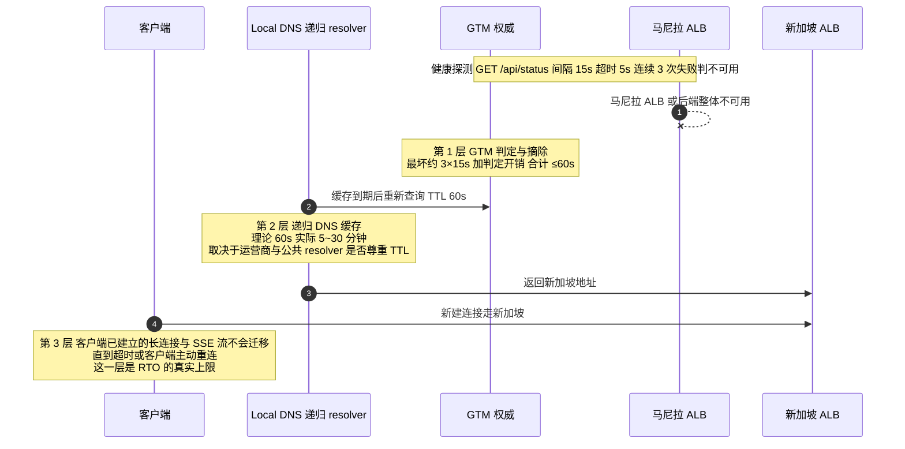

> **口径必须写进 SLA 与演练报告**：GTM 的 `Ttl=60` 只控制**第 1 层**。对外承诺"切换时间"时，用第 3 层实测值（D8 接管演练记录），不要引用"60 秒"。第 2 层不可控，靠三件事压：TTL 尽量小 + 客户端 SDK 侧连接池定期重建 + 应用层 5xx/超时后强制重新解析（而不是复用旧 IP）。这也是 §11.2 接管演练里"回切后要等稳定 15 分钟"的原因。

#### 操作步骤

1. GTM（国际站 **Standard / Ultimate** 两档，P1-19）实例 `gtm-newapi-ph`。
2. **地址池**：主池 `pool-mnl` = 马尼拉 ALB DNSName；备池 `pool-sg` **暂不加入**（备 region 未通过 M4 前不得进池）。
3. 访问策略：就近延迟（用户 → 主池），健康检查 `GET /api/status`，间隔 15s，超时 5s，连续 3 次失败判定不可用，切换 TTL 设 **60s**（`Ttl=60`，越小切换越快但 DNS 查询压力越大）。
4. 业务域名 `api.likha.com` **CNAME 到 GTM 接入域名**。

#### 验证方法

```bash
# V1 CNAME 链正确
dig +short CNAME api.likha.com @8.8.8.8 ; dig +short api.likha.com @8.8.8.8
# 期望：先 GTM 接入域名，再解析到 ALB DNS

# V2 TTL 与预期一致
dig api.likha.com +noall +answer | awk '{print $2}'    # 期望 60

# V3 健康探测在 GTM 侧全绿（控制台），并用真实探测断言
curl -sS https://api.likha.com/api/status | jq -e '.success == true and .version != ""'

# V4 故障切换（演练窗口内）
kubectl -n new-api scale deploy/new-api-stable 0     # 制造不可用
# 期望：GTM 在 ≤60s 判定异常；因备池未挂，表现为"探测告警"而非切换 —— 这一步只验"能不能发现"
kubectl -n new-api scale deploy/new-api-stable 4
```

#### 坑与注意事项

- **坑 1｜GTM 切换 ≠ 客户端立即切换。** 后果：运营商/公共 DNS 缓存 5–30 分钟，实际 RTO 由 TTL 与递归 DNS 共同决定。改进：SLA 口径写清"DNS 层切换 ≤60s，端到端受客户端缓存影响"（§12 排除项）；应用/SDK 侧支持 443 失败后按域名重解析。
- **坑 2｜健康检查用 `/api/status`，但它不反映 DB。** 后果：DB 挂了 GTM 仍判健康，不切换。改进：G8 补 `/readyz` 后**必须把探测路径换成 `/readyz`**；在此之前把"RDS 健康"作为独立告警 + 人工切换预案（§13.4）。
- **坑 3｜备池提前加入但节点是 0 副本/未 warm。** 后果：切换过去直接 5xx，比不切更糟。改进：**强制门禁**：M4 接管演练通过（§11.3）才允许备池入池。
- **坑 4｜GTM 探测源 IP 未加白名单。** 后果：探测被 WAF/CC 拦，误判不可用 → 频繁抖动切换。改进：把 GTM 探测 IP 段加入 WAF 白名单与 SG。

### 8.5 任务 46｜运维访问面（kubeconfig + RAM→RBAC + 私网端点 + 堡垒机）

#### 操作步骤

1. **API Server 私网端点优先**（§6.4 建集群时 `endpoint_public_access:false`）。已有公网端点的集群：释放 EIP 绑定，并把 ACL 收成办公/堡垒网段。
2. RAM → RBAC：ACK 控制台 **Authorization → RBAC**，把 RAM 用户/角色映射到 K8s Group：

| RAM 主体 | K8s Group | ClusterRole |
| --- | --- | --- |
| `ops-admin` | `system:masters`（限 2 人） | 管理员 |
| `devops-sa`（CI 用，仅推送镜像/apply） | `newapi-deployer` | `Role: edit`（限 `new-api` namespace） |
| `readonly` | `newapi-viewer` | `Role: view` + `ClusterRole: node-viewer` |
| `sec-audit` | `newapi-auditor` | 只读 + 可看 events/audit logstore |

3. kubeconfig 分发：**有效期 60 分钟**（`GetUserKubeConfig --TemporaryDurationMinutes 60`），禁止长期 kubeconfig 落盘。

```bash
aliyun cs DescribeClusterUserKubeconfig --ClusterId ${ACK_MNL_ID} \
  --TemporaryDurationMinutes 60 | jq -r .config > /tmp/kubeconfig-mnl
export KUBECONFIG=/tmp/kubeconfig-mnl
```

4. 堡垒机/VPN 入口 + 会话录制；`kubectl exec` 全部经堡垒机。
5. 生产变更审批：ArgoCD（或 ACK GitOps）PR 双签 + `main` 分支保护；禁止 `kubectl edit`（策略层面用 admission 拒绝 `verb=patch` from non-CI identity）。

#### 验证方法

```bash
# V1 公网端点确实不可达（从办公网外的机器）
kubectl --kubeconfig /tmp/pub.kubeconfig get ns    # 期望 timeout

# V2 RBAC 最小权限（用 readonly 身份）
kubectl --as-group newapi-viewer --as rd@likha.com -n new-api delete deploy/new-api-stable
# 期望 Forbidden
kubectl --as-group newapi-deployer --as ci@likha.com -n new-api get secrets
# 期望按策略：允许 get（部署需要）但不允许 list 全部 namespace

# V3 kubeconfig 60 分钟后失效
kubectl get ns    # 第二小时后期望 401 Unauthorized

# V4 审计闭环
aliyun actiontrail LookupEvents --StartTime ... --EventName GrantPermissions   # 能查到变更
```

#### 坑与注意事项

- **坑 1｜ACK 的 RBAC 授权与 RAM 授权是两套体系，只配一个。** 后果：RAM 给了 admin 但 K8s 里 `Forbidden`，运维为省事直接 `cluster-admin` 一把梭。改进：按上表两两映射，并出"身份-权限矩阵"作为 M5 证据。
- **坑 2｜长期 kubeconfig 进 CI。** 后果：泄露即等于集群 root。改进：CI 用 **RRSA/OIDC 联邦**拿临时凭据（`aliyun-cli` + OIDC provider），CI 里不存 kubeconfig。
- **坑 3｜堡垒机只挡 SSH 不挡 kubectl。** 改进：`kubectl` 也必须在堡垒机侧执行（VPC 内 + 私网端点），并在 §12 要求"运维访问路径图"。
- **坑 4｜`endpoint_public_access:false` 后无法从本地救火。** 后果：region 内网不可用时彻底进不去。改进：保留一条**审批制的临时公网端点开关**（Runbook §13.5），并演练一次。

### 8.6 D5 出口检查（M3）

```
☐ 三个 SG 无 0.0.0.0/0 入向非 80/443 规则（V1 反例自查输出为空）
☐ stable 4 副本跨 2 AZ、零停机滚动 5xx=0、PDB drain 演练通过、HPA 扩容触发
☐ WAF 云原生接入 + 攻击特征 403 + 回调路径不被拦
☐ GTM 主池健康、TTL 60、CNAME 链正确、备池未加入
☐ 运维访问面：私网端点、最小 RBAC、60 分钟 kubeconfig、审计可查
☐ api.likha.com 已可对外提供服务（仅主站）
```

---
## 9. 阶段 G：D6 落地（任务 25、26、27、38、40、42、48、52、54、55）

> D6 十项任务是"把安全与可观测补齐 + 让备 region 具备被接管形态"。数据线（人员B：#54 → #55 → #48 → #27）与平台线（人员A：#25 → #42 → #26 → #52 → #40 → #38 收尾）并行。

### 9.1 任务 25｜新加坡 ALB + Service/Ingress（PH 备）

配置与马尼拉同构（AlbConfig `alb-newapi-sg`，两 AZ vSwitch，`requestTimeout: 600`），差别只在：**常态不接任何公网 DNS**，只用 ALB DNSName 做内部验收。

```yaml
apiVersion: networking.k8s.io/v1
kind: Ingress
metadata:
  name: new-api-ph-standby
  namespace: new-api
  annotations:
    alb.ingress.kubernetes.io/healthcheck-path: "/api/status"
    alb.ingress.kubernetes.io/listen-ports: '[{"HTTPS":443}]'
spec:
  ingressClassName: alb
  rules:
  - host: sg-standby.internal.likha.com      # 仅用于 SNI 路由与验收，不上公网
    http:
      paths: [{path: /, pathType: Prefix, backend: {service: {name: new-api-ph-standby, port: {number: 80}}}}]
```

**验证**：

```bash
curl -sS --resolve sg-standby.internal.likha.com:443:${SG_ALB_VIP} \
  https://sg-standby.internal.likha.com/api/status | jq -e '.success'
# 主站 token 打备站业务接口（SESSION_SECRET 一致性复验，§7.4 V4）
```

**修复与坑**：
- `IngressClass is invalid` → SG 集群未装 `alb-ingress-controller` 或未建 `IngressClass alb`（与主站各自独立，两集群都要建）。
- **坑｜把备站 Ingress host 写成 `api.likha.com`。** 后果：一旦 GTM 或本地 hosts 指错，公网流量进备站，且证书/SNI 与主站混用。改进：备站 host 一律加 `.internal.` 段，并在 CI 里禁止 `api.likha.com` 出现在 SG 集群 manifest。
- **坑｜新加坡 ALB 未挂 WAF。** 后果：接管后无 L7 防护。改进：D6 同步给 SG ALB 接 WAF（云原生模式），规则从主站导出模板保持一致 —— 这也是 §1.1#6 提到"规则差异导致切换后行为不一致"的根治。

### 9.2 任务 26｜SLS / ARMS Prometheus / Grafana / 站点拨测

#### 操作步骤

1. **SLS**：Project `sls-newapi-mnl` / `sls-newapi-sg`；Logstore 划分：
 - `app-stdout`（容器标准输出，30 天）
 - `app-file`（`/app/logs/*.log`，`sys` 30 天 / `audit` 180 天，**两个 store 分开**，成本与合规口径不同）
 - `alb-access`、`waf-log`、`rds-audit`、`actiontrail`
 采集用 `logtail-ds` + `AliyunLogConfig` CRD（声明式，别在控制台手工配，无法回归）。

```yaml
apiVersion: log.alibabacloud.com/v1alpha1
kind: AliyunLogConfig
metadata: {name: new-api-app-file, namespace: kube-system}
spec:
  project: sls-newapi-mnl
  logstore: app-file
  lifeCycle: 30
  logtailConfig:
    inputType: file
    configName: new-api-app-file
    inputDetail:
      logType: json_log
      logPath: /app/logs
      filePattern: "*.log"
      dockerFile: true
      advanced: {tail_existed: true}
```

2. **ARMS Prometheus**：ACK 组件 `ack-arms-prometheus`；ServiceMonitor 现在**没有对象可抓**（`/metrics` 未注册，P1-20），先只采容器/cAdvisor 指标；G8 落地后再加：

```yaml
apiVersion: monitoring.coreos.com/v1
kind: ServiceMonitor
metadata: {name: new-api, namespace: new-api}
spec:
  selector: {matchLabels: {app: new-api}}
  endpoints: [{port: http, path: /metrics, interval: 30s}]
```

3. **Managed Grafana**：工作区**建在新加坡**（P1-11，马尼拉不可用），数据源指向马尼拉 ARMS Prometheus 的**公网/内网可读端点**；SLO 看板在 §10.8 做。
4. **CMS 站点拨测**：探测点选可用的（新加坡/东京/香港），断言 `success:true` + `version` 匹配；**因马尼拉探测点未确认，必须叠加**：ACK 内 `blackbox-exporter` 多 region 自拨 + GTM 健康探测（三重兜底，P1-13）。

#### 验证方法

```bash
# V1 日志真的进来了（不要只看 logtail 状态）
aliyun sls GetLogs --ProjectName sls-newapi-mnl --LogStoreName app-file \
  --From $(date -d '5 minutes ago' +%s) --To $(date +%s) --Query "level" --Line 3
# 期望：返回 JSON 行，且 __source__ 是 Pod IP

# V2 关键字段可检索（用于事后定位）
# 控制台 Query: request_id: "*" | select count(*)  → 非 0

# V3 Prometheus 有业务无关但必须有的系统指标
kubectl --context mnl -n arms-prom get pods
curl -s "${ARMS_PROM_ENDPOINT}/api/v1/query?query=container_memory_working_set_bytes{namespace=\"new-api\"}" | jq '.data.result|length'   # >0

# V4 三重拨测各自独立产生结果（任一失效不会误判可用）
```

#### 坑与注意事项

- **坑 1｜`logtail-ds` 采集 `/app/logs` 需要 hostPath 或 emptyDir 共享。** new-api 写文件日志到容器内路径；若 `LOG_DIR` 落在容器可写层且未挂卷，**Pod 重启即丢日志**。改进：`LOG_DIR` 挂 `emptyDir` + logtail 走容器 stdout 双路；文件日志仅作补充。
- **坑 2｜SLS 成本失控。** 后果：debug 级日志 + 180 天保留 + 全量 ALB access log，月账单可超服务器成本。改进：`ERROR_LOG_LEVEL=warn`；ALB access log 只保留 30 天 + 采样；§9.6 成本表量化。
- **坑 3｜把 Prometheus 当唯一告警源。** 集群自身故障时监控一起瞎。改进：**关键 P1 告警（站点不可用）必须走云监控站点监控/GTM 探测（外部视角）**，与集群内告警双通道。
- **坑 4｜Grafana 建在新加坡，但数据源用了马尼拉内网端点。** 后果：跨区不通、看板空白。改进：用 ARMS Prometheus 的**公网可读端点 + Token 鉴权**，或 CEN。

### 9.3 任务 27｜canary Deployment + 独立 Service/Ingress（权重 5）

```yaml
apiVersion: apps/v1
kind: Deployment
metadata: {name: new-api-canary, namespace: new-api}
spec:
  replicas: 1
  strategy: {type: RollingUpdate, rollingUpdate: {maxUnavailable: 0, maxSurge: 1}}
  selector: {matchLabels: {app: new-api, track: canary}}
  template:
    metadata: {labels: {app: new-api, project: new-api, site: ph-mnl, track: canary, env: prod}}
    spec:
      affinity:
        podAntiAffinity:
          requiredDuringSchedulingIgnoredDuringExecution:
          - {topologyKey: kubernetes.io/hostname, labelSelector: {matchLabels: {app: new-api, track: canary}}}
      containers:
      - name: new-api
        image: ${ACR_MNL_PREFIX}:<candidate-sha>
        env: [{name: NODE_TYPE, value: "slave"}, {name: CANARY, value: "true"}]
```

灰度实现（ALB Ingress 权重注解，两条 Ingress 指向同 host）：

```yaml
# stable
alb.ingress.kubernetes.io/canary: "false"
# canary
alb.ingress.kubernetes.io/canary: "true"
alb.ingress.kubernetes.io/canary-by-header: "x-canary"
alb.ingress.kubernetes.io/canary-by-header-value: "1"
```

权重推进用 `5 → 20 → 50 → 100`（**方案 J48 负荷公式**已在 v2.1 修正：canary 副本数必须能独立扛住 `权重 × 峰值 QPS`，5% 峰值 ≈ `ceil(0.05 × 峰值 / 单实例容量)`，见 §10.4 单实例容量基线）。

**验证**：

```bash
# V1 头流量强制进 canary
curl -sS -H "x-canary: 1" https://api.likha.com/api/status | jq -r .version
# V2 权重比例统计（1000 次采样，canary 版本占比 ≈5%）
for i in $(seq 1 1000); do curl -s https://api.likha.com/api/status | jq -r .version; done | sort | uniq -c
# V3 canary 异常秒级归零
kubectl -n new-api annotate ingress new-api-canary alb.ingress.kubernetes.io/canary-weight="0" --overwrite
```

**坑**：
- **坑 1｜canary 与 stable 共享同一 ConfigMap 但版本不兼容。** 后果：新代码写了新字段，旧代码读到崩溃（或反之）。改进：**灰度版本必须向后兼容一个发布周期**（expand-contract，§9.5）。
- **坑 2｜canary 只有 1 副本且无 PDB。** 后果：节点维护时灰度样本消失，观测窗口断裂；更糟的是反例："canary 全挂但没人发现，因为流量只有 5%"。改进：canary 加**独立告警**（错误率、P99），阈值按小样本放宽但绝对量兜底（如 5xx>3 就告警）。
- **坑 3｜权重靠注解热改，改完不生效。** 原因：ALB Ingress Controller 需 reconcile；或 YAML 里两条 Ingress 同名 host 冲突。改进：`kubectl get events -n new-api | grep alb`；把权重推进写进 §10.1 演练脚本。

### 9.4 任务 42｜cluster-autoscaler 与两集群节点池自动伸缩

ACK 托管版用**节点池自动伸缩（Node Autoscaling）**而非自建 cluster-autoscaler Deployment；确认开关在节点池上，且 **`max` 与 ECS 配额一致**（马尼拉 8×8=64 vCPU=配额上限；新加坡 12×8=96 需配额批复）。

**验证**：

```bash
# V1 扩容能力：制造 Pending
kubectl -n new-api scale deploy/new-api-stable 12 --dry-run=server -o json | kubectl apply -f -
kubectl get pods -l track=stable -w            # 期望 Pending → 节点数增长 → Running
kubectl get nodes -w                           # 期望 4 → 5 → ... → 8 上限
# V2 缩容不伤人（观察 10 分钟后）
kubectl get nodes -o custom-columns=NAME:.metadata.name,CREATING:.metadata.creationTimestamp
# V3 上限受配额约束（打到 8 台后不再扩，Pod 保持 Pending 且事件里有 ProvisionFailed/QuotaExceeded）
```

**修复**：Pod 一直 Pending 且无扩容 → 检查节点池 `auto_scaling.enable`、`max_size`、伸缩活动日志（ESS 控制台）、`ScaleOutBlocked`（配额或库存）。

**坑与注意事项**
- **坑 1｜HPA max 16 但节点池 max 8 台 ×（8C 可分配约 7C / 2C request ≈ 3 副本）≈ 24 副本容量 —— 看似够，但 limit 4C 时实际只塞得下 1–2 个/节点。** 后果：HPA 扩到 16 却 `Pending`，等于**扩容失败但监控显示"副本数已达标"**。改进：以 **request** 规划节点数并留 30% 余量；把 `Pod Pending 数 > 0 持续 3 分钟` 做成 P1 告警。
- **坑 2｜`PDB minAvailable: 3` 挡住缩容。** 后果：autoscaler 反复尝试驱逐失败（`PodDisruptionBudget` 阻止），伸缩活动报错刷屏。改进：缩容窗口与业务低谷一致；PDB 在低峰期允许 2（用 `minAvailable: 70%` 动态口径）。
- **坑 3｜自动伸缩出的新节点没有 nofile/数据盘调优。** 后果：只有初始 4 台是"对的"，扩容出来的机器 ulimit=1024。改进：调优必须在**节点池 User Data** 里（§7.1 Step 3），不在手工脚本里。

### 9.5 任务 54｜迁移版本化（golang-migrate）+ expand-contract 回滚验证

#### 操作步骤

1. 从当前生产 schema 导出基线：

```bash
migrate -path ./migrations -database "$DSN_MIGRATE" version
migrate create -dir ./migrations -format numbering -ext sql -seq add_baseline_marker
```

2. 约定：**所有 DDL 进 `migrations/`，应用侧 AutoMigrate 关闭**（需 G8 提供 `MIGRATE_MODE` 开关）；迁移由 **K8s Job / Argo Hook（PreSync）** 用 `newapi_migrate` 账号执行。
3. expand-contract 三段式：

| 阶段 | 内容 | 兼容性 | 何时做 |
| --- | --- | --- | --- |
| Expand | 加新列/新表（nullable 或有 default），双写 | 新旧代码都能跑 | 发布 N |
| Migrate | 回填历史数据（分批、限速、可中断续跑） | 只影响性能 | 发布 N 后 |
| Contract | 删旧列/旧约束 | 需要**只有新代码**在跑 | 发布 N+1（灰度 100% 且稳定 ≥24h） |

4. 每个 migration 必须写 `.down.sql` 且**在 staging 真跑一次**。

**验证**：

```bash
# V1 版本一致
migrate -database "$DSN_MIGRATE" -path ./migrations version          # 生产与代码库同值
# V2 回滚可用（staging 快照上）
migrate -database "$DSN_PERF" -path ./migrations down 1 && migrate -database "$DSN_PERF" -path ./migrations up
# V3 幂等：重复 up 不报错
migrate -database "$DSN_PERF" -path ./migrations up   # 期望 no change
# V4 长事务锁不阻塞业务（Expand 期间监控 pg_stat_activity wait_event）
```

**坑与注意事项**
- **坑 1｜在 `main` 上加 `NOT NULL`/加索引不带 `CONCURRENTLY`。** 后果：全表锁，`logs` 级表上分钟级不可写 → 直接破 99.95% 预算（21.6 分钟/月）。改进：PG 索引用 `CREATE INDEX CONCURRENTLY`（**不能放在事务里**，golang-migrate 需 `migrate.WithInstance(..., {MigrationsTable:...})` 且 `NoTransaction`）；MySQL 侧用 `ALGORITHM=INPLACE, LOCK=NONE`。
- **坑 2｜GORM AutoMigrate 与版本化迁移并存，互相"抢"schema。** 后果：AutoMigrate 把迁移删掉的列又加回来。改进：**一次性关闭 AutoMigrate**（只保留 master Job），并在 CI 里 grep `AutoMigrate(` 断言关闭态。
- **坑 3｜`.down.sql` 从没跑过。** 后果：真出事时回滚即二次故障。改进：staging 每周自动跑 `up → down → up` 一轮，纳入 §12 证据。
- **坑 4｜Contract 太早。** 改进：Contract PR 标题强制 `[N+1]`，评审门禁检查"当前线上是否已 100% 新代码"。

### 9.6 任务 55｜SESSION_SECRET 双密钥轮换方案与演练

目标：**轮换期间不踢任何人下线，且不出现"两个密钥都不认"的窗口**。

#### 操作步骤

1. KMS 里建两个版本位：`SESSION_SECRET`（当前有效）、`SESSION_SECRET_OLD`（轮换窗口内的旧值）。
2. 代码能力要求（G8）：验签时**先试主密钥，失败再试 `_OLD`**；签发只用主密钥。若当前代码不支持（本仓库现在只读单个 `SESSION_SECRET`，`common/init.go:50-55`），则**先用下面的"重叠窗口"运维方案**：

**图 11｜SESSION_SECRET 双密钥轮换时间线（T0–T6）**

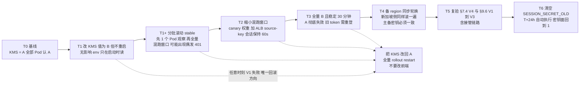

> 时间线上只有 **T6 是不可逆点**（清掉 `_OLD` 之后旧 token 无法救回）。T0–T5 全部可回滚，且回滚方向唯一：**改回 KMS + 重启 Pod**。滚动期间出现"偶发 401"是预期现象（Pod 混跑 A/B），不是故障——但必须在变更窗口内并挂公告，否则会被当成登录 Bug 立案。

**文本速查版**

```
T0   SESSION_SECRET  = A                     （全员在用 A）
T1   把 KMS 值改为 B，但先不重启（无影响：env 只在启动读）
T1+  分批滚动 stable：先 1 个 Pod → 观察 → 全量
     ⚠ 滚动期间 A/B Pod 混跑，同一用户可能命中不同 Pod → 出现"偶发 401"
T2   用 canary 权重 + 会话粘滞（ALB source-key 会话保持 60s）缩小混跑窗口
T3   全量 B 且稳定 30 分钟后，A 彻底失效（旧 token 需要重登）
```

3. **强烈建议实现真双密钥**（推荐落地形态，写入 G8 需求）：

```go
secrets := []string{os.Getenv("SESSION_SECRET"), os.Getenv("SESSION_SECRET_OLD")}
// 签发用 secrets[0]；校验按顺序尝试非空项
```

#### 验证方法

```bash
# V1 重叠窗口：旧 token 在滚动后仍可用
curl -sS -H "Authorization: Bearer $OLD_TOKEN" https://api.likha.com/api/user/self | jq -e '.success'   # 期望 true
# V2 新签发 token 立即可用且被两 Pod 都认
# V3 轮转后 KMS 旧版本不可读（防止误恢复）
aliyun kms GetSecretValue --SecretName aone/newapi/prod/SESSION_SECRET --VersionId <old>   # 期望报错或按策略拒绝
# V4 审计：轮换动作在 ActionTrail 有记录，且变更单号可关联
```

**修复**：V1 失败 → 说明代码不支持双密钥或 Pod 未全部滚动；立即把 KMS 值改回 A 并全量 `rollout restart`（回滚方向唯一，**不要试图改前端**）。

#### 坑与注意事项

- **坑 1｜主备两 region 不同时轮换。** 后果：接管瞬间全员掉线（比 §6.2 坑 3 更隐蔽，因为平时看不出来）。改进：**轮换 SOP = 主站滚完 + 备站滚完 + 复验 §7.4 V4**，三步都在一个变更单里；§11.3 接管演练必须包含"刚轮换完"这一状态。
- **坑 2｜把 `_OLD` 长期留着。** 后果：密钥面翻倍，泄露概率上升。改进：轮换 SOP 里第 4 步"清空 `_OLD`"，T+24h 自动执行。
- **坑 3｜轮换时改成了空值或 `random_string`。** 后果：`log.Fatal` 全站起不来（`common/init.go:50-55`）。改进：KMS 写入前做长度/字符集校验（≥32 随机字节），CI 加 lint。
- **坑 4｜顺带把 `SYNC_FREQUENCY` 一起改。** 后果：一次变更两件事，出问题难归因。改进：**一个变更单只做一件事**。

### 9.7 任务 48｜支付回调源 IP 白名单 + 签名校验验证

1. 取支付渠道官方回调 IP 段（Epay/Stripe/PayPal/支付宝国际…，多数**公布在文档且会变**），落成 ConfigMap + 定时同步任务。
2. WAF 精确路径豁免（§8.3 坑 3）+ 应用侧 IP 白名单 + 签名校验三层。
3. 应用侧白名单配置示例：

```yaml
data:
  NOTIFY_IP_ALLOWLIST: "3.33.3.3/32,52.10.1.0/24"   # 从渠道文档同步，禁止 0.0.0.0/0
```

**验证**：

```bash
# V1 合法源 + 合法签名 → 200 且入账
# V2 合法源 + 错签名 → 4xx 且不入账（查 orders 无新记录）
psql "$DSN_MIGRATE" -c "select id,status from orders where out_trade_no='TEST'"   # 期望 status 未变
# V3 非法源 + 合法签名 → 拒绝（IP 层挡）
# V4 无签名 → 拒绝
# V5 WAF 不拦回调（真实渠道沙箱跑一次全链路）
```

**坑与注意事项**
- **坑 1｜只看 `X-Forwarded-For` 第一跳取客户端 IP。** 后果：攻击者伪造头即可绕过 IP 白名单 → **伪造回调完成支付**，属资金级漏洞。改进：ALB/WAF 场景用**可信跳数**取 IP（`X-Forwarded-For` 从右往左取第 N 个，N=可信代理数）；或在 ALB 层注入 `X-Real-IP`，应用只信它。
- **坑 2｜回调白名单忘了随渠道 IP 变更同步。** 后果：某天开始支付全量失败（表现是"用户说扣款成功但没到账"）。改进：渠道 IP 段做成**定时任务同步 + 变更告警**；并在 §10.8 加"回调 4xx 比例"告警。
- **坑 3｜幂等只做在应用层（内存 map）。** 多副本下不成立。改进：**DB 唯一约束**（`out_trade_no` unique）+ `INSERT ... ON CONFLICT DO NOTHING`，重试安全。
- **坑 4｜回调处理里同步调用上游模型补发额度。** 后果：上游慢 → 渠道超时重投 → 重复入账放大。改进：回调只做"记账 + 入队"，发放异步。

### 9.8 任务 40｜证书正式部署到 ALB / WAF / DCDN + SNI 校验

（对应 v2.1 修正的时序问题：证书必须在 ALB/WAF 创建之后部署，D6 执行。）

```bash
# 从 CAS 取证书 ID 并确认覆盖域名
aliyun cas DescribeUserCertificateDetail --CertId ${CERT_ID} | jq -r '.CommonName, .Sans'
# 期望 Sans 含 api.likha.com, ops.likha.com, *.likha.com

# 部署到 ALB listener（AlbConfig 里声明式管理，见 §6.3；不要控制台手工挂）
# WAF / DCDN 侧在各自控制台或 OpenAPI 绑定同一 CertId
```

**验证**：

```bash
# V1 SNI 正确（同 IP 多域名场景）
echo | openssl s_client -connect ${ALB_VIP}:443 -servername api.likha.com 2>/dev/null | openssl x509 -noout -dates -subject
echo | openssl s_client -connect ${ALB_VIP}:443 -servername nonexistent.likha.com 2>&1 | grep -Ei "alert|error"
# V2 证书链完整（Android/老客户端友好）
curl -sSIv https://api.likha.com/api/status 2>&1 | grep -E "SSL certificate|issuer"
nmap --script ssl-enum-ciphers -p 443 api.likha.com | tail -20    # 期望 grade A，无 SHA1/弱套件
# V3 到期与自动续期
aliyun cas DescribeUserCertificateList --ShowSize 50 | jq -r '.CertificateList[] | [.Name,.Fingerprint,.AfterDate] | @tsv'
# 期望 AfterDate ≥ 今天 + 25 天；<30 天触发告警（P0-7：最长约 199/200 天）
```

**坑**：
- **坑 1｜只换 CAS 证书，没同步 AlbConfig。** 后果：ALB 继续用旧证书，到期日全站 HTTPS 报错。改进：**证书部署纳入 GitOps**（CertManager + `cert-manager-alibabacloud-dns01-webhook`，或 ACM/KMS → 外部同步 Job 调 `UpdateListenerAttribute`）；到期告警必须打到 §10.8 值班通道。
- **坑 2｜通配符不覆盖多级。** `*.likha.com` **不覆盖** `a.b.likha.com`。若将来用 `cdn.api.likha.com` 会握手失败。改进：域名规划统一二级。
- **坑 3｜国际站没有免费 DV（P0-7）**，别按国内站经验"等免费证书签发"。改进：付费 DigiCert/GlobalSign 通配符 + 托管自动续期，预算入 §9.9。
- **坑 4｜证书私钥落盘在本地。** 改进：私钥只在 CAS/KMS；导出仅限轮换窗口并即时销毁（安全核查 #38 会查）。

### 9.9 任务 52｜带宽与规格量化 + 成本量化表

#### 操作步骤

1. 带宽估算（impl_deploy.md 8.5：流式网关硬瓶颈）。以 1,000 并发 SSE 为口径：

| 项 | 估算式 | 取值 |
| --- | --- | --- |
| 单路下行稳态 | 30 tokens/s × ~4 B/token ≈ 120 B/s + SSE 头开销 ≈ 0.3–0.5 KB/s | 0.5 KB/s |
| 1,000 并发 | 0.5 KB/s × 1000 ≈ 0.5 MB/s ≈ **4 Mbps** | 保守按 **40 Mbps**（含请求上行、图片/base64、突发） |
| NAT 网关 | ≥ 200 Mbps | 需提工单确认默认上限 |
| 单 EIP 峰值 | ≥ 100 Mbps（共享带宽包） | 用 **CDT/共享带宽包** 统一计费 |
| ALB | LCU 上限按峰值连接数 + 新建连接数 + 处理数据量三取最大 | 1,000 并发 + 峰值 500 CPS ≈ 3–4 LCU，留 10× 余量 |

2. 成本量化表（月度，国际站美元计价，全部**必须**填实际购买页价格）：

| 资源 | 规格 | 数量 | 单价 | 月成本 | 弹性敏感度 |
| --- | --- | --- | --- | --- | --- |
| ECS 马尼拉 | g8i.2xlarge | 4–8 | 【核实】 | | 高（HPA 直接放大） |
| ECS 新加坡 | g8i.2xlarge | 2–12 | | | **极高**（接管时 6×） |
| RDS PG | 16C64G HA | 1 | | | 低 |
| Tair | 4GB 主备 | 2 | | | 低 |
| ClickHouse | 见 §4.5 选定方案 | 1 | | | 中（跨区流量另计） |
| 跨区公网（SG→MNL RDS） | 出方向 GB | 估 | | | **常被忽略**：接管后所有 SQL 走公网 |
| NAT + 共享带宽 | 200 Mbps | 2 | | | 高（流式出站） |
| ALB | LCU | 2 | | | 中 |
| WAF 企业版 + 请求数 | | 2 | | | 中 |
| DCDN | 流量 GB | | | | 高（前端资源） |
| SLS | 写入 GB + 存储 | | | | **高**（日志级别一改就爆） |
| OSS | 标准+低频+归档+跨区复制 | | | | 低 |
| GTM Ultimate / DNS 付费版 | | 1 | | | 低 |
| Managed Grafana（新加坡） | | 1 | | | 低 |
| 证书 | 通配符 ×2/年 | | | | 低但必须记 |

3. 成本看板（任务 39 马尼拉清单 #39）：标签 `site/project/env` 全量打，预算告警 80%，月度 review。

**验证**：`aliyun bssopenapi QueryBill` 能按 tag 聚合出上表；压测后 NAT 流量曲线与估算偏差 <50%。

**坑**：
- **坑 1｜低估跨区流量。** 接管后**全部** SQL 走马尼拉 RDS 公网，读写双向 GB 级。改进：压测时实测 `pg_stat_activity` + NAT 出流量，算出接管后的单位时间费用，写进 SLA 成本附注。
- **坑 2｜按量 + 无预算告警。** 后果：一次 CC 攻击把 DCDN/WAF 请求数打到天价。改进：预算 80% 告警 + WAF 频控 + 账单"异常突增"日巡检（移交运维项 §11.6）。

### 9.10 任务 38｜上线前安全核查（OWASP / 白名单 / 密钥 / 审计）

#### 核查清单（每项要留证据，不通过不得进 D8 上线）

| # | 项 | 方法 | 通过标准 |
| --- | --- | --- | --- |
| 1 | 无硬编码密钥 | `git log -p --all \| grep -Eic "LTAI[0-9A-Za-z]{16}\|BEGIN .*PRIVATE KEY"`；`trufflehog/gitleaks` 扫全仓 | 0 命中；历史命中已做**密钥轮换 + BFG 清洗** |
| 2 | 依赖漏洞 | 镜像扫描（ACR 企业版）+ `govulncheck ./...` + `npm audit --omit=dev` | Critical=0；High 有豁免单 |
| 3 | Secret 权限边界 | `kubectl auth can-i --as-group newapi-viewer get secrets -n new-api` | 拒绝 |
| 4 | 容器逃逸面 | Pod `runAsNonRoot`、`readOnlyRootFilesystem`、`capabilities.drop:[ALL]`、禁 `privileged` | 全部满足（new-api 需要写 `/app/logs` → 用 emptyDir 挂写路径） |
| 5 | 传输加密 | 全站 HTTPS + HSTS（`max-age=31536000; includeSubDomains`）+ TLS1.2+ | nmap grade A |
| 6 | SQL 注入面 | GORM 参数化；grep `Raw(`/`Exec(` 的拼接 | 无拼接；ClickHouse 查询同样参数化 |
| 7 | 越权 | 水平越权（`/api/user/:id` 类）、垂直越权（普通号访问 admin）用例各 ≥10 条 | 全部 403/404 |
| 8 | 认证与令牌 | 密码 bcrypt/argon2 成本、`access_token` 熵、登录限速、会话固定 | 复核 §6.2 SESSION_SECRET 与登录限流 |
| 9 | 回调伪造 | §9.7 V1–V4 | 4/4 通过 |
| 10 | 审计链路 | ActionTrail 投递 OSS/SLS 且 ≥180 天可查（P1-17） | 查得到 90 天前的事件 |
| 11 | 备份加密与访问 | RDS/OSS 服务端加密开启；OSS bucket 禁公共读 | `aliyun oss stat oss://bucket \| grep -i "ACL.*private"` |
| 12 | 日志脱敏 | 抽查 SLS：不得出现完整 token/API Key/密码 | 脱敏规则生效（`redact`） |
| 13 | CORS | `Access-Control-Allow-Origin` 白名单，禁止 `*` + credentials | 实测响应头 |
| 14 | 镜像签名/来源 | ACR 企业版 + 仅允许内网 VPC 域名拉取 + 禁 `latest` | 部署 manifest 全 SHA |
| 15 | 供应链 | CI 依赖锁文件、构建脚本来源固定 | `go.sum`/`bun.lock` 入仓且不跳过校验 |

**验证与修复**：任何一项不通过 → **不签 M3 完成**，按上表"通过标准"回改；豁免必须写明风险接受人 + 到期复审日。

**坑与注意事项**
- **坑 1｜安全核查排在压测之后。** 后果：改配置引发回归，工期塌。改进：D6 做，D7/D8 只复验增量。
- **坑 2｜只看控制台开关，不看实际行为。** 例：声明"禁公共读"但某个对象被单独设为公共读。改进：**逐 bucket `stat` + 抽样对象 HEAD**。
- **坑 3｜`runAsNonRoot` 与 new-api 镜像默认用户冲突。** 后果：Pod 起不来或 `/data` 权限拒绝。改进：Dockerfile 里 `chown` 数据目录 + `USER 10001`；灰度先在一副本验证。
- **坑 4｜密钥扫描只扫 HEAD。** 后果：历史 commit 里的 AK 仍在，被人 clone 就走。改进：扫 `--all`，命中即**轮换 AK**（轮换才是修复，删历史不是）。

### 9.11 D6 出口检查

```
☐ 备站 ALB + WAF + Ingress 就绪，内部域名可验收（未上公网 DNS）
☐ SLS/Prometheus/Grafana（新加坡工作区）+ 三重拨测产出数据
☐ canary 单副本可路由，权重推进与秒级归零实测通过
☐ 节点池自动伸缩：扩容到 8 台上限受配额约束且无 Pending 卡死
☐ 迁移版本化：up/down/up 在 perf 库跑通，AutoMigrate 已声明关闭计划
☐ SESSION_SECRET 双密钥/重叠窗口演练完成，主备同步轮换 SOP 定稿
☐ 支付回调三层校验 V1–V4 全通过
☐ 证书已部署 + SNI 校验 + 链完整 + 到期 ≥25 天 + 自动续期任务在
☐ 成本量化表填完实际单价，预算告警生效
☐ 安全核查 15 项：通过或有签字豁免单
```

---

## 10. 阶段 H：D7 落地（任务 30、31、32、37、43、44、47、53）

> D7 = **演练日**。八件事里六件是"把故障造出来再恢复"，必须在维护窗口 + 双人复核下做。顺序：#30（链路）→ #43/#44（容量）→ #53（一致性）→ #31（灰度）→ #37（DB 故障）→ #32（看板告警收口）。

### 10.1 任务 30｜备 region → 马尼拉 RDS 公网读写打通与 RTT 实测

#### 操作步骤与测量

```bash
# 从新加坡 Pod 内测「建连 + 一次查询」总耗时（各 50 次，含 TLS 握手）
kubectl --context sg exec deploy/new-api-ph-standby -- sh -c '
i=0
while [ $i -lt 50 ]; do
  t0=$(date +%s%N)
  psql "$SQL_DSN" -Atc "select 1" >/dev/null 2>&1
  t1=$(date +%s%N)
  echo $(( (t1 - t0) / 1000000 ))
  i=$((i+1))
done' | sort -n | awk '{a[NR]=$1} END{print "min="a[1]" p50="a[int(NR*0.5)]" p95="a[int(NR*0.95)]" max="a[NR]" (ms)"}'
# 更贴近真实：pgbench 单连接与 16 连接各跑 30s
kubectl --context sg exec deploy/new-api-ph-standby -- sh -c 'pgbench -n -N -c 1  -T 30 "$SQL_DSN"'
kubectl --context sg exec deploy/new-api-ph-standby -- sh -c 'pgbench -n -N -c 16 -T 30 "$SQL_DSN"'
```

同时测网络层 RTT：

```bash
kubectl --context sg run rtt --image=nicolaka/netshoot --rm -it --restart=Never -- \
  ping -c 20 ${RDS_MNL_PUB}         # ICMP 可能被过滤，通不通都要记录
traceroute ${RDS_MNL_PUB}
```

**判据（本指南给的口径，方案未量化）**：

| 指标 | 期望 | 不达标影响 |
| --- | --- | --- |
| TCP RTT（SG→MNL RDS） | ≤ 45 ms | 每个 SQL 往返一次，直接叠加到 P99 |
| `pgbench` 单连接 TPS | ≥ 20 | 低于此说明链路或 SSL 握手开销异常 |
| TLS 握手成功率 | 100% | 有失败即白名单/证书问题 |
| 建连平均耗时（含 TLS） | ≤ 200 ms | 决定连接池 `default_pool_size` 是否够 |

#### 验证方法

```bash
# V1 读写真的落在马尼拉主库（而不是本地某库）
kubectl --context sg exec deploy/new-api-ph-standby -- sh -c \
  'psql "$SQL_DSN" -Atc "select inet_server_addr(), current_database(), version()"'
# 与主站内网查询结果比对：同 address（或同一实例）、同 db

# V2 数据一致性：主站写一条标记，备站立即读到（无复制延迟）
psql "$DSN_MIGRATE" -c "insert into ops_drill_marker(note) values ('from-mnl')"
kubectl --context sg exec deploy/new-api-ph-standby -- sh -c \
  "psql \"\$SQL_DSN\" -Atc \"select note,ts from ops_drill_marker order by id desc limit 1\""   # 期望 from-mnl

# V3 连接数在预算内
psql "$DSN_MIGRATE" -c "select usename,state,count(*) from pg_stat_activity group by 1,2 order by 3 desc"
# newapi_sg 总数 ≤ 150 × 备站实际副本数，且 ≤ 预算 I-2

# V4 链路抖动时的应用行为（拔线测试）
# 临时把白名单里一个 EIP 移除 → 观察是否有请求超时/5xx 上升，恢复后是否自愈
```

#### 坑与注意事项

- **坑 1｜把"延迟可接受"当成"SLA 成立"。** 常态不走备站所以没问题，但**接管后 100% 请求跨区**，P99 会从 ~200ms 变成 ~400ms+，且每条 SQL 一次 RTT 往返 → 一次业务请求 3–5 条 SQL 就是 150–250ms 纯网络。改进：① §12 SLA 口径**书面区分**"主站延迟"与"接管后延迟"；② 应用侧减少同步 SQL 次数（G8：热配置走 Redis、额度写回批量化）；③ 接管前 `pgbench` 复测并留证据。
- **坑 2｜RTT 测了但没测"TLS + 连接建立"总成本。** 后果：接管瞬间连接池冷启动，前 30 秒全部超时。改进：预热（§11.4）+ `default_pool_size` 调大 + 池预热脚本随 Deployment `initContainer` 跑。
- **坑 3｜白名单只有 4 个 EIP 但 SNAT 表项按 vSwitch 粒度。** 后果：新加坡扩容出新 vSwitch/新节点时用未登记 IP 出口 → 偶发连不上。改进：白名单按 **NAT 网关 SNAT 条目**核对（`DescribeSnatTableEntries`），并保证所有节点在登记 vSwitch 内。
- **坑 4｜DNS 解析出的 RDS 公网 IP 变更，但应用侧连接池长期不重建。** 后果：主备切换/实例迁移后仍连旧 IP，`Connection refused` 且不自愈。改进：GORM `ConnMaxLifetime` 设 ≤ 5min（**必查**：若代码未设，作为 G8 需求）；PgBouncer `server_lifetime` 同理。

### 10.2 任务 43｜主站 HPA 4–16 落地 + 探针与单实例容量基线

#### 操作步骤

1. 单实例容量基线（这是所有容量推导的地基，**必须在 D7 实测而不是估算**）：

```bash
# 逐步加压找拐点：并发 SSE 数 vs 错误率/延迟/资源
hey -z 120s -q <rate> -c <conc> -m POST -H "Content-Type: application/json" \
  -D /tmp/req.json https://api.likha.com/v1/chat/completions
```

记录拐点表（**用 perf 环境，同规格 2C4G request / 4C8G limit**）：

| 并发 SSE | 单副本 CPU p50 | 内存 | FD | p95 首字延迟 | 5xx | 判定 |
| --- | --- | --- | --- | --- | --- | --- |
| 100 | | | | | | |
| 250 | | | | | | |
| 500 | | | | | | |
| 800 | | | | | | 先出现 throttle |
| 1200 | | | | | | 拐点候选 |

→ 取"p95 仍满足 SLO 且 5xx<0.1%"的最大并发 = **单实例容量 C**。峰值 1,500 并发 ⇒ 需要 `ceil(1500 / C)` 副本，必须 ≤ HPA max 16；否则要么提升单实例规格/优化，要么申请把 max 提到 24（配额联动 §3.4）。

2. HPA 除 CPU 外加自定义指标（并发 SSE 连接数 / 队列深度），需 G8 的 `/metrics`；未落地前**只靠 CPU 会明显滞后**（SSE 是 IO 密集，CPU 很低但连接已满）→ 这是坑 1。

**验证**：

```bash
kubectl -n new-api describe hpa hpa-new-api-stable          # 无 FailedGetResourceMetric
# 压测驱动扩容并观察端到端
watch -n2 'kubectl -n new-api get hpa,pods -l track=stable --no-headers | head'
# 期望：CPU 过 65% → 4→6→9→13→16 阶梯，无 Pending；压测 5xx 不升高
# 缩容：撤压后 5 分钟稳定窗内回落，且不低于 min 4
kubectl -n new-api get pdb -o wide                          # 缩容期间 ALLOWED DISRUPTIONS ≥1
```

**修复**：扩到 16 但 Pod Pending → §9.4 坑 1（节点池 max 8 不够）；HPA 不动 → metrics-server 缺失 / `scaleTargetRef` 名错 / 被 `kubectl scale` 手工设过 replicas 后短期锁住（看 `behavior` 事件）。

**坑与注意事项**
- **坑 1｜SSE 场景 CPU 是坏指标。** 后果：连接打满、内存/FD 上升而 CPU 30%，HPA 完全不扩 → 用户超时。**这是本方案容量层最大的风险。** 改进：① G8 暴露 `new_api_active_sse_connections`；② 过渡期用 **内存利用率 HPA**（60–70% of request）或外部指标适配器；③ 保底：把 `maxReplicas` 与节点池容量匹配并做**手动扩容 Runbook**（§13.6）。
- **坑 2｜`/api/status` 作 liveness 在 DB 故障时误杀 Pod。** 改进：§7.4 坑 3 + G8 `/healthz`；预案 §13.2。
- **坑 3｜request≠limit 且内存超卖。** 后果：节点 OOMKill 随机挑 Pod，出现"偶发重启"谜案。改进：内存 request=limit（Guaranteed），CPU 可 burstable。

### 10.3 任务 44｜备 region HPA 2–24 + 1.5× 接管容量验证

HPA（`min:2, max:24`）+ 节点池 `min:2, max:12`（12×8C ⇒ 96 vCPU；按 request 2C/副本理论 12×3=36 副本 ≥ 24，但**要扣系统预留与 PDB 窗口**，实测口径见坑 1）。

接管前必须按 **扩容 → Ready → 再切流** 顺序，绝不能"先切流再等扩容"。

```bash
# 验证扩容上限（演练窗口，在切流之前）
kubectl --context sg -n new-api patch hpa hpa-new-api-ph-standby --type=merge \
  -p '{"spec":{"minReplicas":24}}'
kubectl --context sg -n new-api wait --for=condition=available deploy/new-api-ph-standby --timeout=15m
kubectl --context sg get nodes
# 记录：从 min=2 抬到 24 的总耗时 = 接管前的 warmup 时长（这是 RTO 的关键组成）
kubectl --context sg -n new-api patch hpa hpa-new-api-ph-standby --type=merge -p '{"spec":{"minReplicas":2}}'
```

**验证判据**：

| 检查 | 通过标准 |
| --- | --- |
| 副本可达 24 | 全部 Running & Ready |
| 抬升到全 Ready 耗时 | ≤ 6 分钟（>10 分钟则 RTO 承诺需重谈） |
| 备站 24 副本 × 实测单实例容量 C | ≥ **1.5 × 主站峰值并发** |
| 抬升期间主站无影响 | 主站无 5xx 上升 |

**坑与注意事项**
- **坑 1｜按 vCPU 算容量，忽略内存与 FD。** 24 副本 × 4Gi limit = 96Gi；12 节点 × 32Gi = 384Gi（够），但马尼拉/新加坡节点池 `max 12` 若机型内存不同就不足。改进：以**实测 C** 与**四项资源维度（cpu/mem/fd/上游配额）取最紧**做判据。
- **坑 2｜新加坡 96 vCPU 配额没批复就演练。** 后果：打到一半 `QuotaExceeded`，伸缩活动失败，M4 判不过，还留下一堆半起节点。改进：§3.4 出口硬门禁；演练前跑 `DescribeAccountAttributes` 复核。
- **坑 3｜扩容完成但连接池/缓存是冷的。** 24 副本一起向跨区主库发起 300 连接 → 打爆（§10.1）。改进：**先扩容量、再做 §11.4 Tair/DB warmup、最后切流**三步顺序写死进 Runbook。
- **坑 4｜`cluster-autoscaler` 与 HPA 同时存在但 `scale-down` 打架。** 改进：节点池缩容冷却 ≥ 10min；接管演练期间临时关闭缩容（`kubectl annotate` 节点池/设置 `--scale-down-enabled`）。

### 10.4 任务 47｜ALB 安全组源收敛 + SNI 域名校验（复验 §8.1 结论）

- 若走 **WAF 云原生接入（推荐）**：ALB 入向**保持** `0.0.0.0/0:443`，把结论**书面记录**（为什么没按方案原文收敛），并补三条缓解：WAF 策略 + CC 阈值 + `alb-access` SLS 审计。
- 若走 **DCDN 回源**：用 `aliyun dcdn DescribeDcdnL2Ips` 取回源段并同步进 SG；**每日定时任务比对差异并告警**（网段会变）。
- SNI/域名校验：ALB 层确认未匹配 host 的请求返回 404/421 而不是命中默认后端（否则任何打 ALB IP 的 Host 头都能进业务 —— 跨租户串数据风险）。

```bash
# 反例验证：伪造 Host 不应命中 stable
curl -sSk -o /dev/null -w "%{http_code}\n" --resolve evil.com:443:${ALB_VIP} https://evil.com/api/status
# 期望 404/421，绝不能 200
```

### 10.5 任务 53｜配置热更新跨节点收敛验证（`SYNC_FREQUENCY=30`）

new-api 通过 DB + Redis/定时同步在多副本间收敛配置（渠道、模型、费率）。代码默认 `SYNC_FREQUENCY=60`（`common/init.go:110`），方案要求 30。

```bash
# 操作：在 admin 后台改一个可观测配置（如某渠道名称/权重/倍率）
# 断言：所有副本（含 canary、含新加坡备站）在 ≤ SYNC_FREQUENCY 内读到新值
for p in $(kubectl -n new-api get pods -l app=new-api -o name); do
  echo -n "$p : "; kubectl -n new-api exec ${p#pod/} -- sh -c \
    'wget -qO- "http://localhost:3000/api/status" | head -c 200' ; echo
done
```

更硬的验证：改**渠道状态**（禁用某渠道）后，连续打该渠道 100 次，统计仍被路由到的比例随时间下降曲线。

**验收**：30s 后各副本一致；60s 后新加坡备站一致。

**坑**：
- **坑 1｜`MEMORY_CACHE_ENABLED=true` 时收敛不依赖 Redis，Pod 各自为政。** 改进：prod 恒 false（§6.2 坑 2）；这条要在 §12 里作为**架构证据**。
- **坑 2｜Redis 里存的配置版本号与实际内容不一致（写成功、缓存未失效）。** 后果：部分副本永远读到旧渠道配置，"改价不生效"这类投诉。改进：验证里必须包含"改价 → 计费结果变化"的端到端断言，而不只是看 `/api/status`。
- **坑 3｜把 SYNC_FREQUENCY 改成 5s 想"更快收敛"。** 后果：每副本每 5s 全量拉配置，DB QPS ×副本数放大，HPA 扩容后打爆 DB。改进：不要低于 15s；扩容后重测 DB QPS。

### 10.6 任务 31｜灰度发布演练（5→20→50→100 与回滚）

**图 12｜灰度状态机与两道守护闸**

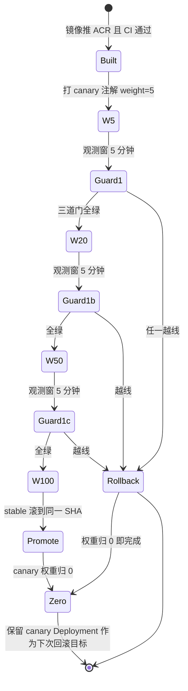

**GUARD1（每档都要过，任一失败立即 Rollback）**

| 门 | 指标 | 阈值 | 数据来源 |
| --- | --- | --- | --- |
| G1-a | canary 5xx 率 | 不高于 stable 的 1.2 倍且绝对值 < 0.5% | ALB access log + Prometheus |
| G1-b | P95 首字延迟 | 不高于 stable P95 + 15% | 网关指标（需 G8 的 `/metrics`） |
| G1-c | 额度扣减对账差异 | **必须为 0** | 主库 `logs` 与 `users.quota` 对账 SQL |

**GUARD2（只作用于 Promote，不作用于 W5/W20/W50）**

| 门 | 条件 |
| --- | --- |
| G2-a | 本次变更含 DB 迁移时，必须处于 **Expand 阶段**（Contract 一律禁止与灰度同批） |
| G2-b | `.down.sql` 在 staging 已跑通 `up → down → up` |
| G2-c | `SESSION_SECRET` 与镜像 SHA 无冲突（不同时改） |

> **为什么"权重归 0"就是回滚**：canary 与 stable 是两个 Deployment，回滚只动 Ingress 注解，秒级生效、无需重新调度 Pod。所以**永远不要为了回滚去删 canary Deployment**——删了下次就没有"始终有回滚目标"这条不变量了。

#### 演练脚本（必须双人，一人操作一人核对指标）

```bash
REL=${GIT_SHA_CANDIDATE}
for W in 5 20 50 100; do
  kubectl -n new-api annotate ingress new-api-canary \
    alb.ingress.kubernetes.io/canary-weight="${W}" --overwrite
  sleep 300                                   # 每档观测窗 5 分钟
  echo "== weight ${W}% =="
  kubectl -n new-api get pods -l track=canary
  # 人工核对看板：canary 5xx 率、P95 首字延迟、额度扣减对账差异、DB 慢查询
  # 任一越线 → 立刻回滚：权重 0
done
# 100% 后把 stable 滚到新 SHA（先 stable，再删 canary），保持"始终有回滚目标"
kubectl -n new-api set image deploy/new-api-stable new-api=${ACR_MNL_PREFIX}:${REL}
kubectl -n new-api rollout status deploy/new-api-stable --timeout=15m
kubectl -n new-api annotate ingress new-api-canary alb.ingress.kubernetes.io/canary-weight="0" --overwrite
```

**通过标准**：

| 档 | 观测 | 通过线 |
| --- | --- | --- |
| 5% | canary 5xx 率 | ≤ 主站基线 + 0.05pp |
| 20% | P95 首字延迟 | ≤ SLO（如 800ms） |
| 50% | DB 连接数、CPU throttle | 无异常阶跃 |
| 100% | 额度/计费对账 | 与稳定版差异 0 |
| 回滚 | 权重归 0 生效时间 | ≤ 30s，且无残余错误 |

**坑与注意事项**
- **坑 1｜100% 时 stable 还停留在旧版（canary 长期当主跑）。** 后果：容量按 1 副本扛全量，下次故障无从回滚。改进：SOP 强制"100% → 滚 stable → 归零 canary"三连，缺一步视为发布未完成。
- **坑 2｜回滚只回镜像不回配置。** 后果：ConfigMap 里新参数被旧代码读到（或反之）。改进：**版本 = 镜像 SHA + ConfigMap checksum**，回滚一起回；GitOps 回退一个 commit。
- **坑 3｜灰度期间发生 AutoMigrate。** 如果候选版本带 schema 变更且 master 提前迁了，stable（旧码）可能不认新列。改进：严格 expand-contract（§9.5），**灰度阶段的迁移只能是 Expand**。
- **坑 4｜观测窗没有基线对比。** 后果：看不出变差。改进：每档记录同长度基线（前一天同时段）数字，写进 §12 证据。

### 10.7 任务 37｜主库故障切换演练（RDS HA + 应用重连 + 额度对账）

**图 13｜主备切换期间各层的时间点期望**

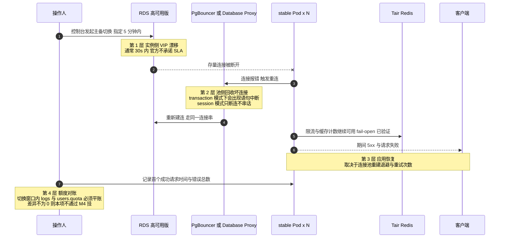

| 层次 | 记录什么 | 期望值（演练前据实测回填） |
| --- | --- | --- |
| 实例漂移 | 切换发起 → 新主可写 | ≤ 30s |
| 连接恢复 | 首个错误 → 首个成功查询 | ≤ 15s（退避上限决定） |
| 用户可见 | 5xx 持续时间与占比 | 持续 ≤ 45s，占比 < 0.1% |
| 数据正确 | 窗口内额度对账差异 | **必须 = 0** |

> 三条铁律：① **连接池必须开重连**，`RetryTimes` 与非零退避都要显式配，否则 Pod 会一直持有死连接直到被重启；② **PgBouncer 的 `query_wait_timeout=120` 要大于漂移时间**，否则切换期间堆积的等待会一次性超时打爆应用；③ **Redis 侧不能 fail-close**——主库切换不是限流挂掉的借口，若因 Redis 判定失败返回全站 429，会把一次 30 秒的数据库演练放大成整站不可用（见 G8 / §7.4 的 fail-open 要求）。

#### 操作步骤

1. 通知窗口，冻结发布（§11.2）。
2. 控制台 **RDS → 实例 → 服务可用性 → 主备切换**（指定 5 分钟内），同时开始打流量：

```bash
hey -z 900s -c 100 -m GET https://api.likha.com/api/status &
```

3. 观察并记录：
 - 切换起止时间（RDS 事件）、DNS/CNAME 是否变（高可用版地址不变，仅 VIP 漂移）
 - 应用侧错误窗口（`server closed the connection unexpectedly` / `FATAL: terminating connection`）
 - 自动重连耗时（GORM + `database/sql` 会重建连接，但**已有事务失败**）
 - 额度/日志是否出现重复扣费或漏扣

#### 验证判据

| 指标 | 通过标准 |
| --- | --- |
| 主备切换总耗时 | ≤ 30s（官方口径通常 <30s，实测为准） |
| 应用 5xx 窗口 | ≤ 60s；且**全部自愈**，无人工介入 |
| 切换后数据一致 | `select max(id)`、余额对账无差异 |
| 无脑裂双写 | 新主库 `pg_is_in_recovery()=f`，旧主变备 |
| 连接池恢复 | `pg_stat_activity` 数回到基线 |

#### 坑与注意事项

- **坑 1｜应用"看起来恢复了"但某些连接仍在旧主。** 后果：偶发只读失败/写失败。改进：切换后主动 `rollout restart` 不是必须，但**必须验证** `select pg_is_in_recovery()` 在应用侧看到 false。
- **坑 2｜长事务/长连接跨切换。** 后果：SSE 会话全断。改进：SSE 客户端要有重连语义；文档写明"主库切换影响进行中的流式请求"（§12 SLA 排除项候选，需客户确认）。
- **坑 3｜额度扣减依赖"读后写"而非原子操作。** 后果：切换重试导致重复扣费。改进：所有额度变更走 `UPDATE ... SET quota = quota - $x WHERE quota >= $x`（原子 + 条件），并加对账 Job（master-only）。演练必须跑一次对账。
- **坑 4｜切换演练把 GTM 判成不健康并切到新加坡。** 后果：跨区延迟突增 + 双活假象。改进：演练前**临时降低 GTM 敏感度或摘掉备池**（备池本就不该在 D7 前加入），并说明这属"人为制造的窗口"。
- **坑 5｜没测"RDS 完全不可用"分支（AZ 整体故障需人工提工单）。** 改进：在 perf 环境用 `iptables` 模拟 DB 黑洞，验证应用是否 fail-fast 返回 503 而不是请求堆积打爆 FD —— 这条直接决定 §13 预案可行性。

### 10.8 任务 32｜SLO / 错误预算看板 + 告警与值班（P1 走电话）

**图 14｜错误预算燃尽与发布冻结决策**

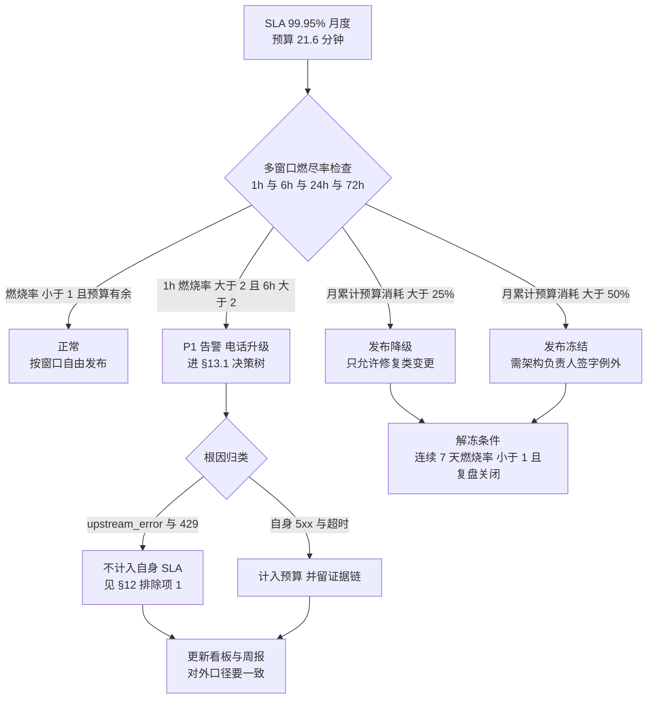

**燃尽示意（ASCII，便于放进周报纯文本栏）**

```
预算 100% ┤■■■■■■■■■■■■■■■■■■■■■■  月初起点 21.6 分钟
          │
  75%  ───┤  正常发布区
          │        ▓▓ 第 9 天一次 12 分钟故障 → 一次吃掉 55%
  50% ════╪════════ 冻结线：过线只允许签字例外
          │            ▒▒ 第 17 天 SSE 超时连锁
  25% ────┤───────── 降级线：只允许修复类变更
          │                 ░░ 第 24 天 池饱和
   0%     └────────────────────── 月末：预算基本耗尽
             1   9        17     30
```

> **口径提醒**：`upstream_error`（上游模型供应商 5xx / 429）**不计入自身 SLA**（§12 排除项 1），但必须**单独一条曲线**看。否则会出现"预算没烧完、却因为上游集体挂掉而整站不可用"的荒谬结论——对客沟通与内部复盘都要能把这两类分开。

#### 操作步骤

1. SLO 定义（与 §12 口径一致）：

| SLO | 指标 | 目标 | 窗口 |
| --- | --- | --- | --- |
| 可用性 | 外部拨测成功率（GTM + 站点监控 + blackbox 三源） | 99.95% | 月 |
| 请求成功率 | 5xx 比例（排除 4xx 与限流 429） | ≥ 99.9% | 5min 滑窗 |
| 延迟 | 首字延迟 P95 | ≤ 800 ms | 5min |
| 网关链路 | 上游 5xx 比例（区分自身/上游） | 单独看板，**不计入自身 SLO** | 月 |
| DB | 慢查询 >1s 数 | 阈值告警 | 5min |

2. 错误预算：月度 21.6 分钟；按 5 分钟粒度做"预算燃烧率"告警（燃烧率 >2x → P2，>10x → P1 电话）。
3. 告警分级与路由：

| 级 | 例 | 通道 | 响应 |
| --- | --- | --- | --- |
| P1 | 站点不可用、备站不可接管、DB 不可写、密钥泄露 | **电话** + 群 + 短信 | 5 分钟内响应 |
| P2 | 错误预算快速燃烧、P95 超标 10 分钟、HPA 打满 max、节点池扩容失败 | 群 + 短信 | 30 分钟 |
| P3 | 单副本重启、慢查询、证书 30 天到期、日志降级计数上升 | 群 | 下个工作日 |

4. 值班表（2 人轮换 + 项目负责人升级路径）；`ops.likha.com` 只对内网/堡垒开放。

**验证**

```bash
# V1 告警通路自证：制造一次可控 P1
kubectl -n new-api scale deploy/new-api-stable 0
# 期望：≤ 3 分钟内 P1 电话 + 群消息触达 2 名执行人 + 项目负责人（截图 + 通话记录留证）
kubectl -n new-api scale deploy/new-api-stable 4
# V2 静默与收敛：一次故障只产生 1 条 P1 + 关联告警折叠（不刷屏）
# V3 看板数字与 SLS/Prometheus 原始查询一致（抽查 3 个面板）
```

**坑**
- **坑 1｜告警用邮箱。** 后果：夜里没人看。改进：P1 必须电话（云监控电话需余额/国际站可用性**先实测**；不可用则用 ARMS/第三方 ONCALL 服务，并在 §12 记录实际通道）。
- **坑 2｜告警阈值按"日常流量"设，接管后立刻失真。** 改进：阈值用**比率/燃烧率**而非绝对量。
- **坑 3｜"上游 429/5xx" 算进自身可用性。** 后果：SLA 判定被上游绑架。改进：`router` 层区分自身错误与上游错误（自身 5xx vs `upstream_error` 指标），§12 排除项③。
- **坑 4｜看板做完没人复核口径。** 改进：任务 34 上线检查表里加"SLA 口径三方（开发/运维/商务）签字"。

### 10.9 D7 出口检查

```
☐ SG→MNL RDS RTT/TPS/建连实测值记录，且写进接管口径
☐ 单实例容量基线 C 实测；1500 并发 ÷ C ≤ 16（或已提 max 并配配额）
☐ 备站 24 副本可达 + warmup 时长实测（M4 硬指标）
☐ ALB 伪造 Host 反例返回非 200；SG 收敛结论书面化
☐ 配置 30s 跨副本收敛 + 跨 region 60s 收敛通过
☐ 灰度 5/20/50/100 全档通过 + 权重归零 ≤30s
☐ RDS 主备切换：5xx 窗口 ≤60s 且自愈，额度对账 0 差异
☐ SLO 看板 + P1 电话实测触达；错误预算燃烧率告警生效
```

---
## 11. 阶段 I：D8–D9 落地（任务 33、36、39、49、51、34、35）

### 11.1 任务 33｜容量与压测验收（并发 SSE 1500 / 管理面 800 QPS）

#### 操作步骤

1. **环境**：perf 命名空间（同规格、同节点池参数、独立 DB `newapi_perf`）。生产压测**禁止**（会污染额度与上游配额）。
2. 上游用 **mock 上游**（可控延迟、可控 token 速率、可注入 429/5xx）。真实上游压测会把厂商打死并触发风控。

```yaml
# 简易 mock：Nginx/Go 实现 SSE，延迟可配
apiVersion: apps/v1
kind: Deployment
metadata: {name: mock-upstream, namespace: new-api-perf}
spec: {replicas: 6, template: {spec: {containers: [{name: mock, image: ${MOCK_IMAGE},
  env: [{name: FIRST_TOKEN_DELAY_MS, value: "300"}, {name: TOKEN_INTERVAL_MS, value: "30"},
        {name: ERROR_RATE, value: "0.001"}, {name: SSE, value: "true"}]}]}}}
```

3. 场景矩阵（每个场景 ≥10 分钟稳态 + 3 分钟突发）：

| 场景 | 内容 | 关键断言 |
| --- | --- | --- |
| S1 常态 | 500 并发 SSE，30% 命中缓存 | P95 首字 ≤ 800ms；5xx ≤0.05% |
| S2 峰值 | **1500 并发 SSE** | HPA 扩到位，无 Pending；FD/内存不触顶 |
| S3 突发 | 0 → 1500 并发 30 秒内 | 冷启动窗口错误率 ≤1%，30s 内回稳 |
| S4 管理面 | 800 QPS 登录/列渠道/看板 | 无 DB 慢查询堆积；登录限流不误伤 |
| S5 上游劣化 | 上游 50% 请求 5xx / 延迟 5s | 自身不被拖死；错误归类为 `upstream_error`；熔断生效 |
| S6 Redis 故障 | kill Tair 连接 | **降级放行而非 fail-closed**（G8）；额度不出错 |
| S7 日志库故障 | 断开 `LOG_SQL_DSN` | 业务不阻塞；降级计数上升 |
| S8 DB 主备切换 | 切换中打流 | 5xx 窗口 ≤60s 且自愈（§10.7） |
| S9 长流 | 单请求 12 分钟 | **确认 ALB 600s 上限行为**（P0-5），产品侧要有明确文案 |
| S10 发布并发 | 压测中滚动发布 | 5xx = 0（§8.2 V2） |

4. 观测采集：`hey`/`vegeta`/`k6` 任选，但要同时抓 `container_cpu_cfs_throttled_periods_total`、`process_open_fds`、`pg_stat_activity`、NAT 出流量、WAF 拦截数。

**验证（通过标准）**：以 **S2 通过 + S3 收敛 + S5/S6/S7 不致命** 为硬门槛；任何一项不过 → 触发 §12 裁剪预案讨论（延后上线 or 降 SLA 承诺），不允许"带病上线"。

**修复路径速查**

| 现象 | 定位 | 处置 |
| --- | --- | --- |
| 1500 并发时 FD 打满 | `process_open_fds` 逼近 limit | nofile（§7.1）+ 提升副本（分母）|
| CPU throttle 严重但 CPU 不高 | CFS quota 太紧 | request=limit 或去掉 limit.cpu；GOMAXPROCS |
| P95 随并发线性恶化 | DB 连接排队 | PgBouncer `default_pool_size`/连接预算（§5.6）|
| 内存持续涨不回落 | SSE 未释放/缓冲无上限 | 检查流关闭与 `bufio` 大小；限每请求缓冲 |
| 扩容后错误率反升 | 冷连接池 + 冷缓存 | 预热（§11.4）|

**坑**：
- **坑 1｜压测客户端自己成了瓶颈。** 后果：测出"没问题"。改进：客户端与被测同 region（新加坡/马尼拉），并监控客户端 CPU/端口耗尽。
- **坑 2｜用真实 API Key 压 mock 之外的真实渠道。** 后果：产生真实费用 + 触发厂商封禁。改进：压测渠道全部 `status=disabled` 的真实渠道 + mock。
- **坑 3｜压测数据留在生产库。** 改进：perf 独立库；压测前 `select count(*) from logs` 断言不是生产库。

### 11.2 任务 36｜备 region 接管演练（GTM 强制切换）

这是 M4 的**唯一硬证据**，必须在 D8 窗口内完整跑一遍，且**由 §10.3 的三步顺序驱动**。

**图 15｜接管强制顺序（顺序错了就不是演练，是制造事故）**

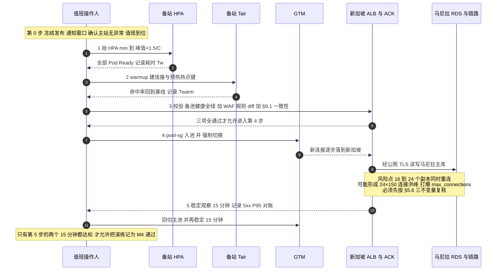

> **两条不可交换的顺序约束**：① **先抬 HPA、再切流量**——反过来做等于让 2 副本冷集群瞬间接全站流量，冷启动加 JIT 加连接建立会把 P95 拉到分钟级，然后被 GTM 判不健康又切回去，形成抖动；② **先 warmup、再入池**——Tair 未预热时命中率接近 0，所有请求穿透到马尼拉主库，跨区 RTT 会把连接占用时间放大 5~10 倍，最容易在这里触发 `too many clients`。

#### 操作步骤

```
0) 冻结发布，通知窗口，确认主站无异常，值班到位
1) 备站预热：HPA min 抬到目标副本（按峰值×1.5/C 计算）→ 等全 Ready → 记录耗时 Tw
2) Tair / DB 连接池 warmup（§11.4）→ 记录耗时 Twarm
3) 备池健康检查全绿 + WAF 规则一致性 diff（§9.1）
4) GTM：将 pool-sg 加入备池 → 强制切换（GTM 控制台 "Switch" 或调权重/摘主池）
5) 观察：dig 生效时间、备站 QPS 上升曲线、错误率、P95、DB 连接数
6) 稳定 15 分钟 → 回切主站 → 再稳定 10 分钟
7) 出报告：切换耗时、影响面、回切耗时、发现的问题与整改项
```

**验证判据**

| 指标 | 通过标准 |
| --- | --- |
| 授权切换 → 备池加入 → GTM 解析到 SG ALB 完成 | ≤ 90 秒（其中含 DNS TTL 60s 理论值） |
| 预热耗时 Tw + Twarm | 若走"自动感知故障"路径则全部计入 RTO；M4 口径要写清 |
| 切换期间用户侧错误率 | 由 §12 排除项口径决定；目标 ≤0.5% 且无 5xx 尖刺持续 >60s |
| 会话保持 | 主站签发的 token 在备站直接可用（无 401 潮） |
| 额度一致性 | 切换前后 `sum(quota)` 对账差异 = 0 |
| 回切 | 同样 ≤90 秒，且主站无需重启即承接 |

**坑与注意事项**
- **坑 1｜为了"演练顺利"提前把备池加入生产 GTM。** 后果：真实故障时无法解释"为什么没切"或"为什么乱切"。改进：加入备池本身就是**变更**，需审批；演练报告里明确"备池常态是否常驻"的最终决策（推荐：**常驻但权重 0**，切换由自动化 + 人工双确认）。
- **坑 2｜接管后发现新加坡的渠道配置/费率与主站不同。** 后果：计费错误（资金事故）。改进：配置以**同一 DB** 为唯一事实源（本方案正是如此），但要确认 `MEMORY_CACHE_ENABLED=false` 且备站已完成一轮 `SYNC_FREQUENCY` 收敛（§10.5）。
- **坑 3｜接管后限流失效。** §7.5 坑 1：两侧 Redis 计数独立 → 接管瞬间用户可短时超量。改进：明确"接管后限流重新计数"是可接受行为并写进口径；对高价值用户可加 DB 侧兜底额度检查。
- **坑 4｜回切时机太早。** 备站刚 warm 就切回，等于把 warm 的算力丢掉，且真实故障时同样会反复抖动。改进：演练里包含"**主站恢复后等待 ≥15 分钟再回切**"的规则并写入 §13.4。
- **坑 5｜只验 GTM，没验"客户端真的换过去了"。** 部分 SDK 长连接/DNS 缓存不重解析。改进：验证里包含"新连接建立到 SG ALB access log 的来源占比"。

### 11.3 任务 39｜备 region 链路拨测与告警（不健康时阻止接管）

接管的前提是"链路健康"。这条链路（SG→MNL RDS 公网）本身就是**接管期的唯一生死线**。

```yaml
# blackbox-exporter 探测 TCP 5432 + PG 握手
modules:
  tcp_pg:
    prober: tcp
    timeout: 5s
  pg_auth:
    prober: http
    # 用 sidecar 跑 psql -c 'select 1' 并暴露 /healthz 由 G8 提供
```

告警规则：

| 条件 | 级别 | 动作 |
| --- | --- | --- |
| SG→MNL RDS TCP 探测失败率 >10%（1min） | **P1** | 电话 + **自动禁止 GTM 切到备池**（把备池权重置 0） |
| RTT p95 > 150ms 持续 5min | P2 | 通知，接管前需人工确认 |
| `newapi_sg` 连接数 > 预算 80% | P2 | 阻止继续扩容备站副本 |
| TLS 握手失败（证书到期/地址漂移） | **P1** | 立即，接管能力视为失效 |

**验证**：临时把 SG 一个 EIP 从白名单摘掉 → 期望 3 分钟内 P1 触达 + 备池被自动置 0；恢复后自动回正。

**坑**：
- **坑 1｜"链路不健康就阻止接管"在真故障时可能是致命逻辑。** 后果：主站挂了 + 链路恰好也不稳 → 系统**拒绝接管** → 全站不可用（本想保数据一致，结果放弃了唯一可用性）。改进：这是**产品决策**，必须与 §12 G12 SLA 口径一起签字确认。建议折中：链路"完全不通"→ 阻止并电话；链路"劣化（RTT 高）"→ **仍然接管**（劣化可用 > 完全不可用）。
- **坑 2｜拨测探测本身消耗 RDS 连接。** 改进：探测复用连接或用独立低权限账号 + 频率 ≤10s。

### 11.4 任务 49｜备 region Tair 预热与接管前 warmup

接管瞬间的三件冷启动：**DB 连接池、Redis 缓存（渠道/用户/配置）、JIT/连接握手**。

```bash
# warmup Job（切流前跑，也可作为接管自动化的一步）
kubectl --context sg -n new-api create job warmup --image=${ACR_SG_PREFIX}:${SHA} -- sh -c '
  i=0
  while [ $i -lt 30 ]; do
    wget -qO- "http://127.0.0.1:3000/api/status" >/dev/null
    i=$((i+1)); sleep 1
  done'
# 真实预热要对热点键：按 top-N 活跃用户/渠道各拉一次轻量读接口
```

预热清单：

| 对象 | 做法 | 验收 |
| --- | --- | --- |
| DB 连接池 | `initContainer` / warmup 请求打并发读 | `pg_stat_activity` 里 `newapi_sg` 达到 `min_pool` 且无 handshake 失败 |
| Tair | 预载渠道配置、模型列表、费率（`redis-cli --pipe` 或后台导出） | 接管后前 60s 的 **DB QPS 不出现尖刺**（关键指标） |
| HTTP 上游连接 | 预建 TLS 会话（打一次 `/v1/models` 类轻接口） | 首批请求 P99 不劣于稳态 1.5× |
| Pod 磁盘/页缓存 | 日志目录预创建 | 无首写延迟 |

**验证**：接管演练（§11.2）报告里必须有一张"**接管后 0–120s 的 DB QPS / P99 曲线**"。有 warmup 与无 warmup 各跑一次对比（在 perf 环境）。

**坑**：
- **坑 1｜预热键与生产 TTL 不一致，接管后立刻过期。** 改进：预热带原 TTL 或从主站 Redis `DUMP/RESTORE` 迁移（跨区需走安全通道，不要 `KEYS *` 扫全库）。
- **坑 2｜warmup 脚本打的是写接口。** 后果：制造垃圾数据/额度。改进：**只打幂等读接口**。

### 11.5 任务 51｜上游渠道 RPM/TPM 配额盘点与限流参数校准

| 步骤 | 内容 |
| --- | --- |
| 1 | 逐渠道登记：RPM、TPM、并发上限、突发桶、超额行为（429 硬拒 / 排队 / 降级） |
| 2 | 按 **8 个 EIP 合计** 与厂商确认白名单+配额是否按 IP 维度计 |
| 3 | 把业务峰值 QPS（§10.2 的 C × 副本）折算成 RPM，与配额比对，得出**真实系统上限** |
| 4 | 校准 `GLOBAL_API_RATE_LIMIT`：应用侧限流应**严于**上游配额（宁可自己 429，也不要被上游封） |
| 5 | 设计超额降级：渠道 failover 顺序、超时与重试预算（避免重试放大） |

**验证**：`curl` 打满应用限流阈值 → 期望应用侧 429，且上游侧观测不到超额 RPM（厂商控制台确认）；渠道 failover 在注入 5xx 后 ≤10s 生效。

**坑**
- **坑 1｜把限流值设成"厂商给的配额"。** 后果：所有租户共享配额，一个突发用户吃光全站 → 全员 429。改进：**全局配额 + 单用户配额**双层；单用户默认值保守（360/180s 已是代码默认）。
- **坑 2｜上游配额是"按 key"而接管后新加坡用同一 key。** 后果：主备共享配额，接管后并发翻倍直接撞墙。改进：主备分 key 或与厂商确认；在 §12 风险表记为 R-上游配额。
- **坑 3｜重试无预算。** 后果：一次上游抖动引发重试风暴把配额瞬间打光（retry storm）。改进：指数退避 + 重试预算 ≤10% + 熔断。

### 11.6 任务 34｜上线检查表、发布窗口冻结与正式上线

#### 上线检查表（全部为"是"才允许切 DNS 到生产入口）

```
【门禁】
☐ G0 13 项全过（§3.13 打勾表已归档）
☐ M1–M4 证据齐（§12），无未闭环 P0/P1 缺陷
【容量与韧性】
☐ S2(1500 并发)/S3(突发)/S5/S6/S7 场景通过
☐ 单实例容量 C 实测；16 副本能扛 1.5× 峰值
☐ 备站 24 副本可达 + warmup 时长实测
☐ RDS 主备切换演练通过；PITR 演练通过（RPO/RTO 实测）
☐ 备 region 接管与回切演练通过，额度对账 0 差异
【安全】
☐ 安全核查 15 项通过或已签字豁免（§9.10）
☐ 白名单：RDS 三组 / 8 EIP 上游 / 支付回调三层 全通过
☐ 证书：SNI 校验、链完整、到期 ≥25 天、自动续期任务在
☐ 无 0.0.0.0/0 入向非 80/443；伪造 Host 反例返回非 200
【可观测】
☐ SLO 看板数字与原始查询一致；P1 电话实测触达
☐ 三重拨测（GTM/站点监控/blackbox）独立产出
☐ 日志脱敏抽查通过；audit 180 天投递可查
【运维】
☐ 运维访问面：私网端点、最小 RBAC、60min kubeconfig、变更审批
☐ Runbook 与应急预案评审通过（§13），值班表生效
☐ 成本看板与预算告警（80%）生效
【商务/口径】
☐ G12 SLA 五条口径 + 4 排除项书面签字
☐ 泰国用户接入马尼拉（RTT 55–80ms）偏差已书面说明
☐ 发布窗口冻结期已通知（建议上线后 72h）
```

#### 正式上线步骤

```bash
# 1) DNS 正式切到 GTM（若之前直连 ALB 做验收）
dig +short api.likha.com @8.8.8.8
# 2) 小流量观察（若有灰度开关/白名单用户优先放行）
# 3) 30/60/120 分钟三次快照：错误率、P95、DB 连接、上游 429、账单速率
# 4) 宣布上线完成，进入 72h 冻结窗口（只允许回滚，不允许功能变更）
```

**坑**
- **坑 1｜上线即改配置。** 后果：出问题无法归因（是新版本还是新配置？）。改进：冻结窗口内**只回滚不前进**。
- **坑 2｜回滚方案未演练。** 后果：真要回时才发现 DB 已 Contract。改进：§11.7 明确"发布后 24h 内回滚必须可用"，且 expand-contract 保证 24h 内不 Contract。
- **坑 3｜把"部署成功"当"服务健康"。** 改进：上线判定依据是 **SLO 面板 + 拨测**，不是 `rollout status`。

### 11.7 任务 35｜移交运维（D9）

移交物（每项都要有可执行路径，不接受"口述"）：

| 交付 | 内容 | 验收方式 |
| --- | --- | --- |
| Runbook | P1 场景 × 处置：站点不可用 / DB 不可写 / Redis 挂 / 上游全挂 / 证书到期 / 备站接管 / 回切 / 密钥轮换 | **新人照做能恢复一次**（在 perf 抽考） |
| 应急预案 | §13 全部条目 + 决策树 + 联系人升级路径 | 桌面推演一次 |
| 值班表 | 2 人轮换 + 项目负责人升级；P1 电话可达 | 实拨一次 |
| 拓扑与访问路径图 | VPC/SG/NAT/ALB/WAF/GTM/ACK/RDS 全链路 + 运维入口 | 评审签字 |
| 权限矩阵 | RAM ↔ RBAC ↔ 白名单 ↔ 密钥归属 | 抽查 3 个身份 |
| 成本看板 | 上季度实际 + 弹性敏感度 + 超预算处置阈值 | 能按 tag 出账 |
| 已知限制清单 | 21 项差异中的残余项（如 APM 未确认、马尼拉 2AZ、600s 上限、DTS 决策理由、接管后限流重计数） | **接手方确认知悉** |
| 巡检节奏 | 日：错误预算/账单突增/回调 4xx；周：migrate up-down-up、备份恢复抽样、证书剩余天数；月：白名单漂移、EIP 一致性 | 日历/工单已建 |
| 变更 SOP | 灰度权重推进、SESSION_SECRET 轮换、节点池扩缩、DNS/GTM 变更 | 每 SOP 有一次演练记录 |

**坑**
- **坑 1｜移交 = 丢文档。** 后果：D10 起所有问题回来找原执行人，等于没移交。改进：安排 **2 周影子值班**（运维主导、原执行人旁观），并在验收单上双方签字。
- **坑 2｜已知限制没写下来。** 后果：接手方把架构决策当 bug 反复排查（典型："为什么不建新加坡库""为什么 ALB 入向是全开"）。改进：`impl_deploy.md` 与本指南 §1 差异表一起归档，并在每个"看起来像漏洞"的配置旁写一句 reason（**注释即文档**）。
- **坑 3｜密钥归属不清。** 后果：轮换无人执行、到期才发现。改进：每个 KMS Secret 有 owner + 轮换周期字段（§2 网络与安全规划表已列，交接时复述）。

### 11.8 D8–D9 出口（M5）

```
☐ S1–S10 全场景压测报告（含曲线截图）
☐ 备 region 接管/回切完整演练报告（0–120s DB QPS 与 P99 曲线）
☐ 上线检查表 100% 勾选并归档
☐ 正式发布完成，72h 冻结窗无 P1/P2
☐ 移交包九件套齐全 + 新人抽考通过 + 2 周影子值班计划落地
```

---

## 12. 里程碑验收清单与证据

### 12.1 门禁与里程碑

| 阶段 | 判定 | 出口证据（必须可点开看） |
| --- | --- | --- |
| **G0** | T-5/T-3 十三项前置全部完成（§3.13 打勾表） | 实名批复截图、配额工单批复号、`dig` NS 生效输出、证书签发详情（含 Sans/到期）、11 类产品开通列表、**G8 合并 commit + CI 绿**、连接数预算表、SLA 口径签字页、staging 方案确认 |
| **M1**（D1–D2） | 网络 + 数据底座就绪 | VPC/10 vSwitch 网段截图；RDS HA 状态（两 AZ）；Tair `allkeys-lru`；CK 决策落地；8 EIP 登记；SG 绑定 `sg-mnl-app`（非 127.0.0.1） |
| **M2**（D3–D4） | 集群 + 应用底座就绪 | 两集群 `kubectl get nodes` 跨 AZ；`ulimit -n`=200000；master 二次启动 DDL=0；stable/备站跑通；主站 token 在备站可用（§7.4 V4） |
| **M3**（D5–D6） | 对外可服务 + 安全可观测收口 | ALB/WAF/GTM 生效；SG 反例自查输出为空；三重拨测产出；canary 权重实测；安全核查 15 项（含豁免单） |
| **M4**（D7–D8） | 容量与接管能力达标 | 单实例容量 C 表；HPA 4–16 与 2–24 实测；备站 24 副本 warm 耗时；**接管/回切演练报告**；RDS 主备切换 5xx ≤60s |
| **M5**（D8–D9） | 正式上线 + 移交 | 压测 S1–S10 报告；上线检查表；移交九件套 + 抽考记录 + 影子值班计划 |

### 12.2 SLA 99.95% 判定口径（与 G12 一致，必须书面签字）

- **测量源**：三重拨测（GTM 健康探测 ∪ CMS 站点监控 ∪ 集群外 blackbox），任一源判定"不可用"即计入；窗口 = 自然月。
- **不可用定义**：`GET /api/status` 在 3 个连续探测周期（45s）内失败 **或** 业务写接口 5xx 率 >5% 持续 ≥60s。
- **月度预算**：21.6 分钟；按 5min 粒度做燃烧率告警（§10.8）。
- **排除项（四条，逐条要客户确认）**：
 ① 上游模型厂商自身故障/限流（按 `upstream_error` 指标区分，非自身 5xx）；
 ② **region 级整体故障**（马尼拉 AZ/region 全挂）—— 因本次交付不含第三 region 主库，此类场景 RTO 由 RDS 恢复时间决定（实测 1.5–4h），**不构成违约**；
 ③ 计划内维护窗口（提前 48h 通知、月累计 ≤30 分钟、且落在业务低谷）；
 ④ 客户端 DNS 缓存导致的切换滞后（GTM TTL 60s 之后的部分）。
- **延迟口径**：主站常态 P95 首字 ≤800ms；**接管期**（流量在备 region）放宽至 ≤1500ms（跨区 SQL RTT 所致，§10.1 实测支撑）。
- **单请求上限**：ALB 600s 硬上限（P0-5），超 600s 的长任务须走异步 —— **产品文档与合同须一致说明**。
- **交付范围偏差声明**：泰国用户接入马尼拉（RTT 55–80ms），与 `impl_deploy.md` 1.2"主站点不能只放一个区域"的结论存在偏差；泰国为二期。

### 12.3 关键风险与残余（上线时仍存在的）

| 风险 | 现状 | 残余处置 |
| --- | --- | --- |
| 上游配额与白名单依赖外部审批 | 8 EIP 已确认，配额按 key 共享 | 主备分 key 谈判；应用侧限流严于配额 |
| ClickHouse 马尼拉不可用（P0-1） | 按 §4.5 选定方案落地 | 若选跨区方案：接管期日志延迟，日志不作为 SLA 证据源 |
| `/healthz`/`/readyz`/`/metrics` 未注册 | 探针降级用 `/api/status` | **G8 未完成则 SLA 承诺应下调**（DB 故障时无法自动摘流/扩容滞后） |
| ARMS APM 马尼拉未确认（P1-12） | 不纳入证据链 | 上线后提工单确认，再启用链路追踪 |
| 马尼拉仅 2 AZ（P1-8） | 3AZ 方案不可行 | 接受；region 级故障走排除项② |
| Managed Grafana 不在马尼拉（P1-11） | 建在新加坡 | 跨区看板读取延迟，非生产链路依赖 |
| 会话在接管后依赖两侧同 SESSION_SECRET | 已统一 KMS 源 | 轮换 SOP 强制双 region 同步；§11.2 覆盖 |
| Redis 独立导致接管后限流重计数 | 已知行为 | 写进口径；高价值用户 DB 侧兜底 |

---

## 13. 回滚与应急预案

> 原则：**每一条预案都必须是被演练过的**（§11.7 要求新人照做一次）。未演练的预案视同不存在。

### 13.1 决策树（P1 入口）

**图 16｜P1 接到告警后的分流决策（先分类，再动手）**

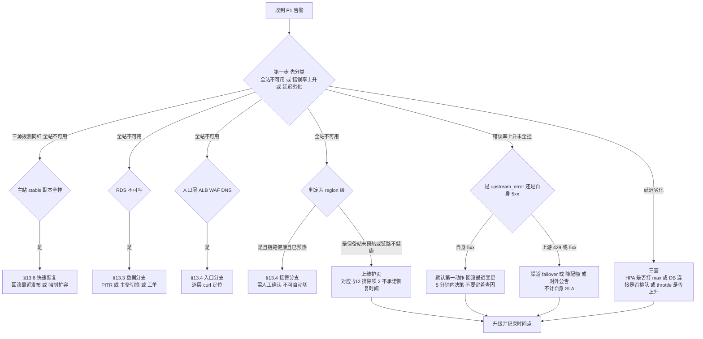

> **为什么"先分类"比"先动手"重要**：region 级判定如果自动触发接管，会在**备站没预热**的情况下把全站流量灌进 2 个冷副本——这是唯一一种会把"局部故障"放大成"全站不可用且无法回退"的错误动作。所以接管分支必须**人工确认 + 链路健康 + 已完成 warmup** 三条件同时成立；三条件缺一，正确动作是上维护页（它是**诚实的降级**，属于 §12 排除项 2 的范畴，好过让用户在超时里反复重试）。

### 13.2 应用与发布回滚

**图 17｜回滚动作优先级（从上到下，越上越快越可逆）**

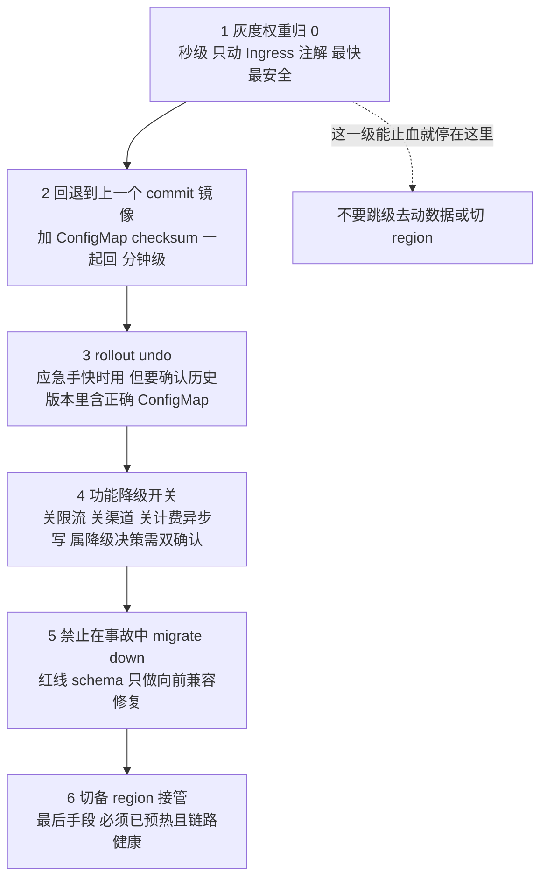

| 级别 | 生效时间 | 可逆性 | 前置条件 | 误用后果 |
| --- | --- | --- | --- | --- |
| 1 权重归零 | 秒 | 完全可逆 | canary 存在 | 无（首选） |
| 2 回退 commit | 1–5 分钟 | 可逆 | GitOps 镜像与配置同批 | 只回镜像不回配置 → 新代码配旧配置 |
| 3 rollout undo | 1–5 分钟 | 可逆 | 上一 ReplicaSet 未被清理 | 回到了一个"从来没跑过"的版本 |
| 4 降级开关 | 秒–分钟 | 可逆（必须补回） | 值班 + 项目负责人双确认 | 全局限流裸奔 → 被打爆 |
| 5 migrate down | — | **不可逆** | **事故中一律禁止** | 数据丢失 |
| 6 切备 region | 5–30 分钟 | 可回切 | 预热完成 + 链路健康 | 冷集群接全站流量 |

> **让 1–4 级始终可用的唯一条件**：发布后 **24 小时内不做 Contract**（§9.5 坑 4）。一旦提前删了旧列，回退镜像也没用——代码读不到列，第 1~4 级全部失效，只剩第 6 级和"等数据恢复"。这是把"发布纪律"和"应急预案"绑在一起的唯一起点。

```bash
# 首选：GitOps 回退一个 commit（镜像 + ConfigMap checksum 一起回）
kubectl -n new-api rollout undo deploy/new-api-stable
kubectl -n new-api rollout status deploy/new-api-stable --timeout=10m
# 精确回退到指定 SHA
kubectl -n new-api set image deploy/new-api-stable new-api=${ACR_MNL_PREFIX}:${GOOD_SHA}
# 灰度问题：权重归零（最快，秒级）
kubectl -n new-api annotate ingress new-api-canary alb.ingress.kubernetes.io/canary-weight="0" --overwrite
```

- **DB 回滚红线**：发布后 **24h 内禁止 Contract**；若必须回滚代码，schema 只能"向前兼容修复"（加列/加表），**严禁**在事故中执行 `migrate down`（数据不可逆）。
- **Redis 不可用（fail-open 未落地时）**：临时 `kubectl set env deploy/new-api-stable GLOBAL_API_RATE_LIMIT_ENABLE=false`（会全局限流失效，属**降级决策**，需值班 + 项目负责人双确认，事后必须补回）。

### 13.3 RDS / 数据分支

| 场景 | 处置 | 时限 |
| --- | --- | --- |
| 主库不可写（HA 已自动切换） | 确认应用重连（§10.7）；对账额度 | 5min 决策 |
| 数据误删/误更新 | **PITR 恢复到新实例** → 反向导出差异 → 补写回主库（**禁止覆盖原实例**，§6.5 坑 1） | 1.5–4h |
| 慢查询打爆连接 | 前置 PgBouncer 降 `default_pool_size`；kill 长查询 `select pg_terminate_backend(pid)` | 分钟级 |
| 主库整体不可恢复 | 备 region **有 schema 但无独立数据**（红线）→ 只能等 RDS 恢复；这就是 §12 排除项② 的代价 | — |

### 13.4 入口与接管

```bash
# GTM 手动切到备池（先做 §11.2 的 1)2)3) 预热三步）
# 回切：主站 healthy 后等待 ≥15 分钟（§11.2 坑 4）再切
# 紧急止血（无法接管时）：把 GTM 主池指向"维护页"静态源（OSS+CDN 兜底页）
```

- 维护页必须在**上线前就已部署好**并能一键切换（否则故障时来不及做）。
- DNS 直连兜底：`api.likha.com` 的**低 TTL A 记录**（预置为 ALB IP）作为 GTM 失效逃生通道，并在 Runbook 里标注"这会绕过 GTM，只用于极端场景"。

### 13.5 运维通道失效

| 场景 | 处置 |
| --- | --- |
| 堡垒机不可用 | 审批制临时开 API Server 公网端点 + IP 白名单，用完立即关（§8.5 坑 4） |
| kubeconfig 过期且无法续签 | 用 RAM admin 身份在控制台重签发（仅 2 人持有，写在信封里） |
| SLS/Grafana 不可读 | 降级 `kubectl logs --since=10m` + `psql` 直查 `pg_stat_activity`；关键动作前必须先"取得可观测" |

### 13.6 快速扩容（HPA 失灵时）

```bash
kubectl -n new-api patch hpa hpa-new-api-stable --type=merge -p '{"spec":{"minReplicas":12}}'
# 或临时绕 HPA（记录并 30 分钟内恢复）
kubectl -n new-api scale deploy/new-api-stable 12
# 节点不够 → 抬节点池期望值
aliyun cs ModifyClusterNodePool --ClusterId ${ACK_MNL_ID} --NodepoolId ${NP_MNL} --body '{"scaling_group":{"desired_size":8}}'
```

**坑**：手工 `scale` 与 HPA/GitOps 三方打架（GitOps 会把它 sync 回去）。改进：预案里**一律用 HPA `minReplicas`**，不改 Deployment。

### 13.7 密钥/凭据泄露应急

1. 立即在 RAM 禁用相关 AK；上游渠道 key 在厂商侧吊销并轮换。
2. `SESSION_SECRET` 轮换（§9.6）——注意这会**强制全员重登**，属预期代价。
3. 从 KMS 拉取受影响 Secret 的访问记录 + ActionTrail 时间线，出事件报告。
4. **Git 历史里的密钥不算已清除**：轮换是唯一有效修复。

### 13.8 裁剪预案（工期告急时，按顺序砍）

| 优先砍 | 理由 | 代价 |
| --- | --- | --- |
| RDS 只读实例（马尼拉 #16） | 报表分流可后补 | 导出类查询打主库 |
| DCDN（#10） | 静态资源可先用 OSS 直读 | 首屏延迟 + 出站流量成本 |
| 新加坡 ClickHouse（SG #12） | 暂用主站日志库 | 接管期日志跨区写延迟 |
| 成本看板（#39） | 事后补 | 短期账单不可归因 |
| **不可砍**：PgBouncer/连接预算、cluster-autoscaler、备站 HPA 与 1.5× 容量、G8 代码补项、SESSION_SECRET 一致性、WAF/证书 | 砍了 99.95% 就不成立（`impl_deploy.md` 8.2） | — |

---

## 14. 附录

### 14.1 命令速查

```bash
# ---- 身份与配额 ----
aliyun sts GetCallerIdentity
aliyun ecs DescribeAccountAttributes --RegionId ap-southeast-6 --AttributeName.1 maxInstances
aliyun quotas ListProductQuotas --ProductCode ecs --RegionId ap-southeast-1

# ---- 资源存在性总览（每 region 一条）----
for r in ap-southeast-6 ap-southeast-1; do
  echo "=== $r VPC / vSwitch ==="
  aliyun vpc DescribeVpcs --RegionId "$r" \
    | jq -r '.Vpcs.Vpc[] | [.VpcId, .CidrBlock, .VpcName] | @tsv'
  aliyun vpc DescribeVSwitches --RegionId "$r" --PageSize 50 \
    | jq -r '.VSwitches.VSwitch[] | [.VSwitchId, .ZoneId, .CidrBlock, .AvailableIpAddressCount] | @tsv'
done
# 期望：马尼拉 6 个 vSwitch（2 pub + 2 app + 2 data）/ 新加坡 4 个（2 pub + 2 app），
#       网段与 §2.2 完全一致，且 AvailableIpAddressCount 未被 Pod 打满

# ---- 出口 IP 一致性（核心巡检）----
aliyun vpc DescribeSnatTableEntries --RegionId ap-southeast-6 --NatGatewayId ${NAT_MNL} \
  | jq -r '.SnatTableEntries.SnatEntry[]|[.SourceVSwitchId,.SnatIp]|@tsv'

# ---- RDS ----
aliyun rds DescribeDBInstanceAttribute --DBInstanceId ${RDS_MNL_ID} \
  | jq -r '.Items.DBInstanceAttribute[0]|{Engine,EngineVersion,Category,MasterZone,SlaveZone,DeletionProtection}'
aliyun rds DescribeDBInstanceIPArrayList --DBInstanceId ${RDS_MNL_ID} \
  | jq -r '.Items.DBInstanceIPArray[]|[.DBInstanceIPArrayName,.SecurityIPList]|@tsv'
aliyun rds DescribeDBInstanceSSL --DBInstanceId ${RDS_MNL_ID} | jq '{SSLEnabled,ConnectionString}'

# ---- ACK / 节点池 ----
aliyun cs DescribeClusterDetail --ClusterId ${ACK_MNL_ID} \
  | jq '{state,current_version,cluster_spec,profile,parameters:(.parameters|map(select(.key|test("RRSA|EndpointPublicAccess|SnatEntry"))))}'
aliyun cs ListClusterNodePools --ClusterId ${ACK_MNL_ID} \
  | jq -r '.nodepools[]|[.nodepool_info.nodepool_id,.auto_scaling.enable,.scaling_group.min_instances,.scaling_group.max_instances]|@tsv'

# ---- ALB / 证书 / WAF ----
aliyun alb GetListenerAttribute --ListenerId ${LID} | jq '{IdleTimeout,RequestTimeout,SecurityPolicyId}'
aliyun cas DescribeUserCertificateList --ShowSize 50 | jq -r '.CertificateList[]|[.Name,.AfterDate]|@tsv'
aliyun dcdn DescribeDcdnL2Ips | jq -r '.[]'      # 仅启用 DCDN 时需要

# ---- 连接数与数据库健康 ----
psql "$DSN_MIGRATE" -c "select datname,count(*) from pg_stat_activity group by 1"
psql "$DSN_MIGRATE" -c "select state,count(*) from pg_stat_activity group by 1 order by 2 desc"
SHOW POOLS   # pgbouncer admin

# ---- K8s 日常 ----
kubectl -n new-api get deploy,hpa,pdb,ingress -o wide
kubectl -n new-api top pods
kubectl -n new-api get events --sort-by=.lastTimestamp | tail -20
```

### 14.2 上线前 60 分钟检查（当天照做）

```
☐ 三重拨测全绿且无抖动（过去 24h）
☐ 错误预算本月剩余 > 15 分钟
☐ RDS: CPU<60%、连接数<70% 预算、无 >1s 慢查询堆积、复制/备份无失败
☐ PgBouncer: cl_waiting=0、sv_active 稳定
☐ ACK: 节点全 Ready、无 Pending、可分配内存 > 30%
☐ stable 副本数 = min 且 PDB ALLOWED DISRUPTIONS ≥1
☐ GTM: 主池健康、TTL 60、备池按最终决策（常驻 0 权重 / 不加入）
☐ 证书剩余 > 25 天
☐ 上游 8 EIP 生效确认无回退
☐ 维护页可一键切换（实测过一次）
☐ 回滚命令已在剪贴板（rollout undo / 权重归零 / GTM 回切）
☐ 值班 2 人在岗 + 电话可达实测 + 升级路径明确
```

### 14.3 本指南的引用与事实来源

| 类别 | 来源 | 说明 |
| --- | --- | --- |
| 部署清单与计划 | `菲律宾部署方案-v2.1-修订版.xlsx`（7 Sheet 全量解析） | 任务编号、日期、人员、门禁、里程碑、风险、裁剪预案均以该文件为准 |
| 架构依据 | `impl_deploy.md` 7.1/7.1.1/7.2/7.4.1–7.4.5/7.8/7.9/7.10、8.1–8.6 | 章节号在正文中直接引用 |
| 评审依据 | `部署方案评审-2026-09-23.md`（v2.1 修订来源） | 21 项差异与其修订要点对应 |
| 代码事实（本仓库实测） | `common/init.go:50-55`（SESSION_SECRET 默认值 Fatal）、`common/init.go:88-89`（`NODE_TYPE != "slave"` 判 master）、`common/init.go:110`（SYNC_FREQUENCY 默认 60）、`common/init.go:123-125`（限流默认 360/180s）、`model/main.go:145`（主库不支持 CK）、`model/main.go:212/259`（`SQL_MAX_OPEN_CONNS` 默认 **1000**）、`router/api-router.go:26`（唯一 `GET /api/status`） | 全仓 grep 确认 `/healthz`、`/readyz`、`/metrics` **未注册** |
| 云产品能力 | 阿里云国际站帮助中心（`alibabacloud.com/help/en`），核对时间 **2026-09-24** | 21 项差异（§1）；产品可用性列表会变，动手前一律 `【控制台核实】` |

### 14.4 术语与缩写

| 术语 | 含义 |
| --- | --- |
| G0 / G1–G13 | 上线前置门禁（Gate）；G0 = 全部前置通过，D1 才允许启动 |
| M1–M5 | 里程碑（§12.1） |
| 三不变量 I-1/I-2/I-3 | 连接数预算：应用侧总量、PgBouncer 池、RDS `max_connections` 三者关系（`impl_deploy.md` 7.4.5.1） |
| expand-contract | 迁移三段式：加→回填→删（§9.5） |
| 双密钥轮换 | `SESSION_SECRET` + `SESSION_SECRET_OLD` 过渡（§9.6） |
| 1.5× 接管容量 | 单站点全量接管能力 ≥ 被接管站点峰值 × 1.5（`impl_deploy.md` 8.5） |
| warmup / 预热 | 切流前把连接池、缓存、上游 TLS 会话打到稳态（§11.4） |
| fail-open / fail-closed | 限流依赖故障时放行 / 拒绝（G8 要求 fail-open） |
| 错误预算燃烧率 | 单位时间消耗预算的速度，用于提前告警（§10.8） |
| SRE 排除项①–④ | SLA 不计入的场景（§12.2），必须商务签字 |

### 14.5 交付前自检（对本文档自身）

```
☐ §1 的 21 项差异在正文对应章节都有"做法"，不只是列问题
☐ 每个任务都有 操作步骤 / 验证方法 / 不通过时的修复 / 坑（现象→后果→改进）四段
☐ 所有密钥/凭据均走 KMS + RRSA/ExternalSecret，正文无一处真实密钥值
☐ 所有破坏性操作（PITR 覆盖、migrate down、白名单摘除、drain、scale 0）都标注了窗口与双人复核
☐ 所有"可能已变化"的云产品事实都要求了 【控制台核实】
☐ §12 里程碑证据与 §11 演练一一对应，无"只写了要求没写怎么验"的项
```

---

**文档结束。** 本指南与 `菲律宾部署方案-v2.1-修订版.xlsx` 配套使用：xlsx 管"做什么、谁做、何时做"，本指南管"怎么做、怎么验、错了怎么修、坑在哪"。任何一处在国际站控制台发现与本文不一致，以**控制台 + 工单答复为准**，并把差异回填到 §1 差异清单。

