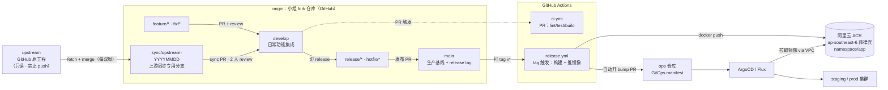
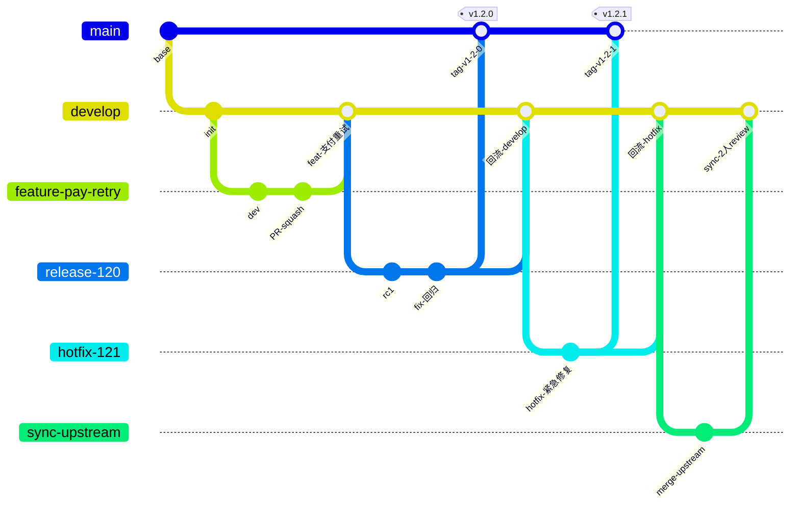
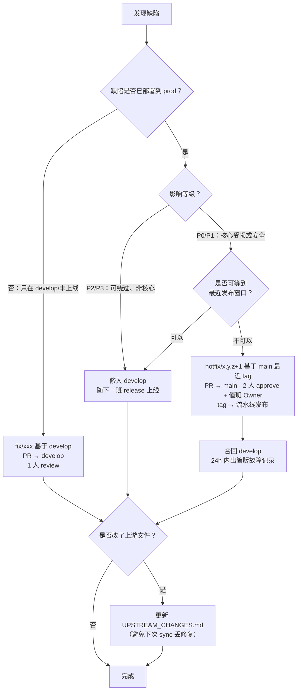
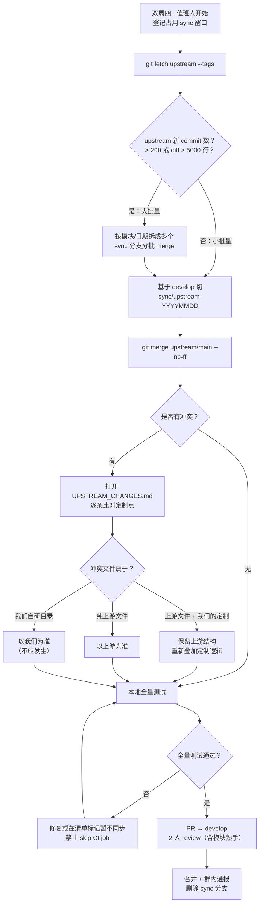
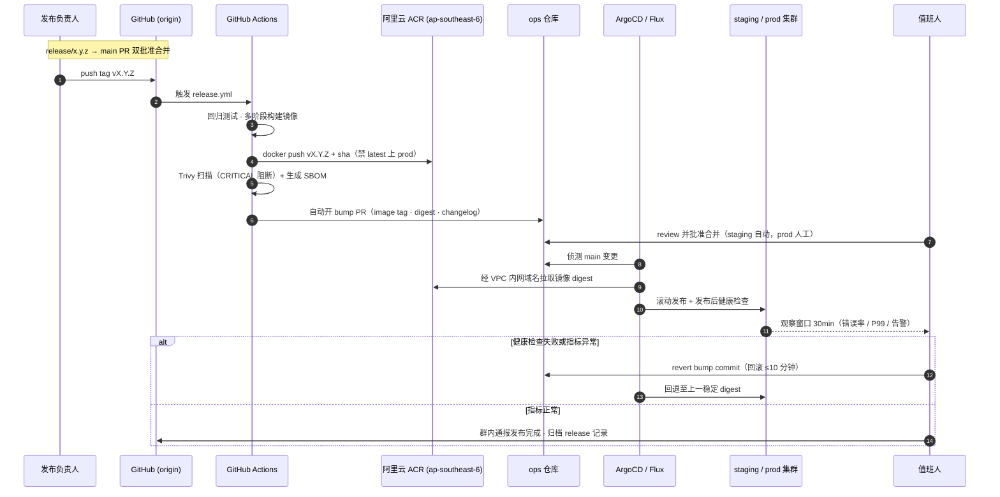
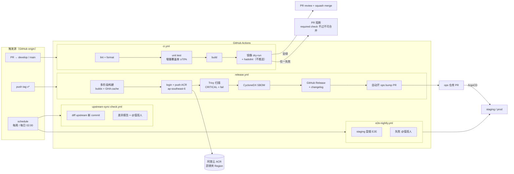
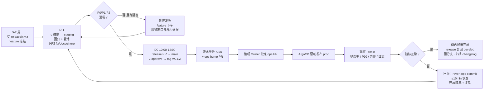
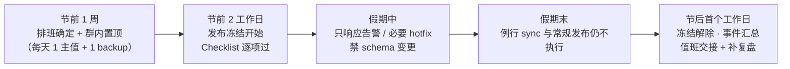
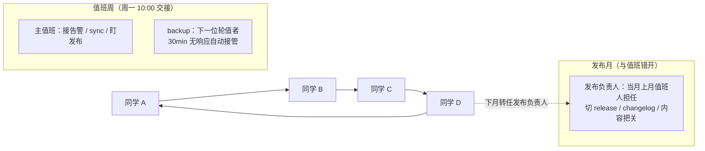
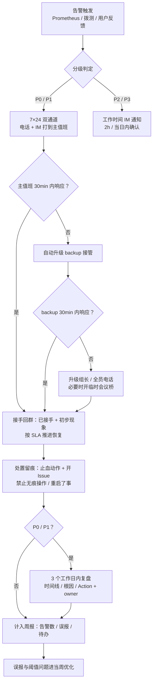

# git开发-发布-值班规范.md

- 适用范围：基于 GitHub fork 的二次开发工程（后端服务 + 容器化交付 + GitOps 发布）
- 团队规模：4 人小组
- CI/CD：GitHub Actions；
- 镜像仓库：阿里云容器镜像服务 ACR 个人版/企业版（国际站 · 菲律宾马尼拉 Region，`ap-southeast-6`）
- 版本：v1.0 ｜ 生效日期：2026-09-24 ｜ 维护人：值班 Owner（轮值）

---

## 目录

1. [仓库与远程配置规范](#1-仓库与远程配置规范)
2. [分支模型](#2-分支模型)
3. [日常开发工作流](#3-日常开发工作流)
4. [上游（upstream）代码同步规范](#4-上游upstream代码同步规范)
5. [Commit 与 PR 规范](#5-commit-与-pr-规范)
6. [代码开发规范](#6-代码开发规范)
7. [GitOps 版本发布规范](#7-gitops-版本发布规范)
8. [GitHub Actions CI/CD 规范](#8-github-actions-cicd-规范)
9. [镜像构建与推送规范（阿里云 ACR 菲律宾 Region）](#9-镜像构建与推送规范阿里云-acr-菲律宾-region)
10. [发布规范（Release Process）](#10-发布规范release-process)
11. [值班规范（日常 / 节假日）](#11-值班规范日常--节假日)
12. [附录：常用命令速查](#12-附录常用命令速查)

---

### 关于文档中的图示

本文所有图使用 **Mermaid** 内嵌，GitHub 网页、VS Code（Markdown Preview Mermaid 插件）、Typora、JetBrains 均原生渲染，无需外部图片文件。

图示索引：

| 图 | 位置 | 用途 |
|----|------|------|
| 仓库与代码流向总览 | 1.1.1 | upstream / origin / Actions / ACR / ops 全局关系 |
| 分支模型 gitGraph | 2.1 | 各分支切出与回流方向 |
| 修复通道决策 | 3.4 | bug 走 fix / develop / hotfix 的判定 |
| 上游同步流程 | 4.5 | sync 分支操作与冲突处理 |
| GitOps 端到端时序 | 7.5 | tag 到集群生效的完整链路 |
| 流水线拓扑 | 8.4 | 四个 workflow 的触发与产物 |
| 常规发布时间线 | 10.6 | D-2 → D0 发布节奏与回滚分支 |
| 4 人轮值排班 | 11.5 | 主值 / backup / 发布负责人轮转 |
| 告警升级链路 | 11.6 | 响应时效与逐级升级 |
| 节假日保障时间线 | 11.3 | 冻结窗口与值班安排 |

---

## 1. 仓库与远程配置规范

### 1.1 仓库拓扑

```
upstream（GitHub 原工程）  origin（小组 fork 仓库）  ops（GitOps manifest 仓库）
        │                        │                       │
        │  只读拉取               │  日常开发/发布          │  仅流水线/值班人写入
        └────── fetch ──────────>└──── deploy 触发 ──────>└──> ArgoCD/Flux 拉取生效
```

- **origin**：`github.com/<org>/<repo>`（fork），团队唯一的开发、PR、发布仓库。
- **upstream**：`github.com/<original-org>/<repo>`（原工程），只允许 fetch，**禁止 push**。
- **ops**：GitOps 仓库（独立 repo，如 `<org>/<repo>-ops`），只存放部署 manifest，不含业务代码。

### 1.1.1 仓库与代码流向总览图




### 1.2 本地 clone 与 remote 初始化（每人一次）

```bash
git clone git@github.com:<org>/<repo>.git && cd <repo>

git remote add upstream https://github.com/<original-org>/<repo>.git
git remote set-url --push upstream DISABLED          # 双保险：物理禁止 push upstream

# 保护分支策略（管理员一次性执行，GitHub Settings 亦可）
# main / develop 禁止直接 push，必须走 PR + Review
```

### 1.3 分支保护要求（GitHub Branch Protection）

| 分支 | 直接 push | 合并要求 | 其他 |
|------|-----------|----------|------|
| `main` | 禁止 | ≥2 名 reviewer 批准 + CI 全绿 | 必须 up-to-date 后才可合并；禁止 force push |
| `release/*` | 禁止 | ≥1 名 reviewer 批准 + CI 全绿 | 仅 bugfix/chore 允许进入 |
| `develop` | 禁止 | ≥1 名 reviewer 批准 + CI 全绿 | 允许 squash merge |
| 其余个人分支 | 允许 | — | rebase 自由 |

---

## 2. 分支模型

采用 **Git Flow 精简版**（4 人小组，去掉 `support` 等重分支）：

| 分支 | 说明 | 生命周期 | 可合入目标 |
|------|------|----------|-----------|
| `main` | 生产基线，与线上版本一一对应，**每个 release 打 tag** | 永久 | —（只接收 release/hotfix 回流） |
| `develop` | 集成分支，日常功能合入口 | 永久 | 发版时合入 `release/*` |
| `feature/<topic>` | 新功能，从 `develop` 切出 | ≤2 周 | `develop` |
| `fix/<topic>` | 缺陷修复（未上线问题），从 `develop` 切出 | ≤1 周 | `develop` |
| `release/x.y.z` | 发布准备分支，从 `develop` 切出，只允许 bugfix/doc/chore | ≤1 周 | `main` + `develop` |
| `hotfix/x.y.z+1` | 线上紧急修复，从 `main`(tag) 切出 | ≤2 天 | `main` + `develop` |
| `sync/upstream-YYYYMMDD` | 上游同步专用分支，见第 4 节 | ≤2 天 | `develop` |

命名约束：全小写 kebab-case，禁止中文/空格；`feature/`、`fix/` 前缀后必须带简短语义，如 `feature/payment-retry`。

### 2.1 分支模型示意图



> 图上分支名去掉了 `/` 与 `.`（Mermaid gitGraph 对特殊字符支持不佳），实际仓库仍按 `feature/xxx`、`release/x.y.z`、`sync/upstream-YYYYMMDD` 命名。

> 要点：`feature/fix` 只回 `develop`；`release/hotfix` 同时回流 `main` 与 `develop`；上游更新永远经 `sync/*` 分支进 `develop`，不直接动 `main`。

---

## 3. 日常开发工作流

### 3.1 标准流程

```
1. 领任务（GitHub Issue，必须关联，编号记为 #NNN）
2. git switch develop && git pull --ff-only
3. git switch -c feature/xxx
4. 本地开发 + 单测（见第 6 节，增量覆盖率 ≥ 70%）
5. git push -u origin feature/xxx
6. 开 PR：feature/xxx -> develop（模板见 5.3）
7. Code Review（≥1 approve）+ CI 绿 -> Squash Merge
8. 删除远端 feature 分支
```

### 3.2 功能分支保持与 develop 同步

长期分支（>3 天）每天开工先同步，避免大冲突：

```bash
git fetch origin
git rebase origin/develop        # 个人分支用 rebase，保持线性历史
git push --force-with-lease      # 只用 --force-with-lease，禁止裸 --force
```

### 3.3 Bug 修复流程

- **未上线缺陷**：`fix/<topic>` 从 `develop` 切出 → 修 → PR 回 `develop`。
- **线上缺陷（非紧急）**：等下一个 release 窗口，走 `fix/` + develop。
- **线上缺陷（紧急/P0-P1）**：走 `hotfix/` 通道，见第 10.4 节。
- 每个 bugfix 必须补一个**能复现该 bug 的回归测试**（先红后绿），PR 描述中贴复现证据。

### 3.4 修复通道决策图（先看这张图再动手）




---

## 4. 上游（upstream）代码同步规范

fork 工程最大的维护成本是追上游。约定如下：

### 4.1 同步节奏

- **常规**：每 2 周一次（固定在双周四，与发布窗口错开）；由当周值班人执行。
- **紧急**：上游发布 security advisory 时，24h 内完成评估与同步，走 hotfix 或当周 release。
- 同步窗口由值班人在组内群登记，同一时间只允许一条 `sync/*` 分支在途。

### 4.2 标准同步步骤

```bash
# 1. 拉取上游
git fetch upstream --tags

# 2. 先看差异体量（决定 merge 还是分批）
git log --oneline develop..upstream/main | wc -l
git diff --stat develop...upstream/main

# 3. 在同步分支上合并上游（保留历史，便于回溯）
git switch -c sync/upstream-20260924 develop
git merge upstream/main --no-ff \
    -m "chore(sync): merge upstream @ <upstream-tag-or-sha>"

# 4. 解决冲突（重点守护我们的二次开发点，见 4.3）
# 5. 本地全量测试通过后推分支、开 PR 到 develop
git push -u origin sync/upstream-20260924
```

PR 标题固定：`chore(sync): upstream <旧tag> -> <新tag>`，**必须**由 2 人 review（其中 1 人须熟悉被改动模块）。

### 4.3 二次开发隔离原则（降低冲突的根本手段）

1. **能扩展不改源码**：优先用插件/hook/配置覆盖方式实现定制，其次才是直接修改上游文件。
2. **定制清单**：仓库根目录维护 `UPSTREAM_CHANGES.md`，逐条记录「我们改了上游哪些文件、为什么、对应我们仓库的 PR 号」。每次 sync 前对照该清单检查冲突点。
3. **本地定制集中存放**：自研代码放独立目录/包（如 `internal/ours/`、`pkg/extension/`），与上游目录物理隔离。
4. **禁止无意义的格式化改动上游文件**（一次格式化 = 永久冲突源）。
5. merge 冲突解决后，必须跑**全量测试**，sync PR 的 CI 不允许 skip 任何 job。

### 4.4 向贡献上游回流（可选加分项）

通用性 bug 修复（非业务定制）鼓励整理后给 upstream 提 PR；被 merge 后，下次 sync 自动带回，长期降低维护成本。

### 4.5 上游同步流程图（含冲突决策）



> 超时保护：sync 分支存活超过 2 天，废弃并从最新 `develop` 重新切出，不在旧分支上硬扛。

---

## 5. Commit 与 PR 规范

### 5.1 Commit Message：Conventional Commits

```
<type>(<scope>): <subject>

<body 可选>
<foot 可选: 关联 Issue / Breaking change>
```

- **type**：`feat` / `fix` / `docs` / `test` / `refactor` / `perf` / `chore` / `sync` / `hotfix`(视为 fix) / `release`
- **scope**：模块名，如 `api`、`auth`、`deploy`；无明确模块可省略括号。
- **subject**：≤72 字符，动词开头，中英文均可，不加句号。
- 破坏性变更：body 中以 `BREAKING CHANGE:` 开头说明。
- 示例：`fix(auth): token 刷新竞态导致 401 (#231)`

本地钩子（husky + commitlint）强制校验；PR 合并时 Squash 后的 commit 必须符合规范。

### 5.2 分支/PR 对应关系

一个 PR 只做一件事；超过 400 行有效变更需拆分或在 PR 描述中说明原因。

### 5.3 PR 模板（`.github/PULL_REQUEST_TEMPLATE.md`）

```markdown
## 背景 / What
关联 Issue: #NNN

## 变更点 / How
- 

## 验证 / Verification
- [ ] 单测通过（增量覆盖率 ≥70%）
- 本地/联调环境验证通过（贴证据）
- [ ] 涉及 DB 变更：已附 migration 与回滚方案
- [ ] 涉及配置变更：已同步更新 ops 仓库模板
- [ ] 如涉及上游文件改动：已更新 UPSTREAM_CHANGES.md

## 风险 / Risk
```

---

## 6. 代码开发规范

### 6.1 通用

- **格式化即入口标准**：统一格式化工具进 CI（Go: `gofmt`+`golangci-lint`；Java: Spotless+Checkstyle；Node/TS: Prettier+ESLint；Python: `ruff format`+`ruff check`）。本地不跑没关系，CI 会拦。
- 命名：类/类型 PascalCase，函数/变量 camelCase 或 snake_case 跟随语言惯例；常量全大写下划线。
- 注释解释"为什么"，不复述"做什么"；对外 API/接口方法必须有文档注释。
- 禁止提交：`.env`、密钥、token、个人 IDE 配置；统一走 `.gitignore` + GitHub Secret + Secret Scan（push protection）。
- 依赖新增需在 PR 描述中给出理由；许可证只接受 MIT/Apache-2.0/BSD 等宽松协议。

### 6.2 后端专项

- **分层**：`api(handler) -> service -> repository`，禁止跨层调用与循环依赖。
- 错误处理：错误必须带上下文包装（如 Go `fmt.Errorf("%w")`）；对外统一错误码结构 `{code, message, request_id}`，禁止把堆栈吐给客户端。
- 日志：结构化 JSON 日志；级别 ERROR(需人工介入)/WARN(可自愈)/INFO(关键业务动作)/DEBUG；必带 `trace_id` 字段与 CI 注入的 `build sha`。
- 数据库：所有 schema 变更走 migration 文件（up/down 成对）；禁止直接在生产执行手工 SQL；慢查询阈值 200ms，必须命中索引或说明理由。
- 接口：RESTful + 版本前缀 `/api/v1/`；写接口要求幂等键；分页统一 `page/page_size`。
- 并发/缓存：显式说明一致性策略；缓存必须设 TTL，禁止永不过期。

### 6.3 测试要求

| 层次 | 要求 |
|------|------|
| 单元测试 | 新增代码增量行覆盖率 ≥ 70%（CI gate：codecov/`go test -cover`） |
| 集成测试 | 核心链路（登录、下单/主业务流、发布回滚脚本）必须有 |
| 回归测试 | 每个 bugfix 附"先失败后通过"的用例 |
| E2E | 每日凌晨流水线跑冒烟集，失败 @ 值班人 |

### 6.4 Code Review 标准

Reviewer 检查顺序：① 正确性与边界 ② 兼容性与数据影响 ③ 安全（注入/越权/泄露） ④ 可读性与测试充分性 ⑤ 风格（交给 lint 的不必人肉挑）。48h 内未响应的 PR，作者可 @值班人 升级。

---

## 7. GitOps 版本发布规范

### 7.1 总体链路

```
GitHub 打 tag v1.2.3
   └─> Actions: build+test+镜像推送 ACR(ap-southeast-6) + Trivy 扫描 + SBOM
          └─> Actions: 向 ops 仓库提 PR（更新 image tag + 版本 changelog）
                 └─> 人工批准合并（staging 自动，prod 需值班 Owner 批）
                        └─> ArgoCD/Flux 检测 ops/main 变更 → 滚动发布到集群
                               └─> 发布后健康检查（失败自动回滚 + 告警）
```

**原则**：线上任何变更必须体现为 ops 仓库的一次 commit；集群里禁止手工 `kubectl set image` / `helm rollback`（回滚也走 ops 仓库 revert PR）。

### 7.2 版本号规范（SemVer）

- `MAJOR.MINOR.PATCH`；fork 工程在上游版本号基础上追加定制段亦可，如 `v0.11.7+yxw.3`（若上游有版本压力）。
- tag 规则：发布 tag 一律 `vX.Y.Z` 打在 `main` 上；预发 `vX.Y.Z-rc.N` 打在 `release/*` 上。
- 镜像 tag 与 git tag 严格一致；**禁止 `latest` 部署到 prod**；每个镜像附 OCI annotation（git sha、build time）。

### 7.3 ops 仓库结构

```
<repo>-ops/
├── bases/            # 与业务无关的基础配置
├── overlays/
│   ├── staging/      # kustomize overlay / values-staging.yaml
│   └── prod/
├── releases/
│   └── v1.2.3.yaml   # 版本元数据（镜像 digest、changelog 链接、回滚目标版本）
└── .github/CODEOWNERS  # prod 目录 owner = 发布负责人
```

### 7.4 Staging 与 Prod 差异

| 环境 | 触发 | 批准 | 回滚 |
|------|------|------|------|
| staging | tag `rc.*` 或 develop 合入（可选） | 自动合并生效 | 自动（健康检查失败） |
| prod | tag `vX.Y.Z` 经 release PR 合入 main | ops PR 需 ≥1 名值班人批准 | revert ops PR（≤10 分钟） |

### 7.5 GitOps 端到端时序图



---

## 8. GitHub Actions CI/CD 规范

### 8.1 Workflow 清单

| 文件 | 触发 | 职责 |
|------|------|------|
| `ci.yml` | PR → develop/main | lint、单测、构建、镜像 dry-run（不推） |
| `release.yml` | tag `v*` / `v*-rc.*` | 构建+推送 ACR、Trivy、CycloneDX SBOM、GitHub Release、自动提 ops PR |
| `upstream-sync-check.yml` | 每周 | 检测 upstream 新 commit，产出差异报告并 @值班人 |
| `e2e-nightly.yml` | schedule 每日 02:00 | 部署 staging 跑冒烟 E2E |

### 8.2 强制规则

- 所有 Action 固定到 **commit SHA**（防供应链投毒），每月由 chore PR 统一升级；禁止 `uses: some-org/xx@main`。
- 最小权限：`permissions: contents: read` 起步，按需显式提权；`GITHUB_TOKEN` 不得用于推 ACR。
- 缓存：依赖/构建层缓存只加速，不作为正确性依据。
- Secrets（Repository Secrets 配置，禁止明文进 workflow）：

| Secret | 用途 |
|--------|------|
| `ACR_REGISTRY` | 如 `yxw-registry.ap-southeast-6.cr.aliyuncs.com` |
| `ACR_NAMESPACE` | ACR 命名空间 |
| `ACR_USERNAME` / `ACR_PASSWORD` | ACR 固定密码或临时凭证账号 |
| `OPS_REPO_TOKEN` | 仅 `pull_requests` 权限的 PAT/GitHub App，用于向 ops 仓库提 PR |
| `WECOM_WEBHOOK` 或告警通道 | 发布结果通知 |

### 8.3 核心发布 workflow 示例（`release.yml` 关键片段）

```yml
name: release
on:
  push:
    tags: ["v*"]
permissions:
  contents: read
jobs:
  build-push-image:
    runs-on: ubuntu-latest
    permissions:
      contents: write   # 生成 GitHub Release
    steps:
      - uses: actions/checkout@<pinned-sha>
      - uses: docker/setup-buildx-action@<pinned-sha>
      - uses: docker/login-action@<pinned-sha>
        with:
          registry: ${{ secrets.ACR_REGISTRY }}
          username: ${{ secrets.ACR_USERNAME }}
          password: ${{ secrets.ACR_PASSWORD }}
      - uses: docker/metadata-action@<pinned-sha>
        id: meta
        with:
          images: ${{ secrets.ACR_REGISTRY }}/${{ secrets.ACR_NAMESPACE }}/${{ vars.APP_NAME }}
          tags: |
            type=semver,pattern={{version}}
            type=sha,format=long
      - uses: docker/build-push-action@<pinned-sha>
        with:
          push: true
          tags: ${{ steps.meta.outputs.tags }}
          labels: ${{ steps.meta.outputs.labels }}
          cache-from: type=gha
          cache-to: type=gha,mode=max
      - name: Trivy scan (fail on CRITICAL)
        run: |
          trivy image --exit-code 1 --severity CRITICAL \
            ${{ secrets.ACR_REGISTRY }}/${{ secrets.ACR_NAMESPACE }}/${{ vars.APP_NAME }}:${{ github.ref_name }}
      - name: Generate SBOM
        run: syft packages dir:. -o cyclonedx-json > sbom.json
      - name: Open ops-repo bump PR
        run: ./scripts/open-ops-pr.sh "${{ github.ref_name }}"
```

`ci.yml` 同理：`lint -> test(-race -cover) -> build -> hadolint Dockerfile`，任一失败阻断 PR 合并（branch protection 勾选 required check）。

### 8.4 流水线拓扑图



### 8.5 失败与重试策略

- CI 失败：区分「代码问题」与「环境抖动」（网络、ACR 登录超时、runner 资源）。环境抖动可重跑 1 次；同一 workflow 连续 2 次同签名失败，停手排查根因，禁止无脑重跑刷绿。
- release.yml 失败：镜像未推送成功即视为发布失败，不手工补推镜像；修 workflow 后从 tag 重跑，保证「tag → digest」可追溯。

---

## 9. 镜像构建与推送规范（阿里云 ACR 菲律宾 Region）

### 9.1 仓库信息约定

- 国际站 ACR，Region：**菲律宾（马尼拉）`ap-southeast-6`**。
- 现状实例：`acr-newapi-mnl`（`cri-avfqy9xkqi5bj8ee`）；公网域名 `acr-newapi-mnl-registry.ap-southeast-6.cr.aliyuncs.com`，VPC 内网 `acr-newapi-mnl-registry-vpc.ap-southeast-6.cr.aliyuncs.com`。
- 命名空间四套：`newapi-prod` / `newapi-pre` / `newapi-test` / `newapi-dev`（均 PRIVATE；`AutoCreateRepo=false` → 首次推送前须显式建仓，或用 `push.sh --create-repo`）。
- 镜像公网地址：`<instance>-registry.ap-southeast-6.cr.aliyuncs.com/<namespace>/<app>`
- VPC 内网地址（集群拉取必须用）：`<instance>-registry-vpc.ap-southeast-6.cr.aliyuncs.com/<namespace>/<app>`
- 若为 ACR 企业版：为该 VPC 配置访问入口（VPC Endpoint），命名空间开启**专属**+**不可见**，生产 namespace 禁止匿名拉取。

### 9.2 构建规范

- **多阶段 Dockerfile**：builder 与 runtime 分离；runtime 用最小基镜像（`distroless`/`alpine`/`-slim`），固定版本号 digest。
- 以**非 root** 用户运行；`HEALTHCHECK` 必填；`ENTRYPOINT` 用 exec 形式。
- 一次构建、多环境复用：staging/prod 用**同一 digest**，环境差异全部放 ops 仓库 overlay。
- 架构：`linux/amd64`（如集群是 ARM 则 `--platform` 多架构构建，禁止混 tag）。
- 网络提示：GitHub Runner → 新加坡/菲律宾公网链路质量一般，需开启 buildx registry cache 或 GHA cache；登录失败先查 ACR 公网访问开关与固定密码是否过期。

### 9.3 安全与生命周期

- Trivy 扫描 CRITICAL 阻断发布；HIGH 限时修复（≤2 个迭代）。
- 基础镜像漏洞由 Dependabot/Renovate 自动提 PR，每周集中处理。
- ACR 保留策略：tag 保留最近 30 个 + 全部 release tag；**prod 正在运行的 digest 不可删**（发布前核对）。
- 每镜像生成 CycloneDX SBOM，随 GitHub Release 附件留存。

### 9.4 本地一键构建与推送（`push.sh`）

仓库根目录 `push.sh` 覆盖「登录 → 构建 → 打标 → 推送 → 汇总」全流程，用于**本地发版/调试**（CI 仍走 `release.yml`）。

```bash
bash push.sh -n prod -t v1.2.3                  # 构建并推送生产
bash push.sh -n test -t 20260927 --extra-tags latest
bash push.sh -n dev --no-build                  # 只推本地已有镜像
bash push.sh -n pre --build-only                # 只构建不推送
bash push.sh -n prod -t v1.2.3 --dry-run        # 只打印命令
```

- 命名空间简写：`prod` → `newapi-prod` · `pre` → `newapi-pre` · `test` → `newapi-test` · `dev` → `newapi-dev`。
- 默认：registry `acr-newapi-mnl-registry.ap-southeast-6.cr.aliyuncs.com`、仓库 `newapi-master`、本地镜像 `new-api:local`、tag `<yyyymmdd>-<git短SHA>`。
- 认证：`--password` > `ACR_PASSWORD` 环境变量 > 交互式隐藏输入；用户名默认 `yanxuewei@5108890064395960`（阿里云账号全名）。
- 预检（走 `aliyun` CLI）：确认命名空间下仓库存在、tag 是否占用；**tag 已存在且该仓库开启「tag 不可变」时直接中止**（避免必失败的推送）。仓库不存在时加 `--create-repo` 自动创建（prod 自动带 `--TagImmutability true`）。
- 计时：逐阶段耗时 + `TOTAL` 汇总；日志 `deploy/logs/push_<ns>_<tag>_<时间戳>.log`（`.gitignore` 的 `logs` 规则已忽略）。
- 纪律：**`latest` 不上 prod**（与 §7.2 一致）；本地推送属应急/调试通道，正式发布以 `release.yml` + ops 仓库 PR 为准。

**macOS 本地构建：不改上游 `Dockerfile` 的三种方式**

上游 `Dockerfile` 保持原版（便于跟上游同步）；本地构建增强放在独立的 `Dockerfile.mac`。

| 方式 | 命令 | `bun install` 1202 包实测 | 需新增文件 |
| --- | --- | --- | --- |
| **① 本地增强 Dockerfile（推荐）** | `bash push.sh -n test -t <tag> -f Dockerfile.mac` | **101 s** | 仅 `Dockerfile.mac`（已入库） |
| ② 上游原版 + 构建期代理 | `bash push.sh -n test -t <tag> --proxy auto` | 889 s | 无 |
| ③ 上游原版 + 官方源直连 | `bash push.sh -n test -t <tag>` | 1041 s | 无 |

- **`Dockerfile.mac`**：声明 `ARG NPM_REGISTRY` + BuildKit cache mount。`push.sh` 默认 `--npm-registry cn`，检测到该 ARG 后自动注入 `--build-arg NPM_REGISTRY=https://registry.npmmirror.com`。
- **`--proxy <url|auto>`**：`auto` = `http://host.docker.internal:7890`（本机 Clash）。走 Docker **预定义 ARG**（`HTTP_PROXY`/`HTTPS_PROXY`/`NO_PROXY` 及全小写），**Dockerfile 无需声明**即注入；配合 `--no-proxy <list>` 调 NO_PROXY。实测容器内 `host.docker.internal:7890` 可达。
- ⚠️ **自定义 build-arg 必须声明才生效**：`NPM_REGISTRY` 这类变量若 Dockerfile 里没有 `ARG NPM_REGISTRY`，BuildKit 只打 `not consumed` 警告、**不会注入**。`push.sh` 已自动检测当前 `-f` 指定的 Dockerfile，未声明时跳过注入并在 banner 显示「npm 源: Dockerfile 默认（--npm-registry 未生效…）」。
- 三种方式的**磁盘前提相同**（见下），与是否改 Dockerfile 无关。

**构建环境前置（本机 macOS，2026-09-27 踩坑后固化）**

- **Docker Desktop 虚拟盘上限须 ≥ 32 GiB**。本机原为 16 GiB，而本项目构建峰值 4–8 GiB（bun 前端 + Go 编译中间层）→ 写 BuildKit ingest 时耗尽，报 `ResourceExhausted: … no space left on device`。当前已调至 **64 GiB**（`~/Library/Group Containers/group.com.docker/settings-store.json` 的 `DiskSizeMiB`，改前先 `docker desktop stop`，改后 `docker desktop start`）。
- `push.sh` 在 build 阶段**前置磁盘水位检查**：默认低于 4 GiB 告警并打印修复指引、低于 2 GiB 直接阻断；`--prune` 构建前清 BuildKit 缓存、`--min-disk <GiB>` 改阈值、`--skip-disk-check` 跳过。
- **npm 源**（`--npm-registry cn|official|<url>`，默认 `cn` = `registry.npmmirror.com`）。同机同 lockfile、1202 包实测：npmmirror **101 s** / 官方源直连 **1041 s** / 官方源走 Clash 代理 **889 s**。切回官方：`--npm-registry official`。**CI 不受影响**（走上游 `Dockerfile`，默认官方源）。
- `Dockerfile.mac` 使用 BuildKit cache mount：bun 包缓存（`/root/.bun/install/cache`）与 Go 模块/编译缓存（`/go/pkg/mod`、`/root/.cache/go-build`）落在 build cache 而非镜像层 → 峰值磁盘下降且重复构建更快，可用 `docker buildx prune` 回收。**上游 `Dockerfile` 无此项**——只影响速度与峰值磁盘，不影响能否构建。
- **Docker 镜像加速器**在 `~/.docker/daemon.json` 的 `registry-mirrors`（**不在** settings-store.json）：USTC 与网易 163 两家**均已停服**（实测连接立即失败），当前配置为 `docker.m.daocloud.io` + `docker.1ms.run` + `docker.1panel.live`；`defaultKeepStorage` 由 10GB 降到 3GB，防止构建缓存吃满虚拟盘。

---

## 10. 发布规范（Release Process）

### 10.1 发布节奏

- **常规发布**：每两周一次，固定**周二 10:00–12:00**（避开周五、节假日前一天与 18:00 后）。
- **紧急发布**：hotfix，随时可发，但需值班 Owner + 1 人双人确认。
- 版本火车：到点未完成的 feature 自动下车（移出 release），不等车。

### 10.2 常规发布步骤（发布负责人 = 当周轮值，4 人按月轮）

```
D-2（周二）  从 develop 切 release/x.y.z；冻结 feature
D-1         CI 出 rc 镜像 -> staging 自动部署；回归 + 冒烟；关 P0/P1/P2 bug
D0 上午     release PR: release/x.y.z -> main（2 approve：发布负责人 + 质量把关人）
            合并后打 tag vX.Y.Z -> release.yml 推 ACR -> 自动开 ops PR
D0 发布     值班 Owner 批准 ops PR -> ArgoCD 滚动发布 prod
            观察窗口：发布后 30 分钟（错误率、P99、日志、告警），通过则群里通报
D0 回流     release 分支合回 develop（同一 PR 或 cherry-pick），删 release 分支
```

### 10.3 发布窗口与内容红线

- release 分支只接受 `fix:`/`docs:`/`chore:` 合入；`feat` 一律赶下一班。
- 无 changelog 不发版：GitHub Release notes 由 `git log v前..v后 --pretty` 自动生成，人工补充"影响范围/回滚方案/配置变更"。
- DB migration 必须先于代码发布、向后兼容（expand-contract），变更需提前一个窗口上线。

### 10.4 Hotfix 通道

1. 从 `main` 最新 tag 切 `hotfix/x.y.z+1`；修复 + 回归测试。
2. PR -> main（2 approve）→ tag → 流水线自动推镜像 + ops PR（ops PR 标注 `EMERGENCY`，值班 Owner 可电话批准后合并，事后补记录）。
3. 合回 develop；24h 内在组内输出简版故障记录（时间线、根因、Action）。

### 10.5 回滚

- **首选**：revert ops 仓库中的 bump commit（镜像回旧 tag/digest，ACR 保证旧镜像仍在），≤10 分钟。
- 应用层不可回滚的变更（DB、消息 schema）必须在发布 PR 中声明"回滚步骤或不可回滚 + 前滚预案"。
- 每季度做一次**回滚演练**（staging 模拟），演练记录归档。

### 10.6 常规发布时间线



---

## 11. 值班规范（日常 / 节假日）

### 11.1 角色与排班（4 人小组：A、B、C、D）

| 角色 | 职责 | 排班 |
|------|------|------|
| **值班人（On-call）** | 响应告警/IM 提问、执行 sync、盯发布窗口、处理 P0-P3 | 周轮值，按 A→B→C→D 顺序，每周一 10:00 交接 |
| **发布负责人（Release Owner）** | 当月版本火车：切 release、把关内容、写 changelog | 月轮值，与值班错开（当月值班人下月当发布负责人） |
| **备份值班（Backup）** | 主值班 30 分钟未响应自动升级接管 | 排班表中主值班的下一位 |

交接动作（每周一上午）：值班群同步本周待办（sync 日期、发布计划、遗留告警），值班机器人/表格登记轮换记录。

### 11.2 响应时效（SLA）

| 等级 | 定义 | 日常响应 | 日常恢复目标 | 节假日响应 |
|------|------|----------|--------------|------------|
| P0 | 服务不可用/数据丢失/安全事件 | ≤10 分钟 | ≤1 小时 | ≤15 分钟 |
| P1 | 核心功能受损、无有效绕过 | ≤30 分钟 | ≤4 小时 | ≤1 小时 |
| P2 | 非核心受损或有绕过 | ≤2 小时 | 下一发布窗口 | ≤1 天 |
| P3 | 体验/文档问题 | 工作时间确认 | 排期处理 | 顺延 |

- 工作时间：10:00–19:00；P0/P1 告警 7×24 电话/IM 双通道打到主值班，30 分钟无响应升级 backup，再 30 分钟升级组长。
- 值班人当周**不安排**大型重构任务，保持可被打断的余量。

### 11.3 节假日值班

- 长假（春节/国庆）提前 **1 周**排班：每天 1 名主值 + 1 名 backup，手机保持可拨通；换班需组内同意并更新登记表。
- 节前 **冻结窗口**：节假日前 2 个工作日 ~ 假期末，除 hotfix 外禁止 prod 发布与 schema 变更；确需发布由组长书面批准。
- 节前 Checklist：
  - [ ] 监控告警阈值复核、通知通道拨测
  - [ ] 容量/依赖检查（证书到期、token 有效期、ACR 密码有效期、账单/配额）
  - [ ] 回滚预案与最近一个稳定版本 digest 确认
  - [ ] 值班表 + 升级链路（主值 → backup → 组长 → 云厂商工单入口）群内置顶
- 节假日内只做：响应告警、必要时 hotfix、记录事件；不做例行 sync 与常规发布。

节假日保障时间线：



### 11.4 值班操作守则

1. 告警先响应后归因：**响应 ≠ 修复**，5 分钟内回群"已接手 + 初步现象"。
2. 所有线上处置必须留痕：工单/群消息/事件记录三选一，禁止无痕操作。
3. 任何手工止血（重启、扩容、降级开关）之后，**必须开 Issue** 跟进根因，不允许"重启了事"。
4. 每周值班报告（周会 5 分钟）：告警数、处理项、误报项、待办；误报类问题进当周优化。
5. 故障复盘：P0/P1 三个工作日内输出复盘（时间线/根因/Action），对事不对人，Action 必须有 owner 和 deadline。

### 11.5 4 人轮值排班图



排班示例（滚动 8 周）：

| 周次 | 主值班 | backup | 当月发布负责人 |
|------|--------|--------|----------------|
| W1 | A | B | D（上月值班） |
| W2 | B | C | D |
| W3 | C | D | D |
| W4 | D | A | D |
| W5 | A | B | D → A 月轮换 |
| W6-W8 | B / C / D | 顺位 | A |

> 冲突处理：主值班请假需提前组内换班并更新登记表；同一周不允许「主值班 + 发布负责人」同人。

### 11.6 告警响应与升级链路



---

## 12. 附录：常用命令速查

```bash
# 日常开发
git switch develop && git pull --ff-only
git switch -c feature/pay-retry
git rebase origin/develop
git push --force-with-lease

# 发布
git switch -c release/1.2.3 develop
git push -u origin release/1.2.3        # -> PR 到 main（2 approve）
git checkout main && git pull --ff-only
git tag v1.2.3 && git push origin v1.2.3 # 触发 release.yml
git switch develop
git merge --no-ff origin/release/1.2.3 -m "chore(release): v1.2.3 back to develop"

# 上游同步
git fetch upstream --tags
git switch -c sync/upstream-20261008 develop
git merge upstream/main --no-ff -m "chore(sync): merge upstream @ v1.2.0"

# hotfix
git switch -c hotfix/1.2.4 v1.2.3
# 修复后 PR -> main, 2 approve, tag v1.2.4, 再合回 develop

# ACR 登录与推送（本地调试用，CI 用 Secrets）
bash push.sh -n dev -t dev-$(git rev-parse --short HEAD)   # 推荐：一键 login+build+push
# 手工等价命令：
docker login acr-newapi-mnl-registry.ap-southeast-6.cr.aliyuncs.com -u yanxuewei@5108890064395960
docker build -t acr-newapi-mnl-registry.ap-southeast-6.cr.aliyuncs.com/newapi-dev/newapi-master:dev .
docker push acr-newapi-mnl-registry.ap-southeast-6.cr.aliyuncs.com/newapi-dev/newapi-master:dev
```

---

## 执行与维护

- 本规范为 living document：修改走 PR + ≥2 approve；每季度组会评审一次并归档会议纪要。
- 新成员入职 Day1 阅读本文件 + 完成 1.2 节环境初始化，由当周值班人带教首个 PR。
