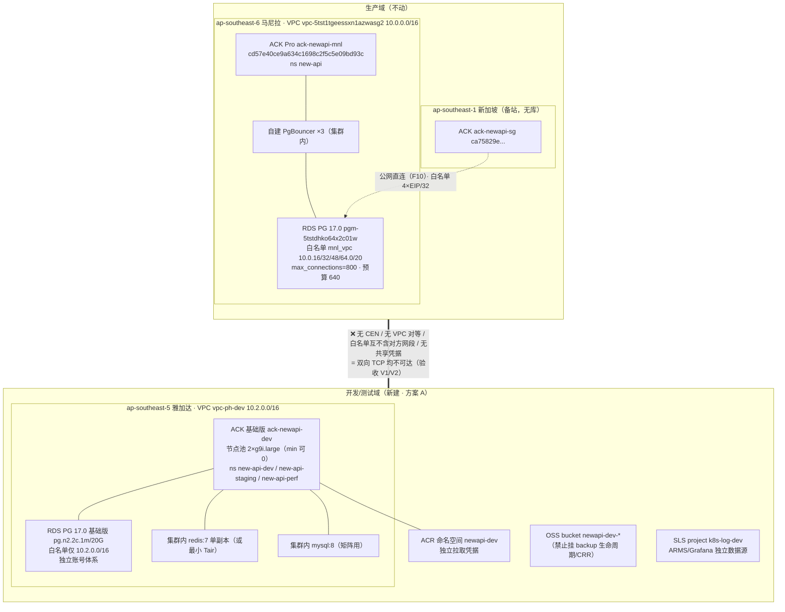

# 任务 45 环境隔离修订｜正式环境与 dev/test 彻底隔离（2026-09-29）

> 触发问题：原卡把 staging/perf 落在**马尼拉生产 ACK 集群的独立 namespace** + **复用生产 RDS 主实例的独立库**。要求是正式环境与开发/测试环境**彻底隔离、不能互通**。
>
> 结论先说：**不是只能靠 namespace，而且 namespace 达不到你的要求。** 本文件给出实测证据、可达的隔离档位、推荐拓扑，以及可直接粘贴的「任务 45」替换文本。
>
> 本轮**未执行任何创建/变更动作**，全部为只读复核命令；**未修改** `-v2.0.md`（改权威文档 + 影响成本，需按红线经远程第二方核准）。

---

## 1. 一句话结论

Namespace 是**组织与 RBAC 边界**，不是**网络边界**，也不是**数据边界**。在同一个 ACK 集群里，staging/dev Pod 与 prod Pod 共享：VPC 路由表、Terway 分配的 **VPC 内 Pod IP**、生产 RDS 白名单网段、节点池与内核、apiserver/etcd、ACR 拉取凭据、Worker RAM 角色。**你要的「不能互通」只能靠「不同 VPC + 不同实例 +（最好）不同账号」结构性实现，namespace 只配作为它们内部的成本切分手段。**

---

## 2. 实测证据（2026-09-29 16:3x，profile `ph-prod`，WSL Ubuntu）

| # | 命令（只读） | 关键输出 | 对隔离判断的意义 |
|---|---|---|---|
| E1 | `aliyun rds DescribeDBInstanceIPArrayList --DBInstanceId pgm-5tstdhko64x2c01w` | 白名单组 `mnl_vpc = 10.0.16.0/20,10.0.32.0/20,10.0.48.0/20,10.0.64.0/20` | 生产库按**整段 vSwitch 网段**放行，无 namespace/Pod 粒度 |
| E2 | `aliyun cs DescribeClusterDetail` | 节点 vSwitch `vsw-5tswpyzfa8od6je95td1h`(10.0.16.0/20) / `vsw-5tshuvvtrqm97tnwe1ddm`(10.0.32.0/20)，`pod_vswitch_ids=None`（Terway ENIIP 复用节点网段） | **同集群任何 Pod 的源 IP 天然落在 E1 白名单里** —— 这是决定性一条 |
| E3 | `kubectl get networkpolicy -A`（经 `deploy/ack_remote.sh`，节点内执行） | **空**（集群内 0 条 NetworkPolicy） | 今天集群内跨 namespace 是 **default-allow** |
| E4 | `kubectl -n kube-system get ds terway-eniip -o jsonpath={..containers[*].name}` | `terway` + **`policy`**（Pod 2/2 Ready） | NetworkPolicy 在这个集群**能生效**（policy sidecar 在跑）→ 但它是"策略层"控制，配错一条即失效，属可回退的软隔离 |
| E5 | `kubectl get nodes -o jsonpath={..nodepool-id}` | 只有一个 `npaad418131aa84c899be022b5463d13bf`（4 台，prod） | prod/staging 会落同一批节点：共享内核、kubelet、容器运行时、节点级 ephemeral 存储 |
| E6 | `aliyun quotas ListProductQuotas --ProductCode ecs-spec ... regionId=ap-southeast-6` | `q_ecs_enterprise_postpay_c total=64 used=32` | 马尼拉企业级 vCPU **64 硬顶**；prod 节点池 max=8×8C=64 → **峰值时余量为 0**，原卡的 2×g9i.xlarge perf 独立节点池**没有配额可落**（工单未提） |
| E7 | 同上，`regionId=ap-southeast-5` / `ap-southeast-3` / `ap-southeast-7` / `ap-southeast-1` | 雅加达 **50 / 已用 0**；吉隆坡 **50 / 0**；曼谷 **该配额项未列出**；新加坡 **96 / 16** | dev/test 放雅加达/吉隆坡**零配额冲突**；曼谷需先验证机型在售，不建议 |
| E8 | `aliyun rds DescribeAvailableZones --RegionId ap-southeast-5/3/7 --Engine PostgreSQL`；`aliyun r-kvstore DescribeAvailableResource` | 三区均返回 PostgreSQL 可用；Redis(社区版) 雅加达/吉隆坡均可购 | dev 实例选型不受产品目录限制 |
| E9 | `aliyun ecs DescribePrice`（Month，含 40G ESSD） | 雅加达 `ecs.g9i.large`=**66.41 USD**、`ecs.u1-c1m2.large`=**42.54 USD**；马尼拉 `g9i.large`=60.37、`u1-c1m2.large`=**PriceNotFound** | 成本可量化；顺带一条新事实：**u1（通用算力型）在马尼拉不可购**（原卡若想过配额走 u1，落不了地） |
| E10 | `aliyun rds DescribePrice ... ap-southeast-5 pg.n2.2c.1m 20G PostgreSQL/15.0` | listPrice **43.38 USD/月** | dev 独立 RDS ≈ 44 USD/月 |
| E11 | `aliyun rds DescribeDBInstances --RegionId ap-southeast-6` | **`pgm-5tstdhko64x2c01w` = PostgreSQL 17.0**（`pg.n4.2c.2m`） | ⚠ 原卡矩阵写「PostgreSQL 15 = 本次生产」**与现网不符**；dev/test 必须对齐 **17.0**，否则矩阵结论不可迁移 |
| E12 | `aliyun cbn DescribeCens` / `aliyun vpcpeer ListVpcPeerConnections` | 均 `TotalCount=0` | 现网**无 CEN、无 VPC 对等**：马尼拉/新加坡两 VPC 已不可达（备站走 RDS 公网）。新建 dev VPC 只要**不建这两样**就保持结构性不可达 |
| E13 | `aliyun cs DescribeClusterDetail` | prod `cluster_spec=ack.pro.small`、`deletion_protection=True`、`rrsa.enabled=True` | dev 可用 **ACK 基础版**（控制面免管理费，费用见 §6，需控制台核）；prod 的 RRSA 角色不复用 |

> E1+E2 合起来就是本文件的核心事实：**在同一 VPC 内，"namespace 隔离"挡不住 dev/test Pod 连生产库**——网络层它合法在白名单内，唯一的屏障只是"DSN 里的 dbname 和账号写对了"。对一个会扣钱的库，这是单层防御。

---

## 3. namespace 方案到底共享了什么（逐层）

| 层 | 同集群 + namespace 的现状 | 穿透路径（不需要"越狱"） |
|---|---|---|
| 网络 | 同一 VPC / 同一路由表 / Pod IP 同网段 | `psql "host=<prod-rds-vpc-host> dbname=newapi ..."` 直接可达（E1/E2）；NetworkPolicy 需每个 namespace 逐一写、默认不写（E3） |
| 数据 | 同一 RDS **实例**（同一 `max_connections=800`、同一 master 账号体系、同一备份链、同一参数组、同一 PITR 恢复单位） | ① staging 压测吃掉实例连接 → prod `FATAL: sorry, too many clients already`；② 一次 `DROP/ALTER` 误操作同实例跨库半径相同；③ PITR 恢复整实例 → 恢复动作会把 dev 数据一起回滚 |
| 身份 | 同一 Worker RAM 角色、同一 ACR 拉取凭据、同一账号 RAM 主体 | dev 部署 YAML 里贴 prod 的 `SQL_DSN` 就能起 Pod；CI 一套凭据同时能发 prod 与 staging |
| 调度/内核 | 同一批节点（E5）；taint 只影响调度，不影响连通性 | Pod 逃逸/内核漏洞的爆炸半径 = 节点 = 全集群 |
| 控制面 | 同一 apiserver + etcd + 同一 ACK 组件版本 + 同一升级窗口 | prod 集群组件升级/误删集群 = dev 一起没；反之 dev 把 apiserver 打满 = prod 探测失败被摘流量 |
| 观测 | 同一 SLS project / ARMS / Grafana 数据源 | 日志混查、告警串扰、SLS 账单互相污染 |

**判定：原卡 = 策略性隔离（soft），你的要求 = 可达性隔离（hard）。不达标。**

---

## 4. 三档方案对比

| 档 | 拓扑 | 隔离强度 | 马尼拉配额影响 | 增量成本 | 工期 | 判定 |
|---|---|---|---|---|---|---|
| **C（原卡）** | 同集群 namespace + NetworkPolicy + 同 RDS 实例独立库 | 软 | 需 8 vCPU（现无余量，E6） | 最低 | 最小 | ❌ 不满足要求，**废弃** |
| **B** | 马尼拉**独立 VPC** `10.2.0.0/16` + 独立 ACK + 独立 RDS/Tair | 硬（同 region） | ⚠ 必须提配额工单 64→88+，审批时长不可控（F2 只说批准后分钟级生效，未说审批时长）→ Day2 排期风险 | 中 | +1 张工单 | 达标，但把排期押在工单上 |
| **A（推荐）** | dev/test 落**雅加达 ap-southeast-5**：独立 VPC + 独立 ACK + 独立 RDS PG 17；不建 CEN/对等 | 硬（跨 region，物理不可达） | 零影响（E6/E7） | 低-中（§6） | 无新工单（配额 50 现成） | ✅ 达标且不碰生产资源、不碰马尼拉配额 |
| **A+（A 的加固）** | 在 A 之上，dev/test 用**资源目录下的独立成员账号** | 最硬（账号级：RAM/配额/账单/ActionTrail 全分离） | 零 | 同 A | 需项目负责人开 RD + 跨账号镜像/权限流程 | ✅ 若"彻底隔离"是审计/合规口径的要求，选这个 |

推荐 **A，并把 A+ 作为一次性向项目负责人提的决策项**（合规口径下"同账号不同资源组"通常不被认可为隔离；资源组只是计费/授权分组，**不是安全边界**）。

**为什么选雅加达而不是新加坡**：新加坡是生产备站 region（`vpc-t4nimmwvruexbnene0a3r`，且 F10 下备站直连马尼拉 RDS 公网）。dev/test 放进去会再次共享 NAT/EIP 池、配额、告警面，并让「新加坡不部署数据库」的口径变得要解释。曼谷（ap-southeast-7）该配额项未列出，机型未验证，不选。

---

## 5. 推荐拓扑与命名（方案 A）



资源与命名（全部新值，不与生产重名）：

| 资源 | 生产现值 | dev/test 新值 | 隔离要点 |
|---|---|---|---|
| Region | ap-southeast-6 | **ap-southeast-5** | 跨 region，无需 CEN 即不可达 |
| VPC / vSwitch | 10.0.0.0/16 | **10.2.0.0/16**，`vsw-dev-app-a 10.2.16.0/20` / `vsw-dev-app-b 10.2.32.0/20` / `vsw-dev-data-a 10.2.48.0/20` | 网段与 10.0/10.1 **不重叠**（避免将来误配路由即通）；**禁止创建 CEN / VPC 对等连接** |
| 安全组 | `sg-mnl-app` 等（`deploy/sg_ledger.md`） | `sg-dev-app`（新）| 普通安全组；**不写任何指向 prod SG 的组授权**，出方向 deny 10.0.0.0/16 与 10.1.0.0/16（双保险） |
| ACK | `cd57e40ce9a634c1698c2f5c5e09bd93c`（Pro） | 新建 `ack-newapi-dev`（**基础版**） | 独立 kubeconfig/context `dev`；prod context 不装进 dev CI runner |
| 主库 | `pgm-5tstdhko64x2c01w` PG **17.0** | 新建 `rds-dev-newapi` PG **17.0** 基础版 | 白名单**只放 10.2.0.0/16**；独立账号体系，prod 账号在 dev 不存在 |
| 缓存 | Tair（任务 15） | 集群内 `redis:7` 单副本（严格验证限流语义时再起最小 Tair 对照） | 版本 pin 到与 Tair 相同的 Redis 大版本，差异写进已知限制 |
| 矩阵 MySQL | —— | 集群内 `bitnami/mysql` 8.x | 原卡即允许此路径，落回 dev 更合理 |
| 镜像 | ACR `newapi` 命名空间 | ACR 命名空间 **`newapi-dev`**（或独立 ACR 实例） | 独立 pull secret；`latest` 禁止；dev 镜像 tag 前缀 `dev-` 便于误发识别 |
| 存储 | `oss-newapi-backup-*` | `oss-newapi-dev-*` | **不挂** `backup-data-tiering`/`backup-audit-tiering`/`backup-cleanup`/CRR→sgp 规则 |
| 密钥 | KMS + ExternalSecret + `new-api-rrsa-kms-mnl` | 独立 KMS 实例或独立 Secret 名 + **独立 RRSA 角色** `new-api-rrsa-kms-dev` | `SESSION_SECRET` 必须与 prod 不同（原卡坑 1 保留）；prod KMS Secret 对 dev 角色不可读 |
| 可观测 | SLS/ARMS/Grafana prod | 独立 project + 独立 Grafana 数据源/文件夹 | 告警路由分开，dev 告警不进 P1 值班通道 |
| 域名/流量 | `api.likha.com`（GTM+WAF+ALB） | **仅内网**：`*.dev.internal.likha.com` | ⚠ 禁止接 GTM/WAF/公网 ALB —— 否则切流演练时 dev 会被当成可切换目标 |
| 上游渠道 | 生产渠道 AK + 8 EIP 白名单 | 独立渠道密钥 + mock/record-replay | ⚠ dev 出口 EIP **不得**申请进上游白名单；压测禁止消耗生产渠道额度 |

Namespace 在新集群内继续用 `new-api-dev` / `new-api-staging` / `new-api-perf` —— 但此时它只是**成本/组织切分**，隔离由"不同账号/VPC/实例"承担。这是本修订的关键观念变化。

---

## 6. 成本与工期影响（实测单价）

常开最小集（雅加达，按量/包月取月价）：

| 项 | 规格 | 单价（实测） | 备注 |
|---|---|---|---|
| dev 节点 ×2 | `ecs.g9i.large` 2C8G + 40G ESSD | **66.41 USD/月·台** = 132.82 | 省钱档：节点池 `min=0/max=3`，跑测试才扩 → 稳态 ≈ 0 |
| dev 主库 | RDS PG 基础版 `pg.n2.2c.1m` / 20G | **43.38 USD/月** | 与 prod 同规格 `pg.n4.2c.2m` 只在 perf 轮次临时购买 |
| ACK 控制面 | 基础版 | 待控制台核（通常免管理费） | prod 用 `ack.pro.small` 计费，dev 不必同级 |
| Redis / MySQL | 集群内 Pod | 增量为节点资源占用 | 不新购实例 |
| 出网 | 小规格 NAT + EIP（按量） | 待任务 52 量化 | dev 不需要 8-EIP 池 |
| **稳态合计** | | **≈ 176 USD/月**（节点常开）／**≈ 44 USD/月**（节点 scale-to-zero） | 全部进任务 52 成本量化表新增一行 |

工期：**净增 ≈ 2 人时**（建 VPC/集群/RDS 各 1 条幂等脚本 + 一次性不可达验收）。原卡 3 人时不变（perf 全量矩阵仍顺延 T+14）。吸收来源：已顺延项里不回收的 Grafana 全量看板（1h）+ 任务 39 全量拨测（1h）——即"把 dev/test 隔离"换"不做的全量矩阵"，**这是等价交换，不是加量**。若项目负责人要求两者都要，按 §0.2 口径**书面报障工期缺口**，不许默默压缩不可顺延项。

perf 压测的口径变化（必须写进 M5/容量基线）：dev 实例（2C4G/20G）**测不出生产 p99**，只作功能与冒烟。凡结论要用于「HPA 16 副本可行性」「PgBouncer 切 transaction」「连接预算复验」的压测，必须在 perf 轮次临时买 **与 prod 同规格** `pg.n4.2c.2m` + 数据量对齐（原卡口径 ~8GB），用完即释放。这是任务 41 坑 1 门禁（矩阵未过禁止切 transaction）的**前提条件**，不是可选项。

---

## 7. 「任务 45」替换文本（可直接粘贴进 `-v2.0.md`，待核准后由 patch 脚本落地）

### Day 2 · 任务 45｜dev/test 独立环境 + 三数据库矩阵（单人 3h + 隔离净增 2h；**单人口径：Day2 仅最小三库冒烟，perf 全量矩阵顺延 T+14**）

**前置/状态**：任务 23 完成（复用 prod 镜像 SHA）。**隔离裁定（2026-09-29，替代原"同集群 namespace + 复用主实例"）**：dev/staging/perf 一律落 **雅加达 `ap-southeast-5` 独立 VPC `vpc-ph-dev` 10.2.0.0/16 + 独立 ACK 基础版 + 独立 RDS PG 17.0**；与生产**不建 CEN、不建 VPC 对等连接、安全组互不授权、RDS 白名单互不含对方网段、KMS/ACR/OSS/SLS/RAM-RRSA 全分离**。生产 RDS `pgm-5tstdhko64x2c01w` **不再**为 dev 建库建账号。
> 原卡「不新建实例以避免与"新加坡不部署数据库"红线冲突（§3.12 G13）」属**误引**：该红线约束的是**备 region 的数据独立性**（§12 排除项②、R19/R26 —— 备站有 schema 无独立数据），不是"不许再买任何 RDS 实例"。在雅加达为 dev/test 建独立实例**不触碰**该红线；反之，复用生产主实例会把 F11 的 640 连接预算变成一个未登记的公共变量。**本卡同时关闭 G13 门禁（原状态"待闭环"）。**

**操作步骤（CLI-first，全部走 WSL Ubuntu）**：

1. 网络与集群（幂等；创建动作属新增资源，仍需远程第二方核准）：

```bash
export ALIYUN_PROFILE=ph-prod REGION=ap-southeast-5
# 1.1 dev VPC（10.2.0.0/16，与 prod 10.0/10.1 不重叠）
aliyun vpc CreateVpc --RegionId $REGION --CidrBlock 10.2.0.0/16 --VpcName vpc-ph-dev --Description "ph dev/test only, MUST NOT peer with prod"
VPC_ID=$(aliyun vpc DescribeVpcs --RegionId $REGION --VpcName vpc-ph-dev | jq -r '.Vpcs.Vpc[0].VpcId')
aliyun vpc CreateVSwitch --RegionId $REGION --VpcId $VPC_ID --ZoneId ap-southeast-5a --CidrBlock 10.2.16.0/20 --VSwitchName vsw-dev-app-a
aliyun vpc CreateVSwitch --RegionId $REGION --VpcId $VPC_ID --ZoneId ap-southeast-5b --CidrBlock 10.2.32.0/20 --VSwitchName vsw-dev-app-b
# 1.2 dev 安全组：普通安全组（企业级不支持组授权，见任务 22 实测），出方向显式断 prod 网段
SG_DEV=$(aliyun ecs CreateSecurityGroup --RegionId $REGION --VpcId $VPC_ID --SecurityGroupName sg-dev-app --SecurityGroupType normal --Description "dev/test isolated" | jq -r '.SecurityGroupId')
aliyun ecs AuthorizeSecurityGroupEgress --RegionId $REGION --SecurityGroupId $SG_DEV --IpProtocol all --PortRange -1/-1 --DestCidrIp 10.0.0.0/16 --Policy drop --Priority 1
aliyun ecs AuthorizeSecurityGroupEgress --RegionId $REGION --SecurityGroupId $SG_DEV --IpProtocol all --PortRange -1/-1 --DestCidrIp 10.1.0.0/16 --Policy drop --Priority 1
# 1.3 ACK 基础版（节点池 min=0/max=3，g9i.large；配额实测 50/已用 0，无需工单）
#     集群参数照任务 10 模板，仅换 region/vswitch/sg/name；rrsa 按需关闭（dev 不挂 prod KMS 角色）
# 1.4 RDS PG 基础版（版本对齐 prod 实测 17.0，不要按旧卡的 15）
aliyun rds CreateDBInstance --RegionId $REGION --Engine PostgreSQL --EngineVersion "17.0" \
  --DBInstanceClass pg.n2.2c.1m --DBInstanceStorage 20 --DBInstanceNetType Intranet \
  --PayType Postpaid --Category Basic --VSwitchId <vsw-dev-app-a> --VpcId $VPC_ID \
  --SecurityIPList "10.2.0.0/16" --DBInstanceDescription rds-dev-newapi
```

2. 命名空间与三库矩阵（**全部在 dev 集群内**，SQLite/MySQL 走集群内组件，PG 走 dev 实例）：

```bash
kubectl --context dev create ns new-api-dev new-api-staging new-api-perf
# 矩阵（AGENTS.md：SQLite / MySQL>=5.7.8 / PostgreSQL>=9.6 三库同时可用）
#   SQLite      → Pod 内 emptyDir
#   MySQL 8     → 集群内 bitnami/mysql（helm，dev 集群内）
#   PostgreSQL  → dev RDS 实例库 newapi_dev / newapi_staging / newapi_perf（同实例=dev 实例，与生产无关）
#   ClickHouse  → 仅 LOG_SQL_DSN；F9 已定案，dev 默认不建 CK，日志库走 PG（记录为口径差异）
```

3. perf 环境：dev 集群内独立节点池带 taint `dedicated=perf:NoSchedule`；**压测目标永远是 dev RDS，绝不指向 `pgm-5tstdhko64x2c01w`**；凡产出用于生产的容量结论，须临时换 prod 同规格 `pg.n4.2c.2m` 一轮（§6）。

**验证方法（隔离性是本卡第一判据，先于功能冒烟）**：

```bash
# V1 结构性不可达（dev → prod，双向都必须失败）——在 dev 集群任一 Pod 内经云助手执行
nc -z -w2 pgm-5tstdhko64x2c01w.pg.rds.aliyuncs.com 5432; echo "prod RDS reachable? exit=$?"   # 期望 exit≠0
nc -z -w2 <prod-alb-intranet-ip> 443; echo "prod ALB reachable? exit=$?"                        # 期望 exit≠0
# V2 反向（prod Pod → dev 资源）同样必须失败
# V3 无互联通道（应为 0）
aliyun cbn DescribeCens --output json | jq '.Cens.Cen|length'
aliyun vpcpeer ListVpcPeerConnections --MaxResults 100 | jq '.TotalCount'
# V4 白名单互斥
aliyun rds DescribeDBInstanceIPArrayList --DBInstanceId pgm-5tstdhko64x2c01w \
  | jq -r '.Items.DBInstanceIPArray[].SecurityIPList' | grep -c '10\.2\.'       # 期望 0
aliyun rds DescribeDBInstanceIPArrayList --DBInstanceId <rds-dev-newapi> \
  | jq -r '.Items.DBInstanceIPArray[].SecurityIPList' | grep -c '10\.0\.'      # 期望 0
# V5 凭据/身份不互通
kubectl --context dev -n new-api-staging get secret -o jsonpath='{..name}' | grep -c prod      # 期望 0
# dev 集群不存在能解出 prod SESSION_SECRET / prod KMS Secret 的凭据
# V6 三库冒烟 + 压测基线（沿用原卡 V1/V2 命令，context 改为 dev）
# V7 镜像一致性：kubectl --context dev -n new-api-staging get deploy -o jsonpath='{..image}' | sort -u
#     期望：与 prod 同一 git SHA，不出现 latest，且带 dev- 前缀 tag 可识别
```

**不通过时修复**：
- V1 显示 prod RDS 可达 → 一定是有人建了 CEN/对等连接，或把 dev 网段加进了 `mnl_vpc` 白名单，或 dev 直接建在马尼拉 VPC 里 → 撤通道 → 复核 `aliyun cbn DescribeCens` / `DescribeDBInstanceIPArrayList` → 重测。
- V6 staging Pod readiness 不过 → 跨库 DSN/权限：用 dev 实例内各库 owner 账号，**不要**给任何 prod 实例账号授权；prod 账号权限保持不变。
- SQLite 冒烟失败 → 镜像内驱动缺失 → 回归 CI 三库并行必跑，修镜像后重测。

**坑**：
- 坑 1｜把 namespace 当隔离。**现象**：staging Pod 源 IP 落在 prod RDS 白名单网段内（Terway ENIIP 复用 vSwitch 网段，实测 `mnl_vpc=10.0.16.0/20,10.0.32.0/20,...`）。**后果**：一次 ConfigMap/env 贴错即连生产库；压测与生产抢同一 `max_connections=800`，触发 `too many clients already` → 全站 5xx + 计费写入失败（资损）。**改进**：隔离落在 VPC/实例/账号层；namespace 只做组织切分；NetworkPolicy 只作纵深防御（且必须先实测策略真生效——本集群 `terway-eniip` 有 `policy` sidecar 才生效，`kubectl get networkpolicy -A` 为空即等于全通）。
- 坑 2｜dev/test 用生产 `SESSION_SECRET`。**后果**：dev 签发的 token 在生产可用（越权/盗额度）。**改进**：dev 独立 KMS Secret；**但两个地域的 prod 之间必须相同**（§6.2 坑 3），两条规则不要混淆。
- 坑 3｜把生产数据导入 dev（图方便 `pg_dump` 一份）。**后果**：dev 环境立刻变成生产数据泄露面，审计与合规口径上"隔离"直接失效；且 dev 被入侵 = 生产数据外泄。**改进**：默认**禁止**生产数据入 dev，测试数据用合成造数；确需 prod 量级数据时走"脱敏导出 + 独立审批 + 只读单向"流程，并留 ActionTrail 证据。
- 坑 4｜dev/test 接 GTM/WAF/公网 ALB 图省事复用同一条链路。**后果**：切流/接管演练时 dev 被当成可切换目标，或 dev 成为攻击面入口。**改进**：dev 只用内网域名 `*.dev.internal.likha.com`，DNS 不挂公网、不进 GTM 地址池、不接 WAF。
- 坑 5｜dev 压测消耗生产上游渠道额度 / dev 出口 EIP 混进上游白名单。**后果**：8-EIP 白名单边界被稀释，配额被压测吃光，费用与限流互相污染。**改进**：dev 用独立渠道密钥 + mock/record-replay；dev 出口 IP 不进任何上游白名单申请。
- 坑 6｜perf 用 dev 小规格实例出的 p99 当生产容量结论。**后果**：HPA 16 副本、PgBouncer transaction 切换的门禁建立在错误数据上。**改进**：容量类结论必须用 prod 同规格 + 数据量对齐跑一轮，M5 里注明规格与数据量；否则只报"相对基线"不报"绝对容量"。
- 坑 7｜dev 版本与 prod 不一致（旧卡矩阵写 PG 15，现网实测 **17.0**）。**后果**：三库矩阵结论不可迁移，`ORDER BY NULLS`/`jsonpath`/`GENERATED` 等行为差异在生产才暴露。**改进**：dev 建 **17.0**；MySQL/SQLite 版本同理 pin，写进 CI 矩阵定义。
- 坑 8｜为了省钱把 dev 放马尼拉同 region 独立 VPC。**后果**：吃 `q_ecs_enterprise_postpay_c`（实测 total=64 / used=32，prod 峰值 max=8×8C=64 → 余量 0），需要新配额工单，Day2 排期押在审批时长上。**改进**：优先跨 region；若必须同 region，先提工单再开工，并把该依赖显式写进 G0 门禁。
- 坑 9｜`ecs.u1-*` 想当 dev 节点省钱。**现象**：`DescribePrice` 在马尼拉返回 `PriceNotFound`（雅加达 42.54 USD/月 有价）。**后果**：照抄方案落不了地。**改进**：dev 节点用 `g9i.large`；u1 只在雅加达可用时考虑，且注意 u1 也计入企业级 vCPU 配额（`g,c,r,u,hf,sn` 同一池）。
- 坑 10｜CI/凭据没跟着分家。**后果**：一套 runner 凭据同时能发 prod 与 dev → 环境隔离在网络层做到位，从发布通道又漏了。**改进**：dev 独立 runner + 只装 `dev` context；prod 发布必须在 prod runner 上；在 CI 里加"DSN 主机名含 `pgm-5tstdhko64x2c01w` 且 namespace ≠ new-api → 直接 fail"的策略规则。

---

## 8. 待裁定（默认按推荐执行，不阻塞）

| # | 决策 | 选项 | 默认 |
|---|---|---|---|
| D1 | dev/test 落点 | 雅加达（推荐）／马尼拉同 region 独立 VPC（需配额工单） | **雅加达** |
| D2 | 是否上「独立成员账号」（资源目录）—— 合规口径的彻底隔离 | 是／否 | **否**（先做方案 A，A+ 单列一条向项目负责人提请的合规决策） |
| D3 | perf 是否跑 prod 同规格一轮 | 是（容量结论可用）／否（只报相对基线） | **是**，一次性实例用完释放，费用进任务 52 |
| D4 | 节点池常开 vs scale-to-zero | 常开 ≈176 USD/月／零开 ≈44 USD/月 | **scale-to-zero**（dev/test 非上线关键路径） |
| D5 | 是否授权我据 §7 生成 patch 改 `-v2.0.md`（含差异表 #20、G13 门禁、§0.2 人时表、任务 45 卡、泳道 B 检查清单） | 是／否 | **否** —— 权威文档改动 + 成本变化，需远程第二方核准后我再落地 |

## 9. 只读复核命令（可随时重跑，幂等）

```bash
# 配额 / 产品目录
aliyun quotas ListProductQuotas --ProductCode ecs-spec --QuotaCategory CommonQuota \
  --Dimensions.1.Key regionId --Dimensions.1.Value ap-southeast-6 | jq '.Quotas[]|select(.QuotaActionCode=="q_ecs_enterprise_postpay_c")|{TotalQuota,TotalUsage}'
aliyun ecs DescribePrice --RegionId ap-southeast-5 --ResourceType instance --InstanceType ecs.g9i.large \
  --PriceUnit Month --SystemDisk.Category cloud_essd --SystemDisk.Size 40 --IoOptimized optimized
# 互联通道（必须恒为 0）
aliyun cbn DescribeCens | jq '.Cens.Cen|length'
aliyun vpcpeer ListVpcPeerConnections | jq '.TotalCount'
# 生产白名单（dev 网段 10.2. 必须恒不出现）
aliyun rds DescribeDBInstanceIPArrayList --DBInstanceId pgm-5tstdhko64x2c01w | jq -r '.Items.DBInstanceIPArray[]|"\(.DBInstanceIPArrayName): \(.SecurityIPList)"'
# 集群网络能力（policy sidecar + 现存策略数）
kubectl --context mnl -n kube-system get ds terway-eniip -o jsonpath='{.spec.template.spec.containers[*].name}{"\n"}'
kubectl --context mnl get networkpolicy -A --no-headers | wc -l
```

> CLI 实测坑（本轮命中）：`ecs DescribePrice` **无** `--NetworkType` 参数（写了直接报错）；`rds DescribePrice` **无** `--Category`；新版 CLI 提示可 `export ALIBABA_CLOUD_CLI_AI_MODE=1` 拿结构化错误 —— 附录速查里这两条参数名要更正。
