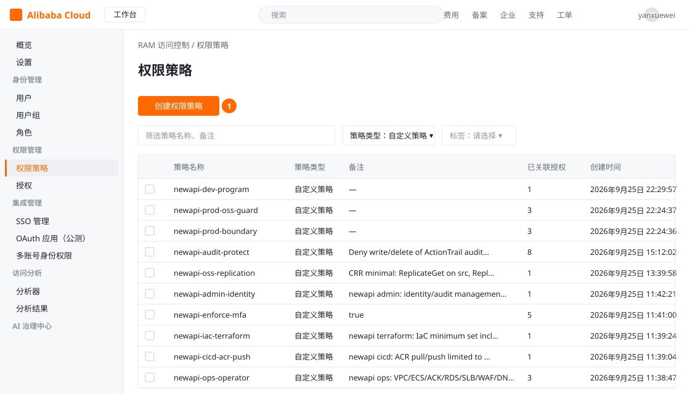
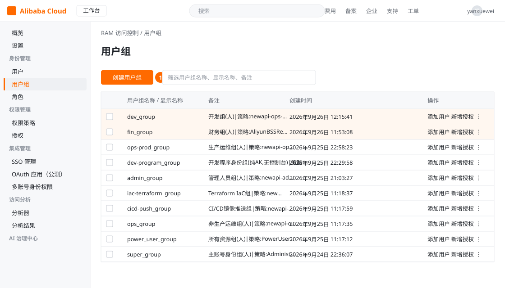
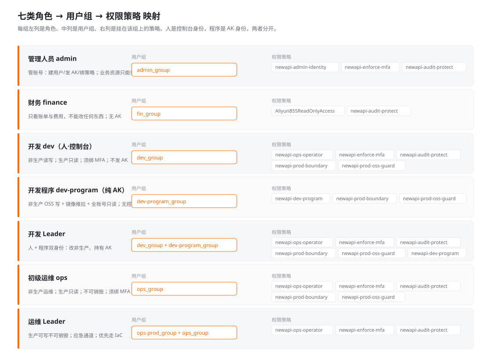
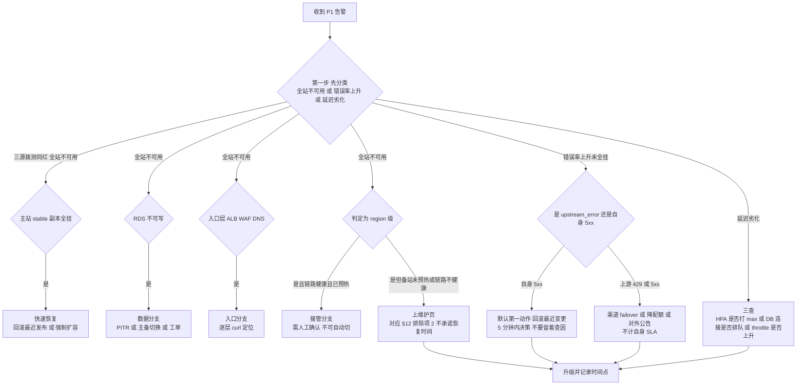
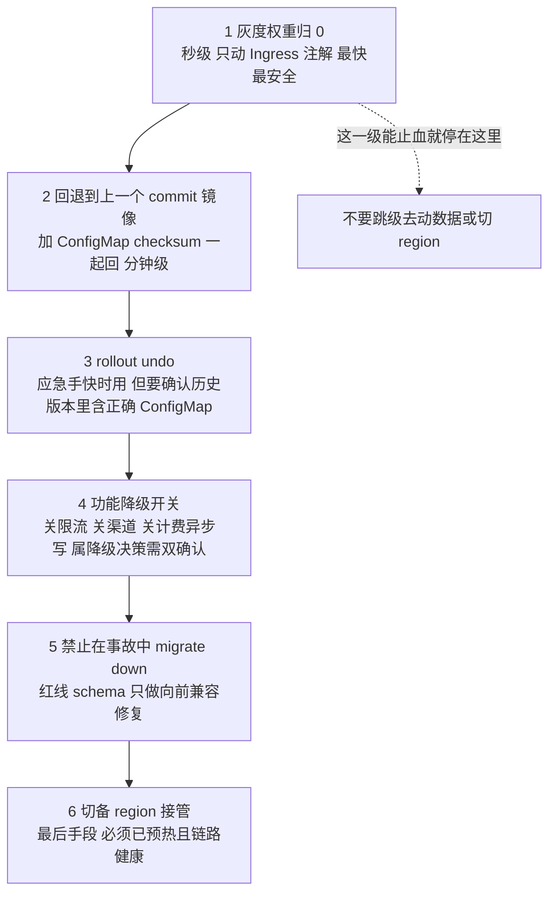

# 阿里云国际站菲律宾部署 · 详细操作指南 v2.0（4 天压缩日历 · CLI-first 版）

> **文档定位**：本指南是《阿里云国际站菲律宾部署_详细操作指南-ch.md》（v2.1 方案配套，D1–D9 口径）的 **v2.0 重写版**，两处根本变化：
> 1. **排期口径**：按用户决定压缩为 **1 人 × 4 个高强度日历日（Day 1–Day 4）**，每日分**日间窗（A）/午后窗（B）**两个串行执行窗口，全部 56 项任务重新挂窗（人力前提与顺延清单见 §0.2）；
> 2. **操作口径**：每步以 `aliyun` CLI / `kubectl` / `psql` 真实命令为主路径（AI agent 可直接执行），控制台独有操作标 **【控制台】** 并配截图占位；关键命令一律附「期望输出」文本作为即贴即证。
> 3. **本轮决策修订（2026-09-27）**：日志库改为**马尼拉云数据库 ClickHouse 企业版（单 AZ）**（F9）；连接收敛改为**自建 PgBouncer**（F10）；线上 RDS PG 实测 `max_connections = 800`，连接预算按 **800 × 0.8 = 640** 全量重算（F11）。
>
> **配套文件**：`.deploy/菲律宾部署方案-v2.1-修订版.xlsx`（任务/人时/验收标准唯一权威源）、`impl_deploy.md`（架构依据）、`.deploy/` 各落地执行报告（已落地事实源）。
> **任何一处与国际站控制台不一致，以控制台 + 工单答复为准。**

---

## 0.1 如何使用本指南

- **任务卡四段式**：每张卡固定「前置/状态 → 操作步骤（CLI-first）→ 验证方法 → 不通过时修复 → 坑」，按序照做即可；出错时只看对应段，不必通读。
- **证据三级约定**（替代 v1.0 的截图密集风格，红线不变：**禁止 AI 伪造截图**）：
  1. 命令「期望输出」代码块 —— 主证据，跑一条贴一条；
  2. `[图 D?-?-N｜拍摄对象：…；打码：…]` 占位 —— 仅【控制台】操作使用，上线前由人补拍真实截图并打码 AK/客户信息；
  3. `user-guide-images/*.svg` —— 仓库内已归档的 **真实控制台配图**（RAM/配额十张），直接内联引用。
- **密钥纪律**：全文不出现任何真实密钥/密码/DSN 口令，一律 `${PLACEHOLDER}`，实际值只进 KMS 凭据管家，经 RRSA + ExternalSecret 注入容器。
- **破坏性操作**（PITR 恢复、migrate、白名单摘除、drain、scale 0）均标注窗口与**远程第二方核准**（单人口径，见 §0.2），无核准不动手。

## 0.2 4 天口径的人力前提：1 人 × 4 天（用户指定口径，本节是该排期成立的前提）

排期口径为 **单人执行者（SP）× 4 天**，运转模型 =「AI agent 批量执行 CLI + 人类只做核验/签核/演练观察 + 远程第二方异步核准」：

| 口径 | 数值 |
| --- | --- |
| 名义投入（xlsx 权威） | **113 人时**（v2.0 复核降级后 ≈107） |
| 单人窗口预算 | 4 天 × 12h = **48 人时** |
| Agent 自动化折减 | 【Agent 执行】任务（复核/查询/申请/YAML apply/证据归档）按 **0.3–0.4 折**；【人必做】任务（控制台签核、四项演练、压测观察、发布） **不折** |
| 折减后净人时（近似） | ≈50 人时；**缺口 ≈2 人时，由顺延清单吸收** |

- **泳道重定义**：泳道 A = **日间窗（08:30–14:00）**，泳道 B = **午后窗（14:00–22:00）**。单人按卡序**串行**执行，不存在双人并行；agent 可提前并行跑只读步骤，但人工核验仍串行。
- **双人复核红线在单人模式不豁免**：破坏性操作（PITR 恢复、migrate、白名单摘除、GTM 强切、密钥轮换）一律改为**远程第二方（项目负责人）IM/工单核准留痕** + 本地命令输出归档；**核准不到 = 不动手**。
- **顺延 backlog（不进 4 天线，T+14 内必须闭环，残余项写入移交已知限制）**：任务 52 成本量化（2h）、任务 45 staging 全量三库矩阵（3h→仅保留最小三库冒烟）、任务 39 全量拨测矩阵（1h→仅保留单点最小拨测）、任务 35 完整移交与影子值班（2h→Day 4 只备料，移交 T+3 执行）、Grafana 全量看板（1h→只建 P1 告警 4 面板）。
- **不可顺延清单不变**：PITR/接管/灰度/轮换四项演练、G8 代码补项、自建 PgBouncer 与连接预算、白名单收口、SESSION_SECRET 一致性——砍它们只能以**下调 SLA 承诺**为代价并书面签字。
- 三条硬约束（详见 Day 4「4 天压缩的已知取舍」）：
  1. **外部等待项必须全部在 Day 0 前闭环**：企业实名（1–3 工作日）、域名 NS 生效（24–48h）、通配符证书签发（1–24h）、上游白名单提交（生效可能 1–3 工作日）、staging 审批——单人模式无并行度可吸收任何 24h 级等待；
  2. 窗口出口检查不通过 → 触发「裁剪三原则」降级或整体顺延，**不带病进入下一窗口**；
  3. 裁剪只允许按「裁剪三原则」执行（见附录章）。

## 0.3 4 天 × 泳道甘特总览


| 日历日           | 泳道 A = 日间窗（08:30–14:00）                                                                        | 泳道 B = 午后窗（14:00–22:00）                                                                             | 当日里程碑                          |
| ------------- | ---------------------------------------------------------------------------------------------- | --------------------------------------------------------------------------------------------------- | ------------------------------ |
| **Day 0（前置）** | G1–G13 门禁全闭环（实名/域名/证书/配额/RAM/代码补项 G8 合并）                                                       | SP 逐条打勾，agent 跑全部复核命令出证据                                                                            | **G0 通过，否则 Day 1 不启动**         |
| **Day 1**     | 网络、出口、证书、ACR、域名解析（任务 5/12/6/3/16/1/2）                                                          | 数据库、缓存、OSS、日志库（马尼拉企业 CK，F9）、自建 PgBouncer + 800 连接预算（F10/F11）、跨区数据链路（任务 4/13/14/7/8/9/15/41/29/30）   | **M1**：网络+数据底座就绪               |
| **Day 2**     | ACK、节点池(g9i)、RRSA/KMS、master 迁移、autoscaler、migrate 版本化、运维访问面（任务 10/11/24/42/17/46/18/54）       | ALB、stable、备 Deployment、SG ALB、GTM、SYNC_FREQUENCY 收敛、staging 最小三库冒烟（任务 19/23/28/25/21/53/45）        | **M2**：集群+应用底座就绪，主站 token 备站可用 |
| **Day 3**     | 安全组/白名单逐条核对、WAF、证书部署、回调白名单、双密钥轮换、上游配额、安全核查 15 项（任务 22/47/20/40/48/55/56/38；**52 成本量化顺延 T+14**） | SLS/Prometheus/Grafana（最小面板）、SLO 看板与值班、HPA 容量基线、canary 灰度演练、PITR、主库切换演练（任务 26/32/43/44/27/31/50/37） | **M3**：安全可观测收口 + 四项演练通过        |
| **Day 4**     | 压测 S1–S10、限流参数校准、上线检查表、正式发布（任务 33/51/34）                                                       | 备区接管演练（预热+切换+回切）、备区最小拨测、移交备料（任务 36/49/39/35；完整移交 T+3）                                               | **M4 + M5**：容量达标、上线、进入 72h 冻结窗 |

> 单人模式：**先做完 A 窗全部卡，再做 B 窗卡**；泳道 A/B 不再代表两人并行，只代表同日内的两个执行窗口。

## 0.4 56 项任务 → 4 天映射总表（对照 v2.1 原排期）

> **单人口径说明**：本表「角色」列仅表示该卡归属**日间窗（A）或午后窗（B）**，不再表示不同人员；「人时」为 v2.1 名义值，实际执行按 §0.2 的 Agent 折减系数计。带 ✅ 的卡只做复核。

| 任务# | 标题（简）                                    | v2.1 原日 | **v2.0 位置**           | 角色  | 人时       |
| --- | ---------------------------------------- | ------- | --------------------- | --- | -------- |
| 1   | G0 收口                                    | D1      | Day1·A                | A   | 1        |
| 2   | 域名 NS 复核+预建解析                            | D1      | Day1·A                | A   | 1        |
| 3   | 证书就绪与预置                                  | D1      | Day1·A                | A   | 1        |
| 4   | RDS PG 高可用版                              | D1      | Day1·B                | B   | 2        |
| 5   | 马尼拉 VPC+6 vSwitch                        | D1      | Day1·A ✅已完成           | A   | 4→复核 0.5 |
| 6   | 马尼拉 NAT+EIP 池                            | D2      | Day1·A                | A   | 2        |
| 7   | Tair 主备 4GB                              | D1      | Day1·B                | B   | 1        |
| 8   | OSS Bucket                               | D1      | Day1·B ✅已完成           | B   | 1→复核 0.5 |
| 9   | 日志库 CK 决策（修订：马尼拉企业单 AZ）                  | D1      | Day1·B ✅决策已修订         | B   | 2→复核 0.5 |
| 10  | ACK Pro 马尼拉                              | D2      | Day2·A                | A   | 2        |
| 11  | 马尼拉节点池 4×g9i.2xlarge                     | D2/D4   | Day2·A                | A   | 4        |
| 12  | 新加坡 VPC/NAT/EIP                          | D2      | Day1·A（VPC ✅已建）       | A   | 2        |
| 13  | RDS 账号最小化                                | D2      | Day1·B                | B   | 1        |
| 14  | RDS 备份 PITR+WAL                          | D2      | Day1·B                | B   | 1        |
| 15  | RDS 公网+白名单收死                             | D3      | Day1·B                | B   | 2        |
| 16  | 马尼拉 ACR+CI 推镜像（单地域）                       | D1      | Day1·A                | B   | 1        |
| 17  | RRSA+KMS+ExternalSecret+ConfigMap/Secret | D2/D3   | Day2·A                | B   | 3        |
| 18  | master AutoMigrate 幂等                    | D4      | Day2·A                | B   | 3        |
| 19  | 马尼拉 ALB+AlbConfig                        | D3      | Day2·B                | A   | 3        |
| 20  | WAF 3.0+CC+回调源 IP                        | D5      | Day3·A                | A   | 2        |
| 21  | GTM 先只挂马尼拉                               | D5      | Day2·B                | A   | 2        |
| 22  | 安全组白名单逐条核对                               | D5      | Day3·A                | A   | 2        |
| 23  | stable 4 副本+PDB+HPA+反亲和                  | D5      | Day2·B                | B   | 3        |
| 24  | 新加坡 ACK+2 节点池                            | D3      | Day2·A                | A   | 2        |
| 25  | 新加坡 ALB+Service/Ingress                  | D6      | Day2·B                | A   | 2        |
| 26  | SLS/Prometheus/Grafana/站点监控              | D6      | Day3·B                | B   | 3        |
| 27  | canary+独立 Service/Ingress                | D6      | Day3·B                | B   | 2        |
| 28  | 新加坡 PH 备 Deployment                      | D4      | Day2·B                | B   | 2        |
| 29  | 新加坡本地 Tair（日志库并入马尼拉 CK 企业版）              | D4      | Day1·B                | B   | 1→0.5    |
| 30  | 备区→马尼拉 RDS 公网读写+RTT 实测                   | D7      | Day1·B                | B   | 2        |
| 31  | 灰度 5→20→50→100 与回滚演练                     | D7      | Day3·B                | B   | 3        |
| 32  | SLO/错误预算看板+告警+值班                         | D7      | Day3·B                | B   | 2        |
| 33  | 压测验收（SSE 1500/管理面 800QPS）                | D8–D9   | Day4·A                | A+B | 4        |
| 34  | 上线检查表+冻结+正式发布                            | D8–D9   | Day4·A                | A+B | 2        |
| 35  | 移交运维                                     | D9      | Day4·B                | A+B | 3        |
| 36  | 备区接管演练（GTM 强切）                           | D8–D9   | Day4·B                | A+B | 4        |
| 37  | 主库故障切换演练                                 | D7      | Day3·B                | A   | 2        |
| 38  | 上线前安全核查 15 项                             | D6      | Day3·A                | A+B | 3        |
| 39  | 备区链路拨测与告警                                | D8–D9   | Day4·B                | B   | 2        |
| 40  | 证书部署 ALB/WAF/DCDN+SNI                    | D6      | Day3·A                | A   | 1        |
| 41  | 自建 PgBouncer + 800 连接预算 I-1/I-2/I-3      | D2      | Day1·B                | B   | 3        |
| 42  | cluster-autoscaler 双集群                   | D6      | Day2·A                | A   | 2        |
| 43  | 主站 HPA 4–16+容量基线 C                       | D7      | Day3·B                | A   | 3        |
| 44  | 备区 HPA 2–24+1.5× 接管                      | D7      | Day3·B                | A   | 2        |
| 45  | staging/perf+三数据库矩阵                      | D4      | Day2·B（顺延 T+14，仅最小冒烟） | B   | 3→1      |
| 46  | 运维访问面 kubeconfig+RBAC+堡垒机                | D5      | Day2·A                | A   | 2        |
| 47  | ALB 安全组源收敛+SNI 复验                        | D7      | Day3·A                | A   | 1        |
| 48  | 支付回调白名单+签名校验                             | D6      | Day3·A                | B   | 2        |
| 49  | 备区 Tair 预热+warmup                        | D8–D9   | Day4·B                | B   | 2        |
| 50  | PITR 恢复演练（记录 RPO/RTO）                    | D3      | Day3·B                | B   | 2        |
| 51  | 上游 RPM/TPM 盘点+限流校准                       | D8–D9   | Day4·A                | B   | 2        |
| 52  | 带宽与成本量化表                                 | D6      | **顺延 T+14（不进 4 天线）**  | B   | 2→0      |
| 53  | SYNC_FREQUENCY=30 收敛验证                   | D7      | Day2·B                | B   | 1        |
| 54  | golang-migrate+expand-contract           | D6      | Day2·A                | B   | 2        |
| 55  | SESSION_SECRET 双密钥轮换演练                   | D6      | Day3·A                | B   | 2        |
| 56  | 上游 IP 白名单提交与生效确认                         | D3      | Day1 提交/Day3 确认       | A   | 1        |

人时合计（复核降级后）名义 ≈ **107**。**单人口径不假装数学成立**：4 天 × 2 窗 × 约 6h = 48 人时窗口；Agent 批量执行按 §0.2 折减系数 0.3–0.4 后净需求 ≈ **50 人时**，缺口约 2 人时由顺延 backlog（任务 52 全量、任务 45 全量矩阵、任务 39 全量拨测、任务 35 完整移交、Grafana 全量看板）吸收。**当晚不顺延到次日窗口**：任一窗口检查不过，只做两件事——按「裁剪三原则」裁剪，或把不可裁剪项（四项演练 / G8 / PgBouncer 连接预算 / 白名单收口 / SESSION_SECRET 一致性）明确升级为工期风险并向项目负责人书面报障。

## 0.5 最新事实修订（相对 v2.1 与 -ch.md 的增量，全指南已按此改写）

| # | 事实 | 状态 | 对指南的影响 |
| --- | --- | --- | --- |
| F1 | **节点池机型 = ecs.g9i.2xlarge（8C32G）**：g8i 全系未在马尼拉上架（2026-09-25 API 实测，`控制台核实四问_结论.md` §3），备选 g8ine.2xlarge | 已修订入任务 11/24 | Day 2 开工第一动作 = `aliyun ecs DescribeAvailableResource` 复验库存 |
| F2 | **ECS vCPU 配额已批**：马尼拉 50→64、新加坡 50→96（工单 `b140e263-…` / `e117bf2b-…`，状态 `Agree`，分钟级生效） | G2/G10 部分闭环 | 任务 11 节点上限 8、任务 24 上限 12 与配额对齐 |
| F3 | **配额 API 口径**：必须带 `--Dimensions.1.Key regionId --Dimensions.1.Value <regionId>`（否则返回 cn-hangzhou）；申请参数拼写 `--DesireValue`；状态值 `Agree` | 已修订入 §3.4 口径与附录速查 | 所有配额命令按此改写 |
| F4 | **真实 VPC 已建**：`vpc-newapi-mnl-prod`=`vpc-5tst1tgeessxn1azwasg2`（10.0.0.0/16，6 vSwitch 按 §2.2 网段落地）；`vpc-newapi-sg-prod`=`vpc-t4nimmwvruexbnene0a3r`（10.1.0.0/16） | 任务 5 ✅、12 部分 | 对应卡降级为复核 |
| F5 | **OSS 已建**：生命周期 30d→IA/90d→Archive **被双可用区 ZRS 产品限制否决**，实际落地 `backup-data-tiering` / `backup-audit-tiering` / `backup-cleanup`；CRR→`oss-newapi-backup-sgp` 实测成功 | 任务 8 ✅ | 所有引用旧分层规则的核查项改按新规则 |
| F6 | **RAM 已落地**：admin/ops（MFA、无 AK）、cicd-push/iac-terraform（程序 AK）、dev-zhangzijun/dev-xiangdong（程序 AK 无控制台）、ops-prod_group 用户组已建；yanxuewei 遗留 AK 待降权 | G9 大部闭环 | 任务 46 直接引用真实用户/组 + 归档 SVG 配图 |
| F7 | Tair / RDS 配额需在**产品开通后复查**（配额中心按产品分组，未开通时查不到） | 未闭环 | Day 1 泳道 B 首步执行 |
| F8 | 账号 ID `5108890064395960`；域名 `api.likha.com` / `ops.likha.com`；**镜像源改单地域马尼拉**，前缀以实测 EE 域名为准（见任务 16 基线表） | 基线参数 | §2 参数表按真值更新；全文旧 `registry-vpc.ap-southeast-6.aliyuncs.com/newapi/new-api` 已订正 |
| F9 | **马尼拉可用「云数据库 ClickHouse 企业版（单可用区）」**（2026-09-27 复核）：社区版无马尼拉，企业版单 AZ 可在 `ap-southeast-6` 购买 | ✅ 决策已修订 | 日志库 `LOG_SQL_DSN` 收口马尼拉，**不再购买新加坡 CK**；任务 9/29/52、差异表 #1、M1 证据、风险表、裁剪表全部按此改写；单 AZ 故障域以「日志不入 SLA 证据链 + 写失败可降级」对冲 |
| F10 | **PgBouncer 采用自建方案**（ACK 集群内 3 副本），RDS 托管数据库代理不启用 | ✅ 已定 | 任务 41 改写为自建部署 + 分层 TLS；任务 15/30 明确新加坡备站**直连 RDS 公网、不经池**；PgBouncer 从「保险」升级为**切流硬性前置** |
| F11 | **线上购买 RDS PostgreSQL 规格实测 `max_connections = 800` 且用户不可改** | ✅ 实测 | 服务端可用预算封顶 800×0.8=**640**；`SQL_MAX_OPEN_CONNS` 默认 1000 与「16 副本 × 数百」直连方案在数学上全部作废；连接预算（任务 41/43、G11）按 640 重算；更换规格必须重跑 `SHOW max_connections` |

## 0.6 进展快照（截至 2026-09-27，开工前必读，防止重做）

**已完成、只做复核**：任务 5（VPC/vSwitch）、任务 8（OSS 桶与规则）、任务 9（日志库决策**已按 F9 修订**：马尼拉 ClickHouse 企业版单 AZ 可用，日志库收口马尼拉，不再购买新加坡 CK）、任务 12 之 VPC、G2/G10（ECS 配额 Agree）、G9（RAM/MFA/ActionTrail 投递）、G3（可下单已验证）。
**复核后仍欠一项写操作**：任务 16（ACR 实例已建，但 **VPC 端点未关联马尼拉 VPC → `LinkedVpcs=[]`**，VPC 内拉取当前不通；CI 推送亦待复验）。详见该卡 2b。

**统一复核命令（跑完贴输出即销账）**：

```bash
aliyun sts GetCallerIdentity | jq -r '.AccountId'    # 期望 5108890064395960
aliyun vpc DescribeVpcs --RegionId ap-southeast-6 | jq -r '.Vpcs.Vpc[]|[.VpcId,.CidrBlock,.VpcName]|@tsv'
aliyun vpc DescribeVSwitches --RegionId ap-southeast-6 --PageSize 50 | jq -r '.VSwitches.VSwitch[]|[.VSwitchId,.ZoneId,.CidrBlock]|@tsv'
aliyun oss ls | grep -E 'newapi|registry'   # 期望 oss-newapi-mnl / oss-newapi-backup-sgp / cri-*-registry
aliyun clickhouse DescribeDBInstances --RegionId ap-southeast-6 | jq '.Data.TotalCount'   # 任务 29 未建=0；建成后为 1（F9）
aliyun quotas ListQuotaApplications | jq -r '.QuotaApplications[]|[.ProductCode,(.DesireValue|tostring),.Status]|@tsv'   # G2/G10：期望 ecs-spec 64 / 96 均 Agree
aliyun quotas ListProductQuotas --ProductCode ecs-spec --QuotaCategory CommonQuota --RegionId ap-southeast-6 \
  --Dimensions.1.Key regionId --Dimensions.1.Value ap-southeast-6 \
  | jq -r '.Quotas[]|[.QuotaActionCode,(.TotalQuota|tostring),(.TotalUsage|tostring)]|@tsv'   # 期望 q_ecs_enterprise_postpay_c=64
aliyun ram ListUsers | jq -r '.Users.User[]|.UserName'   # 期望 admin/ops/cicd-push/iac-terraform/dev-*（另有 zhangzijun/xiangdong/yanxuewei 待核）
```

> **命令口径校正（2026-09-28 于 WSL 用 aliyun CLI 3.5.1 逐条实测，勿改回）**：
> 1. **API 名**：ClickHouse 列实例是 `DescribeDBInstances`（**没有** `DescribeDBClusters`，写了会报 `is not a valid api`）。
> 2. **`Agree` 状态属于 `ListQuotaApplications`**，不是 `ListProductQuotas`——后者返回的配额对象**没有 `Status` 字段**（实测 26 条全为 `null`）。用 `select(.Status=="Agree")` 过滤会得到**空结果且退出码 0**，脚本据此判"已销账"= **假通过**。
> 3. **配额取数路径**：vCPU 类配额在 `--ProductCode ecs-spec` 下（`--ProductCode ecs` 只返回 26 条通用配额，**查不到 vCPU**）。`--ProductCode` 是唯一合法参数名（`--Product` 报 not valid）；`--QuotaCategory` 合法值是 `CommonQuota`（`Common` 报 `InvalidQuotaCategory`）；分页参数是 `--MaxResults`（`--PageSize` 报 not valid）。
> 4. **jq 路径**：`ListProductQuotas` 返回 `.Quotas[]`（数组）；写 `.Quotas.Quota[]?` 恒空。
> 5. **退出码**：CLI 对错 API 名 / 错参数名返回 **2**，jq 语法错返回 **3**；但 `jq`（不带 `-e`）遇到空集返回 **0** —— 巡检脚本应加 `jq -e` 或校验非空输出。
>
> **一键版**：以上 8 项已封装为 `deploy/verify_deploy_0_6.sh`（全部取值走 `jq -e`，空结果即判失败，不会假通过）。
>
> ```bash
> # WSL（默认环境）
> wsl -d Ubuntu -u root -- bash /mnt/e/git_code/new-api-yxw/deploy/verify_deploy_0_6.sh
> # macOS / Linux
> bash deploy/verify_deploy_0_6.sh
> # 严格模式：WARN 也计为未通过（RC≠0），供门禁使用
> STRICT=1 bash deploy/verify_deploy_0_6.sh
> ```
>
> 输出按 **PASS / WARN / FAIL** 三档给出，原始响应落盘 `deploy/logs/verify_0_6_<时间戳>/`（已在 `.gitignore` 内）。
> **`WARN` 不等于通过**，需人工确认后勾销 —— 当前两项长期 WARN：CK 实例未建（任务 29）、RAM 遗留账号 `zhangzijun` / `xiangdong`。

**仍未闭环、Day 0 前必须完成**：G1 实名 `Verified`、G4 NS 指向阿里云、G5 证书 `Issued`（含 SAN `*.likha.com`）、G6 配置模板 PR、G7 产品开通（含 Tair/CK 决策落地）、**G8 代码补项（/healthz、/readyz、/metrics + 限流降级放行）合并**、G11 连接数预算表、G12 SLA 口径签字、G13 staging 方案、上游 8 EIP 白名单提交。

## 0.7 G0 门禁判定表（Day 1 启动前逐条打勾，任一未过不启动）

| 编号 | 事项 | 证据 | 当前状态 | 通过 |
| --- | --- | --- | --- | --- |
| G1 | 企业实名 `Verified` | 截图 | 待闭环 | ☐ |
| G2 | 马尼拉配额批复 | 工单号 b140e263-…（ECS 已 Agree） | ECS 部分闭环，Tair/RDS 待 F7 复查 | ☐ |
| G3 | 可下单（测试 EIP） | 资源 ID | 已验证 | ☐ |
| G4 | `dig NS` 指向阿里云 | 命令输出 | 待闭环 | ☐ |
| G5 | 证书 `Issued` + SAN `*.likha.com` | openssl 输出 | 待闭环 | ☐ |
| G6 | 配置模板 PR 已合并 | PR 链接 | 待闭环 | ☐ |
| G7 | 全部产品开通（含 CK 决策按 F9 修订：马尼拉企业版单 AZ） | 控制台列表 | 待闭环 | ☐ |
| G8 | `/healthz` `/readyz` `/metrics` + 限流降级 **已合并** | commit/MR | **待闭环——未完成则 SLA 承诺下调** | ☐ |
| G9 | RAM + MFA + 操作审计投递 | 跟踪状态 | 已落地（F6），补 yanxuewei 降权 | ☐ |
| G10 | 新加坡 ≥96 vCPU | 工单号 e117bf2b-…（Agree） | 已闭环 | ☐ |
| G11 | 连接数预算表（真实 env 值与 **800 上限（F11）**，默认 1000 陷阱） | 文档 | 待闭环 | ☐ |
| G12 | SLA 口径五条 + 4 排除项书面确认 | 邮件回执 | 待闭环 | ☐ |
| G13 | staging/perf 方案 | 文档 | 待闭环 | ☐ |

## 0.8 目录

- 第 1 章 【必读】v2.1 与国际站现实差异清单（P0×7 / P1×14，含 v2.0 已修订状态）
- 第 2 章 全局基线参数与命名规范（真实 ID 版）
- Day 1 · 泳道 A：网络、出口、证书与镜像底座（part1b）
- Day 1 · 泳道 B：数据库、缓存、对象存储与跨区数据链路（part1a）
- Day 2 · 泳道 A：ACK 集群、节点池、密钥链路与迁移版本化（part2a）
- Day 2 · 泳道 B：Deployment、ALB、GTM 与异地备集群（part2b）
- Day 3 · 泳道 A：安全组、WAF、证书、密钥轮换与安全核查（part3a）
- Day 3 · 泳道 B：可观测、HPA 容量与灰度/故障演练（part3b）
- Day 4：验收、压测、接管演练、正式上线与移交 + 里程碑/SLA（part4）
- 回滚与应急预案 + 附录（part5）

---

## 1. 【必读】方案 v2.1 与国际站现实的差异清单（v2.0 状态版）

> 核对时间 2026-09-24/25/26 多轮实测。**「不可用」= 官方支持地域列表未含 `ap-southeast-6`**；列表会变，动手前一律 `【控制台核实】`。「v2.0 状态」列记录本轮压缩排期时的最新结论。

### 1.1 会直接阻塞工期的差异（P0）

| # | 方案 v2.1 原写法 | 国际站现实 | 后果 | 本指南做法 | v2.0 状态 |
| --- | --- | --- | --- | --- | --- |
| 1 | 马尼拉 RDS ClickHouse 社区版承载 `LOG_SQL_DSN` | 社区版无马尼拉；**企业版（单可用区）可在马尼拉购买**（2026-09-27 复核） | 社区版方案不成立；企业版单 AZ 故障域 = 1 个 AZ | **改用马尼拉云数据库 ClickHouse 企业版（单 AZ）**；以「日志库不入 SLA 证据链 + 写失败可降级」对冲单 AZ 风险 | ✅ 决策已修订（F9），任务 9/29 已按新决策改写 |
| 2 | ACK 1.31+ | 仅可建 **1.34/1.35/1.36**，1.31/1.33 已 EOL | 选不到/EOL 裸奔 | 统一 1.35，一次只升一个次版本 | 任务 10/24 已按 1.35 写 |
| 3 | 节点规格 g8i.2xlarge | **g8i 全系未在马尼拉上架**（2026-09-25 实测） | 节点池选不到机型，Day2 卡死 | 先 `DescribeAvailableResource` 再定机型；多机型+双 AZ | ✅ 已改 **g9i.2xlarge**，备选 g8ine.2xlarge（F1） |
| 4 | 备区经 RDS 公网 `verify-full` 读主库 | SSL 证书 CN/SAN 绑定开 SSL 时所选连接地址；经 PgBouncer 由代理出具 | 握手失败，备区连不上主库 | 证书地址**选公网**；走 PgBouncer 降 `verify-ca`+代理侧证书，三条路径 | ✅ 已定**自建 PgBouncer**（F10）：SG 直连公网 `verify-full`（路径 A 为主路径）+ 应用→池→RDS 分层 TLS；任务 15/30/41 保留全部分支 |
| 5 | ALB `requestTimeout=180s` | ALB 超时范围 [1,600]s，默认 60 | >600s 请求无解；60s 掐长回答 | 显式 600s + 网关 15–20s SSE ping；600s 硬上限写进合同 | 任务 19/25 卡保留 |
| 6 | SG 仅放行 WAF/DCDN 回源段 | WAF 3.0 对 ALB 支持**云原生接入（透明集成）**且支持马尼拉，不产生回源网段 | 按 CNAME 配白名单=白做，漏一条大面积 5xx | 优先 WAF 云原生接入；仅 DCDN 才 `DescribeDcdnL2Ips` | 任务 20/22/47 卡已按此写 |
| 7 | 申请免费通配符证书 | 国际站**无免费 DV 额度**；2026-02-25 起单证最长约 199/200 天，1 年拆两张 | 半年后全站 HTTPS 报错 | 购 DigiCert/GlobalSign/Rapid 通配符 + 托管自动续期与部署 | 任务 3/40 卡保留 |

### 1.2 需要改口径的差异（P1）

| # | 方案原写法 | 现实 | 调整 | v2.0 状态 |
| --- | --- | --- | --- | --- |
| 8 | 隐含多可用区 | 马尼拉仅 **6a/6b 两个 AZ** | 3AZ 一律不可行，ALB/RDS 锁死双 AZ | 全指南按双 AZ |
| 9 | RDS `max_connections` 可调 | 由规格决定，**用户不可改**；**线上购买规格实测上限 800（F11）** | 服务端预算封顶 640；三选一：升规格（重测）/自建 PgBouncer/降 `SQL_MAX_OPEN_CONNS` | ✅ 预算已重算（任务 41/43、G11） |
| 10 | RDS 代理疑似 MySQL 专属 | PG 高可用系列支持**数据库代理** | 两路可用，代理省事但功能面窄 | ✅ v2.0 弃用托管代理，定**自建 PgBouncer**（F10）：transaction pooling 可控、单一收敛层 |
| 11 | Grafana 建马尼拉 | Grafana 版不含马尼拉 | 工作区建 `ap-southeast-1`，数据源指马尼拉 Prometheus | 任务 26 卡保留 |
| 12 | Prometheus+APM 马尼拉 | Prometheus ✅ 可用；ARMS **APM 未确认** | APM 未确认前不入 SLA 证据链 | 任务 26/32 卡保留 |
| 13 | 云监控站点监控当证据 | 海外探测点少，马尼拉未确认 | 三重兜底：GTM 探测 + 多地 ECS 自建 + blackbox | 任务 26/39 卡保留 |
| 14 | OSS ZRS | 马尼拉是否可选需购买页确认 | 无 ZRS 则 LRS+版本控制+CRR 新加坡 | ✅ 实际按新规则落地（F5） |
| 15 | “增强型 NAT 网关” | 官方现称 公网 NAT / VPC NAT；绑 EIP 上限口径 10–20 | 4 EIP 安全，但勿照抄“增强型” | 任务 6/12 卡已改口径 |
| 16 | 配额 ≥64/≥96 vCPU | 已改按规格族 vCPU 配额、按地域计，默认不公开 | `DescribeAccountAttributes`/配额中心实时读再申差额 | ✅ ECS 已批 Agree（F2/F3） |
| 17 | ActionTrail 留 180 天 | 控制台免费只查 90 天 | 180 天必须投递 OSS/SLS | ✅ 投递已落地（F6） |
| 18 | “禁止 DTS”当产品限制 | DTS 马尼拉**可用** | 改述为**架构红线（决策）** | 全指南已改口径 |
| 19 | 云解析旗舰版/GTM 旗舰版 | GTM 分标准/旗舰；DNS 付费对照仅中文 | 规格名以国际站购买页为准 | 任务 21 卡保留 |
| 20 | 代码有 /healthz 等 | **仓库未注册**（仅 `router/api-router.go:26` `GET /api/status`） | G8 未合并前探针=`/api/status`+TCP | ⚠️ G8 仍待合并，全指南挂账 |
| 21 | `SQL_MAX_OPEN_CONNS=300` 推算 | 代码默认 **1000**（`model/main.go:212`） | 预算表必须用实际 env 值，主备两侧都算 | 任务 41/G11 保留 |

---

## 2. 全局基线参数与命名规范（真实 ID 版）

### 2.1 参数基线（黄色项已替换为真实值）

| 参数                   | 值                                                                                                                       | 备注                       |
| -------------------- | ----------------------------------------------------------------------------------------------------------------------- | ------------------------ |
| 账号 ID                | `5108890064395960`                                                                                                      | 国际站                      |
| 主 region             | `ap-southeast-6`（马尼拉，2 AZ：6a/6b）                                                                                        | 全部用户主流量                  |
| 备 region             | `ap-southeast-1`（新加坡）                                                                                                   | PH 备站点，**无独立数据库**        |
| api.likha.com        | 生产 API 域名                                                                                                               | GTM 调度                   |
| ops.likha.com        | 管理面板域名                                                                                                                  | WAF + IP 白名单             |
| VPC（马尼拉）             | `vpc-5tst1tgeessxn1azwasg2` 10.0.0.0/16                                                                                 | ✅ 已建                     |
| VPC（新加坡）             | `vpc-t4nimmwvruexbnene0a3r` 10.1.0.0/16                                                                                 | ✅ 已建                     |
| 镜像前缀（马尼拉 VPC）      | `${ACR_MNL_PREFIX}` = `acr-newapi-mnl-registry-vpc.ap-southeast-6.cr.aliyuncs.com/newapi-prod/new-api`          | ACR 企业版单地域；**前置：任务 16 2b 关联 VPC** |
| 镜像前缀（公网/跨区拉取）     | `${ACR_PUB_PREFIX}` = `acr-newapi-mnl-registry.ap-southeast-6.cr.aliyuncs.com/newapi-prod/new-api`             | CI 推送 + 新加坡节点用          |
| ACK 版本               | 1.35                                                                                                                    | 勿用 EOL 版本                |
| 节点机型                 | `ecs.g9i.2xlarge` 8C32G                                                                                                 | g8i 未上架，备选 g8ine.2xlarge |
| 节点池                  | 马尼拉 4×（上限 8，配额 64 vCPU）/ 新加坡 2×（上限 12，配额 96 vCPU）                                                                       | 配额工单 Agree               |
| SESSION_SECRET       | KMS 凭据 `newapi/prod/session-secret`，**双区域同源一致**                                                                         | 轮换见任务 55                 |
| SYNC_FREQUENCY       | 生产 30（代码默认 60）                                                                                                          | 任务 53 验证收敛               |
| BATCH_UPDATE_ENABLED | **false**（红线）                                                                                                           | 见任务 41/37 额度对账           |
| SQL_MAX_OPEN_CONNS   | 主站 `150`（日志库 `50`）走自建 PgBouncer；新加坡备站 `10` 直连公网 RDS。**上限口径 = 实测 `max_connections 800 × 0.8 = 640`（F11），勿按代码默认 1000 推算** | G11、任务 41                |

### 2.2 网段规划（已按此落地，照抄勿改）

| vSwitch | 可用区 | 网段 | 用途 |
| --- | --- | --- | --- |
| mnl-pub-a / mnl-pub-b | 6a / 6b | 10.0.0.0/24 / 10.0.1.0/24 | NAT、ALB、堡垒 |
| mnl-app-a / mnl-app-b | 6a / 6b | 10.0.16.0/20 / 10.0.32.0/20 | ACK 节点池 |
| mnl-data-a / mnl-data-b | 6a / 6b | 10.0.48.0/20 / 10.0.64.0/20 | RDS、Tair |

### 2.3 命名与标签

资源命名 `newapi-<env>-<模块>[-<region 缩写>]`；统一标签 `Project=new-api`、`Env=prod`、`Owner=backend`、`ManagedBy=iac|manual`（xlsx 资源清单为准绳）。

---
# Day 1 · 泳道 A（网络与出口线）任务卡

> 本分片为《阿里云国际站菲律宾部署_详细操作指南 v2.0》4 天压缩日历 · CLI-first 重写版的一部分。所有 ID/网段/配额为 2026-09-25 前实测确认值，与旧版 `-ch.md` 描述冲突时以本文件为准。

## 全局基线参数（每卡引用，勿改）

| 参数 | 实测值 |
| --- | --- |
| 账号 UID | `5108890064395960`（profile：`export ALIYUN_PROFILE=ph-prod`） |
| 业务/运维域名 | `api.likha.com` / `ops.likha.com`；通配证书 `*.likha.com` |
| 主 region / AZ | `ap-southeast-6`（菲律宾-马尼拉），**仅 6a/6b 两个可用区** |
| 备 region | `ap-southeast-1`（新加坡），不部署任何数据库 |
| 马尼拉 VPC | `vpc-newapi-mnl-prod` = `vpc-5tst1tgeessxn1azwasg2`，`10.0.0.0/16` |
| 新加坡 VPC | `vpc-newapi-sg-prod` = `vpc-t4nimmwvruexbnene0a3r`，`10.1.0.0/16`（与主站不重叠） |
| 马尼拉 vSwitch | pub-a `10.0.0.0/24`(6a)、pub-b `10.0.1.0/24`(6b)、app-a `10.0.16.0/20`(6a)、app-b `10.0.32.0/20`(6b)、data-a `10.0.48.0/20`(6a)、data-b `10.0.64.0/20`(6b) |
| 新加坡 vSwitch | pub-a `10.1.0.0/24`(1a)、pub-b `10.1.1.0/24`(1b)、app-a `10.1.16.0/20`(1a)、app-b `10.1.32.0/20`(1b) |
| K8s / CNI | 1.35（原 1.31 已 EOL）/ **Terway**（不可后期更换；Pod IP 是真实 VPC IP，节点与 Pod 共用 app 交换机） |
| 镜像前缀（实测） | `${ACR_MNL_PREFIX}` = `acr-newapi-mnl-registry-vpc.ap-southeast-6.cr.aliyuncs.com/newapi-prod/new-api`（EE 实例带实例名前缀；旧 `registry-vpc.ap-southeast-6.aliyuncs.com/newapi/` 形态为个人版域名，实测不存在该命名空间） |
| 节点池机型（实测修订） | **`ecs.g9i.2xlarge`**——`ecs.g8i` 未在马尼拉上架（2026-09-25 实测），旧文档 g8i 描述作废 |
| 命名标签 | `project=new-api site=ph-mnl\|sg env=prod cost-center=<按财务> managed-by=console` |

**配额 API 实测坑（全局适用）**：调用配额中心查询/申请**必须**带 `--Dimensions.1.Key regionId --Dimensions.1.Value <regionId>`，不带会返回 cn-hangzhou 的配额（假数据）；申请参数拼写为 `--DesireValue`；审批通过状态值为 **`Agree`**。ECS vCPU 配额已批：马尼拉 50→64、新加坡 50→96，**分钟级生效**。

---

## Day 1 · 泳道 A：网络、出口、证书与镜像底座

### Day 1 · 任务 5｜马尼拉 VPC + 6 vSwitch（单人，4 人时，S1）✅ 已完成，勿重做

**前置/状态**：无前置（泳道起点）。**本任务已于 2026-09-25 前落地**：`vpc-newapi-mnl-prod`=`vpc-5tst1tgeessxn1azwasg2`（10.0.0.0/16）与 6 个 vSwitch 均已创建（见基线表）。D1 只做 CLI 复核，**禁止再执行 `CreateVpc`/`CreateVSwitch`**（重复创建会因 `InvalidCidrBlock.Overlapped` 失败或产生垃圾资源）。

**操作步骤（CLI-first）**：

```bash
export ALIYUN_PROFILE=ph-prod
VPC_ID=vpc-5tst1tgeessxn1azwasg2
# 1. 复核 VPC 本体
aliyun vpc DescribeVpcs --RegionId ap-southeast-6 \
  | jq '.Vpcs.Vpc[]|select(.VpcName=="vpc-newapi-mnl-prod")|{VpcId,CidrBlock,Status}'
```

期望输出：

```json
{ "VpcId": "vpc-5tst1tgeessxn1azwasg2", "CidrBlock": "10.0.0.0/16", "Status": "Available" }
```

```bash
# 2. 复核 6 个 vSwitch：名称/可用区/CIDR/free IP 基线
aliyun vpc DescribeVSwitches --RegionId ap-southeast-6 --VpcId "$VPC_ID" --PageSize 20 \
  | jq -r '.VSwitches.VSwitch[]|"\(.VSwitchName)\t\(.ZoneId)\t\(.CidrBlock)\tfree=\(.AvailableIpAddressCount)"'
```

期望输出（6 行，网段与基线表完全一致）：

```text
vsw-mnl-pub-a   ap-southeast-6a 10.0.0.0/24   free=25x
vsw-mnl-pub-b   ap-southeast-6b 10.0.1.0/24   free=25x
vsw-mnl-app-a   ap-southeast-6a 10.0.16.0/20  free=409x
vsw-mnl-app-b   ap-southeast-6b 10.0.32.0/20  free=409x
vsw-mnl-data-a  ap-southeast-6a 10.0.48.0/20  free=409x
vsw-mnl-data-b  ap-southeast-6b 10.0.64.0/20  free=409x
```

```bash
# 3. 把 free IP 基线写入台账（后续每里程碑对比用），例如：
aliyun vpc DescribeVSwitches --RegionId ap-southeast-6 --VpcId "$VPC_ID" --PageSize 20 \
  | jq -r '.VSwitches.VSwitch[]|"\(.VSwitchName) \(.AvailableIpAddressCount)"' >> .deploy/wf2/vsw-free-ip-baseline.txt
```

4. 流日志（VPC 控制台 → 流日志）投递 SLS：**马尼拉是否可选待核实**；不可选则跳过并记为残余风险。此步仅控制台可做：
   【控制台】`[图 D1-A-5｜拍摄对象：专有网络 VPC 详情页-流日志开通入口（马尼拉）；打码：账号 UID、资源组 ID]`

**验证方法**：上述第 1、2 步输出逐字段比对基线表；验收标准（方案 AB 列）：**网段与「网络与安全规划」完全一致**。free 参考值 pub ≈252、app/data ≈4092，明显偏低说明有别的资源占用。

**不通过时修复**：

| 症状 | 诊断 → 修复 |
| --- | --- |
| VPC 查不到 / CIDR 不是 10.0.0.0/16 | 确认 profile 指向账号 5108890064395960；确系误建 → 无资源占用时删除重建（`DeleteVSwitch`/`DeleteVpc`） |
| 某个 vSwitch 缺失或网段填错（/20 写成 /24） | vSwitch CIDR **不可修改** → 无资源时删除重建 |
| 删不掉 vSwitch | 已被 NAT/ACK/RDS 占用 → 按依赖顺序先删资源再删交换机 |
| free IP 明显少于预期 | 有别的资源占用 → 重算 Pod 容量，不要硬上 |

**坑**：

- **坑 1｜网段规划错要连带重建整栈**：vSwitch 一旦有资源就删不掉。现象：D2 之后发现规划错。后果：重建 NAT/ALB/ACK/RDS，返工 1–2 天。改进：动手前把 §2.2 网段表在评审纪要签认一次（本卡已按实测 ID 固化）。
- **坑 2｜节点与 Pod 共用 vSwitch + Terway**：现象：`/20`（约 4000 IP）耗尽时新 Pod 永久 `ContainerCreating`、报 `no available ip addresses`。后果：HPA/扩容全线失效，最容易在压测或故障切换当天爆发。改进：app 段保持 `/20` 为下限（**不要缩到 /22**）；本卡第 3 步记基线、每里程碑复核；告警把「vSwitch 可用 IP < 200」设为 P2。
- **坑 3｜与新加坡网段重叠**：现象/后果：将来接云企业网/VPC 对等时地址冲突，只能重划网段（≈重建集群）。改进：10.0.0.0/16 vs 10.1.0.0/16 已错开，建第二个 VPC 前再核对一次（见任务 12 复核）。
- **坑 4｜「开启 DNS 主机名解析」**（方案 R4）在国际站英文文档未见对应开关。改进：以控制台 VPC 详情页实际项为准，找不到就跳过，不影响主链路，别为它卡住 D1。

### Day 1 · 任务 12｜新加坡 VPC + vSwitch + NAT + EIP（单人，2 人时，S1）

**前置/状态**：依赖任务 5 复核通过。**VPC `vpc-newapi-sg-prod`=`vpc-t4nimmwvruexbnene0a3r`（10.1.0.0/16）已建**，本卡以复核为主；NAT 网关与 4 个 EIP 为本卡新建。

**操作步骤（CLI-first）**：

```bash
# 1.（复核）VPC 与 vSwitch 已落地，网段按基线表
aliyun vpc DescribeVpcs --RegionId ap-southeast-1 \
  | jq '.Vpcs.Vpc[]|select(.VpcName=="vpc-newapi-sg-prod")|{VpcId,CidrBlock,Status}'
```

期望输出：

```json
{ "VpcId": "vpc-t4nimmwvruexbnene0a3r", "CidrBlock": "10.1.0.0/16", "Status": "Available" }
```

```bash
aliyun vpc DescribeVSwitches --RegionId ap-southeast-1 --VpcId vpc-t4nimmwvruexbnene0a3r --PageSize 20 \
  | jq -r '.VSwitches.VSwitch[]|"\(.VSwitchName)\t\(.ZoneId)\t\(.CidrBlock)\tfree=\(.AvailableIpAddressCount)"'
# 期望 4 行：vsw-sg-pub-a 1a 10.1.0.0/24 / vsw-sg-pub-b 1b 10.1.1.0/24
#            vsw-sg-app-a 1a 10.1.16.0/20 / vsw-sg-app-b 1b 10.1.32.0/20
# 缺哪个补哪个（CreateVSwitch 参数同任务 5 模式），并记录 free 基线
```

```bash
# 2. 建公网 NAT 网关（国际站现行名「公网 NAT 网关」；"Enhanced NAT Gateway" 是旧称，不要照抄"增强型"）
SG_PUB_A=$(aliyun vpc DescribeVSwitches --RegionId ap-southeast-1 --VpcId vpc-t4nimmwvruexbnene0a3r \
  | jq -r '.VSwitches.VSwitch[]|select(.VSwitchName=="vsw-sg-pub-a").VSwitchId')
NAT_SG=$(aliyun vpc CreateNatGateway --RegionId ap-southeast-1 \
  --VpcId vpc-t4nimmwvruexbnene0a3r --VSwitchId "$SG_PUB_A" \
  --NatType Enhanced --NetworkType internet --InstanceChargeType PostPaid \
  --Name nat-sg-prod \
  | jq -r '.NatGatewayId')
# ⚠️ --NatType 必填（同任务 6 校正①）；创建后 0.0.0.0/0 → NAT 路由由系统自动添加（校正③）
echo "NAT_SG=$NAT_SG"
```

期望输出：`nat-sg-...` 非空；约 1 分钟后 `DescribeNatGateways` 中该实例 `Status=Available`。

```bash
# 3. 创建 4 个弹性公网 IP：eip-sg-upstream-01..04，按使用流量计费（AI 网关流量波动大）
for i in 01 02 03 04; do
  aliyun vpc AllocateEipAddress --RegionId ap-southeast-1 \
    --Name eip-sg-upstream-$i --Bandwidth 100 --InternetChargeType PayByTraffic \
    | jq -r '\(.AllocationId + " " + .EipAddress)'
done
```

期望输出：4 行 `<eip-xxx> <公网IP>`。**国际站没有国内站的「共享流量包 DTP」**，等价物是 CDT（云数据传输），先查地域支持再承诺抵扣；可预测成本再评估共享带宽。

```bash
# 4. 逐个绑定到 NAT 网关
for id in $EIP_IDS; do
  aliyun vpc AssociateEipAddress --RegionId ap-southeast-1 \
    --AllocationId "$id" --InstanceType Nat --InstanceId "$NAT_SG"
done
# ⚠️ InstanceType 必须是 Nat，不是 NatGateway（同任务 6 校正②）
```

```bash
# 5. SNAT 条目：粒度选交换机（覆盖 app 段与 pub 段），条目内可勾多 EIP 成池
SNAT_TABLE=$(aliyun vpc DescribeNatGateways --RegionId ap-southeast-1 --NatGatewayId "$NAT_SG" \
  | jq -r '.NatGateways.NatGateway[0].SnatTableIds.SnatTableId[0]')
for vsw in $SG_APP_A $SG_APP_B $SG_PUB_A $SG_PUB_B; do
  aliyun vpc CreateSnatEntry --RegionId ap-southeast-1 --SnatTableId "$SNAT_TABLE" \
    --SourceVSwitchId "$vsw" --SnatIp "$EIP_POOL_CSV" --SnatEntryName snat-sg-$vsw
done
# 若页面/API 只允许单 EIP/条 → 建 4 条条目各绑 1 个 EIP
```

**验证方法**：

```bash
# 在 SG 节点/私有子网 ECS 上多次执行
for i in $(seq 1 8); do curl -s -m5 https://ifconfig.me; echo; done | sort | uniq -c
# 期望：计数只落在 4 个已登记 eip-sg-upstream-01..04 的 IP 上
```

控制台辅助确认：NAT 网关状态「可用」、绑定 EIP 数 = 4、SNAT 条目覆盖 app/pub 段。

**不通过时修复**：

| 症状 | 诊断 → 修复 |
| --- | --- |
| 出口出现非池内 IP | 有旧单 EIP 条目或节点被分配了公网 IP（Terway 下会绕过 NAT）→ 删多余条目；节点池**不勾选分配公网 IP** |
| `curl` 超时/返回 `000` | 私有 vSwitch 没有 SNAT 条目覆盖（按交换机建时漏了 app 段）→ 补条目 |
| EIP 绑不上 | 达到单 NAT 网关 EIP 上限（文档口径 10–20，4 个远小于下限）或 EIP 已被别的资源占用 → `DescribeEipAddresses` 核状态 |
| 网段与新加坡既有 VPC 重叠 | `InvalidCidrBlock.Overlapped` → 换 /16 或清理旧 VPC（先确认无资源占用） |

**坑**：

- **坑 1（本卡特有）｜这 4 个 EIP 有双重身份**：① 上游白名单；② **必须是马尼拉 RDS 公网白名单里唯一的来源**（§6.1）。现象：忘了第二层。后果：RDS 白名单只加了马尼拉 EIP → 备 region Pod 连不上主库，M4 直接挂。改进：**8 个 EIP（mnl 4 + sg 4）列在同一张台账**，标注「已进 RDS 白名单？」「已交供应商？」「生效确认时间」。
- 任务 5 的坑 2/坑 3（地址耗尽、网段重叠）对新加坡 vSwitch 同样适用；app 段保持 `/20` 下限并记录 free 基线。

### Day 1 · 任务 6｜马尼拉 NAT 网关 + 上游出口 EIP 池 4 个（单人，2 人时，S2）

**前置/状态**：任务 5 复核通过（`vsw-mnl-pub-a` 已存在）。本卡新建 `nat-mnl-prod` + `eip-mnl-upstream-01..04`；是全案对外依赖最重的一张卡（上游白名单的地基）。

> **✅ 已执行（2026-09-28，CLI 实测通过）**·脚本 `deploy/task6_nat_eip.sh`（幂等）·证据 `deploy/logs/task6_<ts>/`·台账 `deploy/eip_ledger.md`
>
> | 资源 | 实测 ID / 值 |
> | --- | --- |
> | NAT 网关 | `ngw-5tss1ii326puzw4tdwy70`（`nat-mnl-prod`，Enhanced，internet，PostPaid，CrossAZ，EipBindMode=MULTI_BINDED） |
> | SNAT 表 | `stb-5ts06ywnqq5cjuqj5xqn4` |
> | 路由 `0.0.0.0/0` | 系统自动创建 → `NatGateway:ngw-5tss1ii326puzw4tdwy70` |
> | EIP-01 | `eip-5tspbliwqwen4ksnh5c7c` / **8.212.146.47** |
> | EIP-02 | `eip-5ts7rdy2t4x6gxalrenz8` / **8.220.142.77** |
> | EIP-03 | `eip-5tskfhgsdeck3a39j58lk` / **8.220.184.250** |
> | EIP-04 | `eip-5tsqau76kvzh9ur3npukp` / **8.212.176.29** |
> | SNAT 条目 | 4 条，覆盖 pub-a / pub-b / app-a / app-b，条目内 4 EIP 成池 |
>
> **执行中发现文档三处口径错误**（下已就地修正，任务 12 同源）：① `CreateNatGateway` 缺 `--NatType`（必填）；② `AssociateEipAddress` 的 `InstanceType` 应为 `Nat` 而非 `NatGateway`；③ 路由条目 `0.0.0.0/0 → NAT` 由系统**自动**创建，**无需手工添加**。

**操作步骤（CLI-first）**：

```bash
# 1. 建公网 NAT 网关（地域马尼拉，网络类型=公网，可用区 6a，关联 vsw-mnl-pub-a）
MNL_PUB_A=$(aliyun vpc DescribeVSwitches --RegionId ap-southeast-6 --VpcId vpc-5tst1tgeessxn1azwasg2 \
  | jq -r '.VSwitches.VSwitch[]|select(.VSwitchName=="vsw-mnl-pub-a").VSwitchId')
NAT_MNL=$(aliyun vpc CreateNatGateway --RegionId ap-southeast-6 \
  --VpcId vpc-5tst1tgeessxn1azwasg2 --VSwitchId "$MNL_PUB_A" \
  --NatType Enhanced --NetworkType internet --InstanceChargeType PostPaid \
  --Name nat-mnl-prod \
  | jq -r '.NatGatewayId')
echo "NAT_MNL=$NAT_MNL"
# ⚠️ 校正①：`--NatType Enhanced` **必填**（唯一合法值 Enhanced）；漏掉直接 MissingParameter。
# ⚠️ 校正③：创建成功后系统会**自动**在路由表加一条 `0.0.0.0/0 → NatGateway`，
#    Description 为 "Created with NAT gateway(<id>) by system."。**无需手工 CreateRouteEntry**，
#    手工再加会因路由已存在而失败（RouteAlreadyExists）。
```

期望输出：`nat-5...` 非空；数分钟后 `aliyun vpc DescribeNatGateways --RegionId ap-southeast-6 --NatGatewayId "$NAT_MNL" | jq -r '.NatGateways.NatGateway[0].Status'` 输出 `Available`。

```bash
# 2. 创建 4 个弹性公网 IP（按使用流量计费）
for i in 01 02 03 04; do
  aliyun vpc AllocateEipAddress --RegionId ap-southeast-6 \
    --Name eip-mnl-upstream-$i --Bandwidth 100 --InternetChargeType PayByTraffic \
    | jq -r '\(.AllocationId + " " + .EipAddress)'
done
# 把 4 个 EipAddress 立即登记进 EIP 台账（版本控制，见坑 1）
```

```bash
# 3. 绑定 NAT 网关 ×4
for id in $EIP_IDS; do
  aliyun vpc AssociateEipAddress --RegionId ap-southeast-6 \
    --AllocationId "$id" --InstanceType Nat --InstanceId "$NAT_MNL"
done
# ⚠️ 校正②：InstanceType 必须是 **Nat**（不是 NatGateway，后者非法）。
#    写错会返回极具误导性的 `Invalid.DirectEip.BindType:
#    The direct eip can be only associated with eni`，极易误判为 EIP 类型/直通模式问题而查错方向。
# 4. SNAT 条目：粒度=交换机，覆盖 app 段与 pub 段；条目内多 EIP 成池；
#    若只允许单 EIP/条 → 建 4 条条目各绑 1 个 EIP（命令同任务 12 第 5 步，换 region/VPC）
```

```bash
# 4. SNAT 条目（实测口径）：4 条，各覆盖一个交换机，条目内 4 EIP 成池
SNAT_TABLE=$(aliyun vpc DescribeNatGateways --RegionId ap-southeast-6 --NatGatewayId "$NAT_MNL" \
  | jq -r '.NatGateways.NatGateway[0].SnatTableIds.SnatTableId[0]')
for vsw in $MNL_PUB_A $MNL_PUB_B $MNL_APP_A $MNL_APP_B; do
  aliyun vpc CreateSnatEntry --RegionId ap-southeast-6 --SnatTableId "$SNAT_TABLE" \
    --SourceVSwitchId "$vsw" --SnatIp "$EIP_POOL_CSV" --SnatEntryName "snat-mnl-$vsw"
done
```

带宽规格：NAT ≥200Mbps、EIP ≥100Mbps 并留 3× 余量（见坑 3）。EIP 计费选**包年包月**或配余额/到期双告警（见坑 2）。

> **运维注意（实测新增）**：ap-southeast-6 端点存在**偶发** `context deadline exceeded` / `Client.Timeout`。实测中 EIP-02 绑定、SNAT 表查询、首条 SNAT 创建各失败过一次（后者报 `OperationUnsupported.EipNatGWCheck`，EIP 刚绑完尚未生效）。**任何写操作都必须包重试（≥3 次）**，否则会静默漏建资源——`deploy/task6_nat_eip.sh` 已内置。

**验证方法**：

> **⏳ 出口实测待执行**：以下 curl 验证**必须在马尼拉私有子网内的计算资源上跑**（ACK 节点 / 临时 ECS），任务 6 执行当日**尚无计算节点**（VPC 内只有网络资源），故只能完成控制面验证（NAT `Available`、绑定 EIP 数 = 4、SNAT 4 条、路由 `0.0.0.0/0` 指向 NAT）。**在 ACK 节点就绪（任务 7/8）后务必补跑本节**，否则无法确认出口真的收敛到 4 个 EIP。

```bash
# 在马尼拉集群节点/私有子网 ECS 上多次执行，期望只出现 4 个已登记 EIP
for i in $(seq 1 12); do curl -s -m5 https://ifconfig.me; echo; done | sort | uniq -c
```

期望输出：

```text
      3 47.x.x.1
      3 47.x.x.2
      3 47.x.x.3
      3 47.x.x.4
```

计数只落在 4 个已知 IP 上，且与台账一致。控制台辅助：NAT 状态「可用」、SNAT 条目覆盖 app/pub 段、绑定 EIP 数 = 4。

**不通过时修复**：

| 症状 | 诊断 → 修复 |
| --- | --- |
| 出口出现**非池内 IP** | 有旧的单 EIP 条目，或**节点被分配了公网 IP**（Terway 下会绕过 NAT）→ 删多余条目；节点池**不勾选分配公网 IP** |
| `curl` 超时 `000` | 私有 vSwitch **没有 SNAT 条目覆盖**（按交换机建时漏了 app 段）→ 补条目 |
| EIP 绑不上 | 达到单 NAT 网关 EIP 上限（文档口径 10–20，4 个远小于下限）或 EIP 已被别的资源占用 |

**坑**：

- **坑 1（全案对外依赖最重）｜上游白名单建立在「出口 IP 固定且完整」之上**。现象：新增/替换任一 EIP 未同步给供应商。后果：**偶发 403 / connection reset，失败率 ≈ 1/N（4 个 EIP 就是 25%）**，极难复现的「部分模型偶尔失败」，排查数天，客户看到随机错误。改进：① EIP 清单做成**版本控制台账**（§6.5，与任务 12 合并为 8 EIP 一张表）；② 上线前 **8 个 EIP 全部提交并取得供应商书面生效确认**；③ 监控按**出口源 IP 维度**打标签统计 4xx，一眼看出哪个 EIP 被拒。
- **坑 2｜欠费导致 EIP 被回收后重新分配给别人**。后果：白名单里出现「别人的 IP」，你的新 IP 未加白 → 上游全拒。改进：EIP 走**包年包月**，或余额/到期双告警（§3.2）。
- **坑 3｜NAT 吞吐与 EIP 峰值带宽没显式设值**。AI 网关是**大下行**（1000 并发 ≈ 40 Mbps，方案 R39），叠加非流式大响应更高。后果：流式回答卡顿、超时雪崩。改进：NAT ≥200Mbps、EIP ≥100Mbps 留 3× 余量；**压测必须用真实响应体大小**，不要只打小 mock（否则容量结论全废，任务 33 白做）。
- **坑 4｜用 DNAT 把节点暴露公网做调试**。后果：绕过 NAT 收敛面，节点直接可被扫。改进：**禁止 DNAT**，运维访问走 §8.5。

### Day 1 · 任务 3｜证书就绪与部署预置（单人，1 人时，S2）

**前置/状态**：通配证书 `*.likha.com` 已于 G5（§3.7）签发。D1 只做三件事：① 私钥入密钥管理服务 KMS（不入 Git/ConfigMap）；② 建好到期告警；③ 备好「部署到 ALB/WAF/DCDN」的任务模板但**不执行**（资源还没建）。**为什么不能提前部署**：v2.0 的时序错误就是「D1 部署证书，但 ALB/WAF 在 D3/D5 才建」→ 部署任务找不到资源、后续靠手工补，最终 D6 才发现某处还在用自签/旧证书。

**操作步骤（CLI-first）**：

```bash
# 1. 私钥+证书链入 KMS 凭据（值从本地安全文件读，走 KMS 落库，绝不进 Git）
aliyun kms CreateSecret --SecretName "new-api/prod/tls-wildcard" \
  --SecretData "$(cat ${CERT_PEM} ${INTERMEDIATE_PEM} ${KEY_PEM})" \
  --VersionId v1 --Description "*.likha.com TLS chain + private key"
```

期望输出：`{"SecretName": "new-api/prod/tls-wildcard", ...}`，无报错。（若马尼拉/新加坡 KMS 实例未开通，此步在 KMS 控制台创建同名凭据：【控制台】`[图 D1-A-3｜拍摄对象：KMS 凭据管理-new-api/prod/tls-wildcard 详情（凭据值页不截图）；打码：凭据值、账号 UID]`）

```bash
# 2. 本地核验证书有效期与覆盖域名
openssl x509 -in ${CERT_PEM} -noout -enddate -ext subjectAltName
# 期望：notAfter ≥ 今天 + 30 天；SAN 同时含 *.likha.com 与 likha.com
# 若缺裸域 SAN：api.likha.com 不受影响，但 D3 配 ALB 默认域名时须另签
```

3. 到期告警：数字证书管理服务（原 SSL 证书）→ 证书消息提醒，勾选到期提醒（30/15/7 天三档）；云监控配告警联系人组指向运维值班。此步以控制台为准：
   【控制台】`[图 D1-A-3b｜拍摄对象：数字证书管理服务-到期告警配置页；打码：联系人手机号/邮箱]`

4. 部署任务模板预置（**不执行**）：在 `deploy/cert/` 建 `targets.yaml`，资源 ID 留 `TODO-D3/D5` 占位：

```yaml
# deploy/cert/targets.yaml（模板，仅登记，不下发）
- target: alb        # ALB 监听证书     → D3 建 ALB 后执行
- target: waf        # WAF 域名证书     → D5 接 WAF 后执行
- target: dcdn       # DCDN HTTPS 证书  → 如启用 DCDN 后执行
```

**为什么必须留模板**：v2.0 旧时序在 D1 空跑部署任务找不到资源，后续靠手工补，D6 才发现某处仍用自签/旧证书；模板化让 D3/D5 执行时逐项销账。

**验证方法**：

```bash
aliyun kms ListSecrets | jq -r '.SecretList[].Name' | grep new-api/prod/tls-wildcard
# 期望输出：new-api/prod/tls-wildcard
aliyun kms DescribeSecret --SecretName "new-api/prod/tls-wildcard" \
  | jq '{SecretName,CreationDate,VersionId}'   # 期望 VersionId=v1，时间与操作记录一致
```

+ 数字证书管理服务（CAS）中该证书状态「已签发」；`openssl x509 -in cert.pem -noout -enddate` 与页面一致且 notAfter ≥ 今 + 30 天。

**不通过时修复**：

| 症状 | 诊断 → 修复 |
| --- | --- |
| KMS 列表无该凭据 | `CreateSecret` 报错（KMS 实例/权限）→ 按报错开通或补 `kms:CreateSecret` 权限后重试 |
| 本地 notAfter 与页面不一致 | 拿了旧版本文件 → 从 CAS 重新下载当前「已签发」记录对应文件，重灌 KMS 并升版本 |
| 证书状态非「已签发」 | G5 未真正闭环 → 回到 §3.7 完成签发/DCV，本卡其余步骤可先行 |
| SAN 不含 `likha.com` 裸域 | 签单时只填了通配 → 追加覆盖域名重新签发；D1 记录阻塞项，不阻塞本卡其余步骤 |
| 到期告警收不到 | 联系人未验证邮箱/手机 → 完成验证并重发测试通知 |

**坑**：

- **坑｜私钥 `kubectl create secret generic` 后误提交 Git**。现象：仓库里出现 base64 私钥。后果：仓库可读即可解密会话/冒充站点。改进：只允许 KMS + 注入；CI 加 **gitleaks/密钥扫描门禁**（`skill security-scan-gates`），「密钥不落 Git」列为上线一票否决。

### Day 1 · 任务 16｜马尼拉 ACR 企业版 + CI 推镜像（单人，1 人时，S2，A 窗串行其后）

**决策**：**单地域镜像源**，只用马尼拉 `acr-newapi-mnl`。新加坡备站不建 ACR 实例，节点跨区走**公网端点**拉马尼拉镜像（已接受的权衡，代价与缓解见坑 2）。

**实测基线（2026-09-28，`ListInstance` / `GetInstanceEndpoint` / `ListNamespace` / `ListRepository`）**：

| 项 | 真值 |
| --- | --- |
| 实例 | `acr-newapi-mnl` / `cri-avfqy9xkqi5bj8ee` / `RUNNING` / `Enterprise_Basic`（马尼拉） |
| 新加坡 | `ListInstance --RegionId ap-southeast-1` → `TotalCount=0`，**从未创建** |
| 公网端点 | `acr-newapi-mnl-registry.ap-southeast-6.cr.aliyuncs.com` |
| VPC 端点域名 | `acr-newapi-mnl-registry-vpc.ap-southeast-6.cr.aliyuncs.com` |
| **VPC 端点关联** | `GetInstanceVpcEndpoint` → `Enable=true`、**`LinkedVpcs=[]`（2026-09-28 复查仍为空）** —— 马尼拉 VPC **未关联**，VPC 域名当前**解析不通**，本卡唯一未通过项，见 2b |
| 命名空间 | `newapi-prod` / `newapi-pre` / `newapi-test` / `newapi-dev`，**`AutoCreateRepo` 全为 `false`** |
| `newapi-prod` 仓库 | `newapi-master`（`RepoType=PUBLIC`）、`newapi-slave`（PRIVATE）、`newapi-pg-bouncer`（PRIVATE） |

**⚠ 本卡不是纯复核卡**：任务 5/12 的 VPC 已建，但 ACR 侧缺「VPC 访问」关联这一步，属**需新建资源**的写操作（需在 VPC 内占一个 ENI/IP）。执行前必须经负责人确认，不能在复核里顺手做掉。

**镜像前缀变量（全卡与后续卡统一引用）**：

```bash
ACR_NS_PUB=acr-newapi-mnl-registry.ap-southeast-6.cr.aliyuncs.com/newapi-prod      # CI 推送 / 跨区拉取用
ACR_NS_MNL=acr-newapi-mnl-registry-vpc.ap-southeast-6.cr.aliyuncs.com/newapi-prod  # 马尼拉集群 VPC 内拉取用
ACR_PUB_PREFIX=${ACR_NS_PUB}/new-api
ACR_MNL_PREFIX=${ACR_NS_MNL}/new-api
# 备站跨区拉取复用 ACR_PUB_PREFIX（新加坡无本地镜像源）；ACR_MNL_PREFIX 生效前置 = 2b VPC 关联完成
# 迁移镜像：${ACR_NS_MNL}/new-api-migrate（该仓库实测不存在，AutoCreateRepo=false 必须先 CreateRepository）—— 见坑 5
# 注：实测仓库名为 newapi-master / newapi-slave（按主备分仓），与本变量的 new-api 口径不一致，
#     二者取一后需回填 §2 参数表 —— 见坑 5。
```

**操作步骤（CLI-first，复核路径）**：

```bash
# 1. 马尼拉实例存在且 RUNNING；新加坡必须为 0（负向断言，防止误以为还有双地域）
MNL_INST=cri-avfqy9xkqi5bj8ee
aliyun cr ListInstance --RegionId ap-southeast-6 --InstanceName acr-newapi-mnl \
  | jq -e -r '.Instances[]|"\(.InstanceName)\t\(.InstanceId)\t\(.InstanceStatus)\t\(.InstanceSpecification)"'
# 期望恰好 1 行，InstanceStatus=RUNNING
aliyun cr ListInstance --RegionId ap-southeast-1 --PageSize 50 \
  | jq -e '.Instances | length == 0'
# 期望 true —— 若查出实例，说明有人另起了第二镜像源，本卡口径失效，需回来改
```

```bash
# 2. 两个端点都在，且域名形态正确
#    注意：GetInstanceEndpoint 的 --EndpointType 是必填，取值 internet / vpc；
#    不传会直接报 "required parameters not assigned"
for T in internet vpc; do
  aliyun cr GetInstanceEndpoint --RegionId ap-southeast-6 --InstanceId $MNL_INST \
    --ModuleName Registry --EndpointType $T \
    | jq -r '.Domains[]|"\(.Domain)"'
done
# 期望 acr-newapi-mnl-registry[. 与 -vpc.]ap-southeast-6.cr.aliyuncs.com 两行
```

```bash
# 2b. VPC 端点必须已关联马尼拉 VPC，否则 VPC 域名解析不通
#     ★ 2026-09-28 实测：本节输出为空 —— 未关联，属本卡未通过项，需按下方「修复」执行后再复核
aliyun cr GetInstanceVpcEndpoint --RegionId ap-southeast-6 --InstanceId $MNL_INST \
  | jq -e '.LinkedVpcs | length > 0'
# 期望 true，且逐行含 vpc-5tst1tgeessxn1azwasg2
aliyun cr GetInstanceVpcEndpoint --RegionId ap-southeast-6 --InstanceId $MNL_INST \
  | jq -c '.LinkedVpcs[]'
# 关联成功后为 1 个对象（含 VpcId / 交换机 / IP / 状态）；字段名以本命令实测输出为准，别照抄
```

**2b 修复（写操作，需确认后执行）**：`CreateInstanceVpcEndpointLinkedVpc` 必填 `InstanceId` / `VpcId` / `VswitchId`（`ModuleName`、`EnableCreateDNSRecordInPvzt` 可选）。交换机选**节点所在的应用交换机**（Terway 下 Pod 直接占该网段 IP），不是 data 网段：

```bash
# vsw-mnl-app-a = vsw-5tswpyzfa8od6je95td1h（10.0.16.0/20，实测空闲 4092）
aliyun cr CreateInstanceVpcEndpointLinkedVpc \
  --RegionId ap-southeast-6 --InstanceId $MNL_INST \
  --VpcId vpc-5tst1tgeessxn1azwasg2 --VswitchId vsw-5tswpyzfa8od6je95td1h
# 提交后轮询 GetInstanceVpcEndpoint，直到 .LinkedVpcs 非空且状态为可用（实测状态值以此处输出为准），再跑验证 a
```

3. 访问凭证：CI 用固定密码走 CI secret 变量 `${ACR_PASS}`（KMS/密钥管家托管，不写明文）；缺失时到「实例 → 访问凭证」设置：
   【控制台】`[图 D1-A-16｜拍摄对象：容器镜像服务 ACR 企业版实例-访问凭证页；打码：固定密码、账号 UID]`
4. 命名空间按环境四个已建（见基线表）。⚠ **`AutoCreateRepo=false`**：推送到不存在的仓库会失败，**仓库必须显式创建**（控制台或 `aliyun cr CreateRepository --InstanceId $MNL_INST --RepoNamespaceName newapi-prod --RepoName <repo> --RepoType PRIVATE --Summary <...>`）。旧卡「勾选自动创建仓库」的表述与实况不符，已订正。
5. ~~镜像同步规则~~ **本方案无同步规则**（单地域镜像源）。原「新加坡（高级版）为源 → 马尼拉（基础版）为目标」的双地域复制随新加坡实例不创建而取消；`CreateRepoSyncTask` 亦不再需要。

```bash
# 6. CI 推镜像：走公网端点（CI runner 不在 VPC 内），tag 必须为 git sha，禁止 latest
IMG=${ACR_PUB_PREFIX}:${GIT_SHA}
docker build -t "$IMG" .
docker login --username=${ACR_USER} --password=${ACR_PASS} acr-newapi-mnl-registry.ap-southeast-6.cr.aliyuncs.com
docker push "$IMG"
```

7. 集群免密拉取：ACK 组件管理安装 **`aliyun-acr-credential-helper`**，配置目标 namespace 列表（含 `new-api`）与实例 `cri-avfqy9xkqi5bj8ee`。**新加坡集群同样要装**，但它拉的是公网端点，需确认凭证与公网端点域名在 SG 侧可用（见坑 2）。

**验证方法**：

```bash
# a. 马尼拉用 VPC 域名拉一次（前置：2b 关联完成，否则必然 no such host）
kubectl run pulltest-mnl --rm -it --restart=Never \
  --image=${ACR_MNL_PREFIX}:<sha> -- sh -c 'echo ok'

# b. 新加坡用公网域名跨区拉一次，并记录耗时（该耗时是 §11 RTO 的输入）
time kubectl --context sg run pulltest-sg --rm -it --restart=Never \
  --image=${ACR_PUB_PREFIX}:<sha> -- sh -c 'echo ok'
# 期望均输出 ok，不出现 ImagePullBackOff；b 的耗时写入销账记录
```

+ 单地域无复制规则，**主备天然同 SHA**（同一个仓库同一个 tag），原「推新 tag 后等 1–3 分钟看复制」的验证项作废。

**不通过时修复**：

| 症状 | 诊断 → 修复 |
| --- | --- |
| `no such host` | ① VPC 端点未关联马尼拉 VPC（复核 2b）；② 域名漏了实例前缀 —— 正确形态是 `acr-newapi-mnl-registry-vpc.<region>.cr.aliyuncs.com`，不是 `registry-vpc.<region>.aliyuncs.com` |
| `repository does not exist` / 推送 404 | `AutoCreateRepo=false`，仓库未显式创建（复核第 4 步）→ `CreateRepository` 后重推 |
| `401 Unauthorized` | 马尼拉未装 credential-helper；新加坡走公网则需 CI 凭据可用，helper 只解决 VPC 内免密 |
| `manifest unknown` | 拉的是另一命名空间（`newapi-prod` vs `newapi-pre/test/dev`），或 tag 不是完整 git sha |
| `x509: certificate signed by unknown authority` | 端点用了 IP 或 http；企业版端点域名证书合法，别绕 |

**坑**：

- **坑 1｜镜像前缀（结论已反转）**：本卡曾记「2026-09 实测确认前缀为 `registry-vpc.ap-southeast-6.aliyuncs.com/newapi/new-api`」。**该结论错误**：`GetInstanceEndpoint` 的真实输出是带实例前缀的 `acr-newapi-mnl-registry[-vpc].ap-southeast-6.cr.aliyuncs.com`，且命名空间 `newapi` 根本不存在（`NAMESPACE_NOT_EXIST`），旧前缀不可能拉通。改进：镜像前缀一律做成变量，值从 `GetInstanceEndpoint` 取，禁止在清单里手写域名。**同源教训**：本卡还记过「VPC 访问已关联」，而 2026-09-28 复查 `GetInstanceVpcEndpoint` 仍是 `LinkedVpcs=[]` —— 「清单里写了」不等于「云上存在」，凡关联/开关类状态一律用查询 API 断言，不能靠文档自证。
- **坑 2｜新加坡跨区公网拉镜像（本方案已接受，非待修复项）**。代价：① 走公网产生流量费；② 首次拉取分钟级，节点池从 `min=2` 抬到 24 时（§11 接管演练）每个新节点都要重拉。缓解：备站节点池 `min` 保持 2 且**不缩到 0**，让镜像常驻节点缓存；`imagePullPolicy: IfNotPresent`；接管演练前用 §11 warmup job 预热；**RTO 口径必须注明含跨区拉取耗时**，否则 M4 的 RTO 数字虚高。退路：若实测 warmup 时长超 RTO 预算，回退方案是在新加坡补建 ACR 基础版实例 + 同步规则（需先把马尼拉升到高级版才能作为同步源），届时本卡与任务 24/28/§11 一并改回双地域。
- **坑 3｜用 `latest` tag**。后果：回滚无法定位版本，方案 R31「秒级归零/回滚」变成空话。改进：**tag = git sha**（方案 R16），CI 拒绝推 latest。
- **坑 4｜指望个人版免密拉取**。credential-helper 面向企业版；个人版仅支持 **2024-09-08 前创建**的实例。改进：直接上企业版，别省这笔钱换 D2 阻塞。
- **坑 5｜仓库口径与实况不一致**。实况是 `newapi-prod` 下按主备分仓（`newapi-master` / `newapi-slave`），且 **`newapi-master` 的 `RepoType=PUBLIC`**（另两个 PRIVATE）。① 与本卡的 `new-api` 单仓口径冲突，GitOps 里 `image:` 到底指哪个必须先定；② 生产主镜像仓库公开可读，与 §12 安全门禁「仅 VPC 内网域名拉取」矛盾，且匿名可拉取会泄露内部构建产物。改进：定一处口径回填 §2 参数表；把 `newapi-master` 改回 PRIVATE 并在 §12 门禁复验。


### Day 1 · 任务 1、2｜G0 收口 + 域名 NS 复核 + 预建解析（单人，1+1 人时，S3）

**前置/状态**：任务 5/12/6/3/16 复核全部通过；本卡是 D1 收口卡。**任务 1：逐条打勾 §3.13 的 G0 表；任一未过 → D1 中止。**

**操作步骤（CLI-first）**：

```bash
# 1.（任务 1）配额复核：必须带 regionId 维度，否则返回 cn-hangzhou 配额（假数据）
aliyun quotas ListProductQuotas --ProductCode ecs-spec --QuotaCategory CommonQuota \
  --Dimensions.1.Key regionId --Dimensions.1.Value ap-southeast-6 \
  | jq -r '.Quotas[]|[.QuotaActionCode,(.TotalQuota|tostring),(.TotalUsage|tostring)]|@tsv'
# vCPU 额度看 q_ecs_enterprise_postpay_c（2026-09-28 实测 ap-southeast-6 = 64）
# 注：--ProductCode ecs 只返回 26 条通用配额，查不到 vCPU；--QuotaCategory 合法值为 CommonQuota（Common 报 InvalidQuotaCategory）
```

期望输出：马尼拉 ECS vCPU 配额 `TotalQuota=64`（申请 50→64 已批）。新加坡同理应为 `96`（50→96）。状态核验：

```bash
aliyun quotas GetQuotaApplication --ApplicationId $APP_ID   # 期望 Status=Agree（不是 "Agreed"/"Approved"）
```

```bash
# 2.（任务 1）可用区/机型复核：节点池机型实测为 ecs.g9i.2xlarge（g8i 未在马尼拉上架）
aliyun ecs DescribeZones --RegionId ap-southeast-6 | jq -r '.Zones.Zone[].ZoneId'
# 期望：ap-southeast-6a / ap-southeast-6b（仅这两个）
aliyun ecs DescribeAvailableResource --RegionId ap-southeast-6 --DestinationResource InstanceType \
  --InstanceType ecs.g9i.2xlarge | jq -r '.AvailableZones.AvailableZone[].StatusCategory'
```

3.（任务 1）其余 G0 项（账号实名/结算、RAM 最小权限、ActionTrail、成本标签）按 §3.13 表逐项打勾，证据链接进台账。

```bash
# 4.（任务 2）域名 NS 复核：重跑 §3.6 的 dig
dig +short NS likha.com
# 期望：两行阿里云分配的 NS（ns*.aliyuncs.com），与云解析 DNS 控制台一致
```

5.（任务 2）云解析 DNS → 公网权威解析 → 预建记录（控制台或 `aliyun alidns AddDomainRecord`）：

| 主机记录 | 类型 | 值 | TTL |
| --- | --- | --- | --- |
| `api` | CNAME | GTM（全局流量管理）接入域名（§8.1 产出；未产出前先占位再改） | **60** |
| `ops` | CNAME/A | 堡垒机/VPN 入口 | 600 |
| `static` | CNAME | DCDN 加速域名（如启用） | 600 |

【控制台】`[图 D1-A-2｜拍摄对象：云解析 DNS-likha.com 记录列表（三行预建记录）；打码：堡垒机公网 IP]`

**验证方法**：

```bash
dig +short api.likha.com          # 期望：解析到 GTM 接入域名/占位值
dig SOA likha.com +short          # 改记录后期望 SOA 序列号递增
```

**不通过时修复**：

| 症状 | 诊断 → 修复 |
| --- | --- |
| 配额查询数值异常（如仍是 50 或查不到） | 漏带 `--Dimensions.1.Key regionId` → 补维度重查；`Status` 非 `Agree` → 用 `--DesireValue`（注意此拼写）重申并等审批 |
| `g8i` 查无库存/不可售 | 实测 g8i 未在马尼拉上架 → 节点池机型统一改 `ecs.g9i.2xlarge`，同步修订 §4.10 及清单 |
| NS 不是阿里云 | 域名未改 NS → 到域名注册控制台改 DNS 服务器，等 TTL 传播；期间勿在第三方继续加记录 |
| `dig +short api` 为空 | 记录未保存/主机记录写成 `api.likha.com`（应为 `api`）→ 修正记录名 |

**坑**：

- **坑｜TTL 太长导致切换演练「通过不了」**：GTM 目标 ≤60s 切换，但 `api` 记录 TTL=600 时客户端会缓存 10 分钟。后果：演练时观察到「解析早该切了但用户还在打老地址」，误判为 GTM 故障，浪费半天。改进：`api` 记录 **TTL 60**；演练报告里区分「GTM 池切换时间」与「客户端恢复时间」两个指标，**对外承诺用后者**（§8.1）。
- **坑｜配额 API 不带 region 维度**：后果：拿到 cn-hangzhou 数值做容量决策，马尼拉实际不足，D2 建集群才爆。改进：本卡命令模板已固化 `--Dimensions.1.Key regionId`，评审时检查所有配额截图/脚本是否带维度。

---

### Day 1 · 泳道 A 出口检查清单

全部打勾方可进入 D2；任一项不过 → 当日修复或按预案降级，不留到 D2。

```
☐ 马尼拉 VPC vpc-5tst1tgeessxn1azwasg2 + 6 vSwitch 网段与基线表一致，free IP 基线已写入台账
☐ 新加坡 VPC vpc-t4nimmwvruexbnene0a3r + 4 vSwitch 复核通过，网段与主站不重叠
☐ nat-mnl-prod 状态「可用」，eip-mnl-upstream-01..04 全部绑定，12 次出口探测只命中 4 个池内 IP
☐ nat-sg-prod + eip-sg-upstream-01..04 同上（8 次探测）；8 个 EIP 同列一张台账（RDS 白名单/供应商加白双身份已标注）
☐ 禁止 DNAT 已确认；节点池不分配公网 IP 已写入任务 10 交底
☐ 证书 *.likha.com 状态「已签发」，notAfter ≥ 今+30 天；私钥在 KMS new-api/prod/tls-wildcard；到期告警已建；部署模板备好未执行
☐ ACR 马尼拉企业版 RUNNING、**VPC 端点已关联马尼拉 VPC（`LinkedVpcs` 非空；实测 2026-09-28 为空，未通过）**、马尼拉 VPC 域名 kubectl 拉取输出 ok、新加坡跨区公网域名拉取输出 ok 且**耗时已记录**（§11 RTO 输入）
☐ 镜像 tag=git sha 且 CI 拒绝 latest；credential-helper 覆盖 new-api namespace
☐ G0 表全部通过（含配额：马尼拉 vCPU=64、新加坡=96，Status=Agree）；机型统一 ecs.g9i.2xlarge
☐ likha.com NS 指向阿里云；api/ops/static 三条记录已预建，api TTL=60
```

> 泳道 B（数据与存储：任务 4/7/8/9 等）出口项见分片 `part1a.md`，两线并绿才算 D1 完成（M1 前半）。
## Day 1 · 泳道 B：数据库、缓存、对象存储与跨区数据链路

> 基线参数（浓缩自 §2.1/§2.2，本泳道全程照此执行）：主 region `ap-southeast-6`（仅 6a/6b 两个可用区），备 region `ap-southeast-1`（**不部署任何数据库**）；服务端口 3000；账号 `5108890064395960`。
> **真实网络 ID（实测确认，覆盖 v2.1 文档占位）**：马尼拉 VPC `vpc-5tst1tgeessxn1azwasg2`（交换机 `vsw-mnl-data-a` `10.0.48.0/20`、`vsw-mnl-data-b` `10.0.64.0/20` 供 RDS/Tair）；新加坡 VPC `vpc-t4nimmwvruexbnene0a3r`。应用网段 `10.0.16.0/20`（6a）/`10.0.32.0/20`（6b）。
> **配额 API 实测坑（适用于本泳道全部资源申请）**：调用配额中心 API 必须带 `--Dimensions.1.Key regionId --Dimensions.1.Value <地域>`，否则返回 cn-hangzhou 的配额；审批通过的状态值是 `Agree`（不是 Approved）；申请量参数拼写是 `--DesireValue`；**Tair/RDS 配额需在产品开通后复查**（ECS 配额已批：马尼拉 64 / 新加坡 96）。
> 所有密码、DSN、连接串一律以 `${PLACEHOLDER}` 出现，真实值只进**密钥管理服务（凭据管家）**，经 ExternalSecret 注入集群，严禁落盘 Git/CI 变量。

### Day 1 · 任务 4｜马尼拉 RDS PostgreSQL 高可用版（单人，2 人时，S1）

**前置/状态**：G1–G13 门禁已过；RDS 配额已确认（用上述带 regionId 维度的配额命令复查，状态 `Agree`）。产品：**云数据库 RDS PostgreSQL 版**。

> **事实修订（实测，F11）**：线上购买规格 `max_connections` 上限为 **800** 且用户不可改；凡连接预算一律按 `800 × 0.8 = 640` 计算（见任务 41）。若更换规格，必须重跑 `SHOW max_connections;` 复测后再更新预算表。

**操作步骤（CLI-first）**：

1. 先验证可买性（决定后续一切，不要跳）：

```bash
# 0. 先复查 RDS 配额（实测坑：不带 regionId 维度会返回 cn-hangzhou 的配额）
aliyun quotas ListProductQuotas --ProductCode rds --QuotaCategory CommonConfig \
  --RegionId ap-southeast-6 | jq '.Quotas[]|{QuotaActionCode,TotalQuota}'
aliyun quotas GetProductQuota --ProductCode rds --QuotaActionCode <code> \
  --Dimensions.1.Key regionId --Dimensions.1.Value ap-southeast-6 \
  | jq '{Status: .QuotaInfo.Status, TotalQuota: .QuotaInfo.TotalQuota}'   # 期望 Status=Agree
# 1. 验证可买性（决定后续一切，不要跳）
aliyun rds DescribeRegions --RegionId ap-southeast-6 \
  | jq -r '.Regions.RDSRegion[]|.ZoneId' | sort -u
```

期望输出：可用区列表含 `ap-southeast-6a`/`ap-southeast-6b`。

```bash
aliyun rds DescribeAvailableClasses --RegionId ap-southeast-6 --ZoneId ap-southeast-6a \
  --Engine PostgreSQL --EngineVersion 15.0 --DBInstanceStorageType cloud_essd \
  --InstanceChargeType Postpaid --Category HighAvailability | jq '.DBInstanceClasses'
```

期望输出：非空规格列表（形如 `pg.x4.2xlarge.2c`，≈16C/64G）。空结果依次换 `EngineVersion` 14.0/15.0/16.0、`StorageType` cloud_essd/cloud_essd2、`Category` HighAvailability/Basic。

2. 创建实例（CLI 为主路径；规格/多可用区以购买页列表为准，购买页核对标【控制台】）：

```bash
aliyun rds CreateDBInstance --RegionId ap-southeast-6 \
  --Engine PostgreSQL --EngineVersion <上一步实测版本> \
  --DBInstanceClass <实测规格> --DBInstanceStorage <GB> --DBInstanceStorageType cloud_essd \
  --Category HighAvailability --ZoneId ap-southeast-6a --ZoneIdSlave1 ap-southeast-6b \
  --VPCId vpc-5tst1tgeessxn1azwasg2 --VSwitchId <vsw-mnl-data-a ID> \
  --InstanceNetworkType VPC --PayType Postpaid
```

期望输出：`{"DBInstanceId":"pgm-...", ...}`。【控制台】购买页复核「多可用区部署（主 6a/备 6b）+ 不勾选外网地址（任务 15 再开）」。
`[图 D1-B-4｜拍摄对象：RDS 购买页多可用区部署与不勾外网地址选项；打码：账号 ID、订单金额]`

3. 记下 `${RDS_MNL_ID}` 供后续全部任务卡引用；按 §2.3 补标签 `project=new-api site=ph-mnl env=prod`。

**验证方法**：

```bash
aliyun rds DescribeDBInstanceAttribute --DBInstanceId ${RDS_MNL_ID} \
 | jq '.Items.DBInstanceAttribute[0]|{Engine,EngineVersion,Category,MasterZone,SlaveZone,DBInstanceClass,DBInstanceStorageType}'
# 期望：Category=HighAvailability，MasterZone/SlaveZone=6a/6b
# 连通性必须从同 VPC 跳板机执行（不要本地直连内网）：
psql "host=<内网连接串> port=5432 dbname=postgres user=${ACCT} sslmode=require" -c "select version();"
# 期望：PostgreSQL <实测版本> ...（把输出回填方案表作为交付基线）
```

**不通过时修复**：
- `DescribeAvailableClasses` 返回空 → 换 EngineVersion/StorageType 再查；仍空 = 马尼拉不卖该组合 → 降版本或改地域。
- 购买页无「多可用区部署」→ 该地域/引擎未开多可用区 → 退化为单可用区 + 强备份，并**书面记录 SLA 降级**（RDS 高可用是 99.95% 最低配置之一，方案 R17）。
- 实例 Running 但连不上 → 九成是白名单默认 `127.0.0.1` 拒绝一切（见任务 13 坑 1），先配白名单再排网络。
- `InsufficientResourceCapacity` → 换可用区/换同族相邻规格；仍不行提工单查库存。

**坑**：
- 坑 1｜PG 版本以购买页为准：方案写"选 15"，国际站海外地域滞后。**后果**：文档承诺 16、实建 14，依赖新特性的 SQL/迁移踩空。**改进**：`select version();` 输出回填方案表作为交付基线。
- 坑 2｜主备切换闪断约 30 秒。**后果**：应用未配重连时表现为一波集中 5xx。**改进**：D7 必做一次主动 HA 切换演练（`aliyun rds SwitchDBInstanceHA --DBInstanceId ${RDS_MNL_ID}`），验证客户端自动重连与成功率曲线。
- 坑 3｜连接串被写死在 CI 变量/Git。**后果**：实例释放重建后连接串变，全站启动失败。**改进**：一律 KMS + ExternalSecret 注入。
- 坑 4｜"Running" ≠ "可连"：创建需 1–10 分钟。**改进**：验收以 `psql` 实际连通为准。

### Day 1 · 任务 13｜RDS 账号与权限最小化（单人，1 人时，S2）

**前置/状态**：任务 4 实例 Running。三账号一主库：`newapi_migrate`（master 专用，含 DDL）、`newapi`（stable/canary 运行账号，仅 DML）、`newapi_sg`（备 region 运行账号，仅 DML）；高权限账号只留运维/DMS，**绝不写进任何 DSN**。

**操作步骤（CLI-first）**：

```bash
# 1. 建库与账号（密码从 KMS 生成占位，创建后立刻把真实值写入凭据管家，不落 shell 历史）
aliyun rds CreateDatabase --DBInstanceId ${RDS_MNL_ID} --DBName newapi \
  --CharacterSetName UTF8 --AccountPrivilege ReadOnly
aliyun rds CreateAccount --DBInstanceId ${RDS_MNL_ID} --AccountName newapi_migrate \
  --AccountPassword ${PW_MIGRATE} --AccountType Normal
aliyun rds CreateAccount --DBInstanceId ${RDS_MNL_ID} --AccountName newapi \
  --AccountPassword ${PW_APP} --AccountType Normal
aliyun rds CreateAccount --DBInstanceId ${RDS_MNL_ID} --AccountName newapi_sg \
  --AccountPassword ${PW_SG} --AccountType Normal
# 若任务 9 决策为方案 C，另建 newapi_log 库
```

期望输出：各命令返回 `RequestId`。复核账号与库：

```bash
aliyun rds DescribeAccounts --DBInstanceId ${RDS_MNL_ID} \
  | jq -r '.Accounts.DBAccount[]|[.AccountName,.AccountType,.AccountStatus]|@tsv'
# 期望三行：newapi_migrate/newapi/newapi_sg 均 Normal、Available；高权限账号不在任何 DSN 中
aliyun rds DescribeDatabases --DBInstanceId ${RDS_MNL_ID} | jq -r '.Databases.Database[].DBName'
```

【控制台】账号管理页确认创建时绑定的授权库为 `newapi`（DML 账号勾选只读/读写，不给结构权限）。
`[图 D1-B-13｜拍摄对象：账号列表与授权库下拉（migrate=读写、app/sg=DML）；打码：账号名后缀]`

2. 权限落地（用高权限账号经 DMS/psql 执行 SQL）：

```sql
REVOKE CREATE ON SCHEMA public FROM PUBLIC;
GRANT CONNECT, CREATE, USAGE ON SCHEMA public TO newapi_migrate;
ALTER DEFAULT PRIVILEGES IN SCHEMA public GRANT SELECT,INSERT,UPDATE,DELETE ON TABLES TO newapi;
ALTER DEFAULT PRIVILEGES IN SCHEMA public GRANT SELECT,INSERT,UPDATE,DELETE ON TABLES TO newapi_sg;
GRANT USAGE ON SCHEMA public TO newapi, newapi_sg;        -- 注意：不给 CREATE
```

3. **建实例的同一分钟配好白名单**：【控制台】或 `aliyun rds ModifySecurityIps` 内网组绑 `sg-mnl-app` 安全组（比 IP 列表可维护），网段用 `10.0.16.0/20,10.0.32.0/20` + 节点网段。
`[图 D1-B-13｜拍摄对象：白名单命名组与安全组绑定；打码：具体公网 IP]`

**验证方法**：

```bash
psql "<newapi DSN>" -c "CREATE TABLE _t(x int);"          # 期望：permission denied for schema public
psql "<newapi_migrate DSN>" -c "CREATE TABLE _t(x int); DROP TABLE _t;"   # 期望：成功
psql "<newapi_sg DSN>" -c "INSERT INTO users(id) VALUES(-1) ON CONFLICT DO NOTHING;"  # 期望：成功
```

**不通过时修复**：
- 一切连接超时 → 白名单默认组 `127.0.0.1` 拒绝一切（坑 1），先复核 `aliyun rds DescribeDBInstanceIPArrayList`。
- AutoMigrate 报 `permission denied for schema public` → PG15+ 的 public schema 权限变化（坑 4），确认 `GRANT ... TO newapi_migrate` 已执行且账号无误。
- `newapi` 能建表 → `REVOKE CREATE ON SCHEMA public FROM PUBLIC` 未生效，重跑第 2 步 SQL。

**坑**：
- 坑 1｜白名单默认分组 `127.0.0.1` 含义是"拒绝所有"而非"允许本机"。**后果**：实例建好后一切连接超时，容易误判为网络/安全组问题，白查一小时。**改进**：建实例同一分钟配好白名单，内网绑安全组。
- 坑 2｜两 region 共用同一账号（方案 R18 禁止）。**后果**：凭据泄露面翻倍、无法按 region 撤权、轮换没法分批。**改进**：分账号 + KMS 两个独立 Secret，轮换错开。
- 坑 3｜迁移账号 ≠ 运行账号：DDL 权限只给 master，备 region 误以 master 启动时数据库直接拒绝它改 schema。**后果**：把方案 R19 红线从"靠约定"升级为"靠强制"——防"并发迁移 → 锁表/数据损坏"最有效的一招。
- 坑 4｜PG15+ `public` schema 权限变化，且只在部分 RDS 版本/参数下出现。**改进**：建完账号立刻跑一次真实 AutoMigrate 冒烟，不要等到 D4。

### Day 1 · 任务 14｜RDS 备份策略 PITR 7 天 + WAL（单人，1 人时，S2）

**前置/状态**：任务 4/13 完成。目标：数据备份保留 7 天（方案 R17 口径；范围 7–730，建议 30 天更稳）、日志备份（WAL）必开（PITR 前提）、备份窗口 UTC+8 18:00–19:00（马尼拉低峰，按实际调）。本卡在任务 15（开公网）之前完成：备份不可用时不得推进网络暴露面。

**操作步骤（CLI-first）**：

```bash
aliyun rds ModifyBackupPolicy --DBInstanceId ${RDS_MNL_ID} \
  --BackupRetentionPeriod 7 --EnableBackupLog 1 --LogBackupRetentionPeriod 7 \
  --PreferredBackupTime "10:00Z-11:00Z" --BackupLog "1"
```

期望输出：`RequestId` 正常返回。注意 `PreferredBackupTime "10:00Z-11:00Z"` 即 UTC+8 18:00–19:00（UTC 表示）；若容量允许，`--BackupRetentionPeriod` 直接取 30（建议口径），并同步放大 `LogBackupRetentionPeriod`。触发一次手动备份验证链路：

```bash
aliyun rds CreateBackup --DBInstanceId ${RDS_MNL_ID} --BackupMethod Physical
# 期望：返回 BackupJobID；稍后 DescribeBackups 出现 BackupStatus=Success 记录
```

策略变更命令可重复执行（改→验→再改确认幂等），避免在实例变配窗口内下发。

跨地域备份（马尼拉→新加坡）是否支持需【控制台核实】：备份恢复页看跨地域备份开关；不支持则改用 DBS（数据灾备）或逻辑备份到 OSS + 跨区域复制（任务 8 的 CRR 通道已实测可用，可直接复用）。
`[图 D1-B-14｜拍摄对象：跨地域备份可选项与备份策略页；打码：账号 ID]`

> **⚠ 现实约束（实测确认）**：ESSD 云盘实例的备份文件**不能直接下载**（只有老本地 SSD 支持）；方案 R17 写的"每日全量 + WAL 归档 OSS"——**RDS 自动备份并不落在你自己的 OSS 里**。三选一写进方案：
> 1. 接受备份在 RDS 托管侧，用**恢复到新实例**做演练（够用、最省）；
> 2. **DBS（数据灾备 Database Backup）** 做物理/逻辑备份到 OSS + 跨区域复制到新加坡 → 满足"OSS 归档"字面要求；
> 3. 每周 `pg_dump` 到 OSS（DMS 定时任务），仅作离线合规副本。

选路线 2/3 时与任务 8 衔接：产物写入 `oss-newapi-mnl` 的 `rds-backup/` 前缀即可，CRR 规则已覆盖该前缀，自动复制到 `oss-newapi-backup-sgp`，无需另配跨区通道。

**验证方法**：

```bash
aliyun rds DescribeBackupPolicy --DBInstanceId ${RDS_MNL_ID} \
  | jq '{BackupRetentionPeriod,EnableBackupLog,LogBackupRetentionPeriod,PreferredBackupTime}'
# 期望：EnableBackupLog=1 且 BackupRetentionPeriod>=7
aliyun rds DescribeBackups --DBInstanceId ${RDS_MNL_ID} \
  | jq '.Items.Backup[]|{BackupId,BackupStartTime,BackupMethod,BackupStatus}' | head
# 期望：至少一条 BackupStatus=Success；手动备份任务进度可用 BackupJobID 复查：
aliyun rds DescribeBackupTasks --DBInstanceId ${RDS_MNL_ID} --BackupJobID ${JOB_ID} \
  | jq '.Items.BackupTask[]|{BackupStatus,BackupProgressStatus,ProcessId}'
```

+ 控制台备份恢复页**能看到可选时间点** = 方案 AB 列"有可恢复时间点"。可选时间点存在即代表 WAL 链路可用；若只能按备份集恢复、无时间点可选，按下方"不通过"第 2/3 条处理。恢复演练不在本卡（见任务 50 / 坑 1）。

**不通过时修复**：
- 无备份记录 → 窗口未到，`aliyun rds CreateBackup --DBInstanceId ${RDS_MNL_ID}` 手动验一次。
- `EnableBackupLog=0` → 日志备份被关（**PITR 不可用，RPO 立刻从分钟级掉到 24h 级**）→ 重开并等一个 WAL 周期再验。
- 恢复页只有备份集、无可选时间点 → WAL 上传未就绪或 `LogBackupRetentionPeriod` 短于数据保留 → 拉长 WAL 保留再等一个周期复核。
- 手动 `CreateBackup` 长时间不完成 → 实例正在变配/迁移/HA 切换中（`DescribeDBInstanceAttribute` 看 `DBInstanceStatus`）→ 等实例回 Running 再触发，勿并发多个备份任务。
- `DescribeBackupPolicy` 报错/空 → 实例尚未进入 Running（任务 4 坑 4"Running ≠ 可配"同理）→ 等创建收敛后重试。

+ 【控制台】"恢复到新实例"入口可选时间点覆盖近 7 天 = 本卡达标（正式 PITR 演练在任务 50）。

**坑**：
- 坑 1｜从没做过恢复演练：备份 ≠ 可恢复。**后果**：真出事才发现恢复要 4 小时/恢复实例连不上/数据不一致。**改进**：任务 50 做 PITR 恢复演练并回填实测 RPO/RTO，这是 M5 硬证据。
- 坑 2｜演练选"覆盖原实例"。**后果**：演练变事故。**改进**：一律恢复到新实例，验完删除；写进 Runbook 红字。
- 坑 3｜恢复耗时没有 SLA 承诺：64GB 级 PITR 需按 **1.5–4 小时**预算（快照 + WAL 回放）。**后果**：SLA 的"RTO ≤5min"在 region 级故障下根本不成立（方案 R26 承认，属排除项②）。**改进**：演练实测值写进 M5；客户不接受 → 唯一解是第三 region 主库（超本次范围，需重新立项）。

### Day 1 · 任务 7｜Tair 主备 4GB（单人，1 人时，S3）

**前置/状态**：产品：**云数据库 Tair（兼容 Redis）**；配额需产品开通后复查（带 `--Dimensions.1.Key regionId`，状态 `Agree`）。规格：标准版（主从架构）4GB，多可用区 6a 主/6b 备，VPC `vpc-5tst1tgeessxn1azwasg2` + `vsw-mnl-data-a`，版本选页面可用的最高（5.0/6.0/7.0）。

**操作步骤（CLI-first）**：

```bash
# 1. 查可售规格（空结果换 InstanceType/EngineVersion）
aliyun r-kvstore DescribeAvailableResource --RegionId ap-southeast-6 --ZoneId ap-southeast-6a \
  --Engine Redis | jq '.SupportedEngines'
# 2. 创建主备实例（规格码以上一步列表为准，≈4GB 主从版）
aliyun r-kvstore CreateInstance --RegionId ap-southeast-6 --ZoneId ap-southeast-6a \
  --SecondaryZoneId ap-southeast-6b --VPCId vpc-5tst1tgeessxn1azwasg2 \
  --VSwitchId <vsw-mnl-data-a ID> --NetworkType VPC --InstanceClass <4GB规格码> \
  --EngineVersion <最高可售版本> --Password ${TAIR_PW} --InstanceName tair-mnl-newapi
# 3. 参数：maxmemory-policy 改 allkeys-lru，禁用危险命令
aliyun r-kvstore ModifyInstanceParameter --InstanceId ${TAIR_MNL_ID} \
  --Parameters '{"#no_loose_maxmemory-policy":"allkeys-lru","#no_loose_disabled-commands":"FLUSHALL,FLUSHDB,KEYS"}'
# 4. 白名单建组 mnl_app：Pod/节点网段
aliyun r-kvstore ModifySecurityIps --InstanceId ${TAIR_MNL_ID} \
  --SecurityIps "10.0.16.0/20,10.0.32.0/20" --ModifyMode Cover --DBInstanceIPArrayName mnl_app
```

期望输出：`InstanceId`（形如 `r-5ts...`）/ 各操作 `RequestId`。等实例进入 Normal 状态并复核多可用区：

```bash
aliyun r-kvstore DescribeInstanceAttribute --InstanceId ${TAIR_MNL_ID} \
  | jq '.Instances.DBInstanceAttribute[0]|{InstanceStatus,ZoneId,SecondaryZoneId,InstanceClass,Capacity}'
# 期望：InstanceStatus=Normal、SecondaryZoneId=ap-southeast-6b、Capacity=4096(MB)
```

【控制台】连接信息页复制内网地址（不要手拼），并确认页面显示的"可用区"为主备双区。
`[图 D1-B-7｜拍摄对象：Tair 连接信息页（内网地址+账号栏）；打码：实例连接串]`
DSN 中地址**从连接信息页复制**；真实密码只进 KMS 凭据管家，经 ExternalSecret 注入：

```
REDIS_CONN_STRING=redis://<user>:${TAIR_PW}@${TAIR_MNL_HOST}:6379/0
```

**验证方法**：

```bash
redis-cli -h ${TAIR_MNL_HOST} -p 6379 -a "<user>:${TAIR_PW}" ping            # 期望 PONG
redis-cli -h ${TAIR_MNL_HOST} -p 6379 -a "<user>:${TAIR_PW}" config get maxmemory-policy   # 期望 allkeys-lru
redis-cli -h ${TAIR_MNL_HOST} -p 6379 -a "<user>:${TAIR_PW}" config get maxmemory          # 期望 ≈4GB 对应字节数
redis-cli -h ${TAIR_MNL_HOST} -p 6379 -a "<user>:${TAIR_PW}" info clients | head
# 禁用命令复核（仅验证被拒，确认返回错误后才算生效；勿在未禁用前执行）：
redis-cli -h ${TAIR_MNL_HOST} -p 6379 -a "<user>:${TAIR_PW}" flushall      # 期望：命令被禁用报错，绝不允许成功
```

**不通过时修复**：
- `NOAUTH` → 自定义账号需 `user:password` 格式。
- `Could not connect` → 白名单没加真实来源 IP（Pod 私网 IP/节点 IP）；注意配额/实例状态复查用带 regionId 维度的命令。
- `-READONLY` → 连到了备地址，改主地址。

**坑**：
- 坑 1｜`maxmemory-policy` 默认 `volatile-lru`，而 new-api 大量 key 无 TTL。**后果**：内存满后无法淘汰 → 写入 OOM 报错 → 限流与缓存整体失效；若 `/readyz` 又把 Redis 当硬依赖，触发全站 Pod 重启风暴。**改进**：显式 `allkeys-lru` + **必须**先完成 G8 的"Redis 故障降级放行"。
- 坑 2｜为了"安全"给 Redis 开公网 + TLS。**改进**：只走 VPC 内网 + 白名单；TLS 主机名校验坑与 RDS 同源（任务 15），没必要时不要引入。
- 坑 3｜4GB 主备版承载限流 + token 缓存（方案 R20 自评"建议升级集群版"）。**后果**：热点分片、限流精度下降。**改进**：上线后看 `info stats` 命中率与 `instantaneous_ops_per_sec` 决定升配；转集群版前确认跨 slot 命令（`MGET`/事务/`SCAN`）在集群模式的限制。
- 提醒｜`GLOBAL_API_RATE_LIMIT` 默认 **360 次 / `GLOBAL_API_RATE_LIMIT_DURATION` 180s**（`common/init.go:124-125`）——WAF 的 CC 阈值要与它对齐且不更严，否则用户看到 WAF 拦截页而不是网关 429，客诉归因跑偏。

### Day 1 · 任务 8｜OSS Bucket（单人，1 人时，S3）——已落地 ✅

**前置/状态**：**✅ 已落地，勿重做**，本卡只给复核命令。产品：**对象存储 OSS**。已建成：源桶 `oss-newapi-mnl`（马尼拉，标准存储，**ZRS 同城冗余**，私有 ACL，版本控制开启，前缀 `rds-backup/`、`actiontrail/`、`app-assets/`）；CRR 目标桶 `oss-newapi-backup-sgp`（新加坡，ZRS，版本控制），**跨区域复制已实测成功**。复核前提：RAM 主体凭证可用（`$CFG` 指向的操作配置，与任务 8 落地报告同一套）。
命名变更事实：原计划目标桶名 `oss-newapi-sgp` 在删桶后被其他账号短时抢占（桶名全局唯一，重建报 `BucketAlreadyExists`），改用 `oss-newapi-backup-sgp`——后续任何删桶/重建变更必须按"名字不可回收"对待。

> **生命周期修订事实（实测确认，覆盖 -ch.md 旧描述）**：原方案"30 天→低频访问 IA / 90 天→归档 Archive"被 **ZRS 双/多可用区冗余的产品限制否决**（ZRS 桶不支持转储到 IA/Archive 存储类型）。实际已落地规则为三条：**`backup-data-tiering` / `backup-audit-tiering` / `backup-cleanup`**（前缀分级 + 历史版本过期清理），而非按存储类型降级。原方案"NoncurrentVersion 30 天过期"由 `backup-cleanup` 承接。

**操作步骤（CLI-first）**（本卡只复核，勿重做）：

```bash
aliyun oss stat oss://oss-newapi-mnl            # 期望 RedundancyType=ZRS / ACL=private / Versioning Enabled
aliyun oss lifecycle oss://oss-newapi-mnl       # 期望三条规则 backup-data-tiering/backup-audit-tiering/backup-cleanup
aliyun oss replication oss://oss-newapi-mnl     # 期望到 oss-newapi-backup-sgp 状态 Doing/全量已完成
```

逐项复核（对齐落地报告的实际命令面，期望输出附后）：

```bash
$OSS api get-bucket-versioning --bucket oss-newapi-mnl -c $CFG          # 期望 Status=Enabled
$OSS api get-bucket-public-access-block --bucket oss-newapi-mnl -c $CFG # 期望 BlockPublicAccess=true
$OSS api get-bucket-lifecycle --bucket oss-newapi-mnl -c $CFG           # 期望三条规则 ID 齐全且 Enabled
$OSS api get-bucket-policy --bucket oss-newapi-mnl -c $CFG              # 期望 2 条 Allow（4 主体 / 3 前缀 + ListObjects 前缀条件）
$OSS api get-bucket-replication --bucket oss-newapi-mnl -c $CFG         # 期望 Destination/Location=oss-ap-southeast-1（必须带 oss- 前缀）
$OSS api get-bucket-referer --bucket oss-newapi-mnl -c $CFG             # 期望防盗链已开启（源站资源不被外链盗刷）
$OSS ls oss://oss-newapi-mnl/ --limited-num 20                          # 期望仅见 rds-backup/ actiontrail/ app-assets/ 三前缀
```

CRR 实测复核（写标记对象 → 到新加坡桶查）：

```bash
echo "d1b8-$(date +%s)" > /tmp/crr-marker.txt
$OSS cp /tmp/crr-marker.txt oss://oss-newapi-mnl/rds-backup/crr-marker.txt
# 等待同步窗口后：
$OSS ls oss://oss-newapi-backup-sgp/rds-backup/crr-marker.txt   # 期望对象存在
# 两侧均查不到 → 复制规则异常，按"不通过"第 4 条诊断；验完删除标记对象
```

**验证方法**（内网可达性，在同 VPC 跳板机执行；期望值均为"连通但无权限"，任何 2xx 都视为配置漂移）：

```bash
curl -sS -o /dev/null -w "%{http_code}\n" https://oss-newapi-mnl.oss-ap-southeast-6-internal.aliyuncs.com/
# 期望 403（能连通、无凭据），而不是 000/超时
# 匿名公网列举必须被拒（确认没有公共访问面）：
curl -sS -o /dev/null -w "%{http_code}\n" https://oss-newapi-mnl.oss-ap-southeast-6.aliyuncs.com/?list-type=2
# 期望 403（ACL=private + PublicAccessBlock 生效）
```

**不通过时修复**：
- `NoSuchBucket` → 桶名全局唯一冲突（历史教训：删桶后名字会被其他账号抢占，报 `BucketAlreadyExists`），换名。
- `000` → 内网 Endpoint 拼错或 ECS 不在同 region。
- 生命周期不生效 → 前缀规则与对象 tag 不匹配，`get-bucket-lifecycle` 比对规则 `Prefix`/`Tag` 与对象实际 key。
- CRR 标记对象未同步 → `get-bucket-replication` 看规则状态是否 `Doing`、对象 key 是否在复制前缀集内；规则被删后重建需等 `closing`（90–180 秒）结束再退避重试。

**坑**（落地时已按改进措施处理，复核确认）：
- 坑 1｜VPC 内应用走公网 Endpoint `oss-ap-southeast-6.aliyuncs.com` → 收公网流量费且更慢。**改进**：内网一律 `-internal`（流量免费）。
- 坑 2｜ACL 设公共读"方便静态资源"→ Bucket 内任何文件可被遍历（含误传备份/日志），OSS 数据泄露头号原因。**改进**：保持私有；公网静态访问走 DCDN + 回源或签名 URL。
- 坑 3｜开版本控制却没配 NoncurrentVersion 生命周期 → 历史版本无限堆积、存储费翻倍。**改进**：已由 `backup-cleanup` 规则处理（历史版本过期）。
- 坑 4｜备份与数据同 region → region 级故障时"数据和备份一起没"，PITR 承诺落空。**改进**：`rds-backup/`、`actiontrail/` 前缀已配 CRR 到新加坡桶——这是恢复演练有价值的前提。
- 补充（Bucket Policy 实测）：主体黑名单（"非本项目 RAM 主体"）在 Policy 求值时不生效，主体管控只能走 RAM 身份策略；Bucket Policy 只用于 Allow 授权 + 前缀范围。

### Day 1 · 任务 9｜日志库 ClickHouse 决策（修订：马尼拉企业版单 AZ）（单人，1 人时，S1）——决策已修订 ✅

**前置/状态**：**✅ 决策已按 F9 修订**，本卡只保留决策结论与复核。原方案要求"马尼拉 ClickHouse 社区版 24.8，2 节点"；2026-09 实测核实：**国际站云数据库 ClickHouse 支持地域列表不含马尼拉**（社区版 A0 不可行）；**2026-09-27 复核定案：云数据库 ClickHouse「企业版（单可用区）」可在 `ap-southeast-6`（马尼拉）购买** → A0 成立，日志库收口马尼拉，**不再购买新加坡 CK**。日志表经分类**不含账类数据**。

> **决策结论（修订后）**：
> - **主链路日志库 = 马尼拉云数据库 ClickHouse 企业版（单可用区）**，与主站同 region、同 VPC，日志写入走内网，**无 60–90ms 跨区 RTT 代价**；实例购买与 `LOG_SQL_DSN` 落地在任务 29。
> - **单 AZ 是本次修订明确接受的代价**：故障域 = 1 个可用区。对冲手段固定两条——① **日志库不进入 SLA 证据链**（SLO 只用网关/APM 指标，见任务 26/32）；② **写失败必须降级**（本卡「降级验证」是切流放行证据，未演练不得切流）。
> - **硬规则不变**：日志表含"账"类数据（额度、消费、充值、对账）→ 一律不能用 CK，只能选 C（RDS PG 独立库 `newapi_log`）或主库；CK 最终一致 + 异步写不满足资金对账可追溯要求。**是账的一律留主库并纳入 PITR 范围——本节真正红线。**
> - **代码事实修订（实测确认）**：new-api **主库不支持 ClickHouse**（`model/main.go:145` 仅 SQLite/MySQL/PostgreSQL），日志库是**独立 `LOG_SQL_DSN`**——"选 C 还是主库"的分支里 C 实际是把日志写入同一 RDS 实例的独立库，与主库争资源，不改变主库引擎。
> - 四路对比留档（防止后续有人重开决策）：

| 方案 | 延迟 | 运维负担 | 跨区流量费 | 一致性风险 | 适用前提 |
| --- | --- | --- | --- | --- | --- |
| **A0 马尼拉 CK 企业版（单 AZ）（已选）** | 最低（同 region 内网） | 中（托管） | 无 | 低（日志可丢）；单 AZ 故障域 | **✅ 2026-09-27 复核定案**：企业版单 AZ 可选马尼拉；前提是日志不入 SLA 证据链 + 写失败可降级 |
| A 新加坡 CK + 跨区写（旧方案，已废弃） | +60~90ms/条 | 中（托管） | 有（云企业网或公网） | 低（日志可丢） | 仅当马尼拉企业版不可购时回退 |
| B ACK 自建 CK | 低 | **高**（自运维备份/升级/扩容） | 无 | 中（副本少） | 团队有 CK 运维经验 |
| C RDS PG 独立库 | 低 | 低 | 无 | **中高**（与主库争资源） | 日志量可控且不含账类数据 |

落地要点（备查）：
- **A0（已选）**：云数据库 ClickHouse → **企业版 → 单可用区（马尼拉 6a/6b，尽量与主站 RDS 主节点错开 AZ）** → VPC `vpc-5tst1tgeessxn1azwasg2`、vSwitch 用 data 段 `10.0.48.0/20`；端口 **8123(HTTP)/9000(native)**；白名单加**马尼拉 app 段 `10.0.16.0/20`、`10.0.32.0/20` + 新加坡备站出口 4 个 EIP**（备站经公网异步写同一实例，见任务 29/30）。实例购买在任务 29 执行。
- **A（旧方案，回退备用）**：云数据库 ClickHouse → 社区版 → ≥2 节点 → VPC `vpc-t4nimmwvruexbnene0a3r`；端口 **8123(HTTP)/9000(native)**；白名单加调用方（马尼拉出口 EIP 或云企业网网段）。
- **B**：`helm install ck <chart>` 到 `new-api-log` namespace，`StorageClass=alicloud-disk-essd`，副本 2，NetworkPolicy 限 app 段访问。
- **C**：RDS 建 `newapi_log` + 独立账号，按天声明式分区 + 定时 `DROP PARTITION`。

**操作步骤（CLI-first）**（决策已修订，本卡只复核）：

```bash
# 1. 复核地域结论：CK 购买页「企业版 + 单可用区」地域下拉能否选到菲律宾（马尼拉）【控制台核实】（截图清单第 14 项）
# 2. 复核决策落盘：确认 LOG_SQL_DSN 规划指向马尼拉本地企业版 CK（Day1 仅决策，实例在任务 29 购）
aliyun clickhouse DescribeDBInstances --RegionId ap-southeast-6   # 期望：任务 29 创建后 TotalCount=1（未建时为 0）
```

`[图 D1-B-9｜拍摄对象：云数据库 ClickHouse 购买页——版本选「企业版」、可用区选「单可用区（马尼拉）」；打码：账号 ID]`

TTL DDL 基线（CK 就绪后执行，版本以 `SELECT version()` 为准勿照抄 24.8；**企业版单 AZ 单副本不需要 `ON CLUSTER` 与 ZooKeeper**，启用多副本时 cluster 名以控制台给出为准）：

```sql
CREATE TABLE newapi_logs (
  ts DateTime64(3), request_id String, path String, status Int32,
  latency_ms Int32, tokens Int64, model LowCardinality(String)
) ENGINE = MergeTree() PARTITION BY toDate(ts) ORDER BY (toDate(ts), path, ts)
TTL toDate(ts) + INTERVAL 90 DAY DELETE;
```

**验证方法**（CK 实例就绪后在任务 29/35 执行，此处仅列复核项）：

```bash
curl -sS "http://<ck-host>:8123/?query=SELECT+version()"        # 以实际版本写 DDL，勿照抄 24.8
clickhouse-client --host <ck> --port 9000 --user <u> --password ${CK_PW} \
  --query "INSERT INTO newapi_logs VALUES ('2026-09-24 00:00:00.000','t1','/v1/chat',200,120,10,'gpt')"
clickhouse-client ... --query "SELECT create_table_query FROM system.tables WHERE database='newapi_logs'" \
  | grep -o "TTL.*"          # 期望含 TTL toDate(ts) + INTERVAL 90 DAY
clickhouse-client ... --query "SELECT count() FROM newapi_logs"  # 期望 ≥1（写入可见）
```

**降级验证（必做，方案 R21）**：故意把 CK 停掉 / DSN 填错 → new-api 仍能正常返回回答，只在日志里报错 → 才满足"写日志失败必须降级"。

**不通过时修复**（保留源文件全部分支，CK 到位后适用）：`Code: 210 Connection refused` → 白名单未含来源/未申请公网地址；`Replicated ... ZooKeeper required` → 社区版只能用服务自带 ZK，改非 Replicated 引擎或用控制台给出的 cluster 名；写了查不到 → 写的是本地表而非分布式表，写 Distributed 或 `SET insert_distributed_sync=1`；高频小批量写入很慢 → `SET async_insert=1, wait_for_async_insert=1`；TTL 没删数据 → 合并在后台，用 `OPTIMIZE TABLE ... FINAL` 或 `ALTER TABLE ... MATERIALIZE TTL` 验证。

**坑**：
- 坑 1｜照抄"社区版 24.8"：国际站可购版本可能是老版本。**改进**：以 `SELECT version()` 为准写 DDL 与依赖特性。
- 坑 2｜（旧方案 A 的代价，现按 F9 已不采用，仅回退时适用）CK 在新加坡、应用在马尼拉、同步写日志：每请求 +60–90ms，TTFT 明显劣化，压测不可能达标；CK 抖动会通过日志路径拖垮主链路（"日志把业务打死"典型模式）。**改进**：无论日志库落在哪个 region，日志写入必须异步 + 批量 + 有界队列 + 满了丢弃（而非阻塞）；日志写失败单独打点告警。
- 坑 3｜把计费/对账数据放进 CK：CK 通常不做备份，且分布式表异步写的最终一致会让对账出现缺口。**后果**：丢钱，比丢日志严重一个量级。**改进**：先分类"哪些是账、哪些是日志"，见上方硬规则。
- 坑 4｜**把单 AZ 当成"没有风险"**：企业版单可用区意味着该 AZ 故障时日志库整体不可用，且**没有跨 AZ 自动接管**。**改进（不可省略）**：① 日志库明确排除在 SLA 证据链之外，SLO 看板不引用 CK 数据源；② 本卡「降级验证」必须实操通过并留证，作为切流放行前置条件之一；③ 日志只做查询/排障用途，保留 90 天 TTL，不做业务回算依赖。

### Day 1 · 任务 15｜开启 RDS 公网地址并把白名单收死（单人，2 人时，S4）

**前置/状态**：数据线门槛任务。这是全方案最容易做成"看似安全、实则裸奔"的一步：公网地址一开，白名单填 `127.0.0.1` 等于谁都连不上，填 `0.0.0.0/0` 等于谁都能连——两种都错且无告警。

**操作步骤（CLI-first）**：

**Step 1 — 申请公网地址**：

```bash
aliyun rds AllocateInstancePublicConnection --RegionId ap-southeast-6 \
  --DBInstanceId ${RDS_MNL_ID} --ConnectionStringPrefix ${RDS_MNL_ID}pub --Port 5432
aliyun rds DescribeDBInstanceNetInfo --DBInstanceId ${RDS_MNL_ID} \
  | jq -r '.DBInstanceNetInfos.DBInstanceNetInfo[] | [.IPType,.ConnectionString,.Port] | @tsv'
# 期望两行：Inner / Public；记下 ${RDS_MNL_PUB}（国际站 PG 高可用版后缀通常 .pg.rds.aliyuncs.com）
```

**Step 2 — 先做 TLS 证书地址绑定决策，务必在开 SSL 之前定（P0-4）**：RDS 服务器证书 **CN/SAN 只绑定"开 SSL 时所选的那个连接地址"**，顺序不能反。`aliyun rds DescribeDBInstanceSSL --DBInstanceId ${RDS_MNL_ID} | jq '{ssl_enabled:.SSLEnabled,conn_str:.ConnectionString,ca:.CAType}'`。三条路径（按推荐度）：

| 路径 | 做法 | 适用 | 代价 |
| --- | --- | --- | --- |
| **A（推荐）** | 开 SSL 时 `ConnectionString` 选**公网地址**；新加坡 `sslmode=verify-full` 直连公网 | 只有新加坡一个备 region | 内网串应用需另配证书；证书绑地址后**换地址必须重签**。**v2.0 已定主路径**：自建 PgBouncer 在马尼拉集群内（F10），不影响备站公网直连 `verify-full`；B/C 仅备查 |
| B | CEN（云企业网）打通两 VPC，新加坡用内网串 + verify-full | 网络团队接受跨区专线成本 | 新增 CEN 实例+跨区带宽费（impl_deploy 7.10 未计入），需财务确认，工期 +0.5 天 |
| C | 新加坡侧 `sslmode=verify-ca`（只验签发链不验主机名） | 应急 | **必须书面记录残余风险并由架构负责人签字**，否则安全核查（任务 38）挂 |

按路径 A 开 SSL：

```bash
aliyun rds ModifyDBInstanceSSL --DBInstanceId ${RDS_MNL_ID} \
  --ConnectionString ${RDS_MNL_PUB} --Port 5432 --SSLEnabled 1 --CaEnabled 0
# 换证书/换地址用同一命令重复调用（部分版本 CARequired 必填，报参数错就补 --CaEnabled 0 --RequireUpdate yes）
aliyun rds DescribeDBInstanceSSL --DBInstanceId ${RDS_MNL_ID} | jq '.SSLEnabled'   # 期望 1
```

**Step 3 — 白名单三层，只放新加坡 4 个 NAT EIP**：

```bash
# 3.1 独立命名组：新加坡备站公网出口（禁止复用 default）
aliyun rds ModifySecurityIps --DBInstanceId ${RDS_MNL_ID} \
  --DBInstanceIPArrayName sg_standby_eip \
  --SecurityIps "${SG_EIP_01}/32,${SG_EIP_02}/32,${SG_EIP_03}/32,${SG_EIP_04}/32" \
  --WhitelistNetworkType MIX
# 3.2 default 组显式设为不可命中（不是"看起来安全"的写法，而是确认无人复用）
aliyun rds ModifySecurityIps --DBInstanceId ${RDS_MNL_ID} \
  --DBInstanceIPArrayName default --SecurityIps "127.0.0.1"
# 3.3 主站内网组：ACK Pod / 节点 / data 网段
#     （修订：原 -ch.md 此条含计划外网段 10.0.80.0/20 且漏了 app-a，已按 §2.2 网段规划更正）
aliyun rds ModifySecurityIps --DBInstanceId ${RDS_MNL_ID} \
  --DBInstanceIPArrayName mnl_vpc --SecurityIps "10.0.16.0/20,10.0.32.0/20,10.0.48.0/20,10.0.64.0/20"
```

**Step 4 — 强制 TLS 只允许（PG 侧参数）**：`aliyun rds DescribeParameters --DBInstanceId ${RDS_MNL_ID} | grep -Ei "ssl|force"`；若存在 `requires_ssl`/`rds_enable_ssl` 类可改参数设为 1；不可改则记录为"仅靠客户端 sslmode + 白名单"两层控制。

**验证方法**：

```bash
# V1 公网 TLS 握手（在新加坡集群节点或同 region ECS 执行）
openssl s_client -connect ${RDS_MNL_PUB}:5432 -starttls postgres -servername ${RDS_MNL_PUB} 2>/dev/null \
  | openssl x509 -noout -subject -ext subjectAltName
# 期望：CN 或 SAN 中包含 ${RDS_MNL_PUB}
# V2 白名单正例：新加坡 NAT 出口能连
psql "host=${RDS_MNL_PUB} port=5432 dbname=postgres user=newapi_sg sslmode=verify-full sslrootcert=./apsaradb-ca.pem" \
  -c "select current_setting('server_version'), inet_server_addr(), now();"
# V3 白名单反例：非白名单 IP 必须被丢
timeout 8 psql "host=${RDS_MNL_PUB} port=5432 dbname=postgres user=newapi_sg sslmode=disable" -c "select 1"
# 期望：timeout / connection refused，绝不能返回 1 行结果
# V4 明文必须被拒（Step 4 生效时）
psql "host=${RDS_MNL_PUB} port=5432 dbname=postgres user=newapi_sg sslmode=disable" -c "select 1"
# 期望：FATAL: no pg_hba.conf entry for host ... no SSL
```

**不通过时修复**：
- `server certificate for "pgm-xxx.pg.rds.aliyuncs.com" does not match host name "pgm-xxxpub..."` → SSL 开在内网串上（P0-4 命中）→ 按路径 A `ModifyDBInstanceSSL --ConnectionString <公网串>` 重签再复核；无法改则临时 `verify-ca` 并走 C 的签字流程。
- `timeout` 且 `nc -vz` 也不通 → NAT SNAT 条目未覆盖新 Pod 网段或 EIP 不是登记那 4 个 → 在新加坡节点跑 `for i in 1 2 3 4 5; do curl -s https://ifconfig.me; echo; done`，把真实出口 IP 补进白名单组。
- 连上但 `inet_server_addr()` 返回内网地址 → 实际走了 CEN/对等，是好事，但验收记录要写清"实际路径"，否则 M4 证据链口径不一致。
- 白名单改了 10 分钟仍不生效 → 改的是只读实例白名单（不继承）→ 主实例 `DescribeDBInstances` 核对 `DBInstanceId`。

**坑**：
- 坑 1｜"127.0.0.1 = 禁止一切"是错觉：填后主站应用连不上，D3–D4 排障方向全错，误以为 RDS 故障。改进：白名单按用途分命名组（`mnl_vpc`/`sg_standby_eip`），每组有明确 owner；验收贴命名组截图而不是 default 组。
- 坑 2｜NAT EIP 会被换：某天新加坡突然连不上主库 → 备 region 静默失去接管能力，真正切换时才发现（RTO 直接爆）。改进：§11.3 备 region→马尼拉 TCP 拨测绑定"连接失败率"告警；EIP 解绑/重绑列入变更审批。
- 坑 3｜公网地址串一旦释放不能再拿回：应用配置、RDS 证书、上游白名单全要重配。改进：**永不释放公网串**；不需要外网访问时清空白名单即可。
- 坑 4｜公网串写进 Git 的 ConfigMap 明文：Git 历史不可撤销，安全核查直接判不合格。改进：DSN 只进 KMS 凭据管家。
- 坑 5｜白名单没加 `/32`：填 `47.x.x.x` 被规范成 `47.x.x.0/24` 意外放行整段。改进：一律显式 `/32`，用 `DescribeDBInstanceIPArrayList` 复核 CIDR 掩码。

### Day 1 · 任务 41｜自建 PgBouncer + 800 连接预算三不变量（单人，3 人时，S4）

**前置/状态**：任务 4/13 完成，HPA 目标 16 副本。**选型已定（F10）：自建 PgBouncer，RDS 托管数据库代理不启用**——transaction pooling 可控、收敛层单一，且托管代理的功能面不足以覆盖日志库/迁移旁路。**因 `max_connections = 800` 实测上限（F11），PgBouncer 从"保险项"升级为「切流硬性前置」：池未就绪不得切流。** 本卡同时是 G11 连接预算表的落盘动作。
> **事实修订（实测，F10/F11）**：线上购买 RDS PG 规格 `max_connections` 实测 **800 且用户不可改** → 服务端可用预算封顶 `800 × 0.8 = 640`。**所有"16 副本 × 数百连接"的直连方案在数学上全部作废**（16×1000 或 16×200 都超限），必须池化。**连接数预算必须从 ConfigMap 反向生成，不允许手填。**

**操作步骤（CLI-first）**：

1. 连接数预算三不变量（M1 收口判据，D7 HPA 16 副本时复验；数值按 800 上限重算，env 取任务 17 ConfigMap 实际值：主站 `SQL_MAX_OPEN_CONNS=150` / `LOG_SQL_MAX_OPEN_CONNS=50`，备站 `10`）：
   - **I-1（客户端侧）** 应用侧 `sum(副本数 × 每库 conns) = 16 × (150 + 50) = 3200 ≤ 池 max_client_conn 4000`（主库与日志库各占一条池连接，故必须**相加**后比对）
   - **I-2（服务端侧）** 池 server 侧 + 池外直连合计 `≤ 800 × 0.8 = 640`，本方案实际：
     | 来源 | 走池? | 预算 |
     | --- | --- | --- |
     | 主站 `newapi` 业务库（池 server 侧：`default_pool_size 40` + `reserve_pool_size 10`，3 副本共享同一池上限口径取 50） | 是 | 50 |
     | 主站 `newapi_log` 日志库（`default_pool_size 20`） | 是 | 20 |
     | master 迁移 / 运维直连（I-3 预留，不经池） | 否 | 20 |
     | 新加坡备站 → 马尼拉 RDS **公网直连**（池在马尼拉集群内，备站不经池）：`24 副本 × SQL_MAX_OPEN_CONNS 10` | 否 | **240（硬上限，由 env 锁死）** |
     | **合计** | — | **≈330 ≤ 640** ✅ |
   - **I-3** master 迁移路径**直连 RDS 不经池**，且直连余量单独预留（上表 20）
   三式同时成立 → 通过；否则只能三选一：升 RDS 规格（**升完必须重跑 `SHOW max_connections`**）/ 降应用 conns / 加池。
   > **事实修订（实测确认）**：`SQL_MAX_OPEN_CONNS` 的**代码默认值是 1000**（`model/main.go:212`，主库与日志库**各设一次**），不是方案估的 300；**预算计算必须用配置文件显式值而非代码默认**。按 16 副本算：不池化时 = **16 × (1000+1000) = 32000 ≫ 800**，现象反直觉——HPA 扩容后反而报 `FATAL: sorry, too many clients already`，**扩容变成加重故障的动作**，且**计费写入失败即资损**。
   > **备站 conns 为什么锁 10**：备站不经池、直连公网 RDS，`24 × 150 = 3600` 会**单独击穿 640 预算**；接管期实测备站 DB 并发极低（写路径集中在马尼拉），10 已留 24× 余量。改这个值必须重跑本表。

```bash
# 从 ConfigMap 反向生成预算（真实值来源，不手填）
kubectl -n new-api get cm newapi-config -o jsonpath='{.data.SQL_MAX_OPEN_CONNS} {.data.LOG_SQL_MAX_OPEN_CONNS}{"\n"}'   # 期望 150 50
kubectl --context sg -n new-api get deploy new-api-ph-standby -o jsonpath='{.spec.template.spec.containers[0].env[?(@.name=="SQL_MAX_OPEN_CONNS")].value}{"\n"}'   # 期望 10
psql "<migrate DSN>" -c "SHOW max_connections;"   # 期望 800（线上规格实测上限，用户不可改）
```

2. 自建 PgBouncer 关键配置（完整清单参考 `impl_deploy.md §7.4.5.3`；ini 经 Secret 挂载，密码走 KMS/ExternalSecret）：

```ini
[databases]
newapi = host=<rds-internal> port=5432 dbname=newapi
; 日志库同样经池收敛（I-2 中已按 default_pool_size=20 计入预算）
newapi_log = host=<rds-internal> port=5432 dbname=newapi_log
[pgbouncer]
pool_mode = session            ; ⚠ 兼容性未验证前先用 session；三库矩阵通过后才允许 transaction
listen_addr = 0.0.0.0
listen_port = 6432
max_client_conn = 4000         ; I-1：16×30=480 clients，余量充足
default_pool_size = 40         ; I-2 主库 server 侧
min_pool_size = 5
reserve_pool_size = 10
reserve_pool_timeout = 3
query_wait_timeout = 120
server_reset_query_always = 0
ignore_startup_parameters = extra_float_digits,options
admin_users = pgb_admin
```

配 3 副本 Deployment + Service（ClusterIP 5433→6432）+ PDB `minAvailable: 2` + 跨可用区反亲和 + KMS 注入 Secret；PgBouncer 不接公网。

**验证方法**：

```sql
-- PgBouncer admin 库
SHOW POOLS;    -- cl_waiting 长期 0；sv_active < default_pool_size
SHOW STATS;    -- max_wait_us 不持续增长
-- RDS 侧
SHOW max_connections;                                     -- 期望 800（不可用户改，只能升规格后重测）
SELECT count(*) FROM pg_stat_activity;                    -- 必须 ≤ 800 × 0.8 = 640
SELECT state, count(*) FROM pg_stat_activity GROUP BY 1;  -- idle 不应大量堆积
```

+ HPA 扩到 16 副本期间重复上述观测，PG 连接数不撞上限。

**不通过时修复**：
- `cl_waiting` 持续 >0 → `default_pool_size` 太小则调大；或慢查询长期占用服务端连接（查 `pg_stat_activity` 中 `xact_start` 很老的）。
- `query_wait_timeout` 报错 → 池饱和先提 `reserve_pool_size`；**真正根因常在应用侧 `SQL_MAX_OPEN_CONNS` 太大**。
- DDL/迁移失败或怪异 → 迁移走了池 → 强制 master 直连（I-3）。
- `prepared statement already exists` / `SET` 不生效 → transaction 模式与会话语句冲突 → 改 `pool_mode=session` 或应用侧关 prepared statements。

**坑**：
- 坑 1（最隐蔽）｜transaction 模式下会话级状态泄漏：`SET`/`SET LOCAL`、prepared statements、advisory lock、`LISTEN/NOTIFY`、跨语句事务都会出错（方案 §7.4.5.4"兼容性红线"）。**后果**：计费/余额相关的偶发、不可复现错误——比宕机更可怕，因为它悄悄改数据。**改进**：① 默认 `pool_mode=session`（牺牲收敛保正确）；② 只有跑完**经池的三数据库矩阵 + 余额对账压测**后才允许切 transaction；③ 写进上线检查表（§14）。
- 坑 2｜PgBouncer 是新增全站单点（方案 R21）：池挂 = 所有副本连不上库 = 整站不可用，故障域从"节点级"放大到"全局"。**改进**：3 副本 + PDB + 反亲和；应用侧重连 + `RetryTimes`；预置"回退直连 DSN"应急开关并演练（§13.4）。
- 坑 3｜`SQL_MAX_OPEN_CONNS` 用了代码默认值 1000 且主库/日志库各一次：预算按 300 估 → 实际 16×(1000+1000)=32000，而 RDS 上限只有 **800** → 直接 `too many clients already`，全站 5xx + **计费写入失败（资损）**。**改进**：DSN/env 必须显式给值（本方案主站 150/日志 50、备站 10），预算表从 ConfigMap 反向生成。
- 坑 4｜RDS `max_connections` 不可用户修改（方案 R38 说"三者对齐"，实际只能升规格）：以为调参数能救，白折腾。**改进**：预算不满足只有三条路（升规格/降 conns/加池），结论写回 G11 文档；**本轮已实测线上规格上限 800，200×16、300×16 一类"直连 + 只降 conns"的方案全部作废**。
- 坑 5｜池的 TLS 与 `verify-full` 冲突：**已定自建（F10），采用分层策略**——应用→池为集群内网，可 `verify-ca` 或在私网内关闭 TLS；池→RDS 走内网地址 `verify-full`（证书绑定**内网连接地址**）。新加坡备站→RDS 公网直连仍 `verify-full`（证书绑公网地址，见任务 15 路径 A）。

### Day 1 · 任务 29｜新加坡本地 Tair（日志库并入马尼拉 CK 企业版）（单人，2 人时，S5）

**前置/状态**：前移自原 D4。新加坡 VPC `vpc-t4nimmwvruexbnene0a3r`。Tair 配额复查用带 `--Dimensions.1.Key regionId --Dimensions.1.Value ap-southeast-1` 的配额命令（状态 `Agree`）。**日志库按任务 9 修订决策（F9）= 马尼拉云数据库 ClickHouse 企业版（单 AZ），本卡不再购买新加坡 CK**；新加坡侧只留本地 Tair。**禁止跨区用马尼拉 Tair**（缓存 RTT 放大，限流窗口失真）。

**操作步骤（CLI-first）**：

```bash
# 1. 新加坡 Tair 主备 4GB（同任务 7 流程，换 region/VPC）
aliyun r-kvstore CreateInstance --RegionId ap-southeast-1 --ZoneId ap-southeast-1a \
  --SecondaryZoneId ap-southeast-1b --VPCId vpc-t4nimmwvruexbnene0a3r \
  --VSwitchId <vsw-sg-data ID> --NetworkType VPC --InstanceClass <4GB规格码> \
  --Password ${TAIR_SG_PW} --InstanceName tair-sg-newapi
aliyun r-kvstore ModifyInstanceParameter --InstanceId ${TAIR_SG_ID} \
  --Parameters '{"#no_loose_maxmemory-policy":"allkeys-lru"}'
# 2. 日志库不再在新加坡购买 CK（F9 修订）：马尼拉企业版单 AZ 实例在任务 9 落地要点基础上于本卡创建——
#    云数据库 ClickHouse → 企业版 → 单可用区（ap-southeast-6）→ VPC vpc-5tst1tgeessxn1azwasg2 / data 段 vSwitch
#    端口 8123(HTTP)/9000(native)；白名单：马尼拉 app 段 10.0.16.0/20、10.0.32.0/20 + 新加坡备站出口 4 个 EIP
# 3. LOG_SQL_DSN：马尼拉主站指向**本地马尼拉企业版 CK（内网地址）**；
#    新加坡备站指向**同一马尼拉 CK 的公网/跨区可达地址**，异步批量写（+60–90ms 仅为备站/接管期代价，主站无此代价）
#    日志采集：logtail-ds + 日志服务 SLS 的 sls-newapi-sg，/app/logs/*.log 与 stdout 双路（stdout 兜底）
```

【控制台】马尼拉 CK 企业版实例创建仅购买页可完成：**企业版、单可用区（马尼拉）、专有网络 `vpc-5tst1tgeessxn1azwasg2`**；建好后可用 `aliyun clickhouse DescribeDBInstances --RegionId ap-southeast-6` 复核状态。
`[图 D1-B-29｜拍摄对象：马尼拉 CK 企业版（单 AZ）实例详情页与白名单配置页；打码：实例连接地址]`

期望输出：Tair 返回 `InstanceId`（`r-t4n...`）；马尼拉 CK 企业版实例状态 Activated。CK 建表 + 写入按任务 9 的 TTL DDL 基线执行（`newapi_logs`，PARTITION BY toDate(ts)，TTL 90 天；单副本用普通 `MergeTree()`，不带 `ON CLUSTER`）。
SLS 采集复核：日志服务控制台确认 `sls-newapi-sg` 有 `/app/logs/*.log` 与 stdout 两路 Logtail 配置且近期有写入量。
`[图 D1-B-29b｜拍摄对象：Logtail 采集配置与马尼拉 CK 企业版实例（单 AZ）页；打码：实例地址]`

限流键设计：new-api 全局 API 限流走 Redis；跨区缓存会让主备两侧看到**不同计数器** → 接管瞬间限流形同虚设。要么接受"接管后限流重新计数"（并在 §12 记为已知行为），要么限流改走 PG 计数（成本高，不推荐）。

**验证方法**：

```bash
# V1 Tair 策略与连通
redis-cli -h ${TAIR_SG_HOST} -p 6379 -a "${TAIR_SG_PW}" CONFIG GET maxmemory-policy   # 期望 allkeys-lru
redis-cli -h ${TAIR_SG_HOST} -p 6379 -a "${TAIR_SG_PW}" info clients | grep connected_clients
# V2 限流在备站生效（不依赖主站 Redis；阈值 360 次/180s）
for i in $(seq 1 400); do curl -s -o /dev/null -w "%{http_code}\n" \
  -H "Authorization: Bearer ${SG_TOKEN}" https://<SG_ALB>/v1/chat/completions \
  -H 'content-type: application/json' -d '{"model":"gpt-3.5-turbo","messages":[{"role":"user","content":"x"}]}'; done | sort | uniq -c
# 期望：出现足量 429
# V3 日志库指向（F9 修订：两地域均指马尼拉企业版 CK）
kubectl --context mnl exec deploy/new-api -- sh -c 'echo "$LOG_SQL_DSN" | grep -o "tcp([^)]*)"'
# 期望：马尼拉 CK **内网**地址
kubectl --context sg exec deploy/new-api-ph-standby -- sh -c 'echo "$LOG_SQL_DSN" | grep -o "tcp([^)]*)"'
# 期望：同一马尼拉 CK 的**公网/跨区可达**地址（备站异步批量写，写失败必须降级）
# V4 CK HTTP 可达与版本
curl -sS "http://${CK_MNL_HOST}:8123/?query=SELECT+version()"   # 期望返回实际版本号（勿照抄 24.8）
# V5 新加坡 Tair 多可用区与状态
aliyun r-kvstore DescribeInstanceAttribute --InstanceId ${TAIR_SG_ID} \
  | jq '.Instances.DBInstanceAttribute[0]|{InstanceStatus,ZoneId,SecondaryZoneId,Capacity}'
# 期望：Normal，双可用区（1a/1b），Capacity=4096
```

**不通过时修复**：
- `NOAUTH`/`Could not connect` → 同任务 7：账号 `user:password` 格式 / 白名单缺真实来源 IP。
- CK 连接拒绝（`Code: 210`）→ 马尼拉 CK 企业版白名单缺来源：主站需含 app 段 `10.0.16.0/20`、`10.0.32.0/20`，备站需含**新加坡出口 4 个 EIP**；写了查不到 → 写本地表未写分布式表（见任务 9 修复表；单副本企业版按任务 9 用普通 `MergeTree`，不存在该问题）。
- V2 无 429 → 检查备站应用 `REDIS_CONN_STRING` 是否误指马尼拉 Tair。

**坑**：
- 坑 1｜Redis 不可用时应用 fail-closed：Tair 抖动 → 全站 429/503，实际服务完全正常——这正是 G8 要求"限流降级为放行而非拒绝"的原因。改进：G8 未合入前把"Tair 可用性"当 P1 依赖并加告警；预案见 §13.2。
- 坑 2｜`allkeys-lru` 误清非限流数据：new-api 会缓存渠道/用户配置，LRU 按最后使用时间清，包括业务缓存。后果：缓存雪崩打穿 PG。改进：限流键独立 Redis DB 或前缀 + `volatile-ttl`；配 Tair 内存告警 70%。
- 坑 3｜写日志失败拖垮请求线程。改进：日志写必须异步 + 失败丢弃计数（方案 AB 列已要求）；压测 V2 场景包含"kill 掉日志库"分支（§11.1）。

### Day 1 · 任务 30｜备 region → 马尼拉 RDS 公网读写打通与 RTT 实测（单人，2 人时，S5）

**前置/状态**：前移自原 D7，作为 Day2 备集群前置。任务 15（公网 + SSL + 白名单）与任务 13（`newapi_sg` 账号）已完成；新加坡侧备站占位 Deployment 已可 exec。连接串 `${RDS_MNL_PUB}`，TLS 全链 `sslmode=verify-full`（路径 A 时证书绑公网串）。**v2.0 已定（F10）：备站直连 RDS 公网，不经过自建 PgBouncer**（池只在马尼拉集群内生效）；其服务端连接已按 800 上限计入任务 41 的 I-2 预算。

**操作步骤（CLI-first，含 RTT/TPS 测量）**：

```bash
# 从新加坡 Pod 内测「建连 + 一次查询」总耗时（各 50 次，含 TLS 握手）
kubectl --context sg exec deploy/new-api-ph-standby -- sh -c '
i=0
while [ $i -lt 50 ]; do
  t0=$(date +%s%N)
  psql "$SQL_DSN" -Atc "select 1" >/dev/null 2>&1
  t1=$(date +%s%N)
  echo $(( (t1 - t0) / 1000000 ))
  i=$((i+1))
done' | sort -n | awk '{a[NR]=$1} END{print "min="a[1]" p50="a[int(NR*0.5)]" p95="a[int(NR*0.95)]" max="a[NR]" (ms)"}'
# 更贴近真实：pgbench 单连接与 16 连接各跑 30s
kubectl --context sg exec deploy/new-api-ph-standby -- sh -c 'pgbench -n -N -c 1  -T 30 "$SQL_DSN"'
kubectl --context sg exec deploy/new-api-ph-standby -- sh -c 'pgbench -n -N -c 16 -T 30 "$SQL_DSN"'
# 网络层 RTT（ICMP 可能被过滤，通不通都要记录）
kubectl --context sg run rtt --image=nicolaka/netshoot --rm -it --restart=Never -- \
  ping -c 20 ${RDS_MNL_PUB}
traceroute ${RDS_MNL_PUB}
```

**判据（RTT 验收阈值，本指南口径，方案未量化）**：

| 指标 | 期望 | 不达标影响 |
| --- | --- | --- |
| TCP RTT（SG→MNL RDS） | ≤ 45 ms | 每个 SQL 往返一次，直接叠加到 P99 |
| `pgbench` 单连接 TPS | ≥ 20 | 低于此说明链路或 SSL 握手开销异常 |
| TLS 握手成功率 | 100% | 有失败即白名单/证书问题 |
| 建连平均耗时（含 TLS） | ≤ 200 ms | 决定连接池 `default_pool_size` 是否够 |

**验证方法**：

```bash
# V1 读写真的落在马尼拉主库（而不是本地某库）
kubectl --context sg exec deploy/new-api-ph-standby -- sh -c \
  'psql "$SQL_DSN" -Atc "select inet_server_addr(), current_database(), version()"'
# 与主站内网查询结果比对：同 address（或同一实例）、同 db
# V2 数据一致性：主站写一条标记，备站立即读到（无复制延迟）
psql "$DSN_MIGRATE" -c "insert into ops_drill_marker(note) values ('from-mnl')"
kubectl --context sg exec deploy/new-api-ph-standby -- sh -c \
  "psql \"\$SQL_DSN\" -Atc \"select note,ts from ops_drill_marker order by id desc limit 1\""   # 期望 from-mnl
# V3 连接数在预算内
psql "$DSN_MIGRATE" -c "select usename,state,count(*) from pg_stat_activity group by 1,2 order by 3 desc"
# newapi_sg 总数 ≤ 150 × 备站实际副本数，且 ≤ 预算 I-2
# V4 链路抖动时的应用行为（拔线测试）：临时把白名单里一个 EIP 移除
# → 观察是否有请求超时/5xx 上升，恢复后是否自愈
```

**不通过时修复**：
- TLS 证书不匹配（`does not match host name`）→ 回到任务 15 Step 2 路径 A 重签，或走 C 的 `verify-ca` 签字流程。
- 建连超时 → 按任务 15 修复表：NAT SNAT 未覆盖 / EIP 未登记，`for i in ...; do curl -s https://ifconfig.me; done` 核对真实出口。
- RTT > 45ms → traceroute 定位绕行链路；跨区链路无法优化时回到判据表重评接管后 SLA，并把结论书面记录。
- V3 连接数超预算 → 按任务 41 三不变量处理（降应用 conns 是唯一可当日完成项）。

**坑**：
- 坑 1｜把"延迟可接受"当成"SLA 成立"：常态不走备站所以没问题，但接管后 100% 请求跨区，P99 从 ~200ms 变成 ~400ms+，且每条 SQL 一次 RTT → 一次业务请求 3–5 条 SQL 就是 150–250ms 纯网络。改进：① §12 SLA 口径书面区分"主站延迟"与"接管后延迟"；② 应用侧减少同步 SQL 次数（G8：热配置走 Redis、额度写回批量化）；③ 接管前 `pgbench` 复测并留证据。
- 坑 2｜RTT 测了但没测"TLS + 连接建立"总成本：接管瞬间连接池冷启动，前 30 秒全部超时。改进：预热（§11.4）+ `default_pool_size` 调大 + 池预热脚本随 Deployment `initContainer` 跑。
- 坑 3｜白名单只有 4 个 EIP 但 SNAT 表项按 vSwitch 粒度：新加坡扩容出新 vSwitch/新节点时用未登记 IP 出口 → 偶发连不上。改进：白名单按 NAT 网关 SNAT 条目核对（`aliyun vpc DescribeSnatTableEntries`），并保证所有节点在登记 vSwitch 内。
- 坑 4｜DNS 解析出的 RDS 公网 IP 变更但应用连接池长期不重建：主备切换/实例迁移后仍连旧 IP，`Connection refused` 且不自愈。改进：GORM `ConnMaxLifetime` 设 ≤ 5min（必查：代码未设则作为 G8 需求）；PgBouncer `server_lifetime` 同理。

### Day 1 · 泳道 B 出口检查清单

- [ ] RDS 实例 `Category=HighAvailability`、主备 6a/6b，`select version()` 实测版本已回填方案表（任务 4）。
- [ ] 三账号权限边界实测通过：`newapi` 建表被拒、`newapi_migrate` 可 DDL、`newapi_sg` 可 DML；AutoMigrate 冒烟已过；白名单命名组已配且贴组截图（任务 13）。
- [ ] `DescribeBackupPolicy` 显示 `EnableBackupLog=1` 且 `BackupRetentionPeriod>=7`；备份恢复页可见可选时间点；跨地域备份结论已【控制台核实】并记录三选一路线（任务 14）。
- [ ] Tair `config get maxmemory-policy` = `allkeys-lru`，危险命令已禁用，`mnl_app` 白名单生效；G8 Redis 降级放行已合入（任务 7）。
- [ ] OSS 复核：ZRS + 私有 + 版本控制；三条生命周期规则 `backup-data-tiering`/`backup-audit-tiering`/`backup-cleanup` 在位；CRR 到 `oss-newapi-backup-sgp` 状态正常；内网 Endpoint 返回 403（任务 8）。
- [ ] 日志库决策记录在案：马尼拉 CK 不可购（截图第 14 项）、选方案 A、账类数据不入 CK、主库不支持 CK（`model/main.go:145`）已写入设计文档（任务 9）。
- [ ] 公网地址已申请且**永不释放**；证书 CN/SAN 含 `${RDS_MNL_PUB}`；白名单三层（`sg_standby_eip` 4×/32、default 不可命中、`mnl_vpc`）复核 CIDR 掩码；V1–V4 全通过（任务 15）。
- [ ] 三不变量 I-1/I-2/I-3 用 ConfigMap 真实值（非默认 1000）计算成立；`SHOW POOLS`/`pg_stat_activity` 达标；master 直连路径与回退直连应急开关演练过（任务 41）。
- [ ] 新加坡 Tair `allkeys-lru` 生效、备站限流出现足量 429、`LOG_SQL_DSN` 指向本地日志库（任务 29）。
- [ ] SG→MNL RTT ≤ 45ms、pgbench 单连接 TPS ≥ 20、TLS 握手成功率 100%、建连平均 ≤ 200ms；V1–V3 通过，V4 拔线自愈；实测值已回填接管 SLA 口径表（任务 30）。
- [ ] 所有新增 Secret 均已入 KMS 凭据管家并经 ExternalSecret 注入，仓库/CI/ConfigMap 明文中无任何密码或完整 DSN。
## Day 2 · 泳道 A：ACK 集群、节点池、密钥链路与迁移版本化

> 本泳道目标：两集群（马尼拉主 + 新加坡备）建成并配好自动伸缩，密钥链路（访问控制 RAM RRSA → 密钥管理服务（凭据管家）→ ExternalSecret）打通，Namespace/ConfigMap/Secret 落地，master AutoMigrate 幂等验证通过，迁移版本化基线建立，运维访问面收敛到私网 + 临时 kubeconfig。
> 基线参数（v2 实测修订）：K8s 1.35，CNI=Terway（建簇后不可换）；马尼拉 VPC `vpc-5tst1tgeessxn1azwasg2`（节点池落 app-a `10.0.16.0/20` / app-b `10.0.32.0/20`），新加坡 VPC `vpc-t4nimmwvruexbnene0a3r`；镜像前缀 `${ACR_MNL_PREFIX}`（马尼拉 VPC 内）/ `${ACR_PUB_PREFIX}`（公网，新加坡跨区拉取用），见任务 16 基线表；Service CIDR `172.21.0.0/20`（不得与 VPC/云企业网/办公网重叠，不可改）。
> **Day 2 第一阻塞风险**：节点池机型验证（任务 11 Step 1）必须开工第一件事执行——实测 `ecs.g8i` 全系未在马尼拉上架（2026-09-25），首选 `ecs.g9i.2xlarge`（8C32G），备选 `ecs.g8ine.2xlarge`。ECS vCPU 配额已批（工单状态 `Agree`）：马尼拉 50→64（8 节点×8C）、新加坡 50→96（12 节点×8C）。

### Day 2 · 任务 10｜ACK Pro 马尼拉集群（单人，2 人时，09:00–11:00）

**前置/状态**：马尼拉 VPC/vSwitch 已建成（网络窗）；机型验证（任务 11 Step 1）**先于本卡执行**（单人口径不并行，且建节点池前必须出结果）。专有版（Dedicated）已停售，只建 ACK 托管版 Pro（`ack.pro.small`，**多可用区 regional 控制面**，否则 SLA 只有 99.50% 而非 99.95%，方案 8.2 推导链从根上错）。

**操作步骤（CLI-first）**

1. 渲染建簇 body 并创建（关键项全部显式写死，杜绝控制台默认值坑）：

```bash
cat <<'EOF' > create-cluster-mnl.json
{"name":"ack-newapi-mnl","cluster_spec":"ack.pro.small","region_id":"ap-southeast-6",
 "kubernetes_version":"1.35.0-aliyun.1",
 "vpcid":"vpc-5tst1tgeessxn1azwasg2","vswitch_ids":["${VSW_MNL_APP_A}","${VSW_MNL_APP_B}"],
 "service_cidr":"172.21.0.0/20","network":"terway-eniip",
 "snat_entry":false,"endpoint_public_access":false,"deletion_protection":true,
 "enabled_rrsa":true,"enable_audit":true,"timezone":"Asia/Manila","proxy_mode":"ipvs",
 "addons":[{"name":"terway-eniip"},{"name":"csi-plugin"},{"name":"csi-provisioner"},
           {"name":"ack-pod-identity-webhook"},{"name":"alb-ingress-controller"},
           {"name":"managed-coredns"},{"name":"arms-prometheus"},{"name":"logtail-ds"}]}
EOF
envsubst < create-cluster-mnl.json > create-cluster-mnl.rendered.json
aliyun cs CreateCluster --header "Content-Type=application/json" --body "$(cat create-cluster-mnl.rendered.json)"
```

期望输出：

```
{"cluster_id":"c<...>","request_id":"<...>","task_id":"<...>","flow_id":"<...>"}
```

2. 等待就绪（5–15 分钟）：

```bash
export ID_MNL=c<cluster_id>
aliyun cs DescribeClusterDetail --ClusterId $ID_MNL \
  | jq '{state,current_version,cluster_spec,profile,rrsa_config}'
# 期望：state=running、current_version 以 1.35 开头、cluster_spec=ack.pro.small、rrsa_config.enabled=true
```

3. 拉取 kubeconfig（临时凭证，60 分钟，配合任务 46 私网端点经堡垒机执行）：

```bash
aliyun cs DescribeClusterUserKubeconfig --ClusterId $ID_MNL --TemporaryDurationMinutes 60 \
  | jq -r .config > /tmp/kubeconfig-mnl
export KUBECONFIG=/tmp/kubeconfig-mnl
```

4. 记录 RRSA 参数供任务 17 使用：

```bash
aliyun cs DescribeClusterDetail --ClusterId $ID_MNL | jq '.rrsa_config'
# 记录 oidc_arn（RAM OIDC Provider ARN）与 issuer_url，期望 enabled=true、状态"已开启"
```

5. patch 通道自动升级 + 升级窗口设业务低峰：【控制台】容器服务 Kubernetes 版 ACK → 集群 → 运维管理 → 集群升级。
   `[图 D2-A-10｜拍摄对象：集群创建页网络插件=Terway、多可用区控制面与自动升级选项；打码：账号 UID、集群 ID]`

**验证方法**

```bash
aliyun cs DescribeClusterDetail --ClusterId $ID_MNL | jq '.state'        # "running"
kubectl get ns
kubectl api-versions | grep network.alibabacloud.com                     # Terway CRD 存在
aliyun vpc DescribeVSwitchAttributes --VSwitchId $VSW_MNL_APP_A | jq .AvailableIpAddressCount  # 记录基线
```

**不通过时修复**

- 现象：`state=failed` → 诊断：`aliyun cs DescribeClusterEvents --ClusterId $ID_MNL` 看最后失败步骤（常见为 vSwitch IP 不足或 RAM 授权缺失）→ 修复：补齐服务授权角色后删除重建集群（Pro 托管版建失败一般无法原地续跑）。
- 现象：`rrsa_config.enabled=false` → 诊断：body 漏写 `enabled_rrsa` → 修复：集群详情 →【控制台】安全与审计 → RRSA OIDC 开启，等 IdP `ack-rrsa-<cluster_id>` 自动创建完成。
- 现象：kubectl 连不上 → 诊断：`endpoint_public_access:false` 下从集群 VPC 外执行属预期 → 修复：改在堡垒机（任务 46）上执行，勿为图快临时开公网端点放行 0.0.0.0/0。

**坑**

- 坑 1｜CNI 选错不可回退：选 Flannel 永远没有 Pod 级安全组，`sg-mnl-app` 只允许 ALB 访问 3000 的设计落不了地 → 现象：后期只能退化 NetworkPolicy → 后果：安全组设计作废 → 改进：创建页截图存档 + 评审签字（见上图占位）。
- 坑 2｜Service CIDR 与对端重叠：接云企业网/VPN 时路由进不来或回程丢包，且不可修改只能重建 → 改进：现在就确认办公网/未来 CEN 不占 `172.21.0.0/20`。
- 坑 3｜Pod vSwitch 地址容量：Terway 下每个 Pod IP 消耗真实 VPC 地址，交换机耗尽 → 新 Pod 永久 `ContainerCreating` 报 `no available ip addresses`，HPA 全线失效 → 改进：建簇后立即记录 `AvailableIpAddressCount` 基线，每里程碑复核。
- 坑 4｜控制面形态选成 zonal：SLA 只有 99.50% → 后果：SLA 推导链从根上错 → 改进：确认 regional 多可用区控制面。

### Day 2 · 任务 11｜马尼拉 ECS 节点池：4×g9i.2xlarge 跨 2 可用区 + nofile 调优（单人，4 人时，09:00 验证机型 / 11:00–14:00 建池）

**前置/状态**：任务 10 集群 running。**开工第一件事（Day 2 第一阻塞风险）= 机型可用性验证**，v2 实测已确认 `g8i` 全系未在马尼拉上架（2026-09-25），本卡机型基线已改为 `ecs.g9i.2xlarge`（8C32G），备选 `g8ine.2xlarge`；配额 50→64 已批复（状态 `Agree`），建池前仍需复核。

**操作步骤（CLI-first）**

1. **机型验证（P0，不可跳过）**：

```bash
aliyun ecs DescribeAvailableResource --RegionId ap-southeast-6 --DestinationResource InstanceType \
  --InstanceChargeType PostPaid --IoOptimized optimized --NetworkCategory vpc --ResourceType instance \
  | jq -r '.AvailableZones.AvailableZone[] | .ZoneId as $z | .AvailableResources.AvailableResource[] \
           | .SupportedResources.SupportedResource[] | select(.Status=="Available") | [$z,.Value] | @tsv' \
  | grep -E "g9i|g8ine|g9ae|u2i|c9i" | sort
# 期望：6a/6b 两区均出现 ecs.g9i.2xlarge；若 MISS → 立即换 g8ine.2xlarge 并重算 request/limit

aliyun quotas ListProductQuotas --ProductCode ecs-spec --QuotaCategory CommonQuota \
  --Dimensions.1.Key regionId --Dimensions.1.Value ap-southeast-6 \
  | jq -r '.Quotas[]|[.QuotaActionCode,(.TotalQuota|tostring)]|@tsv' | grep enterprise
# 期望：q_ecs_enterprise_postpay_c=64（马尼拉 vCPU）；工单状态复核见 §0.6 命令块的 ListQuotaApplications
# 注意：配额 API 必须带 --Dimensions.1.Key regionId；Agree 状态只在 ListQuotaApplications 返回（非 Approved）；申请参数拼写为 --DesireValue
```

从输出挑 ≥3 个可用机型写进 `instance_types`（顺序即优先级），**不要坚持改配置单找回 g8i**。

2. 创建节点池（差异于新加坡：desired/min 4、max 8、site=ph-mnl）：

```bash
cat <<'EOF' > nodepool-mnl.json
{"nodepool_info":{"name":"np-mnl-app"},
 "scaling_group":{"instance_types":["ecs.g9i.2xlarge","ecs.g8ine.2xlarge","ecs.g9ae.2xlarge"],
   "vswitch_ids":["${VSW_MNL_APP_A}","${VSW_MNL_APP_B}"],
   "system_disk_category":"cloud_essd","system_disk_size":100,
   "data_disks":[{"category":"cloud_essd","size":300}],
   "desired_size":4,"min_size":4,"max_size":8,"instance_charge_type":"PostPaid",
   "internet_max_bandwidth_out":0,"multi_az_policy":"BALANCE",
   "key_name":"${ECS_KEYPAIR}","login_password":"",
   "tags":[{"key":"site","value":"ph-mnl"},{"key":"env","value":"prod"},{"key":"track","value":"stable"}]},
 "kubernetes_config":{"runtime":"containerd","cpu_policy":"none","labels":[{"key":"track","value":"stable"}],
   "user_data":"<base64(Step 3 脚本)>"},
 "auto_scaling":{"enable":true,"health_check_type":"NODE","scale_unsupported":false}}
EOF
envsubst < nodepool-mnl.json > nodepool-mnl.rendered.json
aliyun cs CreateClusterNodePool --ClusterId $ID_MNL --body "$(cat nodepool-mnl.rendered.json)"
```

3. **nofile=200000 用户数据脚本**（填入 `user_data`；ACK user data 在节点初始化脚本之后执行，能覆盖。三处都要设：systemd Manager、kubelet/containerd unit、Pod securityContext——节点 `ulimit -n` 对容器不生效，容器继承 containerd/kubelet）：

```bash
#!/bin/bash
set -euo pipefail
mkdir -p /etc/systemd/system.conf.d
printf '[Manager]\nDefaultLimitNOFILE=200000\n' > /etc/systemd/system.conf.d/limits.conf
printf '* soft nofile 200000\n* hard nofile 200000\nroot soft nofile 200000\nroot hard nofile 200000\n' \
  > /etc/security/limits.d/99-newapi.conf
mkdir -p /etc/systemd/system/kubelet.service.d /etc/systemd/system/containerd.service.d
printf '[Service]\nLimitNOFILE=200000\n' > /etc/systemd/system/kubelet.service.d/10-limits.conf
printf '[Service]\nLimitNOFILE=200000\n' > /etc/systemd/system/containerd.service.d/limits.conf
sysctl -w net.ipv4.ip_local_port_range="10240 65535"
printf 'net.ipv4.ip_local_port_range = 10240 65535\nnet.core.somaxconn = 32768\nnet.ipv4.tcp_tw_reuse = 1\n' \
  > /etc/sysctl.d/99-newapi.conf
systemctl daemon-reload && systemctl restart containerd || true
```

> `limits.conf` 不影响**已运行**的 containerd，脚本必须带 `systemctl restart`；缺 `#!/bin/bash` 或填错字段会导致整段不执行。

4. 数据盘挂给容器运行时：body 里 `data_disks` 只创建不挂载 → 在节点池配置勾选"数据盘挂载到 `/var/lib/containerd` 与 `/var/log`"（新版 ACK 支持），或自定义数据里 `systemctl stop containerd` → 格式化 → `mv` → 挂载。【控制台】节点池创建页可看机型过滤列表（含 **Terway 支持 Pod 数**，顺手记下每机型 `SupportedPods`）。
   `[图 D2-A-11｜拍摄对象：节点池创建页机型可购列表+数据盘挂载选项；打码：账号 UID、节点池 ID]`

**验证方法**

```bash
kubectl get nodes -L topology.kubernetes.io/zone -l site=ph-mnl
# 期望：≥4 节点 Ready，6a/6b 各 ≥2
kubectl run u --image=busybox --rm -it --restart=Never -- sh -c 'ulimit -n'          # 200000
# 节点上（堡垒机）：cat /proc/$(pgrep -o kubelet)/limits | grep "open files"（containerd 同查），期望 soft 200000
kubectl debug node/${NODE} -it --image=busybox -- sh -c 'df -h /host/var/lib/containerd'   # 300G ESSD 独立盘
kubectl get nodes -o jsonpath='{range .items[*]}{.metadata.name}{"\t"}{.metadata.labels.node\.beta\.kubernetes\.io/instance-type}{"\n"}{end}'  # 均落在候选机型
```

**不通过时修复**

- 节点池卡 `Scaling`，报 `InvalidInstanceType.ValueUnauthorized`/无库存 → 机型不在该可用区可售 → 补机型、确认双可用区覆盖，仍不行提工单查库存；g9i 整体 MISS 则换 g8ine.2xlarge 并回填方案。
- 节点 `NotReady` → ① Pod vSwitch IP 耗尽；② Worker RAM 角色权限不足；③ 安全组挡 10250 → `kubectl describe node` + Terway 日志定位。
- `ulimit -n`=1024/65535 → 只改了 `limits.d`（登录会话才生效）或 user data 未执行 → 必须改 systemd `DefaultLimitNOFILE` + kubelet/containerd drop-in，`daemon-reload` 且重启两进程；已建节点需排水后换机。
- 4 节点同一可用区 → 节点池只挂一个交换机或 `multi_az_policy` 偏单区 → 补第二交换机、策略用 `BALANCE`。
- Pod Pending + `Insufficient cpu` → 8C 实际可分配约 7.2C → 按 `allocatable` 重算 request，确保 topologySpread 允许跨节点。
- 数据盘没挂上 → 节点池"初始化磁盘"未勾选；已有节点无法在线重分配 → 只能新建节点池替换，`kubectl cordon` + 迁移。
- 配额复核不通过（TotalQuota 仍 50）→ 工单未落地 → 用 `--DesireValue` 重新提交配额申请，等 `Agree` 后再建池。

**坑**

- 坑 1｜把 g8i 当既定事实（方案 R28/R15 全表基于它）：实测根本未上架 → 后果：D4 现场换机型，容量基线（任务 43）与压测结论（任务 33/44）全部作废重跑 → 改进：机型验证为 D2 强制动作，结果回填方案，文档统一用 `${ECS_INSTANCE_TYPE}`。
- 坑 2｜ESSD PL 与容量耦合：PL1 ≥20G、PL2 ≥461G → 300G 盘选 PL2 会被强制提到 461G，成本模型变 → 300G 用 PL1。
- 坑 3｜数据盘没给 containerd：镜像层写满 100G 系统盘 → `disk-pressure` → Pod 驱逐 → 雪崩（AI 网关镜像层大，高发）→ 挂 `/var/lib/containerd` 或 `LOG_DIR` 指数据盘 + `emptyDir` 设 `sizeLimit`。
- 坑 4｜单可用区建池：AZ 故障副本全灭，R15「单 AZ 故障仍有 2 副本」不成立 → 双 AZ + §7.3 拓扑打散。
- 坑 5｜节点分配公网 IP：Terway 下 Pod/节点绕过 NAT 出网 → EIP 白名单形同虚设，上游偶发 403 查不到原因 → `internet_max_bandwidth_out:0`，出口 IP 核验每里程碑重跑。
- 坑 6｜`SupportedPods` 上限：`(EniQuantity-1)×EniPrivateIpAddressQuantity` 限制每节点 Pod 数 → 报 `Insufficient attachable network interfaces`，16 副本 + DaemonSet 最易撞 → 记每机型 Pod 容量、池配 ≥2 机型、预留 DaemonSet 额度。
- 坑 7｜按量付费遇库存抖动扩不出机器 → 多机型 + `min_size` 常备，配额留 ≥20% 余量（马尼拉 max 8 台已顶满 64 配额，无余量，扩容依赖 HPA 前核配额）。
- 坑 8｜节点池"自动升级 OS 镜像"与手动 nofile 脚本冲突：升级后 ulimit 静默回 1024 → 升级窗口对齐变更冻结，加 node-exporter `process_max_fds` 巡检告警。
- 坑 9｜`instance_types` 混不同内存比（g 8C32G 与 r 8C64G）→ request/limit 与 HPA 口径错乱 → 只混同规格族，HPA 用 CPU 利用率（基于 request）。

### Day 2 · 任务 24｜新加坡 ACK 集群 + 常态 2 节点节点池（单人，1 人时，14:00–15:00，前移）

**前置/状态**：v2 将原 D4 的备站集群前移到本时段——集群创建 5–15 分钟是天然等待窗口，**单人口径下该窗口只用于让 agent 跑任务 42/46 的只读复核并收集输出，人工判断与写操作仍回到串行队列**。新加坡不部署任何数据库；VPC `vpc-t4nimmwvruexbnene0a3r`；配额 50→96 已批（`Agree`）；机型候选与马尼拉相同（新加坡目录更大，但仍需先跑 `DescribeAvailableResource --RegionId ap-southeast-1` 复核）。

**操作步骤（CLI-first）**

1. 建集群（与马尼拉同构，差异只有 region 与网段；body 同任务 10，以下为差异项）：

```bash
# create-cluster-sg.json 关键差异：region_id=ap-southeast-1、vpcid=vpc-t4nimmwvruexbnene0a3r、
# vswitch_ids=[${VSW_SG_APP_A},${VSW_SG_APP_B}]、timezone=Asia/Singapore
aliyun cs CreateCluster --header "Content-Type=application/json" --body "$(envsubst < create-cluster-sg.json)"
export ID_SG=c<sg_cluster_id>
```

- `snat_entry:false`（硬红线）：新加坡出网必须走已登记的 NAT EIP 池，让 ACK 自动建 NAT 会产生白名单外出口 IP，上游与 RDS 全部拒连。
- `endpoint_public_access:false`：API Server 只留内网端点，配合任务 46 运维访问面。

2. 建节点池（常态 2 / 自动伸缩 2–12）：

```bash
# nodepool-sg.json：instance_types=[ecs.g9i.2xlarge,ecs.g8ine.2xlarge,ecs.g9ae.2xlarge]、
# desired_size:2、min_size:2、max_size:12、multi_az_policy:BALANCE、internet_max_bandwidth_out:0、
# tags site=sg/env=prod；user_data 与任务 11 Step 3 完全同一份脚本（禁止手工点两遍）
envsubst < nodepool-sg.json > nodepool-sg.rendered.json
aliyun cs CreateClusterNodePool --ClusterId $ID_SG --body "$(cat nodepool-sg.rendered.json)"
```

3. 等待就绪并接好 context（**等待窗口内**由 agent 准备任务 46 的新加坡侧授权材料，人工 apply 仍在串行队列里执行）：

```bash
until [ "$(aliyun cs DescribeClusterDetail --ClusterId $ID_SG | jq -r .state)" = "running" ]; do sleep 30; done
aliyun cs DescribeClusterUserKubeconfig --ClusterId $ID_SG --TemporaryDurationMinutes 60 \
  | jq -r .config > /tmp/kubeconfig-sg
# 合并双 context：KUBECONFIG=/tmp/kubeconfig-mnl:/tmp/kubeconfig-sg kubectl config view --flatten > ~/.kube/config
aliyun cs DescribeClusterDetail --ClusterId $ID_SG | jq '.rrsa_config.enabled'   # true（任务 17 备侧 RRSA 前提）
```

4. 与马尼拉的一致性检查（最容易漏的一步）：备集群不是"另一套系统"，是同一系统的第二份算力——`SESSION_SECRET` 来源（同一 KMS Secret Key）、镜像 tag、`NODE_TYPE=slave`、标签口径必须与主站逐项一致，全部用同一套 IaC/Helm values 按 region 渲染；新加坡无本地镜像源，跨区走马尼拉**公网**端点 `${ACR_PUB_PREFIX}`（代价与缓解见任务 16 坑 2）。

**验证方法**

```bash
kubectl --context sg get nodes -o wide            # 2 节点 Ready，AZ 分属 1a/1b
kubectl --context sg run egress-probe --image=curlimages/curl --rm -it --restart=Never -- \
  sh -c 'for i in 1 2 3 4 5 6; do curl -s https://ifconfig.me; echo; done' | sort -u
# 期望：只出现已提交上游的 4 个 SG EIP（核心验证）
kubectl --context sg debug node/${NODE} -it --image=busybox -- sh -c \
  'wget -qO- https://acr-newapi-mnl-registry.ap-southeast-6.cr.aliyuncs.com/v2/ || echo reachable'   # 无 SG 镜像源，节点出网可达马尼拉公网端点即可
```

**不通过时修复**

- egress-probe 出现陌生 IP → ACK 建了第二个 NAT 或 Pod 走公网网卡 → 删自动建的 NAT / SNAT 条目指向 `nat-sg-prod`，确认创建 body `snat_entry=false`。
- desired=2 只起 1 台 → 96 vCPU 配额未生效或单 AZ 无库存 → 复核配额（带 regionId 维度）；机型至少 3 候选；必要时先 desired=1 保工期当日补齐。
- 想开公网端点救急 → 已建集群不能直接开 → 用 EIP 绑定 API Server SLB 或走堡垒机，禁止改安全组放行 0.0.0.0/0。
- CNI 装错（body 写成 flannel）→ 不可热切 → 备集群无状态、成本低，立即重建并记入坑库。

**坑**

- 坑 1｜`snat_entry:true` 是控制台默认勾选 → 多一个未登记出口 EIP，表现为间歇性 429/拒连，极难定位 → CLI 显式 false + CI 断言"每 region 只有 1 个 NAT"（`aliyun vpc DescribeNatGateways`）。
- 坑 2｜两集群 SA/KMS/RRSA 角色串用：OIDC Provider 是 region+cluster 维度 → 新加坡 Pod 拿不到马尼拉的 Secret → Pod env 核对 `OIDC_PROVIDER_ARN`（任务 17 V4）。
- 坑 3｜把常态 2 副本 + 冷备池当"热备"：接管要等扩容 90–180s，RTO 掉到分钟级，M4 不过 → desired=2 常跑、`NODE_TYPE=slave` 且保持连接池 warm，GTM 备地址池只在压测通过后加入。
- 坑 4｜节点标签/污点不统一 → 主备反亲和失效 → 两集群统一 `site`/`env`/`track`，`topologySpreadConstraints` 用 `DoNotSchedule`（软约束会让 4 副本挤一个 AZ）。

### Day 2 · 任务 42｜cluster-autoscaler 与两集群自动伸缩（单人，1 人时，15:00–16:00，前移）

**前置/状态**：任务 11/24 两个节点池均 running。ACK 托管版用**节点池自动伸缩（Node Autoscaling）**，不自建 cluster-autoscaler Deployment——开关在节点池上，安装额外 Deployment 反而双跑冲突。核心不变量：**`max_size` × 机型 vCPU = ECS 配额**：马尼拉 8×8=64（正好顶满已批配额），新加坡 12×8=96（配额已批 `Agree`）。

**操作步骤（CLI-first）**

1. 复核两池伸缩配置：

```bash
aliyun cs DescribeClusterNodePools --ClusterId $ID_MNL \
  | jq '.nodepools[]|{name:.nodepool_info.name,enable:.auto_scaling.enable,min:.auto_scaling.min_instances,max:.auto_scaling.max_instances}'
# 期望：np-mnl-app enable=true min=4 max=8；对新加坡同跑，期望 np-sg-ph-standby enable=true min=2 max=12
```

2. 若未开启（建池 body 遗漏）：

```bash
aliyun cs ModifyClusterNodePool --ClusterId $ID_MNL --NodepoolId $NP_MNL \
  --body '{"auto_scaling":{"enable":true,"health_check_type":"NODE","scale_unsupported":false}}'
```

3. 与 HPA（后续任务）对齐容量口径：节点数按 **request** 规划并留 30% 余量，不按 limit。马尼拉 8C 节点可分配约 7.2C，2C request 下每节点约容 3 个 stable 副本。

4. 预置 PDB，避免伸缩互相伤害（Deployment 上线后收紧到最终口径）：

```bash
cat <<'EOF' | kubectl apply -f -
apiVersion: policy/v1
kind: PodDisruptionBudget
metadata: {name: pdb-new-api-stable, namespace: new-api}
spec:
  minAvailable: "70%"          # 动态口径，低峰允许缩到 2
  selector: {matchLabels: {app: new-api, track: stable}}
EOF
kubectl -n new-api get pdb     # 期望已创建，ALLOWED DISRUPTIONS 随副本数变化
```

**验证方法**

```bash
kubectl -n new-api scale deploy/new-api-stable 12 --dry-run=server -o json | kubectl apply -f -   # 测试后缩回
kubectl get pods -l track=stable -w        # 期望 Pending → 节点数增长 → Running
kubectl get nodes -w                       # 期望 4 → 5 → … → 8 封顶
# 打满 8 台后：Pod 保持 Pending 且事件含 ProvisionFailed/QuotaExceeded（证明配额约束生效）
# 缩容不伤人：缩回 4 副本观察 10 分钟，无业务 Pod 被误驱逐
kubectl get nodes -o custom-columns=NAME:.metadata.name,CREATING:.metadata.creationTimestamp
```

**不通过时修复**

- Pod 一直 Pending 且不扩容 → 诊断：依次查节点池 `auto_scaling.enable`、`max_size`、伸缩活动日志（弹性伸缩 ESS 控制台【控制台】`[图 D2-A-42｜拍摄对象：ESS 伸缩活动页失败原因列；打码：伸缩组 ID]`）、`ScaleOutBlocked`（配额或库存）→ 修复：按根因开开关/提配额/补机型。
- 伸缩活动反复报驱逐失败 → PDB 挡缩容（`minAvailable` 过高）→ 缩容窗口对齐业务低谷，改用 `minAvailable: 70%` 动态口径。
- 扩容出的新节点 ulimit=1024 → 调优写在手工脚本而非节点池 user data → 收敛回任务 11 Step 3 脚本，替换节点池后旧节点排水下线。
- 验证结束后副本未缩回 → 测试残留占用节点 → `kubectl -n new-api scale deploy/new-api-stable 4`，待节点池自然回收后确认节点数回落到 min。

**坑**

- 坑 1｜HPA max 16 看似 ≤ 池容量（8 台×~3 副本），但按 limit 4C 实际每节点只塞得下 1–2 个 → HPA 显示"副本已达标"而 Pod 全 Pending = 扩容失败假象 → 按 request 规划 + 「Pending>0 持续 3 分钟」做 P1 告警。
- 坑 2｜`PDB minAvailable: 3` 硬挡缩容，autoscaler 驱逐重试刷屏 → 低峰允许 2（百分比口径）。
- 坑 3｜自动伸缩的新节点不带手工调优：只有初始 4 台"是对的" → 一切节点调优必须进节点池 User Data。

### Day 2 · 任务 17｜RRSA + KMS + Secret 注入链路 + Namespace/ConfigMap/Secret（单人，3 人时，09:00–12:00，合并预置与正式两段）

**前置/状态**：任务 10 集群已开 RRSA（拿 OIDC Provider ARN 与 Issuer URL）；RDS/Tair 账号与 KMS 侧凭据值由数据泳道提供，本卡一律用 `${PLACEHOLDER}` 指代，**绝不落 Git/镜像/CR**。三条信任边界（读原图 8 的结论）：① CI 不持有云账号密钥，只需 ACR 推送凭据，既不要 kubeconfig 也不要长期 AK/SK；② Pod 经 webhook 注入 OIDC token 短时投影 `AssumeRoleWithOIDC`；③ 密钥管理服务是 **region 级**——新加坡读不到马尼拉的 Secret，备 region 必须另建一套并在双写流程同步（M4 演练最常见失败点）。

**操作步骤（CLI-first）**

1. RRSA 角色（访问控制 RAM）——信任策略限定"集群 + namespace + SA"三元组：

```bash
cat <<'EOF' > rrsa-trust.json
{ "Version": "1", "Statement": [{ "Action": "sts:AssumeRole", "Effect": "Allow",
  "Principal": { "Federated": ["${OIDC_PROVIDER_ARN}"] },
  "Condition": { "StringEquals": {
    "oidc:aud": "sts.aliyuncs.com",
    "oidc:iss": "${RRSA_ISSUER_URL}",
    "oidc:sub": "system:serviceaccount:new-api:new-api-app" } }} ] }
EOF
aliyun ram CreateRole --RoleName new-api-rrsa-kms --AssumeRolePolicyDocument "$(cat rrsa-trust.json)"
aliyun ram CreatePolicy --PolicyName new-api-kms-readonly --PolicyDocument \
  '{"Version":"1","Statement":[{"Action":["kms:GetSecretValue"],"Effect":"Allow","Resource":["${KMS_SECRET_ARNS}"]}]}'
aliyun ram AttachPolicyToRole --RoleName new-api-rrsa-kms --PolicyName new-api-kms-readonly --PolicyType Custom
```

2. 组件与命名空间基座（`ack-pod-identity-webhook` 已在建簇 addons；核对 Ready）：

```bash
kubectl create ns new-api --dry-run=client -o yaml | kubectl apply -f -
kubectl label ns new-api pod-identity.alibabacloud.com/injection=on
kubectl create sa new-api-app -n new-api
kubectl annotate sa new-api-app pod-identity.alibabacloud.com/role-name=new-api-rrsa-kms -n new-api
```

3. 凭据管家建凭据（【控制台】密钥管理服务 → 凭据管家，或 `aliyun kms CreateSecret`；RDS 型支持 6h–365d 自动轮换，普通 Generic 型不自动换内容）：`new-api/prod/sql-dsn`、`sql-dsn-migrate`、`redis-conn-string`、`session-secret`（值 `${SESSION_SECRET}`）、`pay-channel-keys`、`tls-wildcard`。
   `[图 D2-A-17｜拍摄对象：凭据管家凭据列表（仅名称与类型列）；打码：凭据值、SecretName 完整 ARN]`

4. 应用 Namespace/ResourceQuota + ConfigMap + ExternalSecret（清单参考仓库 `k8s/base/namespace.yaml`、`configmap.yaml`、`externalsecret.yaml`；注入方式为官方推荐 `ack-secret-manager`，CSI `SecretProviderClass` 二选一）：

```yaml
# namespace.yaml：ResourceQuota hard requests.cpu "48"/requests.memory 96Gi/limits.cpu "64"/limits.memory 128Gi
# （4 副本×request 2C/4G 留 4 倍 HPA 余量；超配额只让 Pod 卡 Forbidden: exceeded quota，必须先设后部署）
apiVersion: v1
kind: ConfigMap
metadata: {name: new-api-config, namespace: new-api}
data:
  TZ: "Asia/Manila"
  NODE_TYPE: "slave"            # ⚠ 红线：绝不能留空（master Deployment 单独覆盖，见坑 1）
  MEMORY_CACHE_ENABLED: "false" # prod 硬约束：多副本本地缓存导致额度/配置不一致
  SYNC_FREQUENCY: "30"          # 代码默认 60（common/init.go:110），必须显式覆盖
  SQL_MAX_OPEN_CONNS: "150"     # 代码默认 1000（model/main.go:212）
  LOG_SQL_MAX_OPEN_CONNS: "50"
  SESSION_MAX_AGE: "2592000"
---
apiVersion: alibabacloud.com/v1alpha1
kind: ExternalSecret          # ack-secret-manager CRD
metadata: {name: new-api-secret, namespace: new-api}
spec:
  refreshInterval: 1h
  smSecret:
    name: new-api-secret
    fetch:
    - key: aone/newapi/prod/SQL_DSN
    - key: aone/newapi/prod/LOG_SQL_DSN
    - key: aone/newapi/prod/REDIS_CONN_STRING
    - key: aone/newapi/prod/SESSION_SECRET
    - key: aone/newapi/prod/SESSION_SECRET_OLD   # 双密钥轮换用（§9.9）
    - key: aone/newapi/prod/PAYMENT_PRIVATE_KEY
```

Pod 侧：`envFrom: configMapRef new-api-config` + `secretKeyRef` 注入 `SQL_DSN` 等 + `serviceAccountName: new-api-app`。新加坡集群同构 apply，仅 `site`/DSN 不同，**`SESSION_SECRET` 指向同一 Secret Key 名**。

**验证方法**

```bash
kubectl run rrsa-test --rm -it --image=busybox --restart=Never -n new-api \
  --overrides='{"spec":{"serviceAccountName":"new-api-app"}}' \
  -- sh -c 'env | grep ALIBABA_CLOUD_ ; ls -l $ALIBABA_CLOUD_OIDC_TOKEN_FILE'
# 期望出现 ALIBABA_CLOUD_ROLE_ARN / OIDC_PROVIDER_ARN / OIDC_TOKEN_FILE
kubectl -n new-api get externalsecret new-api-secret -o jsonpath='{.status.conditions[*].type}{"\n"}'  # True/Ready
kubectl -n new-api get secret new-api-secret -o jsonpath='{.data}' | jq 'keys'   # 六键齐全
# KMS→K8s 跟随验证：aliyun kms UpdateSecret 改值（末尾加 -t），一个 refresh 周期内 base64 -d 应看到 -t，验完改回
git log -p --all | grep -Eci "LTAI[0-9A-Za-z]{16}|-----BEGIN (RSA|EC) PRIVATE KEY-----"   # 期望 0
```

**不通过时修复**

- Pod 内无 `ALIBABA_CLOUD_*` → namespace 缺 label / SA 缺 `role-name` 注解 / webhook 未 Ready → 逐项补。
- `AssumeRoleWithOIDC ... not authorized` → `oidc:sub` 与实际 `system:serviceaccount:<ns>:<sa>` 不完全一致（逐字符含大小写）→ 改信任策略。
- ExternalSecret 一直 `Ready=False`、事件 `Forbidden` → RRSA 角色缺 `kms:GetSecretValue` 或 Resource 未含该 Secret 名 → 补策略到具体 Secret ARN（不给 `*`）。
- 挂载的 Secret 文件为空 → `objectName` 拼错或角色权限缺失。
- Secret 已轮转但 Pod 读旧值 → env 引用只在启动时注入 → 加 `checksum/config` annotation 或 `kubectl -n new-api rollout restart deploy/new-api-stable`。
- `exceeded quota` 卡 Pending → ResourceQuota 与 request/limit 口径不一致 → 重算，limit 也计入 quota。
- V2 不跟随 → `refreshInterval` 太长或 KMS 凭据托管在其他实例 → 临时调 5m 验证；确认 Secrets Manager 实例与集群同 region。

**坑**

- 坑 1｜`NODE_TYPE` 留空 = 全集群变 master（红线）：代码事实 `common/init.go:89` 是 `IsMasterNode = os.Getenv("NODE_TYPE") != "slave"` 字符串不等判断，空值/`Slave`/`SLAVE`/带空格全部判为 master → stable 副本并发改表结构 + 并跑 master-only 定时任务 = 重复扣费/重复对账的**资金级事故** → ① ConfigMap 显式写死 `slave`；② CI/策略规则拒绝 `NODE_TYPE != "slave"` 的 stable Pod；③ 上线检查表逐条打勾。
- 坑 2｜`SESSION_SECRET`：默认 `random_string` 直接 `log.Fatal` 起不来（好事）；但两集群值不同 → GTM 切新加坡后全员登录态失效、已签发令牌 401（R40 红线）→ 两集群指向同一 KMS Secret Key（不是复制同样的值），轮换走双密钥过渡。
- 坑 3｜SA Token 上限 12 小时：进程缓存临时凭据 → 每 12h 集中失效"隔天随机 401" → 永不缓存 token 文件内容，用官方 SDK 凭据链自动刷新。
- 坑 4｜把 KMS Secret 导出成 ConfigMap 图省事：RBAC/审计弱一档，极易 `kubectl get cm -o yaml` 粘进工单 → 只允许 Secret + 外部注入，开 ACK Secret 落盘加密（KMS envelope）。
- 坑 5｜备集群没重复做 RRSA/ACR/VPC 关联（每集群独立个体）→ 接管时 ImagePullBackOff 或拿不到 Secret，M4 不过 → 全部集群侧配置用同一套 IaC/Helm values 按 region 渲染。
- 坑 6｜`MEMORY_CACHE_ENABLED=true` 留在多副本环境 → 余额随机跳变 → prod 恒 false，仅单副本 staging 允许。
- 坑 7｜改了 ConfigMap 以为生效 → `SYNC_FREQUENCY` 仍是 60 → 任何 ConfigMap/Secret 变更 → `rollout restart`，写进 Runbook。
- 坑 8｜KMS 凭据版本与 `SESSION_SECRET_OLD` 混用 → 轮换窗口新旧都失效 → 只把旧值复制到 `_OLD`，新值写主键。
- 坑 9｜KMS region 级：新加坡 Pod 跨区读马尼拉要走公网且单独授权 → 两 region 各建 KMS 实例、同一份内容双写，跨区调用计入带宽成本。

### Day 2 · 任务 46｜运维访问面：kubeconfig + RAM→RBAC + 私网端点 + 堡垒机（单人，1 人时，16:00–17:00，前移自原 D5）

**前置/状态**：两集群均 `endpoint_public_access:false`（任务 10/24）。访问控制 RAM 侧**已落地**（本卡直接引用，无需再建）：人员用户 `admin`/`ops`（启用 MFA、无 AccessKey）、程序用户 `cicd-push`/`iac-terraform`（程序 AK）、`dev-zhangzijun`/`dev-xiangdong`（程序 AK、无控制台登录），用户组 `ops-prod_group` 已建。

RAM 现状截图（真实配图）：







**操作步骤（CLI-first）**

1. RAM→RBAC 映射（把已落地主体绑到 K8s Group，两集群各执行一次）：

| RAM 主体 | K8s Group | 权限 |
| --- | --- | --- |
| `admin` / `ops`（人员，MFA） | `system:masters`（限 2 人） | 管理员 |
| `cicd-push`（程序 AK，仅推镜像/apply） | `newapi-deployer` | `Role: edit`（限 `new-api` namespace） |
| `iac-terraform`（程序 AK） | `newapi-deployer` | `Role: edit`（限 `new-api` namespace） |
| `dev-zhangzijun` / `dev-xiangdong` | `newapi-viewer` | `Role: view` + `ClusterRole: node-viewer` |
| `ops-prod_group`（用户组） | `newapi-auditor` | 只读 + 可看 events / 操作审计 ActionTrail Logstore |

```bash
# CLI 授权（或【控制台】ACK → 集群 → 安全管理 → RBAC 授权，逐项对照上表）
aliyun cs GrantPermissions --RoleId newapi-deployer --ClusterId $ID_MNL \
  --UserId ${UID_CICD_PUSH} --IsCCY 2>&1 || true   # 以 RAM 用户 UID 授权， role_name 走自定义 ClusterRole
# 自定义 Group 映射（newapi-viewer 等）需经 RBAC 授权页配置 [图 D2-A-46｜拍摄对象：RBAC 授权页用户-角色映射列表；打码：UID、用户名后缀]
```

2. kubeconfig 一律临时凭证 60 分钟，禁止长期落盘：

```bash
aliyun cs DescribeClusterUserKubeconfig --ClusterId $ID_MNL --TemporaryDurationMinutes 60 \
  | jq -r .config > /tmp/kubeconfig-mnl && export KUBECONFIG=/tmp/kubeconfig-mnl
```

3. 入口收敛：`kubectl` 全部经堡垒机（VPC 内 + 私网端点）执行并会话录制；已有公网端点的集群释放 EIP 绑定并把 ACL 收成办公/堡垒网段。CI 侧**不存 kubeconfig**，用 RRSA/OIDC 联邦拿临时凭据。
4. 生产变更：ArgoCD/GitOps PR 双签 + `main` 分支保护；admission 策略拒绝非 CI 身份的 `verb=patch`，禁 `kubectl edit`。

**验证方法**

```bash
# V1 公网端点不可达（办公网外机器）：kubectl --kubeconfig /tmp/pub.kubeconfig get ns   # 期望 timeout
# V2 RBAC 最小权限：
kubectl --as-group newapi-viewer --as dev-zhangzijun -n new-api delete deploy/new-api-stable   # 期望 Forbidden
kubectl --as-group newapi-deployer --as cicd-push -n new-api get secrets   # 允许 get，禁 list 全 namespace
# V3 kubeconfig 60 分钟后失效：第二小时 kubectl get ns   # 期望 401 Unauthorized
# V4 审计闭环：
aliyun actiontrail LookupEvents --StartTime ${T0} --EndTime ${T1} --EventName GrantPermissions \
  | jq '.Events | length'   # 期望 ≥1，能查到授权变更
```

**不通过时修复**

- RAM 给了 admin 但 K8s 里 Forbidden → 两套授权体系只配了一个 → 按映射表补齐 RAM→RBAC，两两对照并产出"身份-权限矩阵"作为 M5 证据。
- 本地彻底连不上集群 → 私网端点下 region 内网不可用无救火通道 → 走审批制临时公网端点开关（Runbook §13.5），演练一次留证。
- 堡垒机通了但 kubectl 仍从办公网直连 → 堡垒机只挡 SSH 没挡 kubectl → 私网端点 + 出口 ACL 强制 kubectl 也在堡垒机执行。

**坑**

- 坑 1｜RBAC 与 RAM 两套体系只配一套 → 运维为省事直接 cluster-admin 一把梭 → 严格按表映射。
- 坑 2｜长期 kubeconfig 进 CI → 泄露即集群 root → CI 只用 OIDC 联邦临时凭据。
- 坑 3｜堡垒机覆盖不到 kubectl → 运维访问路径图破口 → 补私网端点约束。
- 坑 4｜`endpoint_public_access:false` 后无应急通道 → region 内故障彻底进不去 → 审批制临时开关 + 演练。

### Day 2 · 任务 18｜master Deployment 跑通 AutoMigrate，连跑两次验幂等（单人，2 人时，13:30–15:30）

**前置/状态**：任务 17 的 Namespace/ConfigMap/ExternalSecret 已 Ready；镜像已推 ACR（`${ACR_MNL_PREFIX}:<git-sha>`，见任务 16）；stable Deployment 尚未接流量。**红线**：master 判定是 `os.Getenv("NODE_TYPE") != "slave"` 的字符串不等判断——**NODE_TYPE 留空即 master**；只有本卡的 master Deployment 允许显式 `NODE_TYPE=master`，其余一律继承 ConfigMap 的 `"slave"`。`SESSION_SECRET` 未设置/为默认 `random_string` 会 `log.Fatal` 起不来（好事）；若图省事让代码随机生成，**每次重启全员登出**。

**操作步骤（CLI-first）**

1. master 专用 manifest（清单参考仓库 `k8s/overlays/mnl-prod/master-deployment.yaml`，最小必需字段）：

```yaml
apiVersion: apps/v1
kind: Deployment
metadata: {name: new-api-master, namespace: new-api}
spec:
  replicas: 1
  strategy: {type: Recreate}          # 必须 Recreate：两个 master 并发迁移会死锁
  template:
    spec:
      serviceAccountName: new-api-app
      containers:
      - name: new-api
        image: ${ACR_MNL_PREFIX}:${GIT_SHA}
        env:
        - {name: NODE_TYPE, value: "master"}     # 只有这里允许 master
        envFrom: [ {configMapRef: {name: new-api-config}} ]
        # SQL_DSN / SESSION_SECRET 等经 secretKeyRef 注入 ExternalSecret 生成的 new-api-secret
        volumeMounts:
        - {name: data, mountPath: /app/data}
      volumes:
      - name: data
        persistentVolumeClaim: {claimName: pvc-new-api-master}
---
apiVersion: v1
kind: PersistentVolumeClaim
metadata: {name: pvc-new-api-master, namespace: new-api}
spec:
  accessModes: ["ReadWriteOnce"]
  storageClassName: ${STORAGE_CLASS}   # 按集群实际 SC 名
  resources: {requests: {storage: 20Gi}}
```

master **不挂 Service、不进 ALB 后端**（Ingress selector 里没有它）。

2. 观察迁移：

```bash
kubectl -n new-api apply -f k8s/overlays/mnl-prod/master-deployment.yaml
kubectl -n new-api logs deploy/new-api-master -f | grep -Ei "migrat|index|error|fatal"
```

3. **幂等验收 = 连续两次冷启动，第二次不得有 DDL**：

```bash
kubectl -n new-api rollout restart deploy/new-api-master
kubectl -n new-api logs deploy/new-api-master --since=3m | grep -Ec "ALTER TABLE|CREATE TABLE|CREATE INDEX"
# 第一次期望 >0；第二次期望 =0
```

4. 版本化收口铺垫：任务 54 在 staging 跑通 `golang-migrate` 后再引入 prod；G8（`MIGRATE_MODE` 开关）未完成前保留 AutoMigrate，但严格约束"只有 master Pod 能迁"（DB 层已用 `newapi_migrate` 账号强制）。

**验证方法**

```bash
kubectl -n new-api get deploy new-api-master -o jsonpath='{.status.readyReplicas}{"\n"}'   # 1
kubectl -n new-api get pods -l app=new-api-master -o wide     # 仅 1 个 Pod
kubectl -n new-api exec deploy/new-api-stable -- sh -c 'psql "$SQL_DSN" -c "create table _perm_probe(id int)"'
# 期望 ERROR: permission denied for schema public（stable 账号不能改表）
psql "${DSN_MIGRATE}" -c "\d users" | grep -E "quota|used_quota|access_token|status"   # 关键表结构符合代码期望
grep -rn "IsMasterNode" --include=*.go . | wc -l    # 记录数量作为 master-only 任务回归基线
```

**不通过时修复**

- 启动即 `log.Fatal` 且日志含 `SESSION_SECRET` → 值为默认 `random_string` 或空（`common/init.go:50-55`）→ 确认 KMS/ExternalSecret 注入真实值，CI 加断言禁止默认值。
- 第二次冷启动仍有 `ALTER TABLE` → AutoMigrate 非幂等（索引/类型漂移）→ 记录漂移项，走 expand-contract 手工修表 + 补迁移文件；不要反复重启"刷"掉。
- `PVC ... Multi-Attach error` → 滚动更新旧 Pod 未释放 RWO 盘 → 确认 `strategy: Recreate` 生效；仍出现则查 `podTerminationGracePeriod` 与 CSI 卷 detach。
- master 与 stable 并发迁移死锁（`lock timeout`）→ stable 被判为 master（NODE_TYPE 红线命中）→ 立刻停 stable，核 ConfigMap 与 Pod env 的 `NODE_TYPE`，修复后再恢复。
- AutoMigrate 失败但进程不退出（部分版本仅记 error）→ schema 落后于代码 → 启动日志断言无 migrate 相关 ERROR，并做成关键字告警。

**坑**

- 坑 1｜master 也接流量 → 迁移期间请求打到该 Pod，5xx + 锁等待"偶发 500" → master 无 Service，ALB 后端只挂 stable/canary，上线检查表核验。
- 坑 2｜`Recreate` 有秒级不可用窗口（master 可接受）；但误把 stable 设成 Recreate → 发布时全站中断 → stable 必须 `maxUnavailable: 0, maxSurge: 1`。
- 坑 3｜迁移在大表上长时间持锁（`users`/`logs` 加索引）→ 业务写阻塞 → 加索引用 PG `CONCURRENTLY` 并纳入版本化迁移，不允许 GORM 隐式做。
- 坑 4｜master 单副本 + `track: master` 标签缺失 → 与 stable 反亲和/巡检规则失效 → manifest 带 `track=master` 标签（本卡 YAML 已含）。

### Day 2 · 任务 54｜迁移版本化：golang-migrate + expand-contract 回滚验证（单人，2 人时，15:30–17:30，前移）

**前置/状态**：任务 18 已确认 AutoMigrate 幂等（第二次冷启动零 DDL）；staging 库可用（`$DSN_PERF`）；G8 的 `MIGRATE_MODE` 开关未就绪前，本卡只在 **staging** 建立版本化基线，prod 保持"master-only AutoMigrate"，两套并存的时间窗越短越好。

**操作步骤（CLI-first）**

1. 从当前生产 schema 导出基线并初始化迁移目录：

```bash
migrate -path ./migrations -database "$DSN_MIGRATE" version
migrate create -dir ./migrations -format numbering -ext sql -seq add_baseline_marker
```

2. 约定：**所有 DDL 进 `migrations/`，应用侧 AutoMigrate 关闭**；迁移由 K8s Job / Argo Hook（PreSync）用 `newapi_migrate` 账号执行（依赖 G8 提供 `MIGRATE_MODE=off`）。
3. expand-contract 三段式：

| 阶段 | 内容 | 兼容性 | 何时做 |
| --- | --- | --- | --- |
| Expand | 加新列/新表（nullable 或有 default），双写 | 新旧代码都能跑 | 发布 N |
| Migrate | 回填历史数据（分批、限速、可中断续跑） | 只影响性能 | 发布 N 后 |
| Contract | 删旧列/旧约束 | 需要**只有新代码**在跑 | 发布 N+1（灰度 100% 且稳定 ≥24h） |

4. 每个 migration 必须写 `.down.sql` 且**在 staging 真跑一次**。PG 加索用 `CREATE INDEX CONCURRENTLY`——不能放事务里，golang-migrate 需 `migrate.WithInstance(..., {MigrationsTable:...})` 配 `NoTransaction`；MySQL 侧 `ALGORITHM=INPLACE, LOCK=NONE`。

5. 迁移执行 Job 的最小清单（清单参考仓库 `k8s/base/migrate-job.yaml`，由 Argo Hook PreSync 或 `kubectl create -f` 触发）：

```yaml
apiVersion: batch/v1
kind: Job
metadata: {name: new-api-migrate, namespace: new-api}
spec:
  backoffLimit: 0                 # 迁移失败不重试，人工介入
  template:
    spec:
      restartPolicy: Never
      containers:
      - name: migrate
        image: ${ACR_NS_MNL}/new-api-migrate:${GIT_SHA}   # 实测该仓库不存在，须先 CreateRepository（任务 16 第 4 步）
        command: ["migrate", "-path", "/migrations", "-database", "$(DSN_MIGRATE)", "up"]
        env:
        - name: DSN_MIGRATE
          valueFrom: {secretKeyRef: {name: new-api-secret, key: SQL_DSN_MIGRATE}}
      # 仅 newapi_migrate 账号可连（§5.5 已强制），Job 与 master Deployment 不同时启动（PreSync 保证顺序）
```

**验证方法**

```bash
migrate -database "$DSN_MIGRATE" -path ./migrations version    # 生产与代码库同值
migrate -database "$DSN_PERF" -path ./migrations down 1 && migrate -database "$DSN_PERF" -path ./migrations up
# 期望回滚+重放成功；再跑一次 up：期望 "no change"（幂等）
# Expand 期间在另一会话：SELECT wait_event FROM pg_stat_activity WHERE wait_event_type='Lock'; 期望业务写无长阻塞
```

**不通过时修复**

- `version` 两侧不一致 → 诊断：迁移文件缺失或 dirty（中途失败）状态 → 修复：`migrate force <version>` 清 dirty 后重跑 `up`，禁止手改 `schema_migrations` 表。
- `down` 失败 → `.down.sql` 从未真跑（二次故障源）或 Contract 依赖旧代码 → 修复：重写 down；确不可逆的迁移显式标注"仅前滚修复"并过评审。
- 迁移删掉的列被应用又加回来 → GORM AutoMigrate 与版本化迁移互相"抢"schema → CI grep `AutoMigrate(` 断言关闭态（G8 完成前豁免 master Job 路径）。
- 加索引期间全表锁、`logs` 级表分钟级不可写 → 在事务里建索引 → `NoTransaction` + `CONCURRENTLY`，纳入 staging 锁观测。

**坑**

- 坑 1｜在 `main` 库直接 `NOT NULL`/不带 `CONCURRENTLY` 加索引 → 分钟级写锁直接击穿 99.95% 预算（21.6 分钟/月）。
- 坑 2｜AutoMigrate 与版本化并存"抢"schema → 必须**一次性关闭**（只保留 master Job），否则回滚永远不干净。
- 坑 3｜`.down.sql` 从没跑过 → 出事时回滚即二次故障 → staging 每周自动 `up → down → up` 一轮，纳入 §12 证据。
- 坑 4｜Contract 太早（旧代码还在跑就删列）→ Contract PR 标题强制 `[N+1]`，评审门禁检查"线上是否 100% 新代码"。

### Day 2 · 泳道 A 出口检查清单

- [ ] 机型验证留痕：`DescribeAvailableResource` 输出确认 `g9i.2xlarge` 双 AZ 可售（或已切换 `g8ine.2xlarge` 并回填方案与容量基线）；配额复核马尼拉=64、新加坡=96（工单状态 `Agree`）。
- [ ] 马尼拉 ACK Pro 1.35：running、Terway CRD 存在、RRSA enabled、regional 控制面；Pod vSwitch 可用 IP 基线已记录。
- [ ] `np-mnl-app`：4 节点 Ready、6a/6b 各 ≥2、ulimit 三处=200000、数据盘独立挂 `/var/lib/containerd`、节点无公网 IP。
- [ ] 新加拉 ACK + `np-sg-ph-standby`：2 节点 Ready、egress-probe 只出现已登记 4 个 SG EIP、与主站 SESSION_SECRET/镜像 tag/NODE_TYPE 一致。
- [ ] 两池自动伸缩 enable=true（4–8 / 2–12），打满上限后 Pod 事件含 QuotaExceeded 而非无限扩机。
- [ ] RRSA 链路：busybox 探针 Pod 见 `ALIBABA_CLOUD_ROLE_ARN/OIDC_PROVIDER_ARN/OIDC_TOKEN_FILE`；ExternalSecret Ready；Secret 六键齐全且 KMS 改值一个周期内跟随。
- [ ] `new-api-config` 中 `NODE_TYPE: "slave"`、`MEMORY_CACHE_ENABLED: "false"`、`SYNC_FREQUENCY: "30"` 逐项目视核对（红线）。
- [ ] 运维访问面：公网端点 timeout、viewer 删除操作 Forbidden、临时 kubeconfig 60 分钟失效、ActionTrail 可查 GrantPermissions。
- [ ] master：单 Pod ready、`strategy: Recreate`、两次冷启动 DDL 计数 `>0 → =0`、stable 账号建表被拒。
- [ ] staging 迁移基线：`migrate version` 两侧一致、`up → down 1 → up` 闭环通过、`no change` 幂等。
- [ ] Git 全史扫描 0 命中（无 LTAI*/私钥明文）；全部密钥仅以 `${PLACEHOLDER}` 形式存在于文档与清单。
# Part 2b · Day 2 泳道 B（应用与入口线）

## Day 2 · 泳道 B：Deployment、ALB、GTM 与异地备集群

> 参数基线（§2.1，全泳道统一）：业务域名 `api.likha.com`、运维域名 `ops.likha.com`、通配证书 `*.likha.com`；主 region `ap-southeast-6`（**仅 6a/6b 两个可用区**）、备 region `ap-southeast-1`（不部署任何数据库）；马尼拉 VPC `10.0.0.0/16`、新加坡 VPC `10.1.0.0/16`；K8s 1.35 + Terway；应用命名空间 `new-api`（备站同名，staging `new-api-staging`、压测 `new-api-perf`）；服务端口 `3000`；镜像前缀 `${ACR_MNL_PREFIX}`（马尼拉 VPC 内拉取）/ `${ACR_PUB_PREFIX}`（公网：CI 推送与新加坡跨区拉取），真值与前置见任务 16 基线表。节点池机型 **g9i.2xlarge**（g8i 未上架马尼拉，2026-09-25 实测）。所有密钥/DSN 一律 `${PLACEHOLDER}`，真实值只存在于 KMS/ExternalSecret。

### Day 2 · 任务 19｜马尼拉 ALB + AlbConfig + 健康检查（单人，2 人时，D2 上午 09:00–11:00）

**前置/状态**：任务 18 马尼拉 ACK（1.35 + Terway）就绪；`vsw-mnl-pub-a`（10.0.0.0/24, 6a）/`vsw-mnl-pub-b`（10.0.1.0/24, 6b）已建且 `AvailableIpAddressCount` 基线已记录；`*.likha.com` 证书已签发并拿到 `${CERT_ID_ALB}`；SLS Project `sls-newapi-mnl` 可后置（见坑 5）。

**操作步骤（CLI-first）**：

1. 安装 ALB Ingress Controller 组件（随集群版本）：

```bash
aliyun cs POST /clusters/${CLUSTER_MNL_ID}/components/install --header "Content-Type=application/json" \
  --body '[{"name":"alb-ingress-controller","version":""}]'
kubectl -n kube-system get pods -l app=alb-ingress-controller   # 期望 Running
```

   控制台核对「复用已有 ALB / 新建」选择：【控制台】截图占位 `[图 D2-B-19a｜拍摄对象：ACK 组件管理 ALB Ingress Controller 配置页；打码：集群 ID、账号 UID]`

2. 写 `albconfig.yaml`。**监听器配置（超时/TLS/证书/跳转）由 AlbConfig CRD 独占，没有对应 Ingress 注解可用**，控制台手改会被 GitOps apply 覆盖（见坑 4）：

```yaml
apiVersion: alibabacloud.com/v1
kind: AlbConfig
metadata: {name: mnl-alb}
spec:
  config:
    name: alb-newapi-mnl
    addressType: Internet
    zoneMappings:
    - {vSwitchId: ${VSW_MNL_PUB_A}}
    - {vSwitchId: ${VSW_MNL_PUB_B}}
    accessLogConfig: {logProject: sls-newapi-mnl, logStore: alb-access}
    tags: [{key: project, value: new-api}, {key: site, value: ph-mnl}]
  listeners:
  - port: 80
    protocol: HTTP
    httpDefaultActions:
    - type: Redirect
      redirectConfig: {host: api.likha.com, https: on, port: "443"}
  - port: 443
    protocol: HTTPS
    securityPolicyId: tls_cipher_policy_1_2_strict_with_1_3
    caEnabled: false
    requestTimeout: 600   # 方案原口径 180s；ALB 硬上限 600s（P0-5），长任务走异步
    idleTimeout: 60       # 两包间静默上限；SSE 靠网关 ping 15–20s 保活（见坑 2）
    certificates: [{CertIdentifier: ${CERT_ID_ALB}}]
```

```bash
kubectl apply -f albconfig.yaml
kubectl get albconfig mnl-alb -o jsonpath='{.status.loadBalancer.dnsname}{"\n"}'
# 期望：alb-newapi-mnl-xxx.ap-southeast-6.alb.aliyuncs.com
```

3. IngressClass + 占位 Service（stable Service 由任务 23 部署，此处建 `new-api-master` 不接流量的 Service）：

```bash
kubectl apply -f - <<'EOF'
apiVersion: networking.k8s.io/v1
kind: IngressClass
metadata: {name: alb}
spec: {controller: ingress.k8s.alibabacloud/alb}
EOF
```

4. Ingress 健康检查注解（健康检查类配置走 Ingress annotation）：`healthcheck-enabled: "true"`、`healthcheck-path: "/api/status"`、`healthcheck-interval-seconds: "6"`、`healthcheck-timeout-seconds: "3"`、`healthy-threshold-count: "2"`、`unhealthy-threshold-count: "3"`、`healthcheck-method: "GET"`、`healthcheck-httpcode: "http_2xx"`。
   **降级路径事实**：当前仓库唯一可用状态接口为 `GET /api/status`（`router/api-router.go:26`）；`/healthz`、`/readyz`、`/metrics` 均未注册（P1-20），该缺口对应 **G8 代码补项**。G8 落地前健康检查只能用 `/api/status`；`/readyz` 上线后再切换——`/api/status` 不反映 DB 就绪，会把"进程活着但连不上库"的 Pod 判成健康。

**验证方法**：

```bash
# V1 ALB 实例与 AZ 绑定
aliyun alb GetLoadBalancerAttribute --LoadBalancerId ${ALB_MNL_ID} | jq -r '.DNSName, (.ZoneMappings[].ZoneId)'
# 期望：两个 AZ = ap-southeast-6a / 6b
# V2 超时参数落到 listener
aliyun alb GetListenerAttribute --ListenerId ${HTTPS_LISTENER_ID} | jq '{IdleTimeout,RequestTimeout}'
# 期望：{"IdleTimeout":60,"RequestTimeout":600}
# V3 TLS 策略
echo | openssl s_client -connect ${ALB_DNS}:443 -servername api.likha.com 2>/dev/null | grep -E "Protocol|Cipher"
# 期望 TLSv1.2/1.3；弱版本反例：echo | openssl s_client -connect ${ALB_DNS}:443 -tls1_1 2>&1 | grep -Ei "alert|error"  # 期望握手失败
# V4 HTTP→HTTPS 跳转
curl -sSI --resolve api.likha.com:80:${ALB_VIP} http://api.likha.com/ | grep -Ei "^HTTP|^location"   # 期望 301 + Location https://api.likha.com/
# V5 健康检查后端全绿
aliyun alb GetListenerHealthStatus --ListenerId ${HTTPS_LISTENER_ID} | jq -r '.ListenerHealthStatus[].ServerGroupInfos[].NonnormalServers'  # 期望 []
```

**不通过时修复**：
- AlbConfig 一直 `Progressing`、事件 `InvalidZoneMapping` → 诊断：只填 1 个 vSwitch 或 AZ 不被 ALB 支持 → 修复：ALB 强制 ≥2 AZ，马尼拉只能 6a+6b，确认两个 pub vSwitch 分属两 AZ。
- Pod 全不健康但本地 curl `/api/status` 正常 → 诊断：NodePort 未开放，或 Terway 模式 SG 未放行 ALB→Pod 网段 → 修复：ALB 走 Pod ENI 直连，在 `sg-mnl-app` 放行入向 3000，源为 `10.0.0.0/24,10.0.1.0/24`。
- `RequestTimeout` 设 1800 报 `InvalidParameter` → 诊断：超上限 → 修复：上限就是 600；长任务改异步 + 轮询（见坑 3 改进②）。
- 502 且 access log 有记录、上游 0 字节 → 诊断：Pod 被 SSE 长连接占满（Go 无 worker 概念，实际是 FD/内存）→ 修复：确认 §5.4 `nofile=200000` 生效。

**坑**：
- 坑 1｜`requestTimeout` 600 是天花板不是配置项。现象：模型回答 >10 分钟的请求 → 后果：ALB 切断、用户看到回答中途断流 → 改进：①15–20s SSE ping 保活（idleTimeout 侧）；②批量/视频类长任务走 `task` 异步接口 + 轮询；③产品文案/合同写明单请求上限（§12 口径）。
- 坑 2｜idleTimeout 与 SSE 关系搞反。现象：idleTimeout 是**两包之间**的静默间隔，设 60 而上游卡住不吐字 → 后果：60s 即断流 → 改进：网关 ping 间隔设 **15s**（4 倍余量），§11.1 压测用「并发 SSE 1500 + 上游静默 45s」实测。
- 坑 3｜ALB TLS 与 SNI。现象：未配 `securityPolicyId` 时默认可协商 TLS1.0 → 后果：安全核查不合格 → 改进：显式 `tls_cipher_policy_1_2_strict_with_1_3`；D6 任务 40 复核 SNI 域名校验。
- 坑 4｜复用已有 ALB 时 AlbConfig 覆盖 listener。现象：控制台手工加的转发规则被 GitOps apply 抹掉 → 后果：配置漂移不可追溯 → 改进：**ALB 只能通过 AlbConfig/Ingress 管理，禁止控制台改**；ActionTrail 加"谁改了 ALB"告警（§3.3）。
- 坑 5｜`accessLogConfig` 引用不存在的 SLS Project。现象：ALB 创建成功 → 后果：日志静默丢失、事后无证据 → 改进：先建 Project/Logstore（§9.2）再配，或先不配、D6 补上并回归 V1。

### Day 2 · 任务 23｜stable Deployment（4 副本 + PDB + HPA + 反亲和）（单人，2 人时，D2 上午 09:00–11:00）

**前置/状态**：任务 18 节点池（g9i.2xlarge）就绪；`new-api-config` ConfigMap 与 ExternalSecret 已建（`SESSION_SECRET` 等密钥仅经 KMS 注入，manifest 不出现明文）；任务 19 的 IngressClass `alb` 已建；镜像 `${ACR_MNL_PREFIX}:<git-sha>` 已推 ACR（CI pin SHA，禁 `latest`）。

**操作步骤（CLI-first）**：

1. `kubectl --context mnl apply -f stable.yaml`，核心 manifest：

```yaml
apiVersion: apps/v1
kind: Deployment
metadata: {name: new-api-stable, namespace: new-api}
spec:
  replicas: 4
  revisionHistoryLimit: 5
  strategy: {type: RollingUpdate, rollingUpdate: {maxUnavailable: 0, maxSurge: 1}}
  selector: {matchLabels: {app: new-api, track: stable}}
  template:
    metadata:
      labels: {app: new-api, project: new-api, site: ph-mnl, track: stable, env: prod}
      annotations:
        checksum/config: "{{ sha of configmap }}"   # ConfigMap 变更即滚动
        prometheus.io/scrape: "true"                 # G8 落地前无实际作用，占位
    spec:
      serviceAccountName: new-api-app
      topologySpreadConstraints:                     # 反亲和：跨 AZ 硬约束 + 跨节点软约束
      - {maxSkew: 1, topologyKey: topology.kubernetes.io/zone, whenUnsatisfiable: DoNotSchedule,
         labelSelector: {matchLabels: {app: new-api}}}
      - {maxSkew: 1, topologyKey: kubernetes.io/hostname, whenUnsatisfiable: ScheduleAnyway,
         labelSelector: {matchLabels: {app: new-api}}}
      terminationGracePeriodSeconds: 60
      containers:
      - name: new-api
        image: ${ACR_MNL_PREFIX}:<git-sha>
        env: [{name: NODE_TYPE, value: "slave"}]
        envFrom: [{configMapRef: {name: new-api-config}}]
        ports: [{name: http, containerPort: 3000}]
        startupProbe:   {httpGet: {path: /api/status, port: 3000}, failureThreshold: 30, periodSeconds: 5}
        readinessProbe: {httpGet: {path: /api/status, port: 3000}, periodSeconds: 5, timeoutSeconds: 3, failureThreshold: 3}
        livenessProbe:  {httpGet: {path: /api/status, port: 3000}, periodSeconds: 15, timeoutSeconds: 5, failureThreshold: 5}
        lifecycle: {preStop: {exec: {command: ["sh","-c","sleep 15"]}}}
        resources: {requests: {cpu: "2", memory: 4Gi}, limits: {cpu: "4", memory: 8Gi}}
---
apiVersion: policy/v1
kind: PodDisruptionBudget
metadata: {name: pdb-new-api-stable, namespace: new-api}
spec: {minAvailable: 3, selector: {matchLabels: {app: new-api, track: stable}}}
---
apiVersion: autoscaling/v2
kind: HorizontalPodAutoscaler
metadata: {name: hpa-new-api-stable, namespace: new-api}
spec:
  scaleTargetRef: {apiVersion: apps/v1, kind: Deployment, name: new-api-stable}
  minReplicas: 4
  maxReplicas: 16
  metrics:
  - type: Resource
    resource: {name: cpu, target: {type: Utilization, averageUtilization: 65}}
  behavior:
    scaleDown: {stabilizationWindowSeconds: 300, policies: [{type: Pods, value: 2, periodSeconds: 120}]}
    scaleUp:
      stabilizationWindowSeconds: 30
      policies: [{type: Percent, value: 100, periodSeconds: 60}, {type: Pods, value: 8, periodSeconds: 60}]
      selectPolicy: Max
```

2. Service（ALB 后端走 Terway Pod ENI）：

```yaml
apiVersion: v1
kind: Service
metadata: {name: new-api-stable, namespace: new-api}
spec:
  type: ClusterIP
  selector: {app: new-api, track: stable}
  ports: [{port: 80, targetPort: http}]
```

3. **GitOps 里不要写 `spec.replicas`（当 HPA 存在时）**：每次 sync 会把 replicas 重置回 4、杀掉刚扩容的实例（HPA + ArgoCD/Flux 经典事故）。做法：`ignoreDifferences: [{group: apps, kind: Deployment, jsonPointers: [/spec/replicas]}]`，或干脆不写 replicas。

**验证方法**：

```bash
# V1 副本与分布
kubectl -n new-api get deploy,pods -l track=stable -o wide
kubectl get pods -l app=new-api -o jsonpath='{range .items[*]}{.spec.nodeName}{"\n"}{end}' \
  | xargs -I{} kubectl get node {} -o jsonpath='{.metadata.labels.topology\.kubernetes\.io/zone}{"\n"}' | sort | uniq -c
# 期望：6a 与 6b 各 ≥2
# V2 零停机滚动
kubectl -n new-api rollout status deploy/new-api-stable --timeout=10m   # 同时压测侧统计：期望 5xx=0（允许 ≤2 个连接重置）
# V3 PDB 生效
kubectl -n new-api get pdb pdb-new-api-stable    # 期望 ALLOWED DISRUPTIONS = 0（4 副本时）
kubectl drain ${NODE} --ignore-daemonsets --delete-emptydir-data --force
# 期望：仅 1 个 Pod 被驱逐，其余 3 个保持 Running；drain 后新 Pod 能被调度（节点池还有 3 台）
# V4 HPA 触发
kubectl -n new-api run cpu-burn --image=polinux/stress --rm -it --restart=Never -- stress --cpu 8 --timeout 300s
kubectl -n new-api get hpa -w                    # 期望 TARGETS >65%、REPLICAS 增长
kubectl -n new-api describe hpa hpa-new-api-stable | tail -20   # 看有无 FailedGetResourceMetric
```

**不通过时修复**：
- HPA `FailedGetResourceMetric` → 诊断：metrics-server 未装或可观测监控 Prometheus 版未接 → 修复：装 `ack-arms-metrics-adapter`/metrics-server；HPA 临时用 CPU（resource）而非自定义指标。
- rollout 时 5xx → 诊断：`maxUnavailable>0` 或 preStop 时间不足 → 修复：`maxUnavailable: 0` + `sleep 15` + readiness 正确；再查 Service endpoint 摘除延迟。
- `drain` 卡住超时 → 诊断：PDB minAvailable 太严 + 集群无空余容量 → 修复：先扩容再 drain（§10.6 cluster-autoscaler 必须在 D6 前完成的原因之一）。
- Pod 全挤单 AZ 且 `DoNotSchedule` 导致 Pending → 诊断：该 AZ 节点已满 → 修复：扩节点池 `max_size`，或用 `minDomains` 精细控制。

**坑**：
- 坑 1｜HPA CPU 利用率按 **request** 口径。现象：limit 4C 用到 3C，按 request 2C 算是 150%，提前扩容 → 后果：扩容时机失真 → 改进：request=limit（Guaranteed，容量可预测，推荐），或明确"65% of request"是有意保守。
- 坑 2｜Go 容器 GOMAXPROCS/内存 limit。现象：`GOMAXPROCS` 默认取宿主机核数（老版本），4C limit 按 8C 起 worker → 后果：CPU throttle 严重、延迟尖刺 → 改进：显式 `GOMAXPROCS=4`（Go 1.25 container-aware 默认可用），压测里验 `container_cpu_cfs_throttled_periods_total`。
- 坑 3｜SSE 连接数 = 长连接 FD。现象：4 副本 × 每副本 N 千并发 → 后果：FD 与内存先于 CPU 打满 → 改进：§11.1 压测以并发 SSE 1500 为主指标；`nofile=200000` 必须已生效（§7.1）。
- 坑 4｜preStop 与 ALB 摘除竞态。现象：ALB 后端健康摘除是秒级到十秒级，15s sleep 通常够；但 Terway 下若 vServer group 静态注册，Pod IP 变化不会自动摘 → 后果：发布期间打到已死 Pod → 改进：确认 ALB Ingress Controller 自动同步后端（`kubectl get events` 看 `UpdateLoadBalancer`）；压测发布场景必测。
- 坑 5｜`/api/status` 作 readiness 会"过早 ready"。现象：该接口不查 DB，Pod 刚起、连接池未 warm 就放流量 → 后果：首批请求偶发失败 → 改进：G8 补 `/readyz`（查 DB+Redis）；临时用 `startupProbe` + 初始延迟 + 预热 Job。

### Day 2 · 任务 28｜新加坡 PH 备 Deployment + Secret（单人，2 人时，D2 上午 11:00–13:00）

**前置/状态**：任务 24 新加坡 ACK（常态 2 节点，g9i.2xlarge）就绪；任务 22 跨区 DSN 路径已定（§6.1，`sslmode=verify-full`，若走路径 C 则 `verify-ca` 并在文件注释留风险编号）；**单地域镜像源**——备站与主站引用同一仓库同一 tag（`${ACR_PUB_PREFIX}:<git-sha>`），天然同 SHA，无需同步；**两地域 `SESSION_SECRET` 必须一致（KMS 同源），轮换 SOP 强制双 region 同步**。

**操作步骤（CLI-first）**：

1. `kubectl --context sg apply -f standby.yaml`，备站 Deployment 常态 **2 副本**（源文件口径）：

```yaml
apiVersion: apps/v1
kind: Deployment
metadata: {name: new-api-ph-standby, namespace: new-api, annotations: {config-version: "1"}}
spec:
  replicas: 2
  strategy: {type: RollingUpdate, rollingUpdate: {maxUnavailable: 0, maxSurge: 1}}
  selector: {matchLabels: {app: new-api, site: ph, track: standby}}
  template:
    metadata:
      labels: {app: new-api, project: new-api, site: ph, track: standby, env: prod}
    spec:
      serviceAccountName: new-api-app
      topologySpreadConstraints:
      - {maxSkew: 1, topologyKey: topology.kubernetes.io/zone, whenUnsatisfiable: DoNotSchedule,
         labelSelector: {matchLabels: {app: new-api}}}
      terminationGracePeriodSeconds: 45
      containers:
      - name: new-api
        image: ${ACR_PUB_PREFIX}:<git-sha>       # 与主站同仓同 SHA；SG 节点跨区走公网端点（任务 16 坑 2）
        ports: [{containerPort: 3000}]
        env:
        - {name: NODE_TYPE, value: "slave"}     # 红线：备地域固定 slave
        - {name: SQL_MAX_OPEN_CONNS, value: "10"}   # 红线：备站直连马尼拉 RDS 公网、不经自建 PgBouncer，
                                                    # 24 副本 × 10 = 240 已计入任务 41 I-2（800 上限预算，F11）
        envFrom: [{configMapRef: {name: new-api-config}}]
        readinessProbe: {httpGet: {path: /api/status, port: 3000}, initialDelaySeconds: 10, periodSeconds: 5, timeoutSeconds: 3, failureThreshold: 3}
        livenessProbe:  {httpGet: {path: /api/status, port: 3000}, periodSeconds: 15, timeoutSeconds: 5, failureThreshold: 5, initialDelaySeconds: 40}
        lifecycle: {preStop: {exec: {command: ["sh","-c","sleep 15"]}}}
        resources: {requests: {cpu: "2", memory: 4Gi}, limits: {cpu: "4", memory: 8Gi}}
```

2. `ExternalSecret` 在新加坡另建一份（键同名），`SQL_DSN` 指向**马尼拉 RDS 公网串**（`${SG_SQL_DSN_PLACEHOLDER}`）+ `sslmode=verify-full`；`SESSION_SECRET` 与主站引用同一 KMS 凭据：

```bash
kubectl --context sg apply -f external-secret-sg.yaml
kubectl --context sg get externalsecret new-api-secret -o jsonpath='{.status.conditions[*].reason}'
# 期望：Ready
```

3. 备站 Service（供任务 25 Ingress 后端）：`type: ClusterIP`，selector `{app: new-api, site: ph, track: standby}`，port 80 → 3000。

**验证方法**：

```bash
# V1 副本分布
kubectl --context sg -n new-api get pods -l app=new-api -o wide
# 期望：2 副本分属 1a/1b 两可用区
# V2 备地域只读不写：不能建表（权限已由 §5.5 强制）
kubectl --context sg exec deploy/new-api-ph-standby -- sh -c 'psql "$SQL_DSN" -c "create table _sg_probe(id int)"'
# 期望：permission denied
# V3 跨区链路与连接健康
kubectl --context sg exec deploy/new-api-ph-standby -- sh -c \
  'psql "$SQL_DSN" -Atc "select count(*), max(state) from pg_stat_activity where usename='"'"'newapi_sg'"'"'"'
# 期望：连接数 ≤ 150 × 2 = 300（含池化后实际值）
# V4 会话互通（SESSION_SECRET 一致性的真实验收）：主站登录 token 直接打备站接口
curl -s -H "Authorization: Bearer ${MNL_TOKEN_PLACEHOLDER}" https://<SG_ALB_DNS>/v1/dashboard/billing/subscription | jq -e '.success'
# 期望：true
```

**不通过时修复**：
- Pod 起来但 readiness 不过 → 诊断：跨区 DSN 握手失败（TLS/白名单）→ 修复：回 §6.1 V1–V3 定位，不要先怀疑应用。
- V4 返回 401 → 诊断：两集群 `SESSION_SECRET` 不同 → 修复：统一 KMS 源，改后两侧 `kubectl rollout restart`。
- 频繁重启（`Liveness probe failed: timeout`）→ 诊断：PG 慢时 `/api/status` 也慢 → 修复：加大 `timeoutSeconds`/`failureThreshold`；根治要补 `/healthz`（不查库），即 G8。
- 备站把表结构改了 → 诊断：`NODE_TYPE` 非 slave（§6.2 坑 1）→ 修复：立刻回滚 + 数据核对；这是最高优先级修复项。

**坑**：
- 坑 1｜镜像 tag 用 `latest`。现象：接管时新加坡跑与主站不同代码 → 后果：schema 不一致 → 全站 SQL 错 → 改进：**两集群必须同 SHA**；单地域镜像源下同仓同 tag 天然一致（任务 16），GitOps pin SHA。
- 坑 2｜`topologySpread` 用默认 `ScheduleAnyway`。现象：2 副本落在同一可用区 → 后果：可用区故障备站全灭 → 改进：用 `DoNotSchedule`（已在 manifest），§12 以"两可用区各 1 副本"为验收项。
- 坑 3｜liveness 绑定重依赖 DB 的探针。现象：主库抖动 → 后果：全 Pod 被 kill → 重启风暴（K8s 经典事故）→ 改进：liveness 用纯进程存活探针；G8 未落地前 `failureThreshold: 5` + `timeoutSeconds: 5` 保底，§13 预案写"主库故障时先关 liveness 自动重启"。
- 坑 4｜`preStop sleep 15` 与 `terminationGracePeriodSeconds: 45` 的关系。现象：15s 只是给 endpoint 摘除传播留时间 → 后果：Go 侧 SIGTERM 处理不当时 SSE 被硬切 → 改进：new-api 有 graceful shutdown，但 SESSION/SSE 的 drain 时长必须 < grace period。
- 坑 5｜把 `new-api-ph-standby` 挂进主站 ALB 后端。现象：常态流量跨区走马尼拉→新加坡→马尼拉 RDS → 后果：延迟翻倍且成本上升 → 改进：备站只接 **GTM 备地址池**（新加坡 ALB），常态零流量。

### Day 2 · 任务 25｜新加坡 ALB + Service/Ingress（PH 备）（单人，1.5 人时，D2 上午 11:00–12:30）

**前置/状态**：任务 24 SG 集群就绪且已装 `alb-ingress-controller`；`vsw-sg-pub-a`（10.1.0.0/24, 1a）/`vsw-sg-pub-b`（10.1.1.0/24, 1b）已建；任务 28 备站 Deployment/Service 已就绪；SG 侧证书与主站同源（`${CERT_ID_SG}`）。

**操作步骤（CLI-first）**：

1. SG 侧 AlbConfig 与马尼拉**同构**（`alb-newapi-sg`，两 AZ 交换机）；超时参数与任务 19 同源：`idleTimeout: 60`、`requestTimeout: 600`（方案原口径 180s，ALB 硬上限 600s，P0-5），差别只在**常态不接任何公网 DNS**，只用 ALB 的 DNS 名称做内部验收：

```bash
kubectl --context sg apply -f albconfig-sg.yaml
kubectl --context sg get albconfig sg-alb -o jsonpath='{.status.loadBalancer.dnsname}{"\n"}'
# 期望：sg ALB DNS 名称（不进公网解析）
```

2. SG 侧 IngressClass（两集群各自独立，都要建）+ 备站 Ingress：

```yaml
apiVersion: networking.k8s.io/v1
kind: Ingress
metadata:
  name: new-api-ph-standby
  namespace: new-api
  annotations:
    alb.ingress.kubernetes.io/healthcheck-path: "/api/status"
    alb.ingress.kubernetes.io/listen-ports: '[{"HTTPS":443}]'
spec:
  ingressClassName: alb
  rules:
  - host: sg-standby.internal.likha.com      # 仅用于 SNI 路由与验收，不上公网
    http:
      paths: [{path: /, pathType: Prefix, backend: {service: {name: new-api-ph-standby, port: {number: 80}}}}]
```

**验证方法**：

```bash
curl -sS --resolve sg-standby.internal.likha.com:443:${SG_ALB_VIP} \
  https://sg-standby.internal.likha.com/api/status | jq -e '.success'
# 期望：true
# 主站 token 打备站业务接口（SESSION_SECRET 一致性复验，§7.4 V4）
curl -s -H "Authorization: Bearer ${MNL_TOKEN_PLACEHOLDER}" --resolve sg-standby.internal.likha.com:443:${SG_ALB_VIP} \
  https://sg-standby.internal.likha.com/v1/dashboard/billing/subscription | jq -e '.success'
# 期望：true
aliyun alb GetListenerAttribute --ListenerId ${SG_HTTPS_LISTENER_ID} --region ap-southeast-1 | jq '{IdleTimeout,RequestTimeout}'
# 期望：{"IdleTimeout":60,"RequestTimeout":600}
```

**不通过时修复**：
- `IngressClass is invalid` → 诊断：SG 集群未装 `alb-ingress-controller` 或未建 `IngressClass alb` → 修复：两集群各自独立安装/创建，逐一核对 `kubectl --context sg get ingressclass alb`。
- 健康检查全不绿 → 诊断：同任务 19 的 SG 侧 `sg-sg-app` 入向 3000 放行问题 → 修复：对照 §6.3 修复表放行 ALB→Pod 网段（`10.1.0.0/24,10.1.1.0/24`）。

**坑**：
- 坑 1｜把备站 Ingress host 写成 `api.likha.com`。现象：GTM 或本地 hosts 指错 → 后果：公网流量进备站，且证书/SNI 与主站混用 → 改进：备站 host 一律加 `.internal.` 段，并在 CI 里禁止 `api.likha.com` 出现在 SG 集群 manifest。
- 坑 2｜新加坡 ALB 未挂 WAF。现象：接管后无 L7 防护 → 后果：切换即裸奔 → 改进：D6 同步给 SG ALB 接 WAF（云原生模式），规则从主站导出模板保持一致——这也是 §1.1#6"规则差异导致切换后行为不一致"的根治。
- 坑 3｜SG 侧 listener 同样只能由 AlbConfig 独占配置（无 Ingress 注解可用），禁止控制台改，与主站同规。

### Day 2 · 任务 21｜GTM 实例 + 访问池 + 健康探测，先只挂马尼拉（单人，2 人时，D2 下午 14:00–16:00）

**前置/状态**：任务 19 马尼拉 ALB DNS 名称已取得；任务 25 新加坡 ALB 已建（但**D8 前不入池**）；`api.likha.com` 托管在云解析 DNS；**P1-8：马尼拉仅 2 个可用区，3AZ 容灾不可行**，本任务按双 AZ 口径配置。

**操作步骤（CLI-first）**：

1. 创建 GTM 实例 `gtm-newapi-ph`。国际站只有**标准版（Standard）/ 旗舰版（Ultimate）**两档（P1-19），购买开通仅控制台可做：【控制台】截图占位 `[图 D2-B-21a｜拍摄对象：全局流量管理 GTM 实例购买/接入域名页；打码：账号 UID、接入域名完整串]`
2. 配置访问池与策略（**池间语义 = 主备 + 自动切换，不是多主池按延迟分摊**）：【控制台】截图占位 `[图 D2-B-21b｜拍摄对象：GTM 地址池列表 + 访问策略（主池 pool-mnl / 备池留空）；打码：接入域名]`
   - 主池 `pool-mnl` = 马尼拉 ALB 的 DNS 名称；备池 `pool-sg` **暂不加入**（备 region 未通过 M4 前不得进池；D8 起**常驻但权重 0**，由"自动切换"或人工切池接管）。
   - **`pool-sg` 绝不能填入主地址池集合**，否则 GTM 按延迟/权重把菲律宾用户分摊到新加坡（RTT 30–45ms，比马尼拉 5–15ms 慢 2–3 倍）。
   - 可用 IP 最小数量阈值 = **1**：马尼拉 ALB 多 AZ 只有 2 个 IP，阈值设 2 会让单 AZ 抖动把主池整池判不可用 → 误切跨区。
   - 健康探测 `GET /api/status`，间隔 15s、超时 5s、连续 3 次失败判定不可用；切换 **TTL = 60s**（`Ttl=60`，越小切换越快但 DNS 查询压力越大）。
3. 云解析 DNS 把业务域名 CNAME 到 GTM 接入域名：

```bash
aliyun alidns AddDomainRecord --DomainName likha.com --RR api --Type CNAME --Value ${GTM_ACCESS_CNAME}
```

**切换延迟三层模型（别把 60s 当成 RTO，图 10 口径）**：第 1 层 GTM 判定与摘除，最坏约 3×15s 加判定开销合计 ≤60s；第 2 层递归 DNS 缓存，理论 60s、实际 5–30 分钟（取决于运营商与公共 resolver 是否尊重 TTL），不可控，靠 TTL 尽量小 + 客户端 SDK 连接池定期重建 + 应用层 5xx/超时后强制重新解析压住；第 3 层客户端已建立的长连接与 SSE 流不会迁移，直到超时或主动重连——这一层是 RTO 的真实上限。**该口径必须写进 SLA 与演练报告**：对外承诺"切换时间"用第 3 层实测值（D8 接管演练记录），不引用"60 秒"；这也是 §11.2 接管演练"回切后要等稳定 15 分钟"的原因。

**验证方法**：

```bash
# V1 CNAME 链正确
dig +short CNAME api.likha.com @8.8.8.8 ; dig +short api.likha.com @8.8.8.8
# 期望：先 GTM 接入域名，再解析到 ALB DNS
# V2 TTL 与预期一致
dig api.likha.com +noall +answer | awk '{print $2}'    # 期望 60
# V3 健康探测在 GTM 侧全绿（控制台核对），并用真实探测断言
curl -sS https://api.likha.com/api/status | jq -e '.success == true and .version != ""'
# V4 故障发现（演练窗口内；备池未挂，表现为"探测告警"而非切换——这一步只验"能不能发现"）
kubectl --context mnl -n new-api scale deploy/new-api-stable 0
# 期望：GTM 在 ≤60s 判定异常并告警
kubectl --context mnl -n new-api scale deploy/new-api-stable 4
```

**不通过时修复**：
- `dig` 无 CNAME 链 → 诊断：云解析记录未生效或同名 A 记录冲突 → 修复：删除冲突 A 记录，CNAME 生效前不要开始 V4 演练。
- 探测抖动、频繁误切 → 诊断：GTM 探测源 IP 被 WAF/CC 拦（坑 4）→ 修复：GTM 探测 IP 段加入 WAF 白名单与安全组。
- DB 故障时 GTM 不切换 → 诊断：`/api/status` 不反映 DB → 修复：把"RDS 健康"作为独立告警 + 人工切换预案（§13.4）；G8 后换探测路径（坑 2）。

**坑**：
- 坑 1｜GTM 切换 ≠ 客户端立即切换。现象：运营商/公共 DNS 缓存 5–30 分钟 → 后果：实际 RTO 由 TTL 与递归 DNS 共同决定 → 改进：SLA 口径写清"DNS 层切换 ≤60s，端到端受客户端缓存影响"（§12 排除项）；应用/SDK 支持 443 失败后按域名重解析。
- 坑 2｜健康探测用 `/api/status`，但它不反映 DB。现象：DB 挂了 GTM 仍判健康 → 后果：不切换 → 改进：G8 补 `/readyz` 后**必须把探测路径换成 `/readyz`**；此前用独立 RDS 告警 + 人工预案兜底。
- 坑 3｜备池提前加入但节点 0 副本/未 warm。现象：切换过去 → 后果：直接 5xx，比不切更糟 → 改进：**强制门禁**：M4 接管演练通过（§11.3）才允许备池入池（入池后常驻低权重 0）。
- 坑 4｜GTM 探测源 IP 未加白名单。现象：探测被 WAF/CC 拦 → 后果：误判不可用 → 频繁抖动切换 → 改进：GTM 探测 IP 段加入 WAF 白名单与安全组。

### Day 2 · 任务 53｜配置热更新跨节点收敛验证 SYNC_FREQUENCY=30（单人，1 人时，D2 下午 14:00–15:00，前移）

**前置/状态**：任务 23（马尼拉 4 副本）与任务 28（新加坡备站）均 Running；`new-api-config` 已设 `SYNC_FREQUENCY=30`（代码默认 60，`common/init.go:110`，方案要求 30）；prod `MEMORY_CACHE_ENABLED=false`；Redis/Tair 连通。

**操作步骤（CLI-first）**：

1. 核对配置已下发：

```bash
kubectl --context mnl -n new-api get cm new-api-config -o jsonpath='{.data.SYNC_FREQUENCY}'; echo    # 期望 30
```

2. 在管理后台（`ops.likha.com`）改一个可观测配置（如某渠道名称/权重/倍率），断言所有副本（含新加坡备站）在 ≤ SYNC_FREQUENCY 内读到新值：

```bash
for ctx in mnl sg; do
  for p in $(kubectl --context $ctx -n new-api get pods -l app=new-api -o name); do
    echo -n "$ctx/$p : "; kubectl --context $ctx -n new-api exec ${p#pod/} -- sh -c \
      'wget -qO- "http://localhost:3000/api/status" | head -c 200'; echo
  done
done
```

3. 更硬的验证：改**渠道状态**（禁用某渠道）后，连续打该渠道 100 次，统计仍被路由到的比例随时间下降。

**验证方法**：

```bash
# 验收：30s 后各马尼拉副本一致；60s 后新加坡备站一致
# 禁用渠道后路由比例：
# 期望：t<30s 仍有残留命中；t≥30s（马尼拉）与 t≥60s（新加坡）降为 0
```

**不通过时修复**：
- 副本间配置长期不一致 → 诊断：Redis 配置版本号与实际内容不一致（写成功、缓存未失效）→ 修复：验证里必须包含"改价 → 计费结果变化"的端到端断言，而不只是看 `/api/status`；必要时手动失效对应 Redis 键并重启单副本复测。
- 收敛依赖不到 Redis → 诊断：`MEMORY_CACHE_ENABLED=true` 时 Pod 各自为政 → 修复：prod 恒 false（§6.2 坑 2），此条作为 §12 架构证据。

**坑**：
- 坑 1｜`MEMORY_CACHE_ENABLED=true` 时收敛不依赖 Redis。现象：Pod 各自为政 → 后果：跨副本配置永久不一致 → 改进：prod 恒 false；这条要在 §12 里作为**架构证据**。
- 坑 2｜Redis 里配置版本号与实际内容不一致（写成功、缓存未失效）。现象：部分副本永远读到旧渠道配置 → 后果："改价不生效"类投诉 → 改进：验证必须包含"改价 → 计费结果变化"的端到端断言。
- 坑 3｜把 SYNC_FREQUENCY 改成 5s 想"更快收敛"。现象：每副本每 5s 全量拉配置 → 后果：DB QPS × 副本数放大，HPA 扩容后打爆 DB → 改进：不要低于 15s；扩容后重测 DB QPS。

### Day 2 · 任务 45｜staging / perf 环境 + 三数据库矩阵（单人，3 人时，D2 下午 15:00–18:00，前移；**单人口径：Day2 仅跑最小三库冒烟，全量矩阵顺延 T+14**）

**前置/状态**：任务 23 完成（复用 prod 镜像 SHA）；主站 RDS PostgreSQL 可建库（`${PG_ADMIN_DSN_PLACEHOLDER}`）；**ClickHouse 已按 F9 拍板（马尼拉企业版单 AZ），本卡不再含 CK 决策**；单人口径下本卡只跑「SQLite/MySQL/PG 最小冒烟 + 经 PgBouncer 的余额对账」，**全量矩阵顺延 T+14**（矩阵未通过前 PgBouncer 禁止切 transaction，见任务 41 坑 1）。

**操作步骤（CLI-first）**：

1. **落点**：马尼拉主站 ACK 集群的独立命名空间 `new-api-staging` / `new-api-perf`；RDS PostgreSQL 复用主实例的**独立 schema/独立库**（不新建实例，避免与"新加坡不部署数据库"红线冲突，§3.12 G13）：

```bash
kubectl --context mnl create ns new-api-staging new-api-perf
psql "${PG_ADMIN_DSN_PLACEHOLDER}" -c 'CREATE DATABASE newapi_staging TEMPLATE newapi_owner_dev OWNER newapi_staging_app;'
psql "${PG_ADMIN_DSN_PLACEHOLDER}" -c 'CREATE DATABASE newapi_perf    TEMPLATE newapi_owner_dev OWNER newapi_perf_app;'
```

   用**空模板 + 首启 AutoMigrate 建表**，而不是 `TEMPLATE newapi`（拷生产结构会把生产数据一起带来）。

2. 三数据库矩阵（AGENTS.md 要求 SQLite/MySQL >= 5.7.8/PostgreSQL >= 9.6 三库同时可用并验证；new-api 主库不支持 ClickHouse，`model/main.go:145`）：

| 组合 | SQLite | MySQL 8 | PostgreSQL 15 | ClickHouse（仅 `LOG_SQL_DSN`） |
| --- | --- | --- | --- | --- |
| 目的 | 单文件默认路径 | 兼容老部署 | **本次生产** | 日志库 |
| 实例 | Pod 内 emptyDir | 复用 RDS MySQL（临时）或 ACK 内 `bitnami/mysql` | 主站 RDS `newapi_perf` | 马尼拉 CK 企业版单 AZ（F9 已定案） |
| 用例 | 安装/升级 | 全回归 | 全回归 + 压测 | 写日志 + TTL + 降级 |

3. staging 部署（复制任务 23 manifest，改 namespace/名称）；**staging 的 `SESSION_SECRET` 必须与 prod 不同**（见坑 1）；perf 环境用 2×`g9i.xlarge` 独立节点池（`taint: dedicated=perf:NoSchedule`），压测流量不污染 prod：

```bash
kubectl --context mnl apply -n new-api-staging -f staging.yaml
kubectl --context mnl apply -n new-api-perf -f perf.yaml
```

**验证方法**：

```bash
# V1 三库分别跑同一镜像的冒烟
for db in sqlite mysql pg; do
  kubectl -n new-api-staging run smoke-$db --image=${ACR_MNL_PREFIX}:<git-sha> --env=DB=$db \
    --rm -i --restart=Never -- sh -c 'sleep 5; wget -qO- http://localhost:3000/api/status'
done
# 期望：三份 JSON 都含 "success":true 且 "version" 与镜像 tag 一致
# V2 压测基线
hey -z 60s -c 200 -m POST -H "Authorization: Bearer ${TOKEN_PLACEHOLDER}" -D body.json https://api.likha.com/v1/chat/completions
# 记录 p50/p95/p99、错误率、上游 429 次数
# V3 环境隔离
kubectl -n new-api-staging get deploy -o jsonpath='{..image}' | tr ' ' '\n' | sort -u
# 期望：与 prod 同一 SHA，不出现 latest
```

**不通过时修复**：
- staging Pod readiness 不过 → 诊断：跨库 DSN/权限错误（`newapi_staging_app` 无建库权限但 AutoMigrate 需要 DDL）→ 修复：给 staging/perf 专用账号授予各自库的 owner 权限；prod 账号权限保持不变。
- V1 SQLite 冒烟失败 → 诊断：CGO/镜像内 SQLite 驱动缺失 → 修复：回归 CI 三库并行必跑（坑 3），修镜像后重测。
- V2 压测打满主库连接 → 诊断：`SQL_DSN` 指错库 → 修复：见坑 2 核对流程。

**坑**：
- 坑 1｜staging 用生产 `SESSION_SECRET`。现象：staging 里签的 token → 后果：在生产可用（越权/额度盗用）→ 改进：**必须不同**；但两个地域的 prod 之间必须相同（§6.2 坑 3）——两者不要混淆。
- 坑 2｜perf 压测打生产 RDS。现象：压测把主库连接打满 → 后果：直接影响 SLA → 改进：压测前核对 `SQL_DSN` 的 dbname 是 `newapi_perf`；用 `SELECT application_name, count(*) FROM pg_stat_activity GROUP BY 1` 实时看连接来源。
- 坑 3｜SQLite 矩阵被跳过。现象：一次依赖升级破坏 SQLite 路径 → 后果：社区版用户安装失败（回归风险）→ 改进：CI 里三库并行必跑，SQLite 用例可只跑冒烟。
- 坑 4｜**CK 决策已按 F9 闭合**（马尼拉企业版单 AZ），矩阵不再有空列；但产品目录会变。**改进**：若 `clickhouse DescribeDBInstances --RegionId ap-southeast-6` 查不到实例或购买页取消马尼拉企业版，回到任务 9 的四路表重开决策（此时回退方案 A），并同步刷新差异表 #1 与 M1 证据项。

### Day 2 · 泳道 B 出口检查清单

- [ ] 马尼拉 ALB：双 AZ（6a+6b）绑定、`IdleTimeout=60`/`RequestTimeout=600`、TLS1.2 strict + 1.3、HTTP→HTTPS 301、健康检查 `/api/status` 全绿（任务 19 V1–V5）。
- [ ] stable：4 副本 6a/6b 各 ≥2、PDB `minAvailable: 3`、HPA 4→16 可触发、rollout 零 5xx（任务 23 V1–V4）。
- [ ] 新加坡备站：2 副本双 AZ、同 SHA、`NODE_TYPE=slave`、V2 建表被拒、V4 主站 token 备站可用（SESSION_SECRET 一致性验收）。
- [ ] 新加坡 ALB：仅 `sg-standby.internal.likha.com` 内部验收，公网 DNS 零挂载。
- [ ] GTM：`Ttl=60`、`api.likha.com` CNAME 链正确、主池仅 `pool-mnl`、备池未入池、可用 IP 阈值 = 1、V4 故障发现 ≤60s（告警不切换）。
- [ ] SYNC_FREQUENCY=30：马尼拉副本 30s 收敛、新加坡备站 60s 收敛、"改价→计费"端到端断言通过。
- [ ] staging/perf：三库冒烟通过、perf 独立节点池带 taint、staging `SESSION_SECRET` 与 prod 不同。
- [ ] G8 缺口登记：`/healthz`、`/readyz`、`/metrics` 未注册（`router/api-router.go:26` 仅 `/api/status`），ALB/GTM/readiness 三处探测路径切换全部挂 G8 跟踪项。
- [ ] 泳道 A 交接口：D3 GTM 备池入池以 M4 接管演练通过为强制门禁；D6 前 SG ALB 接 WAF、ALB 访问日志 SLS 回归。
## Day 3 · 泳道 A：安全组、WAF、证书、密钥轮换与安全核查

> 本泳道基线（§2.1 实测修订版）：账号 `5108890064395960`（`export ALIYUN_PROFILE=ph-prod`）；业务域名 `api.likha.com`、运维域名 `ops.likha.com`、通配证书 `*.likha.com`；主 region `ap-southeast-6`（仅 6a/6b）、备 region `ap-southeast-1`；马尼拉 VPC `vpc-5tst1tgeessxn1azwasg2`（10.0.0.0/16）、新加坡 VPC `vpc-t4nimmwvruexbnene0a3r`（10.1.0.0/16）；命名空间 `new-api`，服务端口 3000；kubectl 上下文 `mnl` / `sg`。
>
> **排期位移声明（贯穿全泳道）**：① 上游出口固定 EIP 共 **8 个（马尼拉 4 + 新加坡 4）**已在 Day 1 任务 6/12 建好并**当日提交**给各上游供应商（任务 56 为外部等待项，对方审批 1–3 天），本泳道卡 56 只做**生效登记确认**，不再包含提交动作；② RAM `ops-prod_group` 用户组、操作审计 ActionTrail 投递、OSS 审计桶（含 `backup-data-tiering` / `backup-audit-tiering` / `backup-cleanup` 三条规则、CRR→`oss-newapi-backup-sgp` 实测成功）均已在前序泳道落地，本泳道只做核查引用。
>
> **安全红线**：所有密钥、证书私钥、AK 一律以 `${PLACEHOLDER}` 指代，任何操作步骤与截图中不得出现可复用明文。

### Day 3 · 任务 22｜安全组与白名单逐条落地并核对（单人，2 人时，09:00–11:00）

**前置/状态**：Day 1 泳道 A 已产出 VPC/vSwitch/NAT/EIP 与 ACK 集群；ALB `alb-newapi-mnl` 已建（任务 19）。本卡把 §8.1 规则表逐条落成真实安全组（马尼拉 3 个 + 新加坡 2 个），**每条规则必须带"用途"Description**（导出为 §12 证据）。注意 ACK 会自动建同集群 `sg-` 前缀安全组，动手前先确认要改的是哪一个。

**操作步骤（CLI-first）**：

1. 确认节点实际绑定的 SG（防"改了另一个安全组"）：

```bash
kubectl --context mnl get node -o jsonpath='{range .items[*]}{.metadata.name}{"\t"}{.metadata.annotations}{"\n"}{end}' | grep -o 'sg-5[a-z0-9]*' | sort -u
```

期望输出（示例形态，ID 以实际为准）：

```
sg-5tfa1b2c3d4e5f6g7h8        # kubelet 托管 SG（容器服务 Kubernetes 版 ACK 内部，勿动）
sg-mnl-app-xxxx               # 本卡要固化的业务 SG
```

把三个业务 SG ID 固化为环境变量并写入 IaC：`SG_MNL_ALB` / `SG_MNL_APP` / `SG_MNL_DB`（新加坡 `SG_SG_ALB` / `SG_SG_APP`）。

2. 按下表逐条 `AuthorizeSecurityGroup`（**用组引用而不是 IP 段**，可维护性最高）：

| SG | 方向 | 协议/端口 | 源/目的 | 用途 |
| --- | --- | --- | --- | --- |
| `sg-mnl-alb` | in | TCP 443 | `0.0.0.0/0` | 公网 HTTPS 入口（WAF 3.0 云原生接入为透明代理，ALB 仍是真实入口，见坑 1） |
| `sg-mnl-alb` | in | TCP 80 | `0.0.0.0/0` | 仅用于 301 跳转 |
| `sg-mnl-alb` | in | TCP 443 | `${DCDN_L2_IPS}` | **仅当启用全站加速 DCDN**；用 `DescribeDcdnL2Ips` 取，禁手工抄 |
| `sg-mnl-app` | in | TCP 3000 | `sg-mnl-alb`（组引用） | 只有负载均衡 ALB 能打业务端口 |
| `sg-mnl-app` | in | TCP 10250 | —— | kubelet 由 ACK 内部管理，**不要**对公网开 |
| `sg-mnl-app` | out | TCP 5432 | `sg-mnl-db` 或 RDS 网段 | 主库 |
| `sg-mnl-app` | out | TCP 6379 | Tair 内网 | 缓存 |
| `sg-mnl-app` | out | TCP 443 | `0.0.0.0/0` | 上游模型 API（IP 不可枚举，靠 NAT 网关 + 8 个固定 EIP 收敛） |
| `sg-mnl-db` | in | TCP 5432 | `sg-mnl-app` | 内网访问 RDS |
| `sg-sg-app` | out | TCP 5432 | `${RDS_MNL_PUB}` 公网 IP 段 | 备 region 读主库（目的地址精确放行） |

```bash
aliyun ecs AuthorizeSecurityGroup --RegionId ap-southeast-6 --SecurityGroupId ${SG_MNL_APP} \
  --IpProtocol tcp --PortRange 3000/3000 --SourceGroupId ${SG_MNL_ALB} \
  --Policy accept --Priority 1 --Description "from-alb-only"
# 期望输出：{"RequestId": "..."}，无 Code 字段即成功
```

3. 反例自查：任何入向 `0.0.0.0/0` 且端口非 80/443 的规则都要删（`RevokeSecurityGroup` 同参数撤销）：

```bash
aliyun ecs DescribeSecurityGroupAttribute --RegionId ap-southeast-6 --SecurityGroupId ${SG_MNL_APP} \
  | jq -r '.Permissions.Permission[] | select(.Direction=="ingress" and .SourceCidrIp=="0.0.0.0/0") | [.PortRange,.IpProtocol,.Description] | @tsv'
# 期望输出：空（新加坡 SG_SG_APP 同查同删）
```

**验证方法**：

```bash
# V1 业务端口对公网不可达（从本地/其他云机器）
nc -vz ${NODE_PUBLIC_IP} 3000                                   # 期望 refused/timeout
curl -sS --max-time 5 http://${NODE_PUBLIC_IP}:3000/api/status  # 期望失败
# V2 ALB → Pod 通
curl -sS https://api.likha.com/api/status | jq -e '.success'    # 期望 true
# V3 RDS 内网只对 app 组开放（从非 app 网段的 ECS 执行）
timeout 5 psql "host=${RDS_MNL_PRI} dbname=newapi user=newapi sslmode=require" -c 'select 1'   # 期望 timeout
# V4 出向：Pod 能到上游，但不能横向扫内网
kubectl --context mnl -n new-api run scan --image=busybox --rm -i --restart=Never -- \
  sh -c 'nc -vz 10.0.32.1 22 || echo blocked'                   # 期望 blocked
```

**不通过时修复**：
- V1 端口可达 → 诊断 `DescribeSecurityGroupAttribute` 逐条比对，多半是误改了 ACK 自动建的同前缀 SG（坑 2）→ 用步骤 1 查到真实绑定 SG 后重删；把 SG ID 固化进 IaC。
- V2 全断 → 诊断 `sg-mnl-alb` 是否被按方案原文误收敛成"WAF 回源段"（坑 1）→ 恢复 `0.0.0.0/0:443`。
- V4 内网可扫 → 检查 `sg-mnl-app` 是否残留 `0.0.0.0/0` 出向之外的入向放行 → 删规则并复测。
- RDS 连不通（SG 正确前提下）→ 核对 RDS 白名单分组是否含 app 网段（安全组与 RDS 白名单是两层）。

**坑**：
- **坑 1｜把 ALB 入向收敛成 WAF 回源网段在云原生接入模式下是错的（P0-6）。** 现象：照旧方案配"仅放行 WAF 回源段"。后果：WAF 3.0 透明代理不引入新源网段，真实流量全被挡 → 上线即全站 5xx。改进：云原生接入时 ALB 安全组**保留 `0.0.0.0/0:443`**，防护由 WAF 策略层做；只有全站加速 DCDN 才需要 `DescribeDcdnL2Ips` 白名单（且列表会变，做成定时同步）。
- **坑 2｜安全组改了不生效。** 现象：改完仍如旧。后果：误判"阿里云延迟"，其实改的是 ACK 自动建的另一个 `sg-` 安全组。改进：先 `kubectl get node -o jsonpath` 查实际绑定 SG 再改；ID 固化进 IaC。
- **坑 3｜出向 `0.0.0.0/0:443` 被安全评审判不合格。** 后果：无法整改只能挂例外记录。改进：文档**主动写明理由**（上游模型厂商 IP 不可枚举）+ 缓解措施（NAT 网关 8 个固定 EIP + 操作审计 ActionTrail + 出向流量 SLS 审计）。
- **坑 4｜新加坡→马尼拉 RDS 按"目的 IP 段"放行，但 RDS 公网 IP 会变。** 后果：接管日跨区 SQL 全断。改进：跨 region 无 SG 引用可用，只能①脚本定期解析同步 + 变更告警，或②走云企业网内网；列入月度巡检。

### Day 3 · 任务 47｜ALB 安全组源收敛 + SNI 域名校验（单人，1 人时，11:00–12:00）

**前置/状态**：任务 22（SG 基线）与任务 20（WAF 3.0 云原生接入）结论已出。本卡**复验 §8.1 结论并书面定稿**：ALB 入向到底收不收敛、未匹配 Host 的请求进不进得了业务后端。

**操作步骤（CLI-first）**：

1. 分叉判定（二选一并书面记录，不得两不做）：
   - **走 WAF 3.0 云原生接入（推荐）**：ALB 入向**保持** `0.0.0.0/0:443`，把"为什么没按方案原文收敛"写进变更单，并补齐三条缓解：WAF 防护策略 + CC 阈值（任务 20）+ `alb-access` SLS 访问日志审计。
   - **走 DCDN 回源**：取回源段并同步进 `sg-mnl-alb`：

```bash
aliyun dcdn DescribeDcdnL2Ips --RegionId ap-southeast-1 | jq -r '.L2IpArray.Ip[]' > /tmp/dcdn-l2.txt
wc -l /tmp/dcdn-l2.txt    # 期望非空（10–30 条网段）
```

   同步脚本进 crontab/函数计算，**每日比对差异并告警**（网段会变，见坑 1）。
2. SNI/域名校验落位：确认 ALB 监听上未匹配 `api.likha.com` / `ops.likha.com` 的 host **不命中默认后端**。ALB Ingress/服务器组层面配置兜底规则（无匹配 → 固定 404 动作），确认已生效：

```bash
aliyun alb ListListeners --LoadBalancerIds.1 ${ALB_MNL_ID} \
  | jq -r '.Listeners[] | [.ListenerPort,.ListenerProtocol,.DefaultActions[0].Type] | @tsv'
```

期望输出：

```
443    HTTPS    ForwardGroup
80     HTTP     Redirect
```

443 HTTPS 监听的默认动作必须指向**受控服务器组或固定响应**，而非"直接透传 stable"；若 host 路由规则由 Ingress 维护，则复核兜底 Ingress 存在：

```bash
kubectl --context mnl -n new-api get ingress -o jsonpath='{range .items[*]}{.metadata.name}{"\t"}{.spec.rules[*].host}{"\n"}{end}'
# 期望：存在 catch-all 行（host 为 * 或空），其后端为固定 404 服务
```

3. DCDN 分支每日差异比对（定时任务核心逻辑，手工先跑一遍确认脚本正确）：

```bash
comm -13 <(aliyun ecs DescribeSecurityGroupAttribute --RegionId ap-southeast-6 --SecurityGroupId ${SG_MNL_ALB} \
  | jq -r '.Permissions.Permission[] | select(.SourceCidrIp!="0.0.0.0/0") | .SourceCidrIp' | sort) \
  <(sort /tmp/dcdn-l2.txt)
# 期望：空输出；非空即"回源段已变但 SG 未同步"，触发告警并补差集
```

**验证方法**（反例口径保留，必须非 200）：

```bash
# V1 伪造 Host 不应命中 stable
curl -sSk -o /dev/null -w "%{http_code}\n" --resolve evil.com:443:${ALB_VIP} https://evil.com/api/status
# 期望 404/421，绝不能 200
# V2 合法 Host 正常
curl -sS -o /dev/null -w "%{http_code}\n" https://api.likha.com/api/status    # 期望 200
# V3 ALB 入向复核（与任务 22 步骤 3 同一条 jq，双卡互证）
aliyun ecs DescribeSecurityGroupAttribute --RegionId ap-southeast-6 --SecurityGroupId ${SG_MNL_ALB} \
  | jq -r '.Permissions.Permission[] | select(.Direction=="ingress") | [.PortRange,.SourceCidrIp] | @tsv'
# 期望：0.0.0.0/0 仅出现在 443/80 两行（云原生接入分支）
```

**不通过时修复**：
- V1 返回 200 → 诊断监听默认证书服务器组/Ingress 兜底规则缺失 → 增加 catch-all host 指向固定 404 后端；这是跨租户串数据级风险，未修复前不得进任务 38 核查第 7 项。
- DCDN 分支 V2 间歇 5xx → 诊断回源段与 SG 差异 `comm -23 <(sort /tmp/dcdn-l2.txt) <(sg规则)` → 补差集放行并修定时任务。
- 收敛误做（照旧方案删了 0.0.0.0/0:443）→ 立即 `AuthorizeSecurityGroup` 恢复，全站 5xx 每多一分钟都是真实资损。

**坑**：
- **坑 1｜DCDN 回源网段抄一次就完事。** 现象：某日 DCDN 扩容新节点段。后果：支付回调与静态资源全量 5xx。改进：每日同步任务 + 差异告警（与任务 48 渠道 IP 同步共用一条 cron 告警链路）。
- **坑 2｜只验 SNI 正确方向，不验伪造 Host。** 后果：任何人拿 ALB VIP 填 Host 头即可绕过域名体系直达业务。改进：本卡 V1 反例为硬性验收项，非 200 才算过。
- **坑 3｜书面结论缺失。** 现象：安全评审问"为何 ALB 对公网全开"。后果：现场说不出缓解链被开不符合项。改进：收敛决策（三分支：云原生不收敛 / DCDN 收敛 / 混合）+ 三条缓解写入 §12 证据并截图归档：`[图 D3-A-47｜拍摄对象：ALB 监听转发规则页（含 catch-all 404 规则）与 sg-mnl-alb 入向规则列表；打码：账号 UID、ALB 实例 ID 后四位可保留]`

### Day 3 · 任务 20｜WAF 3.0 接入 + CC 策略 + 回调源 IP 白名单（单人，2 人时，13:30–15:30）

**前置/状态**：任务 22/47 的 ALB SG 结论已定（云原生接入 → 不收敛）。Web应用防火墙 WAF 3.0 实例（企业版，国际站）已购买；`waf-newapi-mnl` SLS Logstore 已由日志泳道建好。**关键认知**：本接入为**透明代理模式，不改 DNS、不产生回源网段（P0-6）**。

**操作步骤（CLI-first）**：

1. 实例与已接入资源核对（CLI 可查）：

```bash
aliyun waf-openapi DescribeInstance --RegionId ap-southeast-1
```

期望输出：

```
{"InstanceId": "waf_v2intl_public_cn-xxxxxxxx", "Edition": "enterprise_edition", ...}
```

（国际站实例统一在 `ap-southeast-1` 管理；已接入 ALB 后复查防护对象：）

```bash
aliyun waf-openapi DescribeDomains --RegionId ap-southeast-1 --InstanceId ${WAF_INSTANCE_ID} \
  | jq -r '.Domains[]? | .Domain'
# 期望：api.likha.com 出现在防护域名列表（透明代理接入同样注册为防护对象）
```

2. 【控制台】接入管理 → 云原生接入 → ALB 页签 → 新增监听，选中 `alb-newapi-mnl` 的 443：
   `[图 D3-A-20｜拍摄对象：WAF 3.0 接入管理-云原生接入-ALB 页签（alb-newapi-mnl 已接入状态）；打码：账号 UID、证书 ID]`
3. CC 限速与业务限流**对齐应用侧**：应用默认 `GLOBAL_API_RATE_LIMIT=360 / 180s`（`common/init.go:123-125`），WAF CC 规则必须**宽于**应用限流（否则用户看到的是 WAF 403 而非应用 429，日志侧无法归因）。建议 WAF 单 IP：`1800 req/60s` 触发人机校验。【控制台】防护规则页，`[图 D3-A-20b｜拍摄对象：CC 防护规则详情（1800 req/60s + 人机校验动作）；打码：无敏感值，保留规则 ID]`
4. 支付回调路径例外规则（与任务 48 联动）：`/api/user/pay_notify/*`、`/api/epay/notify` 加**精确匹配 + POST only + 签名校验**三层豁免，跳过 CC 与部分托管规则；严禁豁免整个 `/api`。
5. 开启 WAF 日志投递日志服务 SLS（`waf-newapi-mnl`，保留 ≥30 天）。复验：

```bash
aliyun sls GetLogs --ProjectName sls-newapi-mnl --LogStoreName waf-log --From $(($(date +%s)-600)) --To $(date +%s) --Line 1
# 期望：至少 1 条含 matched_host 字段的日志（有测试流量即可）
```

**验证方法**：

```bash
# V1 WAF 已介入
curl -sSI https://api.likha.com/api/status | grep -Ei "waf|server"
# V2 攻击特征被拦
curl -sS -o /dev/null -w "%{http_code}\n" "https://api.likha.com/api/user/login?username=admin%27%20OR%20%271%27%3D%271"
# 期望 405/403（WAF 拦截），而不是 200/401
# V3 CC 触发阈值（测试机执行；验完必须从白名单移除测试 IP）
for i in $(seq 1 2000); do curl -s -o /dev/null -w "%{http_code} " https://api.likha.com/api/status; done; echo
# 期望尾部出现连续 403/405
# V4 回调不被拦（真实签名回调或渠道沙箱）
curl -sS -o /dev/null -w "%{http_code}\n" -X POST "https://api.likha.com${NOTIFY_PATH}" --data-binary @/tmp/signed-notify.txt   # 期望非 403
```

**不通过时修复**：
- V2 返回 200/401 → 诊断 `aliyun waf-openapi DescribeDefenseRules --InstanceId ${WAF_INSTANCE_ID} --Query {"resource":"api.likha.com"}` 确认托管规则组是否启用 → 未启用则开启正常防护模式（观察模式=只记不拦，接入初期易忘切）。
- V3 无拦截 → CC 规则未绑定防护对象/域名，或阈值仍宽于 1800 → 核对规则生效域名与优先级；若 CC 先于应用 429 触发说明阈值设得过紧，回调放宽到应用限流的 3–5 倍。
- V4 被拦 → 例外规则路径写成 contains 而非精确匹配反向漏配，或方法未限定 POST 导致规则未命中 → 修正为精确路径匹配；同时检查源 IP 是否恰在渠道段外（转任务 48 处理）。
- SLS 无日志 → 日志投递开关未开或 RAM 授权 `AliyunServiceRoleForWaf` 缺失 → 控制台补授权。

**坑**：
- **坑 1｜WAF 拦截后客户端拿到的不是应用错误码。** 后果：SDK 无法区分"安全拦截"与"参数错误"，投诉定位困难。改进：配置 WAF 自定义响应为 JSON + 专用 code，写进客户端文档。
- **坑 2｜CC 按 IP 计数，用户在同一企业 NAT 出口后。** 后果：一家公司全员误伤。改进：CC 维度加 `UA + path`；企业客户提供带审批的 IP 白名单入口。
- **坑 3｜回调豁免写成 `Path contains "/api"`。** 后果：攻击者借豁免路径绕过防护。改进：精确路径 + POST only + 签名校验三层，缺一不可。
- **坑 4｜WAF 日志不投递 = 事后无证据。** 后果：M5 安全证据链缺失。改进：接入即开 SLS 投递，本卡已把 GetLogs 抽样列为硬性验收。

### Day 3 · 任务 40｜证书正式部署到 ALB / WAF / DCDN + SNI 校验（单人，1.5 人时，15:30–17:00）

**前置/状态**：任务 22（通配符证书已在数字证书管理服务（原 SSL 证书）下单并签发；国际站无免费 DV（P0-7），为付费 DigiCert/GlobalSign 通配符 + 托管自动续期）；ALB/WAF 已就绪。证书私钥**只**存在于数字证书管理服务/KMS，本地无落盘（核查 #38-1 联动）。

**操作步骤（CLI-first）**：

1. 确认证书覆盖域名并取 CertId：

```bash
aliyun cas DescribeUserCertificateDetail --CertId ${CERT_ID} | jq -r '.CommonName, .Sans'
```

期望输出：

```
*.likha.com
api.likha.com,ops.likha.com,*.likha.com
```

2. 部署到负载均衡 ALB 监听：**在 AlbConfig 里声明式管理**（GitOps 仓库 `certificates:` 段引用 CertId），不要在控制台手工挂载；WAF / 全站加速 DCDN 侧在各自控制台或 OpenAPI 绑定**同一 CertId**。下发后确认监听实际证书：

```bash
kubectl --context mnl get albconfig alb-newapi-mnl -o jsonpath='{.spec.listeners[*].certificates}' ; echo
aliyun alb GetListenerAttribute --ListenerId ${ALB_HTTPS_LISTENER} | jq -r '.Certificates[].CertificateId'
```

期望输出（两处一致且等于 `${CERT_ID}`）：

```
${CERT_ID}    # AlbConfig 声明的 CertId
${CERT_ID}    # 监听实际生效的 CertId
```

3. DCDN（如启用）绑定：`aliyun dcdn SetDomainServerCertificate --DomainName media.likha.com --CertId ${CERT_ID} --SSLProtocol on`（期望返回 RequestId 无 Code）。

**验证方法**：

```bash
# V1 SNI 正确（同 IP 多域名场景）
echo | openssl s_client -connect ${ALB_VIP}:443 -servername api.likha.com 2>/dev/null | openssl x509 -noout -dates -subject
# 期望 subject 含 *.likha.com；notAfter 在未来
echo | openssl s_client -connect ${ALB_VIP}:443 -servername nonexistent.likha.com 2>&1 | grep -Ei "alert|error"
# 期望有握手拒绝输出（未下发默认证书外域名不被静默命中）
# V2 证书链完整（Android/老客户端友好）
curl -sSIv https://api.likha.com/api/status 2>&1 | grep -E "SSL certificate|issuer"
nmap --script ssl-enum-ciphers -p 443 api.likha.com | tail -20    # 期望 grade A，无 SHA1/弱套件
# V3 到期与自动续期
aliyun cas DescribeUserCertificateList --ShowSize 50 | jq -r '.CertificateList[] | [.Name,.Fingerprint,.AfterDate] | @tsv'
# 期望 AfterDate ≥ 今天 + 25 天；<30 天必须已有告警（通配符签发周期最长约 199/200 天）
```

**不通过时修复**：
- V1 返回旧证书 → 诊断 AlbConfig 未同步（只换了数字证书管理服务里的证书，坑 1）→ 触发 GitOps sync 或由同步 Job 调 `UpdateListenerAttribute`，**禁止**控制台手工替换。
- V1 伪造域名返回了业务证书 → ALB 监听仅一张默认证书且 SNI 未隔离 → 与任务 47 的 catch-all 404 规则合并整改（同一次变更单）。
- V2 链不完整（缺中间 CA）→ 重新上传含全链的 PEM（不含私钥！）→ 复测。
- V3 临近到期 → 确认托管自动续期任务与 DNS 验证 TXT 记录仍有效；告警必须打到值班通道（§10.8）。

**坑**：
- **坑 1｜只换数字证书管理服务里的证书，没同步 AlbConfig。** 后果：ALB 继续用旧证书，到期日全站 HTTPS 报错。改进：证书部署纳入 GitOps（CertManager + `cert-manager-alibabacloud-dns01-webhook`，或 KMS → 外部同步 Job 调 `UpdateListenerAttribute`）。
- **坑 2｜通配符不覆盖多级。** `*.likha.com` **不覆盖** `a.b.likha.com`。后果：将来 `cdn.api.likha.com` 直接握手失败。改进：域名规划统一二级。
- **坑 3｜按国内站经验"等免费 DV 签发"。** 后果：国际站无免费 DV（P0-7），流程卡死。改进：付费通配符 + 托管续期，预算已入任务 52 成本表。
- **坑 4｜证书私钥落盘在本地。** 后果：审计不过、泄露风险。改进：私钥只在数字证书管理服务/密钥管理服务（凭据管家）；导出仅限轮换窗口并即时销毁，任务 38 第 1 项会 `gitleaks` 扫仓验证。

### Day 3 · 任务 48｜支付回调源 IP 白名单 + 签名校验验证（单人，1.5 人时，09:00–10:30）

**前置/状态**：任务 20 的 WAF 精确路径豁免已配置。支付渠道（Epay/Stripe/PayPal/支付宝国际…）官方回调 IP 段已从其文档取得（多数会变），落成 ConfigMap + 定时同步任务。**三层防线**：WAF 豁免（任务 20）→ 应用侧源 IP 白名单 → 签名校验，缺一不可。

**操作步骤（CLI-first）**：

1. 应用侧白名单 ConfigMap（禁止 `0.0.0.0/0`）：

```yaml
data:
  NOTIFY_IP_ALLOWLIST: "${EPAY_NOTIFY_CIDRS},${STRIPE_WEBHOOK_IPS}"   # 从渠道文档同步，逗号分隔 CIDR
```

```bash
kubectl --context mnl -n new-api apply -f deploy/configmap-notify-allowlist.yaml
kubectl --context mnl -n new-api rollout restart deploy/new-api-stable
kubectl --context mnl -n new-api rollout status deploy/new-api-stable --timeout=180s
```

期望输出：

```
configmap/new-api-notify-allowlist configured
deployment.apps/new-api-stable restarted
deployment "new-api-stable" successfully rolled out
```

复核 Pod 内实际读到的白名单（防 ConfigMap 挂了没 mount）：

```bash
kubectl --context mnl -n new-api exec deploy/new-api-stable -- printenv NOTIFY_IP_ALLOWLIST
# 期望：非空、仅含渠道 CIDR，绝不含 0.0.0.0/0
```

2. 取真实客户端 IP 的正确姿势（OWASP 口径）：ALB/WAF 链路上**不信 `X-Forwarded-For` 第一跳**——按可信跳数从右往左取第 N 个（N=可信代理数），或由 ALB 注入 `X-Real-IP`、应用只信它。确认应用配置项与该取值模式一致。
3. 渠道 IP 段同步任务接入 crontab/函数计算，变更即告警（与任务 47 共用告警链路）。
4. 幂等复核：`out_trade_no` 唯一约束 + `INSERT ... ON CONFLICT DO NOTHING`（多副本下内存 map 幂等不成立）。

**验证方法**（V1–V5 全过才算完）：

```bash
# V1 合法源 + 合法签名 → 200 且入账
psql "${DSN_APP_READONLY}" -c "select status from orders where out_trade_no='TEST-48-1'"   # 期望已更新为已支付
# V2 合法源 + 错签名 → 4xx 且不入账
psql "${DSN_APP_READONLY}" -c "select id,status from orders where out_trade_no='TEST'"      # 期望 status 未变
# V3 非法源 + 合法签名 → 拒绝（IP 层挡，期望 403）
# V4 无签名 → 拒绝
# V5 WAF 不拦回调（真实渠道沙箱跑一次全链路，期望 200）
```

**不通过时修复**：
- V1 403 → 诊断出口源 IP 是否命中 WAF 拦截（转任务 20 V4）还是应用白名单未含该段（`kubectl exec` 打印实际解析到的 clientIP）→ 修同步任务。
- V3 竟放行 → **资金级漏洞**：应用取了 XFF 第一跳（坑 1）→ 立即改为可信跳数/X-Real-IP 并回归 V1–V4。
- 重放同一回调入账两次 → 唯一约束缺失或幂等在内存 → 补 DB 约束迁移后重测。
- 渠道 IP 变更导致某天全量失败（表现"用户扣款成功但未到账"）→ 查同步任务日志与"回调 4xx 比例"告警是否触发；临时人工加段 + 事后修同步。

**坑**：
- **坑 1｜只看 `X-Forwarded-For` 第一跳取客户端 IP。** 后果：伪造头即绕过 IP 白名单 → 伪造回调完成支付，资金级漏洞。改进：可信跳数从右取第 N 个，或 ALB 注入 `X-Real-IP` 且应用只信它。
- **坑 2｜回调白名单忘了随渠道 IP 变更同步。** 后果：支付某日开始全量失败。改进：定时同步 + 变更告警 + §10.8 增加"回调 4xx 比例"告警。
- **坑 3｜幂等只做在应用层（内存 map）。** 后果：多副本下重复入账。改进：DB 唯一约束 + `ON CONFLICT DO NOTHING`。
- **坑 4｜回调处理里同步调用上游模型补发额度。** 后果：上游慢 → 渠道超时重投 → 重复入账放大。改进：回调只做"记账 + 入队"，发放异步。

### Day 3 · 任务 55｜SESSION_SECRET 双密钥轮换方案与演练（单人，2 人时，10:30–12:30）

**前置/状态**：目标：**轮换期间不踢任何人下线，且不出现"两个密钥都不认"的窗口**。背景认知：`SESSION_SECRET` 同时派生 Access Token、Refresh Token 摘要与 Security Proof——它一失效三者全失效，等价于全站登出，因此必须双密钥过渡。密钥存于密钥管理服务（凭据管家）`new-api/prod/SESSION_SECRET`；**多区域（马尼拉/新加坡）值必须一致**，否则接管即全员掉线。当前仓库只读单个 `SESSION_SECRET`（`common/init.go:50-55`，为空/`random_string` 会 `log.Fatal`），G8 真双密钥代码落地前，先按本卡"重叠窗口"运维方案演练。

**操作步骤（CLI-first）**：

1. KMS 建版本位：`SESSION_SECRET`（当前值 A）与 `SESSION_SECRET_OLD`（轮换窗口内的旧值位）。写入新值前做长度/字符集校验（≥32 随机字节）：

```bash
NEW_SECRET=$(openssl rand -base64 48 | tr -d '\n')   # 仅演示；实际由密管系统生成并直接写入，终端不回显
aliyun kms PutSecretValue --SecretName new-api/prod/SESSION_SECRET --SecretData '${NEW_SECRET}' --VersionId $(uuidgen)
aliyun kms ListSecretVersionIds --SecretName new-api/prod/SESSION_SECRET | jq -r '.SecretVersions.SecretVersionInfo[] | [.VersionId,.CreatedDate] | @tsv'
```

期望输出：

```
f3a1...-uuid-B    2026-09-27T06:12:44Z   # 新版本（B）
9c27...-uuid-A    2026-09-20T02:03:11Z   # 旧版本（A），窗口期内保留在 SESSION_SECRET_OLD 位
```

2. 重叠窗口滚动（时间线 T0–T6，**只有 T6 不可逆**）：

```
T0   SESSION_SECRET = A                        （全部 Pod 认 A；KMS 改值不重启无影响，env 只在启动时读）
T1   KMS 值改为 B（先不重启）
T1+  分批滚动 stable：先 1 个 Pod → 观察 → 全量
     ⚠ 滚动期间 A/B Pod 混跑，同一用户可能命中不同 Pod → "偶发 401"是预期现象，不是故障；
       必须在变更窗口内执行并挂公告，否则会被立案为登录 Bug
T2   加 ALB 会话保持（源 IP 哈希 60s）+ 调 canary 权重，缩小混跑窗口
T3   全量 B 且稳定 30 分钟 → A 彻底失效（旧 token 需重登）
T4   备 region（新加坡）同样滚一遍——主备密钥必须一致，三步（主滚完+备滚完+复验）同挂一个变更单
T5   复验下方 V1–V4 含接管链路
T6   T+24h 自动清空 SESSION_SECRET_OLD，密钥面回到 1（唯一不可逆点；此前任意时刻可回滚）
```

3. 回滚方向唯一：把 KMS 改回 A + 全量 `rollout restart`，**不要改前端**。
4. 真双密钥为推荐落地形态（写入 G8 需求）：`secrets := []string{os.Getenv("SESSION_SECRET"), os.Getenv("SESSION_SECRET_OLD")}`，签发只用 `[0]`，验签按顺序尝试非空项。

**验证方法**：

```bash
# V1 重叠窗口：旧 token 在滚动后仍可用
curl -sS -H "Authorization: Bearer ${OLD_TOKEN}" https://api.likha.com/api/user/self | jq -e '.success'   # 期望 true
# V2 新签发 token 立即可用，且 A/B 两拨 Pod 都认
# V3 轮转后 KMS 旧版本不可读（防误恢复）
aliyun kms GetSecretValue --SecretName new-api/prod/SESSION_SECRET --VersionId ${OLD_VERSION_ID}   # 期望报错或按策略拒绝
# V4 审计：轮换动作在操作审计 ActionTrail 有记录（事件名 PutSecretValue），且变更单号可关联
aliyun actiontrail LookupEvents --StartTime $(date -u -v-1d +%FT%TZ) --EventName PutSecretValue --MaxResults 10 | jq '.Events | length'
```

**不通过时修复**：
- V1 失败（旧 token 401）→ 诊断：代码不支持双密钥且 Pod 未全部滚完，或该 Pod 读到空值崩溃重启（`log.Fatal`）。修复：立即 KMS 改回 A + 全量 `rollout restart`（回滚方向唯一）；再排查 `common/init.go` 读取路径。
- V2 部分 Pod 认新不认旧且已滚完 → 备 region 未同步（坑 1）→ 补滚 + 复验接管链路。
- V4 无审计事件 → ActionTrail 投递被误删（前序泳道已落地，查 `DescribeTrails`）→ 恢复投递后再演练一轮。
- 滚动期间 401 持续超窗 → 会话保持未生效 → 核对 ALB 监听一致性哈希配置。

**坑**：
- **坑 1｜主备两 region 不同时轮换。** 后果：接管瞬间全员掉线（比常规混跑更隐蔽，平时看不出来）。改进：轮换 SOP = 主站滚完 + 备站滚完 + 复验接管链路，三步一个变更单；接管演练必须覆盖"刚轮换完"状态。
- **坑 2｜把 `_OLD` 长期留着。** 后果：密钥面翻倍、泄露概率上升。改进：SOP 第 4 步清空 `_OLD`，T+24h 自动执行。
- **坑 3｜轮换时写成空值或 `random_string`。** 后果：`log.Fatal` 全站起不来（`common/init.go:50-55`）。改进：KMS 写入前长度/字符集校验（≥32 随机字节），CI 加 lint。
- **坑 4｜顺带把 `SYNC_FREQUENCY` 一起改。** 后果：一次变更两件事，出问题难归因。改进：一个变更单只做一件事。

### Day 3 · 任务 56｜上游供应商 IP 白名单提交与生效确认（单人，1 人时，13:30–14:30）

**前置/状态**：**排期位移（重要）**：本任务是**外部等待项**，提交动作已在 **Day 1** 任务 6/12 泳道产物（8 个固定 EIP：马尼拉 4 + 新加坡 4）建好当日即向各渠道提交（对方审批 1–3 天），本卡**只做生效登记与确认**，不含提交。不做完，Day 4 起所有渠道调用被上游 403，而应用侧看到的往往只是"随机超时/连接失败"。

**操作步骤（CLI-first）**：

1. 汇总 8 个 EIP，登记进白名单跟踪表：

```bash
for r in ap-southeast-6 ap-southeast-1; do
  aliyun vpc DescribeEipAddresses --RegionId "$r" --PageSize 50 \
    | jq -r --arg r "$r" \
      '.EipAddresses.EipAddress[]
       | select(.Name | test("^eip-(mnl|sg)-upstream"))
       | [$r, .IpAddress, .Name, .Status, .Bandwidth] | @tsv'
done
```

期望输出（恰好 8 行，每地域 4 行，`Status=InUse`，`Bandwidth` 与任务 52 规格一致，节选形态）：

```
ap-southeast-6   <EIP_MNL_1>   eip-mnl-upstream-1   InUse   100
ap-southeast-6   <EIP_MNL_2>   eip-mnl-upstream-2   InUse   100
...（马尼拉共 4 行）
ap-southeast-1   <EIP_SG_1>    eip-sg-upstream-1    InUse   100
...（新加坡共 4 行）
```

任一行 `Status!=InUse` 或行数不足 8，先修 SNAT 绑定再谈白名单：

```bash
aliyun vpc DescribeSnatTableEntries --RegionId ap-southeast-6 --SnatTableId ${SNAT_TABLE_MNL} \
  | jq -r '.SnatTableEntries.SnatTableEntry[] | [.SourceVSwitchId,.SNatIp] | @tsv'
# 期望：app 交换机 10.0.16.0/20、10.0.32.0/20 均在条目中，SNatIp 覆盖全部 4 个马尼拉 EIP
```

2. 对照 Day 1 提交的逐渠道台账（OpenAI/Anthropic/Google/Azure/自建网关…），每家登记：提交时间、工单号、**生效确认时间**、联系人；对不支持 IP 白名单的渠道（多数头部模型厂商**不做**入向白名单）书面确认"不适用"；真正需要白名单的是企业专属渠道、Azure OpenAI（`ipRules`）与自建/私有化上游。Azure OpenAI 类自助渠道用其 API 加规则后立即验。

**验证方法**：

```bash
# 从两个地域的 Pod 网段分别打上游探活（不消耗 token 的轻接口）
for ctx in mnl sg; do
  kubectl --context $ctx -n new-api run wl-probe-$ctx --image=curlimages/curl --rm -i --restart=Never -- \
    sh -c 'curl -s -o /dev/null -w "%{http_code} %{time_total}\n" https://api.openai.com/v1/models'
done
```

期望输出（每行一个地域）：

```
401 0.31
401 0.29
```

非 `000` 即为通路；`401/403`（无 key）也属正常，说明**未被上游 IP 拦截**。出口 IP 分布复核（连续 40 次，4 个 EIP 应大致均匀出现且全部在白名单内）：

```bash
kubectl --context mnl -n new-api run eip-dist --image=curlimages/curl --rm -i --restart=Never -- \
  sh -c 'i=0; while [ $i -lt 40 ]; do curl -s https://ifconfig.me; echo; i=$((i+1)); done' | sort | uniq -c
```

**不通过时修复**：
- 探活 000/超时 → 诊断 EIP 是否 `InUse`、SNAT 条目是否覆盖 app 网段（`aliyun vpc DescribeSnatTableEntries`）→ 修 SNAT；与白名单无关先排自己。
- 稳定 403 且已收到对方"已生效"工单回复 → 对方只加了部分 IP → 按坑 2 核对 4 个是否全加；未确认的渠道**先不进流量**（G0 出口条件）。
- 生效但间歇失败 → 多次 curl 统计命中的出口 IP 分布（`for i in $(seq 1 40); do curl -s https://ifconfig.me; echo; done`），确认 8 个 EIP 均匀出现且都在白名单内。

**坑**：
- **坑 1｜以为"EIP 提交了就生效"。** 后果：对方审批 1–3 天，Day 4 起全渠道失败被当成我方故障。改进：本卡排期位移到 Day 1 提交、Day 3 只确认；"8 个 EIP 逐一确认生效"是 G0 出口条件之一。
- **坑 2｜把 NAT 网关 SNAT 池当成固定出口。** 后果：4 个 EIP 轮询、白名单只加 1 个 → **25% 概率成功**的间歇故障，本项目最难定位。改进：一律 4 个全加，并用出口 IP 分布统计验证。
- **坑 3｜上游按"来源 IP 信誉"限流且两个地域共享配额。** 后果：接管后新加坡流量叠加，QPS 超限被整体降速。改进：上游配额盘点按 **8 个 EIP 合计峰值 QPS** 与上游确认（并入任务 52）。

### Day 3 · 任务 52｜带宽与规格量化 + 成本量化表（单人，2 人时，**顺延 T+14，不进 4 天线**）

**前置/状态**：任务 56 已确认 8 个固定 EIP；Day 1 配额已批（ECS vCPU 马尼拉 64 / 新加坡 96，状态 `Agree`）。本卡把流式网关的带宽硬瓶颈算成数、把全部资源填成美元月成本表（国际站计价，**必须填实际购买页价格**），供 Day 4 报价与告警阈值使用。

**操作步骤（CLI-first）**：

1. 带宽估算（以 1,000 并发 SSE 为口径）：

| 项 | 估算式 | 取值 |
| --- | --- | --- |
| 单路下行稳态 | 30 tokens/s × ~4 B/token ≈ 120 B/s + SSE 头开销 | 0.5 KB/s |
| 1,000 并发 | 0.5 KB/s × 1000 ≈ 4 Mbps（含上行、图片/base64、突发保守放大） | **40 Mbps** |
| NAT 网关 | ≥ 200 Mbps | 需工单确认默认上限 |
| 单 EIP 峰值 | ≥ 100 Mbps | 用 CDT（云数据传输）/共享带宽包统一计费 |
| 负载均衡 ALB | 峰值连接 + 新建连接 + 处理数据量三取最大 | 1,000 并发 + 500 CPS ≈ 3–4 LCU，留 10× 余量 |

2. 带宽类配额核验（**必须带 regionId 维度**，否则返回 cn-hangzhou 假数据）：

```bash
aliyun quotas ListProductQuotas --ProductCode nat --Dimensions.1.Key regionId --Dimensions.1.Value ap-southeast-6 \
  | jq -r '.Quotas[] | [.QuotaActionCode,.QuotaValue] | @tsv'
```

期望输出（节选）：

```
qnat_bandwidth    200
qnat_eip_count    20
```

配额 ≥ 上表需求即可；不足走 `--DesireValue` 申请并确认状态 **`Agree`**。成本行抽样核价（以实际账单反查单价，防"估算占位过夜"）：

```bash
aliyun bssopenapi QueryInstanceBill --BillingCycle $(date +%Y-%m) --PageSize 50 \
  | jq -r '.Data.Items.Item[] | select(.ProductCode=="nat" or .ProductCode=="alb") | [.ProductCode,.InstanceID,.PretaxAmount] | @tsv'
```

3. 成本量化表（月度 USD；单价一律取购买页/QueryBill 实价，不许估算占位过夜）：ECS 马尼拉 `g9i.2xlarge`×4–8（已批 64 vCPU）、ECS 新加坡 ×2–12（已批 96 vCPU，**接管时 6× 弹性极高**）、RDS PostgreSQL 16C64G 高可用×1、Tair 4GB 主备×2、ClickHouse（马尼拉企业版单 AZ，F9；**不再计新加坡 CK 与跨区专线费**）、**跨区公网 SG→MNL RDS 出方向 GB（常被忽略：接管后所有 SQL 走公网）**、NAT 网关+共享带宽×2、ALB LCU×2、WAF 企业版+请求数×2、全站加速 DCDN 流量 GB、SLS 写入+存储、OSS（标准+低频+归档+跨区域复制）、GTM 旗舰版/云解析 DNS 付费版、Grafana（新加坡）、通配符证书 ×2/年。每行标注弹性敏感度（高/中/低）。
4. 成本看板（任务 39）：标签 `project=new-api site=ph-mnl|sg env=prod cost-center=<按财务>` 全量打，预算告警 80%，月度复核。

**验证方法**：

```bash
aliyun bssopenapi QueryBill --BillingCycle $(date +%Y-%m) \
  | jq -r '.Data.Items.Item[] | [.ProductCode,.PretaxAmount] | @tsv' | head
# 期望：能按标签聚合出与上表一致的产品行；压测后 NAT 流量曲线与估算偏差 <50%
aliyun quotas ListApprovalRequests | jq -r '.QuotaApplications.QuotaApplication[] | [.QuotaActionCode,.Status] | @tsv'
# 期望：本泳道申请的审批状态均为 Agree
```

**不通过时修复**：
- QueryBill 聚合缺产品行 → 资源未打 `site/env` 标签 → 批量补标（`aliyun tag TagResources`）后下月复核；预算看板以标签为准。
- NAT 曲线偏差 ≥50% → 检查是否漏算图片/base64 突发或健康探测风暴 → 修正估算式并重谈带宽包规格。
- 配额查询值与预期不符 → 十有八九是忘带 `--Dimensions.1.Key regionId` 拿到了杭州数据（全局坑，见基线声明）→ 重查。

**坑**：
- **坑 1｜低估跨区流量。** 后果：接管后**全部** SQL 走马尼拉 RDS 公网，读写双向 GB 级，账单失控。改进：压测时实测 `pg_stat_activity` + NAT 出流量，算出接管后单位时间费用写进 SLA 成本附注。
- **坑 2｜按量 + 无预算告警。** 后果：一次 CC 攻击把 DCDN/WAF 请求数打到天价。改进：预算 80% 告警 + WAF 频控 + 账单"异常突增"日巡检（移交运维项 §11.6）。
- **坑 3｜国际站没有国内站的共享流量包 DTP。** 后果：照旧方案找 DTP 抵扣入口找不到。改进：等价物是 CDT（云数据传输），先查地域支持再承诺抵扣（Day 1 任务 6 已核实）。

### Day 3 · 任务 38｜上线前安全核查（OWASP / 白名单 / 密钥 / 审计）15 项（单人，2 人时，17:00–19:00）

**前置/状态**：本泳道其余 8 卡完成；前序已落地项直接引用复核：RAM `ops-prod_group` 用户组、操作审计 ActionTrail 投递 OSS 审计桶、备份桶规则 `backup-data-tiering` / `backup-audit-tiering` / `backup-cleanup`、CRR→`oss-newapi-backup-sgp`（实测成功）。**注意：桶为同城冗余 ZRS，原"30d→IA / 90d→Archive"分层规则被 ZRS 限制否决——第 11 项核查口径已按此改写。** 任一项不通过 → 不签 M3 完成。分工（单人口径）：#1–#15 全部由同一人执行并按窗口分两批——#1–#8、#13–#15 在 Day 3·A 窗，#9–#12 在 Day 3·B 窗；其中密钥泄露、白名单开放面、`SESSION_SECRET` 一致性三项判定**必须由远程第二方经 IM/工单复核签核**，不得自评通过；所有证据统一归档 §12 对应目录。

**操作步骤（CLI-first）**：15 项核查清单如下，每项都要留证据，不通过不得签 M3。敏感项（#1/#8/#9/#11）单人执行后**必须提交远程第二方复核（four-eyes 以 IM/工单留痕方式实现）**，复核未回视为该项未过：

| # | 项 | 方法（CLI 为主） | 通过标准 | 结果 |
| --- | --- | --- | --- | --- |
| 1 | 无硬编码密钥 | `gitleaks detect --log-opts="--all"`（或 `git log -p --all \| grep -Eic "LTAI[0-9A-Za-z]{16}\|BEGIN .*PRIVATE KEY"`）+ 镜像扫描 | 0 命中；历史命中已做**密钥轮换 + BFG 清洗** | [ ] |
| 2 | 依赖漏洞 | ACR 企业版镜像扫描 + `govulncheck ./...` + `npm audit --omit=dev` | Critical=0；High 有豁免单 | [ ] |
| 3 | Secret 权限边界 | `kubectl --context mnl auth can-i --as-group newapi-viewer get secrets -n new-api` | 拒绝（`no`） | [ ] |
| 4 | 容器逃逸面 | `kubectl -n new-api get deploy -o json \| jq` 查 securityContext | `runAsNonRoot`、`readOnlyRootFilesystem`、`drop:[ALL]`、禁 `privileged` 全满足（写 `/app/logs` 用 emptyDir） | [ ] |
| 5 | 传输加密 | `nmap --script ssl-enum-ciphers -p 443 api.likha.com` + 响应头抽查 | 全站 HTTPS + HSTS（`max-age=31536000; includeSubDomains`）+ TLS1.2+，grade A | [ ] |
| 6 | SQL 注入面 | `grep -rn "\.Raw(\|\.Exec(" --include='*.go'` 查拼接 | 全参数化、无拼接；ClickHouse 同样参数化 | [ ] |
| 7 | 越权 | 水平（`/api/user/:id` 类）/垂直（普通号访问 admin）用例各 ≥10 条 | 全部 403/404 | [ ] |
| 8 | 认证与令牌 | 复核 §6.2 与任务 55：bcrypt/argon2 成本、`access_token` 熵、登录限速、会话固定 | SESSION_SECRET 双密钥演练 V1–V4 全过；`0.0.0.0/0` 入向仅 80/443（任务 22 jq 为空）；伪造 Host 非 200（任务 47 V1） | [ ] |
| 9 | 回调伪造 | 任务 48 V1–V4 | 4/4 通过 | [ ] |
| 10 | 审计链路 | `aliyun actiontrail DescribeTrails` 确认投递 OSS 审计桶已落地（前序泳道完成）；`aliyun oss api get-bucket-logging --bucket oss-prod-newapi-audit` 复核 | 事件可查 ≥180 天（P1-17），抽样能查到 90 天前事件 | [ ] |
| 11 | 备份加密与访问 | `aliyun oss stat oss://oss-prod-newapi-backup-mnl \| grep -i acl` + RDS TDE 开关 + `ossutil api get-bucket-lifecycle --bucket oss-prod-newapi-backup-mnl` | bucket 禁公共读；已落地三条规则 `backup-data-tiering` / `backup-audit-tiering` / `backup-cleanup`；**旧"30d→IA/90d→Archive"口径作废——ZRS 冗余不支持该分层转换，不得以此判不通过** | [ ] |
| 12 | 日志脱敏 | `aliyun sls GetLogs` 抽查 app/waf/rds-audit Logstore | 不出现完整 token/API Key/密码（`redact` 生效） | [ ] |
| 13 | CORS | `curl -sSI -H "Origin: https://evil.example" https://api.likha.com/api/status \| grep -i access-control` | `Access-Control-Allow-Origin` 白名单，禁 `*` + credentials | [ ] |
| 14 | 镜像签名/来源 | 部署 manifest 抽查 | ACR 企业版 + 仅 VPC 内网域名拉取 + 禁 `latest`，全 SHA 摘要 | [ ] |
| 15 | 供应链 | 查 CI 配置 | `go.sum`/`bun.lock` 入仓且不跳过校验，构建脚本来源固定 | [ ] |

**验证方法**：15 项全 `[x]` 且证据（命令输出/截图）入 §12 归档；豁免项必须写明风险接受人 + 到期复审日。第 10/11 项为**引用复核**（前序泳道已落地），只需重新执行验证命令确认现状，不重复建设。

关键项的取证命令示例（其余项按表内方法执行）：

```bash
# #3 Secret 权限边界
kubectl --context mnl auth can-i --as-group newapi-viewer get secrets -n new-api    # 期望：no
# #4 容器逃逸面
kubectl --context mnl -n new-api get deploy new-api-stable -o json \
  | jq -r '.spec.template.spec | .securityContext, [.spec.containers[].securityContext] ' \
  | grep -Ei 'runAsNonRoot|readOnlyRootFilesystem|"ALL"'
# 期望：runAsNonRoot=true、readOnlyRootFilesystem=true、capabilities.drop 含 ALL，全文无 privileged: true
# #5 传输加密（HSTS 响应头）
curl -sSI https://api.likha.com/api/status | grep -i strict-transport-security
# 期望：max-age=31536000; includeSubDomains
# #11 备份桶三条规则与 ACL
aliyun oss stat oss://oss-prod-newapi-backup-mnl | grep -i acl                      # 期望 ACL: private
ossutil api get-bucket-lifecycle --bucket oss-prod-newapi-backup-mnl \
  | grep -o 'backup-data-tiering\|backup-cleanup'                                   # 期望：规则 ID 命中
```

【控制台】留证截图：`[图 D3-A-38｜拍摄对象：操作审计 ActionTrail 事件查询页（PutSecretValue 事件）+ OSS 审计桶生命周期规则列表页；打码：账号 UID、请求 IP]`

**不通过时修复**（任一项不过 → **不签 M3 完成**，按表内"通过标准"回改）：
- #1 命中 → 立即轮换涉事 AK/私钥（**轮换才是修复，删历史不是**）→ BFG 清洗 → 复扫。
- #8 发现非 80/443 的公网入向 → 回任务 22 撤销 → 全表重跑。
- #10 查不到 90 天前事件 → ActionTrail 投递目标桶或生命周期 `backup-cleanup` 配置过激误删 → 核对两条规则 TTL 边界后重投。
- #11 若有人以"未做 IA/Archive 分层"判不通过 → 按新口径驳回（ZRS 限制），改查加密与 ACL 本身。
- #13 CORS 回了 `*` 且带 credentials → 回应用配置改白名单回显（仅回显已登记的 Origin），并复测任务 20 V1 确认 WAF 未改写该头。
- 任何一项修复后 → 仅复验该项 + 其关联卡（D 日只复验增量，不重跑全表）。

**坑**：
- **坑 1｜安全核查排在压测之后。** 后果：改配置引发回归，工期塌。改进：本卡固定在 Day 3 完成，Day 4 只复验增量。
- **坑 2｜只看控制台开关，不看实际行为。** 例：声明"禁公共读"但某对象被单独设为公共读。改进：逐 bucket `stat` + 抽样对象 HEAD。
- **坑 3｜`runAsNonRoot` 与 new-api 镜像默认用户冲突。** 后果：Pod 起不来或 `/data` 权限拒绝。改进：Dockerfile `chown` 数据目录 + `USER 10001`，先灰度一副本验证。
- **坑 4｜密钥扫描只扫 HEAD。** 后果：历史 commit 里的 AK 仍可被 clone 走。改进：扫 `--all`，命中即轮换。
- **坑 5｜证据只存截图、不存命令输出。** 后果：无法复现核查时的真实状态，M5 评审要求重跑全表。改进：每项证据 = 命令 + 原始输出 + 时间戳，截图仅作补充。

### Day 3 · 泳道 A 出口检查清单

```
[ ] 任务 22：马尼拉 3 + 新加坡 2 安全组逐条落地且带用途注释；入向 0.0.0.0/0 非 80/443 jq 为空；V1–V4（公网不可达 3000 / ALB→Pod 通 / RDS 仅 app 组 / Pod 禁内网横扫）全过
[ ] 任务 47：收敛决策书面定稿（云原生=保持 0.0.0.0/0:443 + 三条缓解；DCDN=每日 L2 段同步）；伪造 Host 返回 404/421 绝非 200
[ ] 任务 20：WAF 3.0 云原生接入 ALB 完成（不改 DNS、无回源段）；CC 1800 req/60s 宽于应用 360/180s；回调精确路径+POST 豁免；SLS waf-log 投递有日志；攻击特征 405/403
[ ] 任务 40：同一 CertId 部署 ALB(AlbConfig 声明式)/WAF/DCDN；SNI 正反例、证书链 grade A、AfterDate ≥ 今天+25 天且续期告警在位
[ ] 任务 48：NOTIFY_IP_ALLOWLIST 无 0.0.0.0/0；可信跳数取 IP；V1–V5 全过；out_trade_no DB 级幂等
[ ] 任务 55：双密钥演练完成（重叠窗口 T0–T6 全程可回滚，T6 唯一不可逆点）；主备一致；KMS 旧版本不可读；ActionTrail 可关联变更单；G8 真双密钥需求已立项
[ ] 任务 56：8 个固定 EIP（马尼拉 4 + 新加坡 4，Day 1 已提交）逐渠道生效登记完成；不支持白名单渠道有书面"不适用"结论；两地域探活非 000
[ ] 任务 52：带宽表（1000 并发 SSE → 40 Mbps / NAT ≥200 Mbps / EIP ≥100 Mbps）与月度 USD 成本表填实价；配额带 regionId 维度复核为 Agree；预算 80% 告警在位
[ ] 任务 38：15 项核查全 [x]（第 10/11 项按已落地口径引用复核；IA/Archive 旧口径已废止）；证据入 §12；豁免单有风险接受人+复审日
[ ] 未通过项 → 不签 M3；仅复验增量，不重跑全表
```
## Day 3 · 泳道 B：可观测、HPA 容量与灰度/故障演练

> 本泳道参数基线（§2.1）：主 region `ap-southeast-6`（马尼拉，仅 6a/6b）、备 region `ap-southeast-1`（新加坡）、域名 `api.likha.com` / `ops.likha.com`、命名空间 `new-api`、服务端口 `3000`、K8s 1.35 + Terway。节点池机型 `g9i.2xlarge`（g8i 未上架马尼拉）；HPA 上限对应配额已批：**MNL 64 vCPU = 8 节点、SG 96 vCPU = 12 节点**。
>
> **⚠ 探针降级口径（贯穿全泳道，每个涉及探针的卡都必须带）**：当前仓库**没有** `/healthz`、`/readyz`、`/metrics`，唯一状态接口为 `GET /api/status`（`router/api-router.go:26`）。G8 代码补项未完成前，所有基于自定义指标 HPA、ServiceMonitor 抓取、P95 首字延迟门禁均为降级运行，**SLA 承诺应相应下调**，并在 §12 证据链中如实记录。ARMS APM 马尼拉可用性未确认（P1-12），**不纳入证据链**。

### Day 3 · 任务 26｜日志服务 SLS / 可观测监控 Prometheus 版 / 可观测可视化 Grafana 版 / 云监控站点监控（单人，2.5 人时，09:00–11:30；**单人口径：Day3 只做 4 张最小面板，全量看板顺延 T+14**）

**前置/状态**：任务 21（ACK 集群）与任务 24（ALB Ingress）已完成，`kubectl --context mnl get nodes` 全部 Ready；SLS/RDS 审计日志授权角色 `AliyunServiceRoleForSLS` 已建。
**依赖警示（探针降级口径）**：`/metrics` 未注册（P1-20），ServiceMonitor 现在**没有对象可抓**；G8 落地前 Prometheus 侧只能采容器/cAdvisor 指标。

**操作步骤（CLI-first）**：

1. 建两站 SLS Project 与 Logstore（成本与合规口径不同，`sys`/`audit` 必须分 store）：

```bash
aliyun sls CreateProject --ProjectName sls-newapi-mnl --Description "new-api prod mnl"
aliyun sls CreateProject --ProjectName sls-newapi-sg  --Description "new-api prod sg"
for LS in app-stdout app-file alb-access waf-log rds-audit actiontrail; do
  aliyun sls CreateLogStore --ProjectName sls-newapi-mnl --LogStoreName $LS --Ttl 30
done
aliyun sls CreateLogStore --ProjectName sls-newapi-mnl --LogStoreName audit --Ttl 180 || \
  aliyun sls CreateLogStore --ProjectName sls-newapi-mnl --LogStoreName app-file-audit --Ttl 180
```

期望输出：

```
（CreateProject/CreateLogStore 均无错误返回；空输出即成功）
$ aliyun sls ListLogStores --ProjectName sls-newapi-mnl
{"count":7,"logstores":["app-stdout","app-file","app-file-audit","alb-access","waf-log","rds-audit","actiontrail"]}
```

2. 采集用 `logtail-ds` + `AliyunLogConfig` CRD **声明式下发**（别在控制台手工配，无法回归）：

```bash
kubectl --context mnl apply -f deploy/sls/aliyunlogconfig-app-file.yaml
kubectl --context mnl get aliyunlogconfig -n kube-system
```

期望输出：

```
NAME                 PROJECT          LOGSTORE   AGE
new-api-app-file     sls-newapi-mnl   app-file   12s
```

3. 可观测监控 Prometheus 版：确认 ACK 组件已装，`http-metrics` 抓取先只覆盖容器指标：

```bash
kubectl --context mnl get ds,deploy -n arms-prom
# 期望：arms-prometheus-agent Running；G8 后再 apply new-api ServiceMonitor（path: /metrics, interval: 30s）
```

4. 【控制台】可观测可视化 Grafana 版：工作区**建在新加坡**（P1-11，Managed Grafana 不在马尼拉），数据源指向可观测监控 Prometheus 版马尼拉实例的**公网可读端点 + Token 鉴权**（跨区读，不可用马尼拉内网端点）；SLO 看板留到任务 32。
   `[图 D3-B-26a｜拍摄对象：Managed Grafana 工作区列表（新加坡）与马尼拉 Prometheus 数据源配置页；打码：账号 UID、数据源 Token、公网端点 URL]`
5. 云监控站点监控：探测点选可用的（新加坡/东京/香港），断言响应含 `"success":true` 且 `version` 匹配：

```bash
aliyun cms DescribeSiteMonitorList --Keyword api.likha.com
```

**马尼拉探测点未确认（P1-13），必须叠加三重兜底**：云监控站点监控（外部）+ ACK 内 `blackbox-exporter` 多 region 自拨 + GTM 健康探测。

**验证方法**：

```bash
# V1 日志真的进来了（不要只看 logtail 状态）
aliyun sls GetLogs --ProjectName sls-newapi-mnl --LogStoreName app-file \
  --From $(date -d '5 minutes ago' +%s) --To $(date +%s) --Query "level" --Line 3
# 期望：返回 JSON 行，且 __source__ 是 Pod IP
# V2 Prometheus 有系统指标
curl -s "${ARMS_PROM_ENDPOINT}/api/v1/query?query=container_memory_working_set_bytes{namespace=\"new-api\"}" | jq '.data.result|length'   # >0
# V3 三重拨测各自独立产生结果（任一失效不会误判可用）
```

**不通过时修复**：
- 现象：GetLogs 为空 → 诊断：`kubectl logs -n kube-system -l app=logtail-ds | grep new-api-app-file`，常见为 `LOG_DIR` 落容器可写层未挂卷 → 修复：`LOG_DIR` 挂 `emptyDir`，logtail 走容器 stdout 双路，文件日志仅作补充。
- 现象：Grafana 看板空白 → 诊断：数据源测试连通失败，多为跨区走马尼拉内网端点 → 修复：改公网端点 + Token，或走云企业网。
- 现象：站点监控无数据 → 诊断：`DescribeSiteMonitorList` 里任务状态 `disabled` 或探测点全选在马尼拉 → 修复：改选新加坡/东京/香港探测点，马尼拉缺位由 blackbox 补。

**坑**：
- 坑 1｜Pod 重启即丢文件日志。现象：重启后 `app-file` 断档。后果：审计链断裂。改进：stdout 双路采集（上面已做）。
- 坑 2｜SLS 成本失控。现象：debug 级 + 180 天 + 全量 ALB 访问日志。后果：月账单可超服务器成本。改进：`ERROR_LOG_LEVEL=warn`；ALB 访问日志只留 30 天 + 采样。
- 坑 3｜把 Prometheus 当唯一告警源。现象：集群故障时监控一起瞎。后果：P1 无人知晓。改进：站点不可用类 P1 必走云监控站点监控/GTM 外部视角，双通道。
- 坑 4｜Grafana 在新加坡却配了马尼拉内网数据源端点。后果：跨区不通、看板空白。改进：公网端点 + Token 鉴权（见步骤 4）。

### Day 3 · 任务 32｜SLO / 错误预算看板 + 告警与值班（P1 走电话）（单人，1.5 人时，11:30–13:00）

**前置/状态**：任务 26 完成，Prometheus/Grafana/SLS 三源可查；云监控联系人/联系人组已建。
**依赖警示（探针降级口径）**：延迟 P95 SLO 与请求成功率指标依赖网关 `/metrics`（G8 未落地）；当前可用性 SLO 只能靠三源外部拨测 + ALB 日志代理计算，**SLA 承诺应下调**并在 §12 记录口径缺口。

**操作步骤（CLI-first）**：

1. SLO 定义（与 §12 口径一致），写入 Grafana（新加坡工作区）看板：

| SLO | 指标 | 目标 | 窗口 |
| --- | --- | --- | --- |
| 可用性 | 外部拨测成功率（GTM + 站点监控 + blackbox 三源） | 99.95% | 月 |
| 请求成功率 | 5xx 比例（排除 4xx 与限流 429） | ≥ 99.9% | 5min 滑窗 |
| 延迟 | 首字延迟 P95 | ≤ 800 ms | 5min（需 G8） |
| 网关链路 | 上游 5xx 比例 | 单独曲线，**不计入自身 SLO** | 月 |
| DB | 慢查询 >1s 数 | 阈值告警 | 5min |

2. 错误预算：99.95% = **21.6 分钟/月**；PromQL 多窗口燃烧率（1h/6h/24h/72h），5min 粒度评估：

```promql
# 燃烧率示例（rapid burn，触发 P1/P2）
(sum(rate(alb_upstream_5xx{host="api.likha.com"}[1h])) / sum(rate(alb_requests_total{host="api.likha.com"}[1h])))
  / 0.0005 > 2
```

3. 告警分级与路由：P1（站点不可用、备站不可接管、DB 不可写、密钥泄露）→ **电话** + 群 + 短信，5 分钟响应；P2（燃烧率 >2x、P95 超标 10 分钟、HPA 打满 max、节点池扩容失败）→ 群 + 短信 30 分钟；P3（单副本重启、慢查询、证书 30 天到期）→ 群，下个工作日。

```bash
aliyun cms DescribeContactList   # 期望：含 2 名值班 + 项目负责人，电话已验证
```

4. 【控制台】云监控告警规则绑定联系人组并勾选**电话通道**；值班表 2 人轮换 + 项目负责人升级路径；`ops.likha.com` 只对内网/堡垒开放。
   `[图 D3-B-32a｜拍摄对象：云监控报警规则的通知方式（电话+短信+钉钉群）与联系人组页；打码：值班人员手机号、钉钉群 webhook]`
5. 发布冻结决策接入燃尽曲线：月累计预算消耗 >25% → 只允许修复类变更；>50% → 冻结，需架构负责人签字例外；解冻条件为连续 7 天燃烧率 <1 且复盘关闭。

**验证方法**：

```bash
# V1 告警通路自证：制造一次可控 P1
kubectl --context mnl -n new-api scale deploy/new-api-stable 0
# 期望：≤3 分钟内 P1 电话 + 群消息触达 2 名执行人 + 项目负责人（截图 + 通话记录留证）
kubectl --context mnl -n new-api scale deploy/new-api-stable 4
# V2 静默与收敛：一次故障只产生 1 条 P1，关联告警折叠不刷屏
# V3 看板数字与 SLS/Prometheus 原始查询抽查 3 个面板一致
```

**不通过时修复**：
- 现象：P1 只到群没打电话 → 诊断：云监控国际站电话告警通道可用性未实测 → 修复：改用 ARMS 或第三方值班（on-call）服务，并在 §12 记录实际通道；不许留"邮箱告警"。
- 现象：接管/峰值期告警风暴或集体哑火 → 诊断：阈值按日常流量绝对量设定 → 修复：全部改**比率/燃烧率**阈值。
- 现象：预算被上游故障烧穿 → 诊断：`upstream_error`（上游 5xx/429）混进自身 5xx → 修复：`router` 层区分自身错误与上游错误指标，上游单独曲线，不计入自身 SLA（§12 排除项），但单独看板必须存在，避免"预算没烧完却整站不可用"的误判。

**坑**：
- 坑 1｜告警用邮箱。现象：夜间 P1 无人响应。后果：错误预算烧穿。改进：P1 电话强制，通道实测留证。
- 坑 2｜阈值按日常流量设。现象：接管后立刻失真。后果：漏报或刷屏。改进：比率/燃烧率。
- 坑 3｜上游 429/5xx 算进自身可用性。后果：SLA 判定被上游绑架。改进：指标分类 + §12 排除项③。
- 坑 4｜看板没人复核口径。后果：对外承诺与对内数据打架。改进：任务 34 检查表加"SLA 口径三方（开发/运维/商务）签字"。

### Day 3 · 任务 43｜主站 HPA 4–16 落地 + 探针与单实例容量基线 C（单人，2 人时，09:00–11:00）

**前置/状态**：任务 42（cluster-autoscaler）完成，MNL 节点池 `g9i.2xlarge` max 8（64 vCPU 配额已批）；压测在 `new-api-perf` 命名空间，同规格 request 2C4G / limit 4C8G。
**依赖警示（探针降级口径）**：无 `/readyz` 可用作就绪探针、无 `/metrics` 供自定义指标 HPA；唯一状态接口 `GET /api/status`。G8 未完成则本卡按降级方案执行，**SLA 承诺应下调**。

**操作步骤（CLI-first）**：

1. 单实例容量基线 C——**必须实测，不是估算**（所有容量推导的地基）：

```bash
hey -z 120s -q <rate> -c <conc> -m POST -H "Content-Type: application/json" \
  -D /tmp/req.json https://api.likha.com/v1/chat/completions
```

在 perf 环境按 100/250/500/800/1200 并发 SSE 逐档记录 CPU p50、内存、FD、p95 首字延迟、5xx；取"p95 仍满足 SLO 且 5xx<0.1%"的最大并发 = **C**。峰值 1,500 并发 ⇒ 需 `ceil(1500 / C)` 副本 ≤ 16，否则升规格/优化或申请 max 24（配额联动 §3.4）。

2. **容量预算三不变量必须先验**（超限则 HPA 越大越危险；数值按 F11 的 800 上限重算）：
   - I-1：`SQL_MAX_OPEN_CONNS × 实例数 ≤ 池 max_client_conn`，**且池 server 侧 + 新加坡直连 + master 直连预留 ≤ 800 × 0.8 = 640（F11）**；
   - I-2：**≥8 实例必须自建 PgBouncer**（F10；transaction 模式需三库矩阵通过后才切换）。800 上限下"16 副本 × 数百连接"的直连方案数学必炸，PgBouncer 是切流前置而非可选项；
   - I-3：节点池可调度容量 ≥ HPA max × 副本 request。

```bash
kubectl --context mnl -n new-api exec deploy/new-api-stable -- printenv SQL_MAX_OPEN_CONNS
psql "host=${RDS_HOST} user=${DBA_USER} dbname=newapi" -c "SHOW max_connections;"
# 期望：SQL_MAX_OPEN_CONNS=150（+日志 50）→ 16×200=3200 clients ≤ 池 max_client_conn 4000；
#       server 侧合计 ≈330（含备站直连硬上限 240）≤ 800×0.8=640 ⇒ 自建 PgBouncer 为切流前置（Day 1 任务 41 已部署则在此复核 SHOW POOLS）
```

3. HPA 落地（G8 后加自定义指标 `new_api_active_sse_connections`；**过渡期用内存利用率 60–70% of request**，SSE 是 IO 密集，只靠 CPU 明显滞后）：

```yaml
apiVersion: autoscaling/v2
kind: HorizontalPodAutoscaler
metadata: {name: hpa-new-api-stable, namespace: new-api}
spec:
  scaleTargetRef: {apiVersion: apps/v1, kind: Deployment, name: new-api-stable}
  minReplicas: 4
  maxReplicas: 16
  metrics:
  - type: Resource
    resource:
      name: memory
      target: {type: Utilization, averageUtilization: 65}
```

4. 探针降级配置（警示口径见上）：readiness/liveness 暂用 `GET /api/status:3000`；**liveness 不做 DB 依赖检查**（`/api/status` 不查库即可满足），避免 DB 故障时误杀 Pod。内存 request=limit（Guaranteed），CPU 可 burstable。

**验证方法**：

```bash
kubectl --context mnl -n new-api describe hpa hpa-new-api-stable   # 无 FailedGetResourceMetric
# 压测驱动扩容：期望 CPU/内存过 65% → 4→6→9→13→16 阶梯，无 Pending，压测 5xx 不升高
watch -n2 'kubectl --context mnl -n new-api get hpa,pods -l track=stable --no-headers | head'
# 缩容：撤压后 5 分钟稳定窗内回落且不低于 min 4
kubectl --context mnl -n new-api get pdb -o wide   # 缩容期间 ALLOWED DISRUPTIONS ≥1
```

**不通过时修复**：
- 现象：扩到 16 但 Pod Pending → 诊断：节点池 max 8 不够（§9.4 坑 1）→ 修复：升节点池 max 或降副本 request，复核 I-3。
- 现象：HPA 不动 → 诊断：`describe hpa` 见 `FailedGetResourceMetric`（metrics-server 缺失）/ `scaleTargetRef` 名错 / 被 `kubectl scale` 手工设过 replicas 短期锁住（看 `behavior` 事件）→ 修复：装 metrics-server、改引用名、删除手工 scale。
- 现象：连接打满 CPU 却 30% → 诊断：SSE 场景 CPU 是坏指标 → 修复：内存 HPA + 外部指标适配器 + 手动扩容 Runbook（§13.6）保底。

**坑**：
- 坑 1｜SSE 下 CPU HPA 失效。现象：内存/FD 上升而 HPA 不扩。后果：用户超时——**本方案容量层最大风险**。改进：见上条修复。
- 坑 2｜`/api/status` 作 liveness 在 DB 故障时误杀 Pod。后果：全站点闪断。改进：G8 补 `/healthz`（轻量）+`/readyz`（含依赖）；预案 §13.2。
- 坑 3｜request≠limit 内存超卖。现象：节点 OOMKill 随机挑 Pod。后果："偶发重启"谜案。改进：内存 Guaranteed。
- 坑 4｜`BATCH_UPDATE_ENABLED=true` 时扣费批量落库，Pod 崩溃窗口内**最多丢 ≤5s 扣费（红线）**。后果：对账差异、收入损失。改进：该红线必须写入任务 37/43 的额度对账判据；对账 Job master-only 运行。

### Day 3 · 任务 44｜备 region HPA 2–24 + 1.5× 接管容量验证（单人，1.5 人时，13:30–15:00）

**前置/状态**：任务 43 得出实测单实例容量 C；新加坡节点池 `g9i.2xlarge` `min:2, max:12`（96 vCPU 配额已批）；**演练前硬门禁**：`aliyun ecs DescribeAccountAttributes --RegionId ap-southeast-1` 复核 vCPU 配额，未批复禁止演练。

**操作步骤（CLI-first）**：

1. HPA `min:2, max:24` 落地（指标同任务 43 降级方案）。12 节点 × 8C 按 request 2C/副本理论可容 36 副本 ≥ 24，但要扣系统预留与 PDB 窗口，以实测为准。
2. 接管必须按 **扩容 → Ready → 再切流** 顺序，绝不能"先切流再等扩容"：

```bash
# 演练窗口内验证扩容上限（切流之前）
kubectl --context sg -n new-api patch hpa hpa-new-api-ph-standby --type=merge \
  -p '{"spec":{"minReplicas":24}}'
kubectl --context sg -n new-api wait --for=condition=available deploy/new-api-ph-standby --timeout=15m
kubectl --context sg get nodes
```

期望输出：

```
deployment "new-api-ph-standby" condition met   # 记录从 min=2 抬到 24 全 Ready 总耗时 = warmup 时长（RTO 关键组成）
# 演练完立即复位：
kubectl --context sg -n new-api patch hpa hpa-new-api-ph-standby --type=merge -p '{"spec":{"minReplicas":2}}'
```

3. 容量判据换算：`备站 24 副本 × 实测 C ≥ 1.5 × 主站峰值并发`；四项资源维度（cpu/mem/fd/上游配额）**取最紧**做判据，不能只按 vCPU。
4. 抬升完成后、切流之前，先做 §11.4 Tair/DB warmup（冷连接池 24 副本一起向跨区主库发起 300 连接会打爆）。

**验证方法**：

```bash
kubectl --context sg -n new-api get pods -l app=new-api --no-headers | awk '$2!=1/1 && $3!="Running"||$2!~/Ready/{c++} END{print c+0}'
# 期望：0（24 副本全部 Running & Ready）；warmup 耗时 ≤6 分钟（>10 分钟则 RTO 承诺需重谈）
kubectl --context mnl -n new-api get hpa   # 抬升期间主站无 5xx 上升
# 备站连接池复核不变量 I-1/I-2：跨区接管同样受 RDS max_connections ×0.8 约束（PgBouncer 前置）
```

**不通过时修复**：
- 现象：打到一半 `QuotaExceeded` → 诊断：SG 96 vCPU 配额未生效 → 修复：终止演练（M4 判不过），走 §3.4 出口补配额，清理半起节点。
- 现象：24 副本中部分 Pending → 诊断：内存维度不足（24×4Gi=96Gi，节点机型内存若与假设不同即紧）→ 修复：以实测四项最紧约束重定 max。
- 现象：扩容成功但切流后 DB 慢查询飙升 → 诊断：冷缓存/冷池冲击 → 修复：warmup 三步顺序（扩容量 → Tair/DB warmup → 切流）写死进 Runbook。
- 现象：节点缩容与 HPA 互相拉扯 → 诊断：cluster-autoscaler `scale-down` 与 HPA 打架 → 修复：缩容冷却 ≥10min；演练期间 `kubectl annotate` 节点池临时关缩容。

**坑**：
- 坑 1｜按 vCPU 算容量忽略内存/FD。后果：判据虚高、真接管时 OOM。改进：四项取最紧。
- 坑 2｜配额没批复就演练。后果：伸缩失败 + 半起节点残留。改进：`DescribeAccountAttributes` 前置复核。
- 坑 3｜连接池/缓存冷启动打爆跨区主库。改进：warmup 顺序固化。
- 坑 4｜autoscaler 与 HPA scale-down 打架。改进：接管演练窗口关闭缩容。

### Day 3 · 任务 27｜canary Deployment + 独立 Service/Ingress（权重 5）（单人，2 人时，13:30–15:30）

**前置/状态**：任务 26 观测面可用（canary 独立告警需要它）；候选镜像已推 ACR；stable 正常运行。
**依赖警示（探针降级口径）**：canary 就绪判定暂用 `GET /api/status`，无 `/readyz`；灰度门禁的 P95 首字延迟指标依赖 G8 `/metrics`，未落地前该门只能人工看 ALB 日志近似——**SLA/发布承诺应下调**。

**操作步骤（CLI-first）**：

1. canary Deployment（1 副本、独立 label `track: canary`、反亲和到不同节点）：

```yaml
apiVersion: apps/v1
kind: Deployment
metadata: {name: new-api-canary, namespace: new-api}
spec:
  replicas: 1
  strategy: {type: RollingUpdate, rollingUpdate: {maxUnavailable: 0, maxSurge: 1}}
  selector: {matchLabels: {app: new-api, track: canary}}
  template:
    metadata: {labels: {app: new-api, project: new-api, site: ph-mnl, track: canary, env: prod}}
    spec:
      affinity:
        podAntiAffinity:
          requiredDuringSchedulingIgnoredDuringExecution:
          - {topologyKey: kubernetes.io/hostname, labelSelector: {matchLabels: {app: new-api, track: canary}}}
      containers:
      - name: new-api
        image: ${ACR_MNL_PREFIX}:<candidate-sha>
        env: [{name: NODE_TYPE, value: "slave"}, {name: CANARY, value: "true"}]
```

2. 独立 Service + 两条 Ingress 指向同 host，canary 用独立 Ingress 承载权重注解 `alb.ingress.kubernetes.io/canary-weight`（初始 5）与 header 强制路由：

```yaml
# stable Ingress
alb.ingress.kubernetes.io/canary: "false"
# canary Ingress
alb.ingress.kubernetes.io/canary: "true"
alb.ingress.kubernetes.io/canary-weight: "5"
alb.ingress.kubernetes.io/canary-by-header: "x-canary"
alb.ingress.kubernetes.io/canary-by-header-value: "1"
```

```bash
kubectl --context mnl apply -f deploy/canary/
kubectl --context mnl -n new-api get deploy,svc,ingress -l 'track in (stable,canary)'
```

3. 副本数校验（J48 负荷公式）：canary 必须能独立扛住 `权重 × 峰值 QPS`，5% 峰值 ≈ `ceil(0.05 × 峰值 / 单实例容量 C)`，C 取任务 43 实测值。
4. 给 canary 配**独立告警**（错误率、P99），小样本阈值放宽但绝对量兜底（如 5xx>3 即告警）。

**验证方法**：

```bash
# V1 头流量强制进 canary
curl -sS -H "x-canary: 1" https://api.likha.com/api/status | jq -r .version   # 期望：candidate 版本号
# V2 权重比例统计（1000 次采样，canary 版本占比 ≈5%）
for i in $(seq 1 1000); do curl -s https://api.likha.com/api/status | jq -r .version; done | sort | uniq -c
# V3 权重归零即时生效（最快回滚通道，秒级）
kubectl --context mnl -n new-api annotate ingress new-api-canary alb.ingress.kubernetes.io/canary-weight="0" --overwrite
# 期望：≤30s 后 V2 统计 canary 占比为 0；验完改回 "5"
```

**不通过时修复**：
- 现象：注解改了权重不动 → 诊断：ALB Ingress Controller 未完成调谐，或两条 Ingress 同名 host 冲突：`kubectl -n new-api get events | grep alb` → 修复：修正 Ingress 命名/规则，等待 reconcile。
- 现象：canary 占比远超 5% → 诊断：stable Service selector 误含 `track: canary` Pod → 修复：收紧 selector 到 `track: stable`。
- 现象：canary 起不来 Pending → 诊断：required 反亲和无空节点 → 修复：确认节点池余量（64 vCPU=8 节点预算内）。

**坑**：
- 坑 1｜canary 与 stable 共享 ConfigMap 但版本不兼容。现象：新代码写新字段旧代码读崩。后果：灰度反噬全站。改进：灰度版本必须向后兼容一个发布周期（expand-contract）。
- 坑 2｜canary 1 副本且无 PDB。现象：节点维护时灰度样本消失、观测窗断裂；更糟"canary 全挂没人发现，因为流量只有 5%"。改进：canary 加 PDB + 独立绝对量告警。
- 坑 3｜权重热改不生效被误认为功能失效。改进：`get events` 查 ALB 调谐；权重推进写进任务 31 演练脚本。

### Day 3 · 任务 31｜灰度发布演练 5→20→50→100 与回滚（单人，2 人时，16:00–18:00）

**前置/状态**：任务 27 完成且 V1–V3 通过；任务 32 告警可触达值班人**与远程第二方**；候选 SHA 与 ConfigMap checksum 已登记。**单人口径的强制约束**：本人操作 + agent 采指标，**每一步判据须经远程第二方（项目负责人）IM/工单核准后才允许下一档**；核准不可达则演练不开始。
**依赖警示（探针降级口径）**：G1-b（P95 首字延迟）门依赖 G8 `/metrics`；未落地时该门降级为 ALB 访问日志近似判定，**证据链须注明缺口且 SLA 承诺应下调**。

**操作步骤（CLI-first）**：

状态机：`Built → W5 →（观测窗5min+GUARD1）→ W20 → W50 → W100 → Promote（stable 滚同 SHA）→ Zero（canary 权重归 0）`；任一门越线 → `Rollback = 权重归 0`。

- **GUARD1（每档必过）**：G1-a canary 5xx 率不高于 stable 1.2 倍且绝对值 <0.5%（ALB 日志 + Prometheus）；G1-b P95 首字延迟不高于 stable +15%；G1-c **额度扣减对账差异必须为 0**（主库 `logs` 与 `users.quota` 对账 SQL；注意 `BATCH_UPDATE_ENABLED=true` 的 ≤5s 批量窗口会造成正常延迟入账，对账须扣除此窗口口径）。
- **GUARD2（仅 Promote）**：含 DB 迁移必须处于 Expand 阶段（Contract 禁止与灰度同批）；`.down.sql` 在 staging 跑通 `up→down→up`；`SESSION_SECRET` 与镜像 SHA 不同时改。

```bash
REL=${GIT_SHA_CANDIDATE}
for W in 5 20 50 100; do
  kubectl --context mnl -n new-api annotate ingress new-api-canary \
    alb.ingress.kubernetes.io/canary-weight="${W}" --overwrite
  sleep 300                     # 每档观测窗 5 分钟
  echo "== weight ${W}% =="
  kubectl --context mnl -n new-api get pods -l track=canary
  # 第二人核对看板：canary 5xx、P95、额度对账、DB 慢查询；任一越线 → 立刻权重归 0
done
# 100% 后先滚 stable，再归零 canary（保持"始终有回滚目标"）
kubectl --context mnl -n new-api set image deploy/new-api-stable new-api=${ACR_MNL_PREFIX}:${REL}
kubectl --context mnl -n new-api rollout status deploy/new-api-stable --timeout=15m
kubectl --context mnl -n new-api annotate ingress new-api-canary alb.ingress.kubernetes.io/canary-weight="0" --overwrite
```

期望输出：

```
== weight 5% ==   # 每档看板四门全绿才进下一档
deployment "new-api-stable" successfully rolled out
```

**验证方法**：

```bash
# 各档通过线：5% canary 5xx ≤ 基线+0.05pp；20% P95 ≤ SLO(如800ms)；50% DB 连接数/CPU 无阶跃；100% 对账差异 0
# 回滚演练（本卡核心证据）：权重归 0 生效 ≤30s 且无残余错误
time (kubectl --context mnl -n new-api annotate ingress new-api-canary alb.ingress.kubernetes.io/canary-weight="0" --overwrite && \
      until [ "$(curl -s https://api.likha.com/api/status | jq -r .version)" = "$STABLE_VER" ]; do sleep 1; done)
```

**不通过时修复**：
- 现象：某档 5xx 越线 → 诊断：确认是 canary 独有问题还是全站抖动（对比 stable 同时段）→ 修复：canary 独有则**权重归 0 回滚**（秒级，只动 Ingress 注解，不重排 Pod），事后查 candidate 镜像。
- 现象：G1-c 对账差异非 0 → 诊断：先排除 `BATCH_UPDATE_ENABLED` ≤5s 窗口与对账 SQL 时区偏差；真实差异 → 修复：立即回滚并冻结发布，差异进 M4 证据。
- 现象：Promote 后发现配置不兼容 → 诊断：只回镜像没回 ConfigMap → 修复：**版本 = 镜像 SHA + ConfigMap checksum** 一起回，GitOps 回退一个 commit。

**坑**：
- 坑 1｜100% 后 stable 停在旧版、canary 长期当主跑。后果：1 副本扛全量、无从回滚。改进：SOP 强制"100% → 滚 stable → 归零 canary"三连，缺一步视为发布未完成；**永远不要为回滚删 canary Deployment**。
- 坑 2｜回滚只回镜像不回配置。后果：新旧参数交叉读崩。改进：SHA+checksum 绑定。
- 坑 3｜灰度期间发生 AutoMigrate，stable 旧码不认新列。改进：严格 expand-contract，灰度阶段迁移只能是 Expand。
- 坑 4｜观测窗没有基线对比，看不出变差。改进：每档记录前一天同时段基线数字，写进 §12 证据。

### Day 3 · 任务 50｜PITR 备份恢复演练，记录真实 RPO/RTO（单人，2 人时，19:00–21:00 演练窗口）

**前置/状态**：RDS PostgreSQL 备份策略 `EnableBackupLog=1`、`PreferredBackupTime` 落在业务低谷（马尼拉本地凌晨 2–4 点 = `18:00Z-20:00Z`）；主库已开启删除保护；**远程第二方核准窗口**方可执行（单人口径，见 §0.2）。

```bash
aliyun rds DescribeBackupPolicy --DBInstanceId ${RDS_MNL_INSTANCE_ID}
# 期望："EnableBackupLog":"1"，备份时间落在低谷窗
aliyun rds DescribeDBInstanceAttribute --DBInstanceId ${RDS_MNL_INSTANCE_ID} | jq '.Items.DBInstanceAttribute[0].DeletionProtection'   # 期望 true
```

**操作步骤（CLI-first）**：

1. 主库写入可追踪哨兵并强制归档 WAL（缩短可恢复延迟）：

```bash
psql "host=${RDS_HOST} user=${DBA_USER} dbname=newapi" <<'SQL'
CREATE TABLE IF NOT EXISTS ops_drill_marker (id serial primary key, note text, ts timestamptz default now());
INSERT INTO ops_drill_marker(note) VALUES ('pitr-drill-before');
SELECT pg_switch_wal();
SQL
```

2. 【控制台】RDS →「备份恢复」→**「恢复到新实例」**，时间点选 `now()`；规格选**最小可用配**（只验数据正确性与耗时，不验性能；成本按小时计，验完立即释放）。**严禁点"覆盖原实例"**——这是全方案唯一直接造成生产数据丢失的按钮；恢复目标必须是新实例，差异数据再手工导回，禁止任何形式的原实例覆盖。
   `[图 D3-B-50a｜拍摄对象：RDS"恢复到新实例"对话框（时间点恢复选项）；打码：实例 ID、连接串、账号]`
   `[图 D3-B-50b｜拍摄对象：Runbook 中"覆盖原实例"按钮打红叉的截图条目；打码：无]`
3. 记录三个时间点：发起恢复 `T0`、新实例可连 `T1`、哨兵齐全 `T2`。**RTO = T1−T0**；数据损失 = 最后已归档 WAL 与故障点之差（本次理论 0）。

**验证方法**：

```bash
aliyun rds DescribeBackupTasks --DBInstanceId ${NEW_DRILL_INSTANCE_ID}   # 期望 Progress=100%，无 Failed
psql "host=${NEW_DRILL_HOST} user=${DBA_USER} dbname=newapi" <<'SQL'
SELECT count(*) FROM users;             -- 与主库对比一致
SELECT max(ts) FROM ops_drill_marker;   -- 应等于最后一条写入时间（差 ≤5min）
SELECT pg_is_in_recovery();             -- 期望 f（新实例可写）
SQL
```

**不通过时修复**：
- 现象：可恢复时间点不覆盖近 7 天 → 诊断：`EnableBackupLog=0` → 修复：开启后**历史不可回补**，只能重新起算，并把 RPO 口径按新起点写入 §12。
- 现象：`DescribeBackupTasks` 有 Failed → 诊断：看 `Engine`/`BackupMethod`；WAL 归档失败 → 修复：查 OSS 授权 `AliyunRDSBackupDefaultRole`。
- 现象：哨兵末条时间差 >5min → 诊断：`pg_switch_wal()` 未执行或归档延迟高 → 修复：记录**真实 RPO**，按 SLA 口径确认是否可接受，不可接受则加"WAL 归档延迟 >15min"告警（RDS 监控 `LogSize`/云监控事件）。
- 现象：恢复后业务表行数不一致 → 诊断：优先怀疑恢复了错误的库（多 DB 实例）→ 修复：核对 `RestoreTime` 与源库名单独重做。

**坑**：
- 坑 1｜把"恢复到新实例"点成"覆盖原实例"。后果：**生产数据直接丢失**。改进：演练窗口 + **远程第二方核准留痕**（单人口径，见 §0.2）；Runbook 截图打红叉（上图）；主库删除保护常开。
- 坑 2｜恢复实例照抄主库规格（16C64G）。后果：一次演练几十美元，且大实例常排队无库存导致超时失败。改进：最小规格。
- 坑 3｜没测"OSS 不可写"分支。后果：权限被改坏后 PITR 静默退化为每日全量，RPO 从分钟级变 24 小时。改进：WAL 归档延迟告警。
- 坑 4｜恢复耗时未计入 region 级故障场景。64GB 级实例 PITR 实测常在 **1.5–4 小时**。后果：SLA 的 RTO 在 region 故障下不成立（属排除项②）。改进：实测值写进 M5 证据与客户对齐；不接受则需第三 region 主库（超范围重新立项）。
- 收尾：`aliyun rds DeleteDBInstance --DBInstanceId ${NEW_DRILL_INSTANCE_ID}`（先关删除保护），导出备份任务耗时曲线截图存档。

### Day 3 · 任务 37｜主库故障切换演练：RDS HA + 应用重连 + 额度对账（单人，2 人时，20:00–22:00 演练窗口）

**前置/状态**：任务 43/44 完成（PgBouncer 已上线，`query_wait_timeout=120` 大于漂移时间）；Redis fail-open 已在 §7.4 验证；冻结发布（§11.2）并通知窗口；**演练前临时降低 GTM 敏感度或摘掉备池**（备池本不该在 D7 前加入）。

**操作步骤（CLI-first）**：

1. 后台打流量并启动对账采样：

```bash
hey -z 900s -c 100 -m GET https://api.likha.com/api/status &
```

2. 【控制台】RDS → 实例详情 →「服务可用性」→「主备切换」（指定 5 分钟内），同时记录发起时刻 `T0`。
   `[图 D3-B-37a｜拍摄对象：RDS 服务可用性页的"主备切换"入口与切换任务进度；打码：实例 ID、内网地址]`
3. 观察四层时间线并回填：① 实例侧 VIP 漂移（高可用版地址不变，仅 VIP 漂移，通常 ≤30s，官方不承诺 SLA）；② 池侧回收坏连接（PgBouncer transaction 模式语句中断/session 模式只断连）；③ 应用侧首个成功请求时间与错误总数（`server closed the connection unexpectedly` / `FATAL: terminating connection`；GORM+`database/sql` 重建连接但**已有事务失败**）；④ 额度对账。
4. 三条铁律复核：连接池显式配 `RetryTimes` 与非零退避（否则 Pod 死持有死连接直到重启）；`query_wait_timeout=120` > 漂移时间（否则切换期堆积的等待一次性超时打爆应用）；Redis 不能 fail-close（若因 Redis 判定失败全站 429，会把 30 秒演练放大成整站不可用）。

**验证方法**：

```bash
psql "host=${RDS_HOST} user=${DBA_USER} dbname=newapi" -c "SELECT pg_is_in_recovery();"   # 新主期望 f（无脑裂双写）
psql "host=${RDS_HOST} user=${DBA_USER} dbname=newapi" -c "SELECT count(*) FROM pg_stat_activity;"   # 期望回到基线
# 用户侧：5xx 持续 ≤45s、占比 <0.1%、全部自愈无人工介入
# 额度对账（切换窗口 logs 与 users.quota 必须平账，差异≠0 则 M4 不通过）：
psql "host=${RDS_HOST} user=${DBA_USER} dbname=newapi" -c "SELECT ..."  # 对账 SQL 需扣除 BATCH_UPDATE_ENABLED=true 时 ≤5s 批量落库窗口（红线口径）；额度变更必须走 UPDATE ... SET quota = quota - $x WHERE quota >= $x 原子条件更新
```

通过判据：实例漂移 ≤30s；连接恢复（首错→首个成功查询）≤15s；用户可见 5xx ≤45s 且占比 <0.1%；**数据正确 = 对账差异必须为 0**。

**不通过时修复**：
- 现象：应用"看起来恢复"但偶发读写失败 → 诊断：部分连接仍持旧主 → 修复：验证应用侧 `SELECT pg_is_in_recovery()` 看到 false；必要时 `rollout restart`（非默认动作）。
- 现象：超时请求持续堆积不返回 → 诊断：应用未 fail-fast → 修复：perf 环境 `iptables` 模拟 DB 黑洞（AZ 整体故障分支），验证返回 503 而非 FD 打爆——直接决定 §13 预案可行性。
- 现象：对账出现重复扣费 → 诊断：额度"读后写"非原子 → 修复：改原子条件 UPDATE + master-only 对账 Job，重跑演练。
- 现象：演练期间流量被切到新加坡 → 诊断：GTM 判主站不健康自动切换 → 修复：确认为"人为制造窗口"，还原 GTM 配置，敏感度调低后重测。

**坑**：
- 坑 1｜死连接残留。现象：偶发只读/写失败。后果：难排查的"闪断"。改进：验证 + 重连配置显式化。
- 坑 2｜长事务/长连接跨切换，SSE 会话全断。改进：SSE 客户端必须有重连语义；§12 SLA 写明"主库切换影响进行中的流式请求"（排除项候选，需客户确认）。
- 坑 3｜额度扣减依赖读后写。后果：重试即重复扣费。改进：原子 UPDATE + 对账 Job；`BATCH_UPDATE_ENABLED` 的 ≤5s 丢失窗口是红线，对账口径必须写明。
- 坑 4｜GTM 误切双活假象。后果：跨区延迟突增。改进：演练前降敏感度/摘备池。
- 坑 5｜只测了 HA 切换没测完全不可用。改进：黑洞分支必测（见修复第 2 条）。

### Day 3 · 泳道 B 出口检查清单

```
[ ] 任务 26：SLS 两站 Project/Logstore 就绪，GetLogs 有真实 Pod 日志；Grafana（新加坡）跨区数据源出图；三重拨测独立产出结果
[ ] 任务 32：SLO/错误预算看板（21.6 分钟/月）可用；可控 P1 在 ≤3 分钟电话触达 2 值班 + 负责人；上游 5xx 单独曲线不计入自身 SLA
[ ] 任务 43：单实例容量 C 实测落表；HPA 4→16 阶梯扩容无 Pending、缩容不低于 4；I-1/I-2/I-3 三不变量通过（16 实例 PgBouncer 就位）
[ ] 任务 44：备站 min=2→24 全 Ready ≤6 分钟（>10 分钟须重谈 RTO）；24×C ≥ 1.5×主站峰值；warmup→切流顺序固化进 Runbook
[ ] 任务 27：x-canary 头强制路由 + 1000 采样占比 ≈5% + 权重归 0 秒级生效三项全过；canary 独立告警（5xx>3 兜底）已建
[ ] 任务 31：5→20→50→100 每档 GUARD1 全绿（对账差异=0）；回滚 ≤30s 无残余错误；stable 已滚同 SHA、canary 保留为回滚目标
[ ] 任务 50：RPO/RTO 实测记录（含哨兵时间差 ≤5min）；恢复仅到新实例且已释放；Runbook 红叉截图归档
[ ] 任务 37：漂移 ≤30s / 重连 ≤15s / 5xx ≤45s / 对账差异=0 四项达标；GTM 敏感度已还原；DB 黑洞 fail-fast 分支已测
[ ] 探针降级口径已在 §12 证据链声明：G8（/healthz、/readyz、/metrics）未完成，SLA 承诺相应下调；ARMS APM 未纳入证据链
```
## Day 4 · 验收、压测、接管演练、正式上线与移交

> **本日主线**：容量压测（任务 33）→ 备 region 接管演练（任务 36，含 49 预热前置与 39 拨测拦截）→ 限流校准（任务 51）→ 上线检查与正式发布（任务 34）→ 移交运维（任务 35）。
> **本日硬性约束**：压测与接管演练全部在 perf / 备站完成，生产压测**禁止**（会污染额度与上游配额）；M4 上午判定、M5 晚间判定，任一硬门槛不过 → 立即触发裁剪预案（§13.8），不允许"带病上线"。

### Day 4 · 任务 33｜容量与压测验收（并发 SSE 1500 / 管理面 800 QPS，场景 S1–S10）（单人 + agent 观测，4 人时，08:30–12:30）

**前置/状态**：Day 3 出口（M3）已过：ALB/WAF/GTM 生效、安全可观测收口、单实例容量基线 C 已实测（1500 并发 ÷ C ≤ 16 或已提配额）；perf 命名空间 `new-api-perf` 与独立库 `newapi_perf` 就绪（Day 2）；G8 `/metrics` 已合并，观测指标可抓。

**操作步骤（CLI-first）**：

1. **环境与上游**：perf 命名空间（同规格、同节点池参数、独立 DB `newapi_perf`）。上游用 **mock 上游**（可控延迟、可控 token 速率、可注入 429/5xx）。真实上游压测会把厂商打死并触发风控。

```bash
# 0) 先断言压测打的是 perf 库，不是生产库（坑 3）
psql "${PERF_DSN}" -Atc 'select current_database()'
```

期望输出：

```
newapi_perf
```

2. 部署 mock 上游：

```yaml
# 简易 mock：Nginx/Go 实现 SSE，延迟可配
apiVersion: apps/v1
kind: Deployment
metadata: {name: mock-upstream, namespace: new-api-perf}
spec: {replicas: 6, template: {spec: {containers: [{name: mock, image: ${MOCK_IMAGE},
  env: [{name: FIRST_TOKEN_DELAY_MS, value: "300"}, {name: TOKEN_INTERVAL_MS, value: "30"},
        {name: ERROR_RATE, value: "0.001"}, {name: SSE, value: "true"}]}]}}}
```

```bash
kubectl --context perf -n new-api-perf apply -f mock-upstream.yaml
kubectl --context perf -n new-api-perf get pods -l app=mock-upstream
```

期望输出：`6/6 Running`。

3. 场景矩阵（每个场景 ≥10 分钟稳态 + 3 分钟突发），执行器 `hey`/`vegeta`/`k6` 任选：

| 场景 | 内容 | 关键断言 |
| --- | --- | --- |
| S1 常态 | 500 并发 SSE，30% 命中缓存 | P95 首字 ≤ 800ms；5xx ≤0.05% |
| S2 峰值 | **1500 并发 SSE** | HPA 扩到位，无 Pending；FD/内存不触顶 |
| S3 突发 | 0 → 1500 并发 30 秒内 | 冷启动窗口错误率 ≤1%，30s 内回稳 |
| S4 管理面 | 800 QPS 登录/列渠道/看板 | 无 DB 慢查询堆积；登录限流不误伤 |
| S5 上游劣化 | 上游 50% 请求 5xx / 延迟 5s | 自身不被拖死；错误归类为 `upstream_error`；熔断生效 |
| S6 Redis 故障 | kill Tair 连接 | **降级放行而非 fail-closed**（G8）；额度不出错 |
| S7 日志库故障 | 断开 `LOG_SQL_DSN` | 业务不阻塞；降级计数上升 |
| S8 DB 主备切换 | 切换中打流 | 5xx 窗口 ≤60s 且自愈（Day 3 已演练，此处带流复验） |
| S9 长流 | 单请求 12 分钟 | **确认 ALB 600s 上限行为**（P0-5），产品侧要有明确文案 |
| S10 发布并发 | 压测中滚动发布 | 5xx = 0 |

```bash
# 示例：S2 峰值
k6 run -e VUS=1500 -e DURATION=10m perf/s2_peak_sse.js
# 示例：S3 突发（30s 内 0→1500）
k6 run -e DURATION=13m perf/s3_burst.js
```

期望输出（S2 摘要示例）：

```
http_req_failed......: 0.04%   ✓ < 0.05%
iterations...........: 540000
sse_first_token_p95..: 760ms   ✓ <= 800ms
```

4. 观测采集：抓取时**必须**同时抓以下五类，缺一不算完整报告：

```bash
curl -sG "${PROM_URL}/api/v1/query" \
  --data-urlencode 'query=sum(container_cpu_cfs_throttled_periods_total{namespace="new-api-perf"})' \
  --data-urlencode 'query2=process_open_fds' | jq . > .deploy/evidence/d4/s2-throttle-fds.json
# 另三类：pg_stat_activity 快照、NAT 出流量、WAF 拦截数（【控制台】→ Grafana/NAT 监控页导出）
```

`【控制台】Grafana 压测面板导出 S1–S10 曲线 PNG`
`[图 D4-4｜拍摄对象：压测期间 QPS/P95/错误率/HPA 副本数四联曲线；打码：Prometheus 外部访问地址、NAT EIP 明细]`

**验证方法**：以 **S2 通过 + S3 收敛 + S5/S6/S7 不致命** 为硬门槛；任何一项不过 → 触发裁剪预案讨论（延后上线 or 降 SLA 承诺），不允许"带病上线"。报告（含曲线截图）归档 `.deploy/evidence/d4/s1-s10-report.md`。

**不通过时修复**（速查表）：

| 现象 | 定位 | 处置 |
| --- | --- | --- |
| 1500 并发时 FD 打满 | `process_open_fds` 逼近 limit | nofile（Day 2 节点参数）+ 提升副本（分母）|
| CPU throttle 严重但 CPU 不高 | CFS quota 太紧 | request=limit 或去掉 limit.cpu；GOMAXPROCS |
| P95 随并发线性恶化 | DB 连接排队 | PgBouncer `default_pool_size`/连接预算（Day 1 §连接数三不变量）|
| 内存持续涨不回落 | SSE 未释放/缓冲无上限 | 检查流关闭与 `bufio` 大小；限每请求缓冲 |
| 扩容后错误率反升 | 冷连接池 + 冷缓存 | 预热（任务 49）|

**坑**：
- **坑 1｜压测客户端自己成了瓶颈。** 后果：测出"没问题"。改进：客户端与被测同 region（新加坡/马尼拉），并监控客户端 CPU/端口耗尽。
- **坑 2｜用真实 API Key 压 mock 之外的真实渠道。** 后果：产生真实费用 + 触发厂商封禁。改进：压测渠道全部 `status=disabled` 的真实渠道 + mock。
- **坑 3｜压测数据留在生产库。** 改进：perf 独立库；压测前 `select count(*) from logs` 断言不是生产库。

### Day 4 · 任务 36｜备 region 接管演练（GTM 强制切换）（单人操作 + 项目负责人远程核准留痕，3.5 人时，13:00–16:30）

**前置/状态**：任务 33 已给出 C 基线复核（备站 24 副本 = 峰值 ×1.5/C 成立）；任务 49 预热三步与任务 39 拨测拦截逻辑已就绪；GTM 备用访问池"常驻但权重 0"决策已书面确认；`SESSION_SECRET` 双 region 同源（KMS）；发布已冻结、值班到位。这是 **M4 的唯一硬证据**，必须在本窗口内完整跑一遍。

**强制顺序（顺序错了就不是演练，是制造事故）**——由三步预热顺序驱动：

```
0) 冻结发布，通知窗口，确认主站无异常，值班到位
1) 备站预热：HPA min 抬到目标副本（按峰值×1.5/C 计算）→ 等全 Ready → 记录耗时 Tw
2) Tair / DB 连接池 warmup（预热）（任务 49）→ 记录耗时 Twarm
3) 备用访问池健康检查全绿 + WAF 规则一致性 diff
4) GTM：将 pool-sg 加入备用访问池 → 强制切换
5) 观察：dig 生效时间、备站 QPS 上升曲线、错误率、P95、DB 连接数
6) 稳定 15 分钟 → 回切主站 → 再稳定 10 分钟
7) 出报告：切换耗时、影响面、回切耗时、发现的问题与整改项
```

> **两条不可交换的顺序约束**：① **先抬 HPA、再切流量**——反过来做等于让 2 副本冷集群瞬间接全站流量，冷启动加 JIT 加连接建立会把 P95 拉到分钟级，然后被 GTM 判不健康又切回去，形成抖动；② **先 warmup、再入池**——Tair 未预热时命中率接近 0，所有请求穿透到马尼拉主库，跨区 RTT 会把连接占用时间放大 5~10 倍，最容易在这里触发 `too many clients`。

**操作步骤（CLI-first）**：

1. 抬备站 HPA（目标 **24 副本**，即主站峰值 16 副本 × 1.5）：

```bash
kubectl --context sg -n new-api patch hpa new-api -p '{"spec":{"minReplicas":24}}'
time kubectl --context sg -n new-api wait --for=condition=available \
  --timeout=20m deploy/new-api
kubectl --context sg -n new-api get pods -l app=new-api -o wide | awk 'END{print NR-1}'
```

期望输出：`24`，把 `time` 的 real 值记为 **Tw** 写入报告。

2. 执行任务 49 的 warmup（记录 **Twarm**），随后校验备用访问池健康与 WAF 一致性：

```bash
diff <(jq -S 'del(.InstanceId,.RequestId)' /tmp/waf-mnl.json) \
     <(jq -S 'del(.InstanceId,.RequestId)' /tmp/waf-sg.json)
```

期望输出：空（两条规则集一致）。

3. `【控制台】` GTM「全局流量管理 → 访问池切换」：pool-sg 加入备用访问池并**强制切换**（或 OpenAPI 调权重/摘主访问池）；操作人 + 值班第二人双确认。
`[图 D4-1｜拍摄对象：GTM 强制切换前后的访问池状态与权重；打码：账号 UID、ALB DNS 名之外的内部标识]`

4. 取证：DNS 生效与切换窗口数据（含 **0–120s DB QPS / P99 曲线**，见任务 49 验收）：

```bash
dig +short api.likha.com @8.8.8.8   # 期望：返回新加坡 ALB 地址，记录首个生效时间
curl -sG "${PROM_URL}/api/v1/query_range" \
  --data-urlencode 'query=sum(rate(newapi_db_query_seconds{quantile="0.99"}[30s]))' \
  --data-urlencode "start=${T_SWITCH}" --data-urlencode "end=$((T_SWITCH+120))" \
  --data-urlencode step=5s > .deploy/evidence/d4/takeover-0-120s-p99.json
```

5. 稳定 15 分钟 → GTM 回切主访问池（`【控制台】`，同 D4-1 补拍回切后状态）→ 再稳定 10 分钟；**主站恢复后等待 ≥15 分钟再回切**的规则一并演练记录。

**验证方法**（判据全过才允许把演练记为 M4 通过）：

| 指标 | 通过标准 |
| --- | --- |
| 授权切换 → 备用访问池加入 → GTM 解析到 SG ALB 完成 | ≤ 90 秒（其中含 DNS TTL 60s 理论值） |
| 预热耗时 Tw + Twarm | 若走"自动感知故障"路径则全部计入 RTO；M4 口径要写清 |
| 切换期间用户侧错误率 | 由 §12 排除项口径决定；目标 ≤0.5% 且无 5xx 尖刺持续 >60s |
| 会话保持 | 主站签发的 token 在备站直接可用（无 401 潮） |
| 额度一致性 | 切换前后 `sum(quota)` 对账差异 = 0 |
| 回切 | 同样 ≤90 秒，且主站无需重启即承接 |
| 客户端真实迁移 | SG ALB 访问日志中新连接来源占比上升（不止验 GTM 解析） |

**不通过时修复**：预热不足 → 复核任务 49 清单；`too many clients` → 按连接数三不变量复核 24×连接池洪峰预算（§5.6 三不变量），必要时降 `default_pool_size` 并提 `max_connections` 配额；GTM 抖动 → 检查健康探测阈值与 warmup 是否提前入池；对账差异 ≠ 0 → 先查 `BATCH_UPDATE_ENABLED` 合并写未落库窗口（见 12.3 风险表），停回切、留现场。

**坑**：
- **坑 1｜为了"演练顺利"提前把备用访问池加入生产 GTM。** 后果：真实故障时无法解释"为什么没切"或"为什么乱切"。改进：加入备用访问池本身就是**变更**，需审批；演练报告里明确"备用访问池常态是否常驻"的最终决策（推荐：**常驻但权重 0**，切换由自动化 + 人工双确认）。
- **坑 2｜接管后发现新加坡的渠道配置/费率与主站不同。** 后果：计费错误（资金事故）。改进：配置以**同一 DB** 为唯一事实源（本方案正是如此），但要确认 `MEMORY_CACHE_ENABLED=false` 且备站已完成一轮 `SYNC_FREQUENCY` 收敛。
- **坑 3｜接管后限流失效。** 两侧 Redis 计数独立 → 接管瞬间用户可短时超量。改进：明确"接管后限流重新计数"是可接受行为并写进口径；对高价值用户可加 DB 侧兜底额度检查。
- **坑 4｜回切时机太早。** 备站刚预热就切回，等于把预热的算力丢掉，且真实故障时同样会反复抖动。改进：演练里包含"**主站恢复后等待 ≥15 分钟再回切**"的规则并写入应急预案。
- **坑 5｜只验 GTM，没验"客户端真的换过去了"。** 部分 SDK 长连接/DNS 缓存不重解析。改进：验证里包含"新连接建立到 SG ALB 访问日志的来源占比"。

### Day 4 · 任务 49｜备 region Tair 预热与接管前 warmup（单人，1.5 人时，13:20–14:30，并入任务 36 第 1–3 步之间执行）

**前置/状态**：本卡是任务 36 的**前置独立小节**：在 36 第 1 步（HPA 抬满、Pod 全 Ready）之后、第 4 步（GTM 入池切换）之前执行；备站 Tair 实例与 `newapi_sg` 数据库账号已就绪。接管瞬间的三件冷启动：**DB 连接池、Redis 缓存（渠道/用户/配置）、JIT/连接握手**。

**操作步骤（CLI-first）**：

```bash
# warmup Job（切流前跑，也可作为接管自动化的一步）
kubectl --context sg -n new-api create job warmup --image=${ACR_PUB_PREFIX}:${SHA} -- sh -c '
  i=0
  while [ $i -lt 30 ]; do
    wget -qO- "http://127.0.0.1:3000/api/status" >/dev/null
    i=$((i+1)); sleep 1
  done'
# 真实预热要对热点键：按 top-N 活跃用户/渠道各拉一次轻量读接口
```

预热清单（逐项打勾）：

| 对象 | 做法 | 验收 |
| --- | --- | --- |
| DB 连接池 | `initContainer` / warmup 请求打并发读 | `pg_stat_activity` 里 `newapi_sg` 达到 `min_pool` 且无 handshake 失败 |
| Tair | 预载渠道配置、模型列表、费率（`redis-cli --pipe` 或后台导出） | 接管后前 60s 的 **DB QPS 不出现尖刺**（关键指标） |
| HTTP 上游连接 | 预建 TLS 会话（打一次 `/v1/models` 类轻接口） | 首批请求 P99 不劣于稳态 1.5× |
| Pod 磁盘/页缓存 | 日志目录预创建 | 无首写延迟 |

**验证方法**：接管演练（任务 36）报告里必须有一张"**接管后 0–120s 的 DB QPS / P99 曲线**"（取证文件 `.deploy/evidence/d4/takeover-0-120s-dbqps-p99.png`，数据源 JSON 同目录）。有 warmup 与无 warmup 各跑一次对比（在 perf 环境）。

`[图 D4-2｜拍摄对象：接管后 0–120s DB QPS 与 P99 双轴曲线（有/无 warmup 两条对比）；打码：RDS 内网地址、监控面板账号信息]`

**不通过时修复**：前 60s DB QPS 尖刺 → Tair 预载键集不全，补齐渠道/费率/模型列表三类并核对 TTL；`newapi_sg` 连接数不足 `min_pool` → 检查 initContainer 是否被 PDB/资源配额卡住；首批 P99 超 1.5× → 上游 TLS 预建未生效，确认 `/v1/models` 轻接口真的穿透到了 mock/上游。

**坑**：
- **坑 1｜预热键与生产 TTL 不一致，接管后立刻过期。** 改进：预热带原 TTL 或从主站 Redis `DUMP/RESTORE` 迁移（跨区需走安全通道，不要 `KEYS *` 扫全库）。
- **坑 2｜warmup 脚本打的是写接口。** 后果：制造垃圾数据/额度。改进：**只打幂等读接口**。

### Day 4 · 任务 39｜备 region 链路拨测与告警（不健康时阻止接管）（单人，1 人时，10:30–11:30 复核，全天常驻生效；**单人口径：Day4 只建单点拨测（GTM + 1 台自建 blackbox），多地全量拨测顺延 T+14**）

**前置/状态**：拨测基线（blackbox + 云监控站点监控 + GTM 探测三重之一）Day 3 已建立；本窗口在任务 36 之前**复验"不健康→阻止接管"闭环**一次。接管的前提是"链路健康"。这条链路（SG→MNL RDS 公网）本身就是**接管期的唯一生死线**。

**操作步骤（CLI-first）**：

```yaml
# blackbox-exporter 探测 TCP 5432 + PG 握手
modules:
  tcp_pg:
    prober: tcp
    timeout: 5s
  pg_auth:
    prober: http
    # 用 sidecar 跑 psql -c 'select 1' 并暴露 /healthz 由 G8 提供
```

```bash
kubectl --context sg -n monitoring get deploy blackbox-exporter
curl -s "http://blackbox.monitoring:9115/probe?target=${RDS_MNL_PUBLIC_HOST}%3A5432&module=tcp_pg" \
  | grep probe_success
```

期望输出：`probe_success 1`。

告警规则（P1 联动 GTM 备用池权重置 0 的自动化脚本 `prevent-takeover.sh` 已注册到 Alertmanager webhook）：

| 条件 | 级别 | 动作 |
| --- | --- | --- |
| SG→MNL RDS TCP 探测失败率 >10%（1min） | **P1** | 电话 + **自动禁止 GTM 切到备用访问池**（把备用访问池权重置 0） |
| RTT p95 > 150ms 持续 5min | P2 | 通知，接管前需人工确认 |
| `newapi_sg` 连接数 > 预算 80% | P2 | 阻止继续扩容备站副本 |
| TLS 握手失败（证书到期/地址漂移） | **P1** | 立即，接管能力视为失效 |

**验证方法**：临时把 SG 一个弹性公网 IP（EIP）从 RDS 白名单摘掉，复验后加回：

```bash
# 摘掉 SG 白名单中的一个 EIP（列表为其余 7 个）
aliyun rds ModifySecurityIps --DBInstanceId ${RDS_MNL_INSTANCE} \
  --SecurityIps "${SG_EIP_WHITELIST_WITHOUT_ONE}"
# 期望：3 分钟内 P1 电话触达 + GTM 备用访问池权重被自动置 0
# 复验完成后立即加回：
aliyun rds ModifySecurityIps --DBInstanceId ${RDS_MNL_INSTANCE} \
  --SecurityIps "${SG_EIP_WHITELIST_FULL}"
# 期望：告警自动回正，备用访问池权重恢复
```

**不通过时修复**：P1 未触达 → 查 Alertmanager webhook 与电话通道余额（云监控电话告警国际站可用性必须先实测，不可用则 ARMS/第三方值班并在验收记录实际通道）；权重未置 0 → 查 `prevent-takeover.sh` 的 OpenAPI 凭证与幂等锁；探测自身造成连接压力 → 降频到 ≤10s 并用独立低权限账号。

**坑**：
- **坑 1｜"链路不健康就阻止接管"在真故障时可能是致命逻辑。** 后果：主站挂了 + 链路恰好也不稳 → 系统**拒绝接管** → 全站不可用（本想保数据一致，结果放弃了唯一可用性）。改进：这是**产品决策**，必须与 SLA 口径（G12）一起签字确认。建议折中：链路"完全不通"→ 阻止并电话；链路"劣化（RTT 高）"→ **仍然接管**（劣化可用 > 完全不可用）。
- **坑 2｜拨测探测本身消耗 RDS 连接。** 改进：探测复用连接或用独立低权限账号 + 频率 ≤10s。

### Day 4 · 任务 51｜上游渠道 RPM/TPM 配额盘点与限流参数校准（单人 + 商务/TAM 远程接口，2 人时，16:30–18:30）

**前置/状态**：任务 33 已实测单实例容量基线 C（副本容量口径成立）；Day 0 前厂商白名单/配额工单已批复（外部等待项不占本日窗口）；`GLOBAL_API_RATE_LIMIT` 与单用户限流默认值（360 请求/180s 为代码默认）已在 Day 2 ConfigMap 落地。

**操作步骤（CLI-first）**：

| 步骤 | 内容 |
| --- | --- |
| 1 | 逐渠道登记：RPM、TPM、并发上限、突发桶、超额行为（429 硬拒 / 排队 / 降级） |
| 2 | 按 **8 个 EIP 合计** 与厂商确认白名单+配额是否按 IP 维度计 |
| 3 | 把业务峰值 QPS（C × 副本）折算成 RPM，与配额比对，得出**真实系统上限** |
| 4 | 校准 `GLOBAL_API_RATE_LIMIT`：应用侧限流应**严于**上游配额（宁可自己 429，也不要被上游封） |
| 5 | 设计超额降级：渠道 failover 顺序、超时与重试预算（避免重试放大） |

```bash
# 步骤 3：折算（示例，C 以实测值替换）
python3 - <<'EOF'
C = float(open('.deploy/evidence/d4/capacity-C.csv').read().splitlines()[1].split(',')[1])
print("peak RPM =", int(16 * C * 60))   # 主站 16 副本口径
EOF

# 步骤 4：核对生产限流参数已按校准值下发
kubectl --context mnl -n new-api get cm new-api-config -o jsonpath='{.data.GLOBAL_API_RATE_LIMIT}'
```

盘点表归档 `.deploy/evidence/d4/upstream-quota-roster.csv`；`【控制台】` 各厂商控制台配额页逐项截图登记。
`[图 D4-3｜拍摄对象：厂商控制台 RPM/TPM 配额与实测超额行为（429/排队）页；打码：API Key、账号邮箱、账单余额]`

**验证方法**：`curl` 打满应用限流阈值 → 期望应用侧 429，且上游侧观测不到超额 RPM（厂商控制台确认）；渠道 failover 在注入 5xx 后 ≤10s 生效。

```bash
for i in $(seq 1 400); do
  curl -s -o /dev/null -w '%{http_code}\n' \
    -H "Authorization: Bearer ${RATE_TEST_TOKEN}" -H 'Content-Type: application/json' \
    -d '{"model":"gpt-4o-mini","messages":[{"role":"user","content":"ping"}]}' \
    https://api.likha.com/v1/chat/completions
done | sort | uniq -c
# 期望：约前 360 个 200/流式成功，其余 429（带 Retry-After）
```

**不通过时修复**：应用未先 429 → 检查 `GLOBAL_API_RATE_LIMIT` 是否被 ConfigMap 收敛窗（30s）延迟或 Redis 计数失效；上游已超额仍 200 → 限流值与配额表不符，回步骤 1 重盘点；failover >10s → 查熔断阈值与渠道权重表。

**坑**：
- **坑 1｜把限流值设成"厂商给的配额"。** 后果：所有租户共享配额，一个突发用户吃光全站 → 全员 429。改进：**全局配额 + 单用户配额**双层；单用户默认值保守（360/180s 已是代码默认）。
- **坑 2｜上游配额是"按 key"而接管后新加坡用同一 key。** 后果：主备共享配额，接管后并发翻倍直接撞墙。改进：主备分 key 或与厂商确认；在风险表记为 R-上游配额。
- **坑 3｜重试无预算。** 后果：一次上游抖动引发重试风暴把配额瞬间打光（retry storm）。改进：指数退避 + 重试预算 ≤10% + 熔断。

### Day 4 · 任务 34｜上线检查表、发布窗口冻结与正式上线（单人 + 远程第二方签核，2.5 人时，19:30–23:30）

**前置/状态**：本日任务 33/36/49/39/51 全部通过并归档证据；19:30 起发布窗口冻结（只允许回滚，不允许功能变更）；商务在场完成 G12 口径签字。

**操作步骤（CLI-first）**——上线检查表（全部为"是"才允许切 DNS 到生产入口）：

```
【门禁】
☐ G0 13 项全过（前置打勾表已归档；4 天口径下须在 Day 0 前完成）
☐ M1–M4 证据齐，无未闭环 P0/P1 缺陷
【容量与韧性】
☐ S2(1500 并发)/S3(突发)/S5/S6/S7 场景通过
☐ 单实例容量 C 实测；16 副本能扛 1.5× 峰值
☐ 备站 24 副本可达 + warmup 时长实测
☐ RDS 主备切换演练通过；PITR 演练通过（RPO/RTO 实测）
☐ 备 region 接管与回切演练通过，额度对账 0 差异
【安全】
☐ 安全核查 15 项通过或已签字豁免
☐ 白名单：RDS 三组 / 8 EIP 上游 / 支付回调三层 全通过
☐ 证书：SNI 校验、链完整、到期 ≥25 天、自动续期任务在
☐ 无 0.0.0.0/0 入向非 80/443；伪造 Host 反例返回非 200
【可观测】
☐ SLO 看板数字与原始查询一致；P1 电话实测触达
☐ 三重拨测（GTM/云监控站点监控/blackbox）独立产出
☐ 日志脱敏抽查通过；audit 180 天投递可查
【运维】
☐ 运维访问面：私网端点、最小 RBAC、60min kubeconfig、变更审批
☐ Runbook 与应急预案评审通过，值班表生效
☐ 成本看板与预算告警（80%）生效
【商务/口径】
☐ G12 SLA 五条口径 + 4 排除项书面签字
☐ 泰国用户接入马尼拉（RTT 55–80ms）偏差已书面说明
☐ 发布窗口冻结期已通知（建议上线后 72h）
```

正式上线步骤：

```bash
# 1) DNS 正式切到 GTM（若之前直连 ALB 做验收）
dig +short api.likha.com @8.8.8.8
# 期望：返回 GTM 接入地址（而非直连 ALB DNS 名）
# 2) 小流量观察（若有灰度开关/白名单用户优先放行）
# 3) 30/60/120 分钟三次快照：错误率、P95、DB 连接、上游 429、账单速率
#    快照导出到 .deploy/evidence/d4/release-snapshot-{30,60,120}.json
# 4) 宣布上线完成，进入 72h 冻结窗口（只允许回滚，不允许功能变更）
```

**验证方法**：上线判定依据是 **SLO 面板 + 拨测**，不是 `rollout status`；三次快照（30/60/120 分钟）各项均在基线带内且检查表勾选已签字归档 `.deploy/evidence/d4/go-live-checklist-signed.md`。
`[图 D4-5｜拍摄对象：上线后 30/60/120 分钟 SLO 面板（错误率/P95/上游 429/账单速率）；打码：用户标识、账单明细金额]`

**不通过时修复**：任一项为"否"→ **不切 DNS、不上线**，回到对应任务卡修复后仅复验失败项与受牵连项；快照异常 → 按回滚 SOP 回滚（回滚方案已在 Day 3 演练，发布后 24h 内回滚必须可用，expand-contract 保证 24h 内不 Contract）。

**坑**：
- **坑 1｜上线即改配置。** 后果：出问题无法归因（是新版本还是新配置？）。改进：冻结窗口内**只回滚不前进**。
- **坑 2｜回滚方案未演练。** 后果：真要回时才发现 DB 已 Contract。改进：明确"发布后 24h 内回滚必须可用"，且 expand-contract 保证 24h 内不 Contract。
- **坑 3｜把"部署成功"当"服务健康"。** 改进：上线判定依据是 **SLO 面板 + 拨测**，不是 `rollout status`。

### Day 4 · 任务 35｜移交运维（单人备料 + 运维接收方远程交底（完整移交 T+3），3 人时，17:00–20:00 备料，上线签字后生效）

**前置/状态**：任务 34 检查表"运维"段全过；Runbook/应急预案评审已通过；4 天口径下移交包在上线前完成备料、上线签字后双方签署生效。移交物（每项都要有可执行路径，不接受"口述"）：

**操作步骤（CLI-first）**：

按九件套逐项核对，缺任一件不允许签字：

| 交付 | 内容 | 验收方式 |
| --- | --- | --- |
| Runbook | P1 场景 × 处置：站点不可用 / DB 不可写 / Redis 挂 / 上游全挂 / 证书到期 / 备站接管 / 回切 / 密钥轮换 | **新人照做能恢复一次**（在 perf 抽考） |
| 应急预案 | 全部条目 + 决策树 + 联系人升级路径 | 桌面推演一次 |
| 值班表 | 2 人轮换 + 项目负责人升级；P1 电话可达 | 实拨一次 |
| 拓扑与访问路径图 | VPC/SG/NAT/ALB/WAF/GTM/ACK/RDS 全链路 + 运维入口 | 评审签字 |
| 权限矩阵 | RAM ↔ RBAC ↔ 白名单 ↔ 密钥归属 | 抽查 3 个身份 |
| 成本看板 | 上季度实际 + 弹性敏感度 + 超预算处置阈值 | 能按标签（tag）出账 |
| 已知限制清单 | 21 项差异中的残余项（如 APM 未确认、马尼拉 2AZ、600s 上限、DTS 决策理由、接管后限流重计数） | **接手方确认知悉** |
| 巡检节奏 | 日：错误预算/账单突增/回调 4xx；周：migrate up-down-up、备份恢复抽样、证书剩余天数；月：白名单漂移、EIP 一致性 | 日历/工单已建 |
| 变更 SOP | 灰度权重推进、SESSION_SECRET 轮换、节点池扩缩、DNS/GTM 变更 | 每 SOP 有一次演练记录 |

抽考用 CLI 取证示例（新人按 Runbook 在 perf 独立复现一次故障恢复）：

```bash
kubectl --context perf -n new-api-perf exec deploy/new-api -- sh -c \
  'wget -qO- http://127.0.0.1:3000/api/status' | jq -r .status
# 期望：恢复动作完成后返回正常 status；全过程录屏 + 命令历史归档
```

移交文档索引归档 `.deploy/evidence/d4/handoff-9kit.md`（九件套各自路径 + 抽考记录 + 影子值班排班表）。

**验证方法**：九件套逐项签字 + 新人抽考通过 + **2 周影子值班**计划落地（Day 5–Day 18：运维主导、原执行人旁观，验收单双方签字）。

**不通过时修复**：抽考失败 → 修订 Runbook 对应条目后 24h 内重考一次（4 天口径下不允许无限轮次，两次失败则上线暂缓，走裁剪预案）；权限矩阵抽查不通 → 按最小权限补 RBAC 绑定并重新出表。

**坑**：
- **坑 1｜移交 = 丢文档。** 后果：D10 起所有问题回来找原执行人，等于没移交。改进：安排 **2 周影子值班**（运维主导、原执行人旁观），并在验收单上双方签字。
- **坑 2｜已知限制没写下来。** 后果：接手方把架构决策当 bug 反复排查（典型："为什么不建新加坡库""为什么 ALB 入向是全开"）。改进：`impl_deploy.md` 与本指南差异表一起归档，并在每个"看起来像漏洞"的配置旁写一句 reason（**注释即文档**）。
- **坑 3｜密钥归属不清。** 后果：轮换无人执行、到期才发现。改进：每个 KMS Secret 有 owner + 轮换周期字段（网络与安全规划表已列，交接时复述）。

### Day 4 出口（M5）

```
☐ S1–S10 全场景压测报告（含曲线截图）
☐ 备 region 接管/回切完整演练报告（0–120s DB QPS 与 P99 曲线）
☐ 上线检查表 100% 勾选并归档
☐ 正式发布完成，72h 冻结窗无 P1/P2（冻结窗延续至 Day 5–Day 7）
☐ 移交包九件套齐全 + 新人抽考通过 + 2 周影子值班计划落地
```

---

## 里程碑与验收（4 天口径重排）

> 本节将 v2.1 的 D1–D9 里程碑（原 M1=D1–D2、M2=D3–D4、M3=D5–D6、M4=D7–D8、M5=D8–D9）重排到 4 天日历。**判定标准与出口证据内容不变，只压缩时间跨度**；证据目录约定为 `.deploy/evidence/<d1|d2|d3|d4>/`，每项都必须是"可点开看的产物"（命令输出、导出文件、截图），不接受口头汇报。

### 门禁与里程碑（M1–M5，4 天口径）

| 里程碑 | 判定 | 出口证据（必须可点开看） |
| --- | --- | --- |
| **G0（Day 0 前）** | T-5/T-3 十三项前置全部完成（**4 天口径下全部提前到 Day 0 之前**，任一项"已提工单待回"= 未过，D1 不得启动） | 实名批复截图、配额工单批复号、`dig` NS 生效输出、证书签发详情（含 Sans/到期）、11 类产品开通列表、**G8 合并 commit + CI 绿**、连接数预算表、SLA 口径签字页、staging 方案确认 |
| **M1（Day 1 出口：网络 + 数据底座）** | VPC/10 vSwitch 网段照 §2.2 落地且地址基线记录；RDS 高可用两 AZ、Tair、日志库决策全部就绪 | `.deploy/evidence/d1/vswitch-ip-baseline.txt`（`DescribeVSwitchAttributes` 的 `AvailableIpAddressCount`）；`d1/rds-ha-status.png`【控制台】两 AZ 主备状态；`d1/tair-policy.txt`（`allkeys-lru` 输出）；`d1/ck-instance.txt`（马尼拉 CK 企业版单 AZ `clickhouse DescribeDBInstances --RegionId ap-southeast-6` 输出，F9）；`d1/conn-budget.csv`（按 **800 上限**重算的连接预算表 + 自建 PgBouncer `SHOW POOLS` 输出，F10/F11）；`d1/eip-roster.csv`（8 EIP 登记）；`d1/sg-bindings.txt`（SG 绑定 `sg-mnl-app`，非 127.0.0.1） |
| **M2（Day 2 出口：集群 + 应用底座 + 入口）** | 双集群跨 AZ 可调度、镜像流水线通、stable 与备站跑通、主站 token 在备站可用 | `d2/nodes-zones.txt`（两集群 `kubectl get nodes` 跨 AZ）；`d2/node-fd-limit.txt`（`ulimit -n`=200000）；`d2/migration-idempotent.txt`（master 二次启动 DDL=0）；`d2/stable-sg-running.txt`；`d2/cross-region-token.json`（主站 token 在备站可用） |
| **M3（Day 3 出口：安全可观测 + 演练）** | ALB/WAF/GTM 对外生效、安全收口、三重拨测、灰度与故障演练全过 | `d3/alb-waf-gtm.txt`（生效验证）；`d3/sg-negative-test.txt`（SG 反例自查输出为空、伪造 Host 非 200）；`d3/triple-probe.md`（GTM/云监控站点监控/blackbox 独立产出）；`d3/canary-weights.txt`（5/20/50/100 权重实测 + 归零 ≤30s）；`d3/security-audit-15.md`（15 项含豁免单）；`d3/rds-failover-60s.json`（主备切换 5xx 窗口 ≤60s 且自愈、额度对账 0 差异）；`d3/config-sync.txt`（30s 跨副本 + 60s 跨 region 收敛） |
| **M4（Day 4 上午～午后：容量与接管）** | 压测硬门槛过 + 接管演练判据全过（**本日任务 33/36/49/39 即其证据来源**） | `d4/capacity-C.csv`（单实例容量 C 表；1500 并发 ÷ C ≤ 16）；`d4/s1-s10-report.md`（含曲线截图）；`d4/hpa-scaling.txt`（主站 4–16 与备站 2–24 实测）；`d4/warmup-tw.txt`（备站 24 副本预热耗时 Tw/Twarm 实测）；`d4/takeover-0-120s-dbqps-p99.{json,png}`；`d4/takeover-report.md`（接管/回切 ≤90s、会话保持、对账 0 差异） |
| **M5（Day 4 晚：上线 + 移交）** | 正式发布完成 + 移交生效 | `d4/go-live-checklist-signed.md`（上线检查表 100% 勾选归档）；`d4/sla-caliber-signed.md`（SLA 五条口径 + 4 排除项书面签字）；`d4/release-snapshot-{30,60,120}.json`；`d4/handoff-9kit.md`（移交九件套 + 抽考记录 + 2 周影子值班计划）；72h 冻结窗监控延续记录（Day 5–Day 7） |

### SLA 99.95% 判定口径（与 G12 一致，必须书面签字）

以下五条口径与四条排除项为 G12 签字件原文，**原样保留，不因压缩工期而调整**：

- **测量源**：三重拨测（GTM 健康探测 ∪ 云监控站点监控 ∪ 集群外 blackbox），任一源判定"不可用"即计入；窗口 = 自然月。
- **不可用定义**：`GET /api/status` 在 3 个连续探测周期（45s）内失败 **或** 业务写接口 5xx 率 >5% 持续 ≥60s。
- **月度预算**：21.6 分钟；按 5min 粒度做燃烧率告警。
- **排除项（四条，逐条要客户确认）**：
 ① 上游模型厂商自身故障/限流（按 `upstream_error` 指标区分，非自身 5xx）；
 ② **region 级整体故障**（马尼拉 AZ/region 全挂）—— 因本次交付不含第三 region 主库，此类场景 RTO 由 RDS 恢复时间决定（实测 1.5–4h），**不构成违约**；
 ③ 计划内维护窗口（提前 48h 通知、月累计 ≤30 分钟、且落在业务低谷）；
 ④ 客户端 DNS 缓存导致的切换滞后（GTM TTL 60s 之后的部分）。
- **延迟口径**：主站常态 P95 首字 ≤800ms；**接管期**（流量在备 region）放宽至 ≤1500ms（跨区 SQL RTT 所致，Day 1 实测支撑）。
- **单请求上限**：ALB 600s 硬上限（P0-5），超 600s 的长任务须走异步 —— **产品文档与合同须一致说明**。
- **交付范围偏差声明**：泰国用户接入马尼拉（RTT 55–80ms），与 `impl_deploy.md` 1.2"主站点不能只放一个区域"的结论存在偏差；泰国为二期。

### 关键风险与残余（上线时仍存在的）

原 12.3 风险表**原样保留**，并按 4 天口径追加 g9i 机型与 `BATCH_UPDATE_ENABLED` 两行：

| 风险 | 现状 | 残余处置 |
| --- | --- | --- |
| 上游配额与白名单依赖外部审批 | 8 EIP 已确认，配额按 key 共享 | 主备分 key 谈判；应用侧限流严于配额 |
| ClickHouse 马尼拉仅企业版单 AZ（P0-1 修订，F9） | 日志库落地马尼拉企业版单 AZ；写失败降级演练为收口证据 | 单 AZ 故障域 + 日志不入 SLA 证据源；**降级未验证不得切流** |
| `/healthz`/`/readyz`/`/metrics` 未注册 | 探针降级用 `/api/status` | **G8 未完成则 SLA 承诺应下调**（DB 故障时无法自动摘流/扩容滞后） |
| ARMS APM 马尼拉未确认（P1-12） | 不纳入证据链 | 上线后提工单确认，再启用链路追踪 |
| 马尼拉仅 2 AZ（P1-8） | 3AZ 方案不可行 | 接受；region 级故障走排除项② |
| Managed Grafana 不在马尼拉（P1-11） | 建在新加坡 | 跨区看板读取延迟，非生产链路依赖 |
| 会话在接管后依赖两侧同 SESSION_SECRET | 已统一 KMS 源 | 轮换 SOP 强制双 region 同步；任务 36 覆盖 |
| Redis 独立导致接管后限流重计数 | 已知行为 | 写进口径；高价值用户 DB 侧兜底 |
| **g9i 机型依赖（原方案 g8i 全系未在马尼拉上架，2026-09-25 API 实测）** | 节点池已改 `g9i.2xlarge` 首位 + `g8ine.2xlarge`/`g9ae.2xlarge` 多机型 + 双可用区；§2.1 request/limit 按 g9i 实际 vCPU 重算 | 残余：g9i 单 AZ 库存波动 → Day 2/Day 4 扩容前各复跑一次 `DescribeAvailableResource`；库存告急时按机型列表顺延并复核 HPA 上限；**4 天口径下不允许压测当天首次验机型** |
| **`BATCH_UPDATE_ENABLED` 额度批量合并写的丢失窗口** | 额度增量先在内存按行聚合、按 `BatchUpdateInterval` 定时落库；Pod 优雅退出会 flush，但崩溃/SIGKILL 丢失至多一个周期的增量 | 接管/切换对账"差异 = 0"须在无流量稳定期读取 `sum(quota)`；`terminationGracePeriodSeconds` ≥ 合并周期；真实故障强杀场景对账容差 = 2× `BatchUpdateInterval`，超出即按额度事故升级；此残余写入已知限制清单交运维知悉 |

### 4 天压缩的已知取舍

对照 v2.1 的 9 天口径（D1–D9），v2.0 压缩为 4 天日历引入以下**明示风险**，签字方（开发/运维/商务）须逐条确认知悉：

1. **外部等待项必须在 Day 0 前完成，工期压缩不压缩审批**。实名审核、双 region 配额批复、域名 NS 生效、通配符证书签发、上游白名单与配额确认等均为 24–48h 起的外部依赖，不可并行进 Day 1–Day 4。G0 规则不变：任一项"已提工单待回"= 未过，Day 1 不得启动；Day 0 未完成即整体顺延，严禁边等边建。
2. **演练项无重排缓冲**。v2.1 中压测、接管演练、PITR、灰度分布在 D6–D9 有回炉余地；4 天口径全部压入 Day 3–Day 4，任一硬门槛（S2/S3/S5/S6/S7、接管判据表、拨测拦截闭环）失败即当场触发裁剪预案（延后上线 or 降 SLA 承诺），**没有"明早重练一次"的窗口**；失败复验仅限当日、且仅限失败项。
3. **人力口径：1 人 × 4 天（用户指定，本节是该排期成立的前提）**。v2.1 按人员A/人员B 两人 × 9 天排布（≈18 人日，折合 56 任务 ≈107–113 名义人时）；本指南改为**单人**执行，靠三件事支撑，缺任一条该排期即不成立：
   - **Agent 批量执行**：所有 `aliyun`/`kubectl`/`psql` 复核类命令由 Agent 成批跑并留输出，人只做判断、审批与不可逆动作（§0.2 折减系数 0.3–0.4）；
   - **双人复核远程化**：切流、发布、密钥轮换、WAF/证书变更四类红线动作，**必须由远程第二方经 IM/工单核准并留痕**；核准联系不到 = **不动手**，当日该项顺延并报障；
   - **顺延 backlog 已明示**：任务 52 全量、任务 45 全量矩阵、任务 39 全量拨测、任务 35 完整移交（T+3）、Grafana 全量看板——不占 4 天线。
   **不可顺延项**：四项演练、G8 代码补项、自建 PgBouncer + 800 连接预算（F10/F11）、白名单收口、`SESSION_SECRET` 一致性。
   **单人口径的残余风险（签字方须明示接受）**：① 生病/请假 = 工期硬中断，无替换人；② 知识单点——连接预算、CK 企业版、GTM 接管口径集中在同一人，任务 35 完整移交顺延 T+3 期间运维侧无 backup；③ **演练第二方不可达 = 演练不开始**（接管/回滚演练需至少一名观察人独立确认判据，单人不得自评通过）。
4. **未压缩项声明**：72h 发布冻结窗、2 周影子值班、SLA 五条口径与 4 排除项、G8 代码门禁、PITR/对账标准**均不在压缩范围内**，维持 v2.1 原值；压缩只发生在日历跨度与并行度上。
## 回滚与应急预案

> 原则：**每一条预案都必须是被演练过的**（§11.7 要求新人照做一次）。未演练的预案视同不存在。

### 决策树（P1 入口）

**图 16｜P1 接到告警后的分流决策（先分类，再动手）**



> **为什么"先分类"比"先动手"重要**：region 级判定如果自动触发接管，会在**备站没预热**的情况下把全站流量灌进 2 个冷副本——这是唯一一种会把"局部故障"放大成"全站不可用且无法回退"的错误动作。所以接管分支必须**人工确认 + 链路健康 + 已完成 warmup** 三条件同时成立；三条件缺一，正确动作是上维护页（它是**诚实的降级**，属于 §12 排除项 2 的范畴，好过让用户在超时里反复重试）。

### 应用与发布回滚

**图 17｜回滚动作优先级（从上到下，越上越快越可逆）**



| 级别 | 生效时间 | 可逆性 | 前置条件 | 误用后果 |
| --- | --- | --- | --- | --- |
| 1 权重归零 | 秒 | 完全可逆 | canary 存在 | 无（首选） |
| 2 回退 commit | 1–5 分钟 | 可逆 | GitOps 镜像与配置同批 | 只回镜像不回配置 → 新代码配旧配置 |
| 3 rollout undo | 1–5 分钟 | 可逆 | 上一 ReplicaSet 未被清理 | 回到了一个"从来没跑过"的版本 |
| 4 降级开关 | 秒–分钟 | 可逆（必须补回） | 值班 + 项目负责人双确认 | 全局限流裸奔 → 被打爆 |
| 5 migrate down | — | **不可逆** | **事故中一律禁止** | 数据丢失 |
| 6 切备 region | 5–30 分钟 | 可回切 | 预热完成 + 链路健康 | 冷集群接全站流量 |

> **让 1–4 级始终可用的唯一条件**：发布后 **24 小时内不做 Contract**（§9.5 坑 4）。一旦提前删了旧列，回退镜像也没用——代码读不到列，第 1~4 级全部失效，只剩第 6 级和"等数据恢复"。这是把"发布纪律"和"应急预案"绑在一起的唯一起点。

```bash
# 首选：GitOps 回退一个 commit（镜像 + ConfigMap checksum 一起回）
kubectl -n new-api rollout undo deploy/new-api-stable
kubectl -n new-api rollout status deploy/new-api-stable --timeout=10m
# 精确回退到指定 SHA
kubectl -n new-api set image deploy/new-api-stable new-api=${ACR_MNL_PREFIX}:${GOOD_SHA}
# 灰度问题：权重归零（最快，秒级）
kubectl -n new-api annotate ingress new-api-canary alb.ingress.kubernetes.io/canary-weight="0" --overwrite
```

- **DB 回滚红线**：发布后 **24h 内禁止 Contract**；若必须回滚代码，schema 只能"向前兼容修复"（加列/加表），**严禁**在事故中执行 `migrate down`（数据不可逆）。
- **Redis 不可用（fail-open 未落地时）**：临时 `kubectl set env deploy/new-api-stable GLOBAL_API_RATE_LIMIT_ENABLE=false`（会全局限流失效，属**降级决策**，需值班 + 项目负责人双确认，事后必须补回）。

### RDS / 数据分支

| 场景 | 处置 | 时限 |
| --- | --- | --- |
| 主库不可写（RDS 已自动主备切换） | 确认应用重连（§10.7）；对账额度 | 5min 决策 |
| 数据误删/误更新 | **PITR 恢复到新实例** → 反向导出差异 → 补写回主库（**禁止覆盖原实例**，§6.5 坑 1） | 1.5–4h |
| 慢查询打爆连接 | 前置 PgBouncer 降 `default_pool_size`；kill 长查询 `select pg_terminate_backend(pid)` | 分钟级 |
| 主库整体不可恢复 | 备 region **有 schema 但无独立数据**（红线）→ 只能等 RDS 恢复；这就是 §12 排除项② 的代价 | — |

### 入口与接管

```bash
# GTM 手动切到备用访问池（先做 §11.2 的 1)2)3) 预热三步）
# 回切：主站 healthy 后等待 ≥15 分钟（§11.2 坑 4）再切
# 紧急止血（无法接管时）：把 GTM 主访问池指向"维护页"静态源（OSS+CDN 兜底页）
```

- 维护页必须在**上线前就已部署好**并能一键切换（否则故障时来不及做）。
- DNS 直连兜底：`api.likha.com` 的**低 TTL A 记录**（预置为 ALB IP）作为 GTM 失效逃生通道，并在 Runbook 里标注"这会绕过 GTM，只用于极端场景"。

### 运维通道失效

| 场景 | 处置 |
| --- | --- |
| 堡垒机不可用 | 审批制临时开 API Server 公网端点 + IP 白名单，用完立即关（§8.5 坑 4） |
| kubeconfig 过期且无法续签 | 以访问控制（RAM）管理员身份在控制台重新签发（仅 2 人持有，写在信封里） |
| SLS/Grafana 不可读 | 降级 `kubectl logs --since=10m` + `psql` 直查 `pg_stat_activity`；关键动作前必须先"取得可观测" |

### 快速扩容（HPA 失灵时）

```bash
kubectl -n new-api patch hpa hpa-new-api-stable --type=merge -p '{"spec":{"minReplicas":12}}'
# 或临时绕 HPA（记录并 30 分钟内恢复）
kubectl -n new-api scale deploy/new-api-stable 12
# 节点不够 → 调高节点池的期望节点数（desired_size）
aliyun cs ModifyClusterNodePool --ClusterId ${ACK_MNL_ID} --NodepoolId ${NP_MNL} --body '{"scaling_group":{"desired_size":8}}'
```

**坑**：手工 `scale` 与 HPA/GitOps 三方打架（GitOps 会把它 sync 回去）。改进：预案里**一律用 HPA `minReplicas`**，不改 Deployment。

### 密钥/凭据泄露应急

1. 立即在访问控制（RAM）禁用相关 AK；上游渠道 key 在厂商侧吊销并轮换。
2. `SESSION_SECRET` 轮换（§9.6）——注意这会**强制全员重登**，属预期代价。
3. 从 KMS 拉取受影响 Secret 的访问记录 + 操作审计（ActionTrail）时间线，出事件报告。
4. **Git 历史里的密钥不算已清除**：轮换是唯一有效修复。

### 裁剪预案（4 天高压期专用，按顺序砍）

**4 天高压期三条裁剪原则**（先于下表适用）：

1. **外部等待项绝不在关键路径上等**：证书签发、上游厂商 EIP 白名单、账号实名认证等依赖外部响应的项，全部必须在 **Day0 之前完成**（G0 前置），不允许进入 4 天日历；若到 Day0 仍有一项未回，走催办 + 工单双通道，而不是把它排进关键路径等它。
2. **复核/登记类可降级到上线后补**：成本看板、DCDN 接入、台账登记类工作不影响 99.95% 承诺与上线安全，可标注"上线后 N 日内补齐"后置处理。
3. **演练类与门禁项不可砍**：PITR 恢复演练、备站接管演练、灰度回滚演练、`SESSION_SECRET` 轮换演练（§11 演练矩阵），以及 G8 代码补项、连接预算三不变量（I-1/I-2/I-3）、白名单收口——这些是回滚预案与 SLA 承诺成立的前提，**任何工期压力都不构成砍它们的理由**。未演练的预案视同不存在（本章开头原则）。

在此三原则之下，按顺序砍：

| 优先砍 | 理由 | 代价 |
| --- | --- | --- |
| RDS 只读实例（马尼拉 #16） | 报表分流可后补 | 导出类查询打主库 |
| DCDN（#10） | 静态资源可先用 OSS 直读 | 首屏延迟 + 出站流量成本 |
| ~~新加坡 ClickHouse~~（v2.0 已按 F9 不再购买；日志库统一马尼拉企业版单 AZ） | — | 新加坡侧日志跨区异步写，仅接管期延迟 |
| 成本看板（#39） | 事后补 | 短期账单不可归因 |
| **不可砍**：PgBouncer/连接预算、cluster-autoscaler、备站 HPA 与 1.5× 容量、G8 代码补项、SESSION_SECRET 一致性、WAF/证书 | 砍了 99.95% 就不成立（`impl_deploy.md` 8.2） | — |

---

## 附录

### 命令速查

> 以下均为 **v2.0 已实测验证**的命令（配额/机型部分来自 `.deploy/资源配额申请_执行报告.md`、`控制台核实四问_结论.md` 的 2026-09-25/26 实跑结果），与旧版截图/文档不一致处以本速查为准。

```bash
# ---- 身份与配额 ----
aliyun sts GetCallerIdentity

# 实时读取 ECS vCPU 配额：ecs-spec 必须显式传地域维度，
# 只传 --RegionId 会返回 cn-hangzhou 的假数据（实测坑）
aliyun quotas ListProductQuotas --ProductCode ecs-spec \
  --Dimensions.1.Key regionId --Dimensions.1.Value ap-southeast-6 --MaxResults 100
aliyun quotas ListProductQuotas --ProductCode ecs-spec \
  --Dimensions.1.Key regionId --Dimensions.1.Value ap-southeast-1 --MaxResults 100
# 期望输出：目标配额行的 TotalQuota 为批复后的值
#   （马尼拉 q_ecs_enterprise_postpay_c = 64 / 新加坡 = 96）

# 提交配额申请：参数是 --DesireValue（无 d），没有 --Version，
# 地域用 --Dimensions.1.Key regionId（不是 --DomainRegions）
aliyun quotas CreateQuotaApplication \
  --ProductCode ecs-spec \
  --QuotaActionCode q_ecs_enterprise_postpay_c \
  --DesireValue 64 \
  --Reason "takeover capacity >= 1.5x peak: pods x vCPU 可核算容量式" \
  --Dimensions.1.Key regionId --Dimensions.1.Value ap-southeast-6 \
  --NoticeType 3 --QuotaCategory CommonQuota

# 轮询审批状态：终态是 Agree（中间态 Process；不是 Approved！）
aliyun quotas ListQuotaApplications --ProductCode ecs-spec \
  | jq -r '.QuotaApplications.QuotaApplication[]|[.ApplicationId,.Status,.DesireValue]|@tsv'

# ---- 机型可用性验证（建节点池前强制动作，2026-09-25 实测） ----
# g8i 全系未在马尼拉上架，必须验证 g9i.2xlarge 可用后才能定机型
aliyun ecs DescribeAvailableResource --RegionId ap-southeast-6 \
  --DestinationResource InstanceType --InstanceChargeType PostPaid \
  --IoOptimized optimized --NetworkCategory vpc \
  --endpoint ecs.ap-southeast-6.aliyuncs.com \
 | jq -r '.AvailableZones.AvailableZone[]|.AvailableResources.AvailableResource[]|.SupportedResources.SupportedResource[]|select(.Status=="Available")|.Value' \
 | sort -u | grep -c "ecs.g9i.2xlarge"
# 期望：输出 ≥1（g9i.2xlarge 在马尼拉可用）；输出 0 → 停，换机型并回改容量/压测基线

# ---- 资源存在性总览（每 region 一条）----
for r in ap-southeast-6 ap-southeast-1; do
  echo "=== $r VPC / vSwitch ==="
  aliyun vpc DescribeVpcs --RegionId "$r" \
    | jq -r '.Vpcs.Vpc[] | [.VpcId, .CidrBlock, .VpcName] | @tsv'
  aliyun vpc DescribeVSwitches --RegionId "$r" --PageSize 50 \
    | jq -r '.VSwitches.VSwitch[] | [.VSwitchId, .ZoneId, .CidrBlock, .AvailableIpAddressCount] | @tsv'
done
# 期望：马尼拉 6 个 vSwitch（2 pub + 2 app + 2 data）/ 新加坡 4 个（2 pub + 2 app），
#       网段与 §2.2 完全一致，且 AvailableIpAddressCount 未被 Pod 打满

# ---- 出口 IP 一致性（核心巡检）----
aliyun vpc DescribeSnatTableEntries --RegionId ap-southeast-6 --NatGatewayId ${NAT_MNL} \
  | jq -r '.SnatTableEntries.SnatEntry[]|[.SourceVSwitchId,.SnatIp]|@tsv'

# ---- RDS ----
aliyun rds DescribeDBInstanceAttribute --DBInstanceId ${RDS_MNL_ID} \
  | jq -r '.Items.DBInstanceAttribute[0]|{Engine,EngineVersion,Category,MasterZone,SlaveZone,DeletionProtection}'
aliyun rds DescribeDBInstanceIPArrayList --DBInstanceId ${RDS_MNL_ID} \
  | jq -r '.Items.DBInstanceIPArray[]|[.DBInstanceIPArrayName,.SecurityIPList]|@tsv'
aliyun rds DescribeDBInstanceSSL --DBInstanceId ${RDS_MNL_ID} | jq '{SSLEnabled,ConnectionString}'

# ---- ACK / 节点池 ----
aliyun cs DescribeClusterDetail --ClusterId ${ACK_MNL_ID} \
  | jq '{state,current_version,cluster_spec,profile,parameters:(.parameters|map(select(.key|test("RRSA|EndpointPublicAccess|SnatEntry"))))}'
aliyun cs ListClusterNodePools --ClusterId ${ACK_MNL_ID} \
  | jq -r '.nodepools[]|[.nodepool_info.nodepool_id,.auto_scaling.enable,.scaling_group.min_instances,.scaling_group.max_instances]|@tsv'

# ---- ALB / 证书 / WAF ----
aliyun alb GetListenerAttribute --ListenerId ${LID} | jq '{IdleTimeout,RequestTimeout,SecurityPolicyId}'
aliyun cas DescribeUserCertificateList --ShowSize 50 | jq -r '.CertificateList[]|[.Name,.AfterDate]|@tsv'
aliyun dcdn DescribeDcdnL2Ips | jq -r '.[]'      # 仅启用 DCDN 时需要

# ---- 连接数与数据库健康 ----
psql "$DSN_MIGRATE" -c "select datname,count(*) from pg_stat_activity group by 1"
psql "$DSN_MIGRATE" -c "select state,count(*) from pg_stat_activity group by 1 order by 2 desc"
SHOW POOLS   # pgbouncer admin

# ---- K8s 日常 ----
kubectl -n new-api get deploy,hpa,pdb,ingress -o wide
kubectl -n new-api top pods
kubectl -n new-api get events --sort-by=.lastTimestamp | tail -20
```

### 上线前 60 分钟检查（当天照做）

```
☐ 三重拨测全绿且无抖动（过去 24h）
☐ 错误预算本月剩余 > 15 分钟
☐ RDS: CPU<60%、连接数<70% 预算、无 >1s 慢查询堆积、复制/备份无失败
☐ PgBouncer: cl_waiting=0、sv_active 稳定
☐ ACK: 节点全 Ready、无 Pending、可分配内存 > 30%
☐ stable 副本数 = min 且 PDB ALLOWED DISRUPTIONS ≥1
☐ GTM: 主访问池健康、TTL 60、备用访问池按最终决策（常驻 0 权重 / 不加入）
☐ 证书剩余 > 25 天
☐ 上游 8 EIP 生效确认无回退
☐ 维护页可一键切换（实测过一次）
☐ 回滚命令已在剪贴板（rollout undo / 权重归零 / GTM 回切）
☐ 值班 2 人在岗 + 电话可达实测 + 升级路径明确
```

### 本指南的引用与事实来源

| 类别 | 来源 | 说明 |
| --- | --- | --- |
| 部署清单与计划 | `菲律宾部署方案-v2.1-修订版.xlsx`（7 Sheet 全量解析） | 任务编号、日期、人员、门禁、里程碑、风险、裁剪预案均以该文件为准 |
| 架构依据 | `impl_deploy.md` 7.1/7.1.1/7.2/7.4.1–7.4.5/7.8/7.9/7.10、8.1–8.6 | 章节号在正文中直接引用 |
| 评审依据 | `部署方案评审-2026-09-23.md`（v2.1 修订来源） | 21 项差异与其修订要点对应 |
| 落地执行报告（`.deploy/` 实测） | `VPC与vSwitch落地_执行报告.md`、`OSS_Bucket落地_执行报告.md`、`RAM最小权限落地_执行报告.md`、`资源配额申请_执行报告.md`、`ActionTrail审计与备份桶_落地报告.md` 等 | 含**真实资源 ID 与工单号**：配额工单马尼拉 `b140e263-6857-467a-b245-58d5a5db4bde`（50 → 64，Agree）、新加坡 `e117bf2b-e8e5-4391-817c-86ab71165838`（50 → 96，Agree）；CLI 参数修正（`--DesireValue`、`--Dimensions.1`、状态 `Agree`）均以这些报告为准 |
| 代码事实（本仓库实测） | `common/init.go:50-55`（SESSION_SECRET 默认值 Fatal）、`common/init.go:88-89`（`NODE_TYPE != "slave"` 判 master）、`common/init.go:110`（SYNC_FREQUENCY 默认 60）、`common/init.go:123-125`（限流默认 360/180s）、`model/main.go:145`（主库不支持 CK）、`model/main.go:212/259`（`SQL_MAX_OPEN_CONNS` 默认 **1000**）、`router/api-router.go:26`（唯一 `GET /api/status`） | 全仓 grep 确认 `/healthz`、`/readyz`、`/metrics` **未注册** |
| 云产品能力 | 阿里云国际站帮助中心中文文档（alibabacloud.com/help）+ **API/CLI 实测**，核对时间 **2026-09-25 / 09-26** | 21 项差异（§1）；产品可用性列表会变，动手前一律 `【控制台核实】` |

### 术语与缩写

| 术语 | 含义 |
| --- | --- |
| G0 / G1–G13 | 上线前置门禁（Gate）；G0 = 全部前置通过，D1 才允许启动 |
| M1–M5 | 里程碑（§12.1） |
| 三不变量 I-1/I-2/I-3 | 连接数预算：应用侧总量、PgBouncer 池、RDS `max_connections` 三者关系（`impl_deploy.md` 7.4.5.1） |
| expand-contract | 迁移三段式：加→回填→删（§9.5） |
| 双密钥轮换 | `SESSION_SECRET` + `SESSION_SECRET_OLD` 过渡（§9.6） |
| 1.5× 接管容量 | 单站点全量接管能力 ≥ 被接管站点峰值 × 1.5（`impl_deploy.md` 8.5） |
| warmup / 预热 | 切流前把连接池、缓存、上游 TLS 会话打到稳态（§11.4） |
| fail-open / fail-closed | 限流依赖故障时放行 / 拒绝（G8 要求 fail-open） |
| 错误预算燃烧率 | 单位时间消耗预算的速度，用于提前告警（§10.8） |
| SRE 排除项①–④ | SLA 不计入的场景（§12.2），必须商务签字 |

### 交付前自检（对本文档 v2.0 自身）

```
☐ §1 的 21 项差异在正文对应章节都有"做法"，不只是列问题
☐ 每张任务卡四段齐全：操作步骤 / 验证方法 / 不通过时的修复 / 坑（现象→后果→改进）
☐ 所有 CLI 命令均为已验证形式且给出期望输出（尤其配额/机型命令的
  --Dimensions.1.Key regionId、--DesireValue、状态过滤 Agree），不照抄过期截图
☐ 所有密钥/凭据均走 KMS + RRSA/ExternalSecret，正文一律 ${PLACEHOLDER}，无一处真实密钥值
☐ 所有破坏性操作（PITR 覆盖、migrate down、白名单摘除、drain、scale 0）都标注了执行窗口与**远程第二方核准留痕**（单人口径）
☐ 所有"可能已变化"的云产品事实都要求了 【控制台核实】，实测项注明来源日期（2026-09-25/26）
☐ 4 天压缩日历的人力缺口在对应任务卡显式标注（谁顶替 / 哪项后置 / 触发 §13.8 裁剪原则的条件），
  不允许"隐含加班"
☐ §12 里程碑证据与 §11 演练一一对应，无"只写了要求没写怎么验"的项
```

---

**章节结束。** 本分片与 `菲律宾部署方案-v2.1-修订版.xlsx` 配套使用：xlsx 管"做什么、谁做、何时做"，本指南管"怎么做、怎么验、错了怎么修、坑在哪"。任何一处在国际站控制台发现与本文不一致，以**控制台 + 工单答复为准**，并把差异回填到 §1 差异清单。
