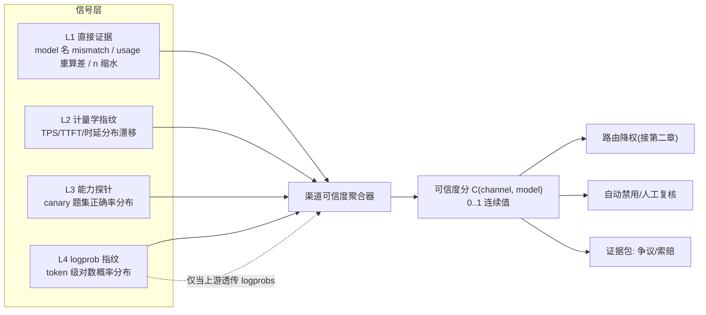
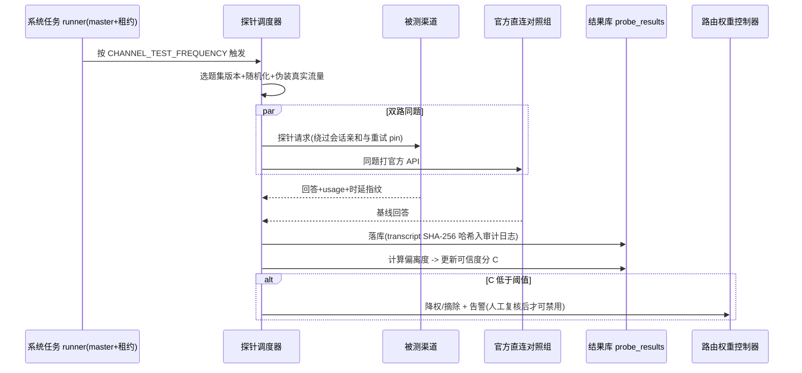
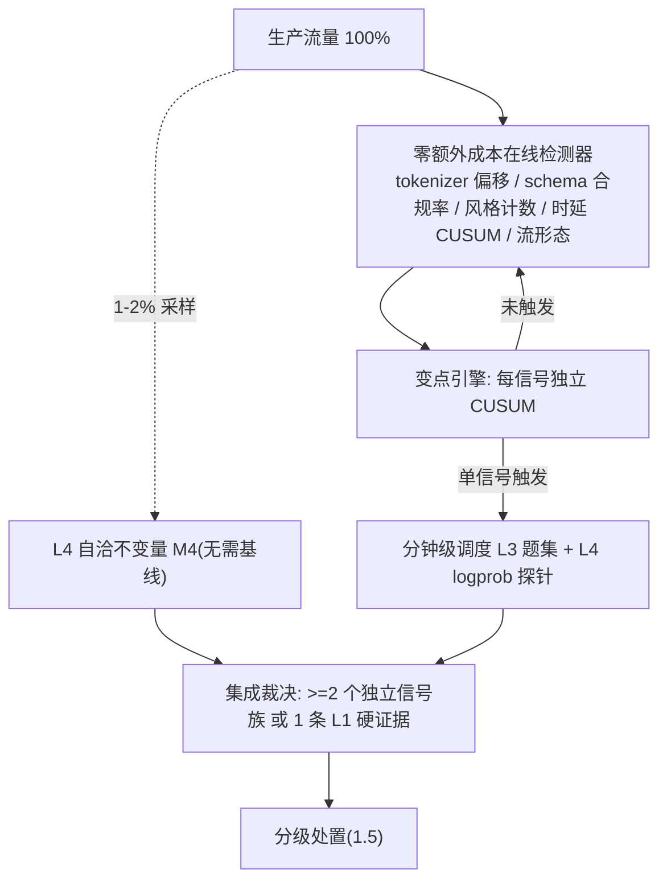
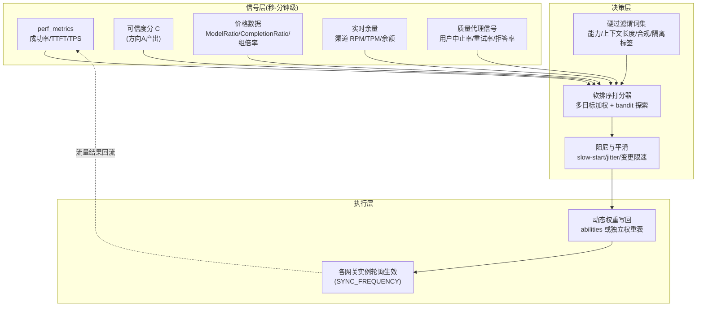
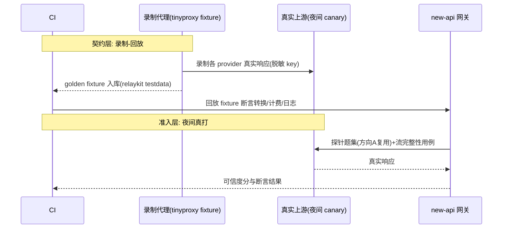
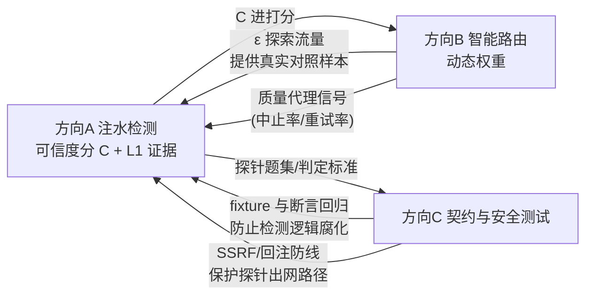

# new-api 上游治理研究设计：注水检测 · 智能路由 · 接入 API 安全测试

> **文档定位**：独立研究设计文档，与 `impl_tech.md`（工程现状与部署设计）平级互补。本文回答 token 中转站运营期的三个深入方向：① 上游接口是否注水（人工降级/调包大模型）；② 智能路由如何按需求自动选路并平衡表现与成本；③ 接入 API 的测试如何设计以防范注入与注水。
>
> **标注约定**：`[现状]` = 当前代码已具备（附 `文件:行号`）；`[需补建]` = 达成目标须新建；`[研究判断]` = 非代码事实的方案取舍。`文件:行号` 基线为 commit `ca2a02760`。
>
> **三块关系**：注水检测（第一章）产出"渠道可信度分"，是智能路由（第二章）的输入数据底座；安全与契约测试（第三章）把前两章的判定固化为可回归的 CI 门禁（第四章给出依赖图）。

---

## 一、研究方向 A：上游注水检测（模型调包 / 降级 / 计量造假）

### 1.1 问题定义：注水的五种形态

| # | 形态 | 表现 | 危害 | 检测难度 |
| --- | --- | --- | --- | --- |
| W1 | **模型调包** | 宣称 `gpt-4o` 实际回源 `gpt-4o-mini`/开源小模型 | 质量塌方 + 计费欺诈 | 中（行为指纹可破） |
| W2 | **量化/蒸馏降级** | 同家族量化版（Q4）冒充全精度 | 长尾任务静默劣化 | 高（需能力探针） |
| W3 | **上下文缩水** | 宣称 128K 实际 32K 后静默截断 | 长文任务结果错误且无报错 | 低（NIAH 探针） |
| W4 | **usage 虚报** | 上游回包 `usage.completion_tokens` 高于实际生成 | 多计费、直接资损 | 低（本地重算比对） |
| W5 | **参数缩水/假流式** | `n=4` 只回 2 张图；`stream:true` 上游实为整段假分块 | 功能欺诈、TTFT 指标失真 | 中（流完整性断言） |

`[研究判断]` 运营站最常见的实际是 W3/W4/W5（成本低、易自动化），W1/W2 是纠纷最大、也最需要证据链的。检测体系按"先易后难、先止损后追责"排序落地。

### 1.2 现有抓手（[现状]）

| 抓手 | 位置 | 对本方向的价值 |
| --- | --- | --- |
| perf_metrics：模型×分组×时间桶的成功率/时延/TTFT/TPS 原子计数，Redis `perf:<model>:<group>:<bucketTs>`（`pkg/perf_metrics/metrics.go:499`）跨实例聚合 | `pkg/perf_metrics/` | W1/W2 的**计量学信号**数据源，无需新建采集 |
| 渠道自动测试定时任务（`CHANNEL_TEST_ENABLED/_FREQUENCY`）+ `ShouldDisableChannel` 自动禁用 | `setting/operation_setting/monitor_setting.go:18-59`、`service/channel.go`、注册于 `main.go:153-158`（master + DB 租约） | 探针子系统的**现成调度壳**：注水探针可注册为新的系统任务 |
| 响应模型名 mismatch 已入日志：上游回包 `model` 与请求模型不一致由名称推导并写进日志 `other` | `relay/common/response_model.go`、`service/log_info_generate.go`（972aed197） | W1 的**直接证据**之一（廉价调包常忘改 model 字段） |
| 本地 prompt token 计数（`CountToken` 默认 true，`common/init.go:188`；`relay/request_billing.go:27`） | `relay/request_billing.go` | W4 重算比对的**左值**已存在，缺右值比对闭环 |
| abilities 路由事实表 `(group, model, channel_id)` + 静态 priority/weight | `model/ability.go` | 处置动作（降权/摘除）的**执行面** |
| 会话亲和（会话→渠道映射，Redis TTL 3600 s）、请求策略（重试/pin/严格会话） | `service/request_policy.go` 等 | 探针流量必须**绕开亲和**，否则测不到目标渠道 |

**核心缺口**：现有渠道测试只验证"能不能通"（连通性 + 简单回复），不验证"是不是它"；usage 只做计费输入，不与本地重算做差异审计；mismatch 日志没有反哺渠道权重。

### 1.3 检测信号体系（四层，按证据强度排序）



- **L1 直接证据（先建，性价比最高）**：
  - model 名 mismatch 计数 → 已有日志字段，只需聚合；
  - **usage 重算闭环** `[需补建]`：响应落库时用本地 tokenizer 重算 completion tokens（流式按累计 chunk 重编码），与上游上报 `usage` 比对，偏差超阈值（如 >5% 且绝对值 >50 tokens）记 `usage_suspect` 事件；注意不同模型 tokenizer 差异，比对基准取"按宣称模型的官方 tokenizer"；
  - `n`/尺寸/时长缩水：图像/视频任务对响应数组长度与 `metadata` 断言（任务插件结算路径已有 `UpdateImageCount` 钩子）。
- **L2 计量学指纹**：同 `(model, group)` 跨渠道对比 TPS/TTFT 分布（分位数而非均值，抗噪）；调包后指纹分布会发生统计显著漂移（KS 检验）。`[研究判断]` 该层只能**报警**不能**定罪**——换部署区域、上游扩容都会漂移。
- **L3 能力探针**：见 1.4。
- **L4 logprob 指纹**：要求上游透传 `logprobs`；对同一 prompt 序列比较 token 级 logprob 分布，接近数学不可伪造，是 W1/W2 最强证据。限制：很多中转/聚合上游剥掉 logprobs 字段——**"是否透传 logprobs"本身就该作为渠道准入测试项**。参照 Log Probability Tracking of LLM APIs（arXiv:2512.03816）与 LLM Fingerprinting 综述仓库（见第七章）。**原理、统计功效、M1–M4 四个方法与防伪博弈的完整深剖见 1.8。**

### 1.4 探针子系统设计与一轮检测时序

题库管理（`[需补建]`，新表 `probe_suites` / `probe_results`）：

| 题集 | 目标 | 示例题型 | 判定 |
| --- | --- | --- | --- |
| 确定性题 | W1/W2 | 固定算术串、逻辑陷阱、知识截止题 | 精确匹配 + 基线对照 |
| 指令遵循 | W2 | 严格 JSON schema、字数约束、多语言 | 规则校验器打分 |
| NIAH | W3 | 在 100K/128K 位置埋针 | 召回率按位置曲线，截断点即真实上下文 |
| 结构化能力 | W1 | function calling、`response_format` | 协议断言 |
| 对照组 | 全部 | 同题打官方 API（OpenAI/Anthropic 直连） | 渠道分 = 与官方分布的偏离度 |

反侦测约束（军备竞赛的底线）：探针流量与真实流量**不可区分**——复用真实 prompt 模板风格、随机抖动窗口、结果题混入正常重试；题库版本化并定期轮换；探针请求打 `metadata` 标记仅内部可见，绝不回显给渠道侧。



要点：探针**不新增调度框架**，注册为既有定时系统任务（复用 master + `system_task_locks` 租约，见 `impl_tech.md` 附录B）；探针失败不计入 perf_metrics 真实流量口径（加 `probe` 标签隔离，否则污染 SLA 指标）。

### 1.5 可信度分与处置分级

`C(channel, model) ∈ [0,1]`，由 L1–L4 加权（L1 证据一票压制：出现 usage_suspect 或 model mismatch 直接封顶 0.5）。处置分四档，避免"检测系统误伤即断客户收入"：

| 档位 | 触发 | 动作 |
| --- | --- | --- |
| 观察 | L2 漂移 | 只记录，加密采样 |
| 降权 | C < 0.8 | 路由权重 ×C（第二章消费） |
| 隔离 | C < 0.6 或 L1 实锤 | 只接灰度标签流量，人工复核 |
| 禁用+追偿 | 复核确认 | `ShouldDisableChannel` 摘除；导出证据包（探针 transcript 哈希、时间窗、对照组数据）支持按渠道合同追偿；对受影响用户走 BillingSession 退款路径 |

`[研究判断]` 自动禁用阈值必须比现有"连通性失败禁用"更保守：注水判定存在假阳性（上游扩容/量化升级都会改变指纹），**L1 之外的一切自动动作只做降权，禁用保留人工闸门**。

### 1.6 局限（诚实声明）

- 军备竞赛无终局：渠道可对已知指纹模型做"探针路由"（识别探测题转真模型）。对策是题库保密 + 真实流量抽样回标，但成本随对抗升级上升。
- logprob 层依赖上游配合；蒸馏小模型（W2）在窄领域题集上可逼近母模型，需要更长尾的题集才能区分。
- 探针本身产生真金白银的上游费用，预算需封顶（每题成本 × 渠道数 × 频率纳入运营账）。

### 1.7 生产级在线检测增强（零/低额外成本，直接可上线）

`[研究判断]` 探针（L3）要花钱、有频率上限，单靠它做不到"高概率、高性能、高可靠"。生产环境的正确形态是**分层触发**：100% 流量上跑零成本在线检测器做变点监控，一旦触发再分钟级调度昂贵探针定罪。在线检测器的共同性质：流式 O(tokens) 计数、单请求开销 <0.5 ms、只写 Redis sketch/计数器、不阻塞主链路。



#### 1.7.1 在线检测器清单（按性价比排序）

| # | 检测器 | 抓哪类注水 | 额外成本 | 统计方法 | 误报控制 |
| --- | --- | --- | --- | --- | --- |
| O1 | **tokenizer 偏移变点**：本地按宣称模型 tokenizer 重算 prompt tokens（`[现状]` `relay/request_billing.go:52-56` 已经 `service.EstimateRequestToken` 算好并存进 `info.GetEstimatePromptTokens()`；开关 `constant.CountToken` 默认开，`common/init.go:188`），与上游上报 `prompt_tokens` 求偏移 `offset=up−local`，按渠道 EWMA 基线跑 CUSUM | W1 跨家族调包（换 tokenizer 必现偏移跳变） | 0（复用既有计数） | 偏移量变点检测，非绝对值比较 | 不同 provider 的 chat 模板序列化差异是**稳定水位**而非跳变，故只检测变点；连续 3 窗确认 |
| O2 | **schema/工具合规率**：客户端本就请求 strict json_schema / tools 时，复用结算解析结果统计每渠道 schema 一次通过率 | W1/W2（小模型结构化能力显著弱） | 0（解析本来就要做） | 同 `(model, 请求类别)` 下渠道通过率 vs 舰队通过率，≥200 样本起判 | 按请求类别分层，避免题目难度混杂 |
| O3 | **风格指纹计数**：2% 采样响应上统计 bullet 行占比、emoji 数、平均句长、拒答套话命中率 | W1/W2（家族级文风差异稳定） | ≈0 | 每渠道 EWMA + CUSUM | 只报警不定罪，进集成裁决 |
| O4 | **时延指纹变点**：TTFT/TPS 加星期/时段季节基线后跑 CUSUM。`[现状]` perf_metrics 只按 `(model, group, ts)` 聚合、只存 sum/count（`pkg/perf_metrics/types.go:85-99`），**无渠道维度、无分位数** → 需按 5.1.8.3 加渠道计数器 | W1/W2 + 基础设施换路由 | 低（热路径多一次 Redis pipeline） | 季节调整 CUSUM（均值口径起步；要 p50/p95 另加对数桶直方图） | 上游全局事故期自动抑制（对照组同跌则挂起） |
| O5 | **流形态变点**：chunk 数、chunk 间隔直方图、首 chunk 时延。`[现状]` `relay/helper/stream_scanner.go` 无 chunk 计时插桩 → 需新增（每 chunk 一次 atomic，流结束写一次 Redis） | 换 serving 栈/换路由（常伴随降级） | 低（新增插桩） | 固定对数桶直方图的分布变点（不引在线分位数库） | 同 O4 抑制逻辑 |
| O6 | **长上下文 DiD**：按 prompt 长度分桶（<8K/8–32K/>32K），以客户端中止/重试率为结果变量，估计"长桶劣化 − 短桶劣化"的渠道-舰队差 | W3 上下文截断（截断只伤长桶，交互效应显著） | 0 | 双重差分 | 桶内样本 ≥500 起判 |
| O7 | **usage 重算**（5.1.2 已设计） | W4 | 0 | 偏差率阈值 + 连续窗 | 既有 |

#### 1.7.2 为什么这套组合"高概率、高性能、高可靠"

- **高概率**：O1/O2/O6 对跨家族调包、结构化降级、截断三类最常见注水是**必然暴露面**（tokenizer、能力、长度交互效应无法伪装），不依赖抽样运气；变点检测对"某天开始换模型"的事件型注水在数十到数百请求内报警。
- **高性能**：全部检测器是流式计数器/分位数 sketch，无同步 IO；昂贵探针只在变点触发后跑，成本与触发率成正比而非与流量成正比。
- **高可靠**：单检测器只报警，**集成裁决要求 ≥2 个独立信号族**（计量族 O1/O7、行为族 O4/O5、语义族 O2/O3、分布族 L4）或 1 条 L1 硬证据才自动动作，切断相关性误报；每个检测器在 staging 用诚实渠道测过零假设分布才允许上线。
- **对抗选择性诚实**：哪些请求被采样监控是保密的，渠道无法只对探针诚实——要对不可区分的采样集诚实，就等于对全部流量诚实，成本优势归零。这是整套体系的经济性根基。

> O1–O7 的挂点、Redis key、CUSUM 参数与代码骨架见 **5.1.8–5.1.9**；集成裁决与灰度开关见 **5.1.11–5.1.12**。

### 1.8 L4 logprob 指纹深剖（原理、准确率来源、工程细节）

#### 1.8.1 API 返回的到底是什么

- OpenAI 系：`logprobs=true` 时每个生成位置返回 `content[i].logprob`（**实际采样 token** 的对数概率）与 `top_logprobs`（最多 5 个候选的 token+logprob）。该值是采样分布（temperature 之后）下的 `log P(token_i | prefix_i)`。
- Gemini：`responseLogprobs` + `logProbs` top-k，语义相同。
- Claude（Messages API）：不返回 logprobs → 该渠道 L4 不可用，权重归零并在 `channel_credibility` 记录 `logprob_support=false`；**宣称支持却剥离 logprobs 字段**本身记一条可信度扣分（隐藏证据是行为信号）。

#### 1.8.2 为什么它能识别模型（原理）

模型的身份编码在条件分布里：`log P_θ(token | prefix)` 是权重 θ、tokenizer、解码配置三者的确定函数。对同一 prefix，不同 θ（哪怕同架构不同 checkpoint、或同 checkpoint 的 INT8/INT4 量化版）给出**不同的条件分布曲线**——量化扰动 logits（敏感层 1e-2~1e-1 nats 级），换家族则是 0.1~1+ nats 级。逐位置 logprob 序列就是这条曲线的采样，因此是模型指纹。关键不等式：两个不同模型在几乎必然意义上逐位置 KL 散度 > 0，采样位置数 N 越大，经验统计量越集中地暴露这个差异。

#### 1.8.3 为什么准确率可以很高（统计功效）

配对设计：同一探针 prompt、`temperature=0`（贪心）→ 同模型下 token 路径确定且可复现，逐位置 logprob 可直接配对相减 `d_i = logp_ch(i) − logp_ref(i)`。

- **零假设噪声 σ_null**：同模型重复调用（含批处理/内核浮点非确定性）实测 σ ≈ 0.01–0.03 nats（须在官方 API 带负载重复标定，不能拍脑袋）。
- **效应量 δ**：跨家族 |d| 均值 0.1–1 nats；量化降级 0.02–0.2 nats。
- **功效**：配对 z ≈ δ√N/σ。取 δ=0.05、σ=0.02：N=500 时 z≈56，p 值天文小；即使 δ=0.01（极轻扰动），N=500 仍 z≈11。**几百个 token 就够定罪轻度降级**，这是准确率的数学来源。
- **路径分歧即证据**：贪心下 token 路径首次分歧位置 k 本身是强证据（同模型贪心路径应完全一致），k 越小证据越强，且不需要任何阈值。

#### 1.8.4 四个具体方法（M1–M4）

| 方法 | 输入 | 判定 | 需要基线? |
| --- | --- | --- | --- |
| M1 贪心路径配对检验 | 探针 prompt ×2（渠道+官方对照），temp=0，max_tokens=256，logprobs=true，top_logprobs=5 | 路径分歧位置 k；配对 d_i 的 t 检验/KS，p<1e-6 定罪 | 是（当轮对照即可，无需历史基线） |
| M2 困惑度带 | 固定校准语料（500 句，版本化），取返回 logprob 算困惑度 | 困惑度落在宣称模型月度标定带外 → 嫌疑 | 是（月度标定带） |
| M3 top-k 形状统计 | top_logprobs 列表 | 先最小二乘拟合尺度 `logp_ch ≈ a·logp_ref + b`（a≠1 揭穿 temperature 谎报），残差方差与 top-5 秩一致率（Kendall τ）做指纹 | 是 |
| M4 自洽不变量 | 任意带 logprobs 的响应（含 1–2% 生产采样） | ① temp=0 时采样 token 必须是 top_logprobs 的 argmax；② top-k 必须降序；③ Σexp(top-k) ≤ 1+ε；④ 自身续写困惑度在家族带内。任一违反 → 伪造/篡改 logprob，直接 Tier≥2 | **否**（零基线，最便宜的第一道闸） |

M4 的价值在于**不需要对照组、不需要花钱**：它检验的是"返回的 logprob 与返回的 token 自不自洽"，伪造者最容易在这里露馅。

#### 1.8.5 为什么难伪造（博弈与成本）

渠道想用 B 服务、用 A 的 logprob 过检：① 真跑 A 算 logprob → 付出 A 的推理成本，注水的成本动机消失；② 缓存 logprob → 探针 prompt 版本化轮换 + 混入真实流量采样，缓存命中率趋零；③ 凭空伪造 → 过不了 M4 自洽不变量与 M3 残差检验；④ 给 logprob 加噪混淆 → 残差方差超出 σ_null 标定带，"logprob 异常"本身就是一条篡改证据。**选择性诚实**同样失效：被监控的请求不可区分（1.7.2），要对采样集诚实就必须对所有流量诚实。

#### 1.8.6 工程细节

- **探针请求规格**：`temperature=0, top_p=1, max_tokens=256, logprobs=true, top_logprobs=5`，prompt 取自版本化探针集；支持 seed 的 provider 固定 seed。
- **基线工件**（每 `(model_snapshot, tokenizer)` 一份，版本化存 OSS）：各探针 prompt 的逐位置 logprob 向量、M2 困惑度带、σ_null（官方 API 带负载重复 30 次标定）。体积估算：500 位置 × 8 B × 200 prompt ≈ 0.8 MB/模型，可忽略。
- **重标定触发**：provider 发布新 snapshot（探针 pin 住 dated snapshot 名，如 `gpt-4o-2024-08-06`，避免合法更新造成误判）；基线对基线漂移超阈 → 先重标定再判渠道。
- **在线 M4**：挂在 1–2% 生产采样上，纯本地计算（排序/求和/困惑度），无外部调用。
- **落地细节**：探针请求构造、基线工件格式、M4/M1 校验器代码、采样保密实现见 **5.1.10**。
- **不可用降级**：`logprob_support=false` 的渠道 L4 权重归零、其余三层权重重归一，并在准入测试里把"是否透传 logprobs"列为渠道评分项。

#### 1.8.7 局限（诚实边界）

- 浮点非确定性随 batch/硬件变化 → σ_null 必须带负载标定，否则假阳性；
- top_logprobs=5 的截断限制 M3 精度，主力判定放 M1/M2；
- 不支持 logprobs 的 provider（如 Claude）L4 缺席，靠 O1/O2/O6 与 L3 兜底；
- provider 合法换 snapshot 与恶意换模型在信号上同形 → 靠 pin snapshot + 对照官方 changelog 区分，区分不了时按"未声明变更"降级处理而非直接定罪。

#### 1.8.8 验收实验（staging，上线门槛）

对三组目标跑全套：(a) 官方 A 直连；(b) 官方 B 冒充 A；(c) A 的 INT8 量化版。门槛：(b) 在 N≤1000 token 内 p<1e-6 检出；(c) 在 N≤5000 token 内检出率 ≥95%；(a) 连续 30 天误报 <0.1%。未达标不调参上线，回炉标定 σ_null 与题集。

### 1.9 里程碑

- **M1（止损，约 1–2 周）**：L1 三件套——mismatch 聚合、usage 重算比对、n/尺寸缩水断言；纯消费现有日志与计费钩子。
- **M2（报警，约 4 周）**：L2 跨渠道指纹漂移 + 可信度分进路由权重（只降权）。
- **M3（定罪，约 8 周）**：L3 题库 + 对照组 + 证据包导出；L4 视上游 logprobs 可用性立项。

---

## 二、研究方向 B：智能路由（表现 × 成本 × 可信度的自动选路）

### 2.1 现状与差距

`[现状]` 选路 = `abilities` 表静态 `priority/weight`（`model/ability.go`）+ 失败重试换渠道（`RetryTimes`、可重试状态码区间 data-driven）+ 会话亲和（Redis TTL 3600 s）+ 连通性自动禁用。成本、时延、可信度**都不进选路决策**——渠道价格差异靠人工调 priority 兜底。

### 2.2 目标架构：信号 → 决策 → 执行三层控制环



### 2.3 决策函数设计

- **硬过滤（谓词，不可妥协）**：模型能力匹配（vision/tools/streaming/logprobs）、上下文长度 ≥ 请求需求、分组可见性、渠道未被隔离（1.5 档）、用户显式指定模型不改写。
- **软打分**：`score = w_c·cost_norm + w_r·reliability + w_l·latency_norm + w_t·C(channel,model) − w_m·load_soft`。
  - `cost_norm`：该渠道对本请求的**预估结算价**（复用 billingexpr 价格快照，不引入第二套价格口径），归一化到候选集内 [0,1]；
  - `reliability/latency`：直接读 perf_metrics 桶（指数滑动合并多桶，避免 60 s 粒度毛刺）；
  - `load_soft`：活跃连接数软惩罚（HPA 已用 `newapi_active_connections`，同源）。
- **探索项**：`[研究判断]` 起步**不要**上完整 LinUCB/Thompson——先用 ε-greedy（ε 由错误预算反推，建议 ≤2% 流量做同模型跨渠道对照，正好为方向 A 供真实流量样本，一鱼两吃）；bandit 形态留到权重表稳定后演进。
- **质量代理指标**是成本项的刹车：没有它，纯成本最优会系统性把流量赶向最差可用渠道。中止率/重试率/拒答率 `[需补建]` 从现有日志聚合即可，无需客户端埋点。

### 2.4 多实例一致性：本项目最大的工程约束

`[现状]` 配置/缓存一致性靠轮询（`SYNC_FREQUENCY` 默认 60 s），没有集中式路由决策面。这决定了：

- **不做请求级实时决策面**（引入 gRPC 控制面或强一致外置状态=新单点，违背 99.95 预算）；决策周期取**分钟级**，实例本地执行同一份权重表，天然一致。
- **防羊群/震荡**：所有实例同时把流量甩向"当前最优"渠道会把它打死再引发回摆。三重阻尼：① 权重变更限速（单渠道每周期变化 ≤20%）；② 实例侧 jitter（生效时间加随机 0–30 s 摊平）；③ 新目标渠道 slow-start（接入速率爬坡，语义对齐 ALB 的 `slow-start-enabled`）。
- **会话粒度锁定**：会话亲和与全局最优天然冲突——`[研究判断]` 保持会话内不换渠道（前缀缓存命中与体验一致性优先），只在**新会话**上应用新权重；长会话结束后权重自然生效。

### 2.5 分阶段上线（与灰度体系复用）

| 阶段 | 模式 | 回滚 |
| --- | --- | --- |
| B-1 影子 | 只算不切：决策日志 vs 实际选路 diff 报表 | 无风险 |
| B-2 建议 | 控制器产出权重建议，人工审批后经现有渠道管理界面写回（变更走 impl_tech.md 轨道 A 业务灰度） | 一键还原快照 |
| B-3 自动 | 预算护栏内自动写回（错误预算消耗 >50% 时冻结自动调权，退回 B-2） | 熔断回退静态 priority |

### 2.6 里程碑

- **M1（2–3 周）**：影子模式 + 成本项打分（价格数据现成），产出 diff 报表验证正确性。
- **M2（+4 周）**：建议模式上线，接入可信度分 C（依赖方向 A M2）与质量代理信号。
- **M3（+8 周）**：预算护栏内的自动模式；ε-greedy 探索流量正式为方向 A 供样本。

---

## 三、研究方向 C：接入 API 的测试设计（防注入 + 防注水）

### 3.1 攻击面与现有防线盘点

| 面 | 攻击 | `[现状]` 防线 | 缺口 `[需补建]` |
| --- | --- | --- | --- |
| SSRF | 图像/视频/文档接口的 URL 参数打内网（169.254.169.254、RDS 内网地址） | `service.GetSSRFProtectedHTTPClient()`（`controller/video_proxy.go:225`）、fetch 设置 `EnableSSRFProtection`、重定向白名单 `common.ValidateRedirectURL`（`controller/topup_stripe.go:86-91`）+ `TrustedRedirectDomains`（`constant/env.go:30`） | 逐个透传 URL 字段建**清单化回归**：新增渠道/字段默认进 SSRF 用例矩阵；DNS rebinding（解析后二次校验 IP）用例 |
| 回调伪造 | 伪造 stripe/epay notify 给账户充值 | 签名校验路径 + AGENTS.md OWASP 强制流程 | 重放攻击用例（同签名二次通知必须幂等——`subscription_pre_consume_records.request_id` 唯一索引模式推广到充值） |
| 上游响应回注 | 恶意上游在 content/reasoning_content 里塞 prompt 注入、playground 渲染载荷 | 前端渲染按文本处理 | 上游响应视为**不可信输入**的契约：日志注入（伪造 ANSI/换行）、XSS 载荷不进 DOM（playground 富文本若引入 markdown 渲染必须 sanitize 回归）；参照 Greshake et al. 间接提示注入（arXiv:2302.12173）与 OWASP LLM Top10 LLM01 |
| 协议走私 | 畸形 JSON/multipart、超长 body、header 注入、非法 UTF-8 | `MAX_REQUEST_BODY_MB`（`common/init.go:184`、`common/request_body_limit.go`）、form UTF-8 校验（中间件层）、relaykit DTO 严格解析 | 定向 fuzz（见 3.3）；HTTP 请求走私（CL.TE）依赖 ALB 前置，需网关自身 100-continue 行为用例 |
| 计费表达式注入 | model_mapping、billingexpr 表达式、分组倍率作为作者可控输入 | billingexpr 自有表达式引擎（非 eval） | 表达式资源上限用例（超长/深嵌套/死循环型表达式必须有步数/深度封顶）；mapping 环检测 |
| 流完整性 | 假流式（整段一个 chunk）、截断流、usage chunk 造假、`n` 缩水 | 流扫描器有超时与状态机（`relay/helper/stream_scanner.go`） | 3.2 的流断言集 |

### 3.2 防注水 = 把第一章的 L1 证据固化为契约测试

- **模型回声断言**：`response.model` 与请求模型一致性（`relay/common/response_model.go` 已产出 mismatch 事实）——测试侧把它变成每个渠道适配器的**必断言项**。
- **usage 重算断言**：`completion_tokens` 本地重算 vs 上报值，偏差分布作为渠道准入门槛（方向 A M1 的测试化）。
- **参数保真 property test**（relaykit 是理想落点，独立模块可单测）：对 40+ 协议的 DTO 转换写属性测试——`max_tokens/n/temperature/stream_options/tools` 经"客户端→上游→客户端"往返后**不得丢失或篡改语义**；显式 0 值与缺省的区分正是 AGENTS.md 指针类型规则的可执行化。
- **流完整性断言集**：chunk 单调性（index/finish_reason 至多一次）、累计内容与最终 usage 一致性、`n` 与数组长度、假流式检测（首末 chunk 间隔分布退化为一跳即标记）。

### 3.3 测试金字塔与 harness



- **录制-回放 harness** `[需补建]`：MITM 代理抓取上游真实响应 → 脱敏 → golden fixture；把"每个 provider 适配器"的测试从 mock 升级为**字节级真实样本**回放。这是对 40+ 渠道适配最可持续的投入（AGENTS.md 禁止 mock 掩盖真实行为的方向一致）。
- **定向 fuzz**：入口选 DTO 解析与 multipart 解析（`common.Unmarshal` 封装点、relaykit 转换函数），种子取真实流量采样；崩溃/内存放大/语义漂移（解析后再序列化不等价）三类 oracle。
- **边界用例矩阵**：body 上限 ±1、`n`/`max_tokens` 族协议极值（各 provider 上限不同，防"校验放在网关还是上游"的双盲）、非法 UTF-8/超长 header。
- **CI 门禁分层**：PR 级跑契约+property+边界矩阵（分钟级）；夜间跑真打 canary；周级跑三数据库矩阵（沿用 AGENTS.md 既有强制要求，不另造）。

### 3.4 OWASP 对齐

`[研究判断]` 本章测试设计映射：OWASP LLM Top 10 之 LLM01（提示注入→响应回注面）、LLM05（improper output handling→sanitize 契约）、LLM10（unbounded consumption→计费表达式资源封顶 + 探针预算）；支付回调与账户路径沿用 AGENTS.md 已强制的 ASVS/认证 Cheat Sheet 流程，不重复展开。

### 3.5 里程碑

- **M1（2 周）**：usage 重算断言 + 模型回声断言 + 流完整性断言集（全部消费方向 A M1 的钩子）。
- **M2（+4 周）**：录制-回放 harness 覆盖 Top 10 渠道；SSRF/回调矩阵进 CI。
- **M3（+6 周）**：relaykit property test + DTO fuzz 常态化。

---

## 四、三块联动与总体路线图



依赖顺序即落地顺序：**A-M1（L1 止损）与 C-M1（断言化）同源共建**，随后 A-M2 → B-M2（可信度进权重）→ B-M3（自动调权）→ A-M3（定罪与追偿）。全程复用既有基础设施：系统任务租约（调度）、perf_metrics（信号）、abilities（执行面）、BillingSession（退款闭环）。

| 季度 | 交付 |
| --- | --- |
| Q1 | A-M1 + C-M1：usage 重算、mismatch 聚合、流断言进 CI |
| Q2 | A-M2 + B-M1/B-M2：指纹漂移报警、路由影子→建议模式 |
| Q3 | A-M3 + B-M3 + C-M2：题库定罪与追偿、自动调权（预算护栏）、录制-回放全覆盖 |
| Q4 | C-M3：property test + fuzz 常态化；年度对抗评审（题库轮换、阈值重标定） |

## 五、实施实战手册（可直接照做）

> 本章把前三章的设计压成可执行的落点：表结构、代码挂点、公式参数、题集样例、payload 清单、在线检测器与 CUSUM 参数、logprob 探针与基线工件、灰度开关与验收 checklist、CI 配置。所有计费相关动作遵守 `.agents/rules/billing.md`：**检测与审计只读不改结算**；任何要改变计费数量的动作必须走既有链路（`RelayInfo.UpdateImageCount`、`common/quota_math.go` 的 `*Checked` 助手、`attachQuotaSaturation` 留痕）。

### 5.1 方向 A 落地包（注水检测）

#### 5.1.1 数据模型（GORM，三库兼容）

新增三张表，放 `model/`，随 master AutoMigrate 建表。规则：主键交给 GORM（不写 AUTO_INCREMENT/SERIAL）、JSON 列用 `serializer:json`（TEXT 存储，跨库安全）、不加布尔默认值 tag（业务默认在构造/服务层设置）：

```go
// model/channel_probe.go
type ProbeSuite struct {
    ID        uint   `gorm:"primaryKey"`
    Version   string `gorm:"type:varchar(32);uniqueIndex"` // "2026Q4-01"，题库版本化轮换
    Kind      string `gorm:"type:varchar(16);index"`       // deterministic|instruction|niah|capability
    Items     string `gorm:"serializer:json"`              // []ProbeItem{ID,Prompt,Checker,EstTokens}
    CreatedAt int64
}

type ProbeResult struct {
    ID          uint   `gorm:"primaryKey"`
    ChannelId   int    `gorm:"index:idx_probe_main,priority:1"`
    ModelName   string `gorm:"type:varchar(128);index:idx_probe_main,priority:2"`
    SuiteVer    string `gorm:"type:varchar(32);index:idx_probe_main,priority:3"`
    ItemId      string `gorm:"type:varchar(64)"`
    Pass        int    // 0/1，不用 bool 默认值语义
    Score       float64
    LatencyMs   int64
    Tps         float64
    UpstreamTok int    // 上游上报 usage
    LocalTok    int    // 本地按宣称模型 tokenizer 重算
    TranscriptHash string `gorm:"type:varchar(64)"` // SHA-256(transcript)，原文另存 OSS
    StartedAt   int64  `gorm:"index"`
}

type ChannelCredibility struct {
    ChannelId     int    `gorm:"primaryKey"`
    ModelName     string `gorm:"type:varchar(128);primaryKey"`
    Score         float64 // EWMA 后的可信度分 C
    Tier          int     // 0观察 1降权 2隔离 3禁用+追偿
    L1Veto        int     // 0/1 出现直接证据则封顶
    LogprobSupport int    // 0/1：上游是否透传 logprobs，0 则 L4 权重重归一到其余三层
    UpdatedAt     int64
}

// DetectorEvent 只落"变点事件与裁决结果"，在线检测器的窗口计数一律留 Redis（5.1.8.2），
// 避免热路径写库。
type DetectorEvent struct {
    ID        uint   `gorm:"primaryKey"`
    ChannelId int    `gorm:"index:idx_det_main,priority:1"`
    ModelName string `gorm:"type:varchar(128);index:idx_det_main,priority:2"`
    Detector  string `gorm:"type:varchar(16);index:idx_det_main,priority:3"` // O1..O7|M1..M4
    Family    string `gorm:"type:varchar(16)"` // metrology|behavior|semantic|distribution
    WindowTs  int64  `gorm:"index"`
    Stat      float64 // 触发时的统计量（CUSUM 值 / z 值 / token 偏移）
    Baseline  float64 // 同桶季节基线
    Samples   int64   // 窗口样本数，不足 minN 的事件不参与裁决
    Verdict   int     // 0仅报警 1进裁决 2已定罪
    Detail    string `gorm:"serializer:json"`
    CreatedAt int64
}
```

#### 5.1.2 usage 重算比对钩子（只审计，不动结算）

挂点在**结算完成之后**旁路比对，不进入计费链路：

- 文本：`service/text_quota.go` 拿到上游 `usage` 处，把 `prompt_tokens/completion_tokens` 与 `relayInfo` 上本地计数（`relay/request_billing.go:27` 已有 prompt 侧）配对，异步投递审计事件；completion 侧流式用累计 chunk 重编码。
- 图像：数量判定**只信** `openaiImageResponseCount` 同规则的载荷推导（禁止 `data.#`/`len(data)` 计数，见 billing 规则），把"宣称 n vs 实收载荷数"记事件；改结算数量仍只经 `RelayInfo.UpdateImageCount`。
- 偏差判定：`dev = (upstream - local) / max(local,1)`；`dev > 0.05 且 upstream-local > 50` 连续 3 个时间窗 → 写 `usage_suspect` 事件。
- 留痕方式复用 saturation 模式：事件嵌套写入消费日志 `other.admin_info.usage_audit`（admin 视图专属，普通用户日志自动剥离），并 `logger.LogWarn` 带 request_id。

```go
// service/usage_audit.go —— 伪代码骨架
func AuditUsageAgainstLocal(info *relaycommon.RelayInfo, upstreamUsage, localUsage types.TokenParams) {
    if !setting.UsageAuditEnabled { return }            // 灰度开关，默认关
    dev := float64(upstreamUsage.CompletionTokens-localUsage.CompletionTokens) /
           math.Max(float64(localUsage.CompletionTokens), 1)
    if dev > 0.05 && upstreamUsage.CompletionTokens-localUsage.CompletionTokens > 50 {
        recordUsageSuspect(info, dev)                   // 计数进 Redis: usage_suspect:<ch>:<model>
        attachUsageAudit(info, dev)                     // 写 other.admin_info.usage_audit
    }
}
```

#### 5.1.3 探针任务注册（复用系统任务租约）

系统任务框架的真实契约（`[现状]` `service/system_task.go:30-64`）：实现 `ScheduledSystemTaskHandler` = `Type()` + `Run(ctx, task, runnerID)` + `Enabled()` + `Interval()` + `NewPayload()`，用 `service.RegisterSystemTaskHandler(h)` 注册；`Run` 自己负责终态（必须调 `model.FinishSystemTask`，项目里统一走 `finishSystemTaskHandler`）并响应 ctx 取消。照抄 `channelTestHandler` 即可（`controller/system_task_handlers.go:30-70`）：

```go
// controller/channel_probe_handler.go —— 与 channelTestHandler 同构
type channelProbeHandler struct{}

func (channelProbeHandler) Type() string { return model.SystemTaskTypeChannelProbe } // 新增常量，model/system_task.go:19-23 旁边

func (channelProbeHandler) Enabled() bool {
    return operation_setting.GetGovernanceSetting().ProbeEnabled // 5.1.12 新增设置项
}

func (channelProbeHandler) Interval() time.Duration {
    hours := operation_setting.GetGovernanceSetting().ProbeIntervalHours
    if hours <= 0 {
        hours = 24
    }
    return time.Duration(hours) * time.Hour
}

func (channelProbeHandler) NewPayload() any { return channelProbeTaskPayload{} }

// payload.Mode: "scheduled"（常规轮次）| "triggered"（变点触发，只跑被点名的 channel+model）
type channelProbeTaskPayload struct {
    Mode     string   `json:"mode,omitempty"`
    ChannelIDs []int  `json:"channel_ids,omitempty"`
    Models   []string `json:"models,omitempty"`
}

func (channelProbeHandler) Run(ctx context.Context, task *model.SystemTask, runnerID string) {
    payload := channelProbeTaskPayload{}
    if err := task.DecodePayload(&payload); err != nil {
        finishSystemTaskHandler(task, runnerID, model.SystemTaskStatusFailed, nil, err)
        return
    }
    reporter := service.NewSystemTaskProgressReporter(task, runnerID)
    summary, err := runChannelProbeTask(ctx, payload, reporter) // 内部：loadRotatedSuite → 双路同题 → persistProbeResult → recomputeCredibility(5.1.5)
    if err != nil {
        finishSystemTaskHandler(task, runnerID, model.SystemTaskStatusFailed, nil, err)
        return
    }
    finishSystemTaskHandler(task, runnerID, model.SystemTaskStatusSucceeded, summary, nil)
}

// 注册：加进 controller.RegisterScheduledSystemTasks()（controller/system_task_handlers.go:20-25）。
// 该函数由 main.go:158 在 service.StartSystemTaskRunner()（main.go:159）之前调用；
// runner 只在 master 起（service/system_task.go:125），DB 租约天然去重多 master。
```

约束：

- 探针请求 `Stream:false`；发送路径与 `controller/channel-test.go:230-243` 同构（`GenRelayInfo` → `info.IsChannelTest = true` → `InitChannelMeta` → `helper.ModelMappedHelper`），从而继承模型映射、绕开会话亲和与用户级限流；另加 `IsProbe` 标记以便计费与日志侧区分。
- **SLA 口径不被污染**：`[现状]` `perfmetrics.RecordRelayResult` 只在 `controller/relay.go:134` 与 `relay/responses_websocket.go:241` 调用，channel test 路径不经过它，所以走同构路径的探针天然不进 perf_metrics。若将来把探针改走正常 relay 链路，必须在 `ClassifyRelayOutcome`（`pkg/perf_metrics/outcome.go:23`）里对 `IsChannelTest`/`IsProbe` 提前返回 `OutcomeIgnored`。
- 变点触发的加急轮次通过**手动建任务**实现（写一行 `SystemTask`，type=channel_probe，payload.Mode=triggered），复用既有租约与历史表，不要另起定时器。
- 频率起步 `每天 1 轮/渠道×模型`，告警复核期人工调到 4 小时。

#### 5.1.4 题库样例（首发 12 题中的 6 题，判分规则即代码）

| # | 类型 | 题面（节选） | 判定 |
| --- | --- | --- | --- |
| D1 | 确定性算术 | "依次计算 17*23, 1024/7(取整), 97 XOR 58，仅输出三个整数逗号分隔" | 精确匹配 `391,146,95` |
| D2 | 逻辑陷阱 | "树上有 5 只鸟，开枪打死 1 只，还剩几只？要求只答数字并给一句理由" | 答案含 `0` 且理由提及惊飞 |
| D3 | 知识截止 | "以下哪个事件发生在 2024 年 6 月之后？选项含 3 个此前事件" | 单选正确率；小模型常在此类翻车 |
| I1 | 指令遵循 | "输出恰好 3 个 bullet，每行以 `- ` 开头且 ≤ 6 个词，主题是队列" | 规则校验器（行数/前缀/词数） |
| N1 | NIAH | 在 100K token 填充文本的第 12%/50%/88% 位置各埋 `针: 紫色海马-7412`，问三针编号 | 召回率-位置曲线，断点即真实上下文长度 |
| C1 | function calling | 强制 tools 调用 `get_weather(city)` | `tool_calls` 结构断言，非文本匹配 |

题库保密与轮换：版本季度轮换 30%；每渠道实际出题 = 题集 ∪ 真实流量脱敏采样（1:4），使探测不可被枚举。

#### 5.1.5 可信度分公式（可直接实现）

```text
单轮分  c_t = 0.5·A_usage + 0.2·A_mismatch + 0.2·A_probe + 0.1·A_fp
  A_usage    = 1 - min(1, Σsuspect_tokens / Σbilled_tokens)      # usage 偏差率
  A_mismatch = 1 - min(1, mismatch_count / 100_resp)             # 模型名回声
  A_probe    = 渠道题分 / 官方对照组题分（同版本题集，截断到 [0,1.05] 再 min 1）
  A_fp       = 1 - KS(渠道 TPS/TTFT 分布, 同模型跨渠道合并分布)   # 只报警不定罪，权重最低
EWMA     C_t = 0.9·C_{t-1} + 0.1·c_t     （每天一轮，≈一周收敛）
L1 否决  若近 7 天 usage_suspect ≥3 窗 或 mismatch 率 >1% → C = min(C, 0.5)，Tier≥2
分档     C≥0.9 观察 | 0.8≤C<0.9 降权(权重×C) | 0.6≤C<0.8 隔离 | C<0.6 或人工实锤 禁用+追偿
```

#### 5.1.6 告警处置 Runbook（值班可直接执行）

1. 收到 `credibility_drop`（ΔC>0.15/24h）→ 打开渠道详情面板（数据源 `probe_results` 按 `suite_ver` 分组）。
2. 区分假阳性：核对官方对照组当日是否同跌（上游全局降级）、渠道是否公告扩容/量化升级。
3. 实锤路径：导出证据包——`probe_results` 行 + `transcript_hash` 对应 OSS 原文 + usage 审计事件 + 时间窗计费单号，JSON 固定字段 `{channel_id, model, suite_ver, window, items[], usage_events[], billing_refs[]}`。
4. 追偿：按渠道合同条款引用证据包；对受影响用户批量退款走 BillingSession 既有退款链路（request_id 幂等，禁止直改余额）。
5. 恢复：Tier 降级需连续 3 天 C≥阈值 + 人工确认；`channel_credibility` 变更全部进审计日志。

#### 5.1.7 探针成本预算（示例参数）

20 渠道 × 3 重点模型 × 12 题 × 日均 1 轮 × 平均 1.2K token/题 ≈ 864K token/天；按宣称模型批发价折算控制在 **≤ $15/月**；超出则 NIAH 类长文题降频为周级。

#### 5.1.8 在线检测器落地（O1–O7 的挂点、key、代码）

原则：**热路径只做计数，不做判定**。所有检测器往 Redis 写窗口累计值，判定由 5.1.9 的引擎按 5 分钟一轮读出；DB 只落事件。观测函数第一行就检查总闸与 `info.IsChannelTest`，保证 `gov_enabled=false` 时开销为一次布尔判断。

##### 5.1.8.1 挂点总表

| 检测器 | 挂点（`[现状]` 锚点） | 热路径新增开销 | 状态存储 |
| --- | --- | --- | --- |
| O1 tokenizer 偏移 | 结算侧：本地值取 `info.GetEstimatePromptTokens()`（由 `relay/request_billing.go:52-56` 写入），上游值取 `usage.PromptTokens` | 0（两个数都已在手） | `gov:o1:<ch>:<model>` |
| O2 schema/工具合规 | 客户端请求带 `response_format`(strict) 或 `tools` 时，复用结算路径本就要做的响应解析结果 | 0 | `gov:o2:<ch>:<model>:<类别>` |
| O3 风格计数 | 响应落地后 `gopool.Go` 异步，2% 采样（采样门控见 5.1.10.6） | ≈0 | `gov:o3:<ch>:<model>` |
| O4 时延 | `pkg/perf_metrics/metrics.go:32 RecordRelayResult` 内并行写渠道桶 | 1 次 pipeline | `gov:o4:<ch>:<model>:<ts>` |
| O5 流形态 | `relay/helper/stream_scanner.go` chunk 循环内 atomic 累加，流结束写一次 | atomic + 1 次 pipeline | `gov:o5:<ch>:<model>:<ts>` |
| O6 长上下文 DiD | 离线读消费日志：`model/log.go:67-73` 已含 `model_name/prompt_tokens/channel_id` | 0 | 直接写 `DetectorEvent` |
| O7 usage 重算 | 5.1.2 的 `AuditUsageAgainstLocal` | 0 | `gov:o7:<ch>:<model>` |

前置条件（不满足则该检测器直接跳过，不要伪造数据）：`constant.CountToken` 必须为 true（`common/init.go:188`，默认 true）。关掉它 O1/O7 的本地计数为 0，等于失明——这一点要写进运维手册的"不要动的开关"清单。

##### 5.1.8.2 O1 实现（性价比最高，第一个上）

```go
// service/gov_detector.go
// O1: 上游上报 prompt_tokens 与本地重算值的偏移。只审计——不写 PriceData、不改 usage、不进结算。
func observeTokenOffset(info *relaycommon.RelayInfo, upstreamPrompt int) {
    if !govEnabled("O1") || info == nil || info.IsChannelTest {
        return
    }
    local := info.GetEstimatePromptTokens()
    if local <= 0 || upstreamPrompt <= 0 {
        return // CountToken 关闭或无 usage，跳过而不是记 0
    }
    offset := float64(upstreamPrompt - local)
    key := fmt.Sprintf("gov:o1:%d:%s", info.ChannelId, info.OriginModelName)

    ctx, cancel := context.WithTimeout(context.Background(), time.Second)
    defer cancel()
    pipe := common.RDB.Pipeline()
    pipe.HIncrByFloat(ctx, key, "sum", offset) // 定点化亦可：HIncrBy(sum, int64(offset*1000))
    pipe.HIncrBy(ctx, key, "n", 1)
    pipe.HIncrByFloat(ctx, key, "sumsq", offset*offset) // 引擎算 σ 用
    pipe.Expire(ctx, key, 25*time.Hour)
    _, _ = pipe.Exec(ctx)
}
```

判读要点：偏移的**绝对值**跨渠道不可比（各家 chat 模板序列化差异是一个稳定水位），只检测**变点**。跨家族调包（宣称 GPT-4o、实跑某开源模型）时 tokenizer 不同，窗口均值会出现数十到数百 token 的阶跃，几十个请求内即可触发；同家族降配（4o → 4o-mini）tokenizer 相同，O1 不响，交给 O2/O6/L3。

##### 5.1.8.3 O4/O5 需要补的两处插桩（`[需补建]`）

perf_metrics 现无渠道维度（`pkg/perf_metrics/types.go:85-89` 的 `bucketKey` 只有 model/group/ts），`Sample`（同文件 :10-19）也没有 ChannelId。最小改动：

```go
// pkg/perf_metrics/types.go
type Sample struct {
    ChannelId int // 新增：O4/O5 的分组维度；调用点 RecordRelayResult 从 info.ChannelId 填
    Model     string
    Group     string
    // ...其余字段不变
}
```

写入侧仿 `recordRedis`（`pkg/perf_metrics/metrics.go:452-478`）加一条渠道桶，key `gov:o4:<ch>:<model>:<bucketTs>`，字段沿用 `req/ok/lat/ttft/ttft_n/out/gen_ms`，`Expire 25h`。**均值口径起步**（sum/count 足够跑 CUSUM）；要 p50/p95 再加固定对数桶字段 `h_<i>`（如 `2^i` ms，i=0..14），不要引入在线分位数库。

O5 流形态：在 `stream_scanner` 的 chunk 循环里做 `atomic.AddInt64(&chunkN, 1)` 与"相邻 chunk 间隔落入哪个对数桶"的本地数组累加，**流结束时一次性** pipeline 写 Redis。禁止每 chunk 做 IO。首 chunk 时延已由 `info.FirstResponseTime`（`relay/common/relay_info.go:93`、`:955 SetFirstResponseTime`）提供，直接复用。

##### 5.1.8.4 O6 长上下文 DiD（离线，零热路径成本）

结果变量不要用 `LIKE '%...%'` 扫 `other` 大字段（日志库可能是 ClickHouse，也可能千万行 MySQL）。两条可行路：

1. **推荐**：把"客户端取消 / 流未完成"提升为 `logs` 的独立小整数列（`StreamEndReason` 已在 `relaycommon` 里，`pkg/perf_metrics/outcome.go` 已用它分类），迁移走 AutoMigrate，SQLite 用 `ALTER TABLE ... ADD COLUMN`；建 `(channel_id, model_name, created_at)` 复合索引后按桶聚合。
2. **过渡**：不动表，改在 Redis 侧按 `(channel, model, 长度桶)` 计数取消率，窗口 24h，与 O4 同一轮引擎读取。

聚合口径（GORM 写法，日志库分支用 `common.UsingLogDatabase(...)`）：

```sql
SELECT channel_id, model_name,
       CASE WHEN prompt_tokens < 8000 THEN 's'
            WHEN prompt_tokens < 32000 THEN 'm' ELSE 'l' END AS bucket,
       COUNT(*) AS n, SUM(client_cancelled) AS aborted
FROM logs
WHERE type = 2 AND created_at BETWEEN ? AND ?
GROUP BY channel_id, model_name, bucket
```

判定：`Δ = (abort_l − abort_s)_channel − (abort_l − abort_s)_fleet`，即"长桶相对短桶的额外劣化，再减去舰队同口径"。上下文被截断只伤长桶，交互项显著为正；**桶内 n ≥ 500 才判**，不足则累积到跨天窗口。

##### 5.1.8.5 O2 / O3（复用既有解析结果）

- **O2 schema 合规率**：客户端本就请求 strict `json_schema` / `tools` 时，结算路径必须解析响应，把"一次通过 vs 需修复/结构错误"按 `(model, 请求类别)` 计入渠道桶与舰队桶，样本 ≥200 起判。结构化输出能力是小模型最难伪装的面，且这份数据是白拿的。
- **O3 风格计数**：2% 采样，异步统计 bullet 行占比、emoji 数、平均句长、拒答套话命中率四项，EWMA + CUSUM。只报警不定罪——文风受 prompt 影响大，单独作为证据会误伤。

#### 5.1.9 变点引擎（CUSUM）：参数、代码、抑制规则

```go
// service/gov_cusum.go
type CusumState struct {
    SumPos float64 `json:"sum_pos"`
    SumNeg float64 `json:"sum_neg"`
    Mu0    float64 `json:"mu0"`   // 季节基线（同 weekday/hour 桶）
    Sigma  float64 `json:"sigma"` // 基线离散度
    N      int64   `json:"n"`     // 基线样本数
}

const (
    cusumK       = 0.5 // 允许漂移（单位 σ）：小于 K 的偏移不累积，抗日常抖动
    cusumH       = 5.0 // 决策阈（单位 σ）：单边误报率约 1/H² 量级
    cusumMinN    = 50  // 基线最小样本，不足只观测不报警
    cusumWindowN = 50  // 触发窗最小请求数
    cusumConfirm = 3   // 连续窗确认数
)

// update 返回是否触发。z 是标准化残差，K/H 无量纲，七个检测器共用同一套参数。
func (s *CusumState) update(x float64, windowN int64) (bool, float64) {
    if s.Sigma <= 0 || s.N < cusumMinN || windowN < cusumWindowN {
        return false, 0
    }
    z := (x - s.Mu0) / s.Sigma
    s.SumPos = max(0, s.SumPos+z-cusumK)
    s.SumNeg = max(0, s.SumNeg-z-cusumK)
    return s.SumPos > cusumH || s.SumNeg > cusumH, z
}
```

- **季节基线**：`μ_0/σ` 按 `(detector, channel, model, weekday, hour)` 分桶，取前 14 天同桶的**中位数**与 **MAD×1.4826**（MAD 比标准差抗离群，一次上游抖动不会把基线带偏）。冷启动（<7 天数据）只观测不报警。
- **全局抑制（防自伤）**：同一 `(model, detector)` 下若 ≥50% 的活跃渠道同时触发，判定为上游全局事件——挂起本轮全部自动动作，只发一条聚合告警。没有这条，上游一次故障会让路由把所有渠道降权，自己制造事故。
- **触发后动作**：写 `DetectorEvent`（`Verdict=0`）+ 把 `(channel, model)` 投进探针队列；**不直接扣分**。加急探针通过手动建 `SystemTask`（payload.Mode=triggered）触发，见 5.1.3。
- **调度**：引擎自身是一个 `ScheduledSystemTaskHandler`，`Interval()` = 5 分钟；状态回写 Redis `gov:cusum:<det>:<ch>:<model>`（`common.RedisHSetObj` / `RedisHGetObj`，`common/redis.go:107/161`），多 master 由 DB 租约去重。

#### 5.1.10 logprob 指纹落地（M1–M4）

##### 5.1.10.1 先确认 logprobs 能不能拿到（`[现状]` 盘点，决定 L4 是否可用）

| 事实 | 锚点 | 对 L4 的含义 |
| --- | --- | --- |
| 请求侧字段已存在：`LogProbs *bool`、`TopLogProbs *int` | `relaykit/dto/openai_request.go:63-64` | 探针可直接构造，无需改 DTO |
| 能力开关会在不支持时**剥掉** logprobs 请求参数 | `relaykit/dto/openai_request.go:312/355`、`relay/channel/openai/adaptor.go:432-435` | 被剥掉时 L4 不可用，写 `LogprobSupport=0` 并重归一其余三层权重 |
| 流式响应的 choice 保留 `Logprobs *any` | `relaykit/dto/openai_response.go:82-86` | 流式探针可原样透传，本地解析即可 |
| **非流式** `OpenAITextResponse` 没有 logprobs 字段 | `relaykit/dto/openai_response.go:41-49` | 走类型化结构会丢 logprobs → 探针必须自己解析原始 body（见下），不要为此改 relaykit 公共 DTO |
| Gemini 侧有 `responseLogprobs` + `logProbs` top-k | `relaykit/dto/gemini.go:361-362` | 同法可用 |
| Claude Messages API 无 logprobs | — | 该类渠道 L4 缺席，靠 O1/O2/O6 + L3 兜底 |

探针自解析（不改 relaykit）：

```go
// service/gov_logprob_probe.go —— 探针专用结构，只在本包使用
type probeChoice struct {
    Message struct {
        Role    string `json:"role"`
        Content string `json:"content"`
    } `json:"message"`
    Logprobs *struct {
        Content []struct {
            Token       string  `json:"token"`
            Logprob     float64 `json:"logprob"`
            TopLogprobs []struct {
                Token   string  `json:"token"`
                Logprob float64 `json:"logprob"`
            } `json:"top_logprobs"`
        } `json:"content"`
    } `json:"logprobs"`
    FinishReason string `json:"finish_reason"`
}
type probeResponse struct {
    Model   string        `json:"model"`
    Choices []probeChoice `json:"choices"`
}

// 对上游原始 body 做 common.Unmarshal（AGENTS.md：业务代码禁止直接调 encoding/json）
func parseProbeBody(raw []byte) (*probeResponse, error) {
    var resp probeResponse
    if err := common.Unmarshal(raw, &resp); err != nil {
        return nil, err
    }
    return &resp, nil
}
```

##### 5.1.10.2 探针请求构造

```go
func buildLogprobProbe(modelName string, item ProbeItem) *dto.GeneralOpenAIRequest {
    req := &dto.GeneralOpenAIRequest{
        Model:       modelName,
        Messages:    item.Messages,
        Temperature: lo.ToPtr(float64(0)), // 贪心：路径可复现，才能逐位置配对
        TopP:        lo.ToPtr(float64(1)),
        MaxTokens:   lo.ToPtr(uint(256)),  // 走既有 maxTokensLimit 校验，不得为探针另开绕过路径
        LogProbs:    lo.ToPtr(true),
        TopLogProbs: lo.ToPtr(5),
        Stream:      lo.ToPtr(false),
    }
    if item.Seed != nil {
        req.Seed = item.Seed // *float64，支持的 provider 固定 seed
    }
    return req
}
```

字段类型必须与 DTO 一致（`Temperature/TopP/Seed` 是 `*float64`，`MaxTokens` 是 `*uint`，`TopLogProbs` 是 `*int`），且用指针 + `omitempty`，保证显式 `temperature=0` 不被 marshal 丢掉（AGENTS.md 后端规则；`0` 是贪心的语义值，丢了整套方法就废了）。

##### 5.1.10.3 基线工件（版本化，存 OSS）

```json
{
  "model_snapshot": "gpt-4o-2024-08-06",
  "tokenizer": "o200k_base",
  "probe_suite_version": "2026Q4-01",
  "captured_at": "2026-09-20T03:00:00Z",
  "sigma_null_nats": 0.018,
  "sigma_null_samples": 30,
  "items": [
    {
      "item_id": "LP-001",
      "prompt_sha256": "9f2c…",
      "tokens": ["The", " answer", " is"],
      "logprobs": [-0.0012, -0.431, -0.0021],
      "top_logprobs": [[{"t": "The", "lp": -0.0012}, {"t": "A", "lp": -7.31}]],
      "perplexity": 1.14
    }
  ]
}
```

- `sigma_null_nats` 必须在**官方 API 带负载**下重复 30 次标定，不能拍脑袋——浮点非确定性随 batch/硬件变化，空载标出来的 σ 偏小会直接造成假阳性。
- 路径 `oss://<bucket>/gov/baseline/<model_snapshot>/<suite_version>.json`，启动懒加载进内存 LRU（≈0.8 MB/模型，20 个模型 16 MB，可忽略）。
- **pin dated snapshot**：探针请求里写 `gpt-4o-2024-08-06` 而非 `gpt-4o`。provider 发新 snapshot → 先重采基线再判渠道，否则合法更新会被误判成调包。
- 基线自身也要跑漂移检查：基线对基线超阈 → 先重标定，暂停该模型的 L4 判定。

##### 5.1.10.4 M4 自洽不变量校验器（零基线，最先上线的一道闸）

```go
// service/gov_logprob_m4.go —— 纯本地计算，无外部调用，可挂 1-2% 生产采样
type M4Violation string

const (
    M4NotArgmax    M4Violation = "sampled_not_argmax"  // temp=0 却不是 top_logprobs 首位
    M4NotSorted    M4Violation = "topk_not_sorted"     // top-k 未降序
    M4SumOverOne   M4Violation = "sum_exp_over_one"    // Σexp(top-k) > 1
    M4PplOutOfBand M4Violation = "self_ppl_out_of_band"
)

func checkM4(tokens []probeTokenLogprob, requestedTemp float64, familyPplBand [2]float64) []M4Violation {
    var v []M4Violation
    var sumLog float64
    for _, tok := range tokens {
        if len(tok.TopLogprobs) == 0 {
            continue
        }
        prev := tok.TopLogprobs[0].Logprob
        sorted := true
        for _, cand := range tok.TopLogprobs[1:] {
            if cand.Logprob > prev+1e-9 {
                sorted = false
                break
            }
            prev = cand.Logprob
        }
        if !sorted {
            v = append(v, M4NotSorted)
        }
        if requestedTemp == 0 && tok.TopLogprobs[0].Token != tok.Token {
            v = append(v, M4NotArgmax)
        }
        var sum float64
        for _, cand := range tok.TopLogprobs {
            sum += math.Exp(cand.Logprob)
        }
        if sum > 1+1e-6 {
            v = append(v, M4SumOverOne)
        }
        sumLog += tok.Logprob
    }
    if len(tokens) > 0 {
        ppl := math.Exp(-sumLog / float64(len(tokens)))
        if ppl < familyPplBand[0] || ppl > familyPplBand[1] {
            v = append(v, M4PplOutOfBand)
        }
    }
    return slices.Compact(v) // 去重后返回；调用侧用 slices.Contains 判具体项
}
```

任一违反 → 直接 Tier≥2。伪造 logprob 是硬证据，等同 L1：`M4SumOverOne` 尤其致命且极便宜——top-k 概率和不可能 >1，超了说明数值是编的；`M4NotArgmax` 在 `temperature=0` 下不可能发生，出现即说明返回的 token 与返回的分布不是同一次推理产生的。

##### 5.1.10.5 M1 贪心配对检验（定罪主力）

```go
type PairedResult struct {
    FirstDivergence int     // 贪心路径首次分歧的 token 序号；-1 = 完全一致
    N               int     // 可配对位置数
    MeanDeltaNats   float64 // mean(logp_ch - logp_ref)
    StdDeltaNats    float64
    Z               float64 // MeanDelta / (StdDelta / sqrt(N))
}

func pairLogprobs(ch, ref []probeTokenLogprob) PairedResult { /* 逐位置对齐相减 */ }
```

判定阶梯（先用无需阈值的证据，再用统计量，最后才考虑加样）：

1. `FirstDivergence >= 0` 且位置靠前（<16）：同模型贪心路径本应逐 token 一致，这已是强证据，写 `DetectorEvent(family=distribution)`。
2. `|Z| > 5` 且 `N >= 500`：p < 1e-6，定罪。功效来源 `z ≈ δ√N/σ_null`——σ_null≈0.02 nats、δ=0.01（极轻量化扰动）时 N=500 已 z≈11；跨家族 δ=0.1~1，几十个 token 就够。
3. `|MeanDelta|` 落在灰区或 N 不足：**加跑 item 扩样**，不要调低阈值凑显著。

**M3 尺度拟合**（专治 temperature 谎报）：对 `logp_ch ≈ a·logp_ref + b` 做最小二乘；`|a−1| > 0.15` 说明渠道返回前对 logprob 做了温度缩放。再看残差方差是否超出 `sigma_null` 标定带——**给 logprob 加噪混淆，本身就是篡改证据**。top-5 秩一致率用 Kendall τ，τ < 0.6 记嫌疑。

**M2 困惑度带**：固定校准语料（500 句，版本化）算困惑度，落在宣称模型月度标定带外记嫌疑。M2 单独不定罪（语料难度与 prompt 模板会影响绝对值），主力放 M1/M4。

##### 5.1.10.6 采样保密（整套体系的经济性根基）

```go
// 哪些请求被采样监控必须不可预测，否则渠道可以"只对探针诚实"
func shouldSample(info *relaycommon.RelayInfo, rate float64) bool {
    if rate <= 0 {
        return false
    }
    mac := hmac.New(sha256.New, govSamplingKey()) // 密钥走配置，季度轮换；轮换期双密钥并行判定
    mac.Write([]byte(info.RequestId))             // relay/common/relay_info.go:156
    return binary.BigEndian.Uint64(mac.Sum(nil)[:8]) < uint64(rate*math.MaxUint64)
}
```

用 HMAC 而不是 `rand`：同一 `RequestId` 在多实例上判定一致（对账与复现需要），而渠道无法从 `RequestId` 反推是否被采样。再叠加 5.1.4 的"题集 ∪ 真实流量脱敏采样 1:4"，探测请求与正常请求在渠道侧不可区分——**要对采样集诚实，就等于对全部流量诚实，注水的成本优势归零**。

#### 5.1.11 集成裁决器（切断相关性误报）

```go
// service/gov_verdict.go
type SignalFamily string

const (
    FamilyMetrology    SignalFamily = "metrology"    // O1 O7
    FamilyBehavior     SignalFamily = "behavior"     // O4 O5
    FamilySemantic     SignalFamily = "semantic"     // O2 O3 O6 + L3 题分
    FamilyDistribution SignalFamily = "distribution" // M1 M2 M3 M4
)

type L1Evidence struct {
    UsageSuspectWindows int     // 近 7 天 usage_suspect 窗数
    MismatchRate        float64 // 响应模型名与请求不符的比率
    HasM4Violation      bool    // logprob 自洽性被破坏
    ImageCountShrink    bool    // 宣称 n 与实收载荷数不符
}

// Decide: 1 条 L1 硬证据 或 >=2 个独立信号族，才允许自动动作。
func Decide(events []DetectorEvent, l1 L1Evidence) (tier int, auto bool) {
    if l1.UsageSuspectWindows >= 3 || l1.MismatchRate > 0.01 || l1.HasM4Violation || l1.ImageCountShrink {
        return 2, true // L1 否决：C 封顶 0.5（5.1.5），隔离待人工复核
    }
    families := map[SignalFamily]struct{}{}
    for _, e := range events {
        if e.Verdict >= 1 && e.Samples >= cusumWindowN {
            families[SignalFamily(e.Family)] = struct{}{}
        }
    }
    switch len(families) {
    case 0:
        return 0, false
    case 1:
        return 1, false // 只降权；升级必须人工确认
    default:
        return 2, true
    }
}
```

铁律：**单检测器永远只写事件、不扣分**。扣分只发生在裁决器里，且 `channel_credibility` 每次变更进审计日志（5.1.6 第 5 条）。这样即使某个检测器的阈值标错了，最坏结果是多几条待复核事件，而不是错误降权一片渠道。

#### 5.1.12 灰度开关、成本与验收 checklist

新增 `setting/governance_setting/governance_setting.go`，与 `setting/operation_setting/monitor_setting.go:11-40` 同构（`config.GlobalConfig.Register` 注册、默认值写在包级变量里、**不用 GORM 布尔默认 tag**）：

| 开关 | 默认 | 说明 |
| --- | --- | --- |
| `gov_enabled` | false | 总闸；关闭时所有观测函数首行 return |
| `gov_detectors` | `O1,O7` | 逗号分隔白名单，逐个放量 |
| `gov_sample_rate` | 0.02 | O3 / 在线 M4 的采样率 |
| `gov_cusum_h` | 5.0 | 决策阈；staging 标定后固化，不在生产调 |
| `gov_probe_enabled` | false | 昂贵探针（L3 题库 / L4 logprob）总闸 |
| `gov_probe_interval_hours` | 24 | 常规轮次；复核期人工调到 4 |
| `gov_verdict_auto` | false | 是否允许裁决器自动改 Tier；先影子跑 2 周对比人工结论 |
| `gov_logprob_models` | 空 | 白名单：只对确认透传 logprobs 的模型启用 L4 |

成本核算：在线检测器全部挂在既有链路上，热路径新增 ≤2 次 Redis pipeline/请求（O4/O5 可合并为一次）；探针 ≤ $15/月（5.1.7）；基线工件 ≈0.8 MB/模型。

验收 checklist（每项要有证据，不是"跑过了"）：

- [ ] **零假设标定**：≥3 个已知诚实渠道跑 14 天，各检测器误报 <0.1%/天。未达标先调 `σ` 口径与 `H`，**不放量**。
- [ ] **注入验证**：staging 架一个"故意降级"的假渠道（宣称 A、实跑 B），确认 O1 在 ≤200 请求内触发、M1 在 N≤1000 内 p<1e-6。
- [ ] **量化验证**：对 A 的 INT8 版本，M1/M2 在 N≤5000 内检出率 ≥95%。
- [ ] **M4 篡改验证**：手工构造 top-k 未降序 / Σexp>1 / temp=0 非 argmax 三种响应，校验器全部命中。
- [ ] **全局抑制验证**：模拟上游整体故障（对照组同跌），确认不产生批量降权。
- [ ] **计费零影响**：`gov_enabled=true` 下跑既有计费回归（`common/quota_math_test.go`、`relay/helper/valid_request_test.go`、`relay/channel/openai/image_stream_test.go`），账单金额与事件逐字节不变；检测代码不得写 `PriceData`/`OtherRatios`、不得调 `UpdateImageCount`。
- [ ] **三库兼容**：新表在 SQLite / MySQL / PostgreSQL 上 AutoMigrate 连跑两遍幂等，并从最新 release 建的库升级成功、既有数据与索引保留（AGENTS.md 数据库规则，需在 PR 里记录真实版本与命令）。
- [ ] **relaykit 独立性**：若改了 `relaykit/`，`cd relaykit && GOWORK=off go build ./...` 通过（本方案刻意不改 relaykit 公共 DTO，探针自带解析结构）。

### 5.2 方向 B 落地包（智能路由）

#### 5.2.1 权重表与写回接口

不动 `abilities.priority`（保留为人工兜底），新增覆盖层：

```go
// model/route_weight.go
type RouteWeight struct {
    GroupName string `gorm:"type:varchar(64);primaryKey"`
    ModelName string `gorm:"type:varchar(128);primaryKey"`
    ChannelId int    `gorm:"primaryKey"`
    Weight    int    // 0-100，0=暂时摘除（非禁用）
    Mode      int    // 1影子 2建议 3自动，按 (group,model) 粒度渐进放量
    UpdatedAt int64
}
```

选路读取顺序：`RouteWeight(mode=3)` > `abilities.priority/weight`。写回仅两个入口：控制器进程（mode=3，带限速）与 admin API `PUT /api/admin/route_weight`（人工，走现有审计）。

#### 5.2.2 决策环伪代码（分钟级，独立 Deployment 运行）

```go
// 每 60s 一轮；实例唯一（复用 system_task_locks 租约，任务名 route_weight_loop）
for range time.Tick(60 * time.Second) {
    for gm := range activeGroupModelPairs() {
        cands := hardFilter(gm)                        // 能力/上下文/合规/Tier!=隔离
        if len(cands) < 2 { keepStatic(); continue }   // 候选不足回退静态
        scores := map[int]float64{}
        for _, ch := range cands {
            scores[ch] = 0.35*costNorm(ch, gm) +       // billingexpr 价格快照归一化
                         0.30*reliability(ch, gm) +    // perf 5min EWMA 成功率
                         0.15*latencyNorm(ch, gm) +    // TTFT p50 反向归一
                         0.20*credibility(ch, gm)      // 5.1.5 的 C
            scores[ch] -= loadPenalty(ch)              // 活跃连接 > 软阈值时线性扣分
        }
        w := softmaxToWeights(scores, 0.15)
        w = rateLimit(w, prev)                         // 单渠道 Δw ≤ 20%/轮
        if burnRate24h() > 2 { continue }              // 错误预算护栏：冻结自动写回
        if mode(gm) == 3 { saveWeights(w) }            // 1/2 只落影子/建议表
    }
}
```

生效侧：网关实例经既有 `SYNC_FREQUENCY` 轮询拉取（把 `route_weight` 纳入同步集），实例本地在拉取时刻加 0–30 s 随机 jitter 再切换；新上量渠道 slow-start：3 档爬坡 30%→60%→100%，每档 2 个周期。

#### 5.2.3 参数速查

| 参数 | 起步值 | 调整依据 |
| --- | --- | --- |
| 打分权重 w_c/w_r/w_l/w_t | 0.35/0.30/0.15/0.20 | 影子模式 diff 报表回归后重标定 |
| softmax temperature | 0.15 | 越小越贪心；防羊群不宜 <0.1 |
| 单轮调权上限 | 20% | 事故复盘可调至 10% |
| 探索 ε | 2%（错误预算反推） | 同时为方向 A 供样本 |
| 冻结阈值 | 24h burn rate > 2× | 触发即回 mode=2 |
| reliability EWMA | λ=0.85/5min 桶 | 与 perf 桶对齐 |

#### 5.2.4 影子模式验收（B-1 阶段的量化出口条件）

diff 报表口径：消费日志实际 `channel_id` 分布 vs 影子表推荐分布，按 `(group, model)` 输出 KL 散度、预估成本节省、预估 TTFT 变化。出口条件：影子运行 ≥2 周；推荐分布若生效预估成本 −8% 以上、成功率不降、且每日人工抽检 3 个会话簇无体验异常 → 进入 mode=2。

### 5.3 方向 C 落地包（契约与安全测试）

#### 5.3.1 录制-回放 harness

录制（一次性接入现有 e2e 环境）：

```python
# deploy/testtools/record_fixtures.py
# 用法: mitmdump -s record_fixtures.py --set uphosts=api.openai.com
import json, os, hashlib
from mitmproxy import http

ALLOW = {"prompt", "model", "stream", "n", "max_tokens", "temperature"}

def response(flow: http.HTTPFlow):
    if "chat/completions" not in flow.request.pretty_url:
        return
    body = flow.response.get_content()
    req = json.loads(flow.request.get_content() or b"{}")
    sha = hashlib.sha256(body).hexdigest()[:16]
    path = f"fixtures/{flow.request.pretty_host}/{sha}.json"
    os.makedirs(os.path.dirname(path), exist_ok=True)
    with open(path, "wb") as f:
        f.write(body)                       # 原样字节级保存，防"整理"失真
    with open(path + ".meta.json", "w") as f:
        json.dump({"url": flow.request.pretty_url,
                   "req_public": {k: v for k, v in req.items() if k in ALLOW},
                   "status": flow.response.status_code}, f)   # key/敏感字段天然不落盘
```

回放测试骨架：Go 测试起 httptest.Server 按 `.meta.json` 的 URL 路由返回 fixture 字节流（含分块 SSE 重放），渠道适配器 base_url 指向它，断言：转换后响应、`usage` 计费量、日志 `other` 字段三者与 golden 一致。fixture 目录 `relay/channel/<name>/testdata/fixtures/`，随渠道 PR 增量维护。

#### 5.3.2 SSRF 用例矩阵（所有"网关会代 fetch URL"的字段逐一过表）

覆盖入口：图像/视频 `url`、`image_url.url`、文档解析、任务结果转存、bark/gotify 通知 URL、支付 `success_url/cancel_url`。

| payload | 期望 |
| --- | --- |
| `http://127.0.0.1:6379/`、`http://localhost:3306` | 4xx，且日志无内网响应回显 |
| `http://169.254.169.254/latest/meta-data/`（AWS）、`http://100.100.100.200/`（**阿里云 metadata，本项目部署环境必测**） | 4xx |
| `http://[::1]/`、`http://2130706433/`、`http://0x7f000001/` | 4xx（十进制/十六进制/IP 编码绕过） |
| `http://rbndr.us/`（DNS rebinding，两次解析先公网后 127.0.0.1） | 4xx——要求防护客户端**解析后以固定 IP 拨号**，非仅校验字面 |
| `file:///etc/passwd`、`gopher://`、`dict://` | scheme 白名单外一律拒绝 |
| 302 跳转到内网（外网 URL → Location: 127.0.0.1） | 每一跳重校验（`ValidateRedirectURL` + `TrustedRedirectDomains` 语义） |
| VPC 内网段 `http://10.x/`、`172.16-31.x`、`192.168.x` | 4xx；`TRUSTED_PROXIES` 网段不可作为放行依据 |

#### 5.3.3 回调与重放用例

| 用例 | 断言 |
| --- | --- |
| stripe webhook 错签名 / 空签名 | 4xx，无余额变动，审计记录含来源 IP |
| 同签名 notify 重放 ×3 | 幂等：仅一次入账（参照 `subscription_pre_consume_records.request_id` 唯一索引模式，充值单同样建唯一业务键） |
| 金额篡改（改 body 保留旧签名） | 验签失败即 4xx |
| 回调源 IP 伪造 XFF | 限流与审计取真实来源 |

#### 5.3.4 fuzz 目标与种子

```go
// relay/relay_format_fuzz_test.go
func FuzzOpenAIRequestParse(f *testing.F) {
    f.Add([]byte(`{"model":"gpt-4o","messages":[{"role":"user","content":"hi"}],"n":2}`))
    f.Add([]byte(`{"model":"","messages":[],"max_tokens":99999999999,"n":-4}`))
    f.Add([]byte(`{"model":"m","messages":[{"role":"u","content":"\u0000🤷"}],"stream_options":{"include_usage":true}}`))
    f.Fuzz(func(t *testing.T, body []byte) {
        var req dto.GeneralOpenAIRequest
        if err := common.Unmarshal(body, &req); err != nil { return }   // 拒绝即通过
        boundsCheck(t, &req)                                            // n/max_tokens 越界必须已被 validator 拦下
        again, _ := common.Marshal(&req)
        semanticRoundTrip(t, body, again)                               // 显式 0 值不得丢失（指针语义）
    })
}
```

oracle 三类：panic、`*uint` 巨大正数未被上界拦截（billing 规则明令）、marshal 往返丢语义。`go test -fuzz=FuzzOpenAIRequestParse -fuzztime=10m` 进 nightly；PR 只跑种子语料。

#### 5.3.5 CI 门禁分层

```yaml
# .github/workflows/upstream-governance.yml
name: upstream-governance
on:
  pull_request:
    paths: ["relay/**", "service/**", "pkg/perf_metrics/**", "model/**"]
jobs:
  contract:
    runs-on: ubuntu-latest
    steps:
      - uses: actions/checkout@v4
      - uses: actions/setup-go@v5
        with: { go-version-file: go.mod }
      - run: go test ./relay/... ./service/... -run "Contract|UsageAudit|RouteWeight" -count=1
      - run: cd relaykit && GOWORK=off go build ./... && go test ./... -run Property
```

三数据库矩阵沿用 AGENTS.md 既有强制流程，不在此重复；新增表（5.1.1/5.2.1）首次落地时必须走一遍 fresh + upgrade 双场景迁移验证（迁移至少跑 2 次证明幂等，见 impl_tech.md 数据库规则）。

---

## 六、12 周落地 SOP（周级 checklist）

| 周 | 交付 | 验收动作 |
| --- | --- | --- |
| W1 | `usage_audit` 旁路比对（O7，5.1.2）灰度 5% 流量；mismatch 聚合查询上线 | 审计事件量、误报率 <1% |
| W2 | 四张表迁移（三库 fresh + upgrade 验证）；图像 n 缩水断言 | 迁移幂等跑 2 次；golden 用例过 |
| W3 | O1 tokenizer 偏移观测（5.1.8.2）+ `governance_setting` 开关骨架（5.1.12），`gov_detectors` 只开 `O1,O7` | 热路径 P99 增幅 <1 ms；Redis key TTL 生效 |
| W4 | CUSUM 变点引擎（5.1.9）+ 季节基线冷启动，**只记录不报警** | 14 天零假设标定数据齐；误报 <0.1%/天 |
| W5 | 探针任务注册（5.1.3）+ 首发 12 题题库；对照组官方直连账户就位 | 单轮探针全链路跑通，成本入账 ≤$15/月 |
| W6 | M4 自洽校验器（5.1.10.4）挂 2% 采样；基线工件首采 + σ_null 带负载标定 | 三种篡改响应全部命中；σ_null 落 0.01–0.03 nats |
| W7 | O4/O5 插桩（5.1.8.3）+ O2 schema 合规率；可信度分公式与分档（只到"降权"档，禁用仍人工） | 值班 Runbook 演练一次 |
| W8 | M1 配对检验（5.1.10.5）+ 集成裁决器**影子模式**（5.1.11，`gov_verdict_auto=false`） | 注入验证：假降级渠道在 N≤1000 内 p<1e-6 |
| W9 | 录制 harness 覆盖 Top5 渠道；SSRF 矩阵全入口过一遍；回调重放幂等 | 重放测试全绿；发现项按严重级排修复 |
| W10 | 路由影子模式（mode=1）+ diff 报表；O6 长上下文 DiD 离线任务 | KL/成本/TTFT 三列日报；桶内 n≥500 才判 |
| W11 | property test（参数保真表）+ fuzz 种子进 PR 门禁；mode=2 建议模式（人工审批写回 `route_weight`） | CI 时长增幅 <3 min；审批 SLA ≤1 工作日 |
| W12 | mode=3 自动调权灰度（先 1 个低价值 group）+ burn-rate 冻结演练；季度对抗评审（题库轮换 30%、阈值重标定、SOP 复盘） | 故障注入演习：模拟渠道被打死，观察阻尼；输出下季度预算与目标 |

---

## 七、参考资料

- [Log Probability Tracking of LLM APIs（logprob 追踪检测模型漂移/替换）](https://arxiv.org/html/2512.03816v1)
- [Awesome-LLM-Fingerprinting（模型指纹/调包检测论文列表）](https://github.com/shaoshuo-ss/Awesome-LLM-Fingerprinting)
- [Greshake et al., Not what you've signed up for: Compromising Real-World LLM-Integrated Applications with Indirect Prompt Injection (arXiv:2302.12173)](https://arxiv.org/abs/2302.12173)
- [OWASP Top 10 for LLM Applications](https://owasp.org/www-project-top-10-for-large-language-model-applications/)
- [OWASP Authentication Cheat Sheet](https://cheatsheetseries.owasp.org/cheatsheets/Authentication_Cheat_Sheet.html)（回调/账户路径沿用 AGENTS.md 强制流程）
- 仓库内：`impl_tech.md`（架构现状、附录B 任务租约与 master 容灾）、`.agents/rules/billing.md`（计费不变量）

---

**文档结束。** 本文给出注水检测（五类注水 × 四层信号 × 生产在线检测与变点触发 × logprob 指纹深剖 × 分级处置）、智能路由（三层控制环 + 多实例阻尼 + 影子/建议/自动三阶段）、接入 API 测试（攻击面矩阵 + 契约断言 + 录制-回放/property/fuzz 金字塔）三个方向的完整研究设计，并给出依赖顺序与四个季度路线图；第五章为可直接照做的实施实战手册（表结构、代码挂点、公式参数、题集样例、O1–O7 在线检测器与 CUSUM 参数、M1–M4 logprob 探针与基线工件、集成裁决器、灰度开关与验收 checklist、SSRF payload 清单、CI 门禁），第六章为 12 周落地 SOP；所有 `[现状]` 断言附 `文件:行号` 基线 commit `ca2a02760`，`[需补建]` 项进入排期前须按 AGENTS.md 的计费/数据库/测试规则重新评审。
