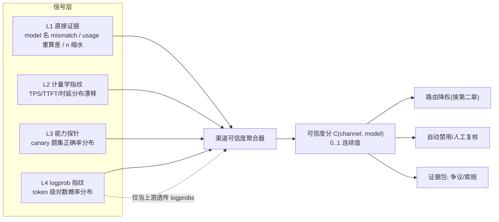
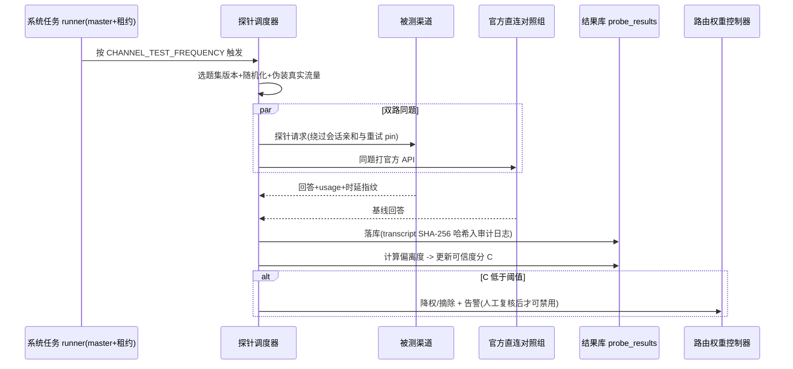
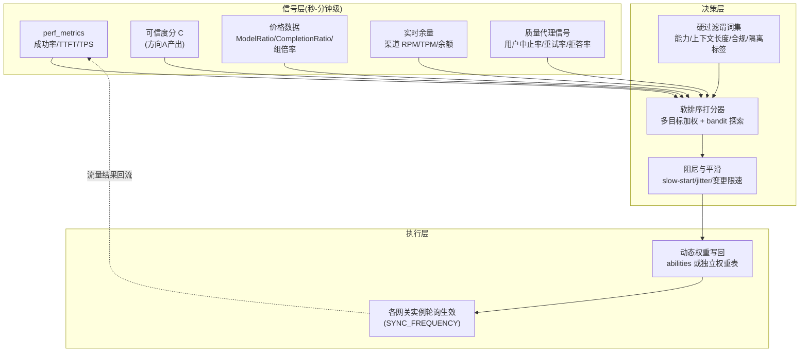
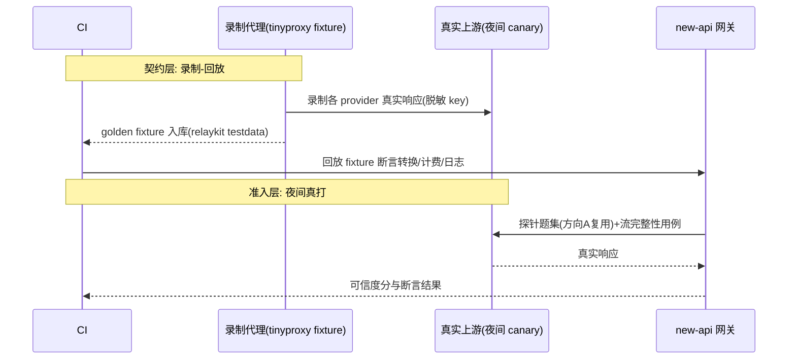
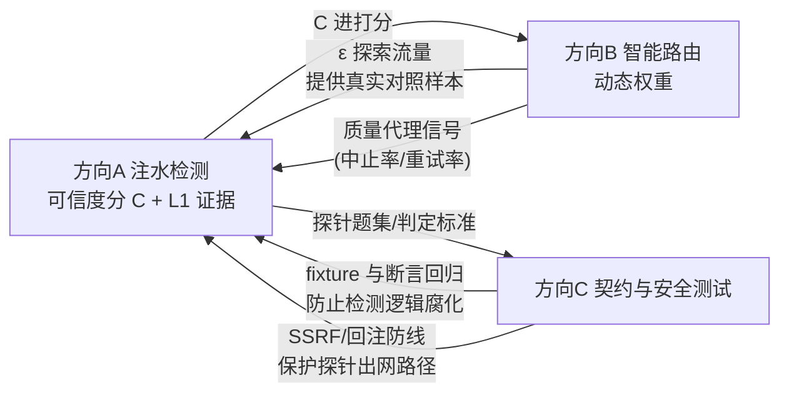

# new-api 上游治理研究设计：注水检测 · 智能路由 · 接入 API 安全测试

> **文档定位**：独立研究设计文档，与 `impl_tech.md`（工程现状与部署设计）平级互补。本文回答 token 中转站运营期的三个深入方向：① 上游接口是否注水（人工降级/调包大模型）；② 智能路由如何按需求自动选路并平衡表现与成本；③ 接入 API 的测试如何设计以防范注入与注水。
>
> **标注约定**：`[现状]` = 当前代码已具备（附 `文件:行号`）；`[需补建]` = 达成目标须新建；`[研究判断]` = 非代码事实的方案取舍。`文件:行号` 基线为 commit `ca2a02760`。
>
> **三块关系**：注水检测（第一章）产出"渠道可信度分"，是智能路由（第二章）的输入数据底座；安全与契约测试（第三章）把前两章的判定固化为可回归的 CI 门禁（第四章给出依赖图）。

---

## 一、研究方向 A：上游注水检测（模型调包 / 降级 / 计量造假）

### 1.1 问题定义：注水的五种形态

| # | 形态 | 表现 | 危害 | 检测难度 |
| --- | --- | --- | --- | --- |
| W1 | **模型调包** | 宣称 `gpt-4o` 实际回源 `gpt-4o-mini`/开源小模型 | 质量塌方 + 计费欺诈 | 中（行为指纹可破） |
| W2 | **量化/蒸馏降级** | 同家族量化版（Q4）冒充全精度 | 长尾任务静默劣化 | 高（需能力探针） |
| W3 | **上下文缩水** | 宣称 128K 实际 32K 后静默截断 | 长文任务结果错误且无报错 | 低（NIAH 探针） |
| W4 | **usage 虚报** | 上游回包 `usage.completion_tokens` 高于实际生成 | 多计费、直接资损 | 低（本地重算比对） |
| W5 | **参数缩水/假流式** | `n=4` 只回 2 张图；`stream:true` 上游实为整段假分块 | 功能欺诈、TTFT 指标失真 | 中（流完整性断言） |

`[研究判断]` 运营站最常见的实际是 W3/W4/W5（成本低、易自动化），W1/W2 是纠纷最大、也最需要证据链的。检测体系按"先易后难、先止损后追责"排序落地。

### 1.2 现有抓手（[现状]）

| 抓手 | 位置 | 对本方向的价值 |
| --- | --- | --- |
| perf_metrics：模型×分组×时间桶的成功率/时延/TTFT/TPS 原子计数，Redis `perf:<model>:<group>:<bucketTs>`（`pkg/perf_metrics/metrics.go:499`）跨实例聚合 | `pkg/perf_metrics/` | W1/W2 的**计量学信号**数据源，无需新建采集 |
| 渠道自动测试定时任务（`CHANNEL_TEST_ENABLED/_FREQUENCY`）+ `ShouldDisableChannel` 自动禁用 | `setting/operation_setting/monitor_setting.go:18-59`、`service/channel.go`、注册于 `main.go:153-158`（master + DB 租约） | 探针子系统的**现成调度壳**：注水探针可注册为新的系统任务 |
| 响应模型名 mismatch 已入日志：上游回包 `model` 与请求模型不一致由名称推导并写进日志 `other` | `relay/common/response_model.go`、`service/log_info_generate.go`（972aed197） | W1 的**直接证据**之一（廉价调包常忘改 model 字段） |
| 本地 prompt token 计数（`CountToken` 默认 true，`common/init.go:188`；`relay/request_billing.go:27`） | `relay/request_billing.go` | W4 重算比对的**左值**已存在，缺右值比对闭环 |
| abilities 路由事实表 `(group, model, channel_id)` + 静态 priority/weight | `model/ability.go` | 处置动作（降权/摘除）的**执行面** |
| 会话亲和（会话→渠道映射，Redis TTL 3600 s）、请求策略（重试/pin/严格会话） | `service/request_policy.go` 等 | 探针流量必须**绕开亲和**，否则测不到目标渠道 |

**核心缺口**：现有渠道测试只验证"能不能通"（连通性 + 简单回复），不验证"是不是它"；usage 只做计费输入，不与本地重算做差异审计；mismatch 日志没有反哺渠道权重。

### 1.3 检测信号体系（四层，按证据强度排序）



- **L1 直接证据（先建，性价比最高）**：
  - model 名 mismatch 计数 → 已有日志字段，只需聚合；
  - **usage 重算闭环** `[需补建]`：响应落库时用本地 tokenizer 重算 completion tokens（流式按累计 chunk 重编码），与上游上报 `usage` 比对，偏差超阈值（如 >5% 且绝对值 >50 tokens）记 `usage_suspect` 事件；注意不同模型 tokenizer 差异，比对基准取"按宣称模型的官方 tokenizer"；
  - `n`/尺寸/时长缩水：图像/视频任务对响应数组长度与 `metadata` 断言（任务插件结算路径已有 `UpdateImageCount` 钩子）。
- **L2 计量学指纹**：同 `(model, group)` 跨渠道对比 TPS/TTFT 分布（分位数而非均值，抗噪）；调包后指纹分布会发生统计显著漂移（KS 检验）。`[研究判断]` 该层只能**报警**不能**定罪**——换部署区域、上游扩容都会漂移。
- **L3 能力探针**：见 1.4。
- **L4 logprob 指纹**：要求上游透传 `logprobs`；对同一 prompt 序列比较 token 级 logprob 分布，接近数学不可伪造，是 W1/W2 最强证据。限制：很多中转/聚合上游剥掉 logprobs 字段——**"是否透传 logprobs"本身就该作为渠道准入测试项**。参照 Log Probability Tracking of LLM APIs（arXiv:2512.03816）与 LLM Fingerprinting 综述仓库（见第五章）。

### 1.4 探针子系统设计与一轮检测时序

题库管理（`[需补建]`，新表 `probe_suites` / `probe_results`）：

| 题集 | 目标 | 示例题型 | 判定 |
| --- | --- | --- | --- |
| 确定性题 | W1/W2 | 固定算术串、逻辑陷阱、知识截止题 | 精确匹配 + 基线对照 |
| 指令遵循 | W2 | 严格 JSON schema、字数约束、多语言 | 规则校验器打分 |
| NIAH | W3 | 在 100K/128K 位置埋针 | 召回率按位置曲线，截断点即真实上下文 |
| 结构化能力 | W1 | function calling、`response_format` | 协议断言 |
| 对照组 | 全部 | 同题打官方 API（OpenAI/Anthropic 直连） | 渠道分 = 与官方分布的偏离度 |

反侦测约束（军备竞赛的底线）：探针流量与真实流量**不可区分**——复用真实 prompt 模板风格、随机抖动窗口、结果题混入正常重试；题库版本化并定期轮换；探针请求打 `metadata` 标记仅内部可见，绝不回显给渠道侧。



要点：探针**不新增调度框架**，注册为既有定时系统任务（复用 master + `system_task_locks` 租约，见 `impl_tech.md` 附录B）；探针失败不计入 perf_metrics 真实流量口径（加 `probe` 标签隔离，否则污染 SLA 指标）。

### 1.5 可信度分与处置分级

`C(channel, model) ∈ [0,1]`，由 L1–L4 加权（L1 证据一票压制：出现 usage_suspect 或 model mismatch 直接封顶 0.5）。处置分四档，避免"检测系统误伤即断客户收入"：

| 档位 | 触发 | 动作 |
| --- | --- | --- |
| 观察 | L2 漂移 | 只记录，加密采样 |
| 降权 | C < 0.8 | 路由权重 ×C（第二章消费） |
| 隔离 | C < 0.6 或 L1 实锤 | 只接灰度标签流量，人工复核 |
| 禁用+追偿 | 复核确认 | `ShouldDisableChannel` 摘除；导出证据包（探针 transcript 哈希、时间窗、对照组数据）支持按渠道合同追偿；对受影响用户走 BillingSession 退款路径 |

`[研究判断]` 自动禁用阈值必须比现有"连通性失败禁用"更保守：注水判定存在假阳性（上游扩容/量化升级都会改变指纹），**L1 之外的一切自动动作只做降权，禁用保留人工闸门**。

### 1.6 局限（诚实声明）

- 军备竞赛无终局：渠道可对已知指纹模型做"探针路由"（识别探测题转真模型）。对策是题库保密 + 真实流量抽样回标，但成本随对抗升级上升。
- logprob 层依赖上游配合；蒸馏小模型（W2）在窄领域题集上可逼近母模型，需要更长尾的题集才能区分。
- 探针本身产生真金白银的上游费用，预算需封顶（每题成本 × 渠道数 × 频率纳入运营账）。

### 1.7 里程碑

- **M1（止损，约 1–2 周）**：L1 三件套——mismatch 聚合、usage 重算比对、n/尺寸缩水断言；纯消费现有日志与计费钩子。
- **M2（报警，约 4 周）**：L2 跨渠道指纹漂移 + 可信度分进路由权重（只降权）。
- **M3（定罪，约 8 周）**：L3 题库 + 对照组 + 证据包导出；L4 视上游 logprobs 可用性立项。

---

## 二、研究方向 B：智能路由（表现 × 成本 × 可信度的自动选路）

### 2.1 现状与差距

`[现状]` 选路 = `abilities` 表静态 `priority/weight`（`model/ability.go`）+ 失败重试换渠道（`RetryTimes`、可重试状态码区间 data-driven）+ 会话亲和（Redis TTL 3600 s）+ 连通性自动禁用。成本、时延、可信度**都不进选路决策**——渠道价格差异靠人工调 priority 兜底。

### 2.2 目标架构：信号 → 决策 → 执行三层控制环



### 2.3 决策函数设计

- **硬过滤（谓词，不可妥协）**：模型能力匹配（vision/tools/streaming/logprobs）、上下文长度 ≥ 请求需求、分组可见性、渠道未被隔离（1.5 档）、用户显式指定模型不改写。
- **软打分**：`score = w_c·cost_norm + w_r·reliability + w_l·latency_norm + w_t·C(channel,model) − w_m·load_soft`。
  - `cost_norm`：该渠道对本请求的**预估结算价**（复用 billingexpr 价格快照，不引入第二套价格口径），归一化到候选集内 [0,1]；
  - `reliability/latency`：直接读 perf_metrics 桶（指数滑动合并多桶，避免 60 s 粒度毛刺）；
  - `load_soft`：活跃连接数软惩罚（HPA 已用 `newapi_active_connections`，同源）。
- **探索项**：`[研究判断]` 起步**不要**上完整 LinUCB/Thompson——先用 ε-greedy（ε 由错误预算反推，建议 ≤2% 流量做同模型跨渠道对照，正好为方向 A 供真实流量样本，一鱼两吃）；bandit 形态留到权重表稳定后演进。
- **质量代理指标**是成本项的刹车：没有它，纯成本最优会系统性把流量赶向最差可用渠道。中止率/重试率/拒答率 `[需补建]` 从现有日志聚合即可，无需客户端埋点。

### 2.4 多实例一致性：本项目最大的工程约束

`[现状]` 配置/缓存一致性靠轮询（`SYNC_FREQUENCY` 默认 60 s），没有集中式路由决策面。这决定了：

- **不做请求级实时决策面**（引入 gRPC 控制面或强一致外置状态=新单点，违背 99.95 预算）；决策周期取**分钟级**，实例本地执行同一份权重表，天然一致。
- **防羊群/震荡**：所有实例同时把流量甩向"当前最优"渠道会把它打死再引发回摆。三重阻尼：① 权重变更限速（单渠道每周期变化 ≤20%）；② 实例侧 jitter（生效时间加随机 0–30 s 摊平）；③ 新目标渠道 slow-start（接入速率爬坡，语义对齐 ALB 的 `slow-start-enabled`）。
- **会话粒度锁定**：会话亲和与全局最优天然冲突——`[研究判断]` 保持会话内不换渠道（前缀缓存命中与体验一致性优先），只在**新会话**上应用新权重；长会话结束后权重自然生效。

### 2.5 分阶段上线（与灰度体系复用）

| 阶段 | 模式 | 回滚 |
| --- | --- | --- |
| B-1 影子 | 只算不切：决策日志 vs 实际选路 diff 报表 | 无风险 |
| B-2 建议 | 控制器产出权重建议，人工审批后经现有渠道管理界面写回（变更走 impl_tech.md 轨道 A 业务灰度） | 一键还原快照 |
| B-3 自动 | 预算护栏内自动写回（错误预算消耗 >50% 时冻结自动调权，退回 B-2） | 熔断回退静态 priority |

### 2.6 里程碑

- **M1（2–3 周）**：影子模式 + 成本项打分（价格数据现成），产出 diff 报表验证正确性。
- **M2（+4 周）**：建议模式上线，接入可信度分 C（依赖方向 A M2）与质量代理信号。
- **M3（+8 周）**：预算护栏内的自动模式；ε-greedy 探索流量正式为方向 A 供样本。

---

## 三、研究方向 C：接入 API 的测试设计（防注入 + 防注水）

### 3.1 攻击面与现有防线盘点

| 面 | 攻击 | `[现状]` 防线 | 缺口 `[需补建]` |
| --- | --- | --- | --- |
| SSRF | 图像/视频/文档接口的 URL 参数打内网（169.254.169.254、RDS 内网地址） | `service.GetSSRFProtectedHTTPClient()`（`controller/video_proxy.go:225`）、fetch 设置 `EnableSSRFProtection`、重定向白名单 `common.ValidateRedirectURL`（`controller/topup_stripe.go:86-91`）+ `TrustedRedirectDomains`（`constant/env.go:30`） | 逐个透传 URL 字段建**清单化回归**：新增渠道/字段默认进 SSRF 用例矩阵；DNS rebinding（解析后二次校验 IP）用例 |
| 回调伪造 | 伪造 stripe/epay notify 给账户充值 | 签名校验路径 + AGENTS.md OWASP 强制流程 | 重放攻击用例（同签名二次通知必须幂等——`subscription_pre_consume_records.request_id` 唯一索引模式推广到充值） |
| 上游响应回注 | 恶意上游在 content/reasoning_content 里塞 prompt 注入、playground 渲染载荷 | 前端渲染按文本处理 | 上游响应视为**不可信输入**的契约：日志注入（伪造 ANSI/换行）、XSS 载荷不进 DOM（playground 富文本若引入 markdown 渲染必须 sanitize 回归）；参照 Greshake et al. 间接提示注入（arXiv:2302.12173）与 OWASP LLM Top10 LLM01 |
| 协议走私 | 畸形 JSON/multipart、超长 body、header 注入、非法 UTF-8 | `MAX_REQUEST_BODY_MB`（`common/init.go:184`、`common/request_body_limit.go`）、form UTF-8 校验（中间件层）、relaykit DTO 严格解析 | 定向 fuzz（见 3.3）；HTTP 请求走私（CL.TE）依赖 ALB 前置，需网关自身 100-continue 行为用例 |
| 计费表达式注入 | model_mapping、billingexpr 表达式、分组倍率作为作者可控输入 | billingexpr 自有表达式引擎（非 eval） | 表达式资源上限用例（超长/深嵌套/死循环型表达式必须有步数/深度封顶）；mapping 环检测 |
| 流完整性 | 假流式（整段一个 chunk）、截断流、usage chunk 造假、`n` 缩水 | 流扫描器有超时与状态机（`relay/helper/stream_scanner.go`） | 3.2 的流断言集 |

### 3.2 防注水 = 把第一章的 L1 证据固化为契约测试

- **模型回声断言**：`response.model` 与请求模型一致性（`relay/common/response_model.go` 已产出 mismatch 事实）——测试侧把它变成每个渠道适配器的**必断言项**。
- **usage 重算断言**：`completion_tokens` 本地重算 vs 上报值，偏差分布作为渠道准入门槛（方向 A M1 的测试化）。
- **参数保真 property test**（relaykit 是理想落点，独立模块可单测）：对 40+ 协议的 DTO 转换写属性测试——`max_tokens/n/temperature/stream_options/tools` 经"客户端→上游→客户端"往返后**不得丢失或篡改语义**；显式 0 值与缺省的区分正是 AGENTS.md 指针类型规则的可执行化。
- **流完整性断言集**：chunk 单调性（index/finish_reason 至多一次）、累计内容与最终 usage 一致性、`n` 与数组长度、假流式检测（首末 chunk 间隔分布退化为一跳即标记）。

### 3.3 测试金字塔与 harness



- **录制-回放 harness** `[需补建]`：MITM 代理抓取上游真实响应 → 脱敏 → golden fixture；把"每个 provider 适配器"的测试从 mock 升级为**字节级真实样本**回放。这是对 40+ 渠道适配最可持续的投入（AGENTS.md 禁止 mock 掩盖真实行为的方向一致）。
- **定向 fuzz**：入口选 DTO 解析与 multipart 解析（`common.Unmarshal` 封装点、relaykit 转换函数），种子取真实流量采样；崩溃/内存放大/语义漂移（解析后再序列化不等价）三类 oracle。
- **边界用例矩阵**：body 上限 ±1、`n`/`max_tokens` 族协议极值（各 provider 上限不同，防"校验放在网关还是上游"的双盲）、非法 UTF-8/超长 header。
- **CI 门禁分层**：PR 级跑契约+property+边界矩阵（分钟级）；夜间跑真打 canary；周级跑三数据库矩阵（沿用 AGENTS.md 既有强制要求，不另造）。

### 3.4 OWASP 对齐

`[研究判断]` 本章测试设计映射：OWASP LLM Top 10 之 LLM01（提示注入→响应回注面）、LLM05（improper output handling→sanitize 契约）、LLM10（unbounded consumption→计费表达式资源封顶 + 探针预算）；支付回调与账户路径沿用 AGENTS.md 已强制的 ASVS/认证 Cheat Sheet 流程，不重复展开。

### 3.5 里程碑

- **M1（2 周）**：usage 重算断言 + 模型回声断言 + 流完整性断言集（全部消费方向 A M1 的钩子）。
- **M2（+4 周）**：录制-回放 harness 覆盖 Top 10 渠道；SSRF/回调矩阵进 CI。
- **M3（+6 周）**：relaykit property test + DTO fuzz 常态化。

---

## 四、三块联动与总体路线图



依赖顺序即落地顺序：**A-M1（L1 止损）与 C-M1（断言化）同源共建**，随后 A-M2 → B-M2（可信度进权重）→ B-M3（自动调权）→ A-M3（定罪与追偿）。全程复用既有基础设施：系统任务租约（调度）、perf_metrics（信号）、abilities（执行面）、BillingSession（退款闭环）。

| 季度 | 交付 |
| --- | --- |
| Q1 | A-M1 + C-M1：usage 重算、mismatch 聚合、流断言进 CI |
| Q2 | A-M2 + B-M1/B-M2：指纹漂移报警、路由影子→建议模式 |
| Q3 | A-M3 + B-M3 + C-M2：题库定罪与追偿、自动调权（预算护栏）、录制-回放全覆盖 |
| Q4 | C-M3：property test + fuzz 常态化；年度对抗评审（题库轮换、阈值重标定） |

## 五、实施实战手册（可直接照做）

> 本章把前三章的设计压成可执行的落点：表结构、代码挂点、公式参数、题集样例、payload 清单、CI 配置。所有计费相关动作遵守 `.agents/rules/billing.md`：**检测与审计只读不改结算**；任何要改变计费数量的动作必须走既有链路（`RelayInfo.UpdateImageCount`、`common/quota_math.go` 的 `*Checked` 助手、`attachQuotaSaturation` 留痕）。

### 5.1 方向 A 落地包（注水检测）

#### 5.1.1 数据模型（GORM，三库兼容）

新增三张表，放 `model/`，随 master AutoMigrate 建表。规则：主键交给 GORM（不写 AUTO_INCREMENT/SERIAL）、JSON 列用 `serializer:json`（TEXT 存储，跨库安全）、不加布尔默认值 tag（业务默认在构造/服务层设置）：

```go
// model/channel_probe.go
type ProbeSuite struct {
    ID        uint   `gorm:"primaryKey"`
    Version   string `gorm:"type:varchar(32);uniqueIndex"` // "2026Q4-01"，题库版本化轮换
    Kind      string `gorm:"type:varchar(16);index"`       // deterministic|instruction|niah|capability
    Items     string `gorm:"serializer:json"`              // []ProbeItem{ID,Prompt,Checker,EstTokens}
    CreatedAt int64
}

type ProbeResult struct {
    ID          uint   `gorm:"primaryKey"`
    ChannelId   int    `gorm:"index:idx_probe_main,priority:1"`
    ModelName   string `gorm:"type:varchar(128);index:idx_probe_main,priority:2"`
    SuiteVer    string `gorm:"type:varchar(32);index:idx_probe_main,priority:3"`
    ItemId      string `gorm:"type:varchar(64)"`
    Pass        int    // 0/1，不用 bool 默认值语义
    Score       float64
    LatencyMs   int64
    Tps         float64
    UpstreamTok int    // 上游上报 usage
    LocalTok    int    // 本地按宣称模型 tokenizer 重算
    TranscriptHash string `gorm:"type:varchar(64)"` // SHA-256(transcript)，原文另存 OSS
    StartedAt   int64  `gorm:"index"`
}

type ChannelCredibility struct {
    ChannelId int    `gorm:"primaryKey"`
    ModelName string `gorm:"type:varchar(128);primaryKey"`
    Score     float64 // EWMA 后的可信度分 C
    Tier      int     // 0观察 1降权 2隔离 3禁用+追偿
    L1Veto    int     // 0/1 出现直接证据则封顶
    UpdatedAt int64
}
```

#### 5.1.2 usage 重算比对钩子（只审计，不动结算）

挂点在**结算完成之后**旁路比对，不进入计费链路：

- 文本：`service/text_quota.go` 拿到上游 `usage` 处，把 `prompt_tokens/completion_tokens` 与 `relayInfo` 上本地计数（`relay/request_billing.go:27` 已有 prompt 侧）配对，异步投递审计事件；completion 侧流式用累计 chunk 重编码。
- 图像：数量判定**只信** `openaiImageResponseCount` 同规则的载荷推导（禁止 `data.#`/`len(data)` 计数，见 billing 规则），把"宣称 n vs 实收载荷数"记事件；改结算数量仍只经 `RelayInfo.UpdateImageCount`。
- 偏差判定：`dev = (upstream - local) / max(local,1)`；`dev > 0.05 且 upstream-local > 50` 连续 3 个时间窗 → 写 `usage_suspect` 事件。
- 留痕方式复用 saturation 模式：事件嵌套写入消费日志 `other.admin_info.usage_audit`（admin 视图专属，普通用户日志自动剥离），并 `logger.LogWarn` 带 request_id。

```go
// service/usage_audit.go —— 伪代码骨架
func AuditUsageAgainstLocal(info *relaycommon.RelayInfo, upstreamUsage, localUsage types.TokenParams) {
    if !setting.UsageAuditEnabled { return }            // 灰度开关，默认关
    dev := float64(upstreamUsage.CompletionTokens-localUsage.CompletionTokens) /
           math.Max(float64(localUsage.CompletionTokens), 1)
    if dev > 0.05 && upstreamUsage.CompletionTokens-localUsage.CompletionTokens > 50 {
        recordUsageSuspect(info, dev)                   // 计数进 Redis: usage_suspect:<ch>:<model>
        attachUsageAudit(info, dev)                     // 写 other.admin_info.usage_audit
    }
}
```

#### 5.1.3 探针任务注册（复用系统任务租约）

```go
// service/channel_probe.go —— 注册进既有 runner（master + 租约，见 impl_tech.md 附录B）
func init() {
    controller.RegisterScheduledSystemTaskHandler("channel_probe", &ChannelProbeHandler{})
}
func (h *ChannelProbeHandler) Run(ctx context.Context) error {
    for _, target := range probeTargets() {            // (channel, model) 清单来自 abilities
        suite := loadRotatedSuite(target.ModelName)    // 版本轮换 + 真实流量混入
        for _, item := range suite.Items {
            resp, ref := probeChannel(target, item), probeReference(target.ModelName, item) // 双路同题
            persistProbeResult(target, suite.Version, item, resp, ref)
        }
    }
    recomputeCredibility()                              // 5.1.5 公式
    return nil
}
```

约束：探针请求 `Stream:false`、跳过会话亲和与重试 pin（构造独立 `RelayInfo`，打 `probe` 标签）；perf_metrics 聚合侧过滤 probe 标签，防止污染 SLA 口径；频率起步 `每天 1 轮/渠道×模型`，告警复核期加密到 4 小时。

#### 5.1.4 题库样例（首发 12 题中的 6 题，判分规则即代码）

| # | 类型 | 题面（节选） | 判定 |
| --- | --- | --- | --- |
| D1 | 确定性算术 | "依次计算 17*23, 1024/7(取整), 97 XOR 58，仅输出三个整数逗号分隔" | 精确匹配 `391,146,95` |
| D2 | 逻辑陷阱 | "树上有 5 只鸟，开枪打死 1 只，还剩几只？要求只答数字并给一句理由" | 答案含 `0` 且理由提及惊飞 |
| D3 | 知识截止 | "以下哪个事件发生在 2024 年 6 月之后？选项含 3 个此前事件" | 单选正确率；小模型常在此类翻车 |
| I1 | 指令遵循 | "输出恰好 3 个 bullet，每行以 `- ` 开头且 ≤ 6 个词，主题是队列" | 规则校验器（行数/前缀/词数） |
| N1 | NIAH | 在 100K token 填充文本的第 12%/50%/88% 位置各埋 `针: 紫色海马-7412`，问三针编号 | 召回率-位置曲线，断点即真实上下文长度 |
| C1 | function calling | 强制 tools 调用 `get_weather(city)` | `tool_calls` 结构断言，非文本匹配 |

题库保密与轮换：版本季度轮换 30%；每渠道实际出题 = 题集 ∪ 真实流量脱敏采样（1:4），使探测不可被枚举。

#### 5.1.5 可信度分公式（可直接实现）

```text
单轮分  c_t = 0.5·A_usage + 0.2·A_mismatch + 0.2·A_probe + 0.1·A_fp
  A_usage    = 1 - min(1, Σsuspect_tokens / Σbilled_tokens)      # usage 偏差率
  A_mismatch = 1 - min(1, mismatch_count / 100_resp)             # 模型名回声
  A_probe    = 渠道题分 / 官方对照组题分（同版本题集，截断到 [0,1.05] 再 min 1）
  A_fp       = 1 - KS(渠道 TPS/TTFT 分布, 同模型跨渠道合并分布)   # 只报警不定罪，权重最低
EWMA     C_t = 0.9·C_{t-1} + 0.1·c_t     （每天一轮，≈一周收敛）
L1 否决  若近 7 天 usage_suspect ≥3 窗 或 mismatch 率 >1% → C = min(C, 0.5)，Tier≥2
分档     C≥0.9 观察 | 0.8≤C<0.9 降权(权重×C) | 0.6≤C<0.8 隔离 | C<0.6 或人工实锤 禁用+追偿
```

#### 5.1.6 告警处置 Runbook（值班可直接执行）

1. 收到 `credibility_drop`（ΔC>0.15/24h）→ 打开渠道详情面板（数据源 `probe_results` 按 `suite_ver` 分组）。
2. 区分假阳性：核对官方对照组当日是否同跌（上游全局降级）、渠道是否公告扩容/量化升级。
3. 实锤路径：导出证据包——`probe_results` 行 + `transcript_hash` 对应 OSS 原文 + usage 审计事件 + 时间窗计费单号，JSON 固定字段 `{channel_id, model, suite_ver, window, items[], usage_events[], billing_refs[]}`。
4. 追偿：按渠道合同条款引用证据包；对受影响用户批量退款走 BillingSession 既有退款链路（request_id 幂等，禁止直改余额）。
5. 恢复：Tier 降级需连续 3 天 C≥阈值 + 人工确认；`channel_credibility` 变更全部进审计日志。

#### 5.1.7 探针成本预算（示例参数）

20 渠道 × 3 重点模型 × 12 题 × 日均 1 轮 × 平均 1.2K token/题 ≈ 864K token/天；按宣称模型批发价折算控制在 **≤ $15/月**；超出则 NIAH 类长文题降频为周级。

### 5.2 方向 B 落地包（智能路由）

#### 5.2.1 权重表与写回接口

不动 `abilities.priority`（保留为人工兜底），新增覆盖层：

```go
// model/route_weight.go
type RouteWeight struct {
    GroupName string `gorm:"type:varchar(64);primaryKey"`
    ModelName string `gorm:"type:varchar(128);primaryKey"`
    ChannelId int    `gorm:"primaryKey"`
    Weight    int    // 0-100，0=暂时摘除（非禁用）
    Mode      int    // 1影子 2建议 3自动，按 (group,model) 粒度渐进放量
    UpdatedAt int64
}
```

选路读取顺序：`RouteWeight(mode=3)` > `abilities.priority/weight`。写回仅两个入口：控制器进程（mode=3，带限速）与 admin API `PUT /api/admin/route_weight`（人工，走现有审计）。

#### 5.2.2 决策环伪代码（分钟级，独立 Deployment 运行）

```go
// 每 60s 一轮；实例唯一（复用 system_task_locks 租约，任务名 route_weight_loop）
for range time.Tick(60 * time.Second) {
    for gm := range activeGroupModelPairs() {
        cands := hardFilter(gm)                        // 能力/上下文/合规/Tier!=隔离
        if len(cands) < 2 { keepStatic(); continue }   // 候选不足回退静态
        scores := map[int]float64{}
        for _, ch := range cands {
            scores[ch] = 0.35*costNorm(ch, gm) +       // billingexpr 价格快照归一化
                         0.30*reliability(ch, gm) +    // perf 5min EWMA 成功率
                         0.15*latencyNorm(ch, gm) +    // TTFT p50 反向归一
                         0.20*credibility(ch, gm)      // 5.1.5 的 C
            scores[ch] -= loadPenalty(ch)              // 活跃连接 > 软阈值时线性扣分
        }
        w := softmaxToWeights(scores, 0.15)
        w = rateLimit(w, prev)                         // 单渠道 Δw ≤ 20%/轮
        if burnRate24h() > 2 { continue }              // 错误预算护栏：冻结自动写回
        if mode(gm) == 3 { saveWeights(w) }            // 1/2 只落影子/建议表
    }
}
```

生效侧：网关实例经既有 `SYNC_FREQUENCY` 轮询拉取（把 `route_weight` 纳入同步集），实例本地在拉取时刻加 0–30 s 随机 jitter 再切换；新上量渠道 slow-start：3 档爬坡 30%→60%→100%，每档 2 个周期。

#### 5.2.3 参数速查

| 参数 | 起步值 | 调整依据 |
| --- | --- | --- |
| 打分权重 w_c/w_r/w_l/w_t | 0.35/0.30/0.15/0.20 | 影子模式 diff 报表回归后重标定 |
| softmax temperature | 0.15 | 越小越贪心；防羊群不宜 <0.1 |
| 单轮调权上限 | 20% | 事故复盘可调至 10% |
| 探索 ε | 2%（错误预算反推） | 同时为方向 A 供样本 |
| 冻结阈值 | 24h burn rate > 2× | 触发即回 mode=2 |
| reliability EWMA | λ=0.85/5min 桶 | 与 perf 桶对齐 |

#### 5.2.4 影子模式验收（B-1 阶段的量化出口条件）

diff 报表口径：消费日志实际 `channel_id` 分布 vs 影子表推荐分布，按 `(group, model)` 输出 KL 散度、预估成本节省、预估 TTFT 变化。出口条件：影子运行 ≥2 周；推荐分布若生效预估成本 −8% 以上、成功率不降、且每日人工抽检 3 个会话簇无体验异常 → 进入 mode=2。

### 5.3 方向 C 落地包（契约与安全测试）

#### 5.3.1 录制-回放 harness

录制（一次性接入现有 e2e 环境）：

```python
# deploy/testtools/record_fixtures.py
# 用法: mitmdump -s record_fixtures.py --set uphosts=api.openai.com
import json, os, hashlib
from mitmproxy import http

ALLOW = {"prompt", "model", "stream", "n", "max_tokens", "temperature"}

def response(flow: http.HTTPFlow):
    if "chat/completions" not in flow.request.pretty_url:
        return
    body = flow.response.get_content()
    req = json.loads(flow.request.get_content() or b"{}")
    sha = hashlib.sha256(body).hexdigest()[:16]
    path = f"fixtures/{flow.request.pretty_host}/{sha}.json"
    os.makedirs(os.path.dirname(path), exist_ok=True)
    with open(path, "wb") as f:
        f.write(body)                       # 原样字节级保存，防"整理"失真
    with open(path + ".meta.json", "w") as f:
        json.dump({"url": flow.request.pretty_url,
                   "req_public": {k: v for k, v in req.items() if k in ALLOW},
                   "status": flow.response.status_code}, f)   # key/敏感字段天然不落盘
```

回放测试骨架：Go 测试起 httptest.Server 按 `.meta.json` 的 URL 路由返回 fixture 字节流（含分块 SSE 重放），渠道适配器 base_url 指向它，断言：转换后响应、`usage` 计费量、日志 `other` 字段三者与 golden 一致。fixture 目录 `relay/channel/<name>/testdata/fixtures/`，随渠道 PR 增量维护。

#### 5.3.2 SSRF 用例矩阵（所有"网关会代 fetch URL"的字段逐一过表）

覆盖入口：图像/视频 `url`、`image_url.url`、文档解析、任务结果转存、bark/gotify 通知 URL、支付 `success_url/cancel_url`。

| payload | 期望 |
| --- | --- |
| `http://127.0.0.1:6379/`、`http://localhost:3306` | 4xx，且日志无内网响应回显 |
| `http://169.254.169.254/latest/meta-data/`（AWS）、`http://100.100.100.200/`（**阿里云 metadata，本项目部署环境必测**） | 4xx |
| `http://[::1]/`、`http://2130706433/`、`http://0x7f000001/` | 4xx（十进制/十六进制/IP 编码绕过） |
| `http://rbndr.us/`（DNS rebinding，两次解析先公网后 127.0.0.1） | 4xx——要求防护客户端**解析后以固定 IP 拨号**，非仅校验字面 |
| `file:///etc/passwd`、`gopher://`、`dict://` | scheme 白名单外一律拒绝 |
| 302 跳转到内网（外网 URL → Location: 127.0.0.1） | 每一跳重校验（`ValidateRedirectURL` + `TrustedRedirectDomains` 语义） |
| VPC 内网段 `http://10.x/`、`172.16-31.x`、`192.168.x` | 4xx；`TRUSTED_PROXIES` 网段不可作为放行依据 |

#### 5.3.3 回调与重放用例

| 用例 | 断言 |
| --- | --- |
| stripe webhook 错签名 / 空签名 | 4xx，无余额变动，审计记录含来源 IP |
| 同签名 notify 重放 ×3 | 幂等：仅一次入账（参照 `subscription_pre_consume_records.request_id` 唯一索引模式，充值单同样建唯一业务键） |
| 金额篡改（改 body 保留旧签名） | 验签失败即 4xx |
| 回调源 IP 伪造 XFF | 限流与审计取真实来源 |

#### 5.3.4 fuzz 目标与种子

```go
// relay/relay_format_fuzz_test.go
func FuzzOpenAIRequestParse(f *testing.F) {
    f.Add([]byte(`{"model":"gpt-4o","messages":[{"role":"user","content":"hi"}],"n":2}`))
    f.Add([]byte(`{"model":"","messages":[],"max_tokens":99999999999,"n":-4}`))
    f.Add([]byte(`{"model":"m","messages":[{"role":"u","content":"\u0000🤷"}],"stream_options":{"include_usage":true}}`))
    f.Fuzz(func(t *testing.T, body []byte) {
        var req dto.GeneralOpenAIRequest
        if err := common.Unmarshal(body, &req); err != nil { return }   // 拒绝即通过
        boundsCheck(t, &req)                                            // n/max_tokens 越界必须已被 validator 拦下
        again, _ := common.Marshal(&req)
        semanticRoundTrip(t, body, again)                               // 显式 0 值不得丢失（指针语义）
    })
}
```

oracle 三类：panic、`*uint` 巨大正数未被上界拦截（billing 规则明令）、marshal 往返丢语义。`go test -fuzz=FuzzOpenAIRequestParse -fuzztime=10m` 进 nightly；PR 只跑种子语料。

#### 5.3.5 CI 门禁分层

```yaml
# .github/workflows/upstream-governance.yml
name: upstream-governance
on:
  pull_request:
    paths: ["relay/**", "service/**", "pkg/perf_metrics/**", "model/**"]
jobs:
  contract:
    runs-on: ubuntu-latest
    steps:
      - uses: actions/checkout@v4
      - uses: actions/setup-go@v5
        with: { go-version-file: go.mod }
      - run: go test ./relay/... ./service/... -run "Contract|UsageAudit|RouteWeight" -count=1
      - run: cd relaykit && GOWORK=off go build ./... && go test ./... -run Property
```

三数据库矩阵沿用 AGENTS.md 既有强制流程，不在此重复；新增表（5.1.1/5.2.1）首次落地时必须走一遍 fresh + upgrade 双场景迁移验证（迁移至少跑 2 次证明幂等，见 impl_tech.md 数据库规则）。

---

## 六、12 周落地 SOP（周级 checklist）

| 周 | 交付 | 验收动作 |
| --- | --- | --- |
| W1 | `usage_audit` 旁路比对（5.1.2）灰度 5% 流量；mismatch 聚合查询上线 | 审计事件量、误报率 <1% |
| W2 | 三张表迁移（三库 fresh+upgrade 验证）；图像 n 缩水断言 | 迁移幂等跑 2 次；golden 用例过 |
| W3 | 探针任务注册 + 首发 12 题题库；对照组官方直连账户就位 | 单轮探针全链路跑通，成本入账 |
| W4 | 可信度分公式 + 分档动作（只到"降权"档，禁用仍人工） | 值班 Runbook 演练一次 |
| W5 | 录制 harness 覆盖 Top5 渠道；SSRF 矩阵全入口过一遍 | 发现项按严重级排修复 |
| W6 | 回调重放幂等用例 + 唯一业务键补齐 | 重放测试全绿 |
| W7 | 路由影子模式（mode=1）+ diff 报表 | KL/成本/TTFT 三列日报 |
| W8 | L2 指纹漂移报警（KS）接入告警渠道 | 一周告警噪声评审，调阈值 |
| W9 | mode=2 建议模式：人工审批写回 `route_weight` | 审批 SLA ≤1 工作日 |
| W10 | property test（参数保真表）+ fuzz 种子语料进 PR 门禁 | CI 时长增幅 <3 min |
| W11 | mode=3 自动调权灰度：先 1 个低价值 group；护栏 burn-rate 冻结演练 | 故障注入演习：模拟渠道被打死，观察阻尼 |
| W12 | 季度对抗评审：题库轮换 30%、阈值重标定、SOP 复盘 | 输出下季度预算与目标 |

---

## 七、参考资料

- [Log Probability Tracking of LLM APIs（logprob 追踪检测模型漂移/替换）](https://arxiv.org/html/2512.03816v1)
- [Awesome-LLM-Fingerprinting（模型指纹/调包检测论文列表）](https://github.com/shaoshuo-ss/Awesome-LLM-Fingerprinting)
- [Greshake et al., Not what you've signed up for: Compromising Real-World LLM-Integrated Applications with Indirect Prompt Injection (arXiv:2302.12173)](https://arxiv.org/abs/2302.12173)
- [OWASP Top 10 for LLM Applications](https://owasp.org/www-project-top-10-for-large-language-model-applications/)
- [OWASP Authentication Cheat Sheet](https://cheatsheetseries.owasp.org/cheatsheets/Authentication_Cheat_Sheet.html)（回调/账户路径沿用 AGENTS.md 强制流程）
- 仓库内：`impl_tech.md`（架构现状、附录B 任务租约与 master 容灾）、`.agents/rules/billing.md`（计费不变量）

---

**文档结束。** 本文给出注水检测（五类注水 × 四层信号 × 分级处置）、智能路由（三层控制环 + 多实例阻尼 + 影子/建议/自动三阶段）、接入 API 测试（攻击面矩阵 + 契约断言 + 录制-回放/property/fuzz 金字塔）三个方向的完整研究设计，并给出依赖顺序与四个季度路线图；第五章为可直接照做的实施实战手册（表结构、代码挂点、公式参数、题集样例、SSRF payload 清单、CI 门禁），第六章为 12 周落地 SOP；所有 `[现状]` 断言附 `文件:行号` 基线 commit `ca2a02760`，`[需补建]` 项进入排期前须按 AGENTS.md 的计费/数据库/测试规则重新评审。
